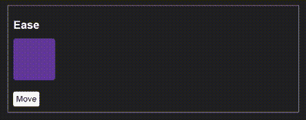
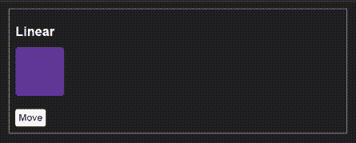
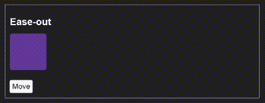
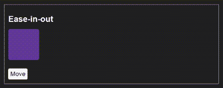

# CSS 过渡:动画切换按钮

> 原文：<https://blog.logrocket.com/css-transitions-animating-hamburger-menu-button/>

***编者按:**本文于 2021 年 9 月更新相关信息。*

网络动画的作用远远不止是一件装饰品。你可以用它来引导 web 访问者的注意力，组织信息并使其更容易消化，使加载内容感觉更快更有趣，等等。

在你的前端开发工具包中使用 CSS 转换，你将能够在一行代码中添加技巧并改善用户在网络上的体验。在这里，您将了解 CSS 转换何时对您的项目是一个好的选择，以及如何实现它们来美化您的网站。在本文结束时，您将已经使用 CSS 转换在切换按钮上创建了变形动画。

我们开始吧！

## CSS 过渡与关键帧动画

你可以单独用 CSS 添加平滑的运动效果，不需要 JavaScript，无论是用 [CSS 过渡](https://www.w3.org/TR/css-transitions-1/)还是 CSS [关键帧动画](https://www.w3.org/TR/css-animations-1/)。它们在性能方面都很高效，尤其是如果你制作了[不透明度](https://developer.mozilla.org/en-US/docs/Web/CSS/opacity)和[转换](https://developer.mozilla.org/en-US/docs/Web/CSS/transform)属性的动画，这是浏览器非常擅长优化的。

### CSS 过渡

转换允许您将属性值从初始状态更改为最终状态，以响应事件，例如鼠标输入、鼠标输出、单击等。这意味着，如果你的动画只有这两种状态，CSS 转换将是你可以使用的最好和最简单的工具。过渡的常见用例包括在悬停或鼠标点击时滑入和滑出画布外的侧边栏，在悬停时改变链接或按钮颜色，响应于按钮点击而淡入或淡出对话框，等等。

使用过渡的另一个优点是优雅的降级:如果出现错误或者浏览器不支持它们，最坏的情况是元素会突然改变状态，而不是逐渐改变。

### CSS 动画

如果您计划创建动画，它不仅仅有开始和结束状态，并且您希望对所有中间状态中发生的事情有更多的控制，那么 CSS 关键帧将更适合您的项目。

关键帧动画的用例包括加载器，它在页面加载后立即开始播放，并无限期地继续播放，直到所请求的页面资源准备好显示在屏幕上。

## 用 CSS 创建转场`transition-property`

您可以使用简写的`transition`属性以如下形式创建转换:

```
transition: property duration transition-timing-function delay;
```

以速记形式编写过渡看起来像这样:

```
.box {
 transition: background-color 0.5s ease-in 0.3s;
}
```

或者，您可以使用单个属性编写一个过渡，如下所示:

```
.box {
transition-property: background-color;
transition-duration: 0.5s;
transition-timing-function: ease-in;
transition-delay: 0.3s;
}
transition-property
```

`transition-property`是您希望应用过渡的 CSS 属性的名称。这可以是任何 CSS 动画属性，如颜色、高度、宽度等。在我们的例子中，我们想把它应用于`background-color`。并非所有的 CSS 属性都可以转换，但有几个可以，特别是那些用数值表示的属性。

要创建一个动画，你需要一个初始状态和一个最终状态。可制作动画的属性是插值的，这意味着可以计算初始状态和最终状态之间的数字，以创建在指定持续时间内创建动画所需的值。如果值为`auto`，则不能对属性应用过渡。

让我们看一个例子。假设我们想在用户悬停在某个元素上时，将该元素的背景色从白色(开始状态)转换为黑色(结束状态)。我们会这样写:

```
.box {
  width:200px; 
  height: 200px;
  background-color: #fff;
  transition: background-color .5s;
}
.box:hover{
  background-color: #000;
}

```

通过使用逗号分隔的列表，可以在同一个声明中转换多个属性。假设我们想改变一个盒子的大小。我们需要改变`width`和`height`的值。

```
.box {
  width: 400px;
  height: 400px;
  transition: width 1s ease-in, height 1s ease-in;
}

.box:hover {
  width: 500px;
  height: 500px;
}

```

如果您计划转换一些属性，您可以考虑使用关键字`all`。这将把过渡应用到为所选元素指定的所有动画属性。只有在对所有属性应用相同的`transition-duration`和`transition-timing function`时，这样做才有意义。

在我们的例子中，我们正是这样做的。过渡持续时间是`1s`，而`transition-timing-function`是`ease-in`。所以，我们可以将其简化为:

```
.box {
  width: 400px;
  height: 400px;
  transition: all 1s ease-in;
}

.box:hover {
  width: 500px;
  height: 500px;
}

```

## 在 CSS 中使用`transition-duration`属性

属性表示 CSS 属性从初始值转换到最终值所花费的时间。您可以用秒(1s)或毫秒(1000ms)来表示值。

### 执行`transition-timing-function`指定过渡的速度曲线

`Transition-timing-function`指定过渡效果的速度曲线。如果您希望过渡看起来自然流畅，这个属性是至关重要的。速度曲线由一个`[<easing-function>](https://developer.mozilla.org/en-US/docs/Web/CSS/easing-function)`定义，这是一个数学函数，描述了数值随时间变化的速率。为了简单起见，您可以使用预定义的关键字，例如`transition-timing-function: linear;`。

缓动功能如下:

*   `Ease`:这是默认值。它开始缓慢，然后加速，然后减速，最后非常缓慢地结束



*   变化率保持不变



*   开始时很慢，然后逐渐加速


*   开始很快，然后慢下来



*   开始很慢，中间快一些，到最后慢下来。它类似于缓和，但结尾没有那么慢



或者，您可以通过三次贝塞尔曲线(p1，p2，p3，p4)创建您的自定义缓动函数，其中点`p1`和`p3`的值必须在`0`到`1`的范围内，例如`transition-timing-function: cubic-bezier(.29, 1.01, 1, -0.68);`。你可以使用像 cubic-bezier.com 这样的工具来帮助你想象不同的价值观是什么样子，以达到你想要的效果。

### `transition-delay`属性

`transition-delay`属性表示在开始持续时间之前您想要等待的时间。您可以用秒或毫秒来表示这个值，就像`duration`属性一样。

在本教程中，您将使用`shorthand`属性。请记住，持续时间是唯一必需的值，所有其他属性都有默认值。`transition-property`默认为`all`，`transition-timing-function`默认为`ease`，`transition-delay`默认为`0s`。如果为持续时间和延迟添加两个值，浏览器会将第一个值解释为`transition-duration`，将第二个值解释为`transition-delay`，因此添加这些值的顺序非常重要。

## 变形切换按钮图标

现在是时候看看一些 CSS 转换的实际应用了。让我们进入编码模式！目标是将切换按钮上的图标从汉堡形状变成 X 形状。

结果将会是这样的:


Here is a codepen with the example:

看到笔 [汉堡菜单悬停](https://codepen.io/robjoeol/pen/eYRVzaL) by Rob ( [@robjoeol](https://codepen.io/robjoeol) )
上 [CodePen](https://codepen.io) 。

HTML 包括一个简单的按钮和一个 span 元素。图标由 span 以及 span 前后的两个伪元素组成，这两个伪元素看起来像一个汉堡包图标。下面是相关的 HTML 代码:

```
<button class="hamburger__toggle">
  <span class="hamburger__icon"></span>
</button>
```

现在是 CSS。下面是渲染汉堡图标的默认样式(只是相关的规则):

```
/* give the span element and related pseudo-elements the appearance of white lines */
.hamburger__icon,
.hamburger__icon::before,
.hamburger__icon::after {
  position: absolute;
  width: 30px; 
  height: 2px;
  border-radius: 4px;
  background-color: white;
}

/* center the span element in the middle of its containing button */
.hamburger__icon {
  top: calc(50% - 2px);
  left: calc(50% - 15px);
}

/* position the two pseudo-elements to the very left*/
.hamburger__icon::before,
.hamburger__icon::after {
  content: "";
  left: 0;
}
/* this is the top dash of the hamburger */
.hamburger__icon::before {
  bottom: 8px;
}
/* this is the bottom dash of the hamburger */
.hamburger__icon::after {
  top: 8px;
}

```

上面的代码片段创建了三行典型的汉堡包图标外观。

接下来，是悬停风格的时候了。当用户悬停在按钮上时，跨度和伪元素将会旋转(使用 [CSS `transform rotate()`函数](https://developer.mozilla.org/en-US/docs/Web/CSS/rotate))，它们的背景颜色、位置、高度和宽度将会改变，呈现典型的关闭图标的形状。

代码如下:

```
/* HOVER STYLES ON THE BUTTON */

/* rotate middle dash of hamburger */
.hamburger__toggle:hover .hamburger__icon {
  height: 5px;
  width: 54px;
  left: 5px;
  top: calc(50% - 2px);
  transform: rotate(-45deg);
  background-color: red;
}

/* rotate bottom dash of hamburger counter clockwise */
.hamburger__toggle:hover .hamburger__icon::after {
  width: 54px;
  height: 5px;
  top: -1px;
  transform: rotate(-270deg);
  background-color: red;
}

/* hide the top dash by scaling it to 0 */
.hamburger__toggle:hover .hamburger__icon::before {
  transform: scale(0);
}

```

如果你现在悬停在按钮上，你会看到汉堡包图标立即变成一个关闭图标。添加 CSS 过渡将实现我们所追求的渐变效果。

## CSS 转换代码

我们将转换应用于改变状态的元素，这是跨度和下面的伪元素。

```
/* TRANSITION */

.hamburger__icon, .hamburger__icon::after {
  transition: all 0.3s linear;
}

```

在一行代码中，您已经告诉浏览器在 0.3 秒的时间内将过渡应用到元素上的所有可动画化的属性，而变化率没有任何变化(使用线性计时函数)。如果您想更清楚地看到发生了什么，请将持续时间更改为 2s，以查看更平缓的过渡。

您可以列出每个 CSS 属性名，而不是使用关键字`all`。例如:

```
.hamburger__toggle:hover .hamburger__icon {
    transition: height 0.3s linear,
              width 0.3s linear,
              left 0.3s linear,
              top 0.3s linear,
              transform 0.3s linear,
              background-color 0.3s linear;
}
```

只有当属性有变化时，例如不同的持续时间或计时功能，才需要拼写出每个属性。但是您可能希望像这样列出单个属性作为转换，以避免在声明块中激活某些属性。然而，通常像这样一个接一个地做可能会冗长、重复，并且容易出错。具体情况具体分析。

## CSS 过渡和 JavaScript

当转换元素时，您不局限于悬停事件。您可以将过渡绑定到 CSS 类，并使用 JavaScript 通过切换该类来触发动画。这是和上面一样的变形效果，但是在点击按钮时执行。

第一步是用您选择的类名替换您之前编写的悬停样式的所有实例。我打电话给我的班级切换。以下是相关片段:

```
/* rotate middle dash of hamburger */
.toggled .hamburger__icon {
  height: 5px;
  width: 54px;
  left: 5px;
  top: calc(50% - 2px);
  transform: rotate(-45deg);
  background-color: red;
}

/* rotate bottom dash of hamburger counter clockwise */
.toggled .hamburger__icon::after {
  width: 54px;
  height: 5px;
  top: -1px;
  transform: rotate(-270deg);
  background-color: red;
}

/* hide the top dash by scaling it to 0 */
.toggled .hamburger__icon::before {
  transform: scale(0);
}
```

使用上面的代码，每次切换的类被添加到按钮时，图标都会变成一个关闭图标。同理，当切换的类被移除时，图标会变回汉堡包图标。

JavaScript 代码的单一任务是在按钮点击时切换`.toggled`类:

```
const button = document.querySelector(".hamburger__toggle");
button.addEventListener( "click", () => button.classList.toggle("toggled") );

```

这就是你所需要的。下面是完整的例子:

看到笔 [汉堡菜单点击](https://codepen.io/robjoeol/pen/PojQWPY) [CodePen](https://codepen.io) 上的 by Rob ( [@robjoeol](https://codepen.io/robjoeol) )
。

## 将 CSS 过渡应用于动态创建的 HTML 元素

前面的例子将一个过渡应用到静态 DOM 元素，这些元素是在 HTML 源代码中定义的。但是，如果您想用 JavaScript 创建一个元素，那么您就处于一个不同的领域。如果创建一个新元素，给它一个在 CSS 中声明了 transition 属性的类，然后将它附加到 DOM 中。没有过渡！

怎么会这样浏览器一次性执行我们所有的 JavaScript 代码。只有当 JavaScript 函数完成时(技术上来说“调用栈”是空的)，浏览器才开始重新计算我们 DOM 元素的样式。

让我们看一个例子来演示。比方说，当你点击页面上的一个按钮时，一个新创建的框从顶部滑入。

参见 [CodePen](https://codepen.io) 上 Rob ( [@robjoeol](https://codepen.io/robjoeol) )
的笔 [动态元素(未应用转场)](https://codepen.io/robjoeol/pen/ExXQZeO)。

我们有下面的 CSS，它在窗口外放置了一个“框”,并提供了一个“滑入”类来将位置显示在页面顶部:

```
.box{
  position:absolute;
  top:0;
  left:0;
  background-color: yellow;
  width:100%;
  transform: translateY(-100%);
}

.slide-in{
  transform: translateY(0);
  transition: transform .5s;
}

```

这一次的不同之处在于，HTML 文档中没有已经存在的框，而是用 JavaScript 动态创建的。JavaScript 代码如下所示:

```
const button = document.querySelector(".showButton");

button.addEventListener('click', () => {
  // create the box element with a class of .box
  const box = document.createElement("div");
  box.textContent = 'Hello! I am box!';
  box.classList.add("box");
  box.classList.add("slide-in");

  // append the new element box to the DOM
  document.querySelector("body").appendChild(box);

});

```

我们如何解决这个问题？

现在，通过[网络动画 API (WAAPI)](https://developer.mozilla.org/en-US/docs/Web/API/Web_Animations_API/Using_the_Web_Animations_API) 有了一个优雅的解决方案。这个 API 允许开发者使用类似于 JavaScript 中 CSS 动画和 CSS 转换的语法。这也是在网络上制作动画最有效的方式之一，让浏览器进行自己的内部优化，而不需要黑客、强制或使用`Window.requestAnimationFrame()`(过去的习惯)。

我们可以将滑入类转换为关键帧对象，并使用`Element.animate()`来执行它。因为我们在 transform 上有一个简单的过渡，所以我们只创建一个具有类似于 CSS 的 transform 属性和值的关键帧对象。如`{ transform: ‘translateY(0)’}`。

`animate()`方法具有以下语法 animate(关键帧，选项)。这些参数是:

*   关键帧:关键帧对象或关键帧对象数组。我们可以提供一个带有最终状态的关键帧对象
*   选项:表示动画持续时间(毫秒)的整数，或者包含一个或多个动画属性(类似于 CSS 动画属性)的对象
*   持续时间:动画每次迭代完成所用的毫秒数，默认为`0`。我们将其设置为`500`
*   fill:指示动画效果是应该在播放前(“向后”)由元素反映，还是在动画完成播放后(“向前”)保留，或者两者兼有。默认为`none`。我们将此设置为“向前”,这样效果是永久的
*   方向:动画是向前运行(正常)、向后运行(反向)、在每次迭代后切换方向(交替)，还是向后运行并在每次迭代后切换方向(交替-反向)。默认为`normal`，没问题
*   迭代次数:动画应该重复的次数。默认为`1`。这对我们来说很好

因此，动画(过渡)的代码如下:

```
  box.animate(
  { transform: 'translateY(0)'}, 
  {
    duration: 500,
    fill: 'forwards'
  });

```

又短又甜！

看看这个例子:

参见 [CodePen](https://codepen.io) 上 Rob ( [@robjoeol](https://codepen.io/robjoeol) )
的笔 [动态元素(转场应用)](https://codepen.io/robjoeol/pen/GREQWWW)。

酷资源

## 为了更深入地研究 CSS 转换，我列出了一些有用的文章，您可以查看一下:

结论

## 在这篇 CSS 过渡的介绍中，我讨论了什么时候适合在 CSS 关键帧动画上使用过渡，以及如何使用 JavaScript 在鼠标悬停和点击时使用过渡来变形切换按钮上的汉堡图标。最后，我向您展示了如何使用 JavaScript 中的 Web Animations API 在动态元素上执行动画。现在没有什么能阻止你创造酷的过渡。

你的前端是否占用了用户的 CPU？

## 随着 web 前端变得越来越复杂，资源贪婪的特性对浏览器的要求越来越高。如果您对监控和跟踪生产中所有用户的客户端 CPU 使用、内存使用等感兴趣，请尝试 LogRocket 。[](https://logrocket.com/signup/)[https://logrocket.com/signup/](https://logrocket.com/signup/)

LogRocket 就像是网络应用的 DVR，记录你的网络应用或网站上发生的一切。您可以汇总和报告关键的前端性能指标，重放用户会话和应用程序状态，记录网络请求，并自动显示所有错误，而不是猜测问题发生的原因。

更新您调试网络应用的方式——[免费开始监控](https://logrocket.com/signup/)。

Modernize how you debug web apps — [Start monitoring for free](https://logrocket.com/signup/).