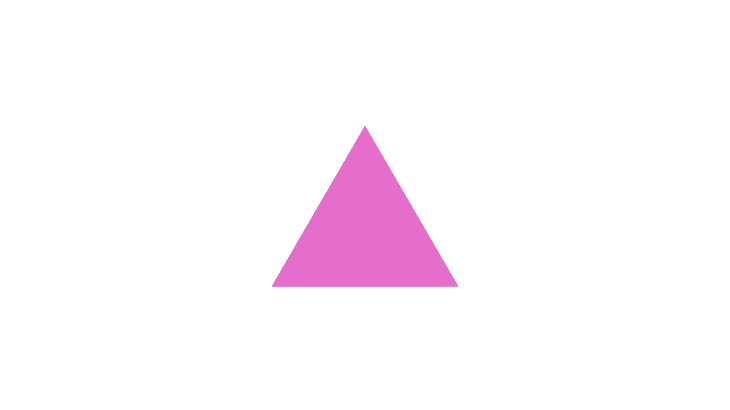
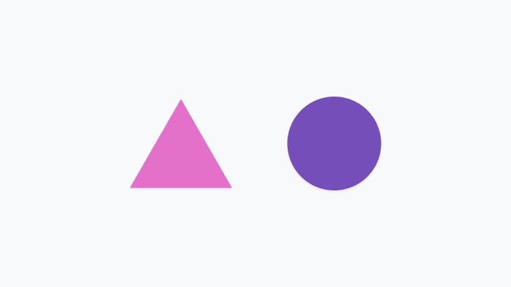
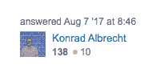
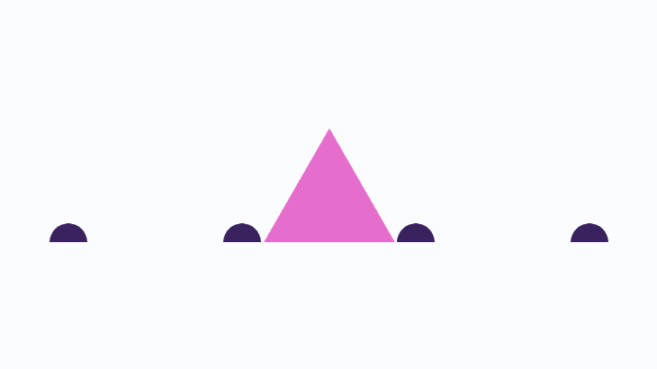
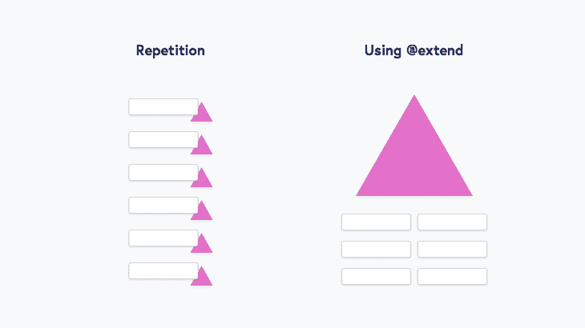

# CSS 实用程序类:你的可扩展样式库

> 原文：<https://blog.logrocket.com/css-utility-classes-library-extendable-styles/>

使用 CSS 实用程序类进行构建对于生产力和组织来说是一个不可思议的提升。它允许你定义一个支持你所有风格的`property: value`对库，从一个目录管理。

在本文中，我们将讨论:

1.  什么是 CSS 实用程序类以及为什么应该使用它们
2.  流行框架中的快速演示
3.  如何构建自己的超级实用程序库

## 什么是实用程序类？

实用程序类是自描述的、单一用途的 CSS 类:

```
.flex {
  display: flex;
}
```

开发者使用这些函数类来构建*而不需要*编写额外的 CSS，因为如果样式在库中，你可以一遍又一遍地使用它…

```
<aside class="flex flex-column bg-black">
  <div class="flex align-center justify-center">
    
  </div>

  <div class="flex flex-column">
    <h1>Jamie Thrift</h1>
    <p class="flex align-center">
      <svg>…</svg>
      Head of HR
    </p>
  </div>
</aside>
```

这些类确切地告诉我们它们做什么，因此开发人员可以*可视化*这些元素将如何布局，而不需要浏览底层 CSS。



### 实用程序类是如何放在一起的？

工具类是作为**框架**的一部分为你生成的。一些流行的工具和框架提供了*许多*现成的风格，所以你可以只使用`class="padding-10"`并且确信这种风格已经存在。其他人给你工具来定义*你的项目需要的工具。*

通过在一个地方配置你的样式库，你可以避免在你的代码库中乱放离群值，也不会忘记什么是新的 CSS，什么是已经在其他地方写好的。

使用实用程序极大地增强了项目的组织性，并提高了开发人员和最终用户的可预测性和一致性。

### … *就像*一个设计系统！

这种思维模式也体现在 UI 设计阵营中，在那里有一种定义、重用和维护中央样式库的紧急实践。这些样式通常可以在[设计系统](https://blog.logrocket.com/building-design-system-grommet-storybook/)的[样式指南](http://styleguides.io/)部分找到。

样式指南主要包括颜色、排版、间距、网格和图标的基础。这些低层次的基本原则是一组规则，设计师遵循这些规则来创建一致的工作。



实用优先的 CSS 框架

## 这些年来，有相当多的框架、库和工具在这一领域广受欢迎。这里是一些知名选项发布时的历史快速回顾，以及一些采用实用优先方法的开发人员的案例研究。

2013

### **标语:**“无副作用的快速模块化 CSS”

*   **GitHub:**[bascss/bascss](https://github.com/basscss/basscss)
*   2014

### 2015

### 2017

### 2018

将实用程序类付诸实践

## 让我们构建一些简单的东西来看看这些实用程序类是如何工作的。这里，我们将复制您可能从[堆栈溢出](https://stackoverflow.com/)中认出的 author 组件。



在这个例子中，我将使用来自 [Tailwind CSS](https://tailwindcss.com/) 的语法。

没有描述

> No Description

没什么可命名的

```
<div class="p-3">
  <p class="text-gray-600">answered <span title="2017-08-07 08:46:14Z">Aug 7 '17 at 8:46</span></p>

  <figure class="flex items-center mt-3">
    
    <figcaption class="ml-2">
      <p>
        <a class="text-blue-600" href="/user">Konrad Albrecht</a>
      </p>
      <p class="flex items-center mt-1">
        <span class="font-bold text-gray-800" title="reputation score">138</span>
        <span class="rounded-full w-2 h-2 bg-orange-400 ml-2"></span>
        <span class="ml-1 text-gray-600" title="badge count">10</span>
      </p>
    </figcaption>
  </figure>
</div>
```

### "一旦你给它起了名字，你就会爱上它。"

> 注意，这些标记都不要求我们给*命名任何东西*——因为[给东西命名很难](https://seesparkbox.com/foundry/naming_css_stuff_is_really_hard)。我们不必致力于像`.user`或`.author`这样的结构……它允许我们更快地构建我们的组件，并留给我们更少的维护。如果我们稍后添加另一个包含作者的组件，我们不必重新考虑命名方案。

可预测性

### 说实话，在开始构建组件之前，我只快速浏览了一下[的 Tailwind CSS 文档](https://tailwindcss.com/docs/)，并且我只需要查找两个我猜不到的类(`.rounded-full`和`items-center`)。

这意味着构建一个组件可以发生在一个文件中，而不是在两个文件之间切换。



潜在的不利因素是什么？

# 正如您在开发中采用的任何方法一样，总会有一些妥协。让我们探讨一下手头的一些复杂情况。

类的长组合

### 一行没有结尾、换行的文字很难解读。当我们编写普通的 CSS 时，我们有一些技术可以帮助我们扫描一组属性:

每行一条规则

*   刻痕
*   规则维护一个[属性排序顺序](https://github.com/sds/scss-lint/blob/master/data/property-sort-orders/smacss.txt)
*   断点可以嵌套在预处理/后处理中
*   当我们将这一长串样式重新放置到我们的标记中时，我们倾向于放弃上述内容，因为这会使我们的 HTML 变得非常冗长。这导致了非常长的类串，很难理解，甚至是 lint。

尝试在这里找到您想要调整的**权重**属性:

值得一提的是，这个示例甚至没有任何响应样式——如果要在一两个断点处更改属性，长度可能会增加一倍。

```
<a href="https://myurl.com/" class="bgcolor-blue [email protected] [email protected] radius-tlbr-3 radius-trbl-12 font-europa color-light-grey [email protected] [email protected] weight-medium shadow-black-thin padv-3 padh-4 whitespace-nowrap size-6rem line-thin pos-relative [email protected] [email protected]">Incredible pace in this place</a>
```

文件大小管理

### 如果我们全进去，一些框架为*的每个可能值*为*的每个属性*为每个断点和*每个状态*生成一个类。这是一个巨大的 CSS 垃圾箱，其中你可能只使用了 1%。框架知道这一点，他们有自己的处理方法。

Tailwind CSS (350kB minified)有一个关于[控制文件大小](https://tailwindcss.com/docs/controlling-file-size)的章节，推荐设置 [PurgeCSS](https://www.purgecss.com/) 。

Purge 将扫描你的项目文件，找到你让 T2 使用的类，并从你编译的 CSS 文件中删除其余的类。这意味着在你的构建中多了一个步骤，如果你的代码库相当大的话，甚至可能会延迟你的脚本运行。还可能有不准确的地方，你的编程语言模糊了你的类名(`class="bgcolor-${foo}"`)，这要担心。

复杂选择器

### CSS 的许多最有用的快捷方式都可以在它强大的选择器中找到。例如，考虑一个当用户不与之交互时逐渐消失的表单部分:

或者只是使用伪元素:

```
.fieldset:not(:focus-within):not(:hover) {
  opacity: .5;
}
```

或者甚至是像斑马条纹的表格行这样简单的东西:

```
.title:after {
  position: absolute;
  bottom: -2px;
  left: 0;
  right: 0;
  border-bottom: 2px solid orange;
  content: '';
}
```

要用(相当普遍！)这样的风格，您可能最终会在您的实用程序框架旁边维护一些定制的 CSS，或者在 iotaCSS 中使用[组件。](https://www.iotacss.com/docs/components/)

```
.table-row:nth-child(odd) {
  background-color: grey;
}
```

失去级联

### 不仅如此，在布局元素时，能够使用级联瞄准也是一个巨大的时间节省——比如部署每个人都喜欢的[脑叶切除猫头鹰选择器](https://alistapart.com/article/axiomatic-css-and-lobotomized-owls/):

我所见过的任何框架都没有默认提供这些节省时间的样式，这意味着您最终将在标记中添加更多的类来进行补偿。

```
.margin-top-siblings-2 > * + * {
  margin-top: 2rem;
}
```

更多来自 LogRocket 的精彩文章:

* * *

### 构建您自己的实用框架

* * *

## 在提供了关于实用程序类的故事的两个方面之后，我们肯定可以看到现有框架提供方式的改进空间。

为了在 SCSS 建立我们自己的公用事业框架，我们将坚持以下原则:

只生成您需要的类

*   减少编译 CSS 中的浪费
*   造型类型的自然分离
*   为了实现这一目标，我们将利用:

`%placeholders`和`@extend`

*   命名空间[对象](https://www.iotacss.com/docs/objects/)和[组件](https://www.iotacss.com/docs/components/) ( `.u-`、`.o-`、`.c-`)
*   循环和列表
*   为什么是命名空间？

### 通过为类类型使用一个小的名称空间，您就有了一种结构化的方式来指示一个类根据它的类型*做什么。*我们之前提到的大多数框架都不这么做，因为它们只是为了迎合*实用程序而编写的*。

我们将在以下所有示例中使用名称空间。

定义样式的占位符

### 占位符是 SCSS 制造的“幽灵”定义，用来定义一种风格。它们的独特之处在于，除非你在某处引用它们，否则它们不会编译 T2。这就好像你定义了一个`$variable`但从未使用过它。

因为占位符只有在我们需要的时候才会显示，所以我们也可以为每个断点和样式的状态变化创建一个占位符。

```
// Define the placeholder…

%u-display-flex {
  display: flex;
}

// This will not compile, until…

.u-flex {
  @extend %u-display-flex;
}

// Now we have our utility class ready to use…

.u-flex {
  display: flex;
}
```

`@extend`应用我们的占位符

### 定义了占位符后，我们现在可以决定如何使用它们。通过使用`@extend`(与[的`@apply`](https://tailwindcss.com/docs/extracting-components) 相反)，我们也减少了 CSS 中的重复。

作为一个例子，让我们想象我们的许多组件使用一个特定的边界。如果我们的 CSS 内容是:

当我们一直使用低特异性的类时，我们可以将这些风格组合在一起，并得出最终结果:

```
.c-sidebar {
  border: 1px solid #222;
}

.c-card {
  border: 1px solid #222;
}

.c-header {
  border: 1px solid #222;
}
```



```
.c-sidebar {
  @extend %border-grey;
}

.c-card {
  @extend %border-grey;
}

.c-header {
  @extend %border-grey;
}

// Which compiles to…

.c-sidebar, 
.c-card, 
.c-header {
  border: 1px solid #222;
}
```

我们的组件可以`@extend`我们库中的任何样式，通过引用一个占位符，我们知道我们没有创建一个浪费的新样式定义。让我们重写前面那个混乱的组件示例:

组件内部嵌套

```
.c-featured-link {
  @extend
  %u-pos-relative,
  %u-padv-3,
  %u-padh-4,
  %u-bgcolor-blue,
  %u-shadow-black-thin,
  %u-radius-tlbr-3,
  %u-radius-trbl-12,
  %u-weight-medium,
  %u-size-6rem,
  %u-line-thin,
  %u-font-europa,
  %u-color-light-grey,
  %u-whitespace-nowrap;
}
```

### 我们还可以通过嵌套断点和状态来极大地提高这些组件的可读性。

制造我们需要的工具

```
.c-featured-link {
  // …

  &:hover,
  &:focus {
    @extend 
    %u-top-3,
    %u-bg-color-darkblue,
    %u-color-white;
  }
}
```

### 最后，我将向您介绍 SCSS 实现上述目标所需的工具。我将首先描述它们是如何工作的，这样你就可以根据自己的喜好重新构建它们，然后提供一个链接到一个已经有一整套工作的[框架](https://github.com/wearelighthouse/stemCSS/)。

上面的 mixin 首先为在`$properties`参数中发送的每个属性创建一个占位符。然后，我们遍历在`$global-breakpoints`图中其他地方定义的所有断点，以确保我们也有断点占位符。

```
@mixin make-placeholder($utility-name, $properties) {

  // No breakpoint
  %#{$utility-name} {
    @each $property, $value in $properties {
      #{$property}: $value;
    }
  }

  // Every breakpoint
  @each $breakpoint-key, $breakpoint-value in $global-breakpoints {
    %#{$utility-name + $global-breakpoint-separator + $breakpoint-key} {
      @include breakpoint($breakpoint-key) {
        @each $property, $value in $properties {
          #{$property}: $value;
        }
      }
    }
  }
}
```

这将为我们提供如下占位符:

我们对@符号(我们的断点和状态标识符)进行了转义，因为它是一个无效字符；欢迎您选择自己的分隔符来替换它。

```
@media (min-width: 600px) {
  %u-bgcolor-primary\@medium {
    background-color: blue;
  }
}
```

正如我们需要的(在下一个 mixin 中)，直接从新的`%placeholder`创建一个实用程序类。

```
@mixin make-class-from-placeholder($utility-name, $properties) {
  .#{$utility-name} {
    @extend %#{$utility-name};
  }
}
```

最后一步是支持别名，这允许您决定是喜欢在类名(`justify-content-space-between`)中一个字母接一个字母，还是喜欢一个小的快捷方式(`jc-sb`)。

```
@mixin make-utility($args) {

  $class: map-use(
    $args,
    class,
    false
  );

  $args: map-remove($args, class);

  // If 'alias' key exists in $args, use that for the placeholder-name,
  // otherwise use the key and value of the first property in $args
  $utility-name: map-use(
    $args,
    alias,
    first(map-keys($args)) + '-' + first(map-values($args))
  );

  $utility-name: 'u-' + $utility-name;

  $properties: map-remove($args, alias);

  @include make-placeholder($utility-name, $properties);

  @if ($class) {
    @include make-class-from-placeholder($utility-name, $properties);
  }

}
```

这完全取决于您——较长的名称意味着任何开发人员都可以直接进入并立即知道模式，但是较短的名称更容易浏览和输入。

别名确定后(或留空)，我们将检查您是否希望使用 Make Class 并完成占位符。

用循环和控制指令把它们放在一起

### 为了充分利用我们的占位符构建，您需要列出要添加到库中的属性和值。

这里有几个有用的循环，可以帮你上路:

如果你想快速启动你自己的框架，你可以获取最新版本的 [stemCSS](https://github.com/wearelighthouse/stemCSS) 。

```
@each $wrap in (nowrap, wrap, wrap-reverse) { 
  @include make-utility((
    alias: 'fw-' + $wrap,
    flex-wrap: $wrap
  ));
}

@each $property in (translateX, translateY) {
  @each $value in (-100, -50, 0, 50, 100) {
    @include make-utility((
      alias: $property + '-' + $value + $global-unit-percent,
      transform: $property + '(' + $value + '%)'
    ));
  }
}

@each $property in (margin-top, margin-right, margin-bottom, margin-left) {
  @for $value from 1 through 30 {
    @include make-utility((
      $property: #{$value + 'rem'};
    ));
  }
}
```

摘要

## 最近的工具和框架已经将实用程序类的概念推进到了主流，并且它们正在收获其特殊文档的好处(hat-tip to [Tailwind CSS](https://tailwindcss.com/) )。很明显，实用程序类改变了开发人员如何使用低特异性 CSS 类作为一致样式的方法的前景。

样式表的未来会给我们带来什么？

你的前端是否占用了用户的 CPU？

## 随着 web 前端变得越来越复杂，资源贪婪的特性对浏览器的要求越来越高。如果您对监控和跟踪生产环境中所有用户的客户端 CPU 使用、内存使用等感兴趣，

.

[try LogRocket](https://lp.logrocket.com/blg/css-signup)

LogRocket 就像是网络和移动应用的 DVR，记录你的网络应用或网站上发生的一切。您可以汇总和报告关键的前端性能指标，重放用户会话和应用程序状态，记录网络请求，并自动显示所有错误，而不是猜测问题发生的原因。

[](https://lp.logrocket.com/blg/css-signup)[https://logrocket.com/signup/](https://lp.logrocket.com/blg/css-signup)

现代化您调试 web 和移动应用的方式— [开始免费监控](https://lp.logrocket.com/blg/css-signup)。

Modernize how you debug web and mobile apps — [Start monitoring for free](https://lp.logrocket.com/blg/css-signup).