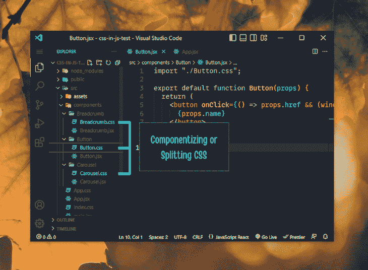

# CSS 与 CSS-in-JS:如何以及为什么使用它们

> 原文：<https://blog.logrocket.com/css-vs-css-in-js/>

开发人员在使用 JavaScript 框架时通常面临的一个难题是是否使用 CSS-in-JS。如果你是一名 React 开发人员，你很可能曾经使用过 CSS-in-JS。

如今，CSS vs. CSS-in-JS 是一个热门话题。这主要是因为 CSS-in-JS 因其性能问题而受到关注。然而，还有一些[新的 CSS 特性正在酝酿中](https://web.dev/state-of-css-2022/),应该会在不久的将来解决这些问题。

本文的目的是帮助你根据现代 CSS 的现状和未来可能的变化，在即将到来的项目中选择 CSS 或 CSS-in-JS。

向前跳:

本文中的所有代码片段和演示都以 React 和 CSS 为特色。在前进之前，请确保您熟悉这两种 web 技术。

注意，任何 JavaScript 前端框架或库都可以实现 CSS-in-JS 的思想。本文使用 React——到目前为止最流行的 JavaScript 前端库——来讨论 CSS-in-JS 的应用，以及它显著的优缺点。

## 渲染阻塞和 CSS

在深入讨论什么是最好的，什么不是之前，让我们先讨论一下由 CSS 引起的渲染问题。

传统上，浏览器首先加载 HTML，然后从所有外部资源加载 CSS。之后，浏览器使用所有外部和内部 CSS 信息创建 CSSOM。现在，浏览器已经准备好根据 CSS 级联规则为呈现的 HTML 提供样式。

这个过程导致 CSS[阻止页面呈现](https://blog.logrocket.com/9-tricks-eliminate-render-blocking-resources/)，并延迟所请求页面的第一次绘制。First paint 是浏览器在屏幕上打印所请求页面的第一个像素时发生的事件。

第一次绘制延迟超过半秒会增加用户不满意的风险，并会对应用程序的目标产生负面影响。将 CSS 交付给客户端的速度越快，就越能优化页面的首次绘制时间。

### 对抗 CSS 渲染块

使用 HTTP/2 驱动的应用程序，可以并行加载多个 HTML、CSS 和 JS 文件。HTTP/1.1 限制了这种能力。大多数现代浏览器和网站现在都支持 HTTP/2，这可以最大限度地减少因等待其他文件加载而导致的渲染块:


然而，除了文件加载速度之外，渲染阻塞还涉及其他因素。

假设我们的应用程序的一个页面有很多 CSS。它可能包含选择器，这些选择器甚至没有被使用过，但是因为我们在每个页面上导入了一个主 CSS 文件而存在。

上面的场景基本上描述了我们是如何习惯于直接使用一个 [CSS UI 框架或者一个 UI 工具包](https://blog.logrocket.com/comparing-tailwind-css-bootstrap-time-ditch-ui-kits/)来快速简化我们的设计系统。并非所有从该框架或工具包引用的样式都会在每个页面上使用。结果，我们最终页面的 CSS 样式中会有更多的垃圾。

CSS 越多，浏览器构建 CSSOM 的时间就越长，导致完全不必要的渲染阻塞。

为了解决这个问题，将 CSS 分成小块是非常有帮助的。换句话说，将全局样式和关键 CSS 保存在一个通用 CSS 文件中，然后将其他内容组件化。这种策略更有意义，并且解决了不必要的阻塞问题:



上图显示了在 React 中为不同组件创建和管理单独 CSS 文件的传统方式。因为每个 CSS 文件都直接附加到其各自的组件，所以它只在导入相关组件时才导入，而在移除该组件时消失。

这种方法有一个缺点。假设我们的应用程序包含 100 个组件，从事同一项目的其他开发人员无意中在这些 CSS 文件中使用了相同的类名。

在这里，每个组件的每个 CSS 文件的范围都是全局的，所以这些偶然复制的样式会不断地覆盖彼此并得到全局应用。像这样的场景将导致严重的布局和设计不一致。

据说 CSS-in-JS 可以解决这个范围问题。接下来的部分将从高层次上回顾 CSS-in-JS，并讨论它是否一劳永逸地有效解决了作用域问题。

## CSS-in-JS 提供了什么

简而言之，CSS-in-JS 是一个外部功能层，允许您通过 JavaScript 为组件编写 CSS 属性。

这一切都始于 2015 年的一个名为 JSS 的 JavaScript 库，该库目前仍在积极维护中。您必须使用 JavaScript 语法向选择器提供 CSS 属性，一旦页面加载，这些属性就会自动应用于各自的选择器。

当 JavaScript 接管了 React 等库的前端渲染和管理时，一个名为 styled-components 的 [CSS-in-JS 解决方案出现了。另一个越来越受欢迎的方法是通过](https://blog.logrocket.com/how-style-react-router-links-styled-components/)[使用情感库](https://blog.logrocket.com/styled-components-vs-emotion-for-handling-css/)。

我们将展示一个带有样式化组件库的 CSS-in-JS 用例，因为这是在 React 中使用 CSS-in-JS 最流行的方式。

### 将 CSS-in-JS 用于样式化组件的示例

在 React 应用程序中，使用下面的 Yarn 命令安装样式组件库。如果您正在使用不同的软件包管理器，请查看[风格组件安装文档](https://styled-components.com/docs/basics#installation)以找到合适的安装命令:

```
yarn add styled-components

```

安装好样式组件库后，导入`styled`函数，如下面的代码所示使用它:

```
import styled from "styled-components";

const StyledButton = styled.a`
  padding: 0.75em 1em;
  background-color: ${ ({ primary }) => ( primary ? "#07c" : "#333" ) };
  color: white;

  &:hover {
    background-color: #111;
  }
`;

export default StyledButton;

```

如果您没有 React 环境的访问权限，这里有一个 CodePen 演示供您查看上面的代码:

参见 [CodePen](https://codepen.io) 上 Rahul Chhodde([@ _ Rahul](https://codepen.io/_rahul))
的带 CSS 的 Pen [下拉菜单。](https://codepen.io/_rahul/pen/dyeZeGL)

上面的代码演示了如何在 React 中设计一个按钮链接组件的样式。这种样式化的组件现在可以导入到任何地方，并直接用于构建功能性组件，而不必担心样式:

```
import StyledButton from './components/styles/Button.styled';

function App() {
  return (
    <div className="App">
      ...
      <StyledButton href="...">Default Call-to-action</StyledButton>
      <StyledButton primary href="...">Primary Call-to-action</StyledButton>
    </div>
  );
}

export default App;

```

请注意，应用于样式化组件的样式是局部范围的，这消除了留意 CSS 类命名和全局范围的麻烦。此外，我们可以根据提供给组件的道具或应用程序功能所需的任何其他逻辑来动态添加或删除 CSS。

## CSS-in-JS 的优点

JavaScript 开发人员可能更喜欢用 CSS-in-JS 来设计东西，而不是通过 CSS 类。JS 中的 CSS 方法解决的最大问题是全局范围。如果您是一名 JavaScript 开发人员，它还具有其他一些非常有意义的优势。

现在让我们来探讨一下这些好处。

### 没有范围和特殊性问题

由于样式在局部范围内可用，它们不容易与其他组件的样式冲突。你甚至不必担心命名的事情严格避免风格冲突。

样式是专门为一个组件编写的，没有预先考虑子选择器，所以很少出现特殊性问题。

### 动态造型

条件 CSS 是 CSS-in-JS 的另一个亮点。如上面的按钮示例所示，检查属性值并添加合适的样式比为每个变体编写单独的 CSS 样式要酷得多。

### 较少 CSS 特异性

CSS-in-JS 帮助您将 CSS 声明的特异性保持在最低水平，因为您唯一可以使用它的是元素本身。这同样适用于创建组件变体，您可以检查属性对象值，并在需要时添加动态样式。

### 轻松主题化

使用自定义 CSS 属性为应用程序设置主题是有意义的。最后，您必须转到 JavaScript 端，编写逻辑来根据用户输入切换和记住主题。

CSS-in-JS 允许你完全用 JavaScript 编写主题逻辑。使用 styled-components `ThemeProvider`包装器，您可以快速地对组件的主题进行颜色编码。看一下[这个 CodePen 示例](https://codepen.io/_rahul/pen/qBKXevo)，看看组件主题化和样式化组件的作用:

参见 [CodePen](https://codepen.io) 上 Rahul Chhodde([@ _ Rahul](https://codepen.io/_rahul))
用样式组件库进行的笔[组件主题化。](https://codepen.io/_rahul/pen/qBKXevo)

无痛维护

### 考虑到 CSS-in-JS 提供的特性和优势，JavaScript 开发人员可能会发现 CSS-in-JS 比管理数百个 CSS 文件更方便。

然而，事实是，要有效地管理和维护由 CSS-in-JS 驱动的大型项目，必须对 JavaScript 和 CSS 都有很好的理解。

CSS-in-JS 的缺点

## CSS-in-JS 确实很好地解决了范围问题。但正如我们最初讨论的那样，我们面临着更大的挑战，比如渲染阻塞，这直接影响了用户体验。除此之外，CSS-in-JS 的概念还需要解决其他一些问题。

延迟渲染

### CSS-in-JS 将执行 JavaScript 从 JavaScript 组件中解析 CSS，然后将这些解析的样式注入 DOM。组件越多，浏览器第一次绘制花费的时间就越长。

缓存问题

### CSS 缓存通常用于改善连续页面加载时间。由于使用 CSS-in-JS 时不涉及 CSS 文件，所以缓存是个大问题。此外，动态生成的 CSS 类名使得这个问题更加复杂。

不支持 CSS 预处理程序

### 使用常规的组件化 CSS 方法，很容易添加对 SASS 、Less、PostCSS 等预处理程序的支持。这在 CSS-in-JS 中是不可能的。

混乱的 DOM

### CSS-in-JS 的思想是将 JavaScript 中的所有样式定义解析成普通的 CSS，然后使用样式块将样式注入 DOM。

对于每个使用 CSS-in-JS 样式的组件，可能有 100 个样式块必须首先被解析，然后被注入。简单来说，会有更多的管理费用。

库依赖性

### 正如我们已经知道的，我们可以用外部库添加 CSS-in-JS 功能。在实际的 CSS 解析之前，将包含并运行大量的 JavaScript，因为从 JavaScript 到 CSS 样式的解析样式依赖于 styled-components 之类的库。

学习曲线

### CSS-in-JS 缺少许多原生 CSS 和 SCSS 特性。对于习惯了 CSS 和 SCSS 的开发者来说，适应 CSS-in-JS 可能是非常具有挑战性的。

没有广泛的支持

### 大多数 UI 和组件库现在都不支持 CSS-in-JS 方法，因为它仍然有许多问题需要解决。

上面讨论的问题可能共同导致一个低性能、难以维护的产品，它有几个 UI 和 UX 不一致的地方。

关于在哪里使用 CSS-in-JS 的建议

## 当您处理一个较小的应用程序，性能是较低的优先级时，CSS-in-JS 解决方案是理想的。在处理具有庞大设计系统的性能关键型应用程序时，这可能并不理想。

随着应用程序变得越来越大，考虑到这个概念的所有缺点，使用 CSS-in-JS 很容易变得复杂。将一个设计系统转换成 CSS-in-JS 需要做大量的工作，在我看来，没有一个 JavaScript 开发人员想要处理这些。

CSS 模块概述

## 一个 [CSS 模块是一个 CSS 文件](https://blog.logrocket.com/a-deep-dive-into-css-modules/),其中所有的属性默认情况下都在呈现的 CSS 中的本地范围内。JavaScript 进一步处理 CSS 模块文件，并封装它们的样式声明来解决作用域问题。

要使用 CSS 模块，您需要用扩展名`.module.css`命名您的 CSS 文件，然后将它们导入 JavaScript 文件。下面的代码片段提供了一个如何使用 CSS 模块的基本示例:

看看这个在 React 中实现 CSS 模块的 [StackBlitz 示例。这个例子展示了如何使用 CSS 模块来解决作用域问题。](https://stackblitz.com/edit/react-hbivvp?file=src/components/Button/Button.module.css)

```
import styles from './Button.module.css';

export default function Button(props) {
  return (
    <a
      href={props.href ? props.href : '#'}
      className={styles.btn}
    >
      {props.name}
    </a>
  );
}

```

在 StackBlitz 示例中，注意如何智能地处理和优化`Button.module.css`和`AnotherButton.module.css`中的相同类名，以防止命名冲突。

CSS 模块的优点

## CSS 模块提供的最大好处是消除了对 CSS-in-JS 的依赖，从而解决了范围和特性问题。如果我们可以通过尽可能保持 CSS 的传统性来解决范围和特性问题，那么 CSS-in-JS 将会是多余的工作。

没有范围和特殊性问题

### 如上面的例子所示，CSS 模块成功地解决了传统的旧式 CSS 的作用域问题。由于规则是松散地写在 CSS 模块文件中的，所以很难观察到任何特殊性问题。

有组织的代码

### 保存单独的 CSS 文件似乎是一种限制。然而，这种方法实际上促进了更好的组织。例如，下面是我如何通过将组件分离到它们自己的文件夹中来组织它们:

缓存可能性

```
- Project
  - src
    - components
      - Button
          - Button.jsx
          - Button.modules.css
      - Carousel
          - Carousel.jsx
          - Carousel.modules.css

```

### 浏览器可以缓存最终版本生成的缩小的 CSS 文件，以提高连续页面加载时间。

CSS 预处理

### 很容易添加对 PostCSS 、SASS、Less 等 [CSS 预处理程序的支持。然而，你必须依靠额外的软件包来完成。](https://blog.logrocket.com/using-postcss-media-queries-level4/)

零学习曲线

### 如果你知道 CSS 是如何工作的，你可以使用 CSS 模块，而不需要学习任何新的东西，除了我们在上面介绍部分讨论的几点。

大力支持

### 你不需要添加额外的包来使用 CSS 模块。所有主要的框架和库都提供内置支持。

CSS 模块的缺点

## 虽然 CSS 模块提供了许多好处，但它并不是一个完美的解决方案。以下是一些需要记住的注意事项。

非标准的`:global`属性

### 当在全局范围内定位选择器时，必须使用`:global`规则。这不是 CSS 规范的一部分，但是 JavaScript 使用它来标记全局样式。

没有动态样式

### 对于 CSS 模块，所有的声明都放在单独的 CSS 文件中。因此，不可能实现像 CSS-in-JS 这样的动态样式，因为我们不能在 CSS 文件中实现任何 JavaScript。

外部 CSS 文件

### 你不能忽略 CSS 文件和组件中 CSS 模块的使用。使用 CSS 模块的唯一可能方式是维护和导入外部 CSS 文件。

打字限制

### 要在 TypeScript 中使用 CSS 模块，您必须在`index.d.ts`文件中添加模块定义，或者[使用 webpack 加载器](https://blog.logrocket.com/how-to-configure-css-modules-webpack/):

在哪里使用 CSS 模块的建议

```
/** index.d.ts **/
declare module "*.module.css";  // TS module for CSS Module files
declare module "*.module.scss"; // TS module for CSS Module files in SCSS format

```

## 如果您有一个具有大 UI 的性能关键型应用程序，使用 CSS 模块是一个不错的选择。由于 CSS 模块提供的一切最终都是基于传统的、非实验性的使用，这种方法使得监控和修复性能变得更加容易。

CSS 模块文件很容易从你选择的任何 CSS 框架中改编代码，因为你处理的只是 CSS。如前所述，CSS 的一些基本知识足以完成这项任务。

值得关注的现代 CSS 功能

## 在引言中，我提到了一些现代 CSS 特性如何在不依赖 CSS 模块、CSS-in-JS 或任何其他 JavaScript 解决方案的情况下帮助解决未来的作用域问题。

新的和计划中的特性——比如范围指令和`@scope`伪元素——旨在解决传统 CSS 的老问题。反过来，这可能会减少开发人员求助于 CSS-in-JS 等方法来解决这些问题的需要。

让我们看看当前的作用域 CSS 草案如何解决 JS 中的 CSS 甚至 CSS 模块的问题。关于其他现代 CSS 特性的完整列表，请查看 CSS 2022 的状态。

CSS 作用域的潜在未来

### 在奇怪的引入和从 CSS 规范中删除了 `[<style scope>](https://github.com/whatwg/html/issues/552)`之后，[当前的 CSS](https://drafts.csswg.org/css-cascade-6/#scoped-styles) 草案看起来足够好，可以通过编写 CSS 规则来定义元素的范围前提。

它目前的状态包括使用一个指令和一个伪类来控制给定元素的范围设置。下面是它如何在边界内锁定一个元素的作用域，并在不考虑 cascade 的作用域规则的情况下维护它的大致情况:

这个新特性可以消除 CSS 模块或 CSS-in-JS 来解决作用域问题的需要。我们必须拭目以待，直到它在我们的浏览器中可用。

```
<div class="card">
  
  <div class="content">
    <p>...</p>
  </div><!-- .content -->
</div><!-- .card -->

<style>
@scope (.card) {
  :scope {
    display: grid;
    ...
  }
  img {
    object-fit: cover;
    ...
  }
  .content { ... }
}
</style>

```

结论

## 上面，我们讨论了 CSS 渲染阻塞如何成为 web 应用程序的主要性能问题。然后，我们讨论了解决这个问题的一些解决方案，这让我们探索了 CSS-in-JS、CSS 模块以及新的 CSS 功能的官方进展草案的当前状态。

喜欢 JavaScript 的开发人员喜欢 CSS-in-JS，因为它几乎涵盖了 JavaScript 的所有样式方面。另一方面，那些喜欢 CSS 的人——希望当前的技术能够平等地支持开发者和最终用户——可能更喜欢 CSS 模块。

我希望你喜欢这篇文章。请在评论中告诉我你的想法、问题和建议。

你的前端是否占用了用户的 CPU？

## 随着 web 前端变得越来越复杂，资源贪婪的特性对浏览器的要求越来越高。如果您对监控和跟踪生产环境中所有用户的客户端 CPU 使用、内存使用等感兴趣，

.

[try LogRocket](https://lp.logrocket.com/blg/css-signup)

LogRocket 就像是网络和移动应用的 DVR，记录你的网络应用或网站上发生的一切。您可以汇总和报告关键的前端性能指标，重放用户会话和应用程序状态，记录网络请求，并自动显示所有错误，而不是猜测问题发生的原因。

[](https://lp.logrocket.com/blg/css-signup)[https://logrocket.com/signup/](https://lp.logrocket.com/blg/css-signup)

现代化您调试 web 和移动应用的方式— [开始免费监控](https://lp.logrocket.com/blg/css-signup)。

Modernize how you debug web and mobile apps — [Start monitoring for free](https://lp.logrocket.com/blg/css-signup).