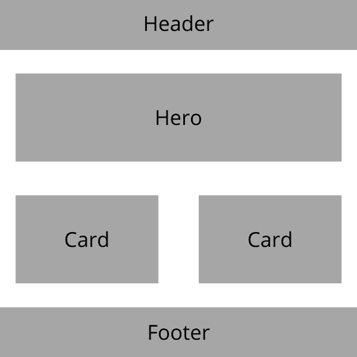
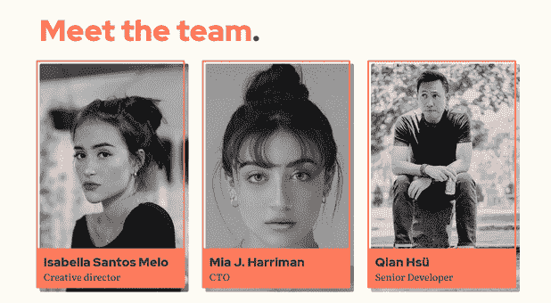
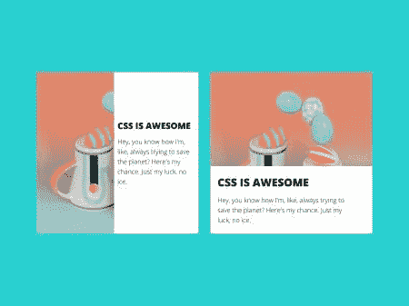
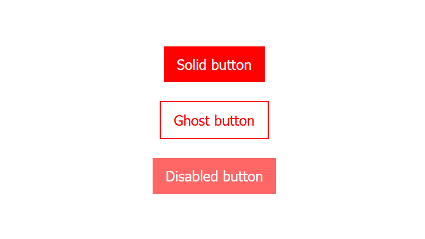

# 介绍 CUBE CSS:一种替代的 CSS 方法

> 原文：<https://blog.logrocket.com/cube-css-alternative-css-methodology/>

## 介绍

虽然 CSS 可能很容易编写，但它很快会变得难以维护，特别是当我们的网站和组件的复杂性增加时。减少对 CSS 失望的最好方法之一是在代码中创建一个结构，确保我们的 CSS 保持可维护性和可伸缩性。

CSS 方法是编写模块化、可重用和可伸缩的 CSS 的指南。多年来，诸如原子 CSS、BEM、OOCSS、SMACSS 和 SUIT CSS 等方法已经被开发出来，使我们能够编写可伸缩的 CSS。

这个方法列表中的一个新条目是 CUBE CSS，在本文中，我们将了解它如何帮助开发人员编写可伸缩和可维护的 CSS。我们还将比较 CUBE CSS 和 BEM，[最流行的 CSS 方法论之一](https://2020.stateofcss.com/en-US/technologies/methodologies/)。

### 内容

## 什么是立方体 CSS？

CUBE CSS 是由[安迪·贝尔](https://twitter.com/hankchizljaw)创建的，它是一种面向简单、实用和一致的 CSS 方法论。

CUBE 代表“组合实用程序块异常”,是一种与工具无关的方法。

CUBE CSS 方法论的核心是，大部分工作已经用全局和高级风格为我们完成了。至此，颜色、版式和任何其他全局样式都已经定义好了。

在定义了全局样式之后，我们使用 CUBE CSS 的其余方法来提供不同于全局样式的上下文样式。

CUBE CSS 遵循自顶向下的方法来设计元素的样式，并从全局样式转移到低级和特定的样式

从本质上讲，CUBE CSS 是一个用于设计元素的渐进增强系统/方法。

现在，让我们看看立方体 CSS 的不同层，并了解它们是如何工作的。

### 作文

组合层处理页面如何流动，以及页面上的不同元素如何相互连接和交互。

复合层处理支持尽可能多的内容变体的灵活布局的创建；它充当页面上其他元素的框架。它不关心什么内容进入页面，因为它唯一的责任是内容的布局，而不是内容本身。

拿下面的布局来说。合成层负责创建这个骨架。


稍后，我们可以用我们选择的任何内容填充该布局。



这一层负责:

*   提供高级的灵活布局
*   确定元素如何相互作用
*   创造一致的流动和节奏

它不应该:

*   提供视觉处理，如颜色或字体样式
*   提供装饰风格，如阴影和图案

### 公用事业

实用类是只做一件事，但做得很好的类。这是一个单一责任类。

实用程序类的范围通常是单个 CSS 属性。它们使我们能够保持 CSS 样式表的干燥和可伸缩性。

实用程序的示例有:

```
btn-cta-secondary {
  background-color: red
}

margin-x-auto {
  margin-left: auto;
  margin-right: auto;
}

```

`btn-cta-secondary`实用程序类将按钮的背景色改为红色。`margin-x-auto`实用程序类将元素的水平边距设置为`auto`。

### 街区

块层是为卡片、头像和按钮等特定组件设置样式的地方。

块的一个例子是为团队卡元素创建的样式。



卡片组件的 HTML 如下所示:

```
<div class="person">
  

  <div class="person-details">
    <span class="person-name font-sans weight-bold"
      >Isabella Santos Melo</span>
    <span>Creative director</span>
  </div>

</div>

```

下面是相应的 CSS:

```
.person {
  height: 51rem;
}

.person-image {
  filter: grayscale(1);
  width: 100%;
  height: 100%;
  object-fit: cover;
}

.radius {
  border-radius: 0.25rem;
}

img {
  max-width: 100%;
  display: block;
}

.person-details {
  position: absolute;
  bottom: 0.5rem;
  left: -0.25rem;
  width: calc(100% - 0.5rem);
  padding: 0.8rem;
  background: #ff7f5c;
}

.person-name {
  display: block;
  font-size: 1.77rem;
}

.weight-bold {
  font-weight: 900;
}

.font-sans {
  font-family: "Segoe UI", Roboto, "Helvetica Neue", sans-serif;
}

```

这里，`person`、`person-image`、`person-details`和`person-name`是块，而`radius`、`font-sans`和`weight-bold`是实用程序类。

关于块有两点需要注意:

首先，Andy 建议块的长度不要超过一些规则，也不要超过 80 到 100 行。

第二，积木不应该解决一个以上的上下文问题。这意味着，举例来说，如果我们有一个卡片块，里面有一个化身，卡片块不应该设计自己和化身的样式。相反，我们必须创建两个独立的块；一个是卡，另一个是头像。

### 例外

异常是块元素的微小变化，用于处理元素的状态变化。

例如，此卡组件的子组件在不同的屏幕尺寸下从左到右或从上到下切换。



另一个例子是具有实体、幻像和禁用变体的按钮。默认情况下，按钮的文本颜色应该是白色，背景颜色应该是红色。

重影变体将具有红色文本颜色、红色边框和白色背景颜色。

禁用按钮将类似于实心按钮。然而，不同的是，残疾人的将不透明度较低。



在这里，我们为实心、重影和禁用按钮定义 HTML。CUBE CSS 使用数据属性来实现样式变化，因此我们为按钮添加了`data-variant`属性:

```
<body>
  <button class="button">Solid button</button>
  <button class="button" data-variant="ghost">Ghost button</button>
  <button class="button" data-variant="disabled">Disabled button</button>
</body>

```

使用数据属性是因为它们可以很容易地在 web 的三大支柱(HTML、CSS 和 JavaScript)之间转换。此外，它们不会干扰辅助技术，如屏幕阅读器、运动跟踪器或语音输入软件。

在 CSS 中，我们设置所有按钮的基本样式，不管它们的变体是什么。然后，我们以重影和禁用变体为目标，并定义它们的样式:

```
.button {
  font-size: 1.4rem;
  border: none;
  outline: none;
  padding: 1rem;
  color: white;
  background-color: red;
}

.button[data-variant="ghost"] {
  color: red;
  border: 2px solid red;
  background-color: white;
}

.button[data-variant="disabled"] {
  opacity: 0.6;
  cursor: not-allowed;
}

```

### 分组

跟踪 HTML 中的多个类会变得很困难。我们如何记住哪个类是组合、块或实用程序？

CUBE CSS 有一个分组机制，我们可以用它来根据类的用途对它们进行分组。这使得它们更容易被跟踪，也提升了开发人员的体验和生产力。

我们可以使用方括号将类分组，如下所示:

```
<article
  class="\[ card \] [ section box ] [ bg-base color-primary ]"
  data-state="reversed"
></article>

```

我们还可以使用管道将它们分组:

```
<article
  class="card | section box | bg-base color-primary"
  data-state="reversed"
></article>

```

只要我们保持一致，我们可以自由使用方括号或管道。

## 立方体 CSS 与 BEM

已经开发了几种 CSS 方法来帮助我们更好地构建我们的风格，BEM(块、元素、修改器)就是其中之一。

### CUBE CSS 和 BEM 如何基于元素状态处理样式

BEM 和 CUBE CSS 的一个主要区别是它们处理异常的方式。BEM 使用修饰符处理异常，而 CUBE CSS 通过定位数据属性来处理异常。

通常，我们需要根据元素的当前状态来改变它们的样式。例如，我们可能希望根据手风琴的打开和关闭状态来更改其样式。

在 BEM 中，我们会设置一个修改器类，比如说，`is-active`，来修改手风琴:

```
//modifier added to accordion
<div class="accordion--is-open"></div>

```

在 CUBE CSS 中，我们将创建一个`is-open`数据属性，并在我们的 CSS 中定位该属性:

```
//data attribute added to accordion

<div data-variant="is-open"></div>

```

### 重复

与 CUBE CSS 不同，BEM 没有内置实用程序类。使用实用程序类的一个好处是，它们帮助我们避免样式表中的规则重复，并保持代码干燥。

例如，如果我们有多个需要应用`flex`属性的元素和组件，这是很有用的。

使用 BEM，我们将应用 flex 规则，并且必须在需要它们的每个其他元素中重复这些样式:

```
.element {
  display: flex;
  flex-dirction: row;
  wrap: wrap
}

```

然而，对于 CUBE CSS，我们将这些样式声明附加到一个类(比如，`flex`)上，并在需要的地方应用该类:

```
.flex {
  display: flex;
  flex-dirction: row;
  wrap: wrap
}

```

除了保持代码干燥，这种方法还使我们在需要时更容易更新我们的样式，因为样式声明附加到一个类，而不是多个。

## 多维数据集 CSS 的示例

以下是一些使用 CUBE CSS 方法构建的网站的链接:

## 结论

随着项目规模和复杂性的增加，维护它们会变得更加困难。因此，在编写 CSS 时，遵循一组明确定义的约定是很重要的。

有了 CUBE CSS，我们可以用一种最少重复、高度可伸缩、更容易理解的方式来编写 CSS。在这篇文章中，我们学习了立方体 CSS 及其原理。我们还研究了 CUBE CSS 与其他 CSS 方法的比较。

## 你的前端是否占用了用户的 CPU？

随着 web 前端变得越来越复杂，资源贪婪的特性对浏览器的要求越来越高。如果您对监控和跟踪生产环境中所有用户的客户端 CPU 使用、内存使用等感兴趣，

[try LogRocket](https://lp.logrocket.com/blg/css-signup)

.

[](https://lp.logrocket.com/blg/css-signup)[https://logrocket.com/signup/](https://lp.logrocket.com/blg/css-signup)

LogRocket 就像是网络和移动应用的 DVR，记录你的网络应用或网站上发生的一切。您可以汇总和报告关键的前端性能指标，重放用户会话和应用程序状态，记录网络请求，并自动显示所有错误，而不是猜测问题发生的原因。

现代化您调试 web 和移动应用的方式— [开始免费监控](https://lp.logrocket.com/blg/css-signup)。