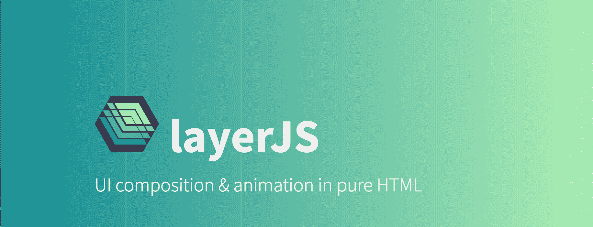

# 使用自定义 CSS 属性的自定义响应行为

> 原文：<https://blog.logrocket.com/custom-responsive-behaviour-using-custom-css-properties-14e2ed8a578f/>



在 2012 年，自定义属性作为“变量”被引入 CSS 变量模块。后来，“变量”被重命名为“自定义属性”，根据 CSS [规范](https://www.w3.org/TR/css-variables-1/#defining-variables)它将支持除变量替换之外的“其他东西”。

这些“其他的事情”似乎直到现在才发生。自 2015 年以来，该模块仍然是一个候选推荐，尽管主要浏览器都支持它。

自定义属性可以像通常的 CSS 属性一样使用。它们由两个前导破折号定义，后跟您选择的标识符，并且可以在任何 CSS 块中定义:

```
.some-selector {
  --my-var: value;
}
```

该值可以是对 CSS 属性有效的任何表达式。

自定义属性参与级联，即它们被继承并可在媒体查询块中使用。要将`--my-var`用作变量，只需在另一个属性的值中引用它:

```
.other-selector {
  background-color: var(--my-var);
}
```

关于“变量”用法更详尽的描述，请看这里:[https://developer . Mozilla . org/en-US/docs/Web/CSS/Using _ CSS _ variables](https://developer.mozilla.org/en-US/docs/Web/CSS/Using_CSS_variables)

[](https://logrocket.com/signup/)

#### “其他事情”的问题

当你在 CSS 中定义新的自定义属性而不在`var()`表达式中使用它时，没有人会听你的。因此不会产生自定义布局或行为。当然，可以从 JavaScript 中检索给定元素的自定义属性值:

```
window.getComputedStyle(element).getPropertyValue("--my-var");
```

这很好，但不一定有意义。在 JavaScript 中，您可以直接为元素编写自定义行为，而不是在 CSS 中为给定的选择器定义一个自定义属性，然后使用上面的代码读取该属性，并根据读取的值编写自定义行为。

您可以使用媒体查询来创建响应行为。然后，`getPropertyValue`读取的值将取决于浏览器的当前指标。这也可以直接在 JavaScript 中实现，直接在代码中查询浏览器指标，或者使用`matchMedia`查看当前应用的媒体查询。

#### 真正有意义的地方:框架

当您编写自己的代码时，自定义 CSS 属性没有多大帮助。然而，如果你把它们理解为一个提供定制行为的框架的 API，那就完全不同了。在这里，行为(框架)的程序员和用户是不同的人。因此，用户不一定想要钻研代码来修改行为。

今天的许多框架都是由 CSS 类(如引导或布尔玛)或 HTML 属性(Angular，Vue)控制的。自定义 CSS 属性是指定参数的第三种方式，可能证明是定义响应行为的非常有效的方式。

在下一章中，自定义 CSS 属性的可能性将在 layJS 框架示例中解释。

#### 具有图层的响应动画用户界面

LayerJS 是一个用简单的 HTML 标记创建动画分层用户界面的框架。它提供了一个通用的概念，通用的 UI 模式(菜单、滑块、折叠、视差、缩放)可以简单地定义为动态的、重叠的层。

它的行为可以由 HTML 属性控制，或者由上面描述的自定义 CSS 属性控制。在接下来的章节中，我们用它来创建一个菜单，它在桌面上从侧面移动，在手机上以全屏方式淡入。

#### 创建侧菜单

在 layerJS 中，一切都发生在一个“阶段”中。舞台是一个视口，它定义了事情应该发生的区域。在我们的例子中，我们希望所有的事情都在浏览器窗口中发生，所以我们将主体定义为一个阶段。

我们希望菜单出现在主要内容之上，所以我们在 stage 内部定义了两个层，一个用于菜单，一个用于内容。

在菜单层中，我们创建了一个包含菜单实际内容的“框架”,在内容层中，我们创建了一个包含页面内容的框架。

我们不想显示菜单，最初我们设置菜单层的默认框架为“！无”:

```
<body lj-type="stage">
  <div id="lcontent" lj-type="layer">
    <div id="home" lj-type="frame">
      ... content ...
    </div>
    ... optional: more content frames
  </div>
  <div id="lmenu" lj-type="layer" lj-default-frame="!none">
    <div id="menu" lj-type="frame">
      ... menu items
    </div>
  </div>
</div>
```

现在我们定义 UI 的行为。这种行为基本上是如何将帧适应/定位到舞台中，以及如何制作动画。我们选择在左侧以浏览器全高显示菜单，宽度固定。这通过将`lj-fit-to`设置为`responsive-height`来完成。过渡由`lj-transition`定义:

```
#menu {
  --lj-fit-to: responsive-height;
  --lj-transition: left;
  width: 200px;
}
```

#### 让它有反应

为了使这种行为具有响应性，我们简单地用不同的参数为移动屏幕定义 CSS 子句——菜单应该充满整个屏幕，并且应该淡入:

```
@media (max-width: 600px) {
  #menu {
    --lj-fit-to: responsive;
    --lj-transition: fade;
  }
}
```

你可以在 JSBin 这里找到一个**活生生的例子** [。点击“菜单”打开和关闭它。确保调整输出部分的大小，以查看响应行为。](https://jsfiddle.net/thomnah/d87kjg3r/)

这个例子展示了自定义 CSS 属性是如何作为一种方便的方法来以响应的方式控制框架行为的。最大的优点是，该框架不必对响应性在特定情况下应该如何工作做出任何假设。用户很可能会使用一个网格系统，或者至少是一组断点，框架会无缝地集成到这个概念中。

### 结论

layerJS 尤其受益于自定义 CSS 属性。它提供了从嵌套层中构建任意用户界面的概念。它并不直接实现响应特性，而是让用户决定这些层的内容在不同设备上应该是什么样子。

通过自定义 CSS 属性，用户不仅可以定义布局，还可以定义响应方式的行为。关于 layerJS 概念的解释，请看项目主页上的[动画。关于如何用 layerJS 构建 ui 的简单介绍可以在](https://layerjs.org)[这里](https://medium.com/layerjs/getting-started-with-layerjs-17f679452c8d)找到。

## 你的前端是否占用了用户的 CPU？

随着 web 前端变得越来越复杂，资源贪婪的特性对浏览器的要求越来越高。如果您对监控和跟踪生产环境中所有用户的客户端 CPU 使用情况、内存使用情况等感兴趣，

[try LogRocket](https://lp.logrocket.com/blg/css-signup)

.

[](https://lp.logrocket.com/blg/css-signup)[https://logrocket.com/signup/](https://lp.logrocket.com/blg/css-signup)

LogRocket 就像是网络和移动应用的 DVR，记录你的网络应用或网站上发生的一切。您可以汇总和报告关键的前端性能指标，重放用户会话和应用程序状态，记录网络请求，并自动显示所有错误，而不是猜测问题发生的原因。

现代化您调试 web 和移动应用的方式— [开始免费监控](https://lp.logrocket.com/blg/css-signup)。