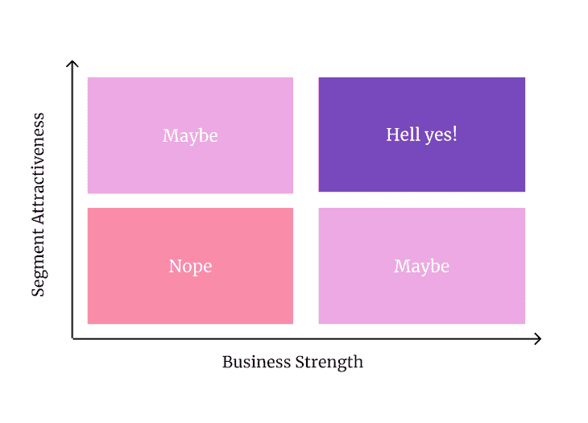

# 客户细分:什么是客户细分以及如何进行客户细分

> 原文：<https://blog.logrocket.com/product-management/customer-segmentation-definition-how-to/>

你进行客户细分的方式可以决定你产品的成败。

如果你做得好，你可以定制你的价值主张，包装和定价，以赢得一个明确的客户群的心。做得不好，你最终会得到一个没人喜欢的产品。

细分带来专注。适合所有人的产品不适合任何人。你越是专注于某个特定的细分市场，就越有可能赢得并主宰这个细分市场。

说到底，赢得一个更小但定义明确的市场比努力让所有人都满意要好。

后者是不可能的。想都别想。

* * *

* * *

## 什么是好的客户细分？

让我们首先定义什么是好的客户群。毕竟，有数百种可能的方法和标准来划分人群。你甚至可以根据人们内衣的颜色来区分他们。不过，这可能会令人担忧。

好的细分市场有两个核心特征。好的细分应该是:

*   **可瞄准的** —你可以调整你的[分销渠道](https://blog.logrocket.com/product-management/product-growth-channels-strategies-examples/)瞄准特定的细分市场，过滤掉其余的
*   **同质** —细分市场中的人们应该以相似的方式对产品、包装、信息等做出反应

一个理想的细分市场还应该是**自我参照**——这意味着该细分市场中的人们倾向于互相推荐产品。

换句话说，适当的市场细分可以让你在不同的细分市场采取不同的行动。

如果你不能做到这一点，为什么还要麻烦呢？

## 识别客户群的标准

### 为什么人口统计学很少起作用

根据人口统计数据(如性别、国籍、年龄等)进行细分。，仍然是最流行的方法之一。主要是因为这是最直接的标准。

也是最蠢的。

我们再来看看好段子的特点。扪心自问，如果你按年龄和性别细分，是这样一个细分:

*   **有针对性？**种；你可以设置针对特定人群的广告，但仅此而已
*   **同质？**否；人们可以有相同的年龄、性别和国籍，但仍然代表完全不同的思维类别
*   **自引？**有所指；尽管具有相似人口统计学特征的人更有可能相互推荐新产品，但由于他们不是同质的，推荐的频率和有效性是有限的

### 如何定义用户群

幸运的是，有更好的方法来确定细分标准。我最喜欢的定义用户群的方法包括以下三个步骤:

1.  找到经历相似[需求和痛苦](#needs-and-pains)的人
2.  找到一个[重视相似解](#perceived-value)的子群
3.  关注具有类似[支付意愿](#willingness-to-pay)的群体

#### 1.需求和痛苦

没有什么比经历共同的痛点更能把人联系起来了。疼痛不会因年龄、性别或其他因素而有所不同。

你可以让一个 9 岁的孩子、一个 80 岁的老奶奶和一个 35 岁的企业员工经历相同的痛点，有相同的需求，尽管原因不同。

例如，孩子可能想提高他们的英语语法技能，以在学校的考试中获得高分。公司员工可能想听起来更专业。祖母可能在记忆正确的结构方面有问题。

尽管他们的人口统计数据完全不同，但一个共同的需求使他们成为一个相对同质的群体。

#### 2.感知价值

一种需求可以通过多种解决方案来满足。了解有价值的人如何找到给定类型的解决方案是细分或进一步细分用户群的另一个好方法。

例如，可能有一大群人正经历着与日常通勤相关的痛点。然而，这一部分还不够均匀。可能会有一群人:

*   想彻底取消通勤吗——你不会用更快的火车或公共汽车来满足他们；他们想要的只是一份远程工作
*   他们热爱自己的工作，但讨厌公共交通——他们会看到电动自行车或踏板车等个性化解决方案的最大价值
*   更喜欢公共交通工具——他们最大的梦想是在他们的家和办公室之间有一条直达的地铁线
*   习惯于现状的人——他们抱怨并经历痛苦，但不愿意做任何事情；他们不够关心

尽管这些客户经历了同样的痛苦，但他们对不同的解决方案有不同的评价。因此，应该将它们视为独立的部分。你必须采取不同的行动来赢得这些不同的小组。

* * *

订阅我们的产品管理简讯
将此类文章发送到您的收件箱

* * *

#### 3.支付意愿

一个真正同质和自我参照的细分市场是愿意为相似的功能支付相似的钱。

回到我们的通勤例子:假设你定义了一群经历日常通勤痛苦的人。你决定将关注范围缩小到那些想独自通勤同时避免乘坐公共交通工具的人。还有一个关键因素摆在桌面上:不同的人愿意支付不同的金额来解决问题。

你可能会发现人们愿意花很多钱只是为了让他们的通勤更愉快。例如，你可以用一些高档电动自行车来满足这些人。但是也有一些更节俭的人买不起这样的自行车。电动滑板车包月可能是更适合他们的解决方案。等等，等等。

如果你不能以类似的方式赢得细分市场，那么它就太异类了。通过将具有不同支付意愿的群体视为不同的(子)细分群体来缩小范围。

## 如何对客户群进行优先排序

如果你遵循我提出的标准，并根据痛苦、感知价值和支付意愿进行细分，你将会有不止一个细分市场——换句话说，你将会有太多的细分市场。

这是一个很好的问题。拥有 20 个明确的、可操作的用户群比一个模糊的、庞大的用户群要好。但是你如何决定首先关注哪个部分呢？

有两个标准值得考虑:

### 细分市场吸引力

细分市场有多大吸引力？通过迎合特定细分市场的需求，你能获得多少价值？

评估细分市场吸引力的一些标准包括:

*   **强迫性** —用户体验的需求有多强烈？
*   **尺寸** —分段有多大？
*   **增长** —增长还是下降？
*   竞争对手 —其他公司是否专注于该细分市场？
*   **进入壁垒** —进入细分市场有多难？

### 商业实力

您的公司在解决特定细分市场方面的定位如何？根据你目前的商业模式，一些细分市场可能比其他市场更容易进入。

您可以通过查看以下信息来评估业务实力:

*   **能力** —你是否拥有技能、知识和专业技能来满足特定细分市场的需求？
*   **可信度**——在你想要解决的领域，你是否已经有了可信度？如果没有，你能多快在那里建立一个强大的声誉？
*   **分销** —你能利用现有的分销渠道来锁定细分市场的目标人群吗？
*   **一致性** —进入该细分市场与公司使命、[愿景](https://blog.logrocket.com/product-management/what-is-a-product-vision-statement-examples/)和[战略](https://blog.logrocket.com/product-management/product-strategy-frameworks-examples/)的一致性如何？

既有吸引力又容易赢得的细分市场是您的最佳选择。其次，选择最有吸引力的(大赌注)或最有胜算的(小优化)。其他的忽略。

## 4 步客户细分框架

适当的细分会让你集中注意力。最后赢个一两个小分段总比在一个大分段里马马虎虎好。

一个好的细分市场是同质的、有针对性的、自我参照的。虽然人口统计细分是最直接的方法，但它不符合好的细分的特征。大多数情况下，就是没用。

要选择您的下一个客户群，您可以使用以下四步框架:

1.  找到一组人共有的[独特需求或痛点](#needs-and-pains)
2.  了解[这个群体中的人最看重什么](#perceived-value)
3.  发现这些人愿意为他们最看重的东西支付多少钱
4.  [通过比较细分市场的吸引力和你的业务优势，对客户细分市场进行优先排序](#how-to-prioritize-customer-segments)

如有疑问，进一步细分。定义太窄的细分市场是非常罕见的。通常情况下，人们会定义宽泛的、不可操作的细分市场。

## [LogRocket](https://lp.logrocket.com/blg/pm-signup) 产生产品见解，从而导致有意义的行动

[LogRocket](https://lp.logrocket.com/blg/pm-signup) 确定用户体验中的摩擦点，以便您能够做出明智的产品和设计变更决策，从而实现您的目标。

使用 LogRocket，您可以[了解影响您产品的问题的范围](https://logrocket.com/for/analytics-for-web-applications)，并优先考虑需要做出的更改。LogRocket 简化了工作流程，允许工程和设计团队使用与您相同的[数据进行工作](https://logrocket.com/for/web-analytics-solutions)，消除了对需要做什么的困惑。

让你的团队步调一致——今天就试试 [LogRocket](https://lp.logrocket.com/blg/pm-signup) 。

[Bart Krawczyk Follow](https://blog.logrocket.com/author/bartkrawczyk/) Learning how to build beautiful products without burning myself out (again). Writing about what I discovered along the way.