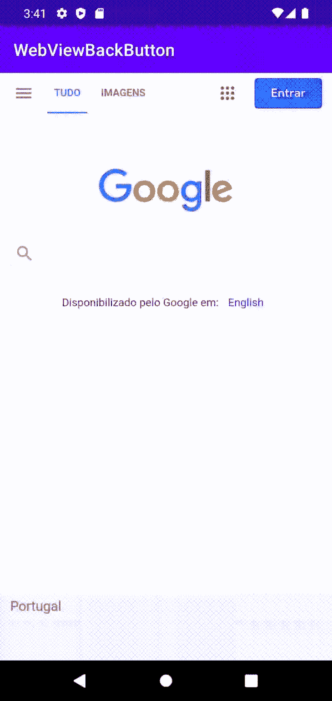
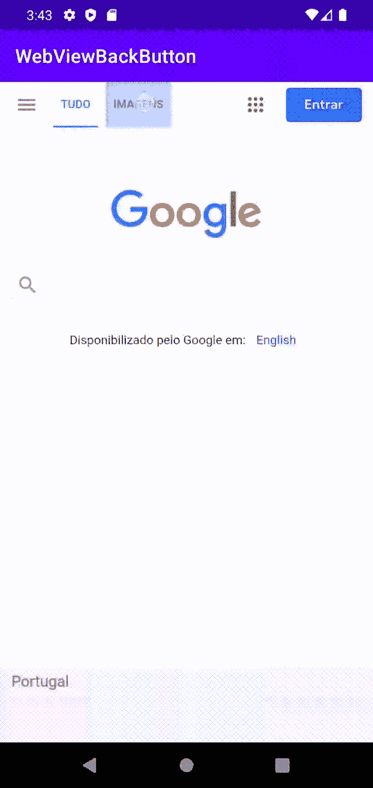
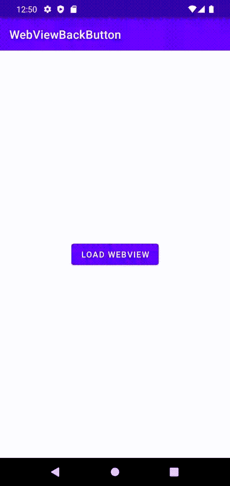
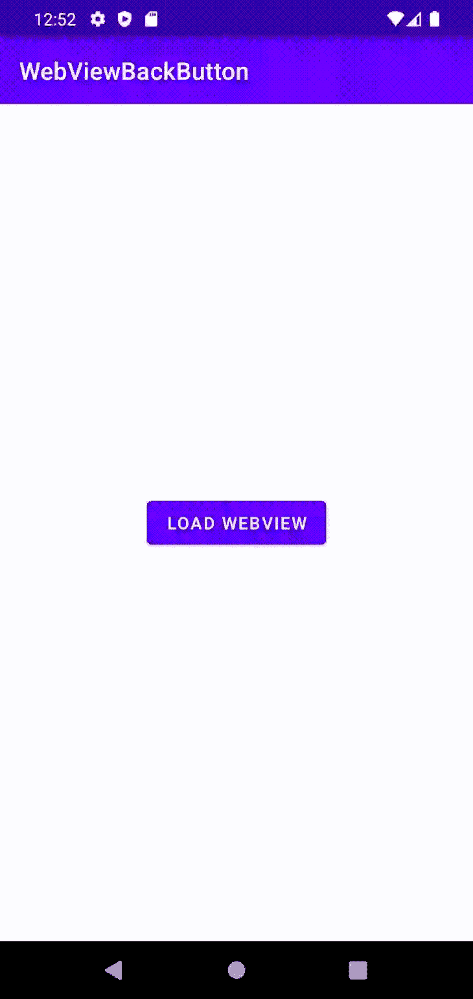

# WebView 和 Android 后退按钮导航

> 原文：<https://blog.logrocket.com/customize-androids-back-button-navigation-webview/>

WebView 是一个 Android 组件，允许开发者在应用程序中显示网页。

WebView 可以在多种场景中发挥作用。例如，它可以用来显示 Web 和 Android 之间的公共页面，比如“条款&隐私”页面。它还可以用来显示页面，从而避免网络请求，然后解析数据以在 Android 布局中显示。

你可能会想，如果你可以在 Android 应用程序中显示网页，那么你就可以构建自己的浏览器应用程序！

默认情况下，WebView 只有一个目标——显示网页。它不包括像真正的网络浏览器那样的功能，如导航控件或地址栏。但是，如果它是一个视图，并且您可以将它包含在活动布局中，那么您也可以包含自己的控件。

在本文中，我们将分享 Android 开发人员在使用 WebView 时经常遇到的常见问题的解决方案，例如如何定制 Android 的后退按钮导航。本文中的所有代码都是 Kotlin。

*向前跳转:*

## 如果没有内容，处理页面导航和页面重新加载

当用户点击 WebView 中的链接时，Android 操作系统将尝试在能够处理 URL 的外部应用程序中打开它，例如浏览器:



要允许用户在他们的网页历史中向前和向后导航，您需要为 WebView 提供一个 WebViewClient:

```
val myWebView: WebView = findViewById(R.id.webview)
myWebView.webViewClient = WebViewClient()
```



除了使用默认的`WebViewClient`，你也可以实现自己的，比如:

```
myWebView.webViewClient = object : WebViewClient() {
    …
}

```

`WebViewClient`的两个最常被覆盖的行为是`onPageStarted`和`onPageFinished`。

```
myWebView.webViewClient = object : WebViewClient() {
     override fun onPageStarted(view: WebView?, url: String?, favicon: Bitmap?) {
         super.onPageStarted(view, url, favicon)
     }
      override fun onPageFinished(view: WebView?, url: String?) {
         super.onPageFinished(view, url)
     }
}

```

使用这两种方法，您可以了解页面何时开始和完成加载，并且可以访问 URL。

`onPageFinished`的一个常见实现是当页面完成加载时，如果内容高度为`0`则刷新网页，因为这可能表明出现了问题(例如，PDF 可能无法在 WebView 上加载):

```
myWebView.webViewClient = object : WebViewClient() {
     override fun onPageStarted(view: WebView?, url: String?, favicon: Bitmap?) {
         super.onPageStarted(view, url, favicon)
     }
      override fun onPageFinished(view: WebView?, url: String?) {
              if (view?.contentHeight == 0) {
                  view.reload()
              } else {
                 super.onPageFinished(view, url)
              }
     }
}

```

## 处理后退按钮导航

如前所述，WebView 没有内置导航控件。如果你打开了一个页面，然后点击了 Android 的后退按钮，它将不会转到 WebView 上之前访问过的页面。相反，它将在应用程序内部导航，如下所示:



通常，WebViews 是在它们自己的活动上实现的。要解决这个问题，我们需要仔细看看我们能够访问的活动行为。

Activity 类提供了各种覆盖和自定义行为的方法。一个例子是`onKeyDown`；当一个键被按下时，这个方法被调用。

我们可以使用这种方法来检测用户何时按下设备的后退按钮。这里有一个例子:

```
override fun onKeyDown(keyCode: Int, event: KeyEvent?): Boolean {
    if (keyCode == KeyEvent.KEYCODE_BACK && webView.canGoBack()) {
        webView.goBack()
        return true
    }
    // If it wasn't the Back key or there's no webpage history, bubble up to the default
    // system behavior (probably exit the activity)
    return super.onKeyDown(keyCode, event)
}

```

WebView 提供了一些有用的实用方法，比如`canGoBack`和`goBack`。

我们可以使用`canGoBack`来找出一个页面之前是否被加载过。我们可以使用`goBack`来加载上一页:

```
if (keyCode == KeyEvent.KEYCODE_BACK && webView.canGoBack()) 

```

上面的代码检查按下的键是否是设备的后退按钮，以及在按钮被按下之前是否加载了任何页面。如果结果是肯定的，就调用`goBack`方法。

`onKeyDown`返回一个布尔值。如果我们想覆盖行为，我们返回`true`；否则，我们返回`false`。

通过将此代码添加到我们的活动中，我们应该会看到以下行为:



## 分析访问的 URL

在某些情况下，我们可能希望将用户重定向到外部应用程序。例如，我们可能希望允许用户打开 PDF。

为了实现这一点，WebViewClient 提供了另一个可以被覆盖的方法，称为`shouldOverrideUrlLoading`:

```
myWebView.webViewClient = object : WebViewClient() {
    override fun shouldOverrideUrlLoading(
        view: WebView?,
        request: WebResourceRequest?
    ): Boolean {
        …
        return super.shouldOverrideUrlLoading(view, request)
    }
}

```

每次加载新的 URL 时都会调用这个方法。这使我们能够检查加载的是什么 URL，并做出相应的反应:

```
myWebView.webViewClient = object : WebViewClient() {
    override fun shouldOverrideUrlLoading(
        view: WebView?,
        request: WebResourceRequest?
    ): Boolean {
        view?.url?.let { url ->
           if (url.endsWith(".pdf")) {
               startActivity(Intent(Intent.ACTION_VIEW, Uri.parse(url)))
               return true
           }
        }

        return super.shouldOverrideUrlLoading(view, request)
    }
}

```

WebView 有一个名为`url`的属性，对应于当前加载的 URL。我们可以获取该属性并确认 URL 是否以 PDF 扩展名结尾，如下所示:

`if (url.endsWith(".pdf"))`

如果 URL 确实以`.pdf`结尾，我们将它委托给操作系统来寻找一个可以处理该类型 URL 的应用程序。每次我们想要覆盖`shouldOverrideUrlLoading`时，必须返回`true`的值。

## 页面加载时显示加载屏幕

为了改善用户体验，我们可以提供一种方式让用户知道页面仍在加载。我们可以通过覆盖`WebViewClient`上的`onPageStarted`和`onPageFinished`来实现，就像这样:

```
myWebView.webViewClient = object : WebViewClient() {
     override fun onPageStarted(view: WebView?, url: String?, favicon: Bitmap?) {
         super.onPageStarted(view, url, favicon)
     }
      override fun onPageFinished(view: WebView?, url: String?) {
         super.onPageFinished(view, url)
     }
}

```

假设您有一种显示加载屏幕的方式，比如包含进度条的弹出窗口，您可以分别在`onPageStarted`和`onPageFinished`上显示和关闭加载屏幕。

这里有一个例子:

```
myWebView.webViewClient = object : WebViewClient() {
     override fun onPageStarted(view: WebView?, url: String?, favicon: Bitmap?) {
         super.onPageStarted(view, url, favicon)
         showLoading()
     }
      override fun onPageFinished(view: WebView?, url: String?) {
         super.onPageFinished(view, url)
         dismissLoading()
     }
}

```

## 处理渲染进程崩溃

另一个常见问题是当 WebView 的渲染进程崩溃时。这可能是因为系统终止了渲染器以回收急需的内存，或者是因为渲染进程本身崩溃。

如果崩溃堆栈跟踪包含以下消息，您通常会知道您正在处理这个问题:

```
Render process's crash wasn't handled by all associated webviews, triggering application crash.

```

错误信息也可能引用`processId`。

为了确保用户体验不会受到负面影响，必须处理崩溃，否则应用程序将关闭。

* * *

### 更多来自 LogRocket 的精彩文章:

* * *

出现此错误后，无法重用关联的 WebView 实例。相反，它必须被销毁并从视图层次结构中删除，并且必须创建一个新的 WebView 实例。

如果在访问特定网页时渲染进程崩溃，尝试加载相同的页面可能会导致相同的问题。

为了处理这个问题，我们需要在`WebViewClient`上覆盖`onRenderProcessGone`，就像这样:

```
myWebView.webViewClient = object : WebViewClient() {
    override fun onRenderProcessGone(view: WebView, detail: RenderProcessGoneDetail): Boolean {
        if (!detail.didCrash()) {
            Log.e("MY_APP_TAG", ("System killed the WebView rendering process " +
                "to reclaim memory. Recreating..."))

            myWebView?.also { webView ->
                val webViewContainer: ViewGroup = findViewById(R.id.my_web_view_container)
                webViewContainer.removeView(webView)
                webView.destroy()
                myWebView = null
            }

            // By this point, the instance variable "myWebView" is guaranteed
            // to be null, so it's safe to reinitialize it.

            return true // The app continues executing.
        }

        Log.e("MY_APP_TAG", "The WebView rendering process crashed!")

        return false
    }
}

```

如果`RenderProcessGoneDetail` `didCrash()`返回值`false`，这意味着进程因为系统内存不足而被终止。在这种情况下，应用程序可以通过创建新的 WebView 实例来正常恢复。

当从`onRenderProcessGone`返回一个值`true`时，这意味着我们希望保持应用程序运行，而不是因为崩溃而关闭它。

如果`RenderProcessGoneDetail` `didCrash()`返回一个值`true`，这意味着进程由于内部错误而终止，比如内存访问冲突。这种情况下如果返回`false`，检测到渲染器崩溃后 app 会崩溃。

要更优雅地处理崩溃并允许应用程序继续执行，请遵循以下步骤:

1.  销毁当前 WebView 实例
2.  指定应用程序如何继续执行的逻辑
3.  从`onRenderProcessGone`返回`true`

## 结论

在本文中，我们调查了 Android 开发人员在使用 WebView 时遇到的一些最常见的问题，并提供了解决方案。具体来说，我们研究了如何:使用 WebView 定制 Android 的后退按钮导航，处理页面导航和页面重载(如果没有内容)，分析访问的 URL，在页面加载时显示加载屏幕，以及处理渲染过程崩溃。

要了解更多关于 WebView 的信息，请查看官方文档中的[在 WebView 中构建 web 应用](https://developer.android.com/develop/ui/views/layout/webapps/webview)和[管理 WebView 对象](https://developer.android.com/develop/ui/views/layout/webapps/managing-webview)。

## 使用 [LogRocket](https://lp.logrocket.com/blg/signup) 消除传统错误报告的干扰

[](https://lp.logrocket.com/blg/signup)

[LogRocket](https://lp.logrocket.com/blg/signup) 是一个数字体验分析解决方案，它可以保护您免受数百个假阳性错误警报的影响，只针对几个真正重要的项目。LogRocket 会告诉您应用程序中实际影响用户的最具影响力的 bug 和 UX 问题。

然后，使用具有深层技术遥测的会话重放来确切地查看用户看到了什么以及是什么导致了问题，就像你在他们身后看一样。

LogRocket 自动聚合客户端错误、JS 异常、前端性能指标和用户交互。然后 LogRocket 使用机器学习来告诉你哪些问题正在影响大多数用户，并提供你需要修复它的上下文。

关注重要的 bug—[今天就试试 LogRocket】。](https://lp.logrocket.com/blg/signup-issue-free)

## LogRocket :即时重现你的安卓应用中的问题。

[](https://lp.logrocket.com/blg/kotlin-signup)

[LogRocket](https://lp.logrocket.com/blg/kotlin-signup) 是一款 Android 监控解决方案，可以帮助您即时重现问题，确定 bug 的优先级，并了解您的 Android 应用程序的性能。

LogRocket 还可以向你展示用户是如何与你的应用程序互动的，从而帮助你提高转化率和产品使用率。LogRocket 的产品分析功能揭示了用户不完成特定流程或不采用新功能的原因。

开始主动监控您的 Android 应用程序— [免费试用 LogRocket】。](hhttps://lp.logrocket.com/blg/kotlin-signup)