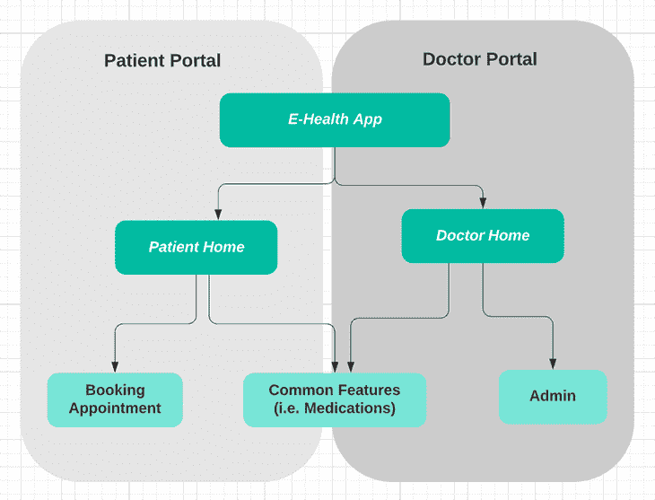
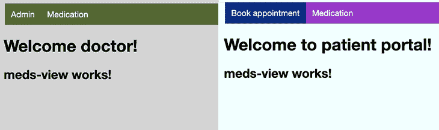

# 为多个前端定制角度惰性加载模块

> 原文：<https://blog.logrocket.com/customize-angular-lazy-loading-modules-multiple-frontends/>

在搭建企业 Angular app 的时候，我们往往需要开发几个不同的前端来服务不同的用户类型或者渠道。虽然它们可能需要不同的用户界面风格或具有独特的功能，但它们仍然有许多共同的功能。

一种解决方案是为每个前端创建单独的应用程序，作为不同的离散项目。也许很明显，这种方法会膨胀代码库，很可能导致重复，并留给您难以维护的代码。

因此，您可能会想，您需要寻找一个单一角度的项目解决方案，它能够在最大化代码共享的同时，干净地分离不同的 UI 组件和服务。那是相当大的挑战！

但是，就像我们每天做出的其他软件设计决策一样，关键是在这两个关注点之间找到平衡:清晰分离的代码和可共享的服务和实用功能。

在本文中，我们将探讨如何利用延迟加载功能模块和动态配置来构建一个具有多个前端的 Angular 应用程序。

## 概观

作为一个虚构的例子，我们将构建一个具有两个前端的电子医疗应用程序:

*   患者门户:患者可以使用该应用程序预约、管理他们的药物等。
*   医生门户:医生将能够执行管理任务，管理药物等。

如下图所示，这两个门户公开了不同的特性，但是构建在相同的框架上，并且共享一些共同的功能。



我们希望实现的目标是:

*   两个门户之间的明确分离:它们可以有自己的样式或导航，而不会影响另一个门户
*   共享一组公共代码和功能模块的能力
*   每个前端应用程序都可以独立构建和部署
*   构建的包不会包含没有被使用的模块

## 设置角度项目

在我们开始之前，请确保您的本地环境安装了以下工具:

*   Node.js ≥ v10.x.x
*   角度 CLI ≥ v9.x.x

使用以下 Angular CLI 命令，我们可以创建一个新的应用程序框架。

```
ng new multipleFront
```

新创建的应用程序包含一个默认应用程序模块和一个默认入口组件。我们可以使用以下 CLI 命令添加一个新模块。

```
ng g module patient --route patient --module app.module
```

这些命令将生成一个包含`module`、`routing`和`component`文件的患者文件夹。

要创建新组件，我们可以使用以下 CLI 命令:

```
ng g component home
```

使用上面的 CLI 命令，我们可以如下设置我们的项目结构。

```
 -- app
    -- patient module
          |-- [+] home components
          |-- patient-routing.module.ts
          |-- patient.module.ts
    -- doctor module
          |-- [+] home components
          |-- doctor-routing.module.ts
          |-- doctor.module.ts
    -- features
          |-- [+] admin module
          |-- [+] booking module
          |-- [+] meds module
    - app-routing.module.ts
    - app.module.ts
    - routes.ts
    - app-component.html
```

## 在 Angular 中创建延迟加载功能模块

在 Angular 中，一切都被组织成模块。在上一步中，我们生成了默认的 app 模块，这是 app 的入口点。我们可以通过引导应用程序模块来启动应用程序。

然后，我们创建了[特性模块](https://angular.io/guide/feature-modules)。它们通常按领域进行组织，可用于将相关的组件、服务和其他功能组合在一起。

功能模块有一个根组件，作为模块的主视图。它托管模块*中的所有子组件。*下面的例子显示了管理功能模块及其根组件:`AdminViewComponent`。

```
    -- features
          |--  admin module
             |-- [+] Admin-View component
             |-- admin-routing.module.ts
             |-- admin.module.ts
```

特性模块的一些好处包括能够[使用延迟加载](https://blog.logrocket.com/understanding-lazy-loading-in-javascript/)按需加载它们，以及减少主应用程序的包大小。

```
      {
        path: 'booking',
        data: { title: 'Book appointment' },
        loadChildren: () =>
          import('../features/booking/booking.module').then(
            (m) => m.BookingModule
          ),
      }
```

在上述示例路线中，`booking`特征模块仅在路线激活时加载。在构建时，为延迟加载的特性模块创建一个单独的包文件，使主包文件变得更小。

## 通过环境文件定位前端

为了定位每个前端门户，我们将为它们创建不同的环境文件。两个环境文件都将驻留在`environment`文件夹下，我们将使用`moduleId`来区分患者和医生门户。

```
// environment.ts
// default environment targeting the patient portal
export const environment = {
  production: false,
  moduleId: 'default'
}

// environment.doctor.ts
export const environment = {
    production: false,
    moduleId: 'doctor'
  }
```

## 设置特定于前端的动态路由

路线是 Angular 的主干。不同的前端需要不同的路由。为了只为每个门户提供它需要的路由，我们必须在运行时动态地生成路由。

首先，我们在一个文件`routes.ts`中定义所有的路径，以便于维护。

```
export const routes: Routes = [
    {
      path: '',
      data: { name: 'default', modules: ['all'] },
      redirectTo: 'home',
      pathMatch: 'full',
    },
    {
      path: 'home',
      data: { name: 'home', title: 'Home', modules: ['default'] },
      loadChildren: () =>
        import('./patient/patient.module').then((m) => m.PatientModule),
    },
    {
      path: 'home',
      data: { name: 'home', title: 'home', modules: ['doctor'] },
      loadChildren: () =>
        import('./doctor/doctor.module').then((m) => m.DoctorModule),
    },
  ];

```

为什么文件里有两条`Home`路线？这是因为项目中有两个门户应用程序，它们都需要一个`Home` 路径。

在定义了路由之后，我们设置了`APP_INITIALIZER` [DI 令牌](https://angular.io/guide/glossary#di-token)来挂钩到应用程序引导过程。

```
  providers: [
    {
      provide: APP_INITIALIZER,
      useFactory: loadRoutes,
      deps: [Injector],
      multi: true,
    },
  ]
```

`APP_INITIALIZER`令牌代表一个工厂函数`loadRoutes`。该函数在应用程序引导过程中执行。该功能将过滤路由并将路由设置到当前路由器中，并且该功能将在 app 完全启动之前完成。

```
export function loadRoutes(injector: Injector) {
  return () => {
      const moduleId = environment.moduleId;
      const filteredRoutes = routes.filter((r) => {
        return (
          r.data?.modules.find((r: string) => r === 'all') ||
          r.data?.modules.find((r: string) => r === moduleId)
        );
      });
      const router: Router = injector.get(Router);
      router.resetConfig(filteredRoutes);
    };
}
```

在上面的`loadRoutes`功能中，路线由`moduleId`配置过滤。因此，只有相关的路线将被加载到应用程序中。

* * *

### 更多来自 LogRocket 的精彩文章:

* * *

## 基于路线创建动态菜单

另外，我们可以使用动态路线作为数据源来生成菜单。当路线改变时，菜单将自动更新。

首先，我们创建一个菜单服务。它包含了一个`menuItems$`可观测值。

```
menuItems$: BehaviorSubject<MenuItem[]>;
```

一旦服务被初始化，我们就填充菜单项。以下代码的要点是:

*   遍历路由器配置中的路由
*   对于每条路线，我们调用`configLoader`来加载子路线，并将路线数据转换成菜单项
*   将转换后的菜单数据推入可观察的数据流

```
this.router.config.forEach((route) => {
      const children: any[] = [];
      if (route.loadChildren) {
        (this.router as any).configLoader.load(this.injector, route).subscribe({
          next: (moduleConf: { routes: any[] }) => {
            children.push(
              ...moduleConf.routes.map((childRoute) =>
                childRoute.children.map(
                  (x: { path: string; data: { title: string } }) => ({
                    path: x.path,
                    title: x.data?.title,
                  })
                )
              )
            );
            this.menuItems$.next(
              this.menuItems$.value.concat
                .apply([], [...children])
                .filter((x) => x.title)
            );
          },
        });
      }
    });
```

菜单服务被注入到`menu`组件中。我们可以在两个门户应用中使用相同的`menu`组件。同一个菜单组件将动态加载和过滤菜单项。

## 对每个用户界面应用不同的样式

为了对每个应用程序应用不同的样式，我们创建了以下 scss 文件:

*   `styles.scss`–通用样式文件
*   `styles-patient.scss`–患者门户的样式文件
*   `styles-doctor.scss`–医生门户的样式文件

在`Angular.json`文件中，样式被映射到不同的构建。

```
          "doctor": {
             "styles": ["src/styles-doctor.scss"],
```

## 构建并运行多个前端包

为了分别构建和运行这两个门户，我们依赖于环境配置。

由于应用程序包含两个环境，`default`和`doctor`，我们需要将下面的配置添加到`Angular.json`文件中。

下面的`fileReplacements`设置指定默认的`environment.ts`文件将在运行时被`environment.doctor.ts`文件替换。

```
            "doctor": {
              "fileReplacements": [
                {
                  "replace": "src/environments/environment.ts",
                  "with": "src/environments/environment.doctor.ts"
                }
              ],

```

可以使用以下命令为其环境构建每个门户应用程序。

```
// package.json
// build patient portal with default configuration
"build": "ng build",
// build doctor portal
"build:doctor": "ng build -c doctor"
```

为了在生产模式下构建应用程序，我们运行以下命令。请注意，`doctorproduction`是我们的`Angular.json`文件中的另一个环境配置。

```
// package.json
// build the patient portal in production mode
"build:patient:prod": "ng build --prod"

// build the doctor portal in production mode
"build:doctor:prod": "ng build -configuration doctorproduction"
```

构建输出将被复制到`dist`文件夹中，准备发布到 webhost。

我们可以使用下面的命令之一来启动应用程序。

```
// package.json
// start the app as default patient portal
"start": "ng serve"

// start the app as doctor portal
"start:doctor": "ng serve -c doctor"
```

现在，我们已经成功启动了 app！患者和医生门户的主页屏幕如下所示。


## 代码分离和共享

患者门户和医生门户有不同的入口组件，它们充当子组件的容器。每个门户都可以有自己的页眉/页脚组件和独立的 CSS 样式。当我们改变一个应用程序时，另一个不会受到影响。

如上面的示例应用程序所示，每个门户挑选自己的功能模块并延迟加载它们。延迟加载功能模块内置在小的捆绑文件中，只有在导航到路由器时，这些文件才会下载到客户端浏览器。例如，当部署并运行医生门户时，将只加载医生模块。不会加载患者门户模块，因为它们不在路线中。

这种设计[带来了更好的性能](https://blog.logrocket.com/speed-up-react-app-dynamic-imports-route-centric-code-splitting/)，因为每个应用程序都不会加载不需要的模块。它还具有很好的安全性——因为患者门户部署包仅由相关模块构建，所以不可能从患者门户访问仅医生门户模块！

虽然这两个门户作为不同的应用程序工作，但它们实际上位于同一个项目中。这个[使得代码共享变得容易](https://blog.logrocket.com/make-sharing-typescript-code-types-quick-easy/)，并且允许公共框架被提取到一个共享模块中。

## 摘要

在本文中，我们将通过一个有两个前端的 [Angular app](https://blog.logrocket.com/tag/angular) 进行演示。它们由角度定制环境配置、动态路线和延迟加载功能模块构建而成。我们实现了清晰分离、简单代码共享和独立构建输出的目标。

希望这篇文章对你有用。示例项目的[源代码，包括我们之前提到的 CSS 样式文件，可以在我的 GitHub 上找到。](https://github.com/sunnyy02/MultipleFront)

## 像用户一样体验 Angular 应用程序

调试 Angular 应用程序可能很困难，尤其是当用户遇到难以重现的问题时。如果您对监视和跟踪生产中所有用户的角度状态和动作感兴趣，

[try LogRocket](https://lp.logrocket.com/blg/angular-signup)

.

[](https://lp.logrocket.com/blg/angular-signup)[https://logrocket.com/signup/](https://lp.logrocket.com/blg/angular-signup)

LogRocket 就像是网络和移动应用程序的 DVR，记录你网站上发生的一切，包括网络请求、JavaScript 错误等等。您可以汇总并报告问题发生时应用程序的状态，而不是猜测问题发生的原因。

LogRocket NgRx 插件将角度状态和动作记录到 LogRocket 控制台，为您提供导致错误的环境，以及出现问题时应用程序的状态。

现代化调试 Angular 应用的方式- [开始免费监控](https://lp.logrocket.com/blg/angular-signup)。