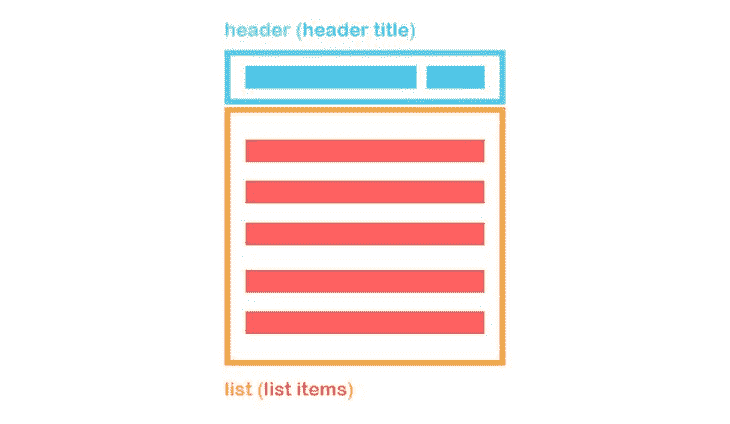
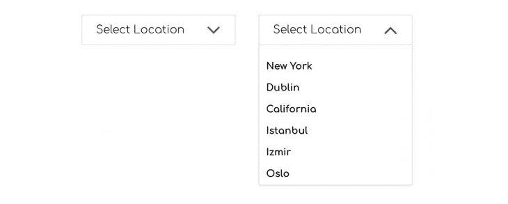
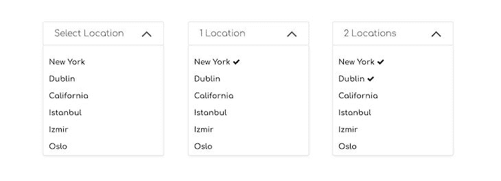

# 定制一个可重用的 React 下拉菜单组件

> 原文：<https://blog.logrocket.com/customize-reusable-react-dropdown-menu-component/>

***编者按**:这篇文章最后一次更新是在 2022 年 6 月 15 日，以使示例组件可重用，并包括关于流行的下拉组件库的信息。*

当向应用程序添加样式和其他特定需求时，将现有组件应用到项目中可能并不总是像您希望的那样顺利。考虑到您可能在适应过程中花费的时间，构建您自己的组件可能对您最有利。

dropdown 组件是带有扩展样式的下拉选择选项的[定制版本，对网页上的内容进行排序和过滤。在本教程中，我们将介绍我在个人项目中使用的方法，在 React 中创建自定义下拉菜单组件。](https://blog.logrocket.com/creating-multilevel-dropdown-menu-react/)

完整的源代码和样式文件，可以参考 [GitHub repo](https://github.com/dbilgili/Custom-ReactJS-Dropdown-Components) 。我们开始吧！

在深入技术内容之前，让我们快速了解下拉菜单组件的视觉结构，以确定需求:



下拉菜单由四个基本组件组成:标题换行、标题标题、列表换行和列表项。

相应的 HTML 看起来像下面的代码:

```
<div className="dd-wrapper">
  <div className="dd-header">
    <div className="dd-header-title"></div>
  </div>
  <div className="dd-list">
    <button className="dd-list-item"></button>
    <button className="dd-list-item"></button>
    <button className="dd-list-item"></button>
  </div>
</div>

```

我们需要能够在点击`dd-header`时切换`dd-list`，并在用户点击`dd-wrapper`之外时关闭它。我们还需要根据数据自动填充`<button>`标签，并且我们需要能够动态控制标题。

请记住，如果您希望显示和比较嵌套的项目，或者如果您只有两个选项可供选择，则不应该使用下拉组件。在这种情况下，单选按钮将是一个更好的选择。

## 下拉组件中的父子关系

父组件包含一个或多个下拉菜单。由于每个下拉菜单都有独特的内容，我们需要通过将信息作为道具传递来将其参数化。假设我们有一个下拉菜单，可以选择多个位置。

考虑父组件中的以下状态变量:

```
constructor(){
  super()
  this.state = {
    location: [
      {
          id: 0,
          title: 'New York',
          selected: false,
          key: 'location'
      },
      {
          id: 1,
          title: 'Dublin',
          selected: false,
          key: 'location'
      },
      {
          id: 2,
          title: 'California',
          selected: false,
          key: 'location'
      },
      {
          id: 3,
          title: 'Istanbul',
          selected: false,
          key: 'location'
      },
      {
          id: 4,
          title: 'Izmir',
          selected: false,
          key: 'location'
      },
      {
          id: 5,
          title: 'Oslo',
          selected: false,
          key: 'location'
      }
    ]
   }
  }

```

在上面的代码中，当填充`location`数组时，我们有一个惟一的`id`用于 map 方法的 key prop。我们为列表中的每一项都准备了一个`title`，一个名为`selected`的布尔变量，用于在下拉菜单中有多个选择的情况下切换列表中的选定项，最后，还有一个`key`变量，可以方便地与`setState`函数一起使用。我们稍后会谈到这一点。

让我们看看到目前为止我们传递给`Dropdown`组件的道具是什么。下面，您将看到在父组件中使用的`Dropdown`组件，其中我们传递了一个标题和一组数据来填充下拉列表:

```
<Dropdown  
  title="Select location"
  list={this.state.location}
/>

```

在编辑`render()`方法之前，我们需要在`Dropdown`组件中包含以下状态变量:

```
<constructor(props){
  super(props)
  this.state = {
    isListOpen: false,
    headerTitle: this.props.title
  }
}

```

我们有一个名为`isListOpen`的布尔变量用于切换菜单列表，还有一个`headerTitle`，默认情况下它等于`title`道具。

现在，看看我们组件的`render()`方法。注意，渲染 JSX 标记中使用的[字体 Awesome](https://fontawesome.com/) 包是一个外部 npm 包。您应该安装它并将其导入到`Dropdown`组件中，如下所示:

```
import FontAwesome from 'react-fontawesome';

```

您还需要在项目的`index.html`中包含以下`<link>`标签，这是字体 Awesome 正常工作所必需的:

```
<link href="https://maxcdn.bootstrapcdn.com/font-awesome/4.7.0/css/font-awesome.min.css" rel="stylesheet" />

```

在`render()`方法中，我们有前面提到的带有标题和包含列表项的列表的结构。您会注意到我们在渲染方法中使用了`toggleList()`和`selectItem()`函数。让我们现在创建这些函数:

```
render() {
  const { isListOpen, headerTitle } = this.state;
  const { list } = this.props;

  return (
    <div className="dd-wrapper">
      <button
        type="button"
        className="dd-header"
        onClick={this.toggleList}
      >
        <div className="dd-header-title">{headerTitle}</div>
        {isListOpen
          ? <FontAwesome name="angle-up" size="2x" />
          : <FontAwesome name="angle-down" size="2x" />}
      </button>
      {isListOpen && (
        <div
          role="list"
          className="dd-list"
        >
          {list.map((item) => (
            <button
              type="button"
              className="dd-list-item"
              key={item.id}
              onClick={() => this.selectItem(item)}
            >
              {item.title}
              {' '}
              {item.selected && <FontAwesome name="check" />}
            </button>
          ))}
        </div>
      )}
    </div>
  )
}

```

`toggleList()`函数只是切换`isListOpen`状态变量，显示或隐藏项目列表:

```
toggleList = () => {
   this.setState(prevState => ({
     isListOpen: !prevState.isListOpen
  }))
}

```

另一方面，`selectItem()`功能将`headerTitle`状态设置为所选项目的标题，并将`isListOpen`状态设置为`false`以在选择后关闭列表。

设置完这些状态后，它调用`resetThenSet()`回调函数，这是我们需要传递给`Dropdown /`的道具。调用这个回调函数更新父组件中的`location`状态，将被点击的列表项标记为`selected`:

```
selectItem = (item) => {
  const { resetThenSet } = this.props;
  const { title, id, key } = item;

  this.setState({
    headerTitle: title,
    isListOpen: false,
  }, () => resetThenSet(id, key));
}

```



## 从子组件控制父状态

当您将某个东西作为道具传递给子组件时，您只能使用该数据，并且不能更改它，除非您部署额外的道具。如果您在控制状态的父组件中定义了一个函数，然后将该函数作为 prop 传递给子组件，那么您可以从子组件调用该函数并设置父组件的状态。

在下拉菜单的情况下，当单击一个列表元素时，我们需要能够在父组件的`location`状态下切换相应对象的`selected`键。我们通过将`resetThenSet()`函数作为道具传递给`Dropdown`组件来实现。

`resetThenSet()`函数克隆`location`状态，然后将数组中每个对象的`selected`键设置为`false`。然后，它只将被点击项目的`selected`键设置为`true`，因此得名`resetThenSet`。

我们在父组件中定义了这个函数:

```
resetThenSet = (id, key) => {
  const temp = [...this.state[key]];

  temp.forEach((item) => item.selected = false);
  temp[id].selected = true;

  this.setState({
    [key]: temp,
  });
}

```

然后我们将函数作为道具传递给`<Dropdown />`组件:

```
<Dropdown
  title="Select location"
  list={this.state.location}
  resetThenSet={this.resetThenSet}
/>

```

## 单选或多选下拉列表

到目前为止，我们使用的设置是单选下拉菜单所必需的。然而，如果我们希望能够在下拉菜单中选择多个项目，我们需要一个不同的函数来代替`resetThenSet()`。

我们将这个函数命名为`toggleItem()`,因为它只切换`location`数组中项目的`selected`键:

```
toggleItem = (id, key) => {
  const temp = [...this.state[key]];

  temp[id].selected = !temp[id].selected;

  this.setState({
    [key]: temp,
  });
}

```

然后，我们像以前一样传递这个函数作为道具:

```
<Dropdown
  title="Select location"
  list={this.state.location}
  toggleItem={this.toggleItem}
/>

```

在使用`<Dropdown/>`组件中的函数时，我们可以直接调用它，不需要中间函数。这种方法不同于我们使用单一选择下拉菜单的方法，因为我们不需要设置`headerTitle`或关闭列表。

然而，我们仍然需要处理`headerTitle`,这样我们就可以显示选择了多少位置:

```
render() {
  const { list, toggleItem } = this.props;

  return (
    //
    //
      <button
        type="button"
        className="dd-list-item"
        key={item.id}
        onClick={() => toggleItem(item.id, item.key)}
      >
    //
    //
  )
}

```

如前所述，我们没有在多选下拉列表中设置`headerTitle`。然而，不管是单选还是多选下拉列表，我们都需要单独处理`headerTitle`,因为传递的`list`数组可能包含默认情况下`selected`键设置为`true`的条目。该组件应该能够检测到这一点，并相应地设置`headerTitle`。

为了解决这个问题，我们将使用`static getDerivedStateFromProps`生命周期钩子。

`getDerivedStateFromProps`的目的是使一个组件能够根据属性的变化更新其内部状态。它应该返回一个对象来更新状态，如果没有需要更新的内容，则返回 null。

首先过滤`list`道具，看看是否有`selected`键设置为`true`的物体。如果有，将被返回并在`selectedItem`中可用。然后，我们使用这个对象的`title`键来设置`headerTitle`。如果`selectedItem`为空，那么我们简单地返回一个对象，在这里我们将`title`属性设置为`headerTitle`:

```
static getDerivedStateFromProps(nextProps) {
  const { list, title } = nextProps;
  const selectedItem = list.filter((item) => item.selected);

  if (selectedItem.length) {
    return {
      headerTitle: selectedItem[0].title,
    };
  }
  return { headerTitle: title };
}

```

### 多选下拉菜单

当处理多选下拉菜单时，我们通过将`selected`键设置为`true`来检查菜单项的长度。如果这个计数等于`0`，那么我们简单地将`headerTitle`设置为默认的`title`道具。

如果计数等于`1`，那么我们使用一个叫做`titleHelper`的道具。在我们的例子中，这是一个等于`"Location"`的字符串值，允许我们在标题上显示`1 location`。

如果`count`大于`1`，那么我们使用`location`的复数形式，它是通过`titleHelperPlural`属性提供给组件的。在我们的例子中，这个道具等于`"Locations"`:

```
static getDerivedStateFromProps(nextProps) {
  const {
    list,
    title,
    titleHelper,
    titleHelperPlural
  } = nextProps;

  const count = list.filter((item) => item.selected).length;

  if (count === 0) {
    return { headerTitle: title };
  }
  if (count === 1) {
    return { headerTitle: `${count} ${titleHelper}` };
  }
  if (count > 1) {
    return { headerTitle: `${count} ${titleHelperPlural}` };
  }
  return null;
}

```

因此，如果是多选下拉列表，我们的组件将具有以下属性:

```
<Dropdown
  titleHelper="Location"
  titleHelperPlural="Locations"
  title="Select location"
  list={this.state.location}
  toggleItem={this.toggleItem}
/>

```



## 处理外部点击

我们需要处理的最后一件事是当用户在下拉菜单之外点击时关闭下拉菜单。监听`window`对象上的点击事件并切换`isListOpen`状态变量非常简单。然而，这种方法需要一些小技巧才能正常工作。

考虑下面的代码片段，其中我们向依赖于`isListOpen`状态变量的`window`对象添加了一个事件监听器。但是，这种尝试会导致工具提示几乎同时打开和关闭:

```
close = () => {
  this.setState({
    isListOpen: false,
  });
}

componentDidUpdate(){
  const { isListOpen } = this.state;

  if(isListOpen){
    window.addEventListener('click', this.close)
  }
  else{
    window.removeEventListener('click', this.close)
  }
}

```

解决方案是使用带有`0`毫秒延迟或者没有定义任何时间延迟的`setTimeout`方法。因此，它会将下一个事件循环要执行的新任务排队。虽然使用`0`毫秒通常描述了一个应该立即执行的任务，但 JavaScript 的单线程同步特性并非如此。当使用`setTimeout`时，它只是创建一个异步回调。您可以参考特定的 MDN web 文档，了解关于该主题的详细说明:

```
componentDidUpdate(){
  const { isListOpen } = this.state;

  setTimeout(() => {
    if(isListOpen){
      window.addEventListener('click', this.close)
    }
    else{
      window.removeEventListener('click', this.close)
    }
  }, 0)
}

```

还有一件事我们需要考虑。当在多选模式下使用下拉菜单时，很可能我们不想在一个项目被选中时关闭列表，不像在单选模式下。要解决这个问题，我们需要在列表项的`onClick`事件上调用`stopPropagation()`方法。

这样做可以防止相同事件向上冒泡传播到父元素，从而在单击项目时保持项目列表打开:

```
<button
  type="button"
  className="dd-list-item"
  key={item.id}
  onClick={(e) => {
    e.stopPropagation();
    this.selectItem(item);
  }}
>

```

## 流行的下拉组件库

尽管本教程涵盖了从头构建可重用 dropdown 组件的所有步骤，但是也有一些基于 React 的流行 dropdown 组件库，您可以利用它们来实现相同的目标。在撰写本文时，下面的列表包括 npm 注册表上的一些库及其相应的每周下载:

## 结论

在本教程中，我们构建了一个支持单选和多选功能的下拉菜单组件。我们学习了如何通过将函数作为道具传递给子组件并在子组件内部调用它们来控制父组件的状态。

此外，我们使用静态的`getDerivedStateFromProps`方法在属性改变时更新状态变量。

请注意，本教程只是介绍了如何创建自定义下拉菜单。要创建一个完全成熟的 dropdown 组件，您还需要记住可访问性。我希望你喜欢这篇文章，并快乐编码！

## 使用 LogRocket 消除传统反应错误报告的噪音

[LogRocket](https://lp.logrocket.com/blg/react-signup-issue-free)

是一款 React analytics 解决方案，可保护您免受数百个误报错误警报的影响，只针对少数真正重要的项目。LogRocket 告诉您 React 应用程序中实际影响用户的最具影响力的 bug 和 UX 问题。

[ ](https://lp.logrocket.com/blg/react-signup-general) [  ](https://lp.logrocket.com/blg/react-signup-general) [LogRocket](https://lp.logrocket.com/blg/react-signup-issue-free)

自动聚合客户端错误、反应错误边界、还原状态、缓慢的组件加载时间、JS 异常、前端性能指标和用户交互。然后，LogRocket 使用机器学习来通知您影响大多数用户的最具影响力的问题，并提供您修复它所需的上下文。

关注重要的 React bug—[今天就试试 LogRocket】。](https://lp.logrocket.com/blg/react-signup-issue-free)