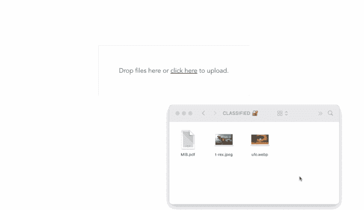
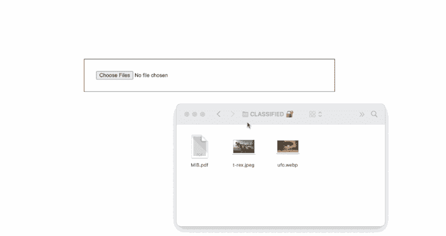
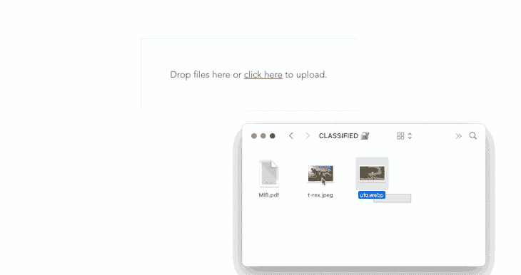

# 使用 Vue 上传定制的拖放文件

> 原文：<https://blog.logrocket.com/customizing-drag-drop-file-uploading-vue/>

您可能已经与文件上传组件进行了交互，最有可能的是当您想要跨多个应用程序更新您的个人资料图片或共享媒体，或将文档上传到云时。它们都有不同的设计，有些很简单，有些更先进。

然而，在桌面上，允许您将文件拖放到特定区域(通常称为“拖放区”)并在上传前预览这些文件的文件上传组件往往更直观。

通过这篇文章，我们将学习如何用 Vue.js 创建我们自己的拖放文件上传组件；它将有能力预览选定的文件，并删除任何文件在任何时候最后上传。这里先睹为快，一旦全部完工，我们将会建造什么:



## 用`<input type=file>`构建一个简单的拖放区

有趣的是，类型为`file`的原生 HTML `<input />`支持拖放，但默认情况下只接受单个文件。我们也可以很容易地添加`multiple`属性(即`<input type = "file" multiple />`)来接受多个文件，稍微拉伸它的宽度，添加一些边框和填充，我们就可以让它正常工作了:



从美学角度来说，你会同意这还不够好。然而，我们的拖放文件上传器将以类似的方式工作，因为我们仍然有一个文件输入，但它的可见性是隐藏的。然后我们将添加一个可见的标签，通过它可以拖动到前面提到的文件输入。然后，我们将添加一些其他的自定义事件来改变拖动状态，并允许我们显示和删除选定的文件。

## 创建高级拖放区

让我们从创建一个新的 Vue 应用程序开始。如果您还没有安装 [vue-cli](https://cli.vuejs.org/) ，然后运行以下命令创建一个新的 vue 应用程序:

```
​​vue create dropfile
```

之后，在您喜欢的文本编辑器中打开新项目，然后在`src/component`目录中创建一个新的空`DropFile.vue`文件。

接下来，让我们将这个组件导入到条目文件中。打开`App.vue`并用以下内容替换其内容:

```
<template>
  <div id="app">
    <DropFile />
  </div>
</template>

<script>
import DropFile from "./components/DropFile.vue";
export default {
  name: "App",
  components: {
    DropFile,
  },
};
</script>
```

让我们先组织所有与 CSS 相关的代码；在`src/assets`目录下新建一个`dropfile.css`文件，并将以下内容粘贴到其中:

```
.main {
    display: flex;
    flex-grow: 1;
    align-items: center;
    height: 100vh;
    justify-content: center;
    text-align: center;
}

.dropzone-container {
    padding: 4rem;
    background: #f7fafc;
    border: 1px solid #e2e8f0;
}

.hidden-input {
    opacity: 0;
    overflow: hidden;
    position: absolute;
    width: 1px;
    height: 1px;
}

.file-label {
    font-size: 20px;
    display: block;
    cursor: pointer;
}

.preview-container {
    display: flex;
    margin-top: 2rem;
}

.preview-card {
    display: flex;
    border: 1px solid #a2a2a2;
    padding: 5px;
    margin-left: 5px;
}

.preview-img {
    width: 50px;
    height: 50px;
    border-radius: 5px;
    border: 1px solid #a2a2a2;
    background-color: #a2a2a2;
}
```

接下来，用以下内容替换`DropFile.vue`文件中的内容:

```
<template>
  <div class="main">
    <div
      class="dropzone-container"
      @dragover="dragover"
      @dragleave="dragleave"
      @drop="drop"
    >
      <input
        type="file"
        multiple
        name="file"
        id="fileInput"
        class="hidden-input"
        @change="onChange"
        ref="file"
        accept=".pdf,.jpg,.jpeg,.png"
      />

      <label for="fileInput" class="file-label">
        <div v-if="isDragging">Release to drop files here.</div>
        <div v-else>Drop files here or <u>click here</u> to upload.</div>
      </label>
    </div>
  </div>
</template>

<script>
export default {
  data() {
    return {
      isDragging: false,
      files: [],
    };
  },
  methods: {
    onChange() {
      this.files = [...this.$refs.file.files];
    },
    dragover(e) {
      e.preventDefault();
      this.isDragging = true;
    },
    dragleave() {
      this.isDragging = false;
    },
    drop(e) {
      e.preventDefault();
      this.$refs.file.files = e.dataTransfer.files;
      this.onChange();
      this.isDragging = false;
    },
  },
};
</script>
<style scoped src="@/assets/dropfile.css"></style>
```

这里，我们创建了两个反应状态:`isDragging`，表示用户试图将文件拖动到拖放区时的状态；和`files`，一个数组来保存选择或丢弃的文件。然后，我们将一个定制的 [ref](https://blog.logrocket.com/vue-refs-accessing-dom-elements/) 附加到主文件输入中，使其在我们的 Vue 实例中易于访问。此外，我们添加了一个`onChange`事件，基本上是用附加到输入中的文件来更新我们的`files`数组。

之后，我们创建了一个`dragover`、`dragleave`和`drop`方法，并将它们附加到保存主文件输入的容器中。这样，drop 事件和方法将捕获拖放的文件，并将其绑定到我们的文件输入，利用我们之前创建的自定义 ref。

`dragover`和`dragleave`方法也让我们根据需要改变我们的`isDragging`的状态。最后，我们使用条件渲染(`v-if`和`v-else`)来检查`isDragging`的状态，然后为每个状态显示一条定制消息。

如果我们此时运行我们的应用程序，我们将得到以下输出:


尽管拖放的文件对我们来说还不可见，但它们实际上在后台的某个地方。为了测试这一点，将`this.files`记录到控制台的`onChange()`方法中。每当您删除或手动选择文件时，阵列都应记录到控制台，每个文件都包含文件名、大小、上次修改日期和其他与文件相关的信息。

### 列出丢弃的文件

预览选中/删除的文件非常简单:我们只需要遍历我们的文件数组。为此，在前面的代码中，在标签`</label>`之后立即添加以下代码:

```
<!-- . . . -->
  </label>
      <!-- Note: Only add the code block below -->
      <div class="preview-container mt-4" v-if="files.length">
        <div v-for="file in files" :key="file.name" class="preview-card">
          <div>
            <p>
              {{ file.name }}
            </p>
          </div>
          <div>
            <button
              class="ml-2"
              type="button"
              @click="remove(files.indexOf(file))"
              title="Remove file"
            >
              <b>×</b>
            </button>
          </div>
        </div>
      </div>
```

这里，我们使用条件呈现来检查我们的 files 数组是否有有效的长度，然后遍历它的所有内容，同时在一个段落中显示每个文件名。

### 正在删除文件

在前面的代码块中，您会注意到我们还为每个 iterable item 添加了一个按钮，调用一个`remove()`方法，同时将当前文件的索引作为其参数传递。如果我们此时运行我们的应用程序，我们应该看到所选的文件名如预期显示，还有一个删除它们的按钮。但是，删除按钮现在还不起作用。

要解决这个问题，请在所有以前的方法后添加一个新的`remove()`方法，如下所示:

```
// ..
remove(i) {
    this.files.splice(i, 1);
},
```

在这个阶段，一切都应该按预期进行。我们应该能够手动选择文件，拖放文件，看到所选文件的名称，也能够删除文件。输出预览如下所示:



### 预览选定的图像文件

使我们的拖放区组件更加直观的一个额外特性是预览所选图像文件的能力。我们可以通过使用本机的 [URL.createObjectURL()](https://developer.mozilla.org/en-US/docs/Web/API/URL/createObjectURL) 方法生成一个任意的 URL，将我们的文件对象作为它的参数来传递，从而很容易地做到这一点。要实现，向方法列表添加一个新的`generateThumbnail()`方法，如下所示:

```
// ..
generateURL(file) {
    let fileSrc = URL.createObjectURL(file);
    setTimeout(() => {
        URL.revokeObjectURL(fileSrc);
    }, 1000);
    return fileSrc;
},
```

建议在用`URL.createObjectURL()`方法创建一个 URL 后总是撤销它，以避免可能的内存丢失；这就是为什么我们增加了一个额外的超时来在一秒钟后自动完成这项工作。

接下来，用以下代码替换显示所有选定/删除文件名称的段落(

标记):

```
<!-- . . . -->

<p>
  {{ file.name }}
</p>
<!-- . . . -->
```

而且，我们让它全部工作！我们现在可以轻松地删除、选择、删除甚至预览选定的文件:


### 显示文件大小

如前一节所述，我们还可以直接访问每个选定的文件大小及其上次修改日期。默认情况下，文件大小以字节显示。然而，我们可以很容易地除以 1000 来转换成 KB。将以下更新添加到文件中显示文件名的部分:

```
<p>
    {{ file.name }} -
    {{ Math.round(file.size / 1000) + "kb" }}
</p>
```

每个选定的文件大小将与其名称一起显示:


## 上传到服务器

将选择/删除的文件上传到服务器也是轻而易举的事情，因为它们被附加到`files`状态；虽然有不同的策略来实现这一点，但利用`FormData`往往是更常见的方法。

下面是一个我们如何利用`FormData`和 [Axios](https://blog.logrocket.com/how-to-make-http-requests-like-a-pro-with-axios/) 将文件发送到 API 或服务器进行处理的例子:

```
// . . .
uploadFiles() {
    const files = this.files;
    const formData = new FormData();
    files.forEach((file) => {
        formData.append("selectedFiles", file);
    });

    axios({
        method: "POST",
        url: "http://path/to/api/upload-files",
        data: formData,
        headers: {
            "Content-Type": "multipart/form-data",
        },
    });
},
```

然后，我们可以在后端使用其他内置的函数或框架来根据需要处理文件。

## 结论

我们已经介绍了如何使用 Vue.js 创建一个极简但交互式的拖放文件上传器。我们的文件上传组件让我们浏览所选文件的名称和大小，预览图像文件，甚至在上传前随意删除文件。

遵循像这样的代码教程很容易出错。为了省事，本教程的完整代码也可以在 [GitHub](https://github.com/AsaoluElijah/vue-file-dropzone) 上找到。

感谢阅读！

## 像用户一样体验您的 Vue 应用

调试 Vue.js 应用程序可能会很困难，尤其是当用户会话期间有几十个(如果不是几百个)突变时。如果您对监视和跟踪生产中所有用户的 Vue 突变感兴趣，

[try LogRocket](https://lp.logrocket.com/blg/vue-signup)

.

[](https://lp.logrocket.com/blg/vue-signup)[https://logrocket.com/signup/](https://lp.logrocket.com/blg/vue-signup)

LogRocket 就像是网络和移动应用程序的 DVR，记录你的 Vue 应用程序中发生的一切，包括网络请求、JavaScript 错误、性能问题等等。您可以汇总并报告问题发生时应用程序的状态，而不是猜测问题发生的原因。

LogRocket Vuex 插件将 Vuex 突变记录到 LogRocket 控制台，为您提供导致错误的环境，以及出现问题时应用程序的状态。

现代化您调试 Vue 应用的方式- [开始免费监控](https://lp.logrocket.com/blg/vue-signup)。