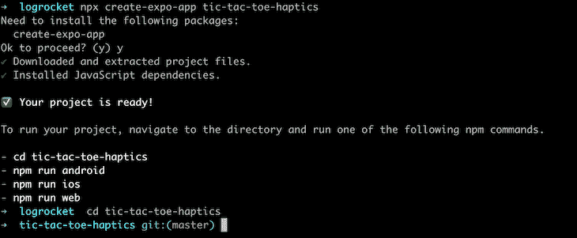
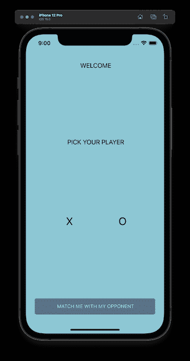
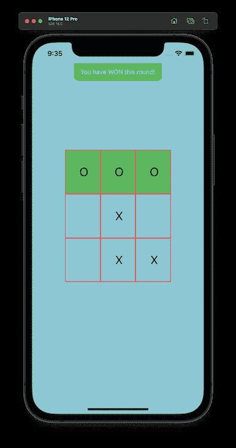
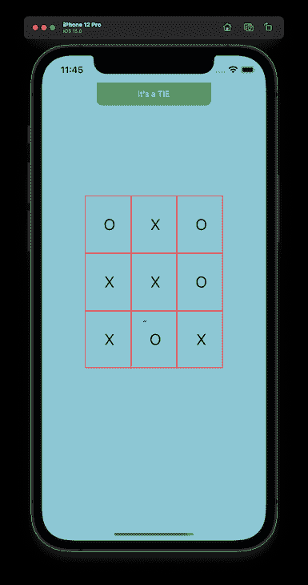
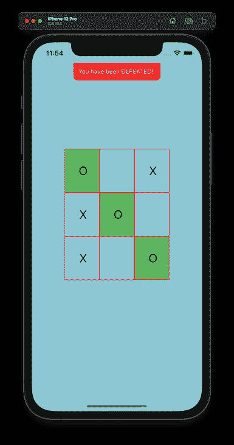

# 为 React 原生应用定制触觉反馈

> 原文：<https://blog.logrocket.com/customizing-haptic-feedback-react-native-apps/>

多年来，触觉致动器已经被包括在诸如游戏控制器和移动设备之类的电子设备中，以使用运动和振动向它们的用户体验添加触觉元素。

例如，触觉体验已经在移动设备上使用，以在诸如来电、警报或消息的活动期间补充音频或视觉反馈。

随着第三方应用程序的不断发展，各种移动操作系统都公开了其执行器的 API。[例如，](https://developer.apple.com/documentation/uikit/uifeedbackgenerator) `[UIFeedbackGenerator](https://developer.apple.com/documentation/uikit/uifeedbackgenerator)`类可供 iOS 开发者通过苹果 Taptic 引擎在应用中创建触觉反馈。

作为一名使用 React Native 构建的移动应用程序开发人员，您是否想过如何添加触觉反馈来改善应用程序的体验？

本教程将涵盖触觉反馈的主题，它对应用程序的好处，以及如何在 React 本地应用程序中实现触觉反馈。我们将涵盖:

## 先决条件

按照本文关于向 React 本机应用程序添加触觉反馈的实践教程，您需要具备以下条件:

*   安装在计算机上的 Node.js
*   您电脑上的移动仿真器，适用于 iOS 或 Android
*   对 React Native 的基本理解

让我们开始吧。

## 什么是触觉反馈？

触觉的概念与触觉有关。从技术的角度来看，它是一个包含触觉反馈和触觉技术的总称。

触觉技术是指能够通过施加振动或运动来刺激用户触觉的设备。通过触觉技术，最终用户通过他们身体的自然触觉系统来创建和感受触觉反馈。

## 向应用程序添加触觉反馈的好处

除了其他方面，触觉反馈对用户体验有直接影响。开发人员使用触觉反馈来补充从成功登录或购物车结帐等操作中显示的界面，这为最终用户创造了身临其境的体验。

在移动设备之外，触觉反馈在各种行业中有许多好处和使用案例。

例如，在汽车中，触觉反馈用于信息娱乐系统，以减少驾驶时的分心。虚拟现实应用程序的开发人员也通过使用超声波扬声器来应用触觉再现虚拟物体的真实感。

让我们进入本教程的实践部分。

## 向 React 本机应用程序添加触觉支持

在接下来的章节中，我们将使用 `[expo-haptics](https://docs.expo.dev/versions/latest/sdk/haptics/)` [包](https://docs.expo.dev/versions/latest/sdk/haptics/)为 Expo 管理的 React 本地应用[添加触觉。我们还将考虑如何使用](https://docs.expo.dev/versions/latest/sdk/haptics/) `[react-native-haptic-feedback](https://www.npmjs.com/package/react-native-haptic-feedback)` [包](https://www.npmjs.com/package/react-native-haptic-feedback)为没有 Expo 的应用程序创建触觉反馈[。](https://www.npmjs.com/package/react-native-haptic-feedback)

我们将在本教程中开发的 React 本地应用程序是为了玩传说中的古埃及井字游戏。增加对触觉的支持将通过通知游戏者何时有赢、输或平局事件，甚至何时棋盘中的牌被按下来增强游戏体验。

### 在 Expo 管理的 React 本机应用程序中实现触觉

Expo 是一个开源平台，用于创建运行在移动设备和网络上的跨平台 React 本地应用。为了减少开发时间，Expo 提供了几个实现几个设备 API 的包。

触觉方面， [Expo 提供了](https://docs.expo.dev/versions/latest/sdk/haptics/) `[expo-haptics](https://docs.expo.dev/versions/latest/sdk/haptics/)` [包](https://docs.expo.dev/versions/latest/sdk/haptics/)，让开发者使用 iOS Taptic 引擎和 Android 振动器系统。

注意,`expo-haptics`包不支持 React 本地应用程序。此外，在 iOS 上，有一些[情况下 Taptic 引擎将无法使用](https://docs.expo.dev/versions/latest/sdk/haptics/#:~:text=On%20iOS%2C%20the%20Taptic%20engine%20will%20do%20nothing%20if%20any%20of%20the%20following%20conditions%20are%20true%20on%20a%20user%27s%20device%3A)。其中一个条件是器件启用了低功耗模式。

`expo-haptics`包有三种异步方法来生成触觉反馈:

*   `[selectionAsync](https://docs.expo.dev/versions/latest/sdk/haptics/#hapticsselectionasync)` —用于指示选择变化
*   `[impactAsync](https://docs.expo.dev/versions/latest/sdk/haptics/#hapticsimpactasyncstyle)` —用于指示用户界面中的新元素
    *   示例:下拉元素、拖放元素
*   `[notificationAsync](https://docs.expo.dev/versions/latest/sdk/haptics/#hapticsnotificationasynctype)` —用于通知用户任务、事件或动作的结果

`impactAsync`和`notificationAsync`方法分别接受`[ImpactFeedbackStyle](https://docs.expo.dev/versions/latest/sdk/haptics/#enums)` [和](https://docs.expo.dev/versions/latest/sdk/haptics/#enums) `[NotificationFeedbackType](https://docs.expo.dev/versions/latest/sdk/haptics/#enums)` [枚举](https://docs.expo.dev/versions/latest/sdk/haptics/#enums)，以指定要生成的反馈的强度。

当我们在接下来的部分中构建游戏时，我们将使用`selectionAsync()`方法在棋盘中的方块被点击时生成触觉反馈。当游戏中发生事件时，我们也将使用`notificationAsync()`方法。

### 准备世博会申请

本文的重点是在 React 本地应用程序中实现触觉反馈。因此，虽然我们将介绍设置应用程序所需的步骤，但在到达触觉部分之前，我们不会深入代码本身太多的细节。

使用您的计算机终端或命令提示符，执行以下 npx 命令，通过 expo CLI 创建一个名为`tic-tac-toe-haptics` [的 Expo 应用程序:](https://docs.expo.dev/workflow/expo-cli/)

```
npx create-expo-app tic-tac-toe-haptics

```

运行该命令后，您应该会看到以下内容:



生成样板应用程序后，下一步是安装在多个屏幕之间导航和使用 Haptics API 所需的依赖项。

执行下面的两个命令进入`tic-tac-toe-haptics`目录，并在应用程序中安装六个额外的包:

```
# change directory
cd tic-tac-toe-haptics

# install dependencies 
yarn add @react-navigation/native  @react-navigation/native-stack react-native-safe-area-context expo-haptics

npx expo install react-native-screens react-native-safe-area-context

```

### 构建应用程序界面

使用您的代码编辑器，打开`App.js`文件并用下面的代码块替换样板内容。下面的代码包含应用程序中`Home`和`Game`屏幕的导航栈:

```
import { NavigationContainer } from '@react-navigation/native';
import Home from './src/screens/Home';
import { createNativeStackNavigator } from '@react-navigation/native-stack';
import Game from './src/screens/Game';
import { SafeAreaProvider } from 'react-native-safe-area-context';

export default function App() {
 const Stack = createNativeStackNavigator();

 return (
   <SafeAreaProvider>
     <NavigationContainer>
       <Stack.Navigator>
       <Stack.Screen options={{ headerShown: false }} name="Home" component={Home} />
       <Stack.Screen options={{ headerShown: false }} name="Game" component={Game} />
       </Stack.Navigator>
     </NavigationContainer>
   </SafeAreaProvider>
 );
}

```

上面的代码块使用了应用程序中不存在的两个组件。让我们继续创建它们。

在`tic-tac-toe-haptics`目录中创建另一个名为`src`的目录。`src`目录将为应用程序中的屏幕存储新的文件和目录。

在`src`目录中，创建一个名为`utils.js`的文件，并将下面的代码添加到该文件中，以存储井字游戏中将使用的额外组件、函数和变量，包括正在进行的游戏、赢了的游戏、输了的游戏和打平的游戏显示的 T2 吐司通知:

```
import { GameScreenStyles as styles  } from './styles'
import { View, Text, TouchableWithoutFeedback } from 'react-native'

const GAME_WINNING_COMBINATIONS = [
   [0, 1, 2],
   [3, 4, 5],
   [6, 7, 8],
   [0, 3, 6],
   [1, 4, 7],
   [2, 5, 8],
   [0, 4, 8],
   [2, 4, 6]
]

const guessNumber = () => Math.floor(Math.random() * 9)

export const findUniqueRandomNumber = (exisitingArr) => {
   let rand = guessNumber();

   for (let i = 0; i < exisitingArr.length; i++) {
       if (exisitingArr[rand]) {
           rand = guessNumber()
       } else {
           return rand
       }
   }
}

export const getWinner = (existingArray) => {
   for (let i = 0; i <= 7; i++) {
       const winCombination = GAME_WINNING_COMBINATIONS[i];

       let a = existingArray[winCombination[0]];
       let b = existingArray[winCombination[1]];
       let c = existingArray[winCombination[2]];

       if (a === b && b === c) {
           return { winningPlayer: a, matchingTiles: [winCombination[0], winCombination[1], winCombination[2]] }
       }
   }
}

export const Toast = ({ eventType }) => (
   <View style={{ alignItems: 'center' }} >
       <View style={[styles.toastContainer, { backgroundColor: eventType === "LOSS" ? "red" : "#5CB85C" }]} >
           {
               eventType === "ONGOING" &&
               <Text style={{ color: "white" }} > Match is ON! </Text>
           }
           {
               eventType === "WIN" &&
               <Text style={{ color: "white" }} > You have WON this round! </Text>
           }
           {
               eventType === "LOSS" &&
               <Text style={{ color: "white" }} > You have been DEFEATED!  </Text>
           }
           {
               eventType === "TIE" &&
               <Text style={{ color: "white" }} > It's a TIE </Text>
           }
       </View>
   </View>
)

export const GameTile = ({ item, handlePress, matchedTile }) => (
   <TouchableWithoutFeedback
       onPress={() => handlePress()}
   >
       <View
           style={[styles.tile, { backgroundColor: matchedTile ? "#5CB85C" : "transparent" }]}
       >
           <Text style={[styles.text, { fontSize: 27 }]} > {item}  </Text>
       </View>
   </TouchableWithoutFeedback>
)

```

接下来，创建一个`styles.js`文件，并添加下面代码块的内容，以创建应用程序内组件使用的样式:

```
import { Dimensions, StyleSheet } from 'react-native'
const { height, width } = Dimensions.get("screen")

export const GameScreenStyles = StyleSheet.create({
   toastContainer: {
       position: "absolute",
       width: 200,
       textAlign: 'center',
       borderBottomLeftRadius: 10,
       borderBottomRightRadius: 10,
       height: 40,
       alignItems: 'center',
       justifyContent: 'center',
   },
   center: {
       height: height - 150,
       alignItems: "center",
       justifyContent: 'center'
   },
   text: {
       textTransform: "uppercase",
       textAlign: "center",
       fontSize: 18
   },
   button: {
       height: 45,
       backgroundColor: "#201238",
       width: width - 50,
       borderRadius: 5,
       justifyContent: "center"
   },
   buttonText: {
       textTransform: "uppercase",
       textAlign: "center",
       color: "#fff"
   },
   tileContainer: {
       height: 300,
       flexWrap: "wrap",

   },
   tile: {
       flex: 1,
       flexGrow: 1,
       flexBasis: 100,
       borderColor: "red",
       borderWidth: 1,
       justifyContent: 'center',
       height: 80,
       width: 80
   }
})

export const HomeScreenStyles = StyleSheet.create({
   underline: {
       height: 5,
       width: 45,
       backgroundColor: "#D8D8D8"
   },
   center: {
       alignItems: "center",
   },
   row: {
       flexDirection: "row",
       justifyContent: "space-between",
       width: width / 2,
   },
   container: {
       height,
       flex: 1,
       justifyContent: 'space-between'
   },
   text: {
       textTransform: "uppercase",
       textAlign: "center",
       fontSize: 18
   },
   button: {
       height: 45,
       backgroundColor: "#201238",
       width: width - 50,
       borderRadius: 5,
       justifyContent: "center"
   },
   buttonText: {
       textTransform: "uppercase",
       textAlign: "center",
       color: "#fff"
   },
})

```

在`src`目录中，创建一个`screens`目录来存储主屏幕和游戏屏幕的文件。

在 screens 目录中，创建一个`Home.js`文件，并将下面代码块的内容添加到该文件中。在主屏幕上，用户需要选择`X`或`O`在井字游戏棋盘上移动:

```
import React, { useState } from 'react'
import { View, Text, TouchableOpacity } from 'react-native'
import { SafeAreaView } from 'react-native-safe-area-context'
import { HomeScreenStyles as styles } from '../styles'
import * as Haptics from 'expo-haptics';

const gamePlayers = ["X", "O"]

const Home = ({ navigation }) => {
   const [selectedPlayer, selectPlayer] = useState(null)

   return (
       <SafeAreaView style={{ flex: 1, backgroundColor: "#8DC7D4" }}>
           <View style={styles.container}>
               <Text style={[styles.text, { marginTop: 30 }]} > Welcome </Text>
               <Text style={styles.text} > Pick Your Player </Text>

               <View style={[styles.center]} >
                   <View style={styles.row}>
                       {
                           gamePlayers.map((player, idx) => (
                               <TouchableOpacity key={idx} onPress={() => selectPlayer(player)} >
                                   <Text style={[styles.text, { fontSize: 30 }]} > {player} </Text>

                                   <View
                                       style={
                                           [styles.underline, { backgroundColor: selectedPlayer === player ? "green" : "#D8D8D8" }]
                                       }
                                   />
                               </TouchableOpacity>
                           ))
                       }
                   </View>
               </View>

               <View style={[styles.center, { marginBottom: 20 }]}>
                   <TouchableOpacity
                       onPress={() => {
                           if (selectedPlayer) {
                               navigation.navigate("Game", { selectedPlayer })

                               return
                           }
                           Haptics.notificationAsync(Haptics.NotificationFeedbackType.Warning)
                       }}
                       style={[styles.button, { opacity: !selectedPlayer && 0.5 }]}
                   >
                       <Text style={styles.buttonText}> Match me with my opponent </Text>
                   </TouchableOpacity>
               </View>
           </View>
       </SafeAreaView>
   )
}

export default Home

```

下图显示了当您直接使用仿真器或移动设备运行应用程序时，`Home`屏幕应该是什么样子:



接下来，在游戏屏幕的`src/screens`目录中创建第二个名为`Game.js`的文件。将下面代码块的内容添加到`Game.js`文件中，为`Game`屏幕创建父组件:

```
import React, { useState } from 'react'
import { View, Text, TouchableWithoutFeedback, Button } from 'react-native'
import { SafeAreaView } from 'react-native-safe-area-context'
import { GameScreenStyles as styles  } from '../styles'
import * as Haptics from 'expo-haptics';
import { getWinner, findUniqueRandomNumber, Toast, GameTile  } from '../utils'
const Game = ({ route }) => {
   const player = route?.params?.selectedPlayer

   const [gameTiles, setGameTile] = useState(Array(9).fill(null))
   const [gameStatus, setGameStatus] = useState('ONGOING')
   const [matchedTiles, setMatchedTiles] = useState([])
   const [isGameDisabled, disableGame] = useState(false)

   const handleTileClick = (position) => {
       Haptics.selectionAsync()

       if (!gameTiles[position] && !isGameDisabled) {
           let tilesCopy = [...gameTiles]

           if (!tilesCopy.includes(null)) {
               setGameStatus("TIE")
               disableGame(true)
               return
           }

           // user move
           tilesCopy[position] = player

           // Simulating computer move
           setTimeout(() => {
            tilesCopy[findUniqueRandomNumber(tilesCopy)] = player === "X" ? "O" : "X"
               const gameResult = getWinner(tilesCopy)

               if (gameResult?.winningPlayer) {
                   disableGame(true)
                   setMatchedTiles(gameResult?.matchingTiles)

                   if (gameResult?.winningPlayer === player) {
                       setGameStatus("WIN")
                       Haptics.notificationAsync(Haptics.NotificationFeedbackType.Success)
                   } else {
                       setGameStatus("LOSS")
                       Haptics.notificationAsync(Haptics.NotificationFeedbackType.Error)
                   }
               }

               setGameTile(tilesCopy)
           }, 500)
       } else if (!gameTiles.includes(null)) {
           setGameStatus("TIE")
           disableGame(true)

           Haptics.notificationAsync(Haptics.NotificationFeedbackType.Warning)
       }
   }

   const resetGameState = () => {
       setGameTile(new Array(9).fill(null))
       disableGame(false)
       setMatchedTiles([])
       setGameStatus("ONGOING")

       Haptics.notificationAsync(
           Haptics.NotificationFeedbackType.Success
       )
   }

   return (
       <SafeAreaView style={{ flex: 1, backgroundColor: "#8DC7D4" }} >
           <View>
               <Toast eventType={gameStatus} />

               <View style={styles.center} >
                   <View style={[styles.tileContainer,]} >
                       {
                           gameTiles.map((item, idx) =>
                               <GameTile
                                   key={idx}
                                   item={item}
                                   handlePress={() => {
                                       handleTileClick(idx)
                                   }}
                                   matchedTile={matchedTiles.includes(idx)}
                               />
                           )
                       }
                   </View>
               </View>

               <Button title="RESET GAME" onPress={(() => resetGameState())} />
           </View>
       </SafeAreaView>
   )
}

export default Game

```

上面的`Game`屏幕使用`gameStatus`本地状态的值来控制游戏屏幕上显示的元素，并根据比赛结果进行修改。

当改变`gameStatus`状态时，来自`src/utils.js`文件的`Toast`组件将显示相关文本。将执行`notificationAsync`方法来生成补充 toast 的触觉反馈。您可以在上面的代码中看到这种情况的三种变体:

*   当用户获胜:`Haptics.notificationAsync(Haptics.NotificationFeedbackType.Success)`
*   打成平手:`Haptics.notificationAsync(Haptics.NotificationFeedbackType.Error)`
*   当用户输了:`Haptics.notificationAsync(Haptics.NotificationFeedbackType.Warning)`

让我们看看这些在前端会是什么样子。

对于获胜的结果，将使用`Success`反馈类型来执行`notificationAsync`方法，以补充显示的`Toast`,通知用户游戏已经获胜:



对于平局，将显示祝酒词，并且还将使用适度强度的`Error`类型执行`notificationAsync`方法:



如果用户输了一场比赛，游戏将显示红色背景的祝酒词，并执行类型为`Warning`的`notificationAsync`方法来通知用户输了:



## 使用`react-native-haptic-feedback`实现无 Expo 的触觉

对于不使用 Expo 构建 React 原生应用的开发人员来说，`[react-native-haptic-feedback](https://www.npmjs.com/package/react-native-haptic-feedback)`[包](https://www.npmjs.com/package/react-native-haptic-feedback)是一个更加灵活的社区包，可以为您的应用添加触觉。

与`expo-haptics`不同，您需要使用`react-native link`命令自动链接`react-native-haptic-feedback`包，或者通过修改相关文件手动链接。

当使用`react-native-haptic-feedback`包时，您可以访问带有几种通知类型的`trigger()`方法。这些与我们在实践教程中使用的类似，因此您可以按照上面列出的步骤来实现它们。还可以指定 iOS 和 Android 平台的选项。

[查看 Github 上的完整列表](https://www.npmjs.com/package/react-native-haptic-feedback)。

## React Native 中触觉反馈的进一步考虑

本教程重点解释触觉反馈以及如何在 React 本地应用程序中使用它。当将触觉反馈添加到现实世界的应用程序中以供广泛的受众使用时，还有其他一些考虑要记住。

例如，[苹果关于触觉反馈的文档](https://developer.apple.com/documentation/uikit/uifeedbackgenerator#:~:text=The%20source%20of%20the%20feedback%20must%20be%20clear%20to%20the%20user.)建议向用户说明他们为什么会有触觉反馈。最好创建触觉反馈来补充作为事件结果显示的当前界面。

根据您的应用程序设计，您也可能认为在释放触觉反馈时播放音频音调是合适的，以改善用户体验。

应该有一个选项让用户在你的应用程序中启用或禁用触觉反馈。基于他们当前的环境，用户可能会发现触觉反馈令人讨厌，并且想要禁用它。

对于本教程中的井字游戏，没有禁用触觉反馈的选项。但是，您可以重构应用程序，让用户可以切换触觉反馈的开关。

虽然可以修改触觉模式，但建议您坚持使用系统的触觉模式。用户熟悉他们的设备所使用的触觉模式，并且他们能够基于其模式下意识地解释触觉反馈意味着什么。

我希望这个教程对你有用。如果你有任何进一步的问题，请在评论中告诉我。

## [LogRocket](https://lp.logrocket.com/blg/react-native-signup) :即时重现 React 原生应用中的问题。

[](https://lp.logrocket.com/blg/react-native-signup)

[LogRocket](https://lp.logrocket.com/blg/react-native-signup) 是一款 React 原生监控解决方案，可帮助您即时重现问题、确定 bug 的优先级并了解 React 原生应用的性能。

LogRocket 还可以向你展示用户是如何与你的应用程序互动的，从而帮助你提高转化率和产品使用率。LogRocket 的产品分析功能揭示了用户不完成特定流程或不采用新功能的原因。

开始主动监控您的 React 原生应用— [免费试用 LogRocket】。](https://lp.logrocket.com/blg/react-native-signup)