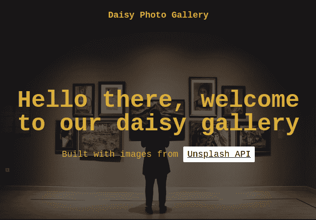
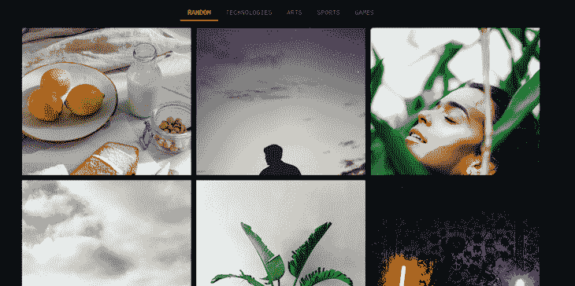

# daisyUI:用于减少标记的顺风 CSS 组件

> 原文：<https://blog.logrocket.com/daisyui-tailwind-components-react-apps/>

尽管 Tailwind CSS 非常受欢迎，但许多开发人员都很难适应这个框架，这主要是因为随着应用程序的扩展，标记的可读性降低了。

daisyUI 是一个可定制的 Tailwind CSS 组件库，可以防止前端应用程序中的冗长标记。daisyUI 专注于为用户界面定制和创建主题，使用纯 CSS 和 Tailwind 实用程序类，允许开发人员编写干净的 HTML。

在本文中，我们将通过在 React 中构建一个获取和组织照片的图库来探索 daisyUI，了解如何在不编写冗长标记的情况下实现 Tailwind 的性能和定制。

要跟随本教程，您需要以下内容:

*   React 和 JavaScript 的基础知识
*   Node.js 和 npm 安装在您的计算机上
*   顺风 CSS 和实用程序类的基础知识

我们开始吧！

> 本教程中示例应用程序的代码可以在 [GitHub](https://github.com/iamfortune/daisyUI-photo-gallery-app) 上找到。

## 生成新的 React 应用程序

首先，我们将创建一个新的 React 应用程序，并使用 Create React App 引导它；在您的终端中运行以下命令:

```
npx create-react-app daisyui-app

```

虽然我将这个示例项目命名为`daisyui-app`，但是您可以用您选择的任何名称替换它。接下来，导航到项目目录，通过运行以下命令启动开发服务器:

```
cd daisyui-app && yarn start 

```

上面的命令将打开一个浏览器选项卡，显示默认的样板应用程序。最后，您需要按照本文中列出的步骤为您的应用程序设置 Tailwind CSS。

### 安装依赖项

生成新的 React 项目并为 Create React App 配置 Tailwind CSS 后，让我们在应用程序中安装以下必需的依赖项:

*   daisyUI:为构建和设计我们的应用程序提供组件
*   Tailwind CSS:为我们的 daisyUI 组件提供实用程序类
*   PostCSS:用于样式化 JavaScript 插件
*   Axios:处理 API 请求

在您的终端中运行以下代码:

```
yarn add daisyui tailwindcss postcss axios

```

接下来，导航到您的`tailwind.config.js`文件并添加以下代码:

```
plugins: [require("daisyui")],

```

上面的代码在我们的 Tailwind CSS 配置中包含了 daisyUI 支持，提供了对 Tailwind 实用程序类的访问，我们将使用这些类来定制我们的 daisyUI 组件样式。

## 构建照片库应用程序

在这一节中，我们将构建应用程序所需的三个组件:一个用于应用程序标题的`Intro`组件，一个用于应用程序导航栏的`Navbar`组件，以及一个用于显示和组织照片的`Photo`组件。

为了访问图像并为我们的应用程序构建组件，我们将使用 [Unsplash](https://unsplash.com/) 。如果您还没有帐户，请创建一个帐户。

### `Intro`组件

`Intro`组件将包含一个来自 Unsplash 的图像 URL 和一个应用程序登录页面的背景图像。在您的`components/intro/intro.jsx`文件中，添加以下代码:

```
const Intro = () => {
    const imgURL =
        "https://images.unsplash.com/photo-1606819717115-9159c900370b?ixid=MnwxMjA3fDB8MHxwaG90by1wYWdlfHx8fGVufDB8fHx8&ixlib=rb-1.2.1&auto=format&fit=crop&w=800&q=80";
    return (
        <div
            className="hero h-96"
            style={{
                backgroundImage: `url(${imgURL})`,
            }}
        >
            <div className="hero-overlay bg-opacity-60" />
            <div className="text-center hero-content text-neutral-content">
                <div className="w-full">
                    <h1 className="mb-6 text-5xl font-bold">
                        Hello there, welcome to our daisy gallery
                    </h1>
                    <p className="text-lg">
                        Built with images from{" "}
                        <a
                            href="https://unsplash.com/developers"
                            className="hover underline mt-8 bg-white px-2 py-1.5 rounded-sm text-black"
                        >
                            Unsplash API
                        </a>
                    </p>
                </div>
            </div>
        </div>
    );
};
export default Intro;
```

在上面的代码中，我们创建了一个`Intro`组件；在内部，我们初始化了一个`imgURL`，它包含我们的登录页面上的图像的 URL。

接下来，我们使用 Tailwind CSS 类为应用程序的登录页面组件定制了样式。我们还添加了一个到 [Unsplash 开发者 API](https://unsplash.com/developers) 的链接。现在，您的应用程序应该看起来像下图:



### 构建一个组件

现在，让我们构建一个简单的`Navbar`组件，并使用 daisyUI 的组件类添加定制:

```
const Navbar = () => {

    return (
        <div className="navbar flex-col shadow-lg bg-neutral text-neutral-content">
            <div className="flex-1 px-2 mx-2">
                <span className="text-lg font-bold">Daisy Photo Gallery</span>
            </div>
        </div>
    );
};

export default Navbar;
```

在上面的代码中，我们通过使用`font-bold`为 Navbar 加粗了字体，并使用`text-leg`组件指定了大字体。

### 构建我们的`Photo`组件

接下来，我们将构建一个简单的`Photo`组件来呈现从 Unsplash 获取的图像；为了呈现我们的`Photo`组件，我们将把它包装在一个`figure`组件中:

```
const Photo = ({ imgURL }) => {
    return (
        <>
            <div className="card">
                <figure>
                  
                </figure>
            </div>
        </>
    );
};

export default Photo;

```

在上面的代码块中，我们析构了我们的`Photo`组件，并将它传递给了我们的 Unsplash `imgURL`。接下来，我们使用 daisyUI 的`card`组件类为我们的照片创建了一个卡片。最后，我们将图像包装在`figure`标签中，缩小它们以适合我们的`Photo`组件容器。

## 获取和整理照片

现在，我们将使用组件从 Unsplash API 中获取随机照片，然后创建类别来组织它们。首先，让我们通过将下面的代码块添加到我们的`App.js`文件来导入我们的包:

```
import { useState, useEffect } from "react";
import axios from "axios";
import Intro from "./components/Intro/Intro";
import Navbar from "./components/Navbar/Navbar";
import Photo from "./components/Photo/Photo";

```

在上面的代码中，我们导入了我们的组件，以及`useState`和`useEffect`钩子。接下来，我们将通过添加下面的代码来初始化一个`app`组件:

```
const App = () =&gt; {
    const [selectedCategory, setSelectedCategory] = useState("RANDOM");
    const [photos, setPhotos] = useState([]);
    const [categories] = useState([
        "RANDOM",
        "TECHNOLOGIES",
        "ARTS",
        "SPORTS",
        "GAMES",
    ]);

```

在我们的`app`组件中，我们使用 React 的`useState`变量为`categories`和`Photos`创建了状态。然后，我们创建了不同类别的数组，包括`RANDOM`、`TECHNOLOGIES`、`ARTS`、`SPORTS`和`GAMES`。

现在，让我们编写一个从 Unsplash API 中获取随机照片的函数:

```
const fetchRandomPhotos = async () =&gt; {
        try {
            const res = await axios.get("https://api.unsplash.com/photos/random", {
                params: {
                    client_id: process.env.REACT_APP_UNSPLASH_ACCESS_KEY,
                    count: 12,
                },
            });
            const photoArr = res.data?.map((photo) =&gt; photo?.urls?.regular);
            setPhotos(photoArr);
        } catch (error) {
            setPhotos([]);
            console.error(error?.response?.data?.message);
        }
    };

```

在上面的代码块中，我们创建了`getRandomPhotos`函数，它从我们的 Unsplash API 中获取随机照片。为了设置所有的图像，我们绘制了照片阵列。对于身份验证，我们通过了从 Unsplash Developers API 仪表板获得的`client_id`。最后，我们指定图像的数量为`count: 12`。

现在，我们将编写一个基于照片类别返回照片的函数:

```
  const fetchPhotoBasedonCategory = async () =&gt; {
        try {
            const res = await axios.get("https://api.unsplash.com/search/photos", {
                params: {
                    client_id: process.env.REACT_APP_UNSPLASH_ACCESS_KEY,
                    query: selectedCategory.toLowerCase(),
                },
            });
            const photoArr = res.data?.results?.map((photo) =&gt; photo?.urls?.regular);
            setPhotos(photoArr);
        } catch (error) {
            setPhotos([])
            console.error(error?.response?.data?.message);
        }
    };

```

类似于我们的`getRandomPhotos`函数，我们指定了类别，并使用`map`对照片列表进行排序，只返回用户指定类别中的照片。为了渲染图像，我们从 Unsplash 映射图像数组，只设置指定数量的图像。我们还将所有错误记录到控制台:

```
useEffect(() => {
        if (selectedCategory === "RANDOM") {
            return fetchRandomPhotos();
        }
        fetchPhotoBasedonCategory();
        // eslint-disable-next-line react-hooks/exhaustive-deps
    }, [selectedCategory]);

    return (
        <>
            <Navbar />
            <main className="mb-10">
                <Intro />
                <nav>
                    <div className="tabs mt-10 justify-center">
                        {categories.map((category) => (
                            <p
                                key={category}
                                onClick={() => setSelectedCategory(category)}
                                role="button"
                                className={`tab tab-bordered 
                            ${selectedCategory === category && "tab-active"}`}
                            >
                                {category}
                            </p>
                        ))}
                    </div>
                </nav>
                <section className="mt-4 mx-auto w-10/12 relative">
                    <div className="grid grid-cols-3 justify-center gap-3">
                        {photos?.length ? (
                            photos.map((photo) => <Photo key={photo} imgURL={photo} />)
                        ) : (
                            <p className="mt-10 alert alert-info absolute left-1/2 -ml-20">
                                No photo at the moment!
                            </p>
                        )}
                    </div>
                </section>
            </main>
        </>
    );
};

export default App;
```

在上面的代码块中，如果用户选择了`random`类别，我们使用 React 的`useEffect`钩子来指定`RANDOM`。如果用户指定了一个类别，API 将返回所选类别中的图像。

最后，我们呈现了整个应用程序，并向类别部分添加了一个`onClick`事件。此外，我们添加了一个函数，指定只向用户显示所选类别中的图像。最后，我们添加了一条消息，提示 API 中没有可用的照片。尽管这不太可能，但这是一个很好的实践。

如果操作正确，我们的应用程序应该类似于下图:



## 结论

通过添加像`btn`、`card`和`footer`这样的组件类，daisyUI 通过允许开发人员编写干净的 HTML，显著改进了 Tailwind CSS。在本教程中，我们探索了用 CSS 变量和 Tailwind CSS 实用程序类构建和定制我们自己的 React 应用程序。

虽然我们的例子主要是构建一个图片库，但是您可以将本教程中的信息应用到您自己的应用程序中，在缩放项目时，享受 Tailwind 的样式性能而不损害代码的可读性。我希望你喜欢这个教程！

## 使用 LogRocket 消除传统反应错误报告的噪音

[LogRocket](https://lp.logrocket.com/blg/react-signup-issue-free)

是一款 React analytics 解决方案，可保护您免受数百个误报错误警报的影响，只针对少数真正重要的项目。LogRocket 告诉您 React 应用程序中实际影响用户的最具影响力的 bug 和 UX 问题。

[ ](https://lp.logrocket.com/blg/react-signup-general) [  ](https://lp.logrocket.com/blg/react-signup-general) [LogRocket](https://lp.logrocket.com/blg/react-signup-issue-free)

自动聚合客户端错误、反应错误边界、还原状态、缓慢的组件加载时间、JS 异常、前端性能指标和用户交互。然后，LogRocket 使用机器学习来通知您影响大多数用户的最具影响力的问题，并提供您修复它所需的上下文。

关注重要的 React bug—[今天就试试 LogRocket】。](https://lp.logrocket.com/blg/react-signup-issue-free)