# 使用 React Native - LogRocket Blog 获取数据

> 原文：<https://blog.logrocket.com/data-fetching-react-native/>

React Native 对于希望轻松构建移动应用的开发人员来说是一个非常棒的库。它提供了一种向前端显示信息的有效方式。但是，我们如何获得数据，以便我们的组件可以呈现它呢？

在本文中，您将学习如何从 API 获取数据并显示给用户。我们将通过全面的代码示例介绍几种方法，以帮助您确定最适合您的应用程序的方法。

我们将介绍在 React Native 中获取数据的以下选项:

为了展示 React Native 中的数据获取，我们将构建一个基本的应用程序，从 [Coffee API](https://sampleapis.com/api-list/coffee) 中获取一系列项目。此外，我们将使用 [NativeBase UI 库](https://nativebase.io)向客户端呈现我们的数据。

最终，您的示例应用程序将如下所示:

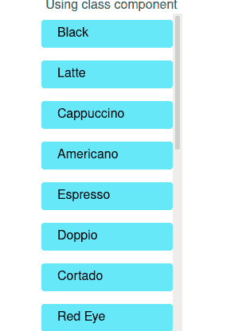

您可以从这个 GitHub 库获得这个应用程序的完整源代码。

## 入门指南

### 项目初始化

要使用 Expo 搭建 React 本地项目，请运行以下终端命令:

```
expo init reactnative-data-fetching

```

### 获取依赖关系

在这里，我们将安装以下模块:

*   `@apollo/client`:用于进行 GraphQL 查询
*   `graphql`:Apollo 客户端的对等依赖
*   `native-base`、`styled-components`、`styled-system`:使用 NativeBase 库

要获取这些包，请编写以下终端命令:

```
npm i @apollo/client graphql native-base styled-components styled-system 

```

下一步，安装 NativeBase 的对等依赖项，如下所示:

```
expo install react-native-svg
expo install react-native-safe-area-context
```

完成后，就该演示数据获取了。

## 你什么时候需要获取数据？

您需要获取数据有三个原因:

*   在组件第一次呈现时加载数据
*   获取数据并在用户单击按钮时呈现数据
*   以不同的时间间隔加载数据

我们将为每个用例编写代码。

## 使用内置的获取 API

Fetch API 是检索数据最常用的方法，因为它与 React 捆绑在一起。

### 装载时获取数据

在您的`components`文件夹中，创建一个名为`CoffeeAutonomous.js`的文件。从编写以下代码开始:

```
import React, { useState, useEffect } from "react";
import { Box, FlatList, Center, NativeBaseProvider, Text } from "native-base";

export default function CoffeeAutonomous() {
  const [data, setData] = useState([]);
  const [loading, setLoading] = useState(true);

  const fetchData = async () => {
    const resp = await fetch("https://api.sampleapis.com/coffee/hot");
    const data = await resp.json();
    setData(data);
    setLoading(false);
  };

  const renderItem = ({ item }) => {
    return (
      <Box px={5} py={2} rounded="md" bg="primary.300" my={2}>
        {item.title}
      </Box>
    );
  };

```

让我们一段一段地剖析这段代码。

一开始，我们创建了两个钩子，分别叫做`data`和`loading`。 [`data`钩子](https://blog.logrocket.com/react-hooks-cheat-sheet-unlock-solutions-to-common-problems-af4caf699e70/)将保存提取的数据，而`loading`将告诉用户数据是否在路上。

此外，`fetchData`方法将使用`fetch`方法从服务器获取响应，然后将其存储到`data`钩子中。最后，我们将`loading`钩子设置为`false`。除此之外，`renderItem`功能将显示每个项目的`title`字段。

现在我们需要渲染它。为此，请在同一文件中添加以下代码:

```
useEffect(() => {
  fetchData();
}, []);

return (
  <NativeBaseProvider>
    <Center flex={1}>
    <Box> Fetch API</Box>
      {loading && <Box>Loading..</Box>}
      {data && (
        <FlatList
          data={data}
          renderItem={renderItem}
          keyExtractor={(item) => item.id.toString()}
        />
      )}
    </Center>
  </NativeBaseProvider>
);
}

```

注意，我们让`useEffect`依赖数组为空。这意味着 React 将在第一次渲染时调用`fetchData`方法。接下来，我们使用`FlatList`组件来显示`data`数组的内容。

最后，转到`App.js`并渲染`CoffeeAutonomous`组件:

```
import React from "react";
import CoffeeAutonomous from "./components/CoffeeAutonomous";
export default function App() {
  return <CoffeeAutonomous />;
}

```

这将是输出:

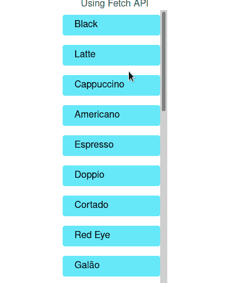

在下一节中，您将学习当用户单击按钮时如何呈现数据。
最后，`CoffeeAutonomous.js`应该是这样的:

```
import React, { useState, useEffect } from "react";
import { Box, FlatList, Center, NativeBaseProvider, Text } from "native-base";

export default function CoffeeAutonomous() {
  const [data, setData] = useState([]);
  const [loading, setLoading] = useState(true);

  const fetchData = async () => {
    const resp = await fetch("https://api.sampleapis.com/coffee/hot");
    const data = await resp.json();
    setData(data);
    setLoading(false);
  };

  useEffect(() => {
    fetchData();
  }, []);

  const renderItem = ({ item }) => {
    return (
      <Box px={5} py={2} rounded="md" bg="primary.300" my={2}>
        {item.title}
      </Box>
    );
  };

  return (
    <NativeBaseProvider>
      <Center flex={1}>
      <Box> Fetch API</Box>
        {loading && <Box>Loading..</Box>}
        {data && (
          <FlatList
            data={data}
            renderItem={renderItem}
            keyExtractor={(item) => item.id.toString()}
          />
        )}
      </Center>
    </NativeBaseProvider>
  );
}

```

### 点击按钮时获取数据

创建一个名为`CoffeeClick.js`的文件，并编写以下代码:

```
import React, { useState } from "react";
import { Box, FlatList, Center, NativeBaseProvider, Button } from "native-base";

export default function CoffeeClick() {

  const [data, setData] = useState(null);
  const [visible, setVisible] = useState(true);

  const fetchData = async () => {
    const resp = await fetch("https://api.sampleapis.com/coffee/hot");
    const data = await resp.json();
    setData(data);
    setVisible(false);
  };

  const renderItem = ({ item }) => {
    return (
      <Box px={5} py={2} rounded="md" bg="primary.300" my={2}>
        {item.title}
      </Box>
    );
  };
}

```

这段代码的第一部分和`CoffeeAutonomous`类似。唯一的区别是我们声明了一个`visible`钩子。除此之外，在`fetchData`函数中，我们告诉 React 如果数据现在存在，那么将`visible`钩子设置为`false`。

若要呈现用户界面，请追加以下代码:

```
return (
    <NativeBaseProvider>
      <Center flex={1}>
        {visible && <Button onPress={() => fetchData()}>Press</Button>} 
        {data && (
          <FlatList
            data={data}
            renderItem={renderItem}
            keyExtractor={(item) => item.id.toString()}
          />
        )}
      </Center>
    </NativeBaseProvider>
  );
}

```

在第 4 行，我们使用了条件渲染。这将在单击时隐藏组件。

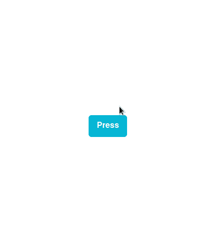

在下一节中，您将学习如何定期获取数据。

我们的`CoffeeClick.js`文件应该是这样的:

```
import React, { useState } from "react";
import { Box, FlatList, Center, NativeBaseProvider, Button } from "native-base";

export default function CoffeeClick() {
  const [data, setData] = useState(null);
  const [visible, setVisible] = useState(true);

  const fetchData = async () => {
    const resp = await fetch("https://api.sampleapis.com/coffee/hot");
    const data = await resp.json();
    setData(data);
    setVisible(false);
  };

  const renderItem = ({ item }) => {
    return (
      <Box px={5} py={2} rounded="md" bg="primary.300" my={2}>
        {item.title}
      </Box>
    );
  };

  return (
    <NativeBaseProvider>
      <Center flex={1}>
        {visible && <Button onPress={() => fetchData()}>Press</Button>}
        {data && (
          <FlatList
            data={data}
            renderItem={renderItem}
            keyExtractor={(item) => item.id.toString()}
          />
        )}
      </Center>
    </NativeBaseProvider>
  );
}

```

### 间隔提取数据

这一步很简单。创建一个名为`CoffeeInterval.js`的文件。

之后，复制`CoffeeAutonomous.js`的代码并粘贴。我们将进行更改以添加间隔功能。

在`CoffeeInterval.js`中，更改您的`useEffect`处理程序:

```
useEffect(() => {
  fetchData();
  const dataInterval = setInterval(() => fetchData(), 5 * 1000);

  return () => clearInterval(dataInterval);
}, []);

```

在这段代码中，我们使用`setInterval`函数每隔`5`秒运行一次`fetchData`方法。后来，我们指定如果这个组件从树中被删除，那么清除这个间隔。这将防止内存泄漏。

这就是全部了！您的代码运行起来应该没有任何问题:

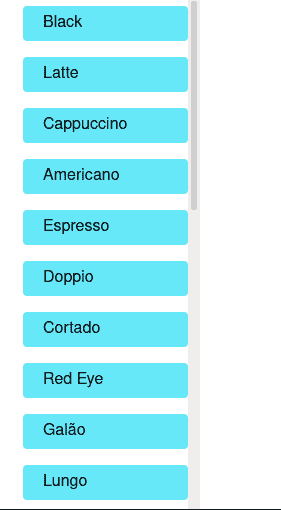

您的`CoffeeInterval.js`文件应该如下所示:

```
import React, { useState, useEffect } from "react";
import { Box, FlatList, Center, NativeBaseProvider, Text } from "native-base";

export default function CoffeeInterval() {
  const [data, setData] = useState([]);
  const [loading, setLoading] = useState(true);

  const fetchData = async () => {
    const resp = await fetch("https://api.sampleapis.com/coffee/hot");
    const data = await resp.json();
    setData(data);
    setLoading(false);
  };

  useEffect(() => {
    fetchData();
    const dataInterval = setInterval(() => fetchData(), 5 * 1000);
    return () => clearInterval(dataInterval);
  }, []);

  const renderItem = ({ item }) => {
    return (
      <Box px={5} py={2} rounded="md" bg="primary.300" my={2}>
        {item.title}
      </Box>
    );
  };

  return (
    <NativeBaseProvider>
      <Center flex={1}>
        {loading && <Box>Loading..</Box>}
        {data && (
          <FlatList
            data={data}
            renderItem={renderItem}
            keyExtractor={(item) => item.id.toString()}
          />
        )}
      </Center>
    </NativeBaseProvider>
  );
}

```

## 使用 Axios

Fetch 的一个替代方案是 Axios，它兼容 Node、React 和 React Native。除了发出`GET`请求，这个模块甚至可以让你发出`POST`、`PUT`和`DELETE`请求。

要安装该软件包，请运行以下终端命令:

```
npm install axios
```

### 使用 Axios 获取

要使用 Axios 库检索数据，请编写以下代码:

```
import axios from "axios"
export default function App() {
  const fetchData = () => {
    const baseURL = "https://api.sampleapis.com/coffee";
    axios.get(`${baseURL}/hot`).then((response) => console.log(response.data));
  };
  useEffect(() => {
    fetchData();
  }, []);
}

```

在这段代码中，我们指示 Axios 对 Coffee API 执行一个`GET` r 请求，并记录响应。

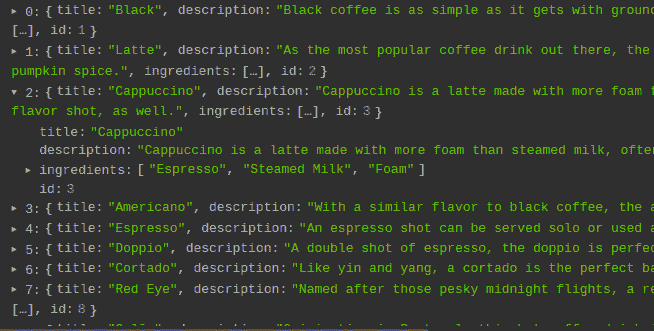

如果你想了解关于使用 Axios 管理 API 请求的深入信息，我们有一整篇文章介绍使用 Axios 和 React Native 获取数据。

## 用 Apisauce 获取数据

Fetch 的一个替代方案是 Axios。但由于 Axios 与 React Native 不兼容，我们可以用 [Apisauce](https://github.com/infinitered/apisauce) 来代替。它是 Axios 的包装器，甚至可以让你发出`POST`、`PUT`和`DELETE`请求。

要安装该软件包，请运行以下终端命令:

```
npm i apisauce 

```

### 用 Apisauce 获取数据的简单方法

这就是你如何用 Apisauce 库发出请求:

```
import React from "react";
import { useEffect } from "react";
import { create } from "apisauce";

//file name: SauceExample.js
//extra code removed for brevity purposes

//The baseURL will be our starting point.
const api = create({
  baseURL: "https://api.sampleapis.com/coffee",
});

const fetchData = () => {
  //make request to baseURL + '/hot'
  api
    .get("/hot")
    .then((response) => response.data)
    .then((data) => console.log(data));
};

useEffect(() => {
  fetchData();
}, []);

```

最后，我们告诉 React 在第一次渲染时执行`fetchData`函数。这将注销 API 对终端的响应。

这将是输出:


我们将使用钩子来呈现这些数据。

### 使用带挂钩的辣椒酱

在`components/SauceExample.js`中，编写以下代码:

```
import { FlatList, Box, NativeBaseProvider, Center } from "native-base";
import React from "react";
import { useEffect } from "react";
import { create } from "apisauce";
import { useState } from "react";

export default function SauceExample() {
  const [data, setData] = useState([]);
  const api = create({
    baseURL: "https://api.sampleapis.com/coffee",
  });

  const fetchData = () => {
    //make request to baseURL + 'hot'
    api
      .get("/hot")
      .then((response) => response.data)
      .then((data) => setData(data));
  };

  const renderItem = ({ item }) => {
    return (
      <Box px={5} py={2} rounded="md" bg="primary.300" my={2}>
        {item.title}
      </Box>
    );
  };

  useEffect(() => {
    fetchData();
  }, []);

  return (
    <NativeBaseProvider>
      <Center flex={1}>
      <Box> Using Apisauce </Box>
        {data && (
          <FlatList
            data={data}
            renderItem={renderItem}
            keyExtractor={(item) => item.id.toString()}
          />
        )}
      </Center>
    </NativeBaseProvider>
  );
}

```

这将是输出:

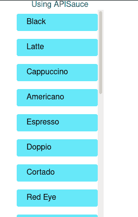

如果您想从`iced`路线获得数据，您需要做的就是在您的`fetchData`函数中修改一行:

```
const fetchData = () => {
  //make request to baseURL + 'iced'
  api
    .get("/iced")
    .then((response) => response.data)
    .then((data) => setData(data));
};

```


### 对 Apisauce 使用 async/await

想在代码中使用`async`和`await`？没问题。您可以像这样编写代码:

```
const fetchData = async () => {
  //make request to baseURL + 'iced'
  const response = await api.get("/iced");
  setData(response.data);
};

```

## 使用渲染道具渲染数据

React 中的 Props 考虑到了代码的模块化和整洁性。例如，为了渲染数据，我们编写了以下代码:

```
return (
  <NativeBaseProvider>
    <Center flex={1}>
      {data && (
        <FlatList
          data={data}
          renderItem={renderItem}
          keyExtractor={(item) => item.id.toString()}
        />
      )}
    </Center>
  </NativeBaseProvider>
);

```

要缩短这个区块，可以使用渲染道具。

创建一个名为`DataRenderer.js`的定制组件:

```
import { FlatList, Box } from "native-base";
import React from "react";

export default function DataRenderer({ data }) {

  const renderItem = ({ item }) => {
    return (
      <Box px={5} py={2} rounded="md" bg="primary.300" my={2}>
        {item.title}
      </Box>
    );
  };

  return (
    <FlatList
      data={data}
      renderItem={renderItem}
      keyExtractor={(item) => item.id.toString()}
    />
  );
}

```

在其他文件中使用它，如下所示:

```
 return (
    <NativeBaseProvider>
      <Center flex={1}>{data && <DataRenderer data={data} />}</Center>
    </NativeBaseProvider>
  );

```

我们的代码看起来更干净！输出应该和以前一样。

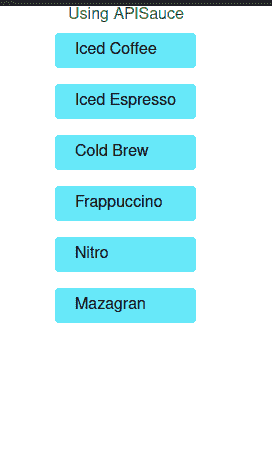

## 使用 GraphQL 和 Apollo 客户端获取数据

### 为什么要使用 GraphQL？

GraphQL 是一项[与 REST](https://blog.logrocket.com/graphql-vs-rest-what-you-didnt-know/) 完全不同的技术，同时仍然保持易用性。

例如，要使用 REST 向我们的 Coffee API 发出标准请求，您需要执行以下操作:

```
const response = await fetch(https://api.sampleapis.com/coffee/hot)
//further code ...

```

这将给出以下响应:

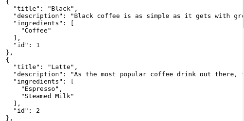

尽管这很好，但是有一个小缺陷。我们的 app 只需要`title`字段。其余的数据对我们来说是不必要的。

这就是 GraphQL 的用武之地。为了只检索项目的`title`和`data`字段，我们将执行以下查询:

```
query HotCoffees{
  allHots {
    title
    id
  }
}

```

这将是服务器的响应:

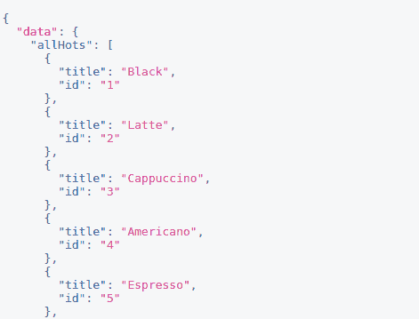

总而言之，GraphQL 只提供您需要的数据。

### GraphQL 示例用法

在您的`components`文件夹中，创建一个名为`CoffeeGraphQL.js`的文件。这里，从编写下面这段代码开始:

```
import {
  ApolloClient,
  InMemoryCache,
  ApolloProvider,
  useQuery,
  gql,
} from "@apollo/client";
import { Box, Center, NativeBaseProvider } from "native-base";
import React from "react";
import DataRenderer from "./DataRenderer";

//connect to GraphQL server:
const client = new ApolloClient({
  uri: "https://api.sampleapis.com/coffee/graphql",
  cache: new InMemoryCache(),
});

function RenderQuery() {
//define our query
  const query = gql`
    query HotCoffees {
      allHots {
        title
        id
      }
    }
  `;
  //make a query
  const { loading, error, data } = useQuery(query);
  if (error) console.log(error);

  return (
    <NativeBaseProvider>
      <Center flex={1}>
        <Box> Using GraphQL </Box>
        {loading && <Box>Loading data.. please wait</Box>}
        {data && <DataRenderer data={data.allHots} />}
      </Center>
    </NativeBaseProvider>
  );
}

```

从这段代码中可以得出一些推论:

*   `client`变量将我们的应用程序连接到 GraphQL 服务器
*   后来，我们进行了一个查询来获取`title`和`id`字段
*   如果出现错误，将其记录到控制台
*   加载数据后，将其显示到用户界面

最后一步，我们现在必须将我们的`RenderQuery`组件绑定到我们的 GraphQL 客户端。

为此，在`CoffeeGraphQL.js`中添加以下代码:

```
export default function CoffeeGraphQL() {
  return (
    <ApolloProvider client={client}>
      <RenderQuery />
    </ApolloProvider>
  );
}

```

这将是结果:

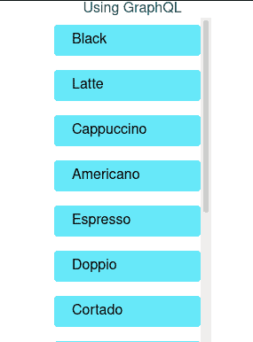

您的`CoffeeGraphQL.js`文件应该如下所示:

```
import {
  ApolloClient,
  InMemoryCache,
  ApolloProvider,
  useQuery,
  gql,
} from "@apollo/client";
import { Box, Center, NativeBaseProvider } from "native-base";
import React from "react";
import DataRenderer from "./DataRenderer";

//connect to GraphQL server:
const client = new ApolloClient({
  uri: "https://api.sampleapis.com/coffee/graphql",
  cache: new InMemoryCache(),
});CoffeeClass

function RenderQuery() {
  const query = gql`
    query HotCoffees {
      allHots {
        title
        id
      }
    }
  `;
  //make a query
  const { loading, error, data } = useQuery(query);
  if (error) console.log(error);
  return (
    <NativeBaseProvider>
      <Center flex={1}>
        <Box>Using GraphQL</Box>
        {loading && <Box>Loading data.. please wait</Box>}
        {data && <DataRenderer data={data.allHots} />}
      </Center>
    </NativeBaseProvider>
  );
}

export default function CoffeeGraphQL() {
  return (
    <ApolloProvider client={client}>
      <RenderQuery />
    </ApolloProvider>
  );
}

```

## 用类组件提取数据

虽然 modern React 倾向于使用功能组件，但使用类组件构建应用程序的选项仍然存在。这对于维护遗留 React 本机代码非常有用。

创建一个名为`CoffeeClass.js`的类，并编写以下代码块:

```
import { Center, NativeBaseProvider, Box } from "native-base";
import React, { Component } from "react";
import DataRenderer from "./DataRenderer";

export default class CoffeeClass extends Component {
  constructor(props) {
    super(props);
    this.state = {
      data: [],
    };
  }
  componentDidMount() {
    this.fetchUsersAsync();
  }

  fetchUsersAsync() {
    const URL = "https://api.sampleapis.com/coffee/hot";
    fetch(URL)
      .then((response) => response.json())
      .then((list) => this.setState({ data: list }));
  }
  render() {
    return (
      <NativeBaseProvider>
        <Center flex={1}>
          <Box>Using class component</Box>
          {this.state.data && <DataRenderer data={this.state.data} />}
        </Center>
      </NativeBaseProvider>
    );
  }
}

```

在这段代码中，我们告诉 React 在第一次渲染(`componentDidMount`)时执行`fetchCoffee`。这将从 API 获取数据，并将其响应存储到`data`状态变量中。最后我们渲染了`data`数组。

运行代码。这将是输出:

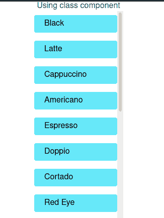

有些人可能认为在`componentWillMount`函数中获取数据更好，这个函数在组件挂载之前执行。你有两个理由不应该做这件事:

*   从 React v17 起，[已弃用](https://reactjs.org/docs/react-component.html#mounting)
*   当您使用`componentWillMount()`中的 Fetch API 时，React Native 会渲染您的数据，而不会等待第一次渲染。这将导致第一次黑屏。因此，节省的时间并不多

## 结论

在本文中，我们探讨了一些在 React Native 中获取数据的常用策略。此时，我会选择在我的项目中使用 Apisauce 和 Hooks。它们不仅使用起来轻而易举，而且非常坚固。因此，这带来了应用程序的安全性和效率。

非常感谢您的阅读！编码快乐！

## [LogRocket](https://lp.logrocket.com/blg/react-native-signup) :即时重现 React 原生应用中的问题。

[](https://lp.logrocket.com/blg/react-native-signup)

[LogRocket](https://lp.logrocket.com/blg/react-native-signup) 是一款 React 原生监控解决方案，可帮助您即时重现问题、确定 bug 的优先级并了解 React 原生应用的性能。

LogRocket 还可以向你展示用户是如何与你的应用程序互动的，从而帮助你提高转化率和产品使用率。LogRocket 的产品分析功能揭示了用户不完成特定流程或不采用新功能的原因。

开始主动监控您的 React 原生应用— [免费试用 LogRocket】。](https://lp.logrocket.com/blg/react-native-signup)