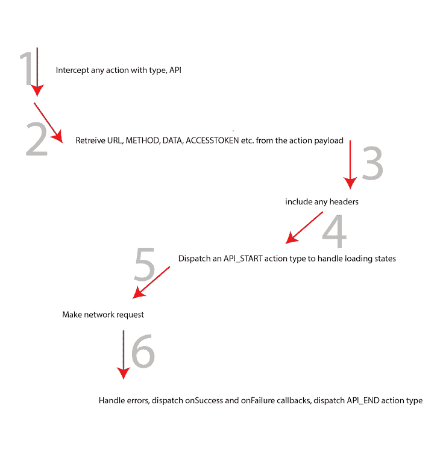

# 用 Redux 和 Axios 获取数据

> 原文：<https://blog.logrocket.com/data-fetching-redux-axios/>

***编者按**:这篇文章于 2022 年 8 月 26 日更新，更新和改进了关于使用 Redux 和 Axios 提取数据的信息，并提到了一个使用 React 钩子提取数据的额外简单选项。*

正如许多开发人员所知，在构建健壮的应用程序时，状态管理是您必须处理的许多问题之一。它会很快变成一场噩梦，尤其是在客户端。

Redux 强制实施单向数据流，这使得理解事件如何改变应用程序的状态变得容易。太好了！但是如何处理副作用呢，比如网络请求，这是最常见的副作用。

让我们探索 Redux 提供的获取和更新数据的一些解决方案，以及如何建立一个定制的中间件解决方案来解决您的特定需求和您可能遇到的任何副作用。

在本文中:

## Redux 是什么？

Redux 是一个状态容器和伟大的工具，它解决了 UI 框架的一个主要问题:状态管理。有了 Redux，应用程序状态可以通过名为`actions`的事件进行可预测的维护。

Redux 状态管理的可预测性在于，如果重放`actions`，我们每次都会到达正确的数据状态。

有许多库扩展了 Redux 在应用程序状态管理方面的功能。但是我们如何判断哪一个适合我们的项目呢？

事实是，这些解决方案中的每一个都是用不同的方法、用例以及头脑中的思维模型构建的，所以它们都有各自的优点和缺点。在这篇博客中，我不会讨论所有可能的方法，但是让我们用一个简单的应用程序来看看一些最常见的模式。

为了探索客户机应用程序状态管理的不同选项，我们将使用一个简单的 [React 应用程序](https://reactjs.org/)。

## 从服务器获取数据的简单示例

让我们在简单的 React 应用程序中使用一个假的 Medium post 作为示例。

看看下面的应用程序截图。你不认为这很简单吗？它所包含的只是一堆文本和左边一个中等大小的拍手图标。你可以[抓取 GitHub repo](https://github.com/ohansemmanuel/fake-medium) 让这个应用程序跟随。


请注意，中拍手是可点击的。如果你感兴趣的话，下面是我如何构建 Medium clap 克隆的。


即使对于这个简单的应用程序，您也必须从服务器获取数据。显示所需视图所需的 JSON 有效负载可能如下所示:

```
{
  "numberOfRecommends": 1900,
  "title": "My First Fake Medium Post",
  "subtitle": "and why it makes no intelligible sense",
  "paragraphs": [
    {
      "text": "This is supposed to be an intelligible post about something intelligible."
    },
    {
      "text": "Uh, sorry there’s nothing here."
    },
    {
      "text": "It’s just a fake post."
    },
    {
      "text": "Love it?"
    },
    {
      "text": "I bet you do!"
    }
  ]
}

```

app 的结构确实很简单，两大组件:`Article`和`Clap`。


在`[components/Article.js](https://github.com/ohansemmanuel/fake-medium/blob/master/src/components/Article.js)`中，文章组件是一个无状态的功能组件，接受`title`、`subtitle`和`paragraphs`道具。渲染的组件如下所示:

```
const Article = ({ title, subtitle, paragraphs }) => {
  return (
    <StyledArticle>
      <h1>{title}</h1>
      <h4>{subtitle}</h4>
      {paragraphs.map(paragraph => <p>{paragraph.text}</p>)}
    </StyledArticle>
  );
};

```

这里，`StyledArticle`是通过 [CSS-in-JS 解决方案](https://blog.logrocket.com/benefits-using-styled-components-react/) `[styled-components](https://blog.logrocket.com/benefits-using-styled-components-react/)`样式化的常规`div`元素。

不管你是否熟悉任何 CSS-in-JS 解决方案。`StyledArticle`可以通过好的 ol’CSS 替换为`div`样式。

让我们结束那件事，不要开始争论。

中 clap 组件在`[components/Clap.js](https://github.com/ohansemmanuel/fake-medium/blob/master/src/components/Clap.js)`内导出。代码稍微复杂一些，超出了本文的范围。然而，你可以仔细阅读[我是如何建立媒体鼓掌](https://medium.freecodecamp.org/how-i-re-built-the-medium-clap-effect-and-what-i-got-out-of-the-experiment-991672995fdf)——这是一个五分钟的阅读。

当`Clap`和`Article`组件都就位后，`App`组件就组成了这两个组件，如`[containers/App.js](https://github.com/ohansemmanuel/fake-medium/blob/master/src/containers/App.js)`所示:

```
class App extends Component {
  state = {};
  render() {
    return (
      <StyledApp>
        <aside>
          <Clap />
        </aside>
        <main>
          <Article />
        </main>
      </StyledApp>
    );
  }
}

```

同样，您可以用常规的`div`替换`StyledApp`，并通过 CSS 对其进行样式化。

现在，到了这篇文章的核心部分。

## 获取和更新数据的各种解决方案

让我们看看在 Redux 应用程序中获取和更新数据的一些不同方法，并考虑它们的优缺点。

### 使用反应状态挂钩

[React 提供了钩子](https://blog.logrocket.com/react-hooks-cheat-sheet-unlock-solutions-to-common-problems-af4caf699e70/)，作为对 React 特性如`state`的快速访问。在这一节中，我们将特别关注[反应状态钩子](https://blog.logrocket.com/a-guide-to-usestate-in-react-ecb9952e406c/)。

使用钩子，我们可以构建一个可以访问状态等特性的组件，而不用编写一个类来扩展`React.Component`和引用`this.state`

为了使用状态挂钩，我们从 React 库中导入`useState`,如下所示:

```
import {useState} from 'react';

```

简单地说，`useState`提供了一种创建状态数据对象的简便方法和一个更新它的函数。

`useState`接受一个值——任何值类型，如`integer`、`string`、`boolean`、`object`等。—并返回包含两个项目的数组。第一项是保存值的变量。第二个是更新变量的函数。

让我们看一个使用我们的`Clap`组件作为函数而不是类编写的小例子:

```
// src/components/Clap.js

import {useState} from 'react'

function generateRandomNumber(min, max) {
    return Math.floor(Math.random() * (max - min + 1) + min);
}

function Clap() {
  const [isClicked, setIsClicked] = useState(false)
  const [count, setCount] = useState(0)
  const [countTotal, setCountTotal] = useState(generateRandomNumber(500, 1000))

  const handleClick = () => {
     // set is clicked to true - this makes our button green
     setIsClicked(true)
     setCount(count + 1)
     setCountTotal(countTotal + 1)
  }

  return (
    <div>
      <button id="clap" className="clap" onClick={handleClick}>
        <span>
          {/*<!--  SVG Created by Luis Durazo from the Noun Project  -->*/}
          <svg
            id="clap--icon"

            viewBox="-549 338 100.1 125"
            className={`${isClicked && "checked"}`}
          >
            <path d="M-471.2 366.8c1.2 1.1 1.9 2.6 2.3 4.1.4-.3.8-.5 1.2-.7 1-1.9.7-4.3-1-5.9-2-1.9-5.2-1.9-7.2.1l-.2.2c1.8.1 3.6.9 4.9 2.2zm-28.8 14c.4.9.7 1.9.8 3.1l16.5-16.9c.6-.6 1.4-1.1 2.1-1.5 1-1.9.7-4.4-.9-6-2-1.9-5.2-1.9-7.2.1l-15.5 15.9c2.3 2.2 3.1 3 4.2 5.3zm-38.9 39.7c-.1-8.9 3.2-17.2 9.4-23.6l18.6-19c.7-2 .5-4.1-.1-5.3-.8-1.8-1.3-2.3-3.6-4.5l-20.9 21.4c-10.6 10.8-11.2 27.6-2.3 39.3-.6-2.6-1-5.4-1.1-8.3z" />
            <path d="M-527.2 399.1l20.9-21.4c2.2 2.2 2.7 2.6 3.5 4.5.8 1.8 1 5.4-1.6 8l-11.8 12.2c-.5.5-.4 1.2 0 1.7.5.5 1.2.5 1.7 0l34-35c1.9-2 5.2-2.1 7.2-.1 2 1.9 2 5.2.1 7.2l-24.7 25.3c-.5.5-.4 1.2 0 1.7.5.5 1.2.5 1.7 0l28.5-29.3c2-2 5.2-2 7.1-.1 2 1.9 2 5.1.1 7.1l-28.5 29.3c-.5.5-.4 1.2 0 1.7.5.5 1.2.4 1.7 0l24.7-25.3c1.9-2 5.1-2.1 7.1-.1 2 1.9 2 5.2.1 7.2l-24.7 25.3c-.5.5-.4 1.2 0 1.7.5.5 1.2.5 1.7 0l14.6-15c2-2 5.2-2 7.2-.1 2 2 2.1 5.2.1 7.2l-27.6 28.4c-11.6 11.9-30.6 12.2-42.5.6-12-11.7-12.2-30.8-.6-42.7m18.1-48.4l-.7 4.9-2.2-4.4m7.6.9l-3.7 3.4 1.2-4.8m5.5 4.7l-4.8 1.6 3.1-3.9" />
          </svg>
        </span>
        <span id="clap--count" className="clap--count">
          +{count}
        </span>
        <span id="clap--count-total" className="clap--count-total">
          {countTotal}
        </span>
      </button>
    </div>
  );
}

```

正如我们在上面的例子中看到的，我们使用状态钩子初始化了所有的数据— `isClicked`、`count`和`countTotal`。同样，在我们的`handleClick`事件中，我们使用适当的函数更新了状态数据。

现在我们来介绍另一个[的 React 钩子叫做](https://blog.logrocket.com/react-reference-guide-hooks-api/#useeffect) `[useEffect](https://blog.logrocket.com/react-reference-guide-hooks-api/#useeffect)`。这个钩子可以和`useState`钩子一起使用来加载从请求中获取的状态数据。这里有一个例子:

```
import {useState, useEffect} from 'react'
import axios from 'axios'

function Example() {
  const [post, updatePost] = useState({title: ''})

  useEffect(() => {
     axios.get("https://api.myjson.com/bins/19dtxc")
        .then(({ data }) => {
            updatePost(data)
        })
  })

  return (
    <div>
       <p>{post.title}</p>
       ...
    </div>
  )
}

```

当我们的数据是自包含的并且受单个组件影响时，对 API 调用使用 React 钩子可以很好地工作。当几个组件共享数据时，我们就不能再依赖钩子了。

现在让我们探索一些 Redux 库来实现更复杂的数据更改。最受欢迎的选项可以说是`redux-thunk`和`redux-saga`。

准备好了吗？

### 使用`redux-thunk`和`redux-promise`

需要记住的一件重要事情是，每个第三方库都有其学习曲线和潜在的可伸缩性问题。但是在 Redux 中管理副作用的所有社区库中，像`redux-thunk`和`redux-promise`这样的是最容易上手的。

前提很简单。`thunk`是一段做一些延迟工作的代码，或者简单地说，是用于稍后更新状态的逻辑。

对于`redux-thunk`，你编写一个动作创建器，它不“创建”一个对象，而是返回一个函数。这个函数通过 Redux 的`getState`和`dispatch`函数传递。

让我们来看看假媒体应用程序如何利用`[redux-thunk](https://github.com/reduxjs/redux-thunk)` [库](https://github.com/reduxjs/redux-thunk)。

首先，安装`redux-thunk`库:

```
yarn add redux-thunk

```

为了使库按预期工作，它必须作为中间件来应用。在`[store/index.js](https://github.com/ohansemmanuel/fake-medium/blob/master/src/store/index.js)`中:

```
import { createStore, applyMiddleware } from "redux";
import thunk from "redux-thunk";
const store = createStore(rootReducer, applyMiddleware(thunk));

```

上面代码块中的第一行从 Redux 导入了`createStore`和`applyMiddleware`函数。第二行从`redux-thunk`输入`thunk`。第三行创建了`store`，但是使用了一个应用中间件。

现在，我们准备发出一个实际的网络请求。

我们将[使用 Axios 库发出网络请求](https://blog.logrocket.com/how-to-make-http-requests-like-a-pro-with-axios/)，但是可以随意用您选择的另一个 HTTP 客户端来替换它。

使用`redux-thunk`，发起网络请求实际上非常容易。您创建了一个操作创建器，它返回如下函数:

```
export function fetchArticleDetails() {
  return function(dispatch) {
    return axios.get("https://api.myjson.com/bins/19dtxc")
      .then(({ data }) => {
      dispatch(setArticleDetails(data));
    });
  };
}

```

一旦安装了`App`组件，您就分派了这个动作创建器:

```
componentDidMount() {
    this.props.fetchArticleDetails();
 }

```

仅此而已。请务必检查[完整的代码差异](https://github.com/ohansemmanuel/fake-medium/commit/589c2e1fb429659ee20131ed1d7558b03c8bf3f9)，因为我在这里只突出显示关键行。这样，文章的详细信息就被获取并显示在应用程序中，就像这样:


这种方法到底有什么问题？

如果你正在构建一个非常小的应用程序，`redux-thunk`解决了这个问题，这可能是最容易相处的。

为了改进对`redux-thunk`的使用，我们可以为 HTTP 请求创建一个类或对象，实现我们选择的客户端。这样，很容易交换库并创建一个实例来减少基本 URL 和头的重复，以及处理基本的网络错误。

一个好主意是让我们的动作创建者尽可能无状态。使它们成为简单的函数会使它们更容易调试和测试。

### 使用`redux-saga`和`redux-observable`

这些 Redux 库比`redux-thunk`或`redux-promise`稍微复杂一些。

`redux-saga`和`redux-observable`无疑可以更好地扩展，但是它们需要一个学习曲线。[像 RxJS](https://blog.logrocket.com/rxjs-react-hooks-for-state-management/) 和 [Redux Saga](https://blog.logrocket.com/understanding-redux-saga-action-creators-sagas/) 这样的概念是必须学习的，这取决于团队中工作的工程师有多少经验，这可能是一个挑战。

所以，如果`redux-thunk`和`redux-promise`对你的项目来说太简单了，而`redux-saga`和`redux-observable`会引入一层你想从你的团队中抽象出来的复杂性，你会转向哪里？

自定义中间件！

像`redux-thunk`、`redux-promise`和`redux-saga`这样的大多数解决方案都使用了一个中间件。为什么你不能创造你的呢？

你刚才是不是说，“为什么要重新发明轮子？”

## 定制中间件是完美的解决方案吗？

虽然重新发明轮子最初听起来确实是件坏事，但还是给它一个机会吧。

无论如何，许多公司已经建立了定制的解决方案来满足他们的需求。事实上，很多开源项目就是这样开始的。

那么，您对这种定制解决方案有什么期望？

*   集中式解决方案；即在一个模块中
*   可以处理各种 HTTP 方法，包括`GET`、`POST`、`DELETE`和`PUT`
*   可以处理设置自定义标题
*   支持自定义错误处理；例如发送到某个外部日志服务，或者用于处理授权错误
*   允许`onSuccess`和`onFailure`回调
*   支持处理装载状态的标签

同样，根据您的具体需求，您可能有一个更大的列表。

现在，让我向您介绍一个合适的起点——一个您可以根据自己的特定用例进行调整的起点。

Redux API 中间件总是这样开始的:

```
const apiMiddleware = ({dispatch}) => next => action => {
  next (action)
}

```

你可以在 Github 上找到定制 Redux API 中间件的完整[代码。一开始可能看起来很多，但我会很快解释每一行。](https://github.com/ohansemmanuel/fake-medium/blob/master/src/middleware/api.js)

给你:

```
import axios from "axios";
import { API } from "../actions/types";
import { accessDenied, apiError, apiStart, apiEnd } from "../actions/api";

const apiMiddleware = ({ dispatch }) => next => action => {
  next(action);

  if (action.type !== API) return;

  const {
    url,
    method,
    data,
    accessToken,
    onSuccess,
    onFailure,
    label,
    headers
  } = action.payload;

  const dataOrParams = ["GET", "DELETE"].includes(method) ? "params" : "data";

  // axios default configs
  axios.defaults.baseURL = process.env.REACT_APP_BASE_URL || "";
  axios.defaults.headers.common["Content-Type"]="application/json";
  axios.defaults.headers.common["Authorization"] = `Bearer${token}`;

  if (label) {
    dispatch(apiStart(label));
  }

  axios
    .request({
      url,
      method,
      headers,
      [dataOrParams]: data
    })
    .then(({ data }) => {
      dispatch(onSuccess(data));
    })
    .catch(error => {
      dispatch(apiError(error));
      dispatch(onFailure(error));

      if (error.response && error.response.status === 403) {
        dispatch(accessDenied(window.location.pathname));
      }
    })
   .finally(() => {
      if (label) {
        dispatch(apiEnd(label));
      }
   });
};

export default apiMiddleware;

```

仅用 100 行代码(同样，您可以从 GitHub 获取这些代码),您就拥有了一个定制的 Redux API 中间件解决方案，其流程很容易理解。

我答应解释每一行，所以首先，这里有一个中间件如何工作的概述:



首先，你做了一些重要的导入，你很快就会看到它们的用法。

### 设置中间件

这是 Redux API 中间件所需的典型设置:

```
const apiMiddleware = ({ dispatch }) => next => action => {}

```

好了，第一步完成了。轻松点。

### 消除不相关的操作类型

我们的下一步是驳回不相关的行动类型。参见下面的代码:

```
if (action.type !== API) return;

```

上述条件对于防止除类型`API`之外的任何动作触发网络请求非常重要。

为了发出成功的请求，需要从动作负载中提取一些重要的变量:

```
const {
    url,
    method,
    data,
    onSuccess,
    onFailure,
    label,
  } = action.payload;

```

以下是每个变量所代表或涉及的内容:

*   `url`:被击中的`endpoint`
*   `method`:请求的 HTTP 方法
*   `data`在`GET`或`DELETE`请求的情况下，发送到服务器或查询参数的任何数据
*   `onSuccess`和`onFailure`:表示您希望在请求成功或失败时分派的任何动作创建者
*   `label`:请求的字符串表示

您将很快在一个实际例子中看到这些内容。

### 处理任何 HTTP 方法

```
const dataOrParams = ["GET", "DELETE"].includes(method) ? "params" : "data";

```

因为这个解决方案使用了`axios`——我认为大多数`HTTP`客户端都是这样工作的——`GET`和`DELETE`方法使用了`params`,而其他方法可能需要向服务器发送一些`data`。

因此，变量`dataOrParams`将保存任何相关的值— `params`或`data` —这取决于请求的方法。

如果你有一些网络开发的经验，这应该不会奇怪。

### 处理全局

```
// axios default configs
  axios.defaults.baseURL = process.env.REACT_APP_BASE_URL || "";
  axios.defaults.headers.common["Content-Type"]="application/json";
  axios.defaults.headers.common["Authorization"] = `Bearer${token}`;

```

大多数像样的应用程序都有一些授权层、一个`baseUrl`和一些默认头。从技术上讲，每个 API 客户端很可能对每个请求都有一些默认值。

这是通过在 Axios 对象上设置一些属性来实现的。我相信你选择的任何客户都可以做到这一点。

### 处理装载状态

```
if (label) {
    dispatch(apiStart(label));
}

```

标签只是一个字符串，用于标识某个网络请求动作。就像一个动作的类型。
如果一个`label`存在，中间件将分派一个`apiStart`动作创建器。

下面是动作创建者的样子:

```
export const apiStart = label => ({
  type: API_START,
  payload: label
});

```

动作类型为`API_START`。

现在，在您的 reducers 中，您可以处理这个动作类型来知道请求何时开始。我将很快展示一个例子。

此外，在网络请求成功或失败时，还将分派一个`API_END`动作。这非常适合处理加载状态，因为您确切地知道请求开始和结束的时间。

我将再次展示一个例子。

### 发出实际的网络请求，处理错误，并调用回调

```
axios
    .request({
      url: `${BASE_URL}${url}`,
      method,
      headers,
      [dataOrParams]: data
    })
    .then(({ data }) => {
      dispatch(onSuccess(data));
    })
    .catch(error => {
      dispatch(apiError(error));
      dispatch(onFailure(error));

     if (error.response && error.response.status === 403) {
        dispatch(accessDenied(window.location.pathname));
      }
    })
    .finally(() => { if (label) { dispatch(apiEnd(label)); } });

```

上面的代码没有看起来那么复杂。

`axios.request`负责发出网络请求，并传入一个对象配置。这些是您之前从 action 有效负载中提取的变量。

当请求成功时，如`then`块所示，分派一个`apiEnd`动作创建器。

看起来像下面这样:

```
export const apiEnd = label => ({
  type: API_END,
  payload: label
});

```

在您的 reducer 中，您可以监听这个消息，并在请求结束时终止任何加载状态。完成之后，调度`onSuccess`回调。

在网络请求成功后，`onSuccess`回调函数返回您想要调度的任何动作。几乎总是有在成功的网络请求之后分派动作的情况，例如，将获取的数据保存到 Redux 存储。

如果出现错误，如`catch`块中所示，也触发`apiEnd`动作创建器，调度一个带有失败错误的`apiError`动作创建器:

```
export const apiError = error => ({
  type: API_ERROR,
  error
});

```

您可能有另一个中间件来监听这个动作类型，并确保错误到达您的外部日志服务。

您还调度了一个`onFailure`回调，以防您需要向用户显示一些视觉反馈。这也适用于 toast 通知。

最后，我展示了一个处理认证错误的例子:

```
if (error.response && error.response.status === 403) {
     dispatch(accessDenied(window.location.pathname));
  }

```

在这个例子中，我分派了一个`accessDenied`动作创建器，它接收用户所在的位置。然后我可以在另一个中间件中处理这个`accessDenied`动作。

你真的不需要在另一个中间件中处理这些。它们可以在同一个代码块中完成。然而，为了仔细抽象，将这些关注点分开对您的项目来说可能更有意义。

就是这样！

## 运行中的定制中间件

我现在将重构这个假的中型应用程序，以使用这个定制的中间件。唯一要做的改变是包含这个中间件，然后编辑`fetchArticleDetails`动作以返回一个普通对象。

包括中间件:

```
import apiMiddleware from "../middleware/api";
const store = createStore(rootReducer, applyMiddleware(apiMiddleware));

```

编辑`fetchArticleDetails`动作:

```
export function fetchArticleDetails() {
  return {
    type: API,
    payload: {
      url: "https://api.myjson.com/bins/19dtxc",
      method: "GET",
      data: null,
      onSuccess: setArticleDetails,
      onFailure: () => {
        console.log("Error occured loading articles");
      },
      label: FETCH_ARTICLE_DETAILS
    }
 };
}

function setArticleDetails(data) {
  return {
    type: SET_ARTICLE_DETAILS,
    payload: data
  };
}

```

注意来自`fetchArticleDetails`的有效载荷是如何包含中间件所需的所有信息的。

但是，有一个小问题:一旦你超越了一个动作创建者，每次都编写有效载荷对象就变得很痛苦。当一些值是`null`或者有一些默认值时，这可能特别令人沮丧。

为方便起见，您可以将动作对象的创建抽象为一个名为`apiAction`的新动作创建者:

```
function apiAction({
  url = "",
  method = "GET",
  data = null,
  onSuccess = () => {},
  onFailure = () => {},
  label = ""
}) {
  return {
    type: API,
    payload: {
      url,
      method,
      data,
      onSuccess,
      onFailure,
      label
    }
  };
}

```

使用 ES6 默认参数，注意`apiAction`已经设置了一些合理的默认值。
现在，在`fetchArticleDetails`你可以这样做:

```
function fetchArticleDetails() {
  return apiAction({
    url: "https://api.myjson.com/bins/19dtxc",
    onSuccess: setArticleDetails,
    onFailure:() => {console.log("Error occured loading articles")},
    label: FETCH_ARTICLE_DETAILS
  });
}

```

对于某些 ES6，这甚至会更简单:

```
const fetchArticleDetails = () => apiAction({
   url: "https://api.myjson.com/bins/19dtxc",
   onSuccess: setArticleDetails,
   onFailure: () => {console.log("Error occured loading articles")},
   label: FETCH_ARTICLE_DETAILS
});

```

简单得多——结果是一样的，一个工作的应用程序！


为了了解标签如何对加载状态有用，我将继续处理 reducer 中的`API_START`和`API_END`动作类型。

```
case API_START:
  if (action.payload === FETCH_ARTICLE_DETAILS) {
     return {
        ...state,
        isLoadingData: true
     };
}

case API_END:
   if (action.payload === FETCH_ARTICLE_DETAILS) {
      return {
        ...state,
        isLoadingData: false
      };
 }

```

现在，我基于动作类型`API_START`和`API_END`在状态对象中设置一个`isLoadingData`标志。基于此，我可以在`App`组件中设置一个加载状态。

结果如下:


成功了！

请记住，我在这里分享的定制中间件只是作为您的应用程序的一个良好起点。评估以确保这适合你的具体情况。根据您的具体使用情况，您可能需要进行一些调整。

值得一提的是，我已经在相当大的项目中以此为起点，并不后悔这个决定。

## 结论

我强烈建议您在做出任何承诺之前，在 Redux 应用程序中尝试各种可用的网络请求选项。可悲的是，在为一个成熟的应用程序选择了策略之后，重构就变得很困难了。

最终，这是您的团队、您的应用程序、您的时间，最终，您可以自己做出选择。

不要忘记查看 GitHub 上的[代码库，感谢](https://github.com/ohansemmanuel/fake-medium) [LeanPub 的 Redux Book](https://leanpub.com/redux-book) ，它启发了本文。

回头见！

## 使用 [LogRocket](https://lp.logrocket.com/blg/signup) 消除传统错误报告的干扰

[](https://lp.logrocket.com/blg/signup)

[LogRocket](https://lp.logrocket.com/blg/signup) 是一个数字体验分析解决方案，它可以保护您免受数百个假阳性错误警报的影响，只针对几个真正重要的项目。LogRocket 会告诉您应用程序中实际影响用户的最具影响力的 bug 和 UX 问题。

然后，使用具有深层技术遥测的会话重放来确切地查看用户看到了什么以及是什么导致了问题，就像你在他们身后看一样。

LogRocket 自动聚合客户端错误、JS 异常、前端性能指标和用户交互。然后 LogRocket 使用机器学习来告诉你哪些问题正在影响大多数用户，并提供你需要修复它的上下文。

关注重要的 bug—[今天就试试 LogRocket】。](https://lp.logrocket.com/blg/signup-issue-free)