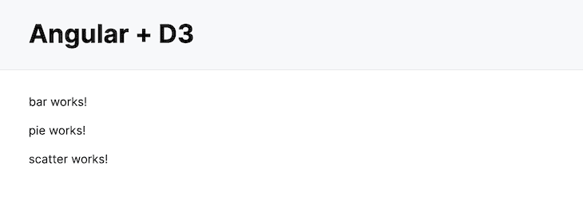
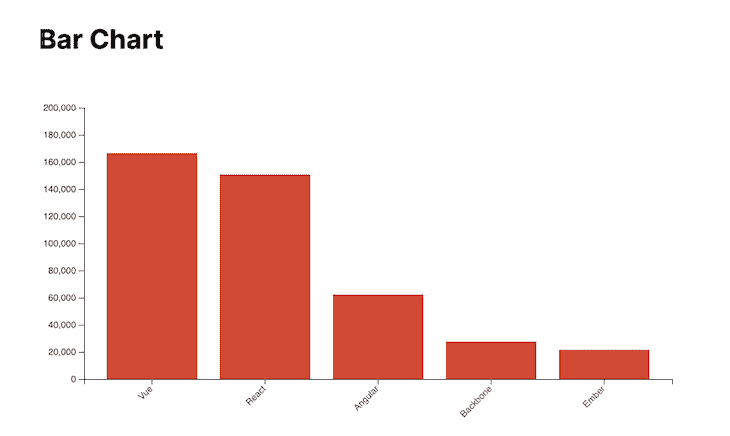
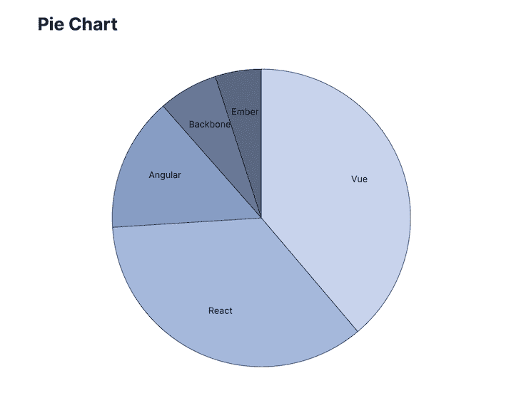
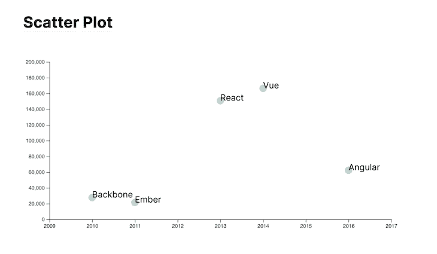

# 使用 D3.js - LogRocket Blog 在 Angular 中实现数据可视化

> 原文：<https://blog.logrocket.com/data-visualization-angular-d3-js/>

***编者按**:这个 Angular 和 D3.js 教程最后一次更新是在 2022 年 11 月 22 日，修复了代码中的错误，并包含了一个关于如何在一个页面上加载多个组件的部分。关于用 D3 进行数据可视化的更多文章，请查看这些文章:“[用 D3 和 TypeScript 创建可视化](https://blog.logrocket.com/creating-visualizations-d3-typescript/)”和“[用 Vue.js 和 D3 进行数据可视化](https://blog.logrocket.com/data-visualization-vue-js-d3/)”*

随着越来越多的组织关注收集和分析数据，产品团队面临的挑战之一是以一种有用的方式呈现数据。虽然许多软件开发人员默认使用列表和表格视图，但这些表示格式往往会让用户不知所措。

数据可视化通过以图形格式描绘数据，帮助您更好地传达数据的含义。这通常意味着条形图、散点图或饼图。因为 web 上的大多数数据可视化都是在前端生成的，所以 JavaScript 是数据可视化库的首选语言。

在可用的库中， [D3.js](https://d3js.org/) 是最受欢迎的库之一。它允许您通过基于动态数据操作 DOM 来创建数据可视化。D3 是反应式的，这意味着它不是在服务器上生成静态图像并提供给客户端，而是使用 JavaScript 将 HTML 元素“绘制”到您的网页上。这使得 D3 功能强大，但也比其他一些图表库更难使用。

[Angular](https://angular.io/) 由 Google 维护，是最流行的开源前端 web 框架之一。在本教程中，您将看到如何使用 D3 将数据可视化添加到 Angular 应用程序中。您将设置 Angular 和 D3，添加三种常见的图表类型，重构图表组件以使其更加可重用，并从第三方 API 或本地 CSV 文件导入数据。最后，您应该有了使用 D3 和 Angular 创建自己的数据可视化的起点。

向前跳:

## 设置角度和 D3

Angular 使用命令行界面来帮助您生成新的应用程序和组件。Angular CLI [提供了丰富的特性集](https://blog.logrocket.com/6-useful-features-in-angular-cli-eb502bd95874/)，使开发人员的生活更加轻松。你只需要安装 [Node.js](https://nodejs.org/en/) 和 [npm](https://www.npmjs.com/) 就可以继续了。如果你是使用 Angular 的新手，你可以阅读[本地安装指南](https://angular.io/guide/setup-local)以了解更多关于这个过程的信息，或者如果你想跳过这个演练并下载最终的应用程序，你可以[从 GitHub](https://github.com/sunnyy02/angular_d3) 获得代码。如果你想经历整个过程，请继续阅读！

首先，安装[角度指示器](https://cli.angular.io/)。命令行工具提供了一种快速启动新角度项目的方法:

```
npm install -g @angular/cli

```

接下来，创建一个新的 Angular 应用程序。你可以随便叫它什么，但我会用这个名字:

```
ng new angular-d3

```

最后，导航到新项目:

```
cd angular-d3/

```

接下来，从 npm 安装 [D3](https://www.npmjs.com/package/d3) 和 [D3 类型定义](https://www.npmjs.com/package/@types/d3)。类型定义将允许 TypeScript 对外部 D3 代码应用类型提示:

```
npm install d3 && npm install @types/d3 --save-dev

```

接下来，使用 Angular CLI 创建三个新组件。在接下来的步骤中，您将使用 D3 在每个页面中生成数据可视化。

首先，`bar`组件:

```
ng g component bar

```

接下来，`pie`组件:

```
ng g component pie

```

和`scatter`组件:

```
ng g component scatter

```

这些组件现在在`src/app/`目录中可用，Angular 将它们添加到了您的`app.module.ts`文件中，但是您仍然需要使用它们的选择器来插入组件。打开你的`src/app/app.component.html`文件，用下面的内容替换它:

```
<header>
  <h1>Angular + D3</h1>
</header>
<app-bar></app-bar>
<app-pie></app-pie>
<app-scatter></app-scatter>

```

最后，你可以将 [new.css](https://newcss.net/) 添加到你的`<head>`中，让网站看起来更漂亮一点。打开`src/index.html`文件，在`<head></head>`标签之间添加以下几行:

```
<link rel="stylesheet" href="https://fonts.xz.style/serve/inter.css">
<link rel="stylesheet" href="https://cdn.jsdelivr.net/npm/@exampledev/[email protected]/new.min.css">

```

您已经准备好测试它了。从您的终端运行`ng serve --open`。您的浏览器应该会打开`[http://localhost:4200](http://localhost:4200)`，您会看到类似这样的内容:



现在你的 Angular 应用程序已经准备好了，让我们添加三个图表:条形图、饼图和散点图。

## 创建条形图

您将添加的第一个数据可视化是条形图。条形图通常用于显示不同类别数据的相对值。我们将使用的数据是每个流行的前端 web 开发框架的星级数:

```
[
    {"Framework": "Vue", "Stars": "166443", "Released": "2014"},
    {"Framework": "React", "Stars": "150793", "Released": "2013"},
    {"Framework": "Angular", "Stars": "62342", "Released": "2016"},
    {"Framework": "Backbone", "Stars": "27647", "Released": "2010"},
    {"Framework": "Ember", "Stars": "21471", "Released": "2011"}
]

```

Angular 组件通常由四个文件组成:HTML 模板文件、CSS 或 SCSS 样式表、规范(测试)文件和类型脚本组件文件。打开模板文件(`bar.component.html`)，添加以下标题和图形:

```
<h2>Bar Chart</h2>
<figure id="bar"></figure>

```

您将使用 D3 通过 CSS 选择器在图中添加图表。接下来，打开 TypeScript 组件文件(`bar.component.ts`)并添加以下属性:

```
import { Component, OnInit } from '@angular/core';
import * as d3 from 'd3';

export class BarComponent implements OnInit {
  private data = [
    {"Framework": "Vue", "Stars": "166443", "Released": "2014"},
    {"Framework": "React", "Stars": "150793", "Released": "2013"},
    {"Framework": "Angular", "Stars": "62342", "Released": "2016"},
    {"Framework": "Backbone", "Stars": "27647", "Released": "2010"},
    {"Framework": "Ember", "Stars": "21471", "Released": "2011"},
  ];
  private svg: any;
  private margin = 50;
  private width = 750 - (this.margin * 2);
  private height = 400 - (this.margin * 2);
...

```

首先，我们将`d3`包导入到这个组件中，这样以后就可以引用它了。第一个私有属性`data`硬编码了生成图表所需的数据。稍后您将看到如何使用来自文件或 API 的数据，但这将让您开始。

在类中将使用`svg`属性来存储 D3 绘制到 DOM 上的 SVG 图像。其他属性设置图表的高度、宽度和边距。虽然可以用 D3 创建[响应式图表，但我不会在本教程中探究它们。](https://medium.com/@louisemoxy/a-simple-way-to-make-d3-js-charts-svgs-responsive-7afb04bc2e4b)

接下来，在`BarComponent`中创建一个名为`createSvg()`的方法。这将选择 DOM 中的元素，并插入一个新的 [SVG 和一个](http://tutorials.jenkov.com/svg/g-element.html) `[<g>]([http://tutorials.jenkov.com/svg/g-element.html](http://tutorials.jenkov.com/svg/g-element.html))` [元素](http://tutorials.jenkov.com/svg/g-element.html):

```
private createSvg(): void {
    this.svg = d3.select("figure#bar")
    .append("svg")
    .attr("width", this.width + (this.margin * 2))
    .attr("height", this.height + (this.margin * 2))
    .append("g")
    .attr("transform", "translate(" + this.margin + "," + this.margin + ")");
}

```

现在创建一个名为`drawBars()`的方法，该方法将使用`svg`属性添加条形:

```
private drawBars(data: any[]): void {
  // Create the X-axis band scale
  const x = d3.scaleBand()
  .range([0, this.width])
  .domain(data.map(d => d.Framework))
  .padding(0.2);

  // Draw the X-axis on the DOM
  this.svg.append("g")
  .attr("transform", "translate(0," + this.height + ")")
  .call(d3.axisBottom(x))
  .selectAll("text")
  .attr("transform", "translate(-10,0)rotate(-45)")
  .style("text-anchor", "end");

  // Create the Y-axis band scale
  const y = d3.scaleLinear()
  .domain([0, 200000])
  .range([this.height, 0]);

  // Draw the Y-axis on the DOM
  this.svg.append("g")
  .call(d3.axisLeft(y));

  // Create and fill the bars
  this.svg.selectAll("bars")
  .data(data)
  .enter()
  .append("rect")
  .attr("x", (d: any) => x(d.Framework))
  .attr("y", (d: any) => y(d.Stars))
  .attr("width", x.bandwidth())
  .attr("height", (d: any) => this.height - y(d.Stars))
  .attr("fill", "#d04a35");
}

```

最后，在您的`BarComponent`的`ngOnInit()`方法中调用这两个方法:

```
ngOnInit(): void {
    this.createSvg();
    this.drawBars(this.data);
}

```

如果您在上一步中停止了 Angular 服务器，重启它(`ng serve`)并在浏览器中访问`localhost:4200`。您应该会看到新的条形图:



## 创建饼图

饼图是显示不同数据的相对值的好方法。在这种情况下，您将使用它来可视化基于 GitHub stars 的不同前端框架的市场份额。

第一步是用新的图形和标题更新组件的 HTML 文件(`pie.component.html`):

```
<h2>Pie Chart</h2>
<figure id="pie"></figure>

```

因为这个图表使用与条形图相同的数据集，所以组件的类看起来很相似。用您的数据和以下私有属性更新`pie.component.ts`文件:

```
import { Component, OnInit } from '@angular/core';
import * as d3 from 'd3';
export class PieComponent implements OnInit {
  private data = [
    {"Framework": "Vue", "Stars": "166443", "Released": "2014"},
    {"Framework": "React", "Stars": "150793", "Released": "2013"},
    {"Framework": "Angular", "Stars": "62342", "Released": "2016"},
    {"Framework": "Backbone", "Stars": "27647", "Released": "2010"},
    {"Framework": "Ember", "Stars": "21471", "Released": "2011"},
  ];
  private svg: any;
  private margin = 50;
  private width = 750;
  private height = 600;
  // The radius of the pie chart is half the smallest side
  private radius = Math.min(this.width, this.height) / 2 - this.margin;
  private colors;
...

```

这里最大的不同是添加了`radius`和`colors`属性。因为饼图使用圆形而不是矩形来显示数据，所以`radius`属性确保图表符合定义的图形边界。在接下来的步骤中，您将使用`colors`属性来定义饼图的颜色。

接下来，创建一个名为`createSvg`的私有方法。这将选择 DOM 上的`figure`元素并添加`<g>`元素，D3 将在这里绘制您的饼图:

```
private createSvg(): void {
    this.svg = d3.select("figure#pie")
    .append("svg")
    .attr("width", this.width)
    .attr("height", this.height)
    .append("g")
    .attr(
      "transform",
      "translate(" + this.width / 2 + "," + this.height / 2 + ")"
    );
}

```

在这个饼图中，您将使用一个[序数刻度](http://using-d3js.com/04_07_ordinal_scales.html)为图表的每个部分创建一个离散的颜色。你可以将每种颜色定义为框架的主色，但我认为单色方案看起来更好:

```
private createColors(): void {
    this.colors = d3.scaleOrdinal()
    .domain(this.data.map(d => d.Stars.toString()))
    .range(["#c7d3ec", "#a5b8db", "#879cc4", "#677795", "#5a6782"]);
}

```

创建一个绘制图表和添加标签的方法。该方法使用`<path>`元素为每个框架创建弧线，并用上述`createColors`方法中定义的颜色填充它们:

```
private drawChart(): void {
  // Compute the position of each group on the pie:
  const pie = d3.pie<any>().value((d: any) => Number(d.Stars));

  // Build the pie chart
  this.svg
  .selectAll('pieces')
  .data(pie(this.data))
  .enter()
  .append('path')
  .attr('d', d3.arc()
    .innerRadius(0)
    .outerRadius(this.radius)
  )
  .attr('fill', (d: any, i: any) => (this.colors(i)))
  .attr("stroke", "#121926")
  .style("stroke-width", "1px");

  // Add labels
  const labelLocation = d3.arc()
  .innerRadius(100)
  .outerRadius(this.radius);

  this.svg
  .selectAll('pieces')
  .data(pie(this.data))
  .enter()
  .append('text')
  .text((d: any)=> d.data.Framework)
  .attr("transform", (d: any) => "translate(" + labelLocation.centroid(d) + ")")
  .style("text-anchor", "middle")
  .style("font-size", 15);
}

```

D3 的 [`centroid`](https://www.d3indepth.com/shapes/#centroid) [函数](https://www.d3indepth.com/shapes/#centroid)允许你将标签放入饼图每一片的计算质心。在这种情况下，通过设置`innerRadius(100)`，标签将稍微偏离真正的质心。您可以调整这些数字，将它们重新放置在您认为最佳的位置。

最后，在`ngOnInit()`方法中调用所有这三个方法:

```
ngOnInit(): void {
    this.createSvg();
    this.createColors();
    this.drawChart();
}

```

回到您的浏览器，查看 Angular 应用程序中的新饼图:



## 创建散点图

在本教程中，您将创建的最后一种数据可视化是散点图。[散点图](https://www.mathsisfun.com/data/scatter-xy-plots.html)让我们能够显示图表中每个点的两条数据之间的关系。在这种情况下，您将查看每个框架发布的年份和它当前拥有的星级数之间的关系。

首先，以与上面相同的方式更新 HTML 模板文件(`scatter.component.html`):

```
<h2>Scatter Plot</h2>
<figure id="scatter"></figure>

```

因为此散点图使用相同的数据和图形大小，所以它从与条形图相同的属性开始:

```
import { Component, OnInit } from '@angular/core';
import * as d3 from 'd3';
export class ScatterComponent implements OnInit {
  private data = [
    {"Framework": "Vue", "Stars": "166443", "Released": "2014"},
    {"Framework": "React", "Stars": "150793", "Released": "2013"},
    {"Framework": "Angular", "Stars": "62342", "Released": "2016"},
    {"Framework": "Backbone", "Stars": "27647", "Released": "2010"},
    {"Framework": "Ember", "Stars": "21471", "Released": "2011"},
  ];
  private svg;
  private margin = 50;
  private width = 750 - (this.margin * 2);
  private height = 400 - (this.margin * 2);
...

```

事实上，`createSvg`方法也和条形图一样:

```
private createSvg(): void {
    this.svg = d3.select("figure#scatter")
    .append("svg")
    .attr("width", this.width + (this.margin * 2))
    .attr("height", this.height + (this.margin * 2))
    .append("g")
    .attr("transform", "translate(" + this.margin + "," + this.margin + ")");
}

```

如果您的应用程序有许多使用相似属性的条形图和散点图，您可能想要尝试使用继承来减少重复代码的数量。

接下来，创建一个新的`drawPlot()`方法来创建绘图的 x 轴和 y 轴，并将点添加到画布上。此方法使点半透明，并添加每个框架的名称作为标签:

```
private drawPlot(): void {
    // Add X axis
    const x = d3.scaleLinear()
    .domain([2009, 2017])
    .range([ 0, this.width ]);
    this.svg.append("g")
    .attr("transform", "translate(0," + this.height + ")")
    .call(d3.axisBottom(x).tickFormat(d3.format("d")));

    // Add Y axis
    const y = d3.scaleLinear()
    .domain([0, 200000])
    .range([ this.height, 0]);
    this.svg.append("g")
    .call(d3.axisLeft(y));

    // Add dots
    const dots = this.svg.append('g');
    dots.selectAll("dot")
    .data(this.data)
    .enter()
    .append("circle")
    .attr("cx", (d: any) => x(d.Released))
    .attr("cy",  (d: any) => y(d.Stars))
    .attr("r", 7)
    .style("opacity", .5)
    .style("fill", "#69b3a2");

    // Add labels
    dots.selectAll("text")
    .data(this.data)
    .enter()
    .append("text")
    .text( (d: any) => d.Framework)
    .attr("x", (d: any) => x(d.Released))
    .attr("y", (d: any)  => y(d.Stars))
}

```

散点图中的另一个重要区别是，您的 x 轴使用日期而不是字符串(就像您在条形图中所做的那样)，因此您必须调用`.tickFormat(d3.format("d"))`来正确格式化它们。

最后，从您的`ngOnInit()`方法中调用这两个方法:

```
ngOnInit(): void {
    this.createSvg();
    this.drawPlot();
}

```

回到您的浏览器，查看在您的 Angular 应用程序中渲染的最终图形:



## 在一个页面上加载多个组件

在前面的示例中，条形图/饼图/散点图组件保存源数据，并根据这些数据绘制图表。如果我们想在同一个页面上显示具有不同数据源的多个组件，那么我们必须复制这些组件。在 Angular 中，[最佳实践](https://blog.logrocket.com/inject-dynamic-content-angular-components-with-portals/)是将这些组件构建为一个哑组件，因此它只关注基于注入数据的图表。

让我们重构条形图组件，使其更具可重用性。

首先，让我们创建一个新版本的`BarComponent`:

```
ng g component bar2

```

上面的命令将在`src/app/`目录中为新的`Bar2Component`创建框架文件。在构建组件之前，我们需要为图表数据创建以下接口:

```
export interface LineData {
    label: string;
    value: number;
}
export interface ChartData {
    yrange: number,
    lineData: LineData[]
}

```

`ChartData`接口定义了由`Bar2Component`使用的数据的形状。打开 App.component.ts 文件，添加`chartData_2D_1`变量，这样我们就可以将数据从`Bar2Component`中分离出来:

```
  chartData_2D_1: ChartData = {
    yrange: 200000,
    lineData: [
      { label: 'Vue', value: 166443 },
      { label: 'React', value: 150793 },
      { label: 'Angular', value: 62342 },
      { label: 'Backbone', value: 27647 },
      { label: 'Ember', value: 21471 },
    ],
  };

```

现在，我们可以将以下`Input`属性和其他私有属性添加到`Bar2Component`中:

```
import * as d3 from 'd3';
import { ChartData, LineData } from '../chartData';
...
export class Bar2Component implements AfterViewInit {
  @Input()
  chartName:string = 'bar';
  @Input()
  data: ChartData = {} as ChartData;

  private svg: any;
  private margin = 50;
  private width = 750 - this.margin * 2;
  private height = 400 - this.margin * 2;

```

引入了两个`Input`属性:

*   `chartName`:定义组件的唯一名称。它被绑定到图元素的`Id`，并且`d3`可以使用它来获得对 HTML 元素的引用
*   `data`:组件的源数据。

与前面的`BarComponent`类似，下面我们创建一个`createSvg`方法。但是我们在`select`方法中使用了一个动态选择器:

```
private createSvg(): void {
    this.svg = d3
      .select(`figure#${this.chartName}`)
      .append('svg')
      .attr('width', this.width + this.margin * 2)
      .attr('height', this.height + this.margin * 2)
      .append('g')
      .attr('transform', 'translate(' + this.margin + ',' + this.margin + ')');
  }

```

然后我们可以创建`drawBars`方法。同样，它类似于 BarComponent 中的`drawBars`方法。与前面的方法相比，我们使用`label`和`value`属性来代替`Framework`和`Stars`属性。新创建的`ChartData`和`LineData`接口也应用在方法中，因此我们可以获得编辑器智能支持和强类型:

```
private drawBars(data: ChartData): void {
    // Create the X-axis band scale
    const x = d3
      .scaleBand()
      .range([0, this.width])
      .domain(data.lineData.map((d: LineData) => d.label))
      .padding(0.2);

    // Draw the X-axis on the DOM
    this.svg
      .append('g')
      .attr('transform', 'translate(0,' + this.height + ')')
      .call(d3.axisBottom(x))
      .selectAll('text')
      .attr('transform', 'translate(-10,0)rotate(-45)')
      .style('text-anchor', 'end');

    // Create the Y-axis band scale
    const y = d3.scaleLinear().domain([0, data.yrange]).range([this.height, 0]);

    // Draw the Y-axis on the DOM
    this.svg.append('g').call(d3.axisLeft(y));

    // Create and fill the bars
    this.svg
      .selectAll('bars')
      .data(data.lineData)
      .enter()
      .append('rect')
      .attr('x', (d: LineData) => x(d.label))
      .attr('y', (d: LineData) => y(d.value))
      .attr('width', x.bandwidth())
      .attr('height', (d: any) => this.height - y(d.value))
      .attr('fill', '#d04a35');
  }

```

现在，我们可以创建`ngAfterViewInit`方法并调用上面的方法:

```
  ngAfterViewInit(): void {
    this.createSvg();
    this.drawBars(this.data);
  }

```

请注意，我们使用了`AfterViewInit` [生命周期钩子](https://blog.logrocket.com/angular-lifecycle-hooks/)而不是`OnInit`，因为我们希望确保在视图呈现后调用该方法。

最后，让我通过将以下内容添加到 HTML 模板文件(`bar2.component.html`)来完成`Bar2Component`:

```
<h2>Bar Chart</h2>
<figure id="{{chartName}}"></figure>

```

`Bar2Component`准备好了！

如果将以下内容添加到 App.Component.html，并启动角度开发服务器(`ng serve`或`npm run start`)，将显示条形图:

```
 <app-bar2 chartName="barA" [data]="chartData_2D_1"></app-bar2>

```

使用新组件，您可以向同一页面添加多个实例，并分配不同的名称和源数据。在 Git [H](https://github.com/sunnyy02/angular_d3) [ub](https://github.com/sunnyy02/angular_d3) 中提供的[示例代码中，我添加了两个`Bar2Component`的实例供大家参考。在示例项目中，您还可以找到新版本的饼图组件和散点图组件。](https://github.com/sunnyy02/angular_d3)

## 从外部源加载数据

到目前为止，您已经将数据硬编码到角度组件中，但这可能不现实。有几种方法可以从外部数据源加载数据，所以让我们看看在 D3 中最常用的两种模式。

### 加载 CSV 文件

大多数电子表格可以导出为 [CSV 文件](https://en.wikipedia.org/wiki/Comma-separated_values)。CSV 是一种基于文本的数据存储格式，它使用逗号和换行符来分隔文件中的值。因为 CSV 是一种如此常见的数据格式，D3 为加载公开可用的 CSV 文件提供了本机支持。

为了演示如何使用 CSV 文件，在 Angular 应用程序的`src/assets/`目录中创建一个名为`frameworks.csv`的新文件。将以下文本添加到文件中:

```
Framework,Stars,Released
Vue,166443,2014
React,150793,2013
Angular,62342,2016
Backbone,27647,2010
Ember,21471,2011

```

接下来，打开条形图组件(`bar.component.ts`)并更新`ngOnInit()`方法以调用 D3 的`csv()`方法:

```
ngOnInit(): void {
    this.createSvg();
    // Parse data from a CSV
    d3.csv("/assets/frameworks.csv").then(data => this.drawBars(data));
}

```

D3 可以从您的 Angular 应用程序或第三方 URL 加载 CSV，并使数据作为结果 promise 中的一个对象数组可用。如果你回到浏览器，你会看到和以前一样的条形图，但是这次它使用的是来自`frameworks.csv`文件的数据，而不是角度分量。

### 从 JSON API 获取数据

web APIs 中使用的另一种常见数据格式是 [JSON](https://www.json.org/json-en.html) 。JSON 是 JavaScript 对象的字符串表示，通常由 [REST 和 graph QL API](https://blog.logrocket.com/making-rest-more-human-with-graphql/)返回。D3 本身支持 JSON 数据，因此它使得与 Angular 应用程序的集成变得非常容易。

首先，您需要一个 JSON API 端点或文件。我将本教程通篇使用的框架数据上传到了免费的 JSON 文件托管平台 [JSONbin](https://jsonbin.io/) 。你可以[在这里](https://api.jsonbin.io/b/5eee6a5397cb753b4d149343)访问这些数据。

要使用这个端点，再次打开`bar.component.ts`文件，用下面的代码更新`ngOnInit()`方法:

```
ngOnInit(): void {
    this.createSvg();
    // Fetch JSON from an external endpoint
    type ChartDataType ={
      Framework: string,
      Stars: number,
      Released: number
    }
     d3.json('https://api.jsonbin.io/b/5eee6a5397cb753b4d149343').then(data=> {
      const chartData = data as ChartDataType[];
      this.drawBars(chartData);
  });
}

```

正如在 CSV 示例中，D3 的`json`方法返回一个承诺，将您的数据解析为一个对象数组。通过传递它，您的条形图现在可以使用 JSON API 端点作为它的数据源。
请注意，我们创建了一个`ChartDataType`类型来进行类型断言，因为来自 API 的数据默认为`unknown`类型，如果没有类型断言，将会抛出一个错误。

## 结论

当您需要在 Angular 应用程序中创建丰富的数据可视化时，D3 是一个很好的选择。虽然可能需要一些时间来掌握，但 D3 非常强大，可以用来创建几乎任何您可以想象的数据可视化。它还使得从 CSV 或 JSON APIs 访问数据集变得非常容易。你可以在这里找到这个项目的 [GitHub 库](https://github.com/sunnyy02/angular_d3)。

如果你想了解更多定制条形图的方法，我建议你查看官方文档或 [D3 图片库](https://www.d3-graph-gallery.com/index.html)中的更多例子。

## 像用户一样体验 Angular 应用程序

调试 Angular 应用程序可能很困难，尤其是当用户遇到难以重现的问题时。如果您对监视和跟踪生产中所有用户的角度状态和动作感兴趣，

[try LogRocket](https://lp.logrocket.com/blg/angular-signup)

.

[](https://lp.logrocket.com/blg/angular-signup)[https://logrocket.com/signup/](https://lp.logrocket.com/blg/angular-signup)

LogRocket 就像是网络和移动应用程序的 DVR，记录你网站上发生的一切，包括网络请求、JavaScript 错误等等。您可以汇总并报告问题发生时应用程序的状态，而不是猜测问题发生的原因。

LogRocket NgRx 插件将角度状态和动作记录到 LogRocket 控制台，为您提供导致错误的环境，以及出现问题时应用程序的状态。

现代化调试 Angular 应用的方式- [开始免费监控](https://lp.logrocket.com/blg/angular-signup)。