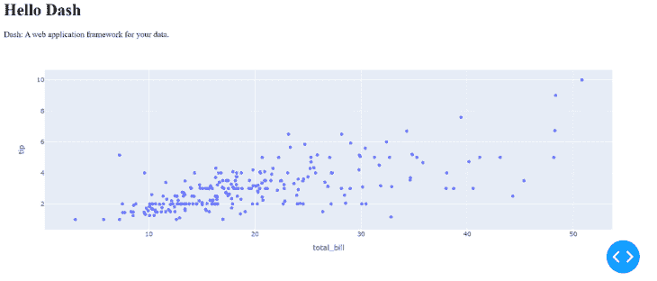
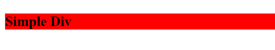
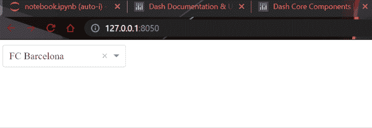
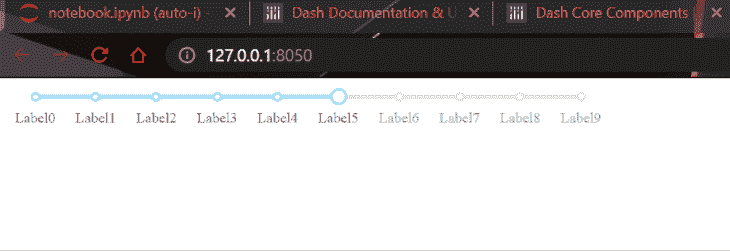
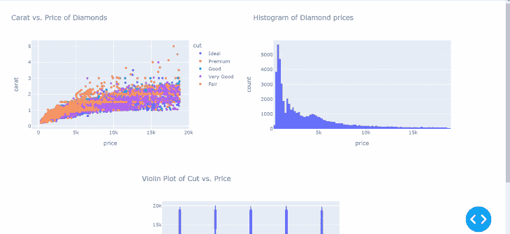

# 用 Python Dash 实现数据可视化

> 原文：<https://blog.logrocket.com/data-visualization-interfaces-python-dash/>

数据可视化接口，也称为[仪表板](https://blog.logrocket.com/mastering-data-visualization-python-matplotlib/)，是数据分析师技能组合中不可或缺的一部分。仪表板和数据应用程序现在随处可见，从通过一系列视觉效果报告您的分析到展示您的机器学习应用程序。

当涉及到数据时，Python 也是如此。具体来说，我们正在谈论它的 Dash 库，它是建立在一个最热门的图形库之上的。

Dash 使得只使用 Python 代码通过交互式仪表盘创建和共享数据分析变得轻而易举。不需要学习 HTML，CSS，或者像 [React.js](https://blog.logrocket.com/tag/react/) 这样复杂的 JavaScript 框架。

在本教程中，您将大致了解 Dash 的功能以及如何将其集成到您的工作流程中。

## 安装仪表板和绘图仪

可以用`pip`安装 dash。您还应该安装 pandas 库来处理数据集:

```
pip install dash pandas
```

上面的命令也会安装`plotly`。Plotly 以其交互式图表而闻名，Plotly 和 Dash 都是由 Plotly 软件基金会创建的，因此这两个库配合得非常好。

## 使用仪表板的要求

像 Dash 这样强大的框架有一些要求。首先你要知道 Plotly Python 因为 Dash 只能显示 Plotly 的交互图表。

接下来，你需要对 HTML 和 CSS 有一个基本的了解。破折号类似于 React，但在 Python 中。它是一个模板框架，你可以在其中建立一个没有 JavaScript 的数据网站。

仪表板包含多种视觉效果，如何在一个页面上显示所有这些视觉效果取决于用户。Plotly 处理视觉效果，但布局方面完全取决于 Dash 及其 HTML 组件。

## 构建 Dash 应用程序

让我们创建我们的 Dash 应用程序。安装完成后，我们导入以下库:

```
import dash
import dash_core_components as dcc
import dash_html_components as html
import plotly.express as px
import pandas as pd
```

是包含所有核心特性的全局库。`dash_core_components`和`dash_html_components`是默认安装了`dash`的库。它们包括特定于 Dash 的特性和 HTML 组件(标签)的 Python 表示。稍后将详细介绍。

任何 Dash 应用程序都以以下命令开始:

```
app = dash.Dash(name="my_first_dash_app")

>>> app
<dash.dash.Dash at 0x1ee6af51af0>
```

上面的代码为一个空白网站创建了所有的样板代码。我们不想要空白页，所以让我们填充它。

首先，我们从 Plotly 加载一个内置数据集，并创建一个简单的散点图:

```
# Load dataset using Plotly
tips = px.data.tips()

fig = px.scatter(tips, x="total_bill", y="tip") # Create a scatterplot
```

然后，我们将这个数字添加到应用程序的`layout`属性中的一个带有几个文本的`div`标签中:

```
app.layout = html.Div(children=[
   html.H1(children='Hello Dash'),  # Create a title with H1 tag

   html.Div(children='''
       Dash: A web application framework for your data.
   '''),  # Display some text

   dcc.Graph(
       id='example-graph',
       figure=fig
   )  # Display the Plotly figure
])

if __name__ == '__main__':
   app.run_server(debug=True) # Run the Dash app
```

这里，我们使用`dash_html_components` ( `html`)库创建 HTML 标签，使用核心组件(`dcc` ) `library`创建图形。

`H1`标题标签后面是包含简单文本的`div`，然后是使用`dcc`的图形函数的图形本身。所有这些都在一个 DIV 标签的`children`属性中。

最后，我们还添加了在调试模式下运行我们的应用程序的命令，这意味着这些更改会随着脚本的更改而生效。以下是迄今为止完整的代码:

```
import dash
import dash_core_components as dcc
import dash_html_components as html
import plotly.express as px
import pandas as pd

# Create the app
app = dash.Dash(__name__)

# Load dataset using Plotly
tips = px.data.tips()

fig = px.scatter(tips, x="total_bill", y="tip") # Create a scatterplot

app.layout = html.Div(children=[
   html.H1(children='Hello Dash'),  # Create a title with H1 tag

   html.Div(children='''
       Dash: A web application framework for your data.
   '''),  # Display some text

   dcc.Graph(
       id='example-graph',
       figure=fig
   )  # Display the Plotly figure
])

if __name__ == '__main__':
   app.run_server(debug=True) # Run the Dash app
```

将它放入 Python 脚本中并运行它。您将在终端中收到一条消息，告诉您转到此链接: [http://127.0.0.1:8050/](http://127.0.0.1:8050/)

所以，我们走吧:



在接下来的部分中，我们将深入探讨我们在这里所做的工作的细节。

## 创建 app.layout

让我们从`layout`属性开始。它是包含所有 HTML 组件和图形的单一属性。您应该在最终的 DIV 标签中将所有的视觉效果和 HTML 标签传递给它。

根据项目的大小，这个属性会变得很大，所以我建议在单独的变量中创建所有的 HTML 标签和图形，然后将它们传递给`layout`。

例如，上面的应用程序看起来是这样的:

```
app = dash.Dash(name="app")

# Load dataset using Plotly
tips = px.data.tips()

fig = px.scatter(tips, x="total_bill", y="tip")  # Create a scatterplot

title = html.H1("Hello Dash!")
text_div = html.Div("Dash: A web application framework for your data.")
graph_to_display = dcc.Graph(id="scatter", figure=fig)

app.layout = html.Div(children=[title, text_div, graph_to_display])
```

这要整洁和紧凑得多，这是你从 Dash 文档中学不到的东西之一。里面全是嵌套的代码，而不是做上面的。

## Dash 中的 HTML 和 CSS 组件

让我们讨论一下 HTML 和 CSS 在 Dash 中是如何工作的。`dash_html_components`子库包含最常见的 HTML 标签，如 div、按钮、文本框、标题、标题标签(H1-6)等。

这些在 Python 代码中以相关名称实现，作为它们的 HTML 对应物的表示。所以，代码如下:

```
import dash_html_components as html

html.Div([
   html.H1('Hello Dash'),
   html.Div([
       html.P('Dash converts Python classes into HTML'),
       html.P("This conversion happens behind the scenes by Dash's JavaScript frontend")
   ])
])
```

会被你的浏览器解释成这样:

```
<div>
   <h1>Hello Dash</h1>
   <div>
       <p>Dash converts Python classes into HTML</p>
       <p>This conversion happens behind the scenes by Dash's JavaScript front-end</p>
   </div>
</div>
```

该子库下的所有 HTML 标签都包含这些常规参数:

*   `id`:与 HTML 标签的`id` 属性相同
*   `className`:同 HTML 标签的`class`属性 HEYYYof
*   `style`:与 HTML 标签的`style`属性相同，但只接受 CSS 样式的字典
*   `children`:大多数 HTML 组件的第一个参数

下面是一个带有一些定制的示例`div,`:

```
app = dash.Dash(name="app")

app.layout = html.Div(
   children=html.H3("Simple Div"),
   id="sample_div",
   className="red_div",
   style={"backgroundColor": "red"},
)

if __name__ == "__main__":
   app.run_server(debug=True)
```



`children`参数是独一无二的——它可以接受数字和字符串，但是，大多数情况下，如果它是一个像 div 一样的[容器标签](https://www.w3schools.com/w3css/w3css_containers.asp),你就在列表中传递其他 HTML 组件。

关于 CSS 样式的注意事项:大多数 CSS 样式属性使用连字符来断字。当你把它们传递给 Dash 的`style`参数时，它们应该像`backgroundColor`一样跟随`camelCase`而不是`background-color`。

我强烈建议你了解这些 HTML 标签，因为它们是唯一能让你的应用布局保持一致的东西。这里是 Dash 支持的 HTML 标签的完整列表。

## 仪表板核心部件

Dash 的另一个重要部分是其核心部件。`dash_core_components`库包含了一些其他的 HTML 标签，但是已经内置了一些 CSS 和 JavaScript 标记。

一些例子包括下拉菜单、滑块、下载和上传功能，以及显示绘图的组件。

以下是这些组件的几个示例，从下拉列表开始:

```
import dash
import dash_core_components as dcc
import dash_html_components as html

app = dash.Dash(__name__)

app.layout = html.Div([
   dcc.Dropdown(
       options=[
           {'label': 'FC Barcelona', 'value': 'FCB'},
           {'label': 'Real Madrid', 'value': 'RM'},
           {'label': 'Manchester United', 'value': 'MU'}
       ],
       value='FCB' # The default value to display
   )
])

if __name__ == '__main__':
   app.run_server(debug=True)
```



多下拉菜单:

```
app = dash.Dash(__name__)

app.layout = html.Div([
   dcc.Dropdown(
       options=[
           {'label': 'FC Barcelona', 'value': 'FCB'},
           {'label': 'Real Madrid', 'value': 'RM'},
           {'label': 'Manchester United', 'value': 'MU'}
       ],
       multi=True,
       value="FCB"
   )
], style={"width": 200})

if __name__ == '__main__':
   app.run_server(debug=True)
```


带有标记断点的滑块:

```
import dash
import dash_core_components as dcc
import dash_html_components as html

app = dash.Dash(__name__)

app.layout = html.Div([
   dcc.Slider(
       min=0,
       max=9,
       marks={i: 'Label{}'.format(i) for i in range(10)},
       value=5,
   )
])

if __name__ == '__main__':
   app.run_server(debug=True)
```



有一个通用的值属性，它表示组件第一次呈现时的默认值。

你可以在这里看到核心组件[的完整列表。](https://dash.plotly.com/dash-core-components)

### 用 Python Dash 创建最终的数据可视化界面

作为最后一个例子，看看下面的应用程序:

```
import seaborn as sns

app = dash.Dash(__name__)

diamonds = sns.load_dataset("diamonds")

scatter = px.scatter(
   data_frame=diamonds,
   x="price",
   y="carat",
   color="cut",
   title="Carat vs. Price of Diamonds",
   width=600,
   height=400,
)
histogram = px.histogram(
   data_frame=diamonds,
   x="price",
   title="Histogram of Diamond prices",
   width=600,
   height=400,
)
violin = px.violin(
   data_frame=diamonds,
   x="cut",
   y="price",
   title="Violin Plot of Cut vs. Price",
   width=600,
   height=400,
)

left_fig = html.Div(children=dcc.Graph(figure=scatter))
right_fig = html.Div(children=dcc.Graph(figure=histogram))

upper_div = html.Div([left_fig, right_fig], style={"display": "flex"})
central_div = html.Div(
   children=dcc.Graph(figure=violin),
   style={"display": "flex", "justify-content": "center"},
)
app.layout = html.Div([upper_div, central_div])

if __name__ == "__main__":
   app.run_server(debug=True)
```

我们从 [Seaborn 导入钻石数据集，并创建三个图表](https://blog.logrocket.com/data-visualization-python-seaborn/):散点图、直方图和小提琴图。我们希望将散点图和小提琴图并排显示，并将小提琴图放在正下方的中央。

为此，我们创建两个 div 来包含散点图和小提琴图，`left_figure`和`right_figure`。然后，为了简单起见，将这两个 div 放入另一个 div-`upper_div`。

我们为这个 div 设置了一个 CSS 样式的 flex-box，它将数字并排放置。

然后，我们创建包含 violin 情节的中心 div，并使用 flex-box 及其 justify-content 属性将其居中。

最后，我们将所有内容放入最终 DIV 的布局中，并运行脚本。以下是最终输出:



## 结论

以下是创建基本 Dash 应用程序的步骤总结:

1.  用`dash.Dash`创建应用程序，并给它起任何名字
2.  在编写实际代码之前，先在仪表板中画出图的布局草图
3.  创建进入仪表板的绘图
4.  使用 HTML Dash 组件创建样板布局
5.  将您的数字添加到相应的容器中
6.  最后，将所有 HTML 组件添加到布局属性中

尽管我们已经涵盖了许多基础知识，如 HTML、核心组件和应用程序布局，但我们几乎没有触及 Dash 的皮毛。

我向您展示了许多交互式 HTML 组件的例子，但没有展示如何将它们集成到您的应用程序中。如何根据用户输入(如滑块、文本输入或类似的东西)来更新图形？

这就是回调的原因。这是 Dash 的一个强大的核心特性。要使用回调，需要在 Dash 中定义当用户更改组件时触发的函数，并且该函数基于该事件修改另一个组件。

Dash 在文档中花了很大一部分来解释回调，因为一开始你很难理解它们。我建议你下一步去那里。

查看[示例图库](https://dash.gallery/Portal/)，在这里您可以看到并欣赏一些用 Dash 构建的非常酷的项目。最棒的是，它们中的许多都是开源的，这意味着你可以从它们的源代码中学到很多东西，并从中获得灵感。感谢阅读！

## 使用 [LogRocket](https://lp.logrocket.com/blg/signup) 消除传统错误报告的干扰

[](https://lp.logrocket.com/blg/signup)

[LogRocket](https://lp.logrocket.com/blg/signup) 是一个数字体验分析解决方案，它可以保护您免受数百个假阳性错误警报的影响，只针对几个真正重要的项目。LogRocket 会告诉您应用程序中实际影响用户的最具影响力的 bug 和 UX 问题。

然后，使用具有深层技术遥测的会话重放来确切地查看用户看到了什么以及是什么导致了问题，就像你在他们身后看一样。

LogRocket 自动聚合客户端错误、JS 异常、前端性能指标和用户交互。然后 LogRocket 使用机器学习来告诉你哪些问题正在影响大多数用户，并提供你需要修复它的上下文。

关注重要的 bug—[今天就试试 LogRocket】。](https://lp.logrocket.com/blg/signup-issue-free)