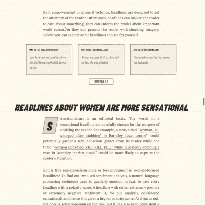
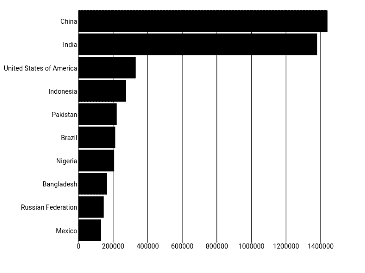
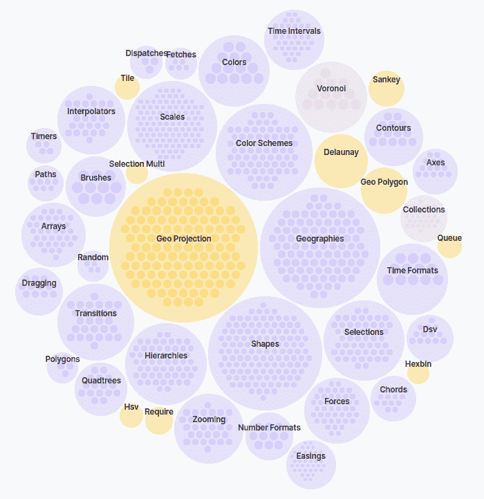
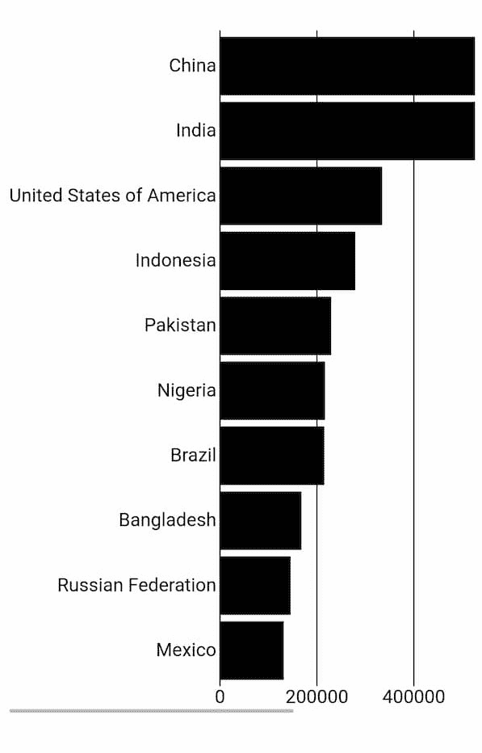
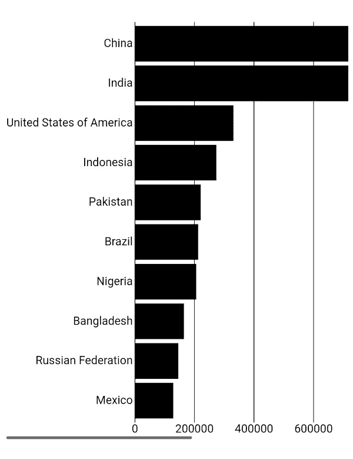
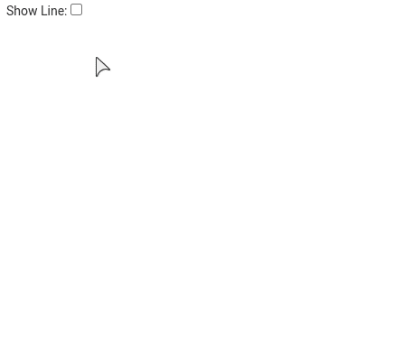
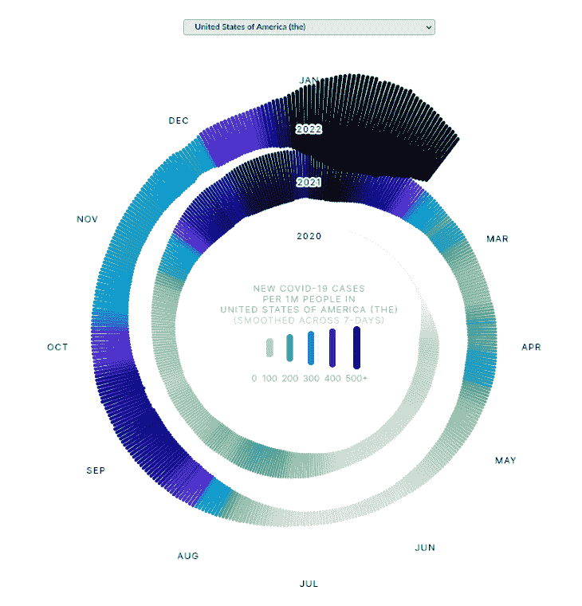
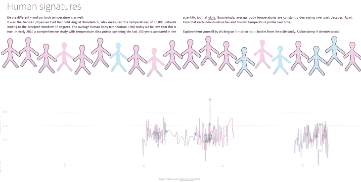
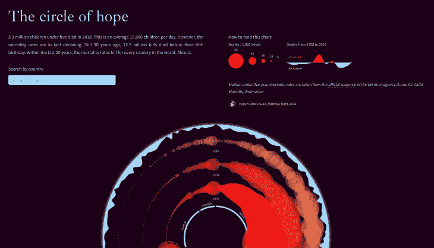

# 用 Svelte 和 D3 实现数据可视化

> 原文：<https://blog.logrocket.com/data-visualization-svelte-d3/>

## 目录

在数据可视化领域，许多人现在采用混合方法编写代码。他们使用一个 UI 库/框架，比如 [React](https://reactjs.org/) 来以一种反应式的、声明式的编码风格处理状态和 DOM 操作。

开发人员使用 [D3](https://d3js.org/) 进行可视化的布局和设计，这遵循一种强制性的编码风格。这种混合方法利用了两个库的优势来生成更易于维护和阅读的代码。

## 为什么要用 Svelte？

近年来，数据可视化(data viz)出现了向[svelet](https://svelte.dev/)的迁移——主要出版物现在使用 svelet 来制作他们的数据驱动的可视化故事。

[The Pudding](https://pudding.cool/) 是一家数字出版物，撰写关于流行文化和热门话题的视觉文章，他们的[最新文章是当今如何使用数据可视化和图形的一个很好的例子](https://pudding.cool/2022/02/women-in-headlines/)。请注意，当您浏览故事时，故事如何使用基于滚动的过渡来呈现与文本相关的图形，使其更具沉浸感和信息量。



[布丁](https://pudding.cool/author/russell-goldenberg/)乐队[的 Russell Goldenberg](https://pudding.cool/) 最近在[的一集博客播客](https://changelog.com/jsparty/193)中谈到了她们向苗条身材的转变:

> 我想我已经让团队中的一些人变得苗条了。这对我们的工作来说意义重大。我发现它特别适合处理数据可视化……当我们的团队中有很多不同层次的工程人员时，这真的很棒。这是我发现的唯一一个实际上适用于所有级别的框架，因为这是一个非常容易上手的学习曲线。

这种迁移是有意义的，因为 Svelte 是由《纽约时报》的前图形编辑 Rich Harris 创作的。他身材苗条的一个原因是让他的日常工作更容易。

因此，在创建框架时，数据即关注点是最初的考虑因素，这使得它更适合进行数据可视化。

## 数据的先决条件，即 Svelte 和 D3

这不是一个 Svelte 或 D3 的初学者指南。假设你知道这两者的基本知识。如果你是新手，你可以尝试以下资源:

*   如果你是一个苗条的新手，你可以去官方教程。这是一个交互式教程，涵盖了苗条语法的全部内容
*   要开始使用 D3，请查看由 Amelia Wattenberger 撰写的多部分教程[，它写得很好，有很好的视觉辅助来演示 D3 的关键概念](https://wattenberger.com/blog/d3)

## 什么是声明式与命令式数据可视化代码？

命令式代码是我们为每一步编写代码以获得预期结果的地方，而声明式代码则表达了我们想要的结果。例如，在我们的数据 viz 代码中，我们可能想要创建一个 SVG 并设置它的维度。使用 D3，我们这样做:

```
//d3-example.js
const width = 800;
const height = 600;

const svg = d3
  .select("#chart")
  .append("svg")
  .attr("width", width)
  .attr("height", height);

```

在细长，我们写下如下:

```
<!-- Example.svelte -->
<script>
    const width = 800;
    const height = 600;
</script>

<svg {width} {height}></svg>

```

我们将使用 Svelte 来声明 HTML 和 SVG，并将数据绑定到它。对于元素的布局，我们将在一个苗条的组件中使用 D3。

在我们继续之前，你可能想知道为什么你会用 Svelte over React 来表示数据。原因如下。

## 为什么用 Svelte 而不是 React？

虽然你可以用这两个框架完成同样的事情，但是它们在理念和风格上是完全不同的。让我们来看看主要的区别。

首先，在浏览器中可视化数据时，最好使用 SVG 元素，因为它们比 HTML 更具表现力。具体来说，我们应该对一个圆使用`circle` SVG 元素，而不是使用`border-radius: 50%`样式的`div`。因为纤巧的组件被设计为在标记之上工作，所以在使用 SVG 时，您只需编写较少的样板代码。

其次，React 使用虚拟 DOM (VDOM)，而 Svelte 使用 DOM。Svelte 的运行时开销比 React 小，因为它不在内存中保存状态快照。因为 Svelte 是一个编译器，它在构建时就知道应用程序中的事情是如何变化的，而不是等到运行时再做。在浏览器中操作数据集时，这种节省可以显著提高性能。

接下来，Svelte 在编译时执行树抖动，并且只在包中包含它需要运行的代码，从而减小包的大小。React 是一个完整的库，您可以将它作为运行时依赖项包含进来。

此外，在数据可视化中经常使用转换和动画来显示状态变化和突出数据之间的相关性。从版本 3 开始，Svelte 已经内置了对[过渡](https://svelte.dev/docs#svelte_transition)和[动画](https://svelte.dev/docs#svelte_animate)的支持。使用 Svelte，如果你的应用程序中没有自定义的过渡或动画，它就不会进入捆绑代码。有了 React，你可以选择包含一个附加库，比如 [React 转换组](http://reactcommunity.org/react-transition-group/)，来为你做这件事。虽然 D3 有一个[模块用于转换](https://github.com/d3/d3-transition)，但是最好让 UI 框架来处理它。

最后，Svelte 消除了在 JavaScript 之上构建组件的框架可能遇到的一些约束。你可以用 Svelte 写更地道的 JavaScript，这样可以更容易和 D3 等其他库集成。正如里奇·哈里斯所说:

> 因为我们没有被 JavaScript 的特性所束缚，所以我们可以设计一个组件创作体验，而不是让它适应语言的语义。矛盾的是，这导致了更惯用的代码——例如，自然地使用变量，而不是通过代理或钩子——同时交付明显更高性能的应用。

如果你有 React 的经验，我们可以通过明智的决策来减轻不利因素，但我认为“免费”获得这些好处足以成为考虑苗条的理由。了解这些差异和限制对于为您的项目做出最佳决策非常重要。

现在我们已经对为什么可以一起使用 Svelte 和 D3 有了一个总体的了解，让我们展示如何构建数据可视化。

## 用 Svelte 创建条形图

我将使用苗条的 REPL，苗条的基本代码游乐场。让我们从一个相对简单的例子开始:一个代码最少的条形图。请记住，如果您只需要创建一个条形图，有更简单和更有效的方法来完成它( [Charts.css](https://chartscss.org/docs/) 是一个仅使用 css 的解决方案)。当您想要完全控制一个图表或者想要创建一个定制的数据可视化时，D3 会大放异彩。

我会创建一个横条图，显示 2019 年人口最多的前十个国家，如下图。这里有一个链接，链接到苗条的 REPL 的例子。



为了简单起见，我不会添加 CSS(因此看起来有些无聊)，并且我会固定图表的大小。

我们将使用来自联合国世界人口展望的人口数据。我会把 2019 年的人口数据放在一个名为`2019.js`的单独文件里。

```
// 2019.js
export default [
    { country: "China", population: 1439324 },
    { country: "India", population: 1380004 },
    { country: "United States of America", population: 331003 },
    { country: "Indonesia", population: 273524 },
    { country: "Pakistan", population: 220892 },
    { country: "Brazil", population: 212559 },
    { country: "Nigeria", population: 206140 },
    { country: "Bangladesh", population: 164689 },
    { country: "Russian Federation", population: 145934 },
    { country: "Mexico", population: 128933 },
]

```

我们将创建一个`BarChart`组件，将这些数据显示为水平条形图。

### `App.svelte`

在`App.svelte`中，我们使用我们的`BarChart`组件，并将我们的数据作为道具传递。我们用简短的简写来表示`data`道具。如果一个道具名和值名相同，可以把道具写成`{data}`而不是`data={data}`。

```
<script>
  import data from "./2019.js";
  import BarChart from "./BarChart.svelte";
</script>

<BarChart {data} />

```

### `BarChart.svelte`

我们想要创建一个具有`data`属性的`BarChart`组件。

```
<script>
  import { scaleBand, scaleLinear } from "d3-scale";

  export let data;

  const width = 800;
  const height = 600;

  const margin = { top: 20, right: 20, bottom: 20, left: 180 };
  const innerHeight = height - margin.top - margin.bottom;
  const innerWidth = width - margin.left - margin.right;

  $: xDomain = data.map((d) => d.country);
  $: yDomain = data.map((d) => +d.population);

  $: yScale = scaleBand().domain(xDomain).range([0, innerHeight]).padding(0.1);
  $: xScale = scaleLinear()
    .domain([0, Math.max.apply(null, yDomain)])
    .range([0, innerWidth]);
</script>

<svg {width} {height}>
  <g transform={`translate(${margin.left},${margin.top})`}>
    {#each xScale.ticks() as tickValue}
      <g transform={`translate(${xScale(tickValue)},0)`}>
        <line y2={innerHeight} stroke="black" />
        <text text-anchor="middle" dy=".71em" y={innerHeight + 3}>
          {tickValue}
        </text>
      </g>
    {/each}
    {#each data as d}
      <text
        text-anchor="end"
        x="-3"
        dy=".32em"
        y={yScale(d.country) + yScale.bandwidth() / 2}
      >
        {d.country}
      </text>
      <rect
        x="0"
        y={yScale(d.country)}
        width={xScale(d.population)}
        height={yScale.bandwidth()}
      />
    {/each}
  </g>
</svg>

```

D3 采用模块化设计，所以您只需要包含您需要的模块——为您的用户节省额外的千字节 JavaScript 代码！在我们的例子中，我们需要 [d3-scale](https://www.npmjs.com/package/d3-scale) 模块(下图中的 scales)将我们的数据值映射到我们的条形图的刻度和条的像素。



Bubble chart of D3 modules (source: [https://wattenberger.com/blog/d3](https://wattenberger.com/blog/d3))

您可以使用[标准 ESM 语法](https://developer.mozilla.org/en-US/docs/Web/JavaScript/Reference/Statements/import)导入和使用 D3 模块。在这里，苗条的 REPL 为我下载模块。如果您想将它包含在您的项目中，您可以使用您喜欢的包管理器(如 npm)下载它。

接下来，我们宣布我们的`data`道具。在 Svelte 中，props 是用`export`关键字声明的，后面是变量声明。通过省略缺省值，我们强制提供了 prop。我们要数据！😀

```
export let data;

```

接下来，编写一些代码来设置维度的变量，并创建我们自己的比例函数，以便于将数据值映射到位置。注意这段代码和普通的 D3 代码是一样的，但是有一个例外:对于我们的一些变量，我们在它们前面加了一个美元符号来告诉 Svelte 编译器这些语句是反应性的。

任何时候有新的值传递给`data`属性，我们都希望重新计算我们的棒线和轴，并且通过将这些语句标记为反应性的，当任何因变量改变时，它们将被重新评估。

现在，我们手工创建我们的 SVG。我们声明我们需要的每个 SVG 元素，并在 SVG 元素的属性中使用尺度函数来设置需要的位置和维度。我们使用一个`each`块来遍历我们的`data`数组，以创建 Y 轴的刻度和每个条形的矩形。

在不到 50 行代码中，您得到了一个可读的、可重用的条形图组件。当然，它可以改进和风格，但我会留给你！

### 将 Svelte 和 D3 实现与其他实现进行比较

如果您很好奇，想要并排比较代码，您可以在这里找到实例:

## 调整不同屏幕尺寸的可视化效果

您可能希望调整可视化的大小，以充分利用屏幕空间。如果您的数据可视化是基于 SVG 的，那么您通常可以避免显式地调整大小，因为 SVG 具有内在的可伸缩性。使用 [Canvas API](https://developer.mozilla.org/en-US/docs/Web/API/Canvas_API) ，您需要显式地调整(重画)元素的大小。

回到我们之前的例子，我们希望条形图有一个最大和最小的宽度。我们可能希望它在更大的屏幕上放大，但我们不希望它在移动屏幕上缩小，因为它会太挤了。

如果条形图不能完全显示在屏幕上，最好给它一个最小宽度，并使它可以水平滚动，如下图所示。



[这是调整后的示例](https://svelte.dev/repl/fdab64f844354472960a548238b5f32e?version=3.46.4)，允许条形图的宽度从`600px`变化到`1200px`:

```
<!-- App.svelte -->
<script>
  import data from "./2019.js";
  import BarChart from "./BarChart.svelte";
</script>

<div class="container">
  <BarChart {data} />
</div>

<style>
   :global(.chart) {
      width: 100%;
      min-width: 600px;
      max-width: 1200px;
    }

  .container {
    overflow-x: auto;
  }
</style>

```

我们在`BarChart`组件上设置了`width`、`min-width`和`max-width`，并在`chart`类上设置了全局样式。我们将`BarChart`包装在一个包含`div`的中，我们设置`overflow-x:auto`仅在必要时添加水平滚动条(当屏幕宽度小于 600px 时)。

关于 SVG 的高度只需注意一点:在这种情况下，`height`固定在`600px`，这很好，因为我们希望 X 轴总是可见的。高度是固定的，因为我们在 SVG 上设置了`height`属性，并且没有在 CSS 中设置任何与高度相关的属性。

如果您希望 SVG 根据纵横比缩放，可以使用`viewBox`和`preserveAspectRatio`属性。当有一个`viewBox`时，`preserveAspectRatio`描述了如果`viewBox`的纵横比与视口的纵横比不匹配，SVG 应该如何缩放。

大多数情况下，默认行为工作得相当好:图像被缩放，直到它正好适合高度和宽度，并且它在任何额外的空间内居中。如果您完全省略该属性，这将是默认设置。

```
<!-- BarChart.svelte -->
<script>
  import { scaleBand, scaleLinear } from "d3-scale";

 //same code as before
</script>

<svg viewBox={`0 0 ${width} ${height}`}>
  <!--code omitted for brevity-->
</svg>

```

如果您像上面一样单独使用`viewBox`，它会被缩小，以便您可以看到更多的条形图:



通常情况下，`viewBox`默认提供一个更好的结果。我推荐阅读[这篇文章](https://css-tricks.com/scale-svg/)来了解这个话题。

如果您希望根据特定元素的维度来调整可视化元素的大小，Svelte 提供了一些方便的内置维度绑定。以下绑定可用于每个块级元素:`clientWidth`、`clientHeight`、`offsetWidth`和`offsetHeight`。

这些绑定是只读的，所以您只能在其他语句中使用它们作为输入。这些都是昂贵的操作，所以不要经常使用。

## 添加苗条的过渡

由于状态变化，元素进入或离开 DOM 时会触发转换。

[Svelte 提供了七个过渡函数](https://blog.logrocket.com/essential-transitions-and-animations-in-svelte/) : `fade`、`blur`、`fly`、`slide`、`scale`、`draw`和`crossfade`。要使用这些函数，您需要从`svelte/transition`模块中导入它们，并且可以通过`transition`指令将它们添加到元素中。语法是`transition:fn={params}`，参数可选。

```
<p transition:fade>Fades in and out</p>

```

在具有可选属性的对象中传递参数:`duration`、`easing`和`delay`。

让我们看一个简单的折线图示例。假设我们想使用`draw`转换在两秒钟内画线。



我们需要将`transition:draw={{duration: 2000}}`添加到`path`元素中。

```
<script>
   import { draw } from 'svelte/transition';

   // props
   export let data;
   export let show;

  //other code
</script>

<svg viewBox="0 0 100 100">
   {#if (show)}
    <path transition:draw={{duration: 2000}} d={pathLine(data)} />
   {/if}
</svg>

```

这是完整的例子。

转场是可逆的，如果您在转场正在进行时切换复选框，它将从当前点转场，而不是从起点或终点转场。

默认情况下，过渡不会在第一次渲染时播放。因此，如果您在本例中删除了`if`块，那么当页面加载时，您将看不到转换。当您[创建一个组件](https://svelte.dev/docs#run-time-client-side-component-api)时，您可以通过将初始化选项`intro`设置为`true`来改变这种行为，如下所示。

```
//main.js
import App from "./App.svelte";

const app = new App({
  target: document.getElementById("app"),
  intro: true,
});

export default app;

```

通过数据可视化，您可以控制何时通过`in`指令添加元素，以及何时通过`out`指令删除元素。因此，您可以创建更细微的过渡。

这里有一个[的例子，当数据集改变时，使用转换来移动条形图中的条形](https://svelte.dev/repl/fc633d59c07a4020937a5862e7b91438?version=3.32.3)。通过将属性`out:slide="{{duration: 1000}}"`添加到`rect`元素，我们得到以下效果:


很酷吧。

你可以做更多的事情，甚至让你的[自己定制过渡](https://css-tricks.com/making-your-first-custom-svelte-transition/)。

## 数据的高级示例，即 Svelte 和 D3

我发现通过探索完整的例子，我学到了最多的东西。你也一样，可能更喜欢把你的牙齿直接咬进肉的例子里！

Amelia Wattenberger 分享了一些苗条的数据，即食谱，这些数据大多是完整的例子，而且尺寸很大。这是一个很好的[螺旋图](https://svelte.recipes/components/spiral/)的例子，展示了不同国家 covid 病例随时间变化的趋势。



阿米莉亚最近还出现在《Frontend Horse》的一集里，她用超级英雄的数据为亚历克斯·特罗斯特的超级恶棍公关公司网站制作了一个图表。

此外，[马蒂亚斯·斯塔尔](https://www.higsch.com/)有[关于苗条和 D3 的信息性演讲，](https://www.youtube.com/watch?v=bnd64ZrHC0U)他展示了是什么让苗条和 D3 如此适合数据可视化。他在演讲中举了一些先进的例子，包括:

[人体特征](https://higsch.github.io/body-temp/) ( [代码](https://github.com/higsch/body-temp/tree/master/app-svelty)):基于对过去 150 年间人体体温数据的综合研究，这一可视化显示了一组男性和女性的平均体温曲线。你可以点击尸体，以线形图的形式查看它们一生的温度。



[儿童死亡率](https://higsch.github.io/childhood-mortality/) ( [代码](https://github.com/higsch/childhood-mortality)):这个可视化展示了 5 岁以下儿童的死亡率是如何下降的。它以交错圆圈的重复同心圆模式显示了每个国家过去 20 年的死亡率，显示了不同年份的数值大小。您可以将鼠标悬停在各段上以突出显示特定国家的数据。Matthias 使用`canvas`进行数据密集型的可视化，SVG 用于较小的附带图表。这是如何优化更复杂的数据可视化的一个很好的例子。



## 结论

我希望我已经展示了一起使用 Svelte 和 D3 进行数据可视化的优势。它产生了开发人员已经习惯的更多声明性代码和组件化代码，但没有牺牲性能。

我在这里给出了一个可靠的介绍，并提供了更多的例子来帮助您创建更复杂的自定义数据可视化。玩的开心点，把一些数据做的漂亮点！🌈📊

## 使用 [LogRocket](https://lp.logrocket.com/blg/signup) 消除传统错误报告的干扰

[](https://lp.logrocket.com/blg/signup)

[LogRocket](https://lp.logrocket.com/blg/signup) 是一个数字体验分析解决方案，它可以保护您免受数百个假阳性错误警报的影响，只针对几个真正重要的项目。LogRocket 会告诉您应用程序中实际影响用户的最具影响力的 bug 和 UX 问题。

然后，使用具有深层技术遥测的会话重放来确切地查看用户看到了什么以及是什么导致了问题，就像你在他们身后看一样。

LogRocket 自动聚合客户端错误、JS 异常、前端性能指标和用户交互。然后 LogRocket 使用机器学习来告诉你哪些问题正在影响大多数用户，并提供你需要修复它的上下文。

关注重要的 bug—[今天就试试 LogRocket】。](https://lp.logrocket.com/blg/signup-issue-free)