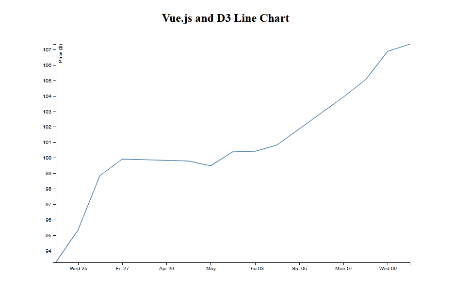

# 用 Vue.js 和 D3 实现数据可视化

> 原文：<https://blog.logrocket.com/data-visualization-vue-js-d3/>

***编者按:**这篇文章最后一次更新是在 2022 年 7 月 6 日，包含了关于 Vue 和 D3 最新版本的信息。*

在过去的两年里，我们已经看到了很多数据可视化回答了关于新冠肺炎的问题。这些可视化通过给我们提供关于特定位置的病例数的重要信息，帮助我们所有人变得更安全。

数据可视化帮助我们更好地理解数字。视觉帮助人类大脑更快地感知信息，而不是进行复杂的计算。另外，它们看起来和玩起来比一个充满数字的电子表格有趣得多。

为了演示，在本文中我们将使用 [D3.js](https://d3js.org/) 和 Vue.js 来创建一个折线图，这样您就可以看到 D3 和 Vue 在构建数据可视化时是多么有用。

### 内容

## D3.js 是什么？

D3 是一个开源的 JavaScript 库，用于在 web 浏览器中创建交互式数据可视化。D3 可以用来操作 DOM 对象和 HTML、SVG 或 Canvas 元素来可视化数据。D3.js 可以控制数据的显示方式，并让我们增加交互性。

## 为什么要用 D3.js？

目前有许多 JS 库用于数据可视化。一些库用于创建 3D 视觉效果，如 [three.js](https://blog.logrocket.com/creating-game-three-js/) 和 Babylon.js，还有一些是多用途的，如 [HighCharts](https://www.highcharts.com/) 和 [Recharts](https://recharts.org/en-US/) 。

然而，D3 是可用的最健壮和最广泛的 JavaScript 数据可视化库之一。在 GitHub 上有超过 102k 的星星，D3 是领先的数据可视化 JavaScript 库。

根据[官方文件](https://d3js.org/):

> D3 帮助您使用 HTML、SVG 和 CSS 将数据变得生动。D3 对 web 标准的重视使您可以获得现代浏览器的全部功能，而无需将自己束缚于专有框架，将强大的可视化组件和数据驱动的 DOM 操作方法结合起来。

有数百个例子可供参考和学习。从简单的[条形图](https://bl.ocks.org/d3noob/8952219)到更复杂的[弦图](https://observablehq.com/@d3/directed-chord-diagram)可视化国家之间的债务，你可以用 D3 让任何事情变得生动起来。

除了是创建视觉效果的强大工具，D3 还有一个巨大的开源社区。如果你有一个图形的想法，有可能某个地方的某个人已经创造了类似的东西，并且写了关于它的文章。或者，如果你在创建工具提示或动画方面停滞不前，那么很有可能 StackOverflow 会给你一个答案。底线是你永远不会孤单。

## 入门指南

我们首先在终端中运行以下命令来创建一个新的 Vue 应用程序:

```
npm init [email protected]

```

接下来，导航到项目目录并安装必要的依赖项:

```
cd vue-project
npm install

```

我们将使用 D3，所以我们可以这样安装它:

```
npm i d3

```

## 用 D3.js 构建折线图

现在我们了解了 D3 是什么，让我们通过创建折线图来学习如何使用它。

首先要做的是定义我们将在其中呈现图表的 HTML 模板。对于本文，我们将使用一个 SVG:

```
<template>
  <div>
    <h2>Vue.js and D3 Line Chart</h2>
    <svg></svg>
  </div>
</template>

```

接下来，我们定义要在图表上显示的数据。我们将在本演示中使用虚拟数据，但在实际应用中，我们最有可能使用实时数据，例如注册应用的用户数量、一个月的降雨量或企业的季度利润:

```
<script>
  const data = [
    { date: "24-Apr-07", amount: 93.24 },
    { date: "25-Apr-07", amount: 95.35 },
    { date: "26-Apr-07", amount: 98.84 },
    { date: "27-Apr-07", amount: 99.92 },
    { date: "30-Apr-07", amount: 99.8 },
    { date: "1-May-07", amount: 99.47 },
    { date: "2-May-07", amount: 100.39 },
    { date: "3-May-07", amount: 100.4 },
    { date: "4-May-07", amount: 100.81 },
    { date: "7-May-07", amount: 103.92 },
    { date: "8-May-07", amount: 105.06 },
    { date: "9-May-07", amount: 106.88 },
    { date: "10-May-07", amount: 107.34 },
  ];
<script/>

```

这里的数据是一个对象数组，每个对象都有`date`和`key`。

### 创建图表

让我们从示例图表开始

首先，选择我们将安装图表的元素:

```
<script>
  import * as d3 from 'd3'

  data = [//the chart data we defined earlier]

  mounted(){
    const width = 800;
    const height = 500;
    const svg = d3.select("svg").attr("width", width).attr("height", height);
    const g = svg.append("g");
  }
<script/>

```

在上面的代码中，我们从 D3 库中导入了`d3`,并定义了图表的宽度和高度。然后，我们使用`d3.select()`方法选择我们之前定义的 SVG 元素，并将其存储为一个名为`svg`的常量。这个 *方法将选择 DOM 中第一个匹配的元素(从上到下)。*

 *接下来，我们使用 D3 的`attr()`方法将`width`和`height`属性添加到`svg`，然后将 SVG 组元素`g`添加到`svg`。SVG `<g>`元素是一个用于对其他 SVG 元素进行分组的容器。

我们的下一步是将日期从字符串数据解析为 JavaScript 日期对象。

目前，我们的`data`数组中的日期是字符串格式的。我们需要将它们转换成表示单个时间点的 JavaScript date 对象。D3 有一个 [d3-time-format](https://github.com/d3/d3-time-format) 模块，包含几个解析和格式化日期的方法:

```
const parseTime = d3.timeParse("%d-%b-%y");

```

### 创建图表轴

我们希望在 x 轴上绘制日期，在 y 轴上绘制金额。

D3 有一个 [d3-scale](https://github.com/d3/d3-scale) 模块，我们将使用它将数据值转换成像素。标度是在两个域之间转换值的函数。D3 标度用于将数据值转换成可视变量。

D3 秤需要两条信息:域和范围。简单来说，域就是我们给的输入，范围就是我们想要的输出:

```
const x = d3
      .scaleTime()
      .domain(
        d3.extent(data, function (d) {
          return parseTime(d.date);
        })
      )
      .rangeRound([0, width]);

const y = d3
      .scaleLinear()
      .domain(
        d3.extent(data, function (d) {
          return d.amount;
        })
      )
      .rangeRound([height, 0]);

```

在这里，我们执行以下操作:

我们在 x 轴上使用了`d3.scaleTime()`刻度，因为我们正在处理日期对象，这是知道如何处理日期对象的刻度。然后，我们在 y 轴上使用了`d3.scaleLinear()`刻度，因为 y 轴上的值是线性增加的数字。

### 创建线

D3 提供了一个 [d3-shape](https://github.com/d3/d3-shape) 模块，我们可以用它来创建复杂的形状，比如符号、线条和弧线。我们正在创建一个折线图，所以我们将使用`d3.line()`方法。

`d3.line()`方法创建一个遵循一系列点的形状:

```
const line = d3.line()
  .x(function (d) {
    return x(parseTime(d.date));
  })
  .y(function (d) {
    return y(d.amount);
  });

```

这里，我们通过传入匿名函数并返回 date 对象和对应于每个日期的金额来定义该行的 x 轴和 y 轴属性。

### 将轴追加到图表

现在，我们需要将 x 轴和 y 轴连接到图表，如下所示:

```
 g.append("g")
      .attr("transform", "translate(0," + height + ")")
      .call(d3.axisBottom(x));

    g.append("g")
      .call(d3.axisLeft(y))
      .append("text")
      .attr("fill", "#000")
      .attr("transform", "rotate(-90)")
      .attr("y", 6)
      .attr("dy", "0.71em")
      .attr("text-anchor", "end")
      .text("Price ($)");

```

对于 x 轴，我们调用`d3.axisBottom()`，因为我们需要在画布的底部对齐它。对于 y 轴，我们调用`d3.axisLeft()`,因为我们想让它在画布的左边对齐。

### 向图表追加路径

最后，我们向图表添加一个路径。这个路径实际上会根据数据的值绘制折线图:

```
g.append("path")
      .datum(data)
      .attr("fill", "none")
      .attr("stroke", "steelblue")
      .attr("stroke-width", 1.5)
      .attr("d", line);

```

在这里，我们执行以下操作:

*   使用`datum`方法传递`data`数组
*   设置填充颜色、线条颜色和线条宽度的属性
*   设置`d`的属性，该属性为 SVG 路径提供关于在何处连接路径点的指令

这样，我们看到浏览器中出现了折线图。



下面是折线图的最终代码:

```
<template>
  <div>
    <h2>Vue.js and D3 Line Chart</h2>
    <svg></svg>
  </div>
</template>
<script>
import * as d3 from "d3";
export default {
  data() {
    return {};
  },
  mounted() {
    const width = 800;
    const height = 500;
    const data = [];

    const svg = d3.select("svg").attr("width", width).attr("height", height);
    const g = svg.append("g");

    //2\. Parse the dates
    const parseTime = d3.timeParse("%d-%b-%y");

    //3\. Creating the Chart Axes
    const x = d3
      .scaleTime()
      .domain(
        d3.extent(data, function (d) {
          return parseTime(d.date);
        })
      )
      .rangeRound([0, width]);

    const y = d3
      .scaleLinear()
      .domain(
        d3.extent(data, function (d) {
          return d.amount;
        })
      )
      .rangeRound([height, 0]);

    //4\. Creating a Line
    const line = d3
      .line()
      .x(function (d) {
        return x(parseTime(d.date));
      })
      .y(function (d) {
        return y(d.amount);
      });

    //5\. Appending the Axes to the Chart
    g.append("g")
      .attr("transform", "translate(0," + height + ")")
      .call(d3.axisBottom(x));

    g.append("g")
      .call(d3.axisLeft(y))
      .append("text")
      .attr("fill", "#000")
      .attr("transform", "rotate(-90)")
      .attr("y", 6)
      .attr("dy", "0.71em")
      .attr("text-anchor", "end")
      .text("Price ($)");    

    //6\. Appending a path to the Chart
    g.append("path")
      .datum(data)
      .attr("fill", "none")
      .attr("stroke", "steelblue")
      .attr("stroke-width", 1.5)
      .attr("d", line);
  },
};
</script>

```

## 结论

D3 是一个庞大的库，尽管我们涵盖了很多，但这只是基础。我们可以使用 D3 创建不同种类的图表。通过 [Observable](https://observablehq.com/@d3) 这样的平台去看一些例子，获得灵感。

## 像用户一样体验您的 Vue 应用

调试 Vue.js 应用程序可能会很困难，尤其是当用户会话期间有几十个(如果不是几百个)突变时。如果您对监视和跟踪生产中所有用户的 Vue 突变感兴趣，

[try LogRocket](https://lp.logrocket.com/blg/vue-signup)

.

[](https://lp.logrocket.com/blg/vue-signup)[https://logrocket.com/signup/](https://lp.logrocket.com/blg/vue-signup)

LogRocket 就像是网络和移动应用程序的 DVR，记录你的 Vue 应用程序中发生的一切，包括网络请求、JavaScript 错误、性能问题等等。您可以汇总并报告问题发生时应用程序的状态，而不是猜测问题发生的原因。

LogRocket Vuex 插件将 Vuex 突变记录到 LogRocket 控制台，为您提供导致错误的环境，以及出现问题时应用程序的状态。

现代化您调试 Vue 应用的方式- [开始免费监控](https://lp.logrocket.com/blg/vue-signup)。*