# 如何调试 React Native 中的加密网络流量

> 原文：<https://blog.logrocket.com/debug-encrypted-network-traffic-react-native/>

尽管它有可能为用户提供最好的 UX，但原生开发 iOS 和 Android 应用通常不是 JavaScript 开发人员的选择。这就是 React Native 发挥作用的地方。

React 本机应用程序代码可以通过 inspector、profiler 和远程调试器进行分析，所有这些都可以通过[应用内开发菜单](https://reactnative.dev/docs/debugging)进行访问。你可以把它和独立的 [React 开发者工具](https://reactnative.dev/docs/debugging#react-developer-tools)结合起来。然而，与本机开发相比，这种方法在调试网络通信方面有其局限性。

本文涵盖了 React Native 的其他工具，这些工具支持 React Native 开发工具所不提供的调试功能。重点是检查和重写应用程序和服务器之间的网络流量。

在本文结束时，您将了解到，根据所选择的开发方法，为 Android 应用程序调试网络流量有其局限性，例如 Expo 管理的工作流、从 Expo 管理的方法中退出或 React Native CLI。

本文描述了方便的本地代理工具 [Charles Proxy](https://www.charlesproxy.com/) 、 [HTTP Toolkit](https://httptoolkit.tech/) 和 [Proxyman](https://proxyman.io/) 。为了调试 iOS 的加密网络流量，我介绍了 Proxyman 和 Charles Proxy，对于 Android，我介绍了 HTTP Toolkit 和 Proxyman(我跳过了 Charles Proxy，尽管它受支持)。

我的目标不是用每种工具涵盖每种可能的用例，而是用不同的工具向您展示不同的场景，以免不必要地拖长文章。例如，我只讲述如何用 Proxyman 调试您连接的 iOS 工具的流量，而不是用 Charles Proxy(尽管这是可能的)。

此外，一些调试用例只能在真实设备上使用；因此，我将向您展示两个用于 iOS 和 Android 开发的便捷工具，以镜像您机器上的设备屏幕。这是远程结对编程会话中的救命稻草。

## 反应本地环境及其网络调试能力

开发一个 [React Native](https://reactnative.dev/) app 有几种方法。最常见的选项有:

1.  脸书推荐的默认方法用 [React Native CLI](https://github.com/react-native-community/cli)
2.  具有 [Expo](https://expo.io/) 的受管工作流，代表最低的初始障碍
3.  本机代码组件和用 React Native 编写的组件的混合方法

这三种方法之间有许多差异，但在调试网络流量方面，最重要的区别是您是否可以访问本机 Android 代码。

正如您将在后面看到的，要启用网络调试的所有功能，您需要在原生 Android 代码中定义一些安全设置。这对于选项 1 和 3 是可能的，但是对于选项 2 是不可能的——除非您[从受管理的工作流](https://docs.expo.io/bare/customizing/)中退出。

您检查 HTTPS 网络调用的能力归结为是否有可能在您的开发设置中用一个本地代理工具(如 Charles Proxy 或 Proxyman)建立一个 [HTTP(S)代理](https://stackoverflow.com/a/10442767/3116979)。他们安装 SSL 证书，使您能够查看加密的 HTTPS 内容。特别是对于 Android，这归结为你是否可以定制原生的[网络安全配置](https://developer.android.com/training/articles/security-config.html)。

下面是对加密请求和响应是否可以针对上述三个选项中的每一个进行检查的概述:

1.  iOS、Android
2.  iOS 但是如果被逐出管理工作流，Android 也一样
3.  iOS、Android

## 反应本地开发环境

对于那些不熟悉 React Native 的读者，下一节将简要介绍如何建立一个“纯”React Native 环境(上面的选项 1 和 2)。我不讨论混合方法(3 ),因为这超出了本文的范围。

### Expo 的托管工作流

Expo 是在紧要关头启动和运行一个基本的 React 原生应用程序的好方法。如果你不打算做混合应用项目，Expo 是个不错的选择。确保您可以用[现有的组件库](https://docs.expo.io/guides/userinterface/)实现您的所有需求。

```
$ npm install --global expo-cli [1] install expo cli globally
$ expo init react-native-sandbox [1] create a project 

```

第二个命令打开一个交互式菜单，从带有或不带有 TypeScript 的模板中进行选择。

目前，Expo 团队使用 Yarn 作为包管理器创建了一个项目，因此使用项目根文件夹中的以下命令来启动 [Metro](https://facebook.github.io/metro/) bundler:

```
$ yarn start

```

Metro bundler 应该会在您的默认浏览器中打开。

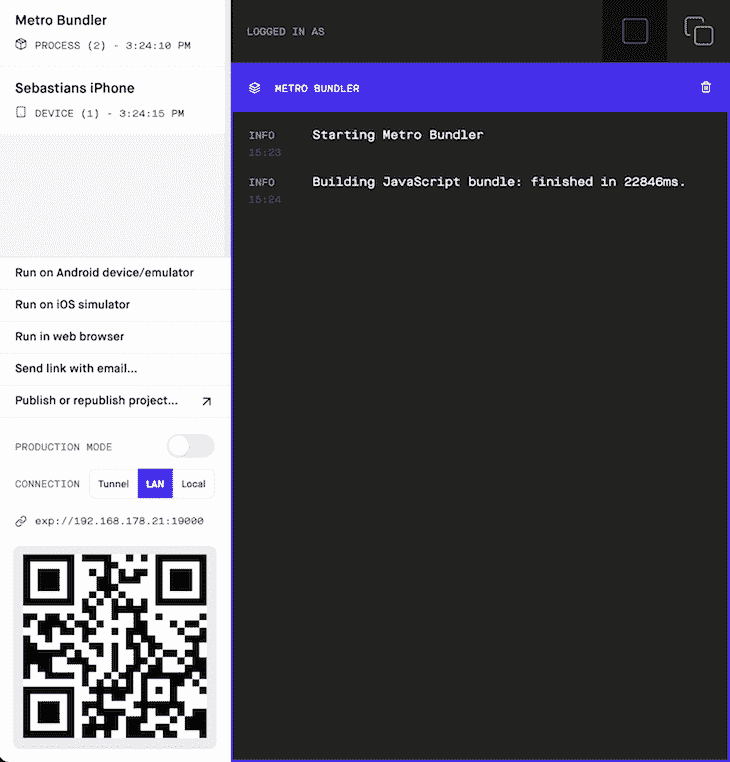

Expo scores with a good developer experience and intuitive workflow.

如你所见，Expo 凭借良好的开发者体验和直观的工作流程获得了高分。只需在您的移动设备上打开您的相机应用程序，扫描二维码，simsalabim 应用程序就会在您的设备上打开。

如果 Metro 崩溃，它[可能会帮助](https://forums.expo.io/t/error-emfile-too-many-open-files/35564)重新安装在引擎盖下使用的[守望者](https://facebook.github.io/watchman/)。

```
$ brew reinstall watchman

```

### 反应本机 CLI

公平地说，Expo 的托管方法可能不适合您的用例——比方说，如果您想合并本机模块。看一看世博会关于其局限性的文件。以下视频很好地概述了何时使用 Expo 或 React Native CLI:

 [https://www.youtube.com/embed/uHlAM4ICi1s?version=3&rel=1&showsearch=0&showinfo=1&iv_load_policy=1&fs=1&hl=en-US&autohide=2&wmode=transparent](https://www.youtube.com/embed/uHlAM4ICi1s?version=3&rel=1&showsearch=0&showinfo=1&iv_load_policy=1&fs=1&hl=en-US&autohide=2&wmode=transparent)

视频

在你可以[创建一个项目](https://github.com/react-native-community/cli#creating-a-new-react-native-project)之前，你需要[为 iOS 和 Android 设置你的开发环境](https://reactnative.dev/docs/environment-setup)。与 Expo 相比，您需要在初始设置上投入更多的时间，但是一旦完成，下面的命令将产生一个工作的初始项目。

对于 Android，你要么需要安装并运行一个模拟器，要么连接一个设备。iOS 稍微容易迎合一点；模拟器会自动打开。下一节将更详细地介绍如何设置它。

```
$ npx react-native init rnCliPlayground # init project
$ cd rnCliPlayground && npx react-native run-ios # start iOS app
$ cd rnCliPlayground && npx react-native run-android # start Android app 

```

与 Expo 相比，我的经验是，在安装过程中可能会出现更多问题，iOS 和 Android 运行的时间可能会更长。另一方面，React 本地团队的文档是有帮助的。也就是说，尽管如此，Expo 还是一如既往地开箱即用。

### 示例项目

本文剩余部分的例子总是指一个非常简单的 Expo 项目；我只是生成了如上所述的项目。唯一的变化是用下面的代码覆盖`App.js`，这将获取一个电影的 [JSON 数组:](https://reactnative.dev/movies.json)

```
import { StatusBar } from 'expo-status-bar';
import React, { useEffect, useState } from 'react';
import { StyleSheet, Text, View } from 'react-native';
export default function App() {
  const [movies, setMovies] = useState([])
  const [loading, setLoading] = useState(false);
  useEffect(() => {
      setLoading(true);
      const getMoviesFromApi = () => {
        return fetch('https://reactnative.dev/movies.json')
          .then((response) => {
            if (response.status < 400) {
              return response.json()
            }
            else {
              return {
                movies: []
              };
            }
          })
          .then((json) => {
            return json.movies;
          })
          .catch((error) => {
            return {
              movies: []
            };
          });
      };
      getMoviesFromApi().then(response => {
        setMovies(response)
        setLoading(false);
      });
  }, [])
  return (
    <View style={styles.container}>
      <StatusBar style="auto" />
      {loading && <Text>Loading...</Text>}
      {!loading && movies.length > 0 && movies.map(movie => 
        <Text key={movie.id}>{movie.title}</Text>
      )}
      {!loading && movies.length === 0 && <Text>no movies found</Text>}      
    </View>
  );
}
const styles = StyleSheet.create({
  container: {
    flex: 1,
    backgroundColor: '#fff',
    alignItems: 'center',
    justifyContent: 'center',
  },
});

```

## 设置 iOS 模拟器和 Android 模拟器

出于本文的目的，您需要使用 iOS 模拟器/Android 模拟器或真实设备。因此，你需要分别设置 Xcode 和 Android Studio。从 iOS 的角度来看，你只需要打开模拟器的能力，而对于 Android，你需要在代码中定制安全配置。

### Xcode

你可以从[developer.apple.com](https://developer.apple.com/download/more/)或者[应用商店](https://apps.apple.com/us/app/xcode/id497799835)下载并安装 Xcode。在世博 CLI 中，您可以按下 **i** 或点击世博浏览器界面中的**在 iOS 模拟器上运行** **链接。**您可以在模拟器中按下 **⌘ d** 打开应用内开发者菜单。

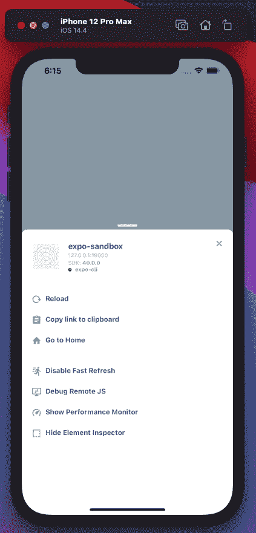

Expo app opened in Simulator.

### 安卓工作室

在你安装了 [Android Studio](https://developer.android.com/studio) 之后，你必须正确地[配置它](https://docs.expo.io/workflow/android-studio-emulator/)以在 Android 模拟器中打开你的 React 原生项目。使用以下命令启动 Expo 项目的 Metro bundler:

```
$ yarn start

```

托管工作流启动 Metro，并在浏览器和终端中打开开发人员工具。在终端中，你可以按下 **a** 在 Android 模拟器中打开你的 Expo 应用。您可以在 Expo CLI 或浏览器视图中点击在 Android 设备/模拟器上运行的**来完成此操作。**

**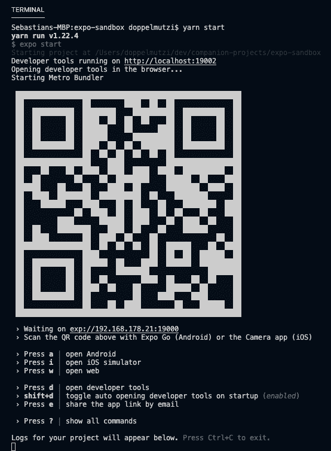

Output from the Expo CLI.

你可以用 **⌘ m** 打开应用内开发者菜单。

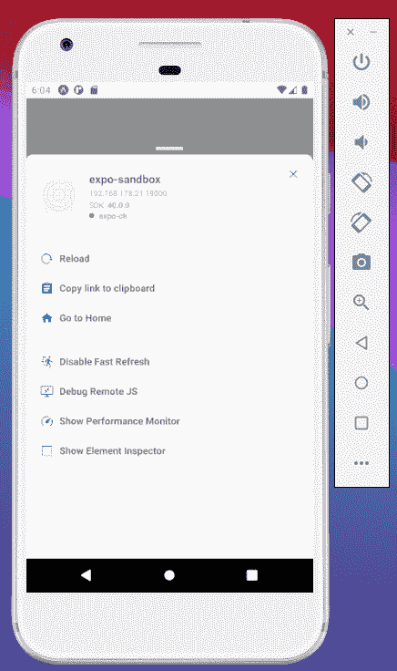

Expo app opened in Android Emulator.

## 促进远程协作的工具

有些开发用例无法使用 iOS 模拟器或 Android 模拟器，例如，使用不同的网络设置或飞行模式调试您的 iOS 应用程序。因此，您需要使用您的实际设备。

本节介绍了使用真实设备的便利工具，以方便调试真实设备。还有一些方法可以将您实际设备的屏幕镜像到您的开发机器上，这可以改善开发人员在远程结对编程场景中的体验。

### scrcpy 用于屏幕镜像和远程控制

scrcpy 是一个非常棒的 Android 开发工具，适用于所有主流操作系统。它镜像通过 USB 电缆连接到开发机器的设备的屏幕。

特别棒的是，移动设备还可以通过开发机器上的工具进行远程控制，而不是在设备上使用手势。如果您在视频会议中共享您的屏幕，以便其他人可以看到鼠标光标以了解您如何与镜像设备交互，这将非常方便。

用[自制软件](https://brew.sh/)安装 macOS 很简单。作为一个要求，你需要 [ADB (Android 调试桥)](https://stackoverflow.com/a/28208121)启动并运行。此外，你必须[在你的安卓设备上启用 USB 调试。](https://www.embarcadero.com/starthere/xe5/mobdevsetup/android/en/enabling_usb_debugging_on_an_android_device.html)

```
$ brew install scrcpy
$ brew install --cask android-platform-tools [1] install adb

```

为了让 scrcpy 与运行在您设备上的 React 本地应用程序一起工作，您需要用`[adb reverse](https://www.decoide.org/docs/react-native/running-on-device-android.html)`建立一个反向代理。

```
$ adb reverse tcp:8081 tcp:8081

```

### 屏幕镜像的 Quicktime

当您通过 USB 电缆将 iOS 设备连接到 Mac 时，您可以利用 [QuickTime Player](https://support.apple.com/en-gb/guide/quicktime-player/welcome/mac) 来镜像您的设备屏幕。你首先要信任你连接的 Mac，然后打开 QuickTime Player，开始新的电影录制( **⌥ ⌘ N** )。在红色录制按钮旁边，打开下拉菜单并从摄像机输入中选择您连接的设备。就是这样。

下面的截图显示了我如何从通过 USB 电缆连接到 MacBook 的 iPhone 上镜像我的 Expo 应用程序。

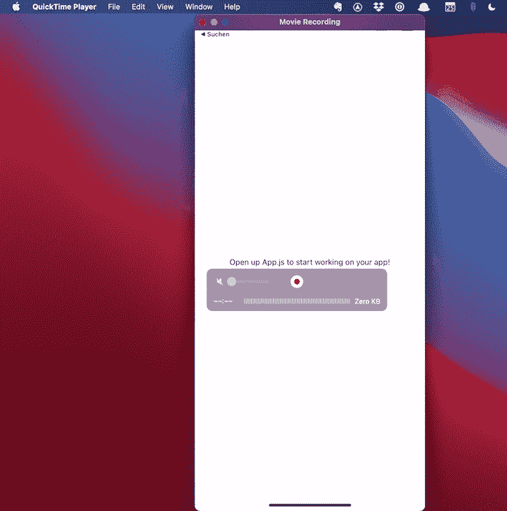

QuickTime can be used to mirror your device’s screen.

## 使用代理人检查网络流量

Proxyman 是一个 macOS 专用的代理工具，用于拦截、查看、调试和重写 iOS 和 Android 应用程序的 HTTP(S)网络流量。

### 使用在 iOS 模拟器和 iOS 设备上运行的 Expo 应用程序

为了检查加密的 HTTPS 信息，你必须[在你的机器上安装代理人 CA 证书](https://docs.proxyman.io/debug-devices/macos)。然后，只需从主菜单中选择**证书** > **在这台 Mac 上安装证书…** 即可打开证书对话框。点击**自动**选项卡中的安装按钮。

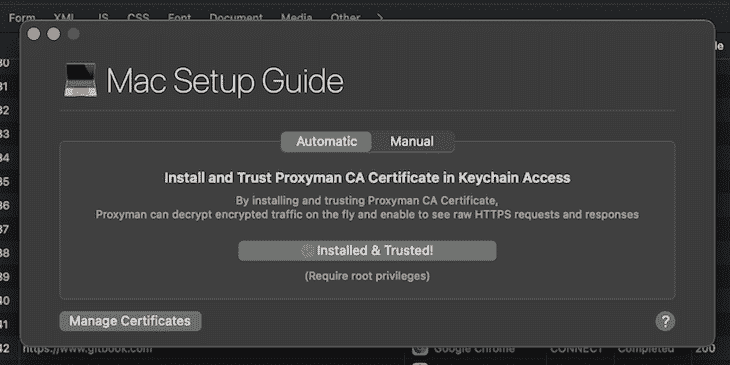

The root certificate is required to inspect HTTPS traffic

这是在 iOS 模拟器和设备上使用 Proxyman 的先决条件。

### 设置 iOS 模拟器

您需要执行一次性设置，在所有 iOS 模拟器上安装和信任证书。因此，通过选择**证书** > **在 iOS** > **模拟器上安装证书…** ，从主菜单中选择设置对话框。点击第 2 步和第 3 步的按钮，你就可以开始了。

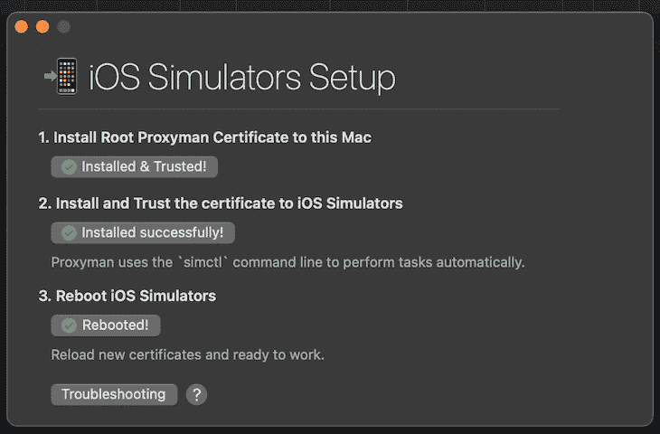

Installation of certificate on all iOS simulators.

我真正欣赏的是这个工具的可用性，尤其是针对不同场景的非常有用的交互式清单。

### 设置 iOS 设备

这一步类似，但需要在实际设备上做一些额外的工作。您需要通过 USB 电缆将 iOS 设备连接到 Mac。在继续之前，请确定它出现在 Finder 应用程序中。接下来，从主菜单打开证书对话框(**证书** > **在 iOS 上安装证书** > **物理设备……**)。

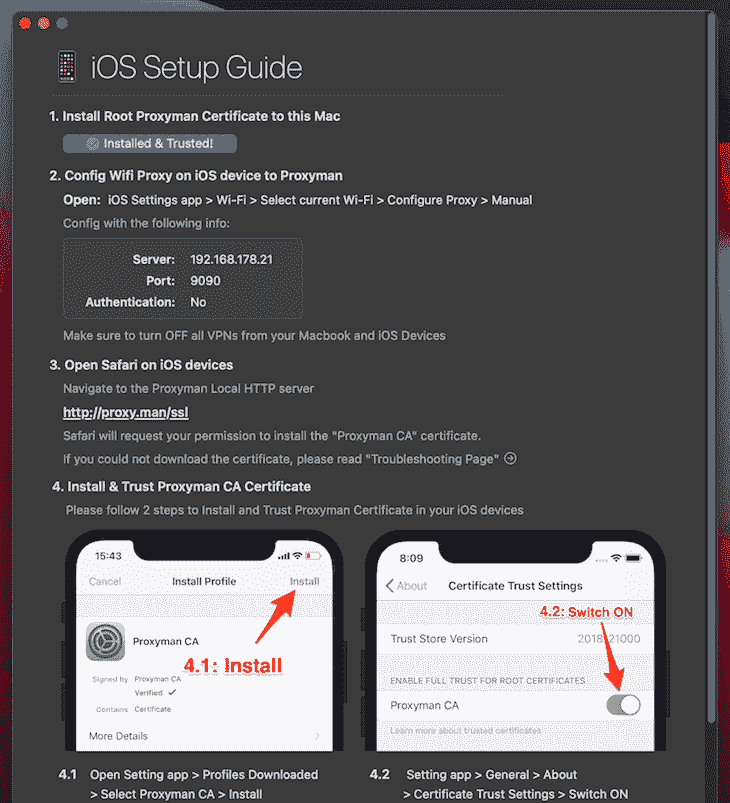

Installation of certificate for a connected iOS device and proxy setup.

只是做对话框敦促你做的事情。代理人使用端口 9090。

### 查看网络流量

现在，您可以开始查看网络流量。打开 Expo 应用程序的 Metro bundler，按下 **i** 打开模拟器，或者在通过 USB 电缆连接的 iOS 设备上使用相机应用程序扫描二维码。

你应该会看到应用程序的网络流量，每次你通过在 iOS 模拟器上按下 **⌘ d** 或者摇动你的 iOS 设备从 Expo development 菜单重新加载时，它都会调用一个 GET 请求。

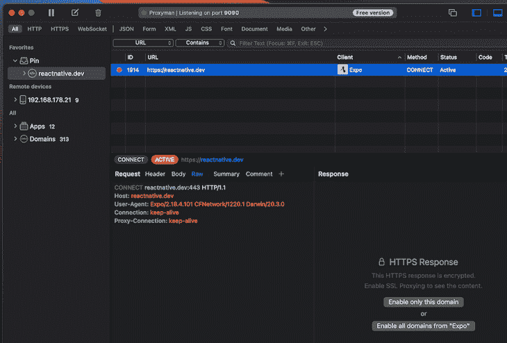

Initially the GET request is encrypted.

为了检查响应体，您需要通过单击按钮**启用来自“Expo”**的所有域来启用 SSL 代理。下面的屏幕截图显示了从 iOS 模拟器调用 GET 调用后服务器发送的已检查响应。

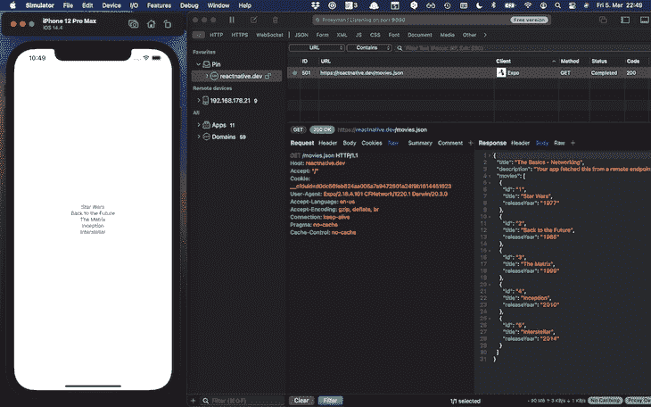

### 停用缓存

在示例请求中，服务器用一个 [304 状态代码](https://developer.mozilla.org/en-US/docs/Web/HTTP/Status/304)来回答，因为响应已经被客户机缓存了。要改变这种行为并获得电影内容的 [200 状态码](https://developer.mozilla.org/en-US/docs/Web/HTTP/Status/200)，您可以通过**工具** > **无缓存**在 [e 缓存](https://docs.proxyman.io/advanced-features/no-caching)处[去激活](https://docs.proxyman.io/advanced-features/no-caching) [。](https://docs.proxyman.io/advanced-features/no-caching)

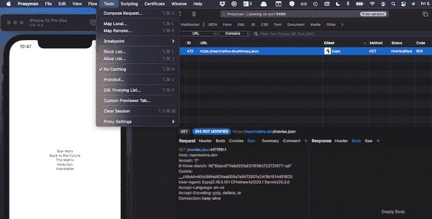

Deactivating caching is helpful for debugging purposes.

### 存根网络呼叫

为了完成不同的用例，通过创建存根来伪造网络调用是有用的。在本例中，我们希望将响应主体由一部电影而不是四部电影组成。

Proxyman 为此提供了不同的选项。每当路径匹配具体的 URL `[https://reactnative.de/movies.json](https://reactnative.de/movies.json)`时，用[地图本地工具](https://proxyman.io/blog/2019/08/map-local-feature.html)加载一个本地 JSON 文件作为存根。这是您要加载的文件:

```
// stub.json
{
  "title": "The Basics - Networking",
  "description": "Your app fetched this from a remote endpoint!",
  "movies": [
    {
      "id": "1899",
      "title": "Dumb and Dumber",
      "releaseYear": "1994"
    }
  ]
}

```

您可以定义多个存根，并根据需要启用或禁用它们。

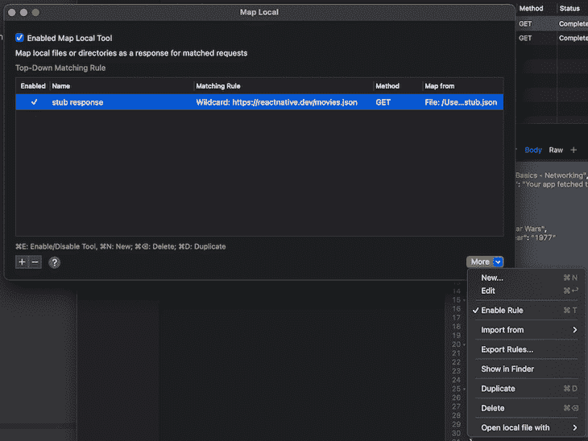

每当您在 Expo CLI 中按下 **⌘ r** 时，就会调用一个新的请求，并返回 JSON 文件的内容，而不是最初的服务器响应。


### 断点

[断点](https://docs.proxyman.io/advanced-features/breakpoint)的概念是调试应用程序和服务器之间正确行为的强大工具。以下示例显示了具体 URL `[https://reactnative.de/movies.json](https://reactnative.de/movies.json)` *的示例断点。*

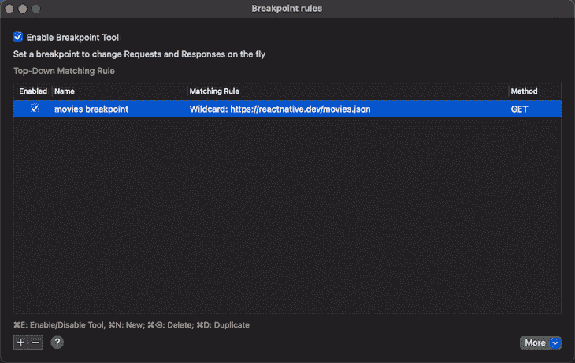

Pause network communication to manually change the response.

这样一来，每当这个规则被匹配时，网络调用就会被暂停。正如您在下一个屏幕截图中看到的，您可以手动定义响应主体。在这种情况下，您可以将响应主体更改为只包含一部电影。顺便说一下，您可以看到加载逻辑工作正常，因为用户在加载过程中看到了加载标签。

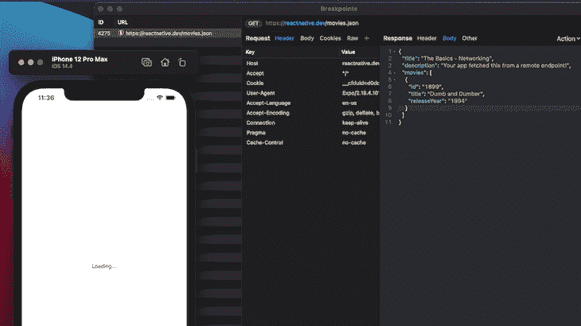

### 在 Android 上使用 Proxyman

要在 Android 上使用 Proxyman，你需要覆盖 Android Studio 中的安全设置，正如在[官方文档](https://docs.proxyman.io/debug-devices/android-device)中所解释的。

Proxyman 的优点是交互式文档。要与 Android 配合使用，从主菜单中选择**证书菜单** > **在 Android 上安装证书** > **仿真器…** 。在打开的对话框中，您将获得用作启用 SSL 代理的安全设置的代码。

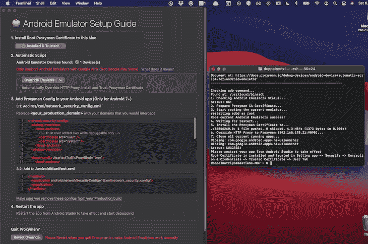

Installation of Android certificates takes place in an opening terminal window.

因为我们有世博会的管理工作流程，我们没有机会插入上面提供的配置代码。这就是为什么我们有 [SSL 握手问题](https://docs.proxyman.io/troubleshooting/get-ssl-error-from-https-request-and-response)并且看不到响应体。

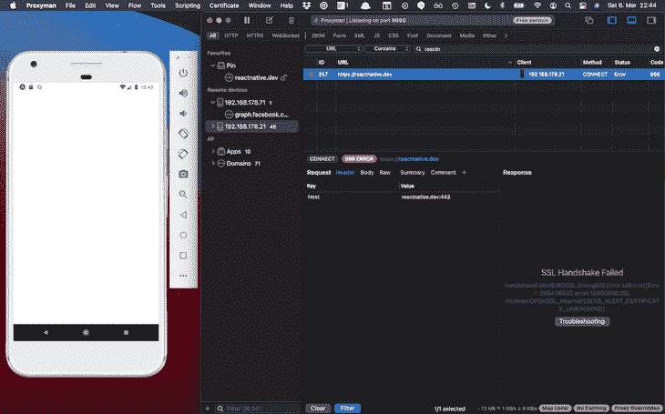

We cannot view the response of our Expo’s app network call.

为了更改这一点，您需要从受管工作流中退出。如果您想坚持这个工作流，您可以退出调试会话，然后恢复您的 Git 更改。

在我目前的工作项目中，我们正在开发一种混合方法，这种方法由本地开发的框架和部分用 React Native 编写的组件组成。上述安全配置是为非生产版本定义的。

我在这篇文章中避免了这一点。我描述如何用 next 工具调试 Android 的网络调用。

## 使用 HTTP 工具包检查网络流量

HTTP Toolkit 是一个漂亮直观的工具，用于拦截、查看和调试 HTTP(S)端点。您可以通过存根请求和响应来重写或重定向应用程序与服务器的网络流量，或者注入错误。它适用于 macOS、Windows 和 Linux。

在本文的准备过程中，HTTP Toolkit 是开箱即用的最佳工具——不需要任何配置。唯一的限制是，在撰写本文时，它不支持 iOS。

### 使用 HTTP Toolkit 和运行在 Android 模拟器中的 Expo 应用程序

第一步是从 Android Studio 打开一个 Android 模拟器。接下来，启动 Expo 应用程序的 Metro bundler。按下 **a** 在模拟器中启动 React 原生应用。

我在 Android 模拟器上遇到的问题比在 iOS 模拟器上遇到的更多。如果您无法运行 Expo 应用程序，最简单的方法是删除 Android 模拟器，然后从 Android 虚拟设备管理器中重新创建。

接下来，启动 HTTP Toolkit，在**拦截**部分点击选项**通过 ADB** 连接的 Android 设备。

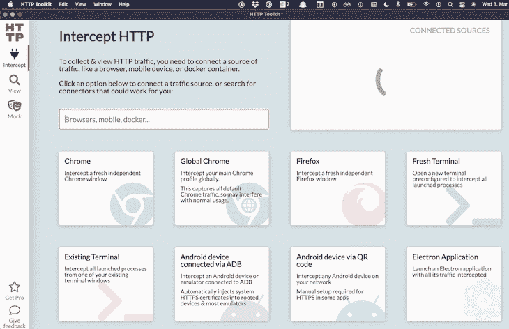

The first step is to intercept network traffic.

模拟器上会弹出一个对话框来建立 VPN 连接。点击**确定**。

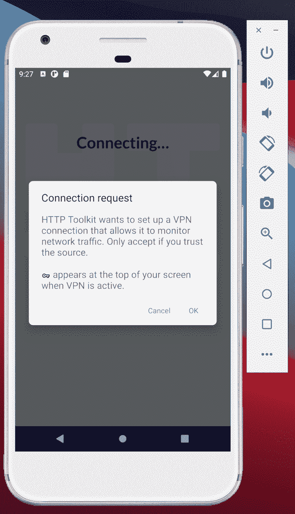

HTTP Toolkit wants to establish a VPN connection.

如果一切正常，那么您应该会看到一条成功消息。

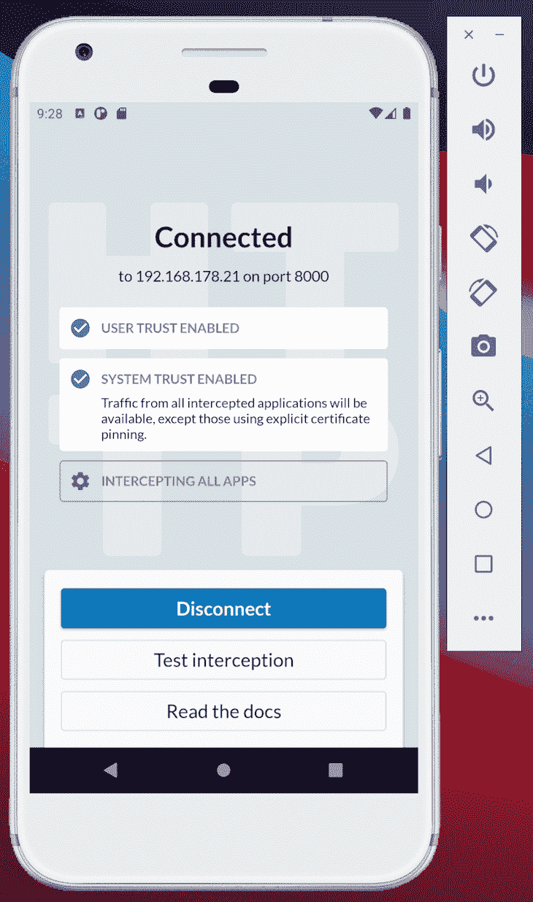

HTTP Toolkit shows a success message after the VPN connection has been established.

### 查看网络流量

现在您应该可以开始运行了。首先，切换到**视图**部分，通过服务器监控 Expo 应用程序的网络流量。在这种情况下，您对 reactnative.dev 端点感兴趣，您可以在 UI 的下半部分对其进行过滤。

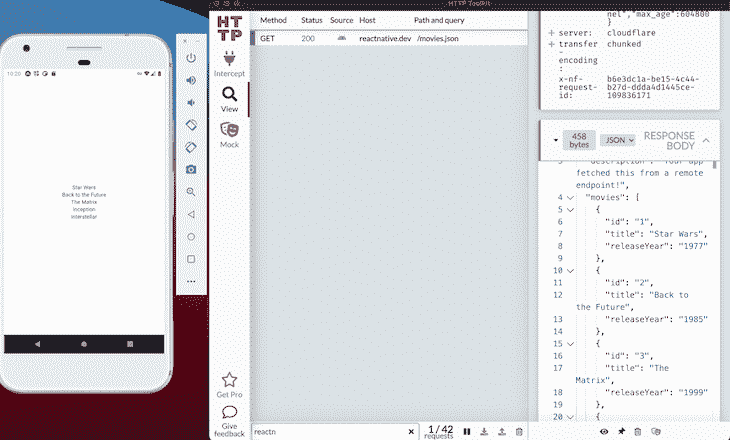

Network traffic of your Expo app is fully viewable.

如您所见，在没有任何干预的情况下，GET 调用的响应体被解密。

在这篇文章的准备过程中，我可以可靠地使用 HTTP Toolkit 通过托管 Expo 项目查看 HTTPS 消息。

### 重写网络呼叫

您可以在**模拟**中定义重写规则。创建一个规则来拦截每个带有 URL `[https://reactnative.dev/movies.json](https://reactnative.dev/movies.json)`的 GET 请求，并创建一个自定义响应。

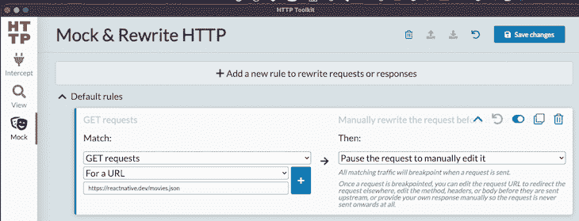

重新加载应用程序后，您可以看到 GET 请求(状态代码 304)已经暂停，您将有机会更改响应主体。当响应暂停时，您可以调试您的应用程序并检查加载状态是否正常。将响应更改为仅包含一部电影和状态代码 200。

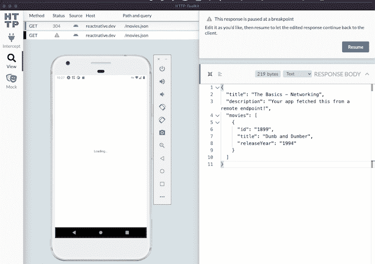

The network call is paused by a breakpoint due to the defined rule

点击 **Resume** 按钮后，由于模拟网络调用返回状态码 200 和自定义 JSON 对象，应用程序只显示一部电影。


After the breakpoint was resumed, the network call returns the custom response

## 使用 Charles 代理检查网络流量

查尔斯代理是一个广泛使用的本地代理工具。它适用于 macOS、Windows 和 Linux，并支持 iOS 和 Android。在本文中，我将描述如何在 iOS 中设置它，并跳过 Android 部分，因为在本文的后面我将描述另一个使用 HTTP Toolkit for Android inspection 的选项。

## 查看 SSL 加密的内容

您可以使用 Charles Proxy 截取、查看和操作 HTTPS 内容。这包括请求、响应和 HTTP 头。这对于监控您的 React Native app 在模拟器/仿真器以及您连接的物理设备上的网络流量特别有用。

在我目前的项目中，它允许我调试由于服务器错误导致的错误处理。例如，您可以阻塞整个请求来强制错误条件。

Charles Proxy 并不排斥 React 本地开发。这里有[多个](https://deliveroo.engineering/2018/12/04/how-to-use-charles-proxy-to-rewrite-https-traffic-for-web-applications.html) [装置](https://github.com/thyrlian/Charles-Proxy-Mobile-Guide) [导轨](https://www.detroitlabs.com/blog/2018/05/01/how-to-set-up-charles-proxy-for-an-ios-simulator/)。在这里，我将描述如何在 Mac 上为 Expo 项目设置它。

下载并安装 Charles Proxy 后，您必须授予权限。


Granting privileges.

打开 Charles Proxy，您会看到网络流量在序列视图中弹出。在浏览器中打开[这个](https://jsonplaceholder.typicode.com/todos/1%5D(https://jsonplaceholder.typicode.com/todos/1)%20%5Blink%5D(https://jsonplaceholder.typicode.com/todos/1%5D(https://jsonplaceholder.typicode.com/todos/1)，过滤掉【jsonplaceholder.typicode.com】的**。点击条目并选择**内容**和**原始内容**。从下一张截图可以看到，网络内容无法正确显示，因为是 SSL 加密的。**

**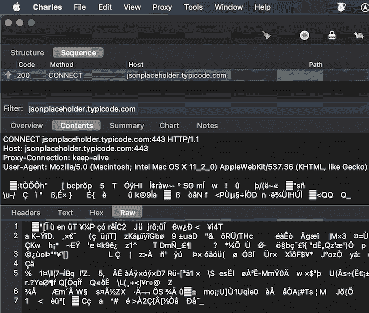

Without certificates, you cannot view SSL-encrypted content.

要改变这一点，您必须打开代理设置(**代理** > **代理设置** …，或 **⇧⌘L** )并向 SSL 条目部分添加一个条目。

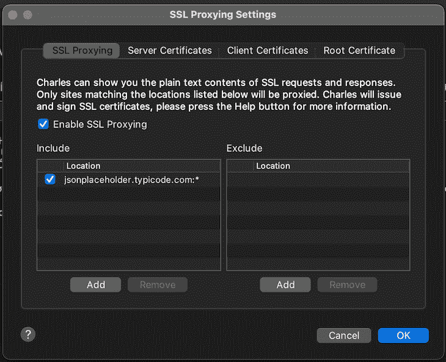

You need to set up proxy settings to view SSL-encrypted content.

在这个例子中，我只为 jsonplaceholder.typicode.com 的**设置了**(主机`jsonplaceholder.typicode.com`和端口`*`，但是你也可以定义主机`*`和端口`*`。勾选复选框后，重新加载页面并再次点击新条目。

在 Chrome 中，你会得到一个警告，提示你的连接不是私有的。你需要继续。

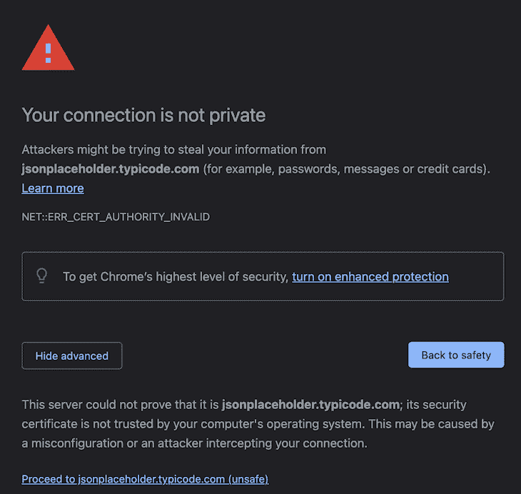

Chrome warns you that the connection may no longer be private.

再次重新加载您的浏览器页面，再次单击请求，您可以看到未加密的内容。

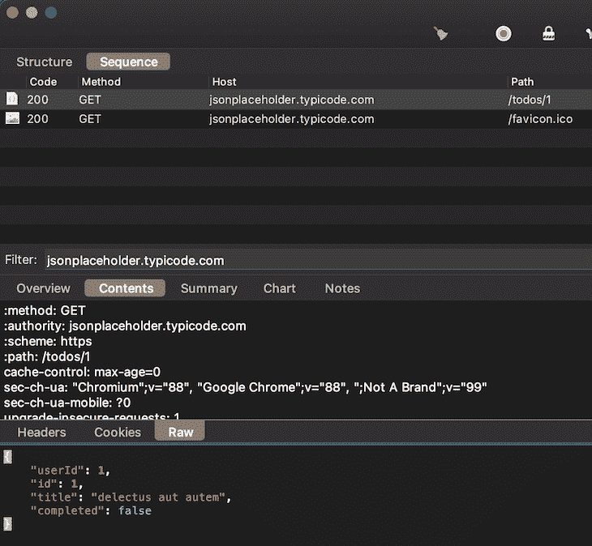

With proxy settings, you can view SSL encrypted content

### 使用 iOS 模拟器中运行的 Expo 应用程序

现在，如果你在 iOS 模拟器中运行 React 本地应用，Charles Proxy 不会显示网络流量。我们需要安装[查尔斯根证书](https://www.charlesproxy.com/documentation/using-charles/ssl-certificates/)。

为 iOS 模拟器安装证书(**帮助** > **SSL 代理** > **在 iOS 模拟器中安装查尔斯根证书**)。确保也选择了 macOS 代理(**代理** > **MacOS 代理**)并且证书在 iOS 模拟器中受信任(**设置 app** > **常规** > **关于** > **证书信任设置** > **激活查尔斯代理 CA)** 。

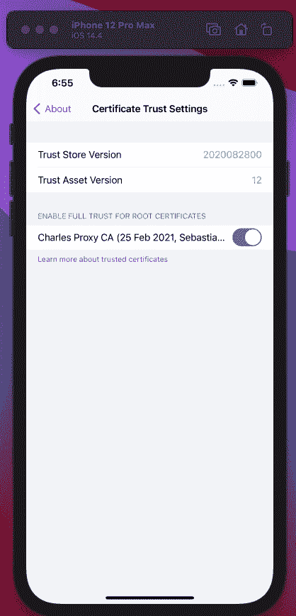

The root certificate has to be trusted in the iOS simulator.

### 阻止请求

对于调试错误场景，将请求添加到阻止列表可能是有用的(右键单击**请求** > **阻止列表**)。

在简单的示例项目中，我已经阻塞了 reactnative.dev GET 调用。正如你从截图中看到的，这表明这样的错误没有得到正确的处理，用户不得不使用一个空白的页面。

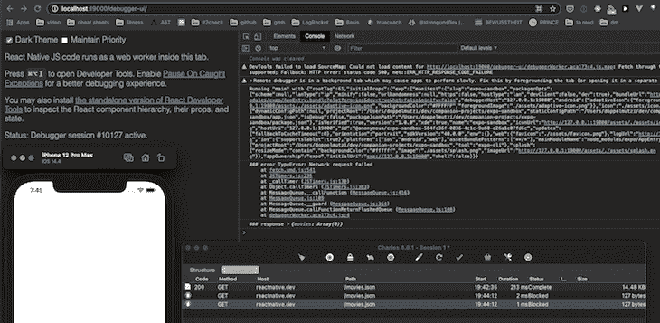

We do not handle our network error correctly.

### 更多调试功能

查尔斯代理相当强大。还有许多特性(用 map local/remote 重写网络调用、断点或停用缓存)我在这里跳过了，因为我已经在 Proxyman 部分展示过了。也可以用来调试 Android 应用。与 Proxyman 一样，您需要从托管 Expo 工作流中退出，以建立正确的安全配置。

## 结论

有一些功能强大的工具可以帮助本地开发人员扩展附带的开发工具来检查甚至重写网络流量。这对于调试复杂的客户端到服务器的交互非常有用。这篇文章给出了代理工具的概述，并且有相当多的选择——我甚至还没有看过 [Fiddler](https://www.telerik.com/fiddler) 。

在 iOS 开发中使用代理工具更容易配置，也更不容易出错。相比之下，在这篇文章的准备过程中，我不得不删除和重新创建很多 Android 模拟器。对于成熟的 Android 调试，您可能无法使用 Expo 的托管工作流，因为您可能需要在 Android Studio 中覆盖 Android 的安全设置。

根据我的经验，这是 Proxyman 和 Charles 的必经步骤。然而，使用 HTTP Toolkit，我可以开箱即用地查看 SSL 加密的网络调用，而无需任何额外的配置或从 Expo 的托管工作流中退出。

但是即使你不得不从 Expo 的工作流程中退出，也有一个针对这个用例的解决方案。在调试会话完成后，恢复您的 Git 更改，您可以继续选择您的开发方法。最后一句话:确保不要在生产构建中使用代理设置。

## [LogRocket](https://lp.logrocket.com/blg/react-native-signup) :即时重现 React 原生应用中的问题。

[](https://lp.logrocket.com/blg/react-native-signup)

[LogRocket](https://lp.logrocket.com/blg/react-native-signup) 是一款 React 原生监控解决方案，可帮助您即时重现问题、确定 bug 的优先级并了解 React 原生应用的性能。

LogRocket 还可以向你展示用户是如何与你的应用程序互动的，从而帮助你提高转化率和产品使用率。LogRocket 的产品分析功能揭示了用户不完成特定流程或不采用新功能的原因。

开始主动监控您的 React 原生应用— [免费试用 LogRocket】。](https://lp.logrocket.com/blg/react-native-signup)****