# 使用 React 开发工具调试 React 应用程序

> 原文：<https://blog.logrocket.com/debug-react-apps-react-devtools/>

***编者按:**这篇关于用 React 开发者工具调试 React 应用的文章最后一次修订是在 2023 年 2 月 8 日，以反映 React 开发者工具的最新更新，并包括 React 挂钩相关的功能。要了解更多关于 React 钩子的信息，请点击查看我们的[备忘单。](https://blog.logrocket.com/react-hooks-cheat-sheet-unlock-solutions-to-common-problems-af4caf699e70/)*

调试是开发人员能够掌握的最有用的技能之一。它允许您正确地导航，发现代码中的错误，并快速有效地应用修复，以交付生产就绪、无错误、高质量的软件系统。在现代 web 开发行业中，这是通过使用各种工具和技术来实现的。

React 是发展最快的前端开发库之一。它提供了一种面向组件的 UI 开发方法，使得创建复杂的交互式 UI 变得轻而易举。像其他 UI 开发框架和库一样，它有 React Developer Tools，一个调试工具。

在本教程中，我将解释如何使用 Rect Developer Tools 的最新特性，这些特性来自 [v4](https://reactjs.org/blog/2019/08/15/new-react-devtools.html) [。x](https://reactjs.org/blog/2019/08/15/new-react-devtools.html) (及更高版本)，用实际例子调试 React 应用程序。

*向前跳转:*

React 开发工具是一个检查和分析 React 组件的解决方案。它允许您编辑组件属性和状态，以便进行调试。它还提供了一个用于性能分析的内置分析器。它是一个官方的浏览器扩展和一个基于电子的独立桌面应用程序。浏览器扩展可用于 Chrome、Firefox 和 Edge。对于 Safari 和其他网络浏览器，React 开发团队通过[r](https://www.npmjs.com/package/react-devtools)eact-devtools 包提供了独立的电子应用。

React Developer Tools 用几个 React 相关的调试选项卡扩展了浏览器的本机 DevTools 环境。类似地，独立的 React 开发人员工具应用程序也提供了类似浏览器扩展的调试体验。

自从开发人员工具解决方案出现以来，核心团队已经发布了许多版本。在本教程中，我将重点介绍它的显著特性，并演示如何使用它的特性来更有效地调试 React 应用程序。

每一个现代的网络浏览器都提供了一个内置的开发者工具解决方案，供开发者检查和修复网络应用中的错误。例如，您可以添加断点并使用控制台来调试任何基于 JavaScript 的应用程序。此外，您可以使用浏览器的 DevTools 轻松检查原生 DOM 元素和属性。React 使用带有组件实例的虚拟 DOM，并在组件呈现阶段呈现真实的 DOM，因此我们不能使用内置的浏览器开发工具来调试 React 组件特有的东西。

React Developer Tools 提供了一个调试 React 应用程序的解决方案，允许您检查/操作 React 组件内部，如属性和状态。因此，使用 React 开发人员工具可以增强 React 应用程序的调试任务，而不需要使用`console.log`浏览器自带的工作区。

现在，您知道 React 开发人员工具解决方案如何帮助调试 React 应用程序，以及为什么 web 浏览器的内置调试器不足以高效地调试 React 应用程序。看看 React 开发人员工具提供的以下突出特性:

*   检查 React 组件树并在浏览器中查看反映
*   在复杂的应用程序中搜索和过滤组件
*   实时检查和编辑道具和状态，查看组件的行为
*   能够在不熟悉的应用程序中找到组件所有者(即父组件和祖先组件)
*   提供了一种方法来[挂起一个 React 组件](https://blog.logrocket.com/react-suspense-data-fetching/)并测试回退组件
*   提供了一个功能全面的分析器，它附带了火焰图和分级图来实现性能增强
*   支持导出和导入分析器结果以满足协作调试需求(无需与团队成员共享分析器截图/记录)

React Developer Tools 是现代流行浏览器的扩展。使用以下链接安装扩展:

如果您已经安装了扩展，那么每当 React 团队发布新版本时，它应该会自动更新。如果您使用 React Native、Safari 或其他 web 浏览器，您可以从 [npm](https://www.npmjs.com/package/react-devtools) 安装独立版本:

```
npm install -g react-devtools
# --- or ---
yarn global add react-devtools
# --- or ---
npx react-devtools

```

## 设置我们的测试应用程序

让我们创建一个测试应用程序来开始 React 开发人员工具调试。为了便于设置和减少开销，我创建了一个 starter 项目，以确保本文侧重于调试。应用程序的框架已经建立起来了。它包括一些组件、样式和项目结构。

如果您想对我进行试验，运行下面的命令来克隆库:

```
git clone https://github.com/codezri/react-contacts.git

```

然后，通过运行以下命令打开文件夹并安装项目的依赖项:

```
cd react-contacts

npm install
# --- or ---
yarn add

```

要启动 React app development server，运行项目根文件夹中的`npm start`或`yarn start`命令。打开你的浏览器到`localhost:3000,`，你会看到项目现场直播！在检查新推出的 React 开发人员工具功能之前，请尝试您已经知道的基础知识，以熟悉我们的测试应用程序。例如，React 元素树如下:

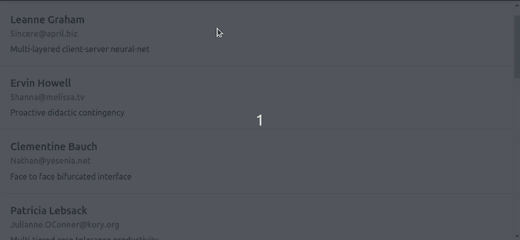

根据 React Developer Tools 内部设计[文档](https://github.com/facebook/react/blob/main/packages/react-devtools/OVERVIEW.md)，传统的 DevTools 解决方案以一种效率较低的策略呈现组件树和内部属性，这种策略涉及许多 JSON 序列化事件，因此从 DevTools 的角度来看，调试复杂的 React 应用程序存在性能瓶颈。

新的 DevTools 解决方案通过按需传输优化的组件树数据和 props，提供了显著的性能提升和改进的导航和检查体验。这些性能增强激励开发人员在更大的应用程序中高效地使用 React 开发工具。

## 使用 React 开发工具过滤组件

在以前版本的 DevTools 中，浏览大型组件树有点乏味。但是现在，DevTools 提供了一种过滤组件的方法，这样你就可以隐藏那些你不感兴趣的组件。为了访问这个特性，让我们过滤一下示例应用程序中的三个组件。打开您的 DevTools，您将看到我们列出的三个组件:

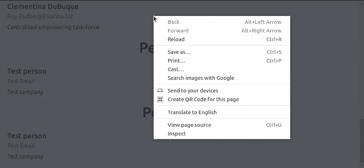

单击“组件”选项卡下的“设置”图标，过滤出一个组件，并关注我们感兴趣的组件。您将看到一个由几个选项卡组成的弹出窗口。点击**组件**选项卡，选择您喜欢的过滤选项。

默认情况下，组件树显示所有 React 组件。您可以通过“组件”选项卡添加一个过滤器，并隐藏匹配`Pe`正则表达式的组件，以从树中排除`Persons`和`People`组件:

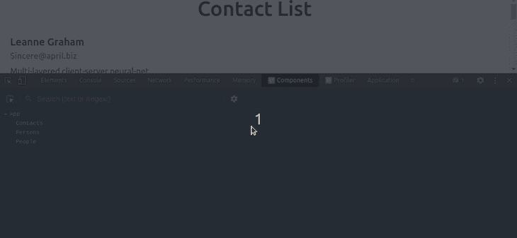

在我们过滤掉组件后，它们在默认情况下会变得隐藏，但在禁用过滤器后会变得可见。当您处理一个包含许多组件的项目，并且需要快速排序时，这个特性会派上用场。这个特性更有趣的地方在于，过滤器首选项会在会话之间被记住，因此您不需要在每个调试会话期间重新添加您喜欢的组件过滤器。

您可以添加多个过滤器，并根据组件名称、类型、位置和[高阶组件(HOC)](https://blog.logrocket.com/understanding-react-higher-order-components/) 排除元素。此外，您可以使用高级正则表达式。例如，以下过滤器隐藏了所有标题 DOM 元素(`<h1>`)和`Contacts` React 组件:

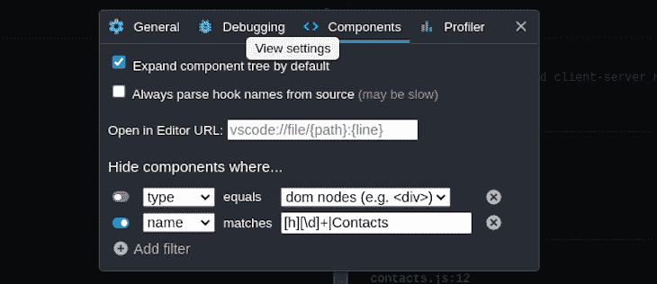

## React 开发工具中的内联属性现在已经成为过去

为了让更大的组件树更容易浏览，让 DevTools 更快，树中的组件不再显示[内联属性](https://blog.logrocket.com/build-inline-editable-ui-react/)。要查看此功能的运行情况，您只需选择一个组件，所有组件的属性、状态和挂钩都将显示在 React Developer Tools components 选项卡的右侧。

在我们的示例应用程序中，我们只将道具传递给我们的`Contacts`组件。单击它将显示传递给它的道具的值，单击其他组件将显示没有任何道具传递给它们。看下面的预告:

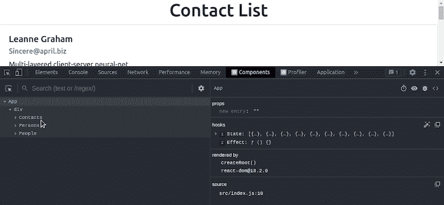

虽然从 DevTools 查看属性对于较小的 React 项目可能不太有用，因为属性很容易通过代码检查，但是在处理由复杂的组件树和属性组成的较大 React 项目时，它会很方便。然而，道具和状态编辑功能有助于高效调试小规模应用程序:

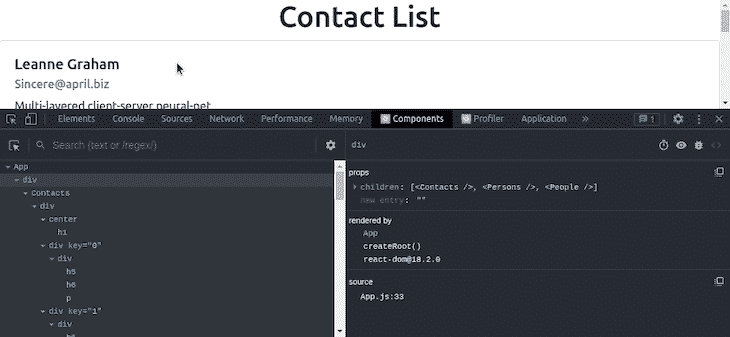

## 调试意外的属性值和组件元素

在 React 组件处理中，组件的所有者指的是呈现它的组件。另一方面，parent 是指组件树的上层组件。父组件并不总是所有者。我们用一个例子来理解一下。将`App`组件重命名为`App_original`,并添加以下代码:

```
function Container({ children }) {
  return (
    <div style={{ padding: '8px', background: '#bbb' }}>
      { children }
    </div>
  );
}

function Panel({ color }) {
  return (
    <div style={{height: '16px', background: color}}></div>
  );
}

function App() {
  const color = 'red';
  return (
    <Container>
      <Panel color={ color }/>
    </Container>
  );
}

```

`Container`是`Panel`的父，但是`App`是组件的拥有者，只有拥有者才能向下发送道具。在 React Dev 工具的新版本中，您可以通过跳过父代并找到启动意外属性值的所有者来快速调试意外属性值。DevTools v4 在右侧窗格中添加了一个`rendered by`列表，允许您快速浏览所有者列表以加快调试过程。

点击组件树中的`Panel`组件，你可以通过浏览`rendered by`列表来查看`color`道具的来源:

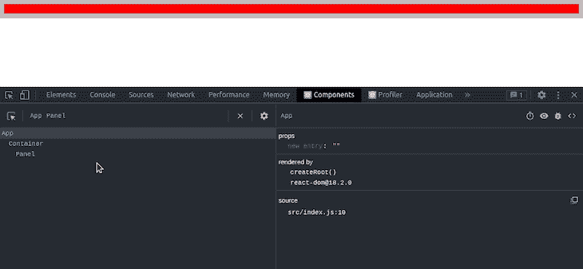

这在追溯特定道具的来源时非常有用。它还带有一个名为`owners tree`的反函数。它是由一个特定组件呈现的东西的列表——它所拥有的东西。这个视图有点像查看组件的 render 方法的源代码，对于探索大型的、不熟悉的 React 应用程序来说是一个很有帮助的方法。
`owners tree`通常出现在组件树 UI 之前。

要使用这个特性来调试我们的应用程序，双击一个**组件**来查看所有者树，然后单击 **x 按钮**来返回完整的组件树。您还可以在树中移动来查看组件的所有子组件。将`App_original`重命名为`App`，取回我们的联系人 app，检查`owners tree`如下:

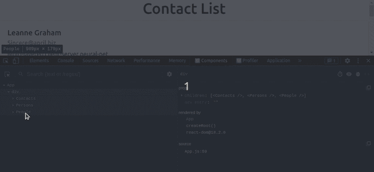

精心设计的 [UI/UX 概念](https://blog.logrocket.com/category/ux-design/)直接影响软件系统的质量。因此，每个软件开发团队[通常会雇佣至少一个 UI/UX 开发人员](https://blog.logrocket.com/ux-design/mastering-ux-user-interviews/)或更多。基于 UI/UX 原则的视觉改进可能并不总是出现在特定应用的第一个版本中——UI/UX 团队通常会研究、实验、分析和实施新的视觉改进，以提高应用用户的工作效率并改善应用的可用性。

在 React 开发者工具 v4 之前，一些 [UI/UX 相关的问题](https://blog.logrocket.com/ux-design/guide-visual-hierarchy/)影响了调试效率和整体调试器的可用性(尤其是在调试大型 React 应用时)。因此，在 v4 中，React 开发团队引入了以下对开发人员友好的可视化改进。

## 没有水平滚动的缩进组件视图

在以前版本的 React 开发人员工具中，深度嵌套的组件需要垂直和水平滚动才能看到，这使得跟踪大型组件树很困难。DevTools 现在可以动态调整嵌套缩进来消除水平滚动。

要在我们的应用程序中使用该功能，请单击**组件**选项卡，然后单击任何**组件**。它的所有子组件将自动出现在它的下面，并从下一个组件自动缩进。不可能用我们的示例联系人应用程序来演示这一点，因为它是一个简单的应用程序，不包含深度嵌套的元素。然而，如果你打开 React 官方文档的 [o](https://reactjs.org/docs) [开发工具，你可以看到动态缩进:](https://reactjs.org/docs/getting-started.html)

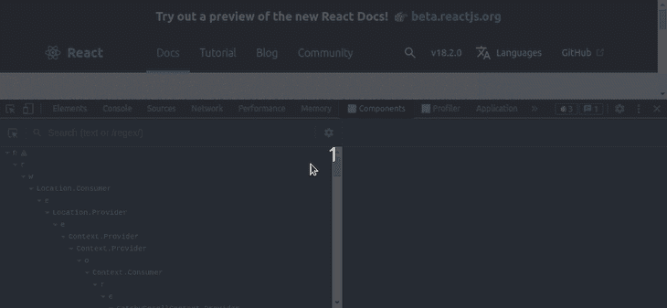

## 改进的搜索

以前，在 DevTools 中搜索时，结果通常是过滤后的组件树，将匹配的节点显示为根。其他组件被隐藏，搜索匹配现在显示为根元素。这使得应用程序的整体结构更难推理，因为它将祖先显示为兄弟。现在，您可以使用类似于浏览器页面查找搜索的内嵌结果轻松搜索组件:

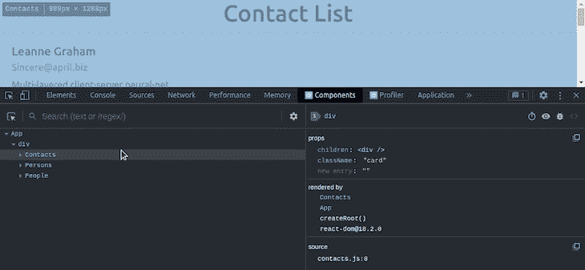

如前所述，可视化的改进提高了 React 开发人员在调试过程中的生产力。一个好的用户界面/UX 并不是让一个软件系统变得伟大的唯一事实——应用程序的功能(或特性)也会提高特定软件产品的质量。早期的 React 开发人员工具版本功能不全，也不符合现代 React 库的功能，例如悬念、挂钩等等。在 v4 中，React 团队引入了以下功能来调试使用最新、高级 React 库概念的 React 应用程序。

### 改进的挂钩支架

基于钩子的 React 项目可以调试得更快更好，因为 v4 中的钩子现在与 props 和 state 具有相同级别的支持。值可以编辑，数组和对象可以钻取。打开 sample app，在 DevTools 中选择`App`组件，查看`Hooks`区域，尝试编辑状态，如下图预览所示:

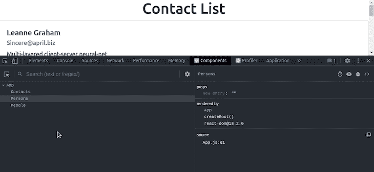

### 在重新加载之间恢复选择

在调试过程中，如果你点击**重新加载**，DevTools 会尝试恢复最后选择的元素。假设在页面刷新发生之前，我们正在对示例应用程序中的`Persons`组件进行排序，DevTools 将继续自动选择`Persons`组件:

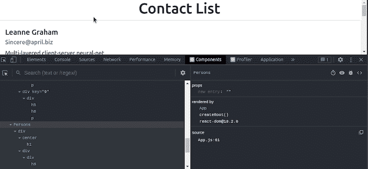

### 高阶组件支持

经验丰富的 React 开发人员在开发应用程序时往往倾向于使用高级开发技术。[高阶组件](https://reactjs.org/docs/higher-order-components.html)(又名 HOC)是一种高级的 React 组件组合技术，它实现一个函数来获取一个组件并返回一个修改后的组件。React Developer Tools v4 显示类似于`forwardRef`、`Memo`的徽章时，也会显示特设徽章。让我们检查一下 DevTools 中的特设支持。

首先，将以下函数添加到您的`App.js`文件中:

```
function withMoreProps(Component) {
  function withMoreProps() {
    return (
      <Component x={10} y={20}/>
    );
  }
  withMoreProps.displayName = `withMoreProps(${Component.displayName ||
    Component.name})`;
  return withMoreProps;
}

```

`withMoreProps` HOC 为`input`组件增加了`x`和`y`道具。用`withMoreProps` HOC 修改`Persons`组件如下:

```
function App() {

  const [contacts, setContacts] = useState([]);
  const PersonsWithMoreProps = withMoreProps(Persons);

  useEffect(() => {
    fetch('http://jsonplaceholder.typicode.com/users')
      .then(res => res.json())
      .then((data) => {
          setContacts(data);
      })
      .catch(console.error)
  }, []);

  return (
      <div>
        <Contacts contacts={contacts} />
        <Persons/>
        <People/>
        <PersonsWithMoreProps/>
      </div>
  );
}

```

检查 DevTools。现在，您可以看到特设标签和新添加的道具:

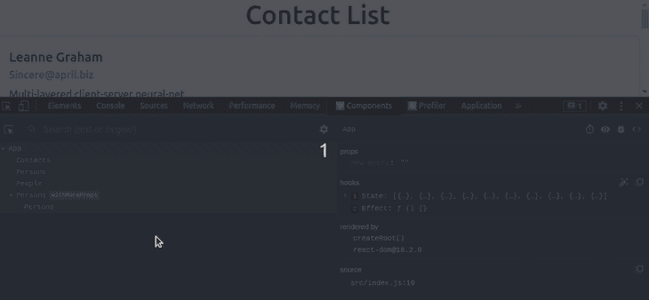

### 悬念切换

React 的[悬念 API](https://blog.logrocket.com/using-suspense-react-query-tutorial-examples/) 让组件在渲染前等待或做一些事情。当树中较深的组件等待渲染时，组件可用于指定加载状态。DevTools 允许您使用此开关测试这些加载状态:

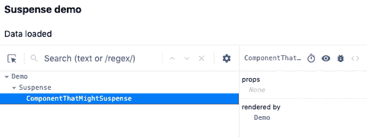

## React 开发人员工具中的探查器变化

在编程领域，分析器指的是动态分析另一个软件程序源代码的软件程序。动态分析过程有助于开发人员识别应用程序中的性能问题。例如，如果一个 web 应用程序在某些条件下运行缓慢，web 开发人员可以使用分析器来确定性能瓶颈。React Developer Tools 在浏览器扩展和独立应用程序的单独选项卡中提供了 profiler 程序。

## 重新加载和配置文件

React Developer Tools Profiler 是一个强大的 React 组件性能调优工具。旧的 DevTools 支持分析，但只是在它检测到 React 的支持分析的版本之后。因此，无法分析应用程序的初始`mount`(对性能最敏感的部分之一)。此功能现在由一个`reload and profile`动作支持:

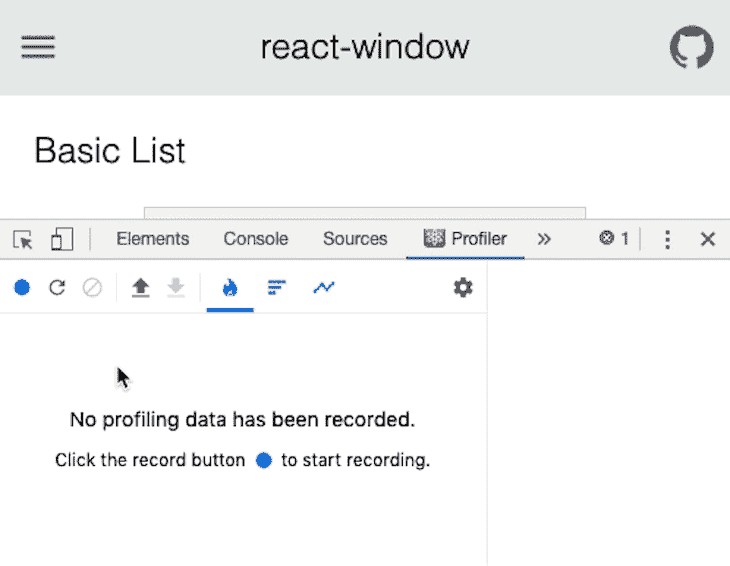

## 组件呈现列表

分析器显示在分析会话期间每次呈现选定组件的列表，以及每次呈现的持续时间。当分析特定组件的性能时，该列表可用于在提交之间快速跳转。例如，分析示例应用程序并单击一个**组件**以查看特定组件被渲染了多少次，如下所示:

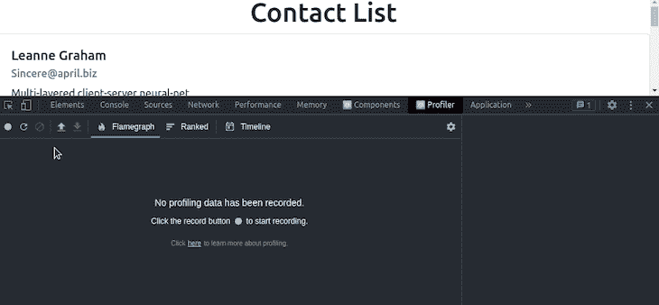

仅支持以下版本的 React:

### 反应 DOM

*   [v0-14.x](https://www.npmjs.com/package/react/v/0.14.0) :不支持
*   [v15.x:](https://www.npmjs.com/package/react/v/15.0.0) 支持(除了新的组件过滤器特性)
*   [v16.x](https://www.npmjs.com/package/react/v/16.10.0) 及更新版本:支持

### 反应自然

因此，如果某些特性在特定项目上不起作用，请检查您正在使用的 React 版本。为新项目使用最新的 React 版本或升级现有项目中的 React 版本以使用最新的库功能并获得性能或安全性增强总是好的。

## 结论

在本教程中，我们已经讨论了用 DevTools 调试 React 应用程序。我们看了一些随之而来的添加和改进。我们还研究了它们如何使调试代码变得更容易。

尝试用我们在本文中讨论的特性调试 React 应用程序。你可以查看这个 [live playground 应用](https://react-devtools-tutorial.vercel.app/)来了解如何在不安装浏览器扩展或独立应用的情况下使用 DevTools 调试 React 应用。在调试 React 应用程序之前，您需要记住以下总结:

*   使用元素树(组件选项卡)浏览组件、编辑属性和状态
*   使用概要分析器来识别性能问题并分析性能增强(例如，针对 SEO 和可用性的交互时间( [TTI](https://developer.chrome.com/en/docs/lighthouse/performance/interactive/) )优化)

如果您有任何问题、意见或补充，请务必留下您的意见。编码快乐！