# 调试你的应用程序的可访问性

> 原文：<https://blog.logrocket.com/debugging-application-accessibility/>

在构建 web 应用程序时，可访问性是一个至关重要的考虑因素，因为它确保残疾用户可以享受应用程序的全部功能。不幸的是，由于缺乏意识，或者更糟糕的是，由于缺乏时间，可访问性经常被忽视。

后一个借口尤其糟糕——网络应该是普遍可访问的，为此，总有时间。根据美国人口普查局的数据，18.7%的美国公民有某种残疾，这可能代表了很大一部分用户。更重要的是，不能让你的网络应用无障碍可能会导致[法律后果](https://www.delish.com/food-news/a28543784/blind-man-sues-dominos-over-website/)。

在本教程中，我们将演示如何调试您的网站的可访问性。我们将讨论您可以使用的一些工具，以及如何处理常见的陷阱。

我们将审核我自己的[个人网站](http://www.paulryancodes.com/old/)(因为我使用的是我编辑过的 Gatsby 模板，没有做任何其他改进)来展示用户在浏览一个简单页面时是如何遇到问题的。我们还将检查网络平台 [Dribbble](https://dribbble.com/) 的主页，以评估其可访问性。

让我们开始吧！

## 开始调试你的网站

调试网站的可访问性包括以下步骤。

*   检查您是否可以仅使用键盘浏览网站。如果不能，则网站不可访问
*   类似于基于 PWA 性能对 web 应用程序进行评分的方式，对可访问性 web 扩展进行同样的操作
*   实现跳转链接来帮助用户快速浏览你的网站
*   减少运动，因为有些动画会对用户体验产生负面影响

让我们更详细地研究这些任务。

## 键盘导航

我们将通过测试我的网站的可访问性来演示。如果你想继续玩下去，就去保罗·瑞恩代码公司看看你能不能用键盘浏览这个网站。

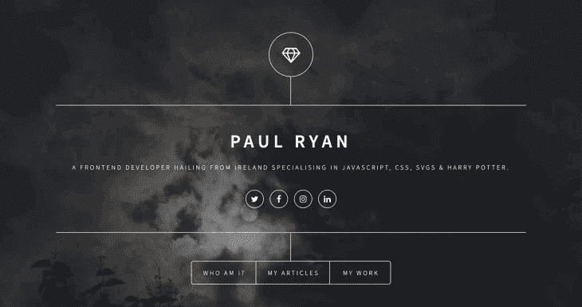

如您所见，我们可以使用 tab 键导航到必要的按钮。我的网站非常简单，所以你会认为是这样。然而，我确实遇到了一个 bug:当我打开我的模态时，我发现它无法关闭。

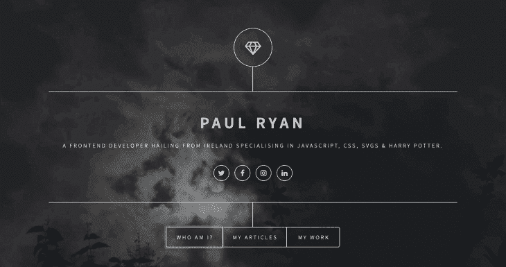

因此，如果用户使用键盘浏览我的网站，他们最终会被困在这里。从可访问性的角度来看，这并不理想，所以让我们进行故障排除。

首先，检查代码以识别问题。

```
<div
  className="close"
  onClick={() => {
    this.props.onCloseArticle()
  }}
></div>

```

这段代码不太容易被访问。我们怎么能确定这是一个按钮呢？为了解决这个问题，我们将把`div`改为`button`。

```
 <button
  className="close"
  onClick={() => {
    this.props.onCloseArticle()
  }}
></button>

```

现在我们可以关闭模态，但是当它是活动的时候按钮上没有轮廓。这是一个非常常见的问题，我自己也为编写如下代码而感到内疚(通常是出于设计原因)。

```
button {
  outline: none;
}

```

让我们添加下面的代码来确保我们的`button`在活动时有一个`outline`。

```
button:focus {
  outline: auto;
}

```

现在我们可以关闭模态，如下所示。我们还可以使用键盘浏览文章列表。

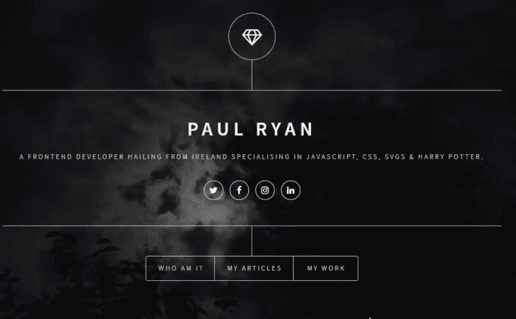

让我们前往 [Dribbble 主页](https://dribbble.com/),看看我们能否只用键盘浏览主页。

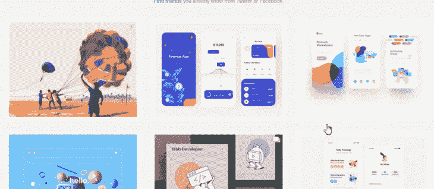

一切都很顺利，直到我们点击其中一个设计，注意到底部有一个奇怪的空白。这似乎是一个小的 UI 错误，但是它阻止了用户喜欢或保存图像。

如下所示，当鼠标悬停在图像上时，选项可见。


稍后，我们将讨论`prefers-reduced-motion`，它可以帮助解决这个 bug。

现在让我们在其中一个设计上按回车键并打开模式。

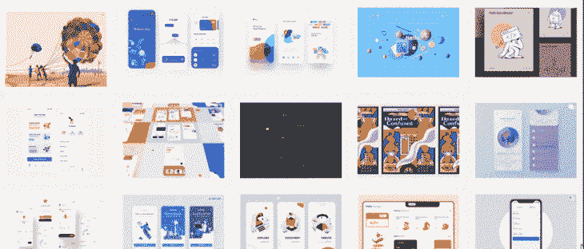

啊哦——看起来我们不能使用模态。这是很多网站的通病。如果你点击这个模态，它将会有焦点并且像预期的那样工作。我们可以用 [`tabindex`](https://developer.mozilla.org/en-US/docs/Web/HTML/Global_attributes/tabindex) 来让这个更容易理解。

现在让我们检查页脚。

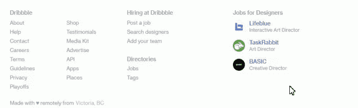

看起来页脚工作正常——太好了！

作为一个旁注，Dribbble 是一个奇妙的，设计精美的网站，也是一个优秀的资源。以上几点并不是为了批评 Dribbble，而是为了说明即使是最优雅、精心设计的网站也可能存在可访问性问题。

## Web 扩展

我们上面演示的方法是非常手工的；可以想象，用这种方式完全审计一个网站的可访问性需要相当多的时间和工作。令人欣慰的是，一些聪明人已经开发出了工具，我们可以使用这些工具来自动化部分流程。

一种这样的工具叫做[斧头](https://www.deque.com/axe/)。我正在使用 Chrome，但是这个工具也可以用于 Firefox，如果你喜欢的话。当 axe 被添加到您的扩展中时，您可以在您的开发工具中查看一个名为`Axe`的新标签。


让我们把注意力转移回我的网站——尽管，不可否认，我有点担心 axe 可能会发现多少问题。

继续按下那个`Analyze`按钮。

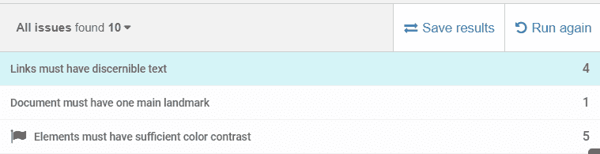

呀！根据这个分析，我的小网站有 10 个可访问性问题。谢天谢地，只有三个不同的问题。让我们逐一查看。

### 链接必须有可识别的文本

这归结于我的社交按钮。


我既没有对链接的描述，也没有内部链接标签，如下所示。


为了解决这个问题，我们只需要给我们的锚标签添加一个`aria-label`(我们也对其他三个社交链接做同样的事情)。

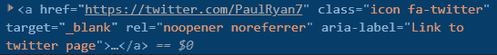

### 文档必须有一个主要标志

你可能会问这到底意味着什么。 [axe 文档](https://dequeuniversity.com/rules/axe/3.3/landmark-one-main)对其定义如下:

> 最佳实践是同时使用 HTML 5 和 ARIA 地标来确保所有内容都包含在导航区域中。在 HTML5 中，你应该使用像`header`、`nav`、`main`和`footer`这样的元素。他们对应的唱段依次是`role="banner"`、`role="navigation"`、`role="main"`、`role="contentinfo"`。通过同时使用 HTML5 和 ARIA 标记，无论使用何种屏幕阅读器技术，您都可以使网页更加健壮，功能更加强大。

我的网站既没有`main`标签，也没有任何 ARIA 等价集。如上所述，最好两者都用，所以让我们把它放进去。

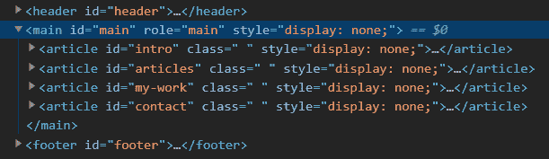

酷，另一个无障碍问题修复。我们快到了！

### 元素必须有足够的颜色对比

在我的网站上，这个问题出现了五次。使用 axe 中的`highlight`按钮，我可以看到我的第一个颜色对比问题。

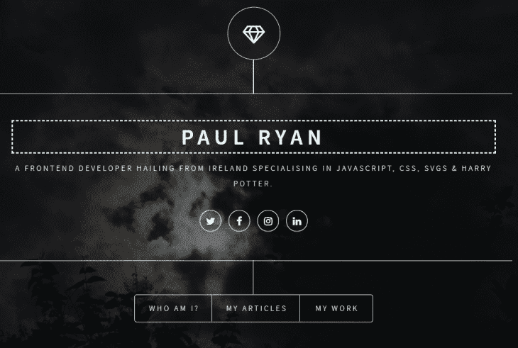

axe 正在标记我的背景图像在某些地方包含浅色。这是这个工具有点困难的地方。在报告的问题下方，axe 显示以下文本。


在调试自己的站点时，您可能会遇到这种情况。无论如何，axe 提供了一个很棒的[色彩对比度分析器](https://dequeuniversity.com/rules/axe/3.3/color-contrast)。在这种情况下，我认为我的网站的对比度是好的，所以我们继续(尽管我计划在某个时候自己进一步测试这一点)。

现在让我们在 Dribbble 主页上运行 axe。

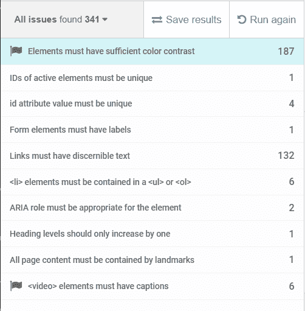

该工具在 Dribbble 主页上发现了 10 个明显的错误，考虑到页面上正在发生的一切，这真的很好。

上面的大多数问题都很基本，但是下面的可能需要一些解释。

*   活动元素的 ID 必须是唯一的:您在页面上使用的任何 ID 都应该只使用一次，尤其是活动元素
*   **标题级别应该只增加一个**:所有的[标题应该按照逻辑顺序](https://dequeuniversity.com/rules/axe/3.0/heading-order)(例如，h1 后面跟着 h2)
*   **所有页面内容都必须包含在地标中**:所有呈现的内容都必须放在带有 ARIA 标签的容器元素中。这类似于我们发现我的网站缺少`main`标签时所面临的问题。您应该添加的标签包括`navigation`、`main`、`header`和`footer`

axe 是一个强大的工具，可以帮助 web 开发人员使他们的网站更容易访问。尽管它并不是完美无缺的，而且可能会遗漏一些问题，但在审核您的网站的可访问性时，它会节省您大量的时间。

## 跳过链接

跳转链接是易访问性的无名英雄，对于残疾用户来说，它们是天赐之物。让我们来看看爱尔兰国家公共服务广播公司 raidióteiliíséireann 的网站。

到底什么是跳转链接？让我们想象一位患有帕金森症的爱尔兰老年用户正在阅读在线新闻。下面是 RTE 站点上的导航栏。

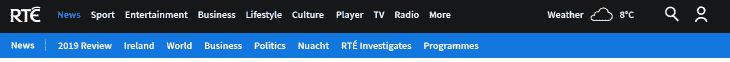

然后他们切换到标签为 Culture 的菜单项，并按 enter 键。

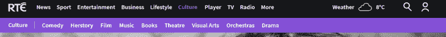

要访问该页面上的内容，用户需要再次浏览所有菜单项。当然，有更好的方法。这就是跳转链接出现的原因。

跳转链接使用户能够跳转到特定页面的内容，正如你在帕拉马塔公园网站上看到的。

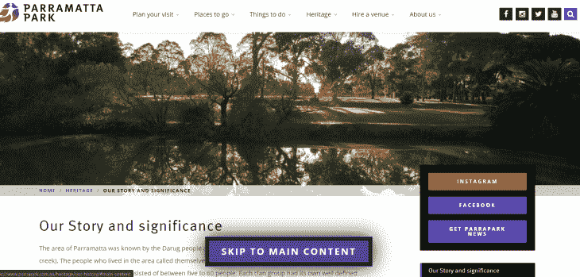

主页包括一个标记为“跳转到主要内容”的跳转链接，这使得用户不必在导航栏中循环访问他们感兴趣的页面内容。

这在理论上很棒，但是让我们更实际地讨论如何实际创建一个跳转链接。为了演示，我们将使用我在 [Codepen](https://codepen.io/PaulRyan17/pen/PowJavZ) 中创建的这个非常基本的页面。

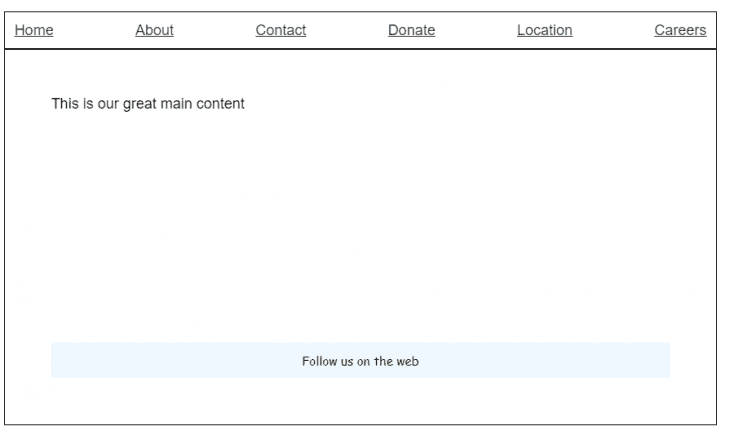

在这个例子中，我们有六个导航项目。让我们为用户提供跳过导航链接直接进入内容的选项。

首先，我们将创建一个跳转链接。

```
<a id="skip-link" href="#maincontent">Skip to main content</a>

```

接下来，我们将添加一个`id`到我们想要导航到的页面。在我们的例子中，它是`main`元素。

```
<main role="main" id="maincontent">

```

现在让我们为我们的跳转链接创建 CSS。

```
a#skip-link {
  position: absolute;
  padding: 10px;
  border: 1px solid black;
  background: #00aced;
  text-decoration: none;
  color: #fff;
  left: 250px;
  top: 10px;
  visibility: hidden;
}

```

默认情况下，我们将`visibility`设置为`hidden`,因为我们只希望当用户开始跳转时跳转链接可见。

有了 skip 链接，是时候添加我们漂亮的 JavaScript 了。

```
// local variable we use to check if we already showed the skip link
let showSkiplink = true;
// get a reference to our skip link
const skipLink = document.querySelector('#skip-link');
// fuction to check if tab was pressed
function checkTabPress(e) {
    'use strict';
    // get a reference to active element
    var ele = document.activeElement;
    // our boolean showSkipLink is true so we haven't shown it already
    if(showSkiplink) {
       // if the keycode is tab we are on a a element
       if (e.keyCode === 9 && ele.nodeName.toLowerCase() === 'a') {
          // show our skip link
          skipLink.style.visibility ='visible';
          // focus the skip link
          skipLink.focus();
          // from here on out we don't want to show it
          showSkiplink = false;
        }
    } else {
      skipLink.style.visibility ='hidden';
    }  
}
// add a listener to keypress
document.addEventListener('keyup', function (e) {
    checkTabPress(e);
}, false);

```

我们的跳转链接现在已经就绪。

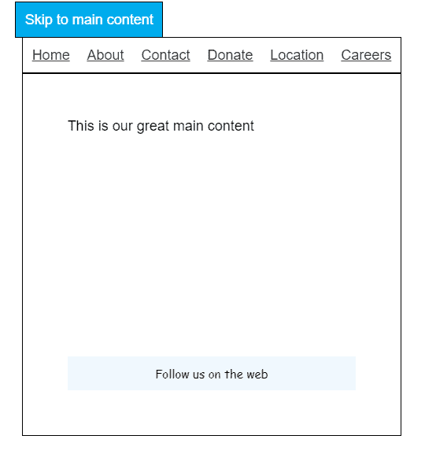

这是你能找到的最基本的例子，但是它是一个很好的模型来演示如何在你自己的网站中实现跳转链接。对于一个优秀的现实世界的例子，我推荐检查一下[天空新闻](https://news.sky.com/)网站。

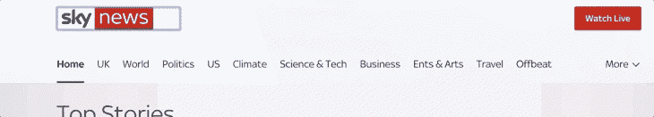

如您所见，用户可以在跳转链接之间导航。这需要更多的工作，但绝对值得投资。

## 减少运动

减少运动是无障碍最容易被忽视的方面之一。由于浏览器支持的增加和高质量动画资源的激增，网络上的动画已经变得更加流行。但是仅仅因为一个网站看起来很棒并不意味着它是可访问的。清除这个障碍的一个方法是让用户控制你的动画。

为了解释`prefers-reduced-motion`，让我们看看我在 [Codepen](https://codepen.io/PaulRyan17/pen/zYxaGoX) 中收集的另一个例子。这是一个简单的卡片翻转效果，在现代网站上很常见。

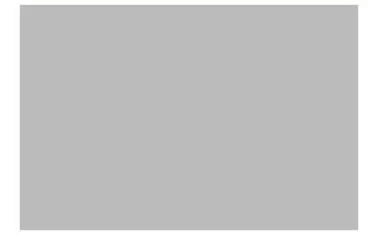

当用户悬停在图像上时，会触发翻转效果。但是一个键盘用户如何接触到`Click Me`按钮呢？是去除翻转的唯一解决方案吗？幸运的是，我们可以使用`prefers-reduced-motion`来实现这一点。

减少运动在系统级别设置。我用的是 Windows 10，所以我关闭了这个设置。

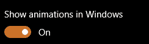

在 Mac 里是在`System Preferences > Accessibility > Display`下面。这可能会根据您的操作系统版本而有所不同，但是您可以很容易地通过谷歌来查找设置的确切位置。

有了这些，我可以使用下面的媒体查询。

```
@media (prefers-reduced-motion: reduce) {

}

```

然后，我将下面的内容添加到我的媒体查询中，这样，默认情况下，带有按钮的一侧就是显示的一侧。

```
.flip-card .flip-card-inner {
  transform: rotateY(180deg);
}

```

作为参考，这里是[成品笔](https://codepen.io/PaulRyan17/pen/MWYXwEZ)。

这只是你会用到`prefers-reduced-motion`的[多种场景](https://css-tricks.com/introduction-reduced-motion-media-query/)中的一种。创建动画时，您应该始终考虑残疾用户如何访问内容。这当然是说起来容易做起来难，但是过一段时间就会变成习惯。

## 我们没有涉及的主题

可访问性是一个巨大的主题；我们讨论了一些最常见的领域，但没有讨论更高级的主题，如屏幕阅读器，它对有视觉障碍的用户起着至关重要的作用。我推荐看看这个优秀的[前端硕士课程](https://frontendmasters.com/courses/javascript-accessibility/)，在这个课程中，开发人员和可访问性倡导者 Marcy Sutton 讨论了屏幕阅读器和本文涉及的许多主题。

## 你的前端是否占用了用户的 CPU？

随着 web 前端变得越来越复杂，资源贪婪的特性对浏览器的要求越来越高。如果您对监控和跟踪生产环境中所有用户的客户端 CPU 使用、内存使用等感兴趣，

[try LogRocket](https://lp.logrocket.com/blg/css-signup)

.

[](https://lp.logrocket.com/blg/css-signup)[https://logrocket.com/signup/](https://lp.logrocket.com/blg/css-signup)

LogRocket 就像是网络和移动应用的 DVR，记录你的网络应用或网站上发生的一切。您可以汇总和报告关键的前端性能指标，重放用户会话和应用程序状态，记录网络请求，并自动显示所有错误，而不是猜测问题发生的原因。

现代化您调试 web 和移动应用的方式— [开始免费监控](https://lp.logrocket.com/blg/css-signup)。