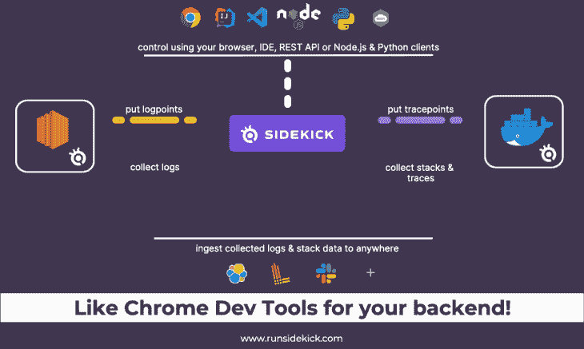
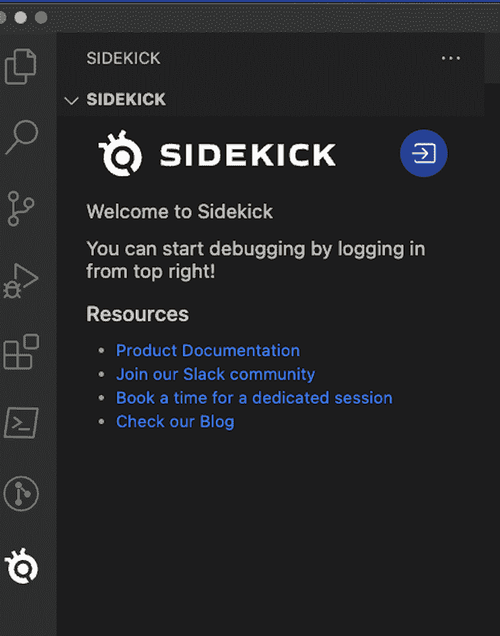
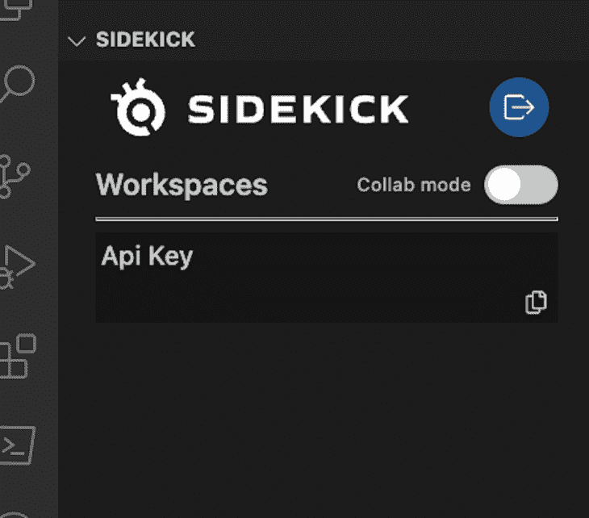
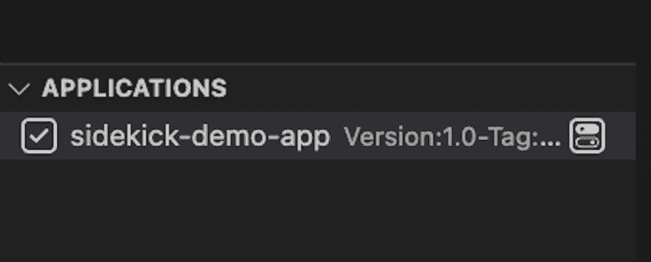
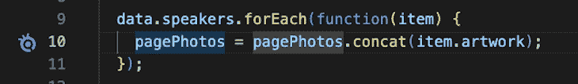
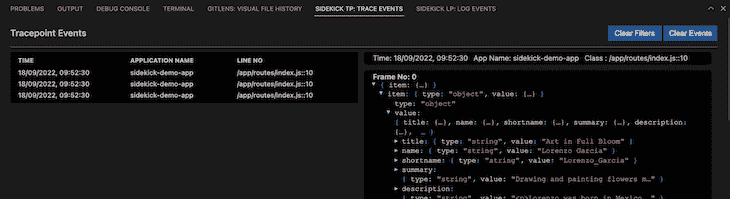
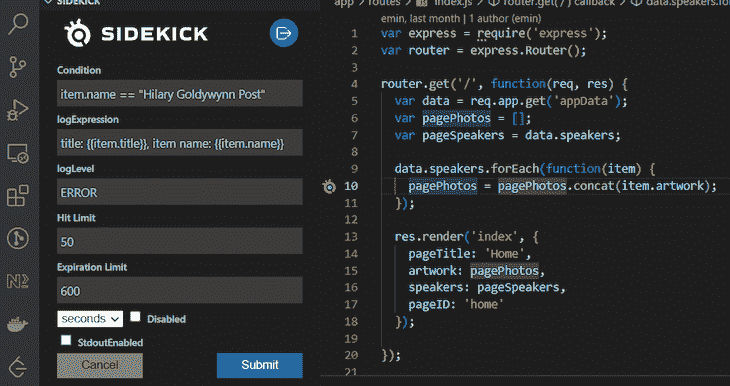
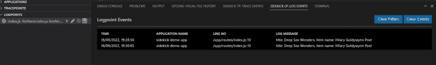
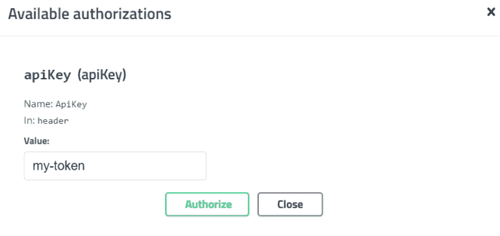
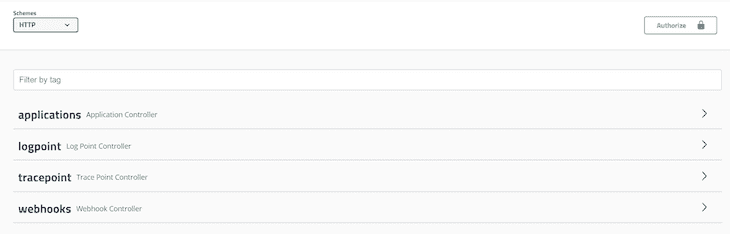

# 用 Sidekick 像调试前端一样调试后端

> 原文：<https://blog.logrocket.com/debugging-backend-frontend-sidekick/>

如果你是一名开发人员，你就会知道在远程环境中调试一个应用程序是多么痛苦和耗时。调试远程应用程序的典型过程包括构建和部署、使用远程调试工具来识别问题、实施修复以及再次迭代该过程。

Sidekick 是一款实时应用调试器，旨在解决这一问题。它提供了在远程环境中进行调试的能力，就像在本地环境中一样。官方文档宣称 Sidekick“就像你后端的 Chrome 开发工具”

Sidekick 最近发布了一个开源版本，允许开发人员自托管，并包括商业版本提供的所有实时调试功能。在本文中，我们将重点关注开源版本。

*向前跳转:*

## 远程调试选项

随着越来越多的应用程序迁移到云端，现有的调试工具和技术变得越来越不够用。在我们深入 Sidekick 之前，让我们看看调试远程应用程序的传统技术，以及它们的不足之处。

### 远程调试

使用传统的远程调试工具，开发人员通过为调试器打开的端口，在程序运行于远程环境时调试程序。许多工具或平台都提供远程调试功能。例如，可以使用 Visual Studio 代码进行远程调试。NET 应用程序，方法是将 Visual Studio 连接到远程服务器。但是，一旦远程调试遇到调试断点，远程服务器将被阻止。

在调试过程中暂停正在运行的服务会对非生产环境中的其他用户造成干扰。由于显而易见的原因，在生产环境中通常不允许这样做。另一个问题是所需开放端口的安全性问题。

### 助手和非侵入式调试

与传统的远程调试工具相比，Sidekick 允许开发人员设置非侵入式断点。Sidekick 将点的位置传达给 Sidekick 代理。当代码执行时，代理获取应用程序状态的快照，包括调用堆栈和变量，而不停止应用程序。因此，开发人员可以在不暂停应用程序的情况下调试代码。

在撰写本文时，Sidekick 正在为 [Java](https://www.runsidekick.com/java-debugger) 、 [Python](https://www.runsidekick.com/python-debugger) 和 [Node.js](https://docs.runsidekick.com/installation/installing-agents/node.js) 运行时工作。开发人员可以使用 Sidekick Web IDE、VSCode 或 IntelliJ IDEA 来设置跟踪点或日志点。

## Sidekick 是如何工作的？

Sidekick 由三层组成:经纪人、代理人和客户。



Source: [Sidekick documentation](https://docs.runsidekick.com/)

如上图所示，Sidekick 代理控制着客户端和代理之间的通信。代理包括收集快照数据和生成动态日志的层。它与要调试的应用程序一起部署。

代理还接收来自代理的命令。当代码到达一个日志点或跟踪点时，它收集数据并通过代理将其发送回客户端。

客户端是允许用户与代理交互的界面。它以 Sidekick IDE、IDE 扩展或 Sidekick REST API 的形式提供。对于 Sidekick 开源，只有 IDE 扩展和 REST API 可用。

目前，IDE 扩展可用于 VSCode 和 IntelliJ IDEA。

REST API 允许您通过 HTTP 协议对日志点和跟踪点应用 CRUD 操作。它开辟了一种以编程方式控制代理的无头方式，并通过代码利用您收集的数据。

## 什么是跟踪点和日志点？

Sidekick 的核心特性是跟踪点和登录点。

跟踪点是一个不间断的远程断点。与普通断点相比，跟踪点不会暂停代码执行，而是在代码到达该行时拍摄变量和调用堆栈的快照。

它被称为跟踪点而不是断点，因为它集成了桑德拉的分布式跟踪技术。正是这种跟踪技术实现了同一个事务中的几个跟踪点之间的连接。

logpoint 允许开发人员向正在运行的应用程序添加日志表达式。日志点可以在不改变源代码的情况下动态添加。

Logpoints 为 Sidekick 用户的按需日志记录开辟了道路。用动态日志记录取代传统日志记录有可能降低阶段大小、成本，并节省日志搜索、重新部署或重启应用程序的时间。

## 安全功能

Sidekick 在多个级别上加强了安全性。

*   源代码:Sidekick 服务器不存储任何实际的源代码。Sidekick 的后端服务器在调试期间只接收以下内容:
    *   文件路径
    *   行数
    *   源文件的哈希
*   数据传输:所有应用层(第 7 层)级的通信都是基于 HTTPS 的，基于网络层(第 3-4 层)的通信都是基于 SSL 的
*   通用数据保护法规(GDPR): Sidekick 符合 GDPR 标准

## 入门指南

让我们使用所提供的 Docker 映像，浏览一下配置 Sidekick 开源及其快速启动 Node.js 项目的过程。

* * *

### 更多来自 LogRocket 的精彩文章:

* * *

由于 Docker 镜像用于安装 Sidekick 进行自托管，我们需要确保 Docker 守护进程正在运行。

要在您的首选操作系统中安装 Docker，请参考[官方文档](https://docs.docker.com/get-docker/)。

### 装置

首先，我们需要克隆 Sidekick repo:

```
git clone https://github.com/runsidekick/sidekick.git
```

导航到`[Project Root]/sidekick/docker`，运行以下命令:

```
Docker-compose up -d
```

上述命令将设置以下本地实例:

*   用于 Sidekick 的 MySQL 数据库
*   `sidekick-api` : Sidekick REST API
*   `sidekick-broker`:管理客户端和代理之间数据流的代理

现在，我们可以在 VSCode 中打开快速入门应用程序文件夹。从左侧菜单中选择**扩展**，搜索并安装 VSCode 的 Sidekick 扩展。

安装完成后，Sidekick 扩展图标将显示在左侧菜单的底部。



然后，点击 Sidekick **登录**按钮，将代理连接到 Sidekick 代理。你会注意到 Sidekick VS 代码扩展变成了连接模式。



下一步，我们可以克隆快速入门示例项目:

```
git clone https://github.com/boroskoyo/sidekick-nodejs-quickstart.git
```

快速启动项目包括一个内置的 Sidekick Node.js 代理。在`app.js`文件中，代理初始化并启动如下。

```
var sidekickDebugger = require('@runsidekick/sidekick-agent-nodejs');

sidekickDebugger.start({
  apiKey:"my-token", 
  SIDEKICK_AGENT_APPLICATION_NAME: "sidekick-demo-app",
  SIDEKICK_AGENT_LOG_LEVEL:"debug",
  SIDEKICK_AGENT_BROKER_HOST: "ws://127.0.0.1",
  brokerPort:7777,
  applicationVersion:"1.0",
  applicationStage :"lab"
});
```

运行以下命令启动快速启动应用程序。

```
cd sidekick-nodejs-quickstart
npm install
npm start
```

现在，我们已经运行了自托管的 Sidekick 实例和快速启动应用程序。我们试着用 Sidekick tracepoint 和 logpoint 调试一下。

### 设置跟踪点

在添加跟踪点之前，我们需要在左侧菜单的**应用程序**面板中选择`sidekick-demo-app`。



然后在 VS 代码中打开`app/routes/index.js`，右击第 10 行添加跟踪点，选择 **Sidekick** > **添加跟踪点**。跟踪点图标将添加到该行的左侧:



然后，打开浏览器，导航到 [https://localhost:3000](https://localhost:3000) 。这将触发应用程序和跟踪点事件的输出。



### 使用日志点

打开 VS 代码中的`app/routes/index.js`，右键点击第 10 行，选择**Sidekick**>**Add logpoint**，添加一个 log point。该行左侧将添加一个 logpoint 图标，以及 Logpoint UI。

您可以通过以下方式配置日志点:

*   条件:可选的条件过滤器
*   logExpression:日志输出的表达式
*   命中限制:允许的最大命中次数
*   过期限制:日志点的过期时间



点击**提交**保存登录点；它将显示在 logpoint 面板中:



## 通过 REST API 公开实时调试器

Sidekick 通过 REST 端点公开了所有的实时调试功能。对于自托管的 Sidekick，可以在 URL
[`http://localhost:8084/swagger-ui.html`](http://localhost:8084/swagger-ui.html) 看到 API 的 swagger 接口。

要使用 API，您需要输入`apiKey`进行授权。`apiKey`可以在`app.js`的 Node.js 代理配置中找到。



API 端点包括 tracepoint、logpoint 和 webhooks 的标准 CRUD。



## 性能和成熟度

Sidekick 代理是轻量级的，几乎不增加应用程序执行的开销。在 Sidekick 最近的[基准博客](https://medium.com/runsidekick/sidekick-blog-production-debuggers-2022-benchmark-results-part-1-ec173d0f8ccd)中，对与演示应用程序一起部署的 Java 代理的消极影响进行了测试。测试结果显示，所有三个代理的开销都可以忽略不计。

2022 年 8 月 Sidekick 开源刚刚发布，2021 年其商业版作为独立产品推出。写的时候 [Sidekick 开源 GitHub repo](https://github.com/runsidekick/sidekick) 有 1.5K 星 57 叉。作为一个新的工具，它还需要一段时间来成熟和被开发者社区所认可。

GitHub 中的 Sidekick repo 得到了积极的维护，提出的问题得到了及时的回应。

## 摘要

Sidekick 提供了一个可行的解决方案来解决与实时调试和日志记录需求相关的棘手问题。它是安全的、轻量级的，并且与传统的远程调试工具不同，它提供了非侵入式的调试功能。

我希望这篇文章能引起您的兴趣，让您尝试一下这个新的、有前途的工具。

## 您是否添加了新的 JS 库来提高性能或构建新特性？如果他们反其道而行之呢？

毫无疑问，前端变得越来越复杂。当您向应用程序添加新的 JavaScript 库和其他依赖项时，您将需要更多的可见性，以确保您的用户不会遇到未知的问题。

LogRocket 是一个前端应用程序监控解决方案，可以让您回放 JavaScript 错误，就像它们发生在您自己的浏览器中一样，这样您就可以更有效地对错误做出反应。

[](https://lp.logrocket.com/blg/javascript-signup)[https://logrocket.com/signup/](https://lp.logrocket.com/blg/javascript-signup)

[LogRocket](https://lp.logrocket.com/blg/javascript-signup) 可以与任何应用程序完美配合，不管是什么框架，并且有插件可以记录来自 Redux、Vuex 和@ngrx/store 的额外上下文。您可以汇总并报告问题发生时应用程序的状态，而不是猜测问题发生的原因。LogRocket 还可以监控应用的性能，报告客户端 CPU 负载、客户端内存使用等指标。

自信地构建— [开始免费监控](https://lp.logrocket.com/blg/javascript-signup)。