# 在 Remix IDE - LogRocket 博客中调试以太坊事务

> 原文：<https://blog.logrocket.com/debugging-ethereum-transactions-remix-ide/>

Web3 现在正在蓬勃发展。使用以太坊智能合约可以做的事情完全不同；开发人员已经在以太坊区块链上为多种用例创建智能合同，包括 NFTs、加密货币、收款和以分散方式管理数据。

像所有其他编程语言一样，Solidity(用于创建智能合约的语言)也需要调试，以便应用程序正常工作。使用 [Remix IDE](https://remix.ethereum.org) ，您可以找到合适的调试工具，以便您可以跟踪智能合约的状态如何随着代码的执行而变化，查看任何给定点的变量值，等等。今天，我们将讨论如何正确调试 Solidity 契约。

## 要求

*   坚实的工作知识——我不会向新手推荐这个教程
*   获取混音。在本教程中，我们不会使用像 Visual Studio 代码这样的代码编辑器

## 创建智能合同

当你打开 Remix 时，导航到`contracts`文件夹并创建一个名为`Debugging.sol`的新文件。添加以下内容:

```
// SPDX-License-Identifier: MIT
pragma solidity ^0.8.4;
contract Debugging {
    uint256 counter;
    constructor(uint256 _counter) {
        counter = _counter;
    }
    function _setCounter(uint256 _counter) internal {
        counter = _counter;
    }
    function increment(uint256 value) public {
        uint256 newValue = counter + value;
        _setCounter(newValue);
    }
    function decrement(uint256 value) public {
        uint256 newValue = counter - value;
        _setCounter(newValue);
    }
    function getCounter() public view returns(uint256) {
        return counter;
    }
}

```

以上是用 Solidity 编写的基本智能合约的代码。它跟踪一个计数器。为了在调试时演示契约的流程，我制作了比严格要求更多的函数。

请注意，我们在本教程中使用的是 v0.8.4，但是您可以随意更改编译器设置以匹配该版本，或者使用完全不同的版本。

## 编译和部署智能合同

现在转到编辑器的编译器选项卡，这是侧边栏上的第二个图标，您应该会看到编译器设置。


继续点击**编译 Debugging.sol** 。现在转到**部署**选项卡，这是侧边栏上的第三个图标。您将看到如下所示的部署选项卡:

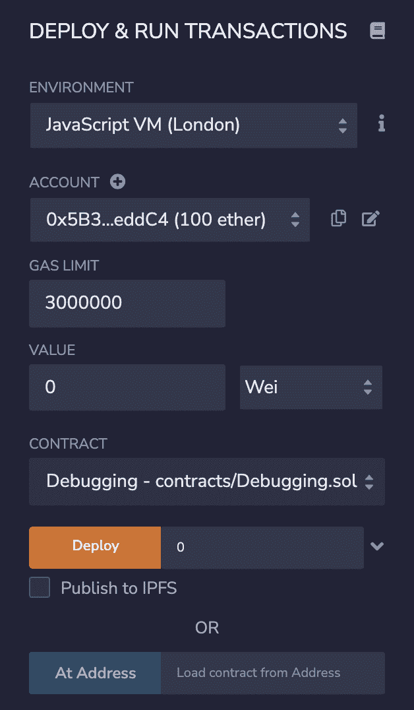

确保环境设置为一个 JavaScript 虚拟机，我们不会在本教程中讨论实际网络的部署，但它应该工作得差不多。在 **Deploy** 按钮附近的构造器字段中添加一个计数器。我已经把它设置为零，这将设置计数器的初始值。

点击**部署**后，您应该会在**部署合同**部分看到您的智能合同:

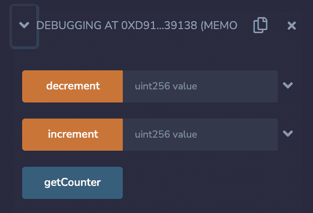

这些是我们在智能合约中公开的功能，可以通过这些按钮访问。使用按钮附近的文本框，您可以通过函数传递参数。

## 调试智能合约

现在让我们进入有趣的部分，调试智能契约。为了进行调试，我们首先需要创建一个事务，这意味着我们需要与我们想要调试的智能契约的部分进行交互。

在这种情况下，我将使用`increment`函数作为示例，并将`1`作为参数传递，以将计数器加 1。按下`increment`功能运行智能合约。当交易完成或失败时，您将在 Remix 终端中看到类似这样的内容:

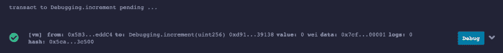

现在，按下**调试**按钮，我们将看到调试器:

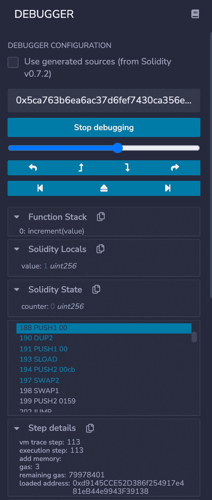

这个面板上有很多按钮和信息。让我们看看这里的按钮是什么意思:


以下是标签的描述:

1.  **后退**返回上一步。函数调用将被忽略，调试器不会进入该函数
2.  **后退**返回上一步。函数不会被忽略，调试器将进入这些函数
3.  **进入**进入下一步，如果有函数调用，调试器将进入函数
4.  **向前一步**进入下一步，但是函数调用被忽略，调试器不会进入函数
5.  **跳转到上一个断点**将调试器带到最后访问的断点。通过单击代码的行号可以设置断点
6.  **跳出**将调试器带到函数的末尾
7.  **跳转到下一个断点**将调试器带到编辑器中设置的下一个断点

您还可以使用滑块，并在滑块移动时模拟交易。

现在让我们调试一下，看看`increment`函数的流程是如何运行的。当您第一次在这个事务上启动调试器时，您应该看到这部分代码突出显示:

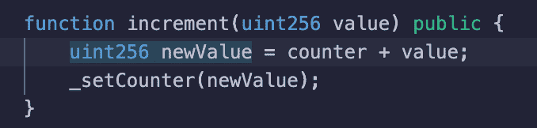

这意味着正在创建`newValue`变量。当我们按下**进入**时，您应该看到代码在`counter`和`value`附近高亮显示，模拟加法是如何工作的。

最终，在几个步骤之后，你会看到**实度局部**面板像这样变化:

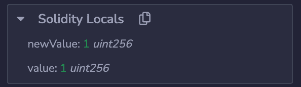

这意味着`newValue`(代码至此)的当前值是 1。再往前走几步，您将看到自己在一个内部函数中，该函数将像这样突出显示:

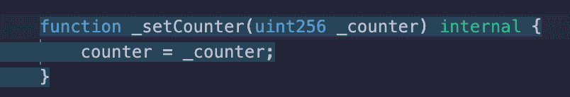

这意味着控制权被传递给内部函数`_setCounter`。现在你会看到先前的实性局部变量已经消失，因为它们是`increment`函数的局部变量，在`_setCounter`中无效。

再走几步，你会看到你的**固体状态**面板将初始计数器改变为新值，如下所示:

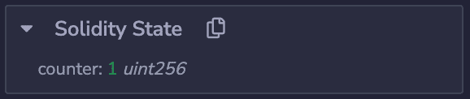

此时，我们可以确定这一行代码改变了状态。这就是你调试 Solidity 智能合约的方法！这是非常基本的契约，所以调试非常容易。在相对较大的合同中，您可能需要一直跟踪变量和状态。

## 更多的调试功能

以下是几个可能对您有用的面板:

### 功能堆栈

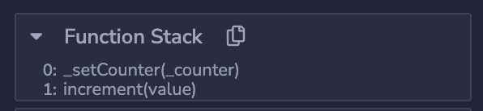

您可以从这个面板中获得很多信息，比如哪个函数当前正在执行，哪个函数调用了它。如果有多个函数，它将显示在一个堆栈中。

### 全局变量


您可以跟踪事务中的全局变量，以防需要知道发送者或事务中的其他数据。

### 步骤详情

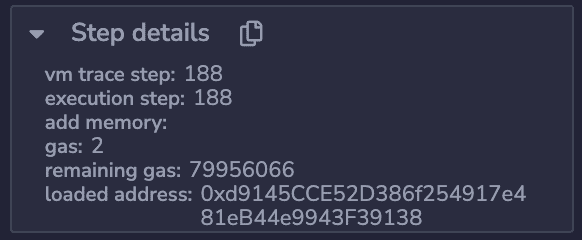

您可以在这里获得一些额外的步骤数据，如已用气体和剩余气体。

### 操作码

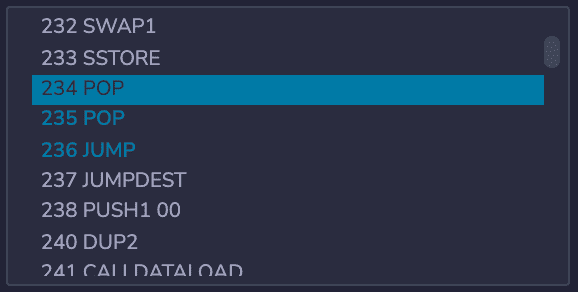

使用操作码，您可以获得有关合同当前步骤的高级信息。你可以找出程序什么时候执行`JUMP`这样的步骤。

## 结论

知道如何调试是很重要的，我相信这篇文章让您知道了如何以适当的方式调试智能合约。您仍然应该尝试使用一些复杂的程序进行实验，比如通过合同发送以太坊，然后看看流程如何工作。

## 加入像 Bitso 和 Coinsquare 这样的组织，他们使用 LogRocket 主动监控他们的 Web3 应用

影响用户在您的应用中激活和交易的能力的客户端问题会极大地影响您的底线。如果您对监控 UX 问题、自动显示 JavaScript 错误、跟踪缓慢的网络请求和组件加载时间感兴趣，

[try LogRocket](https://lp.logrocket.com/blg/web3-signup)

.

[](https://lp.logrocket.com/blg/web3-signup)[https://logrocket.com/signup/](https://lp.logrocket.com/blg/web3-signup)

LogRocket 就像是网络和移动应用的 DVR，记录你的网络应用或网站上发生的一切。您可以汇总和报告关键的前端性能指标，重放用户会话和应用程序状态，记录网络请求，并自动显示所有错误，而不是猜测问题发生的原因。

现代化您调试 web 和移动应用的方式— [开始免费监控](https://lp.logrocket.com/blg/web3-signup)。