# 用 Altair - LogRocket 博客调试 GraphQL

> 原文：<https://blog.logrocket.com/debugging-graphql-with-altair/>

GraphQL 为客户机提供了有选择地请求所需数据的能力和灵活性。因此，随着时间的推移，GraphQL 使得 API 的发展变得更加容易。

[Altair](https://altair.sirmuel.design/) 是一个探索 API 的 GraphQL API 客户端。邮差休息和制图是一样的。Altair 为传统的 GraphiQL 和 Playground 提供了一个很好的替代品。它功能丰富，易于使用，并带有内置调试器，非常适合调试。

在本文中，我们将学习如何使用 Altair 调试 GraphQL APIs。所以，让我们从下一节的先决条件开始。

## 先决条件

要从本文中获得最大收益，需要满足以下条件:

*   GraphQL 的基础知识
*   使用 API 的基本知识
*   最新版的[牛郎星](https://altair.sirmuel.design/)
*   使用 GraphQL API 客户端(如 Altair、Playground 或 GraphQL)的基本知识

## 用 Altair 调试

虽然 [Altair](https://github.com/altair-graphql/altair) 绝对是一个功能丰富的 API 客户端，但我们对本文中它的调试功能感兴趣。

在编程中，调试就是找出问题的根本原因并解决它。在开发过程中，我们希望能够更快地调试跨 API 的不同组件发生的任何错误。使用的一些调试策略包括:

*   蛮力技术，如记录一切，调整一切，尝试一切
*   回溯技术，比如从错误中后退，并向工作中前进

让我们看看 Altair 如何简化我们的调试方法。

Altair 通过允许我们操作输入和检查输出来促进调试，以便更好地理解两者之间的关系。

作为一款[电子](https://www.electronjs.org/apps/altair)应用，Altair 自带一个内置的开发者工具，简单来说就是 Chromium 浏览器的开发者工具。这是因为 Electron 结合了 Chromium 渲染引擎和 Node.js 运行时。

Chromium 浏览器本质上是无品牌的 Chrome，两款浏览器都使用了 Blink 渲染引擎和 v8 JavaScript 引擎。因此，它们对 CSS、HTML、DOM 呈现、JavaScript 兼容性、功能和性能提供了相同的支持。

[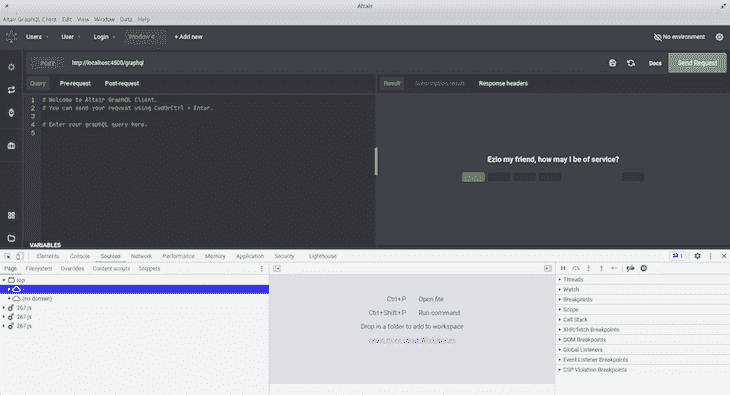](https://blog.logrocket.com/?attachment_id=103287)

当使用 Altair 进行调试时，我们同时使用 Altair API 客户端和 Altair 开发工具。

Altair 客户端使我们能够操作输入和检查数据。因此，它允许我们检查请求和响应的所有部分——特别是 HTTP 响应和错误消息。

因此，我们可以:

*   更新参数、标题和查询
*   参见 HTTP 状态代码和[错误信息](https://blog.logrocket.com/handling-graphql-errors-like-a-champ-with-unions-and-interfaces/)
*   解析响应
*   检查变量
*   查看查询和订阅结果
*   在**历史记录**部分重放呼叫

Altair 开发工具为我们提供了这些有用的特性:

*   控制台——记录语句、检查变量和测试任意修复和错误的好地方
*   **网络**标签——检查网络通话的好地方
*   Chromium developer tool 的其他特性，如[源面板](https://developer.chrome.com/docs/devtools/javascript/sources/)、[性能面板](https://developer.chrome.com/docs/devtools/evaluate-performance/)、[灯塔](https://developer.chrome.com/docs/devtools/speed/get-started/)等。注意，GraphQL 解析器运行在服务器上，服务器的代码不会出现在开发者工具的 **Sources** 面板中

让我们在下一节中了解更多关于开发人员工具的信息。

## 用 Altair 调试 GraphQL APIs

为此，我们需要一个 GraphQL 项目；你可以使用你自己的或者[从这里](https://github.com/lawrenceagles/fastify-graphQL-Altair)克隆演示项目。

该项目是一个简单的节点应用程序，它解析我们的 GraphQL 查询并从模拟数据返回结果:

```
export default {
    users: [
        { id: 1, username: 'JohnDoe', email: '[email protected]', password: '12345', role: 'admin' },
        { id: 2, username: 'JaneDoe', email: '[email protected]', password: '12345', role: 'user' },
        { id: 3, username: 'JoeDoe', email: '[email protected]', password: '12345', role: 'user' }
    ]
};

```

`user`和`users`字段受到保护，它们都需要管理员级别的权限才能访问。只有`login`查询不受保护。在本文中，我们的目的不是学习项目是如何构建的，而是学习如何使用这个应用程序调试 GraphQL APIs。

我们将专注于此。让我们设置项目并开始调试。

### 项目设置

按照以下说明设置项目:

*   创建一个项目目录并`cd`进入该目录:

```
mkdir <-- project name -->
cd <-- project name -->
```

*   克隆项目并安装依赖项:

```
// clone project
git clone https://github.com/lawrenceagles/fastify-graphQL-Altair

// install dependencies
npm install
```

*   通过运行以下命令启动服务器:

```
npm start
```

通过这项工作，我们获得了:

```
> [email protected] start /home/eagles/Work/projects/fga
> node  --es-module-specifier-resolution=node ./src/index.js

{"level":30, "time":1646401128942, "pid":8565, "hostname":"your-pc-model","msg":"Server listening at http://127.0.0.1:4500"}

```

设置好这些之后，我们将学习如何处理这些调试问题:偶数源错误事件、404 未找到、401 未授权、403 禁止和 400 错误请求。

随着我们的学习，我们将尝试复制和调试这些错误。先说 401 非授权错误。

### 401 未经授权

当用户身份验证失败时，会出现 [401 未授权错误](https://developer.mozilla.org/en-US/docs/Web/HTTP/Status/401)，这可能是由以下不同原因造成的:

*   错误的登录凭证(用户名、电子邮件和密码)
*   用户未能提供令牌
*   用户提供了无效的令牌

让我们使用 Altair 客户端在应用程序中复制并调试这个错误。打开您的 Altair 客户端，使用以下代码运行`login query`:

```
query{
    login(username: "JaneDoe", password: "12345xxx") {
        role
        token
    }
}

```

确保将以下`URL`添加到 Altair 以访问我们的服务器:`[http://localhost:4000/graphql](http://localhost:4000/graphql)`。然后，用`CTRL + SHIFT + I`打开 Altair 开发者工具。

当我们运行查询时，我们得到:

[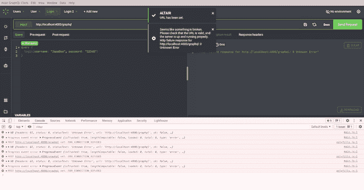](https://blog.logrocket.com/?attachment_id=103289)

从上面的图像中，我们看到 Altair 给了我们有用的错误警告，警告我们关于`URL`。此外，我们得到了著名的`ERR_CONNECTION_REFUSED`铬错误。

这是因为我们的`URL` `[http://localhost:4000/graphql](http://localhost:4000/graphql)`不正确。我们的服务器运行在端口`4500`上，我们在`URL`构造中使用端口`4000`。这是故意制造这个错误的。由于本文的重点是调试，所以我们会故意抛出一个错误供我们调试。

将您的 Altair `URL`更新为`[http://localhost:4500/graphql](http://localhost:4500/graphql)`并重试——确保清空您的控制台。

现在我们得到:

[](https://blog.logrocket.com/?attachment_id=103291)

这立即告诉我们，我们的凭证有问题。我们可以通过删除密码中的`xxx`并重试来轻松解决这个问题。

现在我们得到:

[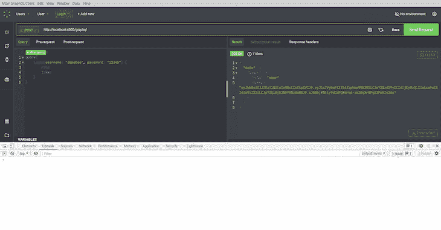](https://blog.logrocket.com/?attachment_id=103295)

当我们在没有提供有效令牌的情况下查询受保护的 API 时，也会抛出`401`未认证错误。在我们的应用程序中，`users`类型是受保护的。在您的 Altair 客户端中打开一个新标签，并使用以下代码查询该类型:

```
query {
  users {
    id
    username
    password
    email
    role
  }
}

```

现在我们得到:

[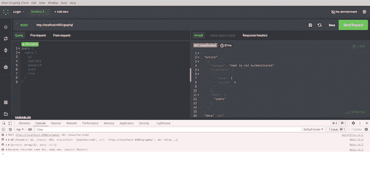](https://blog.logrocket.com/?attachment_id=103297)

因为我们在前面的查询中生成了一个令牌，所以让我们使用它，看看我们得到了什么。我们将这样做，因为我们了解了 403 禁止错误。

### 403 禁止

让我们学习如何解决一个 [403 禁止错误。](https://developer.mozilla.org/en-US/docs/Web/HTTP/Status/403)为了认证一个用户，我们的 API 要求我们使用`x-user`作为密钥通过头部传递一个令牌。

在前面的例子中，我们未能查询到`users`类型，因为我们没有通过身份验证。但是由于我们已经在登录示例中生成了一个令牌，复制该令牌并将其添加到`users`查询中，如下所示:

[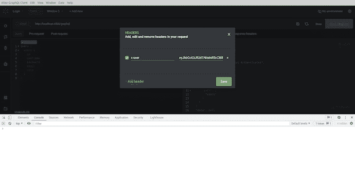](https://blog.logrocket.com/?attachment_id=103299)

点击**保存**并再次运行查询。

现在我们得到:

[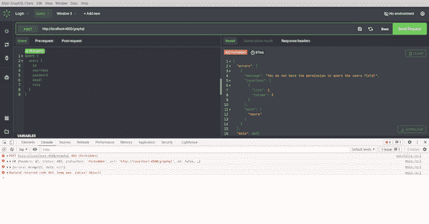](https://blog.logrocket.com/?attachment_id=103301)

上面的 403 错误告诉我们，我们没有权限查询`users`字段。在我们的应用程序中，所有用户都有一个角色——即 admin 或 user——这用于确定用户可以执行什么操作。`users`类型需要一个`admin`角色或特权来查询它。因此，服务器理解我们的查询，但拒绝授权，因为我们没有所需的权限。

让我们使用另一个用户凭证登录，即管理员`JohnDoe`，并使用角色为`admin`的用户生成另一个令牌。

在您的 Altair 客户端中打开一个新标签，并运行下面的代码:

```
query{
    login(username: "JohnDoe", password: "12345") {
        role
        token
    }
}

```

现在我们得到:

[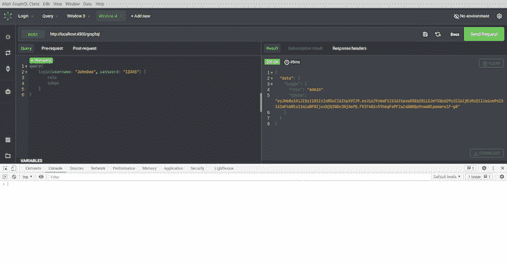](https://blog.logrocket.com/?attachment_id=103304)

最后，使用这个令牌再次运行`users`查询。我们得到了:

[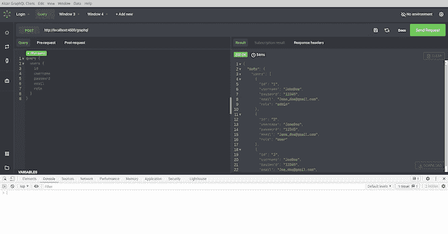](https://blog.logrocket.com/?attachment_id=103306)

## 404 未找到

当服务器找不到我们查询的资源时，抛出 [`404`未找到](https://developer.mozilla.org/en-US/docs/Web/HTTP/Status/404)错误。

要复制此错误，我们将使用下面的代码查询单个用户:

```
query{
    user(id: 10) {
        username
        email
        password
        role
    }
}

```

现在我们得到:

[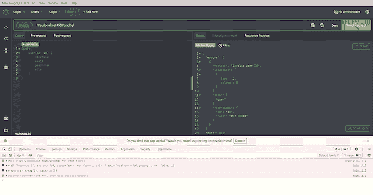](https://blog.logrocket.com/?attachment_id=103308)

通过查看 Altair **Results** 选项卡的查询结果，我们看到错误消息显示“无效的用户 id”

让我们使用一个已存在的用户再次尝试查询。使用下面的代码:

```
query{
    user(id: 1) {
        username
        email
        password
        role
    }
}

```

现在我们得到:

[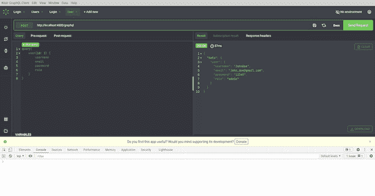](https://blog.logrocket.com/?attachment_id=103310)

### 400 错误请求

当查询中存在语法错误时，会抛出一个 [400 错误请求](https://developer.mozilla.org/en-US/docs/Web/HTTP/Status/400)错误，它表示服务器因为客户端请求中的错误而拒绝处理该查询。

GraphQL 已经通过类型检查提供了某种程度的帮助来防止这种错误。一旦查询有不正确的语法，它就会在 Altair 中用红色的波浪线加下划线。

考虑下面的代码:

```
query{
    user(id: 1, password: "12345") {
        username
        email
        password
        role
    }
}

```

在`user`查询中，我们只需要一个`id`参数，但是上面的查询提供了一个额外的`password`参数。

盲目运行该查询将导致如下所示的`400 Bad Request`:

[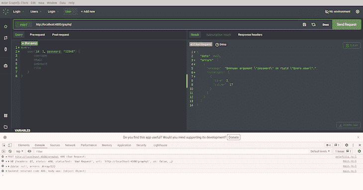](https://blog.logrocket.com/?attachment_id=103312)

## 结论

Altair 是一个很棒的 GraphQL API 客户端，正在受到越来越多的关注。你可以在这里得到所有牛郎星功能的列表。

在本文中，我们学习了如何使用 Altair 开发工具来调试 GrapqhQL APIs。

值得注意的是，我们只专注于调试客户端 grapqql。GraphQL 逻辑(比如我们的解析器)不能在客户端使用 Altair 进行调试，因为它运行在服务器上——在我们的示例应用程序中，是 Node.js 服务器。因此，调试这个服务器端的 GrapqQL 可以用类似 [VSCode](https://blog.logrocket.com/how-to-debug-node-js-apps-in-visual-studio-code/) 的东西来完成。

我希望你学到了足够的知识，可以在下一个 GraphQL 项目中尝试一下 Altair。

## 监控生产中失败和缓慢的 GraphQL 请求

虽然 GraphQL 有一些调试请求和响应的特性，但确保 GraphQL 可靠地为您的生产应用程序提供资源是一件比较困难的事情。如果您对确保对后端或第三方服务的网络请求成功感兴趣，

[try LogRocket](https://lp.logrocket.com/blg/graphql-signup)

.

[](https://lp.logrocket.com/blg/graphql-signup)[https://logrocket.com/signup/](https://lp.logrocket.com/blg/graphql-signup)

LogRocket 就像是网络和移动应用的 DVR，记录下你网站上发生的每一件事。您可以汇总并报告有问题的 GraphQL 请求，以快速了解根本原因，而不是猜测问题发生的原因。此外，您可以跟踪 Apollo 客户机状态并检查 GraphQL 查询的键值对。

LogRocket 检测您的应用程序以记录基线性能计时，如页面加载时间、到达第一个字节的时间、慢速网络请求，还记录 Redux、NgRx 和 Vuex 操作/状态。

[Start monitoring for free](https://lp.logrocket.com/blg/graphql-signup)

.