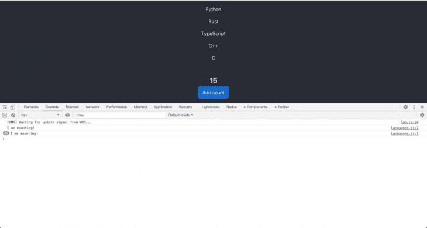
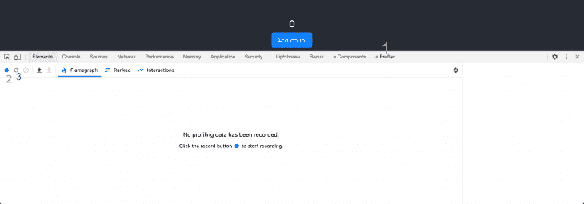
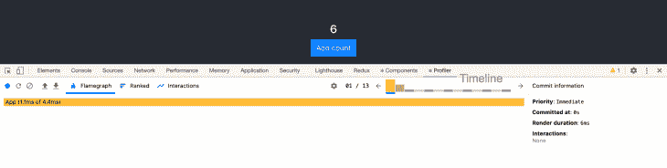
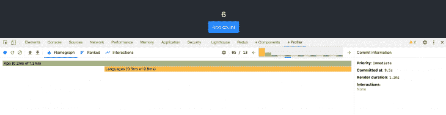
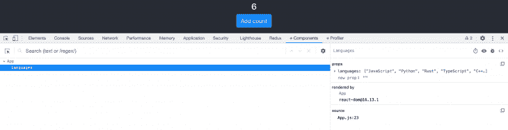
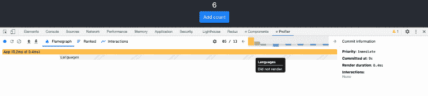
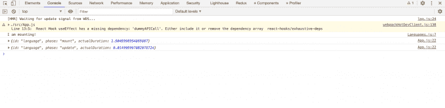

# 使用 React Profiler API 和 Profiler DevTool - LogRocket 博客调试 React 应用程序

> 原文：<https://blog.logrocket.com/debugging-react-applications-with-the-react-profiler-api-and-the-profiler-devtool/>

## 先决条件

要从本教程中获得最大收益，需要一些 React 知识。此外，了解使用`React.memo`进行 React 和组件级记忆的性能优化更佳。

## 衡量绩效的工具

React 中有几个工具可以衡量性能优化。但是在这篇文章中，我们关注的是`React profiler DevTool`和`React Profiler API`。

在继续之前，需要注意的是性能是一个折衷。因此，优化后您可能会得到一个更慢的应用程序。
使用`React Profiler DevTool`和`React Profiler API`这样的工具来衡量应用技术的成功/失败是很重要的。

## 通过记忆优化性能

在这一节和下一节中，我将使用一种称为记忆化的特殊技术来阐述性能优化。然后，我将把它应用到一个示例应用程序中，并使用`React profiler DevTool`和`React Profiler API`来测量它的效果。

## 什么是记忆化？

> 在计算中，记忆化是一种优化技术，主要用于通过存储昂贵的函数调用的结果并在相同的输入再次出现时返回缓存的结果来加速计算机程序。
> –[维基百科](https://en.wikipedia.org/wiki/Memoization)

一个应用程序在其整个生命周期中执行几个昂贵的、长时间运行的计算。记忆化的思想是在一个纯函数中处理这些计算。这些计算所需的所有依赖项都作为参数传递，当函数返回时，其值被缓存。每当使用相同的参数调用函数时，都会返回缓存的值。这意味着没有不必要的函数调用，因此，耗时的`long-running I/O`可以在瞬间发生。这带来了巨大的性能优势。

虽然记忆化很好，但也有不好的一面。随着我们继续存储不同依赖项的结果，缓存的大小也在增长。一言以蔽之，我们是在用空间换速度。

我已经给出了记忆化的概述，但是这如何应用于反应呢？

## 反应中的记忆

在 React 应用程序中应用内存化有多种方式。React 为此给了我们`useMemo`和`useCallback`钩子。像`Reselect`这样的库使用内存化，像`lodash`这样的实用程序库有一个 [`_.memoize`](https://lodash.com/docs/#memoize) 功能。

在本教程中，我们将使用`React.memo`。这个函数将一个 React 函数组件作为参数。它会记住当前的渲染输出并跳过不必要的重新渲染，因此只有当组件的`props`改变时，它才会重新渲染组件。

在开始这些之前，让我们回顾一下我们的性能经验法则。


上图显示了 React 应用程序如何呈现其内容。我们看到，当应用程序执行长时间运行的计算时，会显示一个加载组件。当这完成时，内容被呈现给用户。我们还可以看到,`load-time`是执行长时间运行的计算和呈现适当内容所花费的时间。

长时间运行的计算(I/O)是需要大量时间和资源的操作。可能是文件上传、API 调用(请求图库中的所有图像)、复杂的计算等。

在性能优化中，目标是测量每个组件的加载时间，识别导致性能问题的组件，并修复它们。在下一节中，我将通过一个示例应用程序详细阐述这些内容。

## 测量性能优化

为了充分利用本节，您应该按照以下步骤克隆存储库并进行本地设置。

```
git clone https://github.com/lawrenceagles/profiler-demo
```

*   更改应用程序目录:

```
cd profiler-demo
```

```
yarn start or npm start
```

请考虑下面的代码:

```
import "./App.css";
import React, { useEffect, useState } from "react";
// component
import Languages from "./components/Languages";
function App () {
    let topLang = [ "JavaScript", "Python", "Rust", "TypeScript", "C++", "C" ]
    const [ languages, setLanaguages ] = useState([]);
    const [ count, setCount ] = useState(0);
    const dummyAPICall = () => setTimeout(() => setLanaguages(topLang), 5000)

    useEffect(() => {
        dummyAPICall();
    }, []);
    return (
        <div className='App'>
            <header className='App-header'>
                {languages.length === 0 && <h2>Welcome!</h2>}
                {languages.length ? (
                    <Languages languages={languages} />
                ) : (
                    <div className='text-warning text-center m-4'>
                        Loading languages...
                    </div>
                )}
                <hr />
                <h4>{count}</h4>
                <button
                    className='mb-3 btn btn-primary'
                    onClick={() => setCount((count) => count + 1)}
                >
                    Add count
                </button>
            </header>
        </div>
    );
}

export default App;
```

上面的代码只是应用程序的一小部分。当组件`mounts`运行时，它通过调用`dummyAPICall`函数来模拟长时间运行的计算。完成后，语言状态被更新，其值作为`props`传递给语言组件。这两种情况都会触发预期的重新渲染。并显示语言列表。

此外，我们有一个按钮，用于模拟用户与我们的应用程序的交互性。单击时，它会更新计数状态，并按预期触发渲染更新。由于这个事件不影响语言状态或组件，所以语言组件不应该被重新呈现，对吗？嗯，它被重新渲染，这就是问题所在。

从下面的实现来看:

```
import React from "react";
import PropTypes from "prop-types";
const Languages = ({ languages }) => {
    return (
        <div>
            <h3>Top 6 Languages:</h3>
            {(console.log("I am mounting!"),
              languages.map((language, index) => <p key={index}> {language} </p>))
            }
        </div>
    );
};
Languages.propTypes = {
    languages : PropTypes.array.isRequired,
};
export default Languages;
```

这里，我们看到语言组件接收一个`languages prop`(一个数组)，通过它进行映射，并呈现每个数组项。我加了一个`console.log()`语句。这是为了让我们跟踪这个组件被重新渲染了多少次。它不是最熟练的工具，但却非常方便。

考虑下图:



我们可以看到，语言组件被重新呈现的次数与按钮被点击的次数一样多(在本例中是 15 次)。请记住，按钮是用来模拟现实生活中的`UI`组件，如日期选择器、评论框等。这意味着当用户选择日期、发表评论或与我们的`UI`交互时，我们的语言组件将被重新呈现。

像这样的操作在现实世界中是很昂贵的，所以我们必须收集时间信息，以衡量每次渲染的成本。为此，我们将使用`[React Profiler DevTool](https://reactjs.org/blog/2018/09/10/introducing-the-react-profiler.html#flame-chart)`。

在 React 16.5 中引入了`profiler DevTool plugin`。它使用底层的`React profiler API`来收集每个渲染组件的时间信息。这使得它成为识别 React 应用程序中性能瓶颈的一个极好的工具。要使用`profiler DevTool`分析您的组件，请遵循以下步骤:

*   打开控制台，单击 profiler 选项卡



*   我在这个图像中标记了三个重要的项目，第一个(1)是 profiler 选项卡，第二个(2)是 record 按钮，第三个(3)是 reload 按钮
*   要开始分析，我们可以单击 record 或 reload 按钮。这里我们将使用 reload，因为我们希望在我们的分析中捕获挂载阶段和所有渲染
*   单击 reload 按钮，让长时间运行的计算完成。当呈现语言组件时，单击几次按钮，然后单击 record 按钮停止分析。您将得到与此类似的内容:



请注意时间线部分，它显示了一个条形阵列，前两个条形最高，后面是六个相同高度的绿色条形。

第一个表示 App 组件的`mount phase`，所以它花费了最多的时间来渲染。我们可以看到渲染持续时间是`6ms`。`Mounting`比随后的重新渲染更昂贵，因为这是一个`DOM`要求的改变。后续的重新渲染只改变了`DOM`中的一些值，并没有创建新的`DOM node`。



六个绿色条代表从`click event`产生的六个重新渲染。单击每个栏会显示渲染持续时间和更多提交信息。

虽然我们应用程序的大部分渲染都是在毫秒内完成的，但在现实世界中却不是这样。渲染持续时间很容易变得很长，这会极大地影响我们应用程序的性能。这个例子的全部目的是向您展示如何收集性能信息来识别性能瓶颈。此外，更多性能信息可在[火焰图](https://reactjs.org/blog/2018/09/10/introducing-the-react-profiler.html#flame-chart)和[排名聊天](https://reactjs.org/blog/2018/09/10/introducing-the-react-profiler.html#ranked-chart)中找到。

我们需要的一条非常重要的信息是知道每次渲染时`props`的状态。为此，您可以单击时间线中的任何条形，然后单击 components 选项卡。这给了你渲染过程中的组件`props`。



从上图中，我们可以看到语言组件属性在每次重新渲染时都没有改变。这使得每一次重新渲染都变得不必要，而且成本更高，因此，这是我们需要改进应用程序的一个方面。

## 将记忆应用于性能优化

既然我们已经能够确定我们的应用程序中的优化需求，并且我们有一种方法来衡量我们的输入，我们可以继续优化我们的应用程序。

请记住，在内存化中，如果输入(在本例中是`props`)没有改变，则返回一个缓存值，从而提高性能。为此，我们可以使用`React.memo`来记忆语言组件，这样如果`props`没有改变，它就不会重新呈现。

所以`Languages component`可以这样重新实现:

```
import React, {memo} from "react";
import PropTypes from "prop-types";
const Languages = ({ languages }) => {
    return (
        <div>
            <h3>Top 6 Languages:</h3>
            {(console.log("I am mounting!"),
              languages.map((language, index) => <p key={index}> {language} </p>))
            }
        </div>
    );
};
Languages.propTypes = {
    languages : PropTypes.array.isRequired,
};
export default memo(Languages);
```

现在，我们正在导出 memoized languages 组件，只有将`props`传递给它，它才会被重新呈现。

我们现在可以再次开始分析我们的组件，以测量我们的效率。考虑下图。



从上图中，我们看到在时间轴的每个渲染阶段，语言组件都没有渲染。因此，一旦语言组件`mounts`发生变化，它只会在`props`发生变化时重新呈现。这消除了不必要的渲染成本，从而提高了我们的应用程序的性能。

如果你不想处理`React DevTool`你可以直接使用`React profiler API`。

### 分析器组件

Profiler API 是一个组件，它使我们能够收集性能信息来衡量渲染成本:

```
import "./App.css";
import React, { useEffect, useState, Profiler } from "react";
// component
import Languages from "./components/Languages";
function App () {
    let topLang = [ "JavaScript", "Python", "Rust", "TypeScript", "C++", "C" ]
    const [ languages, setLanaguages ] = useState([]);
    const [ count, setCount ] = useState(0);
    const dummyAPICall = () => setTimeout(() => setLanaguages(topLang), 5000)

    useEffect(() => {
        dummyAPICall();
    }, []);
    return (
        <div className='App'>
            <header className='App-header'>
                {languages.length === 0 && <h2>Welcome!</h2>}
                {languages.length ? (
                    <Profiler
                      id="language"
                      onRender={
                          (id, phase, actualDuration) => {
                          console.log({id, phase, actualDuration})
                          }
                      }>
                      <Languages languages={languages} />
                    </Profiler>
                ) : (
                    <div className='text-warning text-center m-4'>
                        Loading languages...
                    </div>
                )}
                <hr />
                <h4>{count}</h4>
                <button
                    className='mb-3 btn btn-primary'
                    onClick={() => setCount((count) => count + 1)}
                >
                    Add count
                </button>
            </header>
        </div>
    );
}

export default App;

```

上面我们已经实现了`Profiler API`,通过简单地导入它并用它包装我们的语言组件。需要两个`props`，它们是:

1.  ID，它是一个字符串
2.  `onRender callback`。这个回调函数有许多参数，但是前三个参数(`id`、`phase`和`actualDuration`)是必需的

在这个`onRender`函数中，我们用这三个参数向控制台记录和对象。这为我们提供了所需的所有性能信息，如下图所示:

## 最后的想法

`React Profiler component`和`React Profiler DevTool`都很神奇，可以一起用。你可以在这里得到更多关于`React Profiler API`T3 的细节。

不建议在生产中使用`React Profiler API`。然而，如果你非常需要它，你可以在这里得到如何在生产中使用它的说明[。我希望这篇文章能更好地改变你的性能优化方法。](https://gist.github.com/bvaughn/25e6233aeb1b4f0cdb8d8366e54a3977)

## 使用 LogRocket 消除传统反应错误报告的噪音

[LogRocket](https://lp.logrocket.com/blg/react-signup-issue-free)

是一款 React analytics 解决方案，可保护您免受数百个误报错误警报的影响，只针对少数真正重要的项目。LogRocket 告诉您 React 应用程序中实际影响用户的最具影响力的 bug 和 UX 问题。

[ ](https://lp.logrocket.com/blg/react-signup-general) [  ](https://lp.logrocket.com/blg/react-signup-general) [LogRocket](https://lp.logrocket.com/blg/react-signup-issue-free)

自动聚合客户端错误、反应错误边界、还原状态、缓慢的组件加载时间、JS 异常、前端性能指标和用户交互。然后，LogRocket 使用机器学习来通知您影响大多数用户的最具影响力的问题，并提供您修复它所需的上下文。

关注重要的 React bug—[今天就试试 LogRocket】。](https://lp.logrocket.com/blg/react-signup-issue-free)