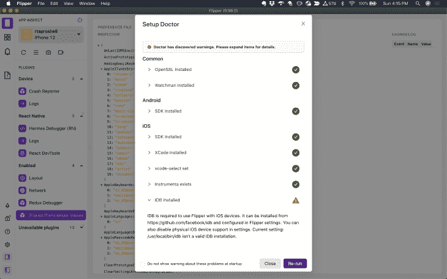
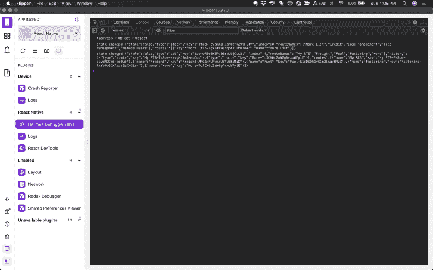
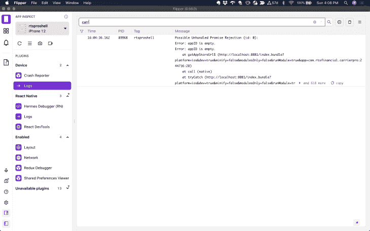
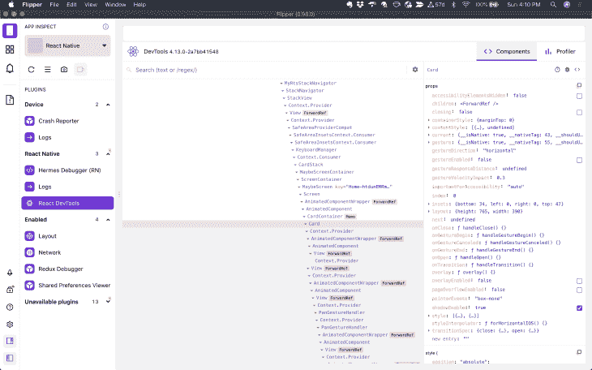
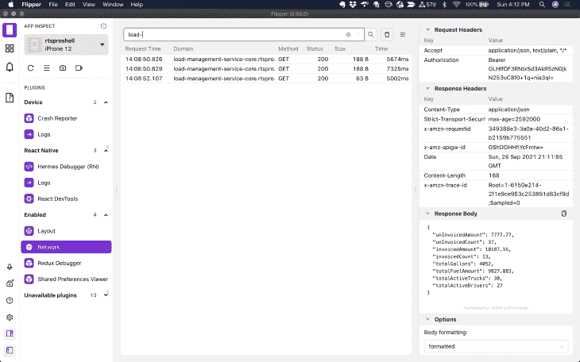
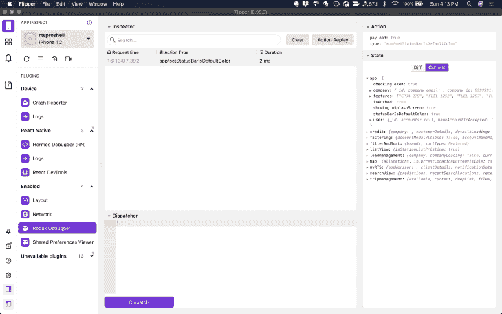
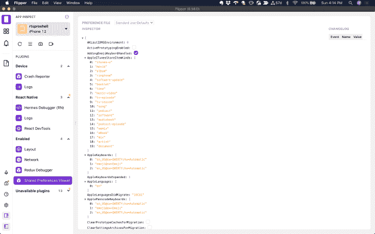
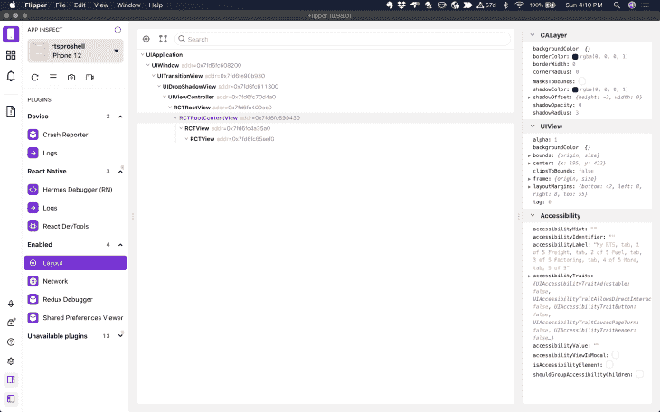
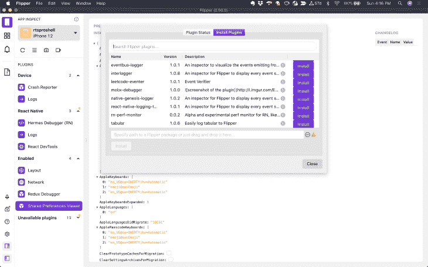
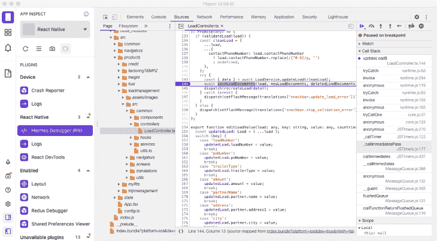

# 用 Flipper 调试 React 原生应用

> 原文：<https://blog.logrocket.com/debugging-react-native-apps-flipper/>

我不得不承认，除非调试器易于使用，否则我通常不会设置它。我已经做了将近 20 年的开发人员，当我开始工作的时候，从来都不容易。

我可以让不同语言的调试器工作一两次，但每当出现问题时就放弃了，而且在很大程度上，直到最近才使用过任何调试器。我主要从事 JavaScript 工作，可以用`console.log`凑合。它工作得足够好，我不必去配置东西的兔子洞。

但后来我了解了 [Flipper](https://fbflipper.com/) ，它是我使用过的任何技术中最好的调试器之一。

## 什么是 Flipper？

您可以仅使用`console.log`在 React Native 中进行一些调试，但有时这还不够。

当控制台更新时，您可以不断地将 Redux 状态记录到控制台中，但是这些结果比一个列出所有更新和您可以点击查看的更改明细的漂亮表格更难查看。

你也可以弄清楚如何记录你的网络呼叫的每一部分，或者你可以只使用 Flipper，看看为什么你马上得到一个 403 错误。

但是 Flipper 能做的远不止这些。它有一个插件系统，用于添加专门的调试。本文将带您了解如何使用 Flipper 调试 React Native。

## 安装鳍板

安装桌面应用程序很容易。你可以在这里找到 Windows、Mac 或 Linux 的安装文件。

根据你的操作系统，你还需要安装 Android 和 iOS 开发工具，这是有意义的，因为，否则，你为什么要安装 Flipper？你还需要安装 [OpenSSL](https://www.openssl.org/) 。

我早些时候在一个项目中发现了 Flipper，当时我正在使用一个旧版本的 React Native，但我不想在 iOS 和 Android 上手动设置它。

幸运的是，只要您使用 0.62 或更高版本，它现在就可以在 React Native 中工作。要开始在新的 React 本机应用程序中使用 Flipper，请安装 Flipper 桌面应用程序，启动 Flipper，然后运行您的项目。

一旦你安装了 Flipper，点击左边菜单上的 **Setup Doctor** 按钮，确保你已经安装了所有的依赖项。如果你遗漏了什么，Flipper 会告诉你如何解决这个问题。



您还可以手动将 Flipper 添加到 [React 原生 Android 应用](https://fbflipper.com/docs/getting-started/react-native-android)、 [React 原生 iOS 应用](https://fbflipper.com/docs/getting-started/react-native-ios)、[原生 Android 应用](https://fbflipper.com/docs/getting-started/android-native)或[原生 iOS 应用](https://fbflipper.com/docs/getting-started/ios-native)。

## 内置鳍状特征

开箱即用，Flipper 提供了比标准调试器更多的功能。它把你想知道的关于你的项目状态的一切都放在一个地方。

### 使用 Flipper 轻松调试

通过点击 **Hermes 调试器**菜单，你可以在 Flipper 中像在 Chrome 中一样容易地进行调试。如果你愿意，你可以使用`console.log`——就像我下面做的那样。在紧要关头它工作得很好。



#### 本地日志

如果您在 React Native 中开发，您可能知道您必须在多个地方调试问题，包括本机。有时应用程序崩溃，React 原生日志没有太大帮助。

Flipper 提供对左侧菜单的**设备**部分下的本地日志的访问。当您查看日志时，它有助于了解您正在查找的内容，因此您可以使用顶部的过滤器字段来缩小结果范围。



#### 使用 Flipper 启用 React DevTools

当我开始在 React Native 中开发时，我错过了使用 React DevTools 的机会。很容易忽略代码中组件属性的错误，这个工具会告诉你到底发生了什么。对于查找第三方组件中未记录的道具也很有帮助。



#### 网络调试

这个工具帮助我找到了闪屏卡住的原因。网络呼叫失败，导致应用无法进入仪表板屏幕。

如果通过 Chrome 调试，不在项目中添加一些代码，就看不到 app 的网络调用。你所能看到的就是互联网对字体和图像的需求。而且，为了能够通过 Chrome 调试应用程序网络调用，我必须将这段代码添加到`App.tsx`文件中:

```
global.XMLHttpRequest = global.originalXMLHttpRequest || global.XMLHttpRequest;

```

有了 Flipper，我再也不用担心这个问题了:



#### Redux 调试器

Redux 是很棒的，除非你在代码中的某个地方出现了拼写错误，而你无法发现它。有时候`console.log`对调试 Redux 有用，但并不容易。你通常需要登录多个地方才能弄清楚发生了什么。

这时候你就开始想为什么需要 Redux 了。但是有一个 Redux 调试器，它记录所有的动作并显示你更新前后的状态，可以让你不用用`console.logs`在应用中追逐你的数据。



#### 共享偏好设置查看器

该屏幕将帮助您确定**共享偏好设置**中发生了什么，即您的应用程序是否在每次关闭时注销用户。



#### 原生布局检查器

此检查器可让您看到本机布局中发生的情况。它还支持一些第三方 React 原生组件，如 [Litho](https://fblitho.com/) 和 [ComponentKit](https://componentkit.org/) 。



## 使用脚蹼的其他好处

Flipper 允许你用左边栏和设备选择器下面的按钮控制其他东西。有了它，您可以:

*   启动仿真器/模拟器
*   运行安装医生检查缺少的依赖项
*   重新加载应用程序
*   打开应用程序上的开发菜单
*   拍摄应用程序的截图
*   拍摄应用程序的视频

## 使用 Flipper 插件

这就是 Flipper 区别于其他调试工具的特性:Flipper 是可扩展的。你可以点击左边第二个标签的**进入插件菜单，就是那个有方块的标签。**

如果你点击**安装**菜单，需要一段时间可用插件才会出现。它没有负载指示器，所以只要耐心等待，它们最终会显示出来。在那里，你可以点击一个按钮来安装插件，或者从底部的表格中选择本地插件路径。



以下是一些目前可用的插件。

*   这已经是标准插件的一部分，但是你必须在你的应用中加入对它的支持
*   [数据库](https://fbflipper.com/docs/features/plugins/databases):这个插件也预装了桌面应用，但是需要更多的配置。它为您提供了一个基本的 GUI，可以读写您的应用程序正在使用的数据库
*   [React 导航](https://reactnavigation.org/docs/devtools/):有时候我觉得 React 导航是一个很棒的包，但有时候我希望它不要那么复杂。这个插件将帮助你找出为什么你的导航不像你期望的那样
*   这个插件会告诉你你的选择器在做什么
*   [性能](https://github.com/oblador/react-native-performance):测量和监控您的应用程序的性能
*   [React Query](https://github.com/bgaleotti/react-query-native-devtools) :在 React Native 中提供 React 查询开发工具
*   桥间谍:如果你正在构建本地 React 本地组件，这一点特别有用

你也可以[创建自己的插件](https://fbflipper.com/docs/tutorial/js-setup/)并贡献给社区。

## 使用断点调试

我已经有一段时间没有使用断点来调试 JavaScript 了，因为`console.log`做得很好。React Native 是一种不同的动物，断点在那里很好，所以让我们看看如何使用它们。

你需要知道的第一件事是，你必须在你的 React 原生项目中使用 Hermes 来使用断点，并且你自己不会弄清楚这一点，直到你费力地完成六个[问题线程](https://github.com/facebook/flipper/issues/1797)。

但是，在大多数情况下，很容易在你的项目中启用 Hermes。它会让你的 React 原生应用运行得更快，尤其是在 Android 上。我确实遇到了我正在使用的软件包的一个问题，但是更新到最新版本解决了这个问题。我遇到的大多数涉及爱马仕的其他问题都是由第三方软件包引起的。

启用 Hermes 后，选择 **Hermes Debugger (RN)** 部分，这将加载 Chrome 开发者工具的一个实例。选择 **Sources** 选项卡，在这里你会在左侧栏的 **Pages** 下找到你的项目中的文件。它们应该在`localhost:8081`文件夹下。

然后，选择您正在处理的文件，单击您想要断点的行号的左侧，并运行您的应用程序到该点。

在这个例子中，我试图找出为什么我会从一个端点得到一个`401`。我马上发现我从共享偏好设置中获取令牌时没有使用`await`。我知道令牌是正确的，因为我可以在 Flipper 的**共享偏好查看器**中查看它:



## 结论

如果你在 React Native 中开发应用，没有理由不使用 Flipper。你需要做的就是下载 Flipper，安装它，然后运行它。我也认为`console.log`已经足够了，但是现在我希望我所有不使用 React Native 的项目都可以使用 Flipper。

## [LogRocket](https://lp.logrocket.com/blg/react-native-signup) :即时重现 React 原生应用中的问题。

[](https://lp.logrocket.com/blg/react-native-signup)

[LogRocket](https://lp.logrocket.com/blg/react-native-signup) 是一款 React 原生监控解决方案，可帮助您即时重现问题、确定 bug 的优先级并了解 React 原生应用的性能。

LogRocket 还可以向你展示用户是如何与你的应用程序互动的，从而帮助你提高转化率和产品使用率。LogRocket 的产品分析功能揭示了用户不完成特定流程或不采用新功能的原因。

开始主动监控您的 React 原生应用— [免费试用 LogRocket】。](https://lp.logrocket.com/blg/react-native-signup)