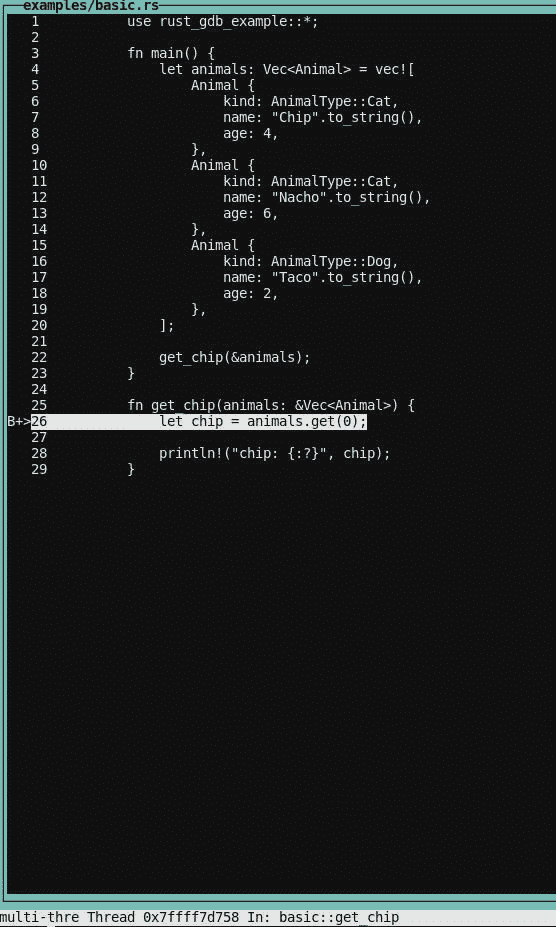
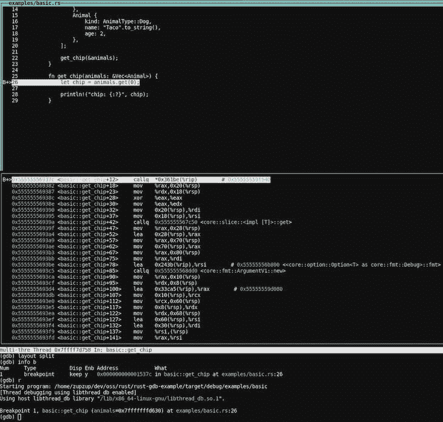

# 用 GDB 博客调试 Rust 应用程序

> 原文：<https://blog.logrocket.com/debugging-rust-apps-with-gdb/>

根据您以前对编程语言和生态系统的了解，调试可能是您从来没有做过的事情，也可能是您开发过程中的一个绝对固定项目。

例如，在 [Java](https://www.java.com/en/) ( [Kotlin](https://kotlinlang.org/) 和其他基于 JVM 的技术)生态系统中，由于复杂工具的悠久历史，许多人(包括我自己)在他们的正常开发周期中依赖调试器。在许多动态类型语言中，这种工作流没有被广泛采用。

当然，这些都是概括。几乎每种编程语言都有一些调试机制，但是开发人员是否使用调试器似乎取决于工具的质量和可用性，以及他们正在处理的任务。

无论如何，有一个好的调试故事是开发过程中至关重要的一部分。在这个 Rust GDB 教程中，我们将向您展示如何使用最好的 Rust 调试工具之一来调试 Rust 应用程序:GNU Project Debugger (GDB) 。

我们将讨论以下内容:

## 什么是 GDB？

GNU 项目调试器(GDB)是一个非常古老的程序，由自称“GNU 项目首席 GNUisance”的[理查德·斯托尔曼](https://stallman.org/)于 1986 年编写。GDB 支持多种语言，比如 C/C++，但也支持现代语言，比如 [Go 和 Rust](https://blog.logrocket.com/when-to-use-rust-and-when-to-use-golang/) 。

GDB 是一个命令行应用程序，但是有许多 GUI 前端和 IDE 集成可供它使用。例如，一个现代的基于浏览器的实现是 [gdbgui](https://www.gdbgui.com/) 。在本教程中，我们将坚持使用命令行界面，因为它可以在任何地方运行，不需要外部依赖，并且对于我们要完成的任务来说足够简单。

GDB 可以在 Linux、MacOS 和 Windows 上运行，并且预装在大多数常见的 Linux 发行版中。您可以查看[GDB](https://www.gnu.org/software/gdb/documentation/)T2 文档，了解您平台的安装说明。

GDB 极其复杂和强大，所以在本教程中我们不会深入 GDB 的本质。我们将坚持基本的功能，如设置断点、运行程序、单步执行程序、打印变量等。

## 在铁锈中建立 GDB

接下来，你需要一个相当新的 Rust 安装版本(1.39+)和一个 GDB 安装版本(8.x+)。发送 TCP 包的工具，比如`netcat`，可能也很有用。

另外，确保在与您的`rustc`可执行文件相同的文件夹中有一个`rust-gdb`可执行文件。如果你使用 [Rustup](https://rustup.rs/) 来安装和更新 Rust，这应该是默认情况。

首先，创建一个新的 Rust 项目:

```
cargo new rust-gdb-example
cd rust-gdb-example

```

接下来，编辑`Cargo.toml`文件并添加您需要的依赖项。

```
[dependencies]
tokio = { version = "1.1", features=["full"] }

```

在这种情况下，我们只添加 Tokio 作为依赖项，因为我们将构建一个非常基本的异步 TCP 示例来展示我们可以像调试“普通”函数一样调试异步函数。

将以下代码添加到`src/lib.rs`:

```
#[derive(Clone, Debug)]
pub enum AnimalType {
    Cat,
    Dog,
}

#[derive(Clone, Debug)]
pub struct Animal {
    pub kind: AnimalType,
    pub name: String,
    pub age: usize,
}

#[derive(Clone, Debug)]
pub struct Person {
    pub name: String,
    pub pets: Vec<Animal>,
    pub age: usize,
}

```

这些只是我们将在示例程序中用于调试的一些基本类型。

## 什么是`rust-gdb`？

`[rust-gdb](https://github.com/rust-lang/rust/blob/master/src/etc/rust-gdb)`是 Rust 安装附带的预构建二进制文件(例如，使用 Rustup ),并且是自动安装的。

基本上，`rust-gdb`是一个将外部 Python 漂亮打印脚本加载到 GDB 的包装器。这在调试更复杂的 Rust 程序时是有用的(也是必要的),因为它极大地改善了 Rust 数据类型的显示。

例如，一个`Vec<Animal>`看起来是这样的:

```
Vec(size=3) = {rust_gdb_example::Animal {kind: rust_gdb_example::AnimalType::Cat, name: "Chip", age: 4}, rust_gdb_example::Animal {kind: rust_gdb_example::AnimalType::Cat, name: "Nacho", age: 6}, rust_gdb_example::Animal {kind: rust_gdb_example::AnimalType::Dog, name: "Taco", age: 2}}

```

它看起来像这样，但没有:

```
alloc::vec::Vec<rust_gdb_example::Animal> {buf: alloc::raw_vec::RawVec<rust_gdb_example::Animal, alloc::alloc::Global> {ptr: core::ptr::unique::Unique<rust_gdb_example::Animal> {pointer: 0x5555555a1480, _marker: core::marker::PhantomData<rust_gdb_example::Animal>}, cap: 3, alloc: alloc::alloc::Global}, len: 3}

```

漂亮的打印脚本为最广泛使用的 Rust 结构提供格式化，例如`Vec`、`Option`、`Result`等。，隐藏它们的内部结构并显示实际的生锈类型——这是我们大部分时间感兴趣的。

这也是调试方法的一个明显的限制，当它在这个时候生锈的时候。如果你有复杂的、嵌套的数据类型，你需要一些关于它们内部的知识，或者某种黑魔法来正确地检查值。随着时间的推移，这种情况会有所改善，但是就目前的情况来看，如果使用这种方法调试复杂的真实软件，您将会遇到问题。

设置完成后，让我们从一个示例程序开始，用它启动`rust-gdb`。

## `rust-gdb`举例

让我们从一个基本的例子开始，看看如何将 GDB 与 Rust 一起使用。

在您的项目中创建一个`examples`文件夹，并添加一个包含以下内容的`basic.rs`文件:

```
use rust_gdb_example::*;

fn main() {
    let animals: Vec<Animal> = vec![
        Animal {
            kind: AnimalType::Cat,
            name: "Chip".to_string(),
            age: 4,
        },
        Animal {
            kind: AnimalType::Cat,
            name: "Nacho".to_string(),
            age: 6,
        },
        Animal {
            kind: AnimalType::Dog,
            name: "Taco".to_string(),
            age: 2,
        },
    ];

    get_chip(&animals);
}

fn get_chip(animals: &Vec<Animal>) {
    let chip = animals.get(0);

    println!("chip: {:?}", chip);
}

```

这个非常简单的程序初始化一个动物列表，并在最后调用一个函数来打印列表中的第一个动物。

为了调试它，我们需要构建它，然后用二进制文件运行`rust-gdb`。确保使用调试模式而不是发布模式来构建它。

```
cargo build --example basic
Finished dev [unoptimized + debuginfo] target(s) in 0.28s

rust-gdb target/debug/examples/basic

```

如果我们不构建示例，而是构建二进制文件，那么二进制文件将在`target/debug`中。

运行`rust-gdb`时，GDB 用几行欢迎信息和一个输入提示`(gdb)`迎接我们。

如果你以前从未和 GDB 共事过，这本 [GDB 小抄](https://darkdust.net/files/GDB%20Cheat%20Sheet.pdf)可能会有帮助。

让我们设置一个断点，这可以通过使用`break`命令或简单地使用`b`来完成:

```
(gdb) b get_chip
Breakpoint 1 at 0x13e3c: file examples/basic.rs, line 26.
(gdb) info b
Num     Type           Disp Enb Address            What
1       breakpoint     keep y   0x0000000000013e3c in basic::get_chip at examples/basic.rs:26

```

我们可以在行上设置断点(例如，`basic.rs:17`)，或者通过提供一个函数来中断。我们可以使用`info b`来查看断点，它向我们显示了断点的位置、数量(以防我们想要删除、禁用或启用它)，以及它是否被启用(`Enb`)。

`info`命令可以和其他标志一起使用，比如显示局部变量的`info locals`、显示输入函数参数的`info args`以及更多选项。

* * *

### 更多来自 LogRocket 的精彩文章:

* * *

既然我们已经设置了断点，我们可以通过执行`run`或者简单地执行`r`来运行程序:

```
(gdb) r
Starting program: /home/zupzup/dev/oss/rust/rust-gdb-example/target/debug/examples/basic
[Thread debugging using libthread_db enabled]
Using host libthread_db library "/lib/x86_64-linux-gnu/libthread_db.so.1".

Breakpoint 1, basic::get_chip (animals=0x7fffffffd760) at examples/basic.rs:26
26            let chip = animals.get(0);

```

这将启动程序。我们在定义的断点处停止，在`get_chip`函数的第一行。在这里，我们可以查看函数的参数，并尝试打印它们:

```
(gdb) info args
animals = 0x7fffffffd760
(gdb) p animals
$1 = (*mut alloc::vec::Vec<rust_gdb_example::Animal>) 0x7fffffffd760
(gdb) p *animals
$2 = Vec(size=3) = {rust_gdb_example::Animal {kind: rust_gdb_example::AnimalType::Cat, name: "Chip", age: 4}, rust_gdb_example::Animal {kind: rust_gdb_example::AnimalType::Cat, name: "Nacho", age: 6}, rust_gdb_example::Animal {kind: rust_gdb_example::AnimalType::Dog, name: "Taco", age: 2}}

```

`info args`命令提供了传入参数的概述。当我们使用`p` ( `print`也可以)打印动物时，GDB 告诉我们，我们处理的是一个指向`Vec<Animal>`的指针，但并没有显示任何关于所述`Vec`内容的相关信息，因为它只是一个指针。

你也可以使用`display`来打印一个变量，并且有格式选项(如字符串、指针、整数等。)也是。`print`和`display`的区别在于，使用`display`时，每次步进指令后都会再次打印数值。这对于监视值的变化很有用。

我们需要使用`*animals`取消对指针的引用。如果我们打印出来，我们会得到一个完整的，可读的动物列表。基本的指针杂耍和类型转换是你在引用结构时不时需要的一些东西。

好吧，我们说到哪了？让我们执行`f`或`frame`来看看我们在哪里:

```
(gdb) f
#0  basic::get_chip (animals=0x7fffffffd760) at examples/basic.rs:26
26            let chip = animals.get(0);

```

对，在我们的第一个断点。如果有一种方法可以图形化地看到我们在源代码中的位置就好了…

## 布局和检查状态

`layouts`在 GDB 帮你看看你在你的 Rust 源代码的什么地方。使用`layout src`命令打开命令行界面:



我们的命令提示符就在它的正下方。这样，我们就永远不会搞不清自己身在何处。还有其他布局，比如`layout split`，显示了源码和对应的汇编:



干净利落。如果想去掉布局，可以用`CTRL+X a`。如果渲染搞砸了，`CTRL+L`会刷新它(这种情况有时会发生)。

与其他调试器一样，我们可以使用`n`或`next`单步执行代码，或者使用`s`或`step`单步执行我们所在行的函数。如果你想重复这个，你可以简单地按下回车键，前面的命令将被重复。

让我们再深入一行，看看在对动物`Vec`调用`.get`之后，我们的`chip`变量里面有什么:

```
(gdb) n
28            println!("chip: {:?}", chip);
(gdb) p chip
$3 = core::option::Option<&rust_gdb_example::Animal>::Some(0x5555555a1480)
(gdb) print *(0x5555555a1480 as &rust_gdb_example::Animal)
$4 = rust_gdb_example::Animal {kind: rust_gdb_example::AnimalType::Cat, name: "Chip", age: 4}

```

我们执行`n`，我们在下一行(28)。在这里，我们试图打印出`chip`，我们看到它是一个`Option`，内部引用了一个`Animal`。不幸的是，GDB 只给我们看了一遍地址；我们需要将地址转换为一个`&rust_gdb_example::Animal`，以查看该动物的实际价值。

有一点很好，大多数这些东西都是自动完成的。所以如果你开始输入`rust_gd`，按下`TAB`会自动补全。与`AnimalType`和范围内的其他类型、函数和变量相同。

我们还可以打印函数定义:

```
(gdb) p get_chip
$11 = {fn (*mut alloc::vec::Vec<rust_gdb_example::Animal>)} 0x555555569370 <basic::get_chip>

```

如果我们想到达这个函数的末尾并向上一步到达调用站点，我们可以使用`finish`。如果我们完成了当前的断点，我们可以使用`continue`或`c`继续执行程序——在这种情况下，它将简单地运行程序直到它结束:

```
(gdb) finish
Run till exit from #0  basic::get_chip (animals=0x7fffffffd760) at examples/basic.rs:28
chip: Some(Animal { kind: Cat, name: "Chip", age: 4 })
0x0000555555567d87 in basic::main () at examples/basic.rs:22
22            get_chip(&animals);
(gdb) c
Continuing.
[Inferior 1 (process 61203) exited normally]

```

非常好。这些是你调试 Rust 程序所需要的基本要素。让我们看另一个例子，探索一些更高级的技术。

## 操纵状态和观察点

首先，让我们在`nested.rs`文件的`examples`文件夹中创建另一个例子:

```
use rust_gdb_example::*;

fn main() {
    let animals: Vec<Animal> = vec![
        Animal {
            kind: AnimalType::Cat,
            name: "Chip".to_string(),
            age: 4,
        },
        Animal {
            kind: AnimalType::Cat,
            name: "Nacho".to_string(),
            age: 6,
        },
        Animal {
            kind: AnimalType::Dog,
            name: "Taco".to_string(),
            age: 2,
        },
    ];

    let mut some_person = Person {
        name: "Some".to_string(),
        pets: animals,
        age: 24,
    };
    println!("person: {:?}", some_person);
    some_person.age = 100;
    some_person.name = some_func(&some_person.name);
}

fn some_func(name: &str) -> String {
    name.chars().rev().collect()
}
```

同样，我们正在创建一个动物列表。但这一次，我们还创建了一个`Person`，并将动物设置为它们的宠物。此外，我们打印这个人，将他们的年龄设置为`100`并反转他们的名字(这就是 some_func 所做的)。

在我们调试这个程序之前，我们需要重新构建它，并从二进制文件开始`rust-gdb`:

```
cargo build --example nested
rust-gdb target/debug/examples/nested

```

太好了。让我们在第 22 行和第 27 行设置断点，然后运行程序:

```
(gdb) b nested.rs:22
Breakpoint 1 at 0x17abf: file examples/nested.rs, line 22.
(gdb) b nested.rs:27
Breakpoint 2 at 0x17b13: file examples/nested.rs, line 27.
(gdb) info b
Num     Type           Disp Enb Address            What
1       breakpoint     keep y   0x0000000000017abf in nested::main at examples/nested.rs:22
2       breakpoint     keep y   0x0000000000017b13 in nested::main at examples/nested.rs:27
(gdb) r
Starting program: /home/zupzup/dev/oss/rust/rust-gdb-example/target/debug/examples/nested
[Thread debugging using libthread_db enabled]
Using host libthread_db library "/lib/x86_64-linux-gnu/libthread_db.so.1".

Breakpoint 1, nested::main () at examples/nested.rs:22
22            let mut some_person = Person {

```

我们在第一个断点处，在那里创建了人。让我们继续打印声明。然后，我们将在`some_person.age`上设置一个所谓的观察点。每次`some_person.age`发生变化时，该观察点都会通知我们:

```
(gdb) c
(gdb) watch some_person.age
Hardware watchpoint 3: some_person.age
(gdb) n
person: Person { name: "Some", pets: [Animal { kind: Cat, name: "Chip", age: 4 }, Animal { kind: Cat, name: "Nacho", age: 6 }, Animal { kind: Dog, name: "Taco", age: 2 }], age: 24 }
28            some_person.age = 100;
(gdb) n

Hardware watchpoint 3: some_person.age

Old value = 24
New value = 100
0x000055555556bba8 in nested::main () at examples/nested.rs:28
28            some_person.age = 100;

```

GDB 向我们展示了哪个观察点被触发，以及新旧值。

让我们通过再次调用`run`并确认我们想要重新运行来重新运行程序。这一次，当我们到达第二个断点时，让我们使用`set`手动更改该值:

```
(gdb) set some_person.age = 22
(gdb) p some_person
$1 = rust_gdb_example::Person {name: "Some", pets: Vec(size=3) = {rust_gdb_example::Animal {kind: rust_gdb_example::AnimalType::Cat, name: "Chip", age: 4}, rust_gdb_example::Animal {kind: rust_gdb_example::AnimalType::Cat, name: "Nacho", age: 6},
    rust_gdb_example::Animal {kind: rust_gdb_example::AnimalType::Dog, name: "Taco", age: 2}}, age: 22}

```

如你所见，我们可以使用`set ..args`来操纵变量的状态。这对于原语非常有效，但是对于复杂的值，比如 [Rust standard library](https://doc.rust-lang.org/std/) ，或者外部板条箱类型，就比较棘手了。这是另一个缺点，但它有望在未来得到改善。

我们可以尝试的另一个很好的特性是执行函数并查看它们返回什么:

```
(gdb) p some_func("Hello")
$3 = "olleH"
(gdb) p some_func("Debug")
$4 = "gubeD"
(gdb) p some_func(some_person.name)
$5 = "emoS"
(gdb) set some_person.name = some_func(some_person.name)
(gdb) p some_person
$6 = rust_gdb_example::Person {name: "emoS", pets: Vec(size=3) = {rust_gdb_example::Animal {kind: rust_gdb_example::AnimalType::Cat, name: "Chip", age: 4}, rust_gdb_example::Animal {kind: rust_gdb_example::AnimalType::Cat, name: "Nacho", age: 6},
    rust_gdb_example::Animal {kind: rust_gdb_example::AnimalType::Dog, name: "Taco", age: 2}}, age: 22}

```

我们可以用一个文字字符串调用`some_func`函数，它在作用域内。我们也可以用我们的`some_person.name`调用它，并且我们可以使用`set`将这个人的名字设置为相反的值。

这非常强大，可以让您在调试时检查表达式和函数的结果，这有助于发现问题。这同样适用于简单的情况，但是如果你试图执行一个 I/O 或其他更复杂的函数，你可能会遇到障碍。但是在 99%的情况下，现有的功能都工作得很好。

说到 I/O，让我们看最后一个例子:如何使用 GDB 在 Rust 中调试一个[异步网络应用程序。](https://blog.logrocket.com/asynchronous-i-o-and-async-await-packages-in-rust/)

## 调试异步网络应用程序

最后，同样重要的是，我们将尝试调试一个运行在 Tokio 异步运行时上的异步网络应用程序。

让我们在`examples`文件夹中创建`tokio.rs`:

```
use std::io;
use tokio::io::AsyncWriteExt;
use tokio::net::{TcpListener, TcpStream};

#[tokio::main]
async fn main() -> io::Result<()> {
    let listener = TcpListener::bind("127.0.0.1:8080").await?;
    println!("Accepting TCP on port 8080");

    loop {
        let (socket, _) = listener.accept().await?;
        tokio::spawn(async move { process(socket).await });
    }
}

async fn process(mut socket: TcpStream) {
    socket
        .write_all(b"Hello")
        .await
        .expect("can write to socket");
}

```

这个非常简单的程序在本地端口`8080`上启动一个 TCP 监听器，并且对于每个传入的连接，异步调用处理请求的`process`函数。

`process`函数简单地写回`Hello`，这使得这成为可能的最简单的“网络应用”。

然而，复杂性不是我们在这里寻找的。相反，我们试图确定当我们调试异步程序(如 web 服务器)时，使用 GDB 的工作流是否会改变。

让我们编译这个例子，并用生成的二进制文件启动`rust-gdb`:

```
cargo build --example tokio
rust-gdb target/debug/examples/tokio

```

到目前为止，一切顺利。

让我们在第 17 行的`process`函数的开头设置一个断点:

```
(gdb) b tokio.rs:17
(gdb) info b
Num     Type           Disp Enb Address            What
1       breakpoint     keep y   <MULTIPLE>
1.1                         y   0x000000000009aa87 in tokio::process::{{closure}} at examples/tokio.rs:17
1.2                         y   0x00000000000a57fa in tokio::process at examples/tokio.rs:17

```

有趣的是，断点被分成了`1.1`和`1.2`。这些在 GDB 被称为地点。这可能是由于优化，如内联，例如，GDB 将在函数内联或模板化的每一点添加断点。我假设这是由于`tokio::main`宏，它将所有代码包装在 Tokio 运行时中。

如果我们愿意，我们可以禁用任何一个位置，但在这种情况下，这并不重要。让我们运行程序:

```
(gdb) r
Starting program: /home/zupzup/dev/oss/rust/rust-gdb-example/target/debug/examples/tokio
[Thread debugging using libthread_db enabled]
Using host libthread_db library "/lib/x86_64-linux-gnu/libthread_db.so.1".
[New Thread 0x7ffff7c1e700 (LWP 55035)]
[New Thread 0x7ffff7a1d700 (LWP 55036)]
[New Thread 0x7ffff781c700 (LWP 55037)]
[New Thread 0x7ffff761b700 (LWP 55038)]
[New Thread 0x7ffff741a700 (LWP 55039)]
[New Thread 0x7ffff7219700 (LWP 55040)]
[New Thread 0x7ffff7018700 (LWP 55041)]
[New Thread 0x7ffff6e17700 (LWP 55042)]
Accepting TCP on port 8080

```

我们的监听器已经启动并运行，我们甚至可以看到 Tokio 运行时在后台生成的线程。

让我们使用`netcat`从另一个终端会话向端点发送一些数据:

```
nc 127.0.0.1 8080
```

这触发了我们在`process`中的断点:

```
[Switching to Thread 0x7ffff6e17700 (LWP 55041)]

Thread 9 "tokio-runtime-w" hit Breakpoint 1, tokio::process::{{closure}} () at examples/tokio.rs:18
18            socket

(gdb) p socket
$4 = tokio::net::tcp::stream::TcpStream {io: tokio::io::poll_evented::PollEvented<mio::net::tcp::stream::TcpStream> {io: core::option::Option<mio::net::tcp::stream::TcpStream>::Some(mio::net::tcp::stream::TcpStream {inner: mio::io_source::IoSource<std::net::tcp::TcpStream> {state: mio::sys::unix::IoSourceState, inner: std::net::tcp::TcpStream (std::sys_common::net::TcpStream {inner: std::sys::unix::net::Socket (std::sys::unix::fd::FileDesc {fd: 11})}), selector_id: mio::io_source::SelectorId {id: core::sync::atomic::AtomicUsize {v: core::cell::UnsafeCell<usize> {value: 1}}}}}), registration: tokio::io::driver::registration::Registration {handle: tokio::io::driver::Handle {inner: alloc::sync::Weak<tokio::io::driver::Inner> {ptr: core::ptr::non_null::NonNull<alloc::sync::ArcInner<tokio::io::driver::Inner>> {pointer: 0x55555573a560}}}, shared: tokio::util::slab::Ref<tokio::io::driver::scheduled_io::ScheduledIo> {value: 0x55555573ec20}}}}

(gdb) c

```

当断点被触发时，GDB 通知我们这发生在运行时的一个派生线程中，并且我们有了`socket`变量，我们可以检查它。

`socket`是一个 Tokio TCPStream，但是我们不能仅仅从打印上说太多。里面有一个编号为`11`的文件描述符，是开放的网络连接，但剩下的好像是 Tokio 和 mio 内部的。

无论如何，它成功了——我们成功地在许多线程中的一个线程上运行的异步处理程序中设置了一个断点。这意味着，如果我们运行 Actix 或 warp web 服务器，在其中一个处理函数中设置一个断点来检查传入的 HTTP 请求数据，同样的方法也可以工作得很好。

下面是我们使用`c`继续执行后第二个终端中的`Hello`响应:

```
nc 127.0.0.1 8080
Hello

```

我们使用 GDB 调试 Rust 应用程序的旅程到此结束。

你可以在 [GitHub](https://github.com/zupzup/rust-gdb-example) 上找到完整的示例代码。

## 结论

在这个 Rust 调试教程中，我们演示了如何用 GDB 调试 Rust 应用程序。在大多数情况下，它工作得很好，特别是使用`rust-gdb`漂亮的打印扩展，如果你所做的只是通过一个有断点的程序并检查程序的状态。

当谈到更复杂的功能时，你可能习惯于用其他语言从复杂的 GUI 调试器，这是一个积极发展的领域，我完全期待 Rust 中的调试生态系统得到改善。与 Java 和 C/C++世界中最好的调试器相比，这需要多长时间，整体调试体验会有多好，很难说，这将取决于 Rust 内部对这种工具的需求。

本教程的目标是为您提供工具，以最少的额外工具或必要知识来执行 Rust 程序的基本调试。这一背景应该涵盖您将遇到的大多数情况，尤其是在遇到 Rust 时。

## [log rocket](https://lp.logrocket.com/blg/rust-signup):Rust 应用的 web 前端的全面可见性

调试 Rust 应用程序可能很困难，尤其是当用户遇到难以重现的问题时。如果您对监控和跟踪 Rust 应用程序的性能、自动显示错误、跟踪缓慢的网络请求和加载时间感兴趣，

[try LogRocket](https://lp.logrocket.com/blg/rust-signup)

.

[](https://lp.logrocket.com/blg/rust-signup)

LogRocket 就像是网络和移动应用程序的 DVR，记录你的 Rust 应用程序上发生的一切。您可以汇总并报告问题发生时应用程序的状态，而不是猜测问题发生的原因。LogRocket 还可以监控应用的性能，报告客户端 CPU 负载、客户端内存使用等指标。

现代化调试 Rust 应用的方式— [开始免费监控](https://lp.logrocket.com/blg/rust-signup)。