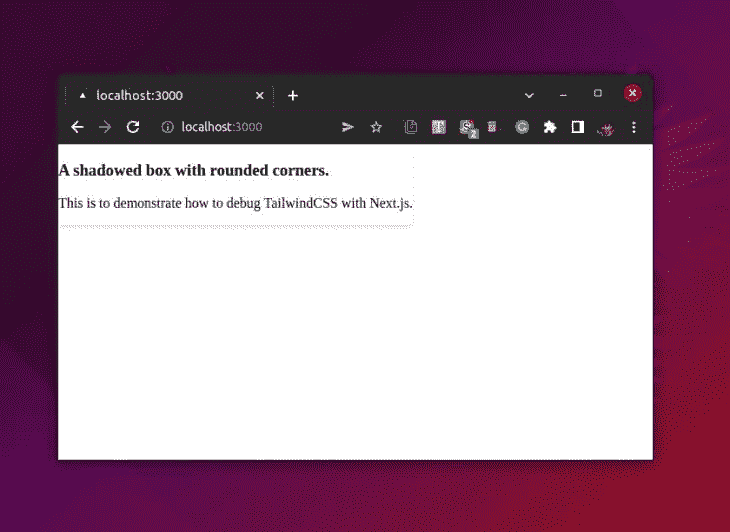
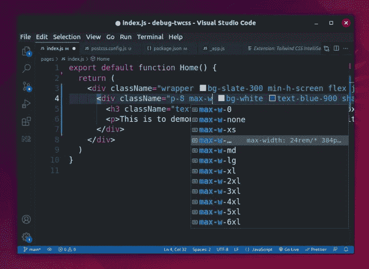
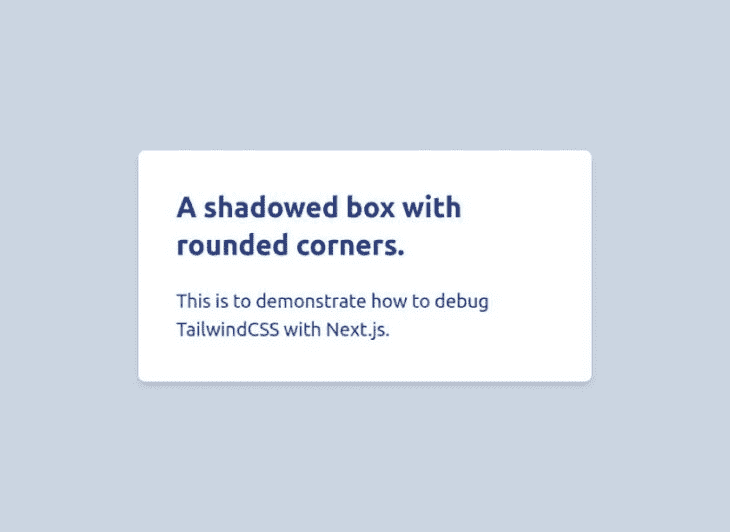

# 调试顺风 CSS 和 Next.js - LogRocket 博客

> 原文：<https://blog.logrocket.com/debugging-tailwind-css-next-js/>

像 Tailwind CSS 这样的基于实用程序的 CSS 框架与 Next.js 这样的 JavaScript 框架结合在一起，是一个强大的前端开发堆栈。

你可能已经知道，Next.js 是一个 JavaScript 框架，用于[创建灵活的 React 应用](https://blog.logrocket.com/how-astro-compares-next-js-react-apps/)。即使只有 React 的初级知识，您也可以开始使用 Next 构建应用程序。幸运的是，现在 Next 正在流行，使用 Tailwind CSS 可以帮你节省很多在应用程序 UI 上工作的时间。

然而，在 Next.js 设置中，有时 Tailwind CSS 不能像预期的那样工作。这可能有多种原因，因此在本文中，我们将了解如何解决这些问题，以便您可以继续开发高性能的应用程序。

## 内容

## Tailwind CSS 和 Next.js 的常见问题

在用 Next 设置顺风时，我们可能会遇到两类问题。第一个问题是对顺风特性和功能的不正确使用。它包括以下任何一项:

*   主 CSS 文件中没有顺风指令
*   没有将 CSS 类正确分配给元素
*   在模板文件中使用不正确的类名
*   黑暗模式实用程序的不正确使用
*   在没有安装所需插件的情况下使用扩展工具

第二类问题源于 Tailwind 或 Next.js 的不正确或不完整的配置。如果您以前使用过 Tailwind，您可能已经知道我们运行 Tailwind `init`命令时创建的配置文件。

Next.js 配置文件中的一些选项也可能导致该问题。这些配置问题可能包括以下任何或所有问题:

*   在 Tailwind 3.0 中使用旧的清除方法来指定源路径，这在现在是多余的
*   缺少正确的内容路径。与常规的 React 项目相比，Next 提供了稍微不同的项目结构
*   当使用像 [Nx](https://nx.dev) 这样的现代构建系统时，没有定义动态路径
*   使用下一个实验特征

在本教程中，我们将学习解决所有这些问题的正确方法。

## 使用 Tailwind CSS 设置 Next.js 项目

让我们一步一步来，从接下来安装的标准方式开始。确认您位于正确的安装位置后，运行下面给出的标准命令进行下一步安装:

```
npx [email protected]

```

请注意，如果您使用像 yarn 或 npm 这样的现代打包系统，有单独的安装命令集。

你会被要求为应用程序选择一个名字，还有一些选项，比如安装对 TypeScript 的支持。做出合适的选择，等待事情完成。这一过程可能需要一些时间，取决于您的互联网连接。

安装完成后，让我们`cd`进入我们的项目目录，运行我们的应用程序，看看它是否按预期工作:

```
cd debug-twcss
yarn dev

```

起作用了！

### 用 Next.js 安装顺风 CSS

现在，让我们暂停一下，使用下面的命令在我们现有的下一个应用程序中安装 Tailwind 及其先决条件:

```
npm i -D [email protected] [email protected] [email protected]

```

或者，您可以使用`yarn add ...`命令来安装所有这些包。安装完软件包后，使用以下命令生成顺风配置文件:

```
npx tailwindcss init -p

```

上面的命令将把`tailwind.config.js`和`postcss.config.js`文件添加到我们项目的根目录中。Tailwind 广泛使用 [PostCSS](https://blog.logrocket.com/using-postcss-media-queries-level4/) 来运行，建议不要同时使用任何预处理器。

我们已经完成了安装顺风 CSS 的初级阶段。让我们将它的一些实用程序类添加到我们的索引页面，并运行应用程序。



好像不管用。有一些样式是可见的，比如`box-shadow`，但它与我们的预期相差甚远。[这里有更多关于为什么会发生这种情况的信息](https://blog.logrocket.com/debugging-tailwind-css-next-js/#why-tailwind-utilities-work-without-content-option)。

接下来的几个步骤将介绍如何通过一次解决一个常见的问题和配置问题来让它正常工作。

## 检查指令是否正确

第一步是确保 styles 目录中的全局 CSS 文件包含所有的 Tailwind 指令。

如果没有这些指令，Tailwind 就不知道应该根据它们在内容路径文件中的用途向最终的 CSS 提供什么样的基本类、实用类和组件类:

```
/* debug-twcss/styles/global.css */
@tailwind base;
@tailwind utilities;
@tailwind components;

```

## 以正确的方式分配 CSS 类

我们可以像在 React 中一样在 Next.js 中分配 CSS 类。当向元素添加 CSS 类时，确保在 JSX 中使用`className`而不是`class`。

## 避免不正确的类名

可能会有不正确的类名，这可能会导致问题并让您疑惑几个小时。总是仔细检查 Tailwind 类名没有印刷错误。

Visual Studio 代码用户可以通过官方的 Tailwind CSS 智能感知扩展轻松避免这些错误。下面是该扩展的一瞥。



当您在项目文件中键入类名时，这个扩展不仅会向您显示自动完成建议的列表，还会为特定于顺风的事物提供林挺和语法高亮支持。

## 安装所需的插件

让我们假设您使用了 Tailwind 提供的排版工具扩展，但是您没有安装所需的插件:

```
// debug-twcss/pages/post.js
export default function Post() {
  return (
    <article className="entry p-16 [ prose md:prose-md lg:-prose-lg ]">
     <p>...</p>
     <p>...</p>
     <p>...</p>
    </article>
  )
}

```

除非您安装了所需的扩展，否则您将无法在前端看到任何正在运行的`prose`类。让我们现在安装排版插件:

```
npm i -D @tailwindcss/typography

```

还没完呢。让我们在配置文件的`plugins`选项中指定新安装的排版插件:

```
// debug-twcss/tailwind.config.js
module.exports = {
 content: ['./pages/**/*.html'],
 theme: {
  extend: {},
 },
 plugins: [
  require('@tailwindcss/typography'),
 ],
}

```

## 用`content`代替`purge`

如果你习惯了老版本的 Tailwind 的`purge`选项，并且在最近的版本中使用了同样的选项，这可能就是你的项目不能工作的原因。

[从 v3 开始的顺风](https://blog.logrocket.com/whats-new-tailwind-css-v3-0/)提供了`content`属性来添加文件路径。

如果您想知道为什么需要`purge`或`content`，它可以帮助 Tailwind CSS 引擎决定处理哪些页面，并将它们的 CSS 类导出到最终的 CSS 文件中。

下面是使用最新版本的 Tailwind 从`purge`切换到`content`有多容易:

```
// debug-twcss/tailwind.config.js
module.exports = {
 content: ['...'],
 theme: {
  extend: {},
 }
}

```

## 使用正确的路径

如果您像使用 React 应用程序那样使用 Next 配置内容路径，它仍然无法工作。这是因为与传统的 react 项目相比，Next 提供了一个稍微不同的项目结构。

与传统的 React 项目不同，下一个项目中没有默认的`src`目录。相反，我们有一个默认的`pages`目录，应用程序的页面模板就存放在那里。

* * *

### 更多来自 LogRocket 的精彩文章:

* * *

更多这样的目录有助于在未来的开发中保持事情井井有条。在这里，`component`目录最适合作为一个例子。

因此，我们需要在顺风配置文件的`content`变量中提供存放在`pages`和`component`文件夹中的模板的路径:

```
// debug-twcss/tailwind.config.js
module.exports = {
 content: [
    "./pages/**/*.{js,ts,jsx,tsx}",
    "./components/**/*.{js,ts,jsx,tsx}",
  ],
  theme: {
  extend: {},
 }
}

```

正如您所看到的，content 选项中的 glob 模式没有太大的不同，但是提供适当的目录名是这里的关键。

***注意，如果你出于某种原因仍然在你的 Next.js 项目中使用`src`目录，确保将它添加到顺风 CSS 配置*****中的`content`变量中**

 **这就是为什么即使你没有在内容选项中设置任何东西，一些 Tailwind 工具也能工作的原因。这是因为实际的清除只发生在生产构建期间。最佳实践是只在开发过程中正确设置。

如果我们现在运行应用程序，它很可能会完美运行，因为我们已经修复了最常见的问题。



## 使用带有 TailwindCSS 的 Next.js 示例项目

如果前面的建议对你都不起作用，你可以试试另一个选择。

Next.js 提供了一个预装了 Tailwind CSS 的示例项目模板。如果您仍然不知道常规的 Next.js 项目设置中出现了什么问题，请使用以下命令安装这个示例项目:

```
npx create-next-app --example with-tailwindcss with-tailwindcss-app

```

这个示例项目有现成的用于 Tailwind CSS 的安装和配置文件，所以几乎没有出错的可能。然后，您可以从这里验证并更正项目的配置设置。

## 正确使用黑暗模式

在用字体插件实现 Tailwind 的黑暗模式时可能会出现问题，这可能与 Next 没有直接关系。

下面的初级读本将解释如何配置 Next.js 和 Tailwind CSS 以在黑暗模式下正确工作。

要安装 Tailwind CSS 的排版插件，请将`cd`放入您的项目文件夹并运行以下命令:

```
npm i -D @tailwindcss/typography

```

下一步是将插件细节添加到`tailwind.config.js`中。如果您希望手动切换，您必须将`darkMode`属性指定为`class`。

```
/** @type {import('tailwindcss').Config} */
module.exports = {
  darkMode: "class", // Specify this only when you want to toggle modes manually
  content: [
    "./pages/**/*.{js,ts,jsx,tsx}",
    "./components/**/*.{js,ts,jsx,tsx}",
  ],
  plugins: [require("@tailwindcss/typography")],
};

```

让我们也将排版类应用到我们想要的部分。

```
import type { NextPage } from "next";
import Head from "next/head";
const Prose: NextPage = () => {
  return (
    <div className="flex min-h-screen flex-col items-center justify-center py-2">
      <Head>
        <title>Testing Prose</title>
      </Head>
      { # The `prose` and `lg:prose-lg` classes are responsible to add typography features using the Typography Plugin of Tailwind CSS }
      <main className="flex prose lg:prose-lg flex-1 flex-col items-center justify-center p-20">
        <h1 className="text-6xl font-bold">
          Lorem ipsum dolor sit amet consectetur, adipisicing elit. Ullam, rem!
        </h1>
      </main>
   </div>
  )
}

export default Prose;

```

当我们添加颜色工具时，我们通常对元素应用暗模式样式。这里有一个简单的例子，让你对它有个大概的了解。

```
<div
  className="bg-gray-200 dark:bg-gray-900 
             text-gray-900 dark:text-gray-200"
  >
  ...
</div>

```

在排版`prose`部分的情况下，上述设置是不可能的。在 Tailwind v3 及以后的版本中，可以为`prose`添加一个反转类，如下图。

```
...

const Prose: NextPage = () => {
  return (
    ...
      <main className="flex prose lg:prose-lg dark:prose-invert flex-1 flex-col items-center justify-center p-20">
        <h1 className="text-6xl font-bold">
          Lorem ipsum dolor sit amet consectetur, adipisicing elit. Ullam, rem!
        </h1>
      </main>
    ...
  )
}

```

上面的代码将默认的深色模式调色板应用于散文部分，但是如果您想要使用不同的颜色呢？

通过扩展排版配置并为散文颜色添加不同的设置，可以将不同的颜色应用于这种“反转”模式，如下所示。

```
/** @type {import('tailwindcss').Config} */
module.exports = {
  darkMode: "class",
  content: [
    "./pages/**/*.{js,ts,jsx,tsx}",
    "./components/**/*.{js,ts,jsx,tsx}",
  ],
  theme: {
    extend: {
      typography: ({ theme }) => ({
        invert: {
          css: {
            "--tw-prose-body": theme("colors.pink[800]"),
            "--tw-prose-headings": theme("colors.pink[900]"),
            "--tw-prose-invert-body": theme("colors.red[500]"),
            "--tw-prose-invert-headings": theme("colors.red[200]"),
          },
        },
      }),
    },
  },
  plugins: [require("@tailwindcss/typography")],
};

```

## 对构建系统使用动态路径

如果您的下一个应用程序是 monorepo 的一部分，您将不得不优化配置文件中的路径定义，以使 Tailwind 工作。

monorepo 是许多独立项目的存储库，这些项目也可能共享像 Tailwind CSS 这样的全球实用程序。不过，让 Tailwind 在 monorepo 上工作有点复杂。

让我们看看如何在 Nx 这样的现代构建系统[上安装或调试 Tailwind CSS。](https://blog.logrocket.com/building-an-application-with-react-and-nx/)

安装过程与我们之前讨论的几乎相同，但是您应该确保将软件包安装在工作空间根目录中，而不是 apps 或 libs 中。

为这个配置初始化 Tailwind 也是一样的；你只需要`cd`进入你想要使用 Tailwind 的目录:

```
cd apps/debug-twcss
npx tailwindcss init -p

```

现在，我们已经在项目的根目录中创建了 Tailwind CSS 和 PostCSS 配置文件。我们需要告诉这些文件，应用程序文件夹中的哪个项目应该使用顺风功能:

```
// apps/debug-twcss/postcss.config.js
const { join } = require('path');
module.exports = {
 plugins: {
   tailwindcss: {
     config: join(__dirname, 'tailwind.config.js'),
   },
   autoprefixer: {},
 },
};

```

在这种情况下，`--dirname`变量动态地指定了当前目录的绝对路径。

我们可以用`tailwind.config.js`做一些类似的事情，并且它会工作，但是让我们在进一步之前考虑一下项目的依赖性。

我们的 Nx 工作区中的`libs`目录包含项目依赖项(比如共享组件),它们也可能使用 Tailwind 工具。有一种方法可以使用内置的 Nx 函数在配置的内容选项中自动指定所有这些依赖关系:

```
// apps/debug-twcss/tailwindcss.config.js
const { createGlobPatternsForDependencies } = require('@nrwl/next/tailwind');
const { join } = require('path');

module.exports = {
 content: [
   join(__dirname, 'pages/**/*.{js,ts,jsx,tsx,html}'),
   ...createGlobPatternsForDependencies(__dirname),
 ],
 theme: {
   extend: {},
 },
 plugins: [],
};

```

顺风引擎将自动观察所有的项目依赖关系，并添加到配置文件中。

如果您在 monorepo 中有许多项目使用相同的顺风设置，您可以在工作区根目录中创建一个带有这些设置的预置文件，并使用项目中顺风配置的`preset`选项来访问它。

## 关闭 Next.js 实验功能

最后，一些实验性的功能可能会干扰你在 Next.js 应用中安装的 Tailwind 和其他包。

如果您正在使用任何此类功能，请尝试通过将`next.config.js`文件中的`concurrentFeatures`选项设置为`false`来关闭它们:

```
// debug-twcss/next.config.js
/** @type {import('next').NextConfig} */
const nextConfig = {
  swcMinify: true,
  reactStrictMode: true,
  experimental: {
    concurrentFeatures: false, // <- Turn this option to false
    serverComponents: true,
  },
}
module.exports = nextConfig

```

您可能需要重新启动并重新构建项目来观察更改。

## 结论

在本文中，我们学习了使用 Next 调试 Tailwind CSS 问题的不同场景。我们讨论的问题主要是配置和使用问题。

我相信我们上面讨论的解决方案可以解决你的大部分问题。如果你觉得缺少了什么，或者在设置 Tailwind CSS 时仍然遇到问题，请在评论中告诉我。

## [LogRocket](https://lp.logrocket.com/blg/nextjs-signup) :全面了解生产 Next.js 应用

调试下一个应用程序可能会很困难，尤其是当用户遇到难以重现的问题时。如果您对监视和跟踪状态、自动显示 JavaScript 错误、跟踪缓慢的网络请求和组件加载时间感兴趣，

[try LogRocket](https://lp.logrocket.com/blg/nextjs-signup)

.

[](https://lp.logrocket.com/blg/nextjs-signup)[](https://lp.logrocket.com/blg/nextjs-signup)

LogRocket 就像是网络和移动应用的 DVR，记录下你的 Next.js 应用上发生的一切。您可以汇总并报告问题发生时应用程序的状态，而不是猜测问题发生的原因。LogRocket 还可以监控应用程序的性能，报告客户端 CPU 负载、客户端内存使用等指标。

LogRocket Redux 中间件包为您的用户会话增加了一层额外的可见性。LogRocket 记录 Redux 存储中的所有操作和状态。

让您调试 Next.js 应用的方式现代化— [开始免费监控](https://lp.logrocket.com/blg/nextjs-signup)。**