# 深入探究 CSS 浮动属性

> 原文：<https://blog.logrocket.com/deep-dive-css-float-property/>

CSS `[float](https://developer.mozilla.org/en-US/docs/Web/CSS/float)`是一个定位属性，它将一个元素放在其容器的左侧或右侧，并允许行内元素环绕它。过去，`float`因为被错误地用于页面布局而声名狼藉。这导致一些开发人员质疑它现在是否被弃用，或者是否应该完全避免！

CSS `float`仍然是相关的。我们应该在正确的上下文中使用它！本文讨论了 CSS 浮动的历史，并展示了在现代网页设计中使用`float`的几种方法，以实现创造性的文本布局和令人惊叹的设计元素。

## 内容

## `float`简史

CSS 中引入了`float`属性，以允许 web 开发人员创建杂志风格的布局，例如将一个图像放置在一列文本中，文本环绕在图像周围，类似于下面所示的布局。

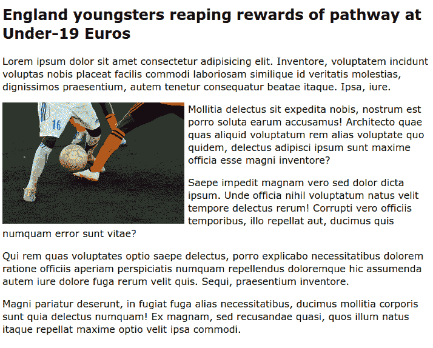

Example using `float` with an image within a column of text.

当 CSS 还是个婴儿的时候,`float`属性就被引入了。很难说确切的时间，但可以肯定的是`float`在 2001 年就出现在浏览器中了！那时候 CSS 很有限！当人们想要制作整版版面时，他们通常会选择`float`。那时候还是蛮荒的西部！

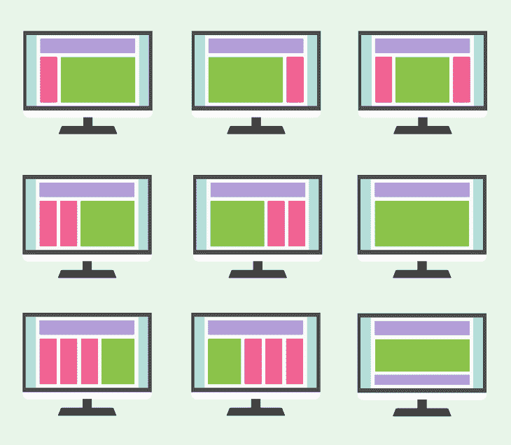

Flexbox or CSS Grid are recommended for full-page layouts like these.

在某些方面，使用`float`进行布局是有效的。然而，眼泪通常随之而来，因为这意味着使用超出其预期目的的`float`，导致复杂的代码和布局问题，随着网站的发展难以管理。

现在，不要用`float`做页面布局！你应该把以这种方式使用浮动看作是一种[遗留技术](https://developer.mozilla.org/en-US/docs/Learn/CSS/CSS_layout/Legacy_Layout_Methods)。 [Flexbox 和 CSS Grid 是制作复杂页面布局的绝佳选择](https://blog.logrocket.com/flexbox-vs-css-grid/)。

## 正确使用`float`

当您想要将一个元素拉到包含元素的一侧，同时允许其他内容自由围绕它流动时，请使用`float`。没有任何其他的 CSS 方法可以做到这一点，所以不要害怕使用它！

`float`的有效值是以下列表中的一个关键字:

*   `left`:将元素定位在其包含块的左侧
*   `right`:将元素定位在其包含块的右侧
*   `none`:不浮动元素
*   `inline-start`:将元素定位在其包含块的第一行内侧；左边是从左到右的脚本，右边是从右到左的脚本
*   `inline-end`:将元素定位在其包含块的最后一个内联侧；这是从左到右书写的右侧和从右到左书写的左侧

值`inline-start`和`inline-end`相对较新。它们被称为[逻辑值](https://developer.mozilla.org/en-US/docs/Web/CSS/CSS_Logical_Properties)。我们现在应该支持使用这些。[浏览器支持很好](https://caniuse.com/css-logical-props)，这些逻辑值创造了更具包容性的设计。

逻辑值使我们能够用一个值为具有不同书写方向的语言创建正确的布局。最常用的逻辑值是`left`和`right`。下面的例子展示了不常用的逻辑值，以说明如何在不同的用例中使用它们。

让我们实现前面的例子。让我们创建一个简单的`article`，它有一个浮动在第二段开头的图像。

```
<article>
      <h1>England youngsters reaping the rewards of a pathway at Under-19 Euros</h1>
      <p>
        Lorem ipsum dolor sit amet consectetur adipisicing elit. Inventore,
        voluptatem incidunt voluptas nobis placeat facilis commodi laboriosam
        similique id veritatis molestias, dignissimos praesentium, autem tenetur
        consequatur beatae itaque. Ipsa, iure.
      </p>
      
      <p>
        Mollitia delectus sit expedita nobis, nostrum est porro soluta earum
        accusamus! Architecto quae quas aliquid voluptatum rem alias voluptate
        quo quidem, delectus adipisci ipsum sunt maxime officia esse magni
        inventore?
      </p>
      <!--more paragraphs -->
</article>

```

我们只需要给`img`添加以下样式:

```
img {
    float: inline-start;
}

```

默认情况下，图像和文本之间没有空格。您可能希望添加一个空白，以便在图像和文本之间提供清晰的分隔。我加了`margin-inline-end: 4px;`。

见笔 [` float:inline-start；`文章(英文)](https://codepen.io/robatronbobby/pen/xxWxgje)by rob 2([@ robatronbobby](https://codepen.io/robatronbobby))
on[CodePen](https://codepen.io)。

如果我们使用完全相同的 CSS，但在 HTML 文档中使用阿拉伯语内容，它将向右对齐，而不是向左对齐:

见笔 [` float:inline-start；由 rob 2(](https://codepen.io/robatronbobby/pen/ExExZZe)[@ robatronbobby](https://codepen.io/robatronbobby))
在 [CodePen](https://codepen.io) 上发表的文章【阿拉伯语】。

相当简单，对吧？

`float`的常见用法应该就是这么简单。然而，使用`float`有一些奇怪的地方，您可能会在不同的场景中遇到。通过加深我们对这个属性的理解，我们可以防止混淆的结果！

可视化浮动元素

## 让我们非常清楚浮动元素的行为。

以我们之前的例子为例，英文版。设置了`float`的元素(本例中为`img`元素)从文档的正常布局流中取出，并粘贴到其父容器(本例中为`article`)的左侧。

在普通布局流中，浮动元素下面的任何内容现在都将环绕该元素。这样做，它将填满浮动元素右边的整个空间。然后，它停止并继续正常的布局流程。

为了说明这一点，让我们修改我们的例子。我们将为受影响的段落添加一些突出显示，以展示文档流程，如下所示:

这里是这个例子的代码笔。

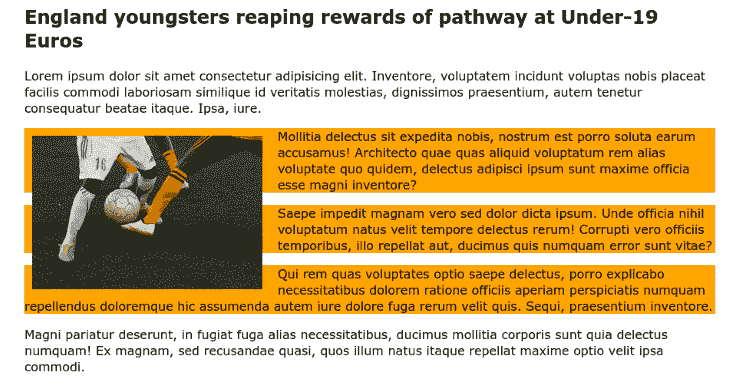

Float image demo with padding added to the image and highlighted paragraph text.

在这个例子中，我们添加了一些`padding`到`img`中，在它周围创建额外的空间，这样你就可以看到段落的完整尺寸。通过将`background-color:orange;`添加到第二、第三和第四段，很明显它们占据了包含`article`的整个宽度。但是，段落内容正在被浮动图像推到对面。

理解浮动的古怪之处

## 关于`float`看起来不寻常的是，包含浮动元素的父元素将会崩溃。为了理解我的意思，让我们举一个相当做作的例子。让我们创建一个包含两个浮动元素的`section`。

在这里，两个`img`浮到了容器的开始:

如果我们不向`section`添加任何东西，它的高度将为零！

```
<section>
  
  
</section>

<style>
  img {
    width: 300px;
    float: inline-start;
    margin-inline-end: 10px;
  }
</style>

```

现在，它看起来像这样:

如果你用浏览器的开发工具检查`section`，你可以确认**布局**标签中显示的尺寸:900px 宽度 x 0px 高度。

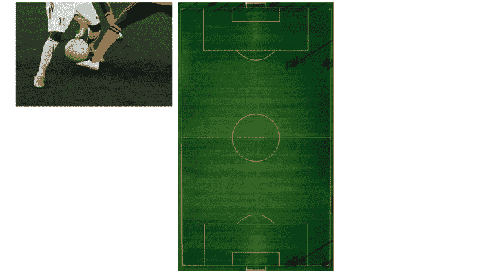

A `section` element containing two floated images.

然而，你不太可能创建一个只有浮动元素的父元素！那么，你为什么需要知道这些呢？

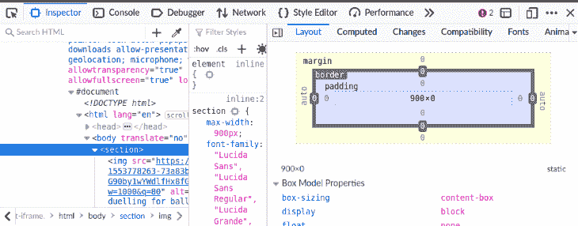

Section dimensions shown in the DevTools Layout tab.

嗯，在我们生活的这个世界里，墨菲定律“任何可能出错的事情都会出错”，比任何人希望的都更经常地被证明是正确的！事情可能会发生，如果发生了，你可能会挠头想知道为什么你的布局看起来很奇怪！

用`clear`退出 CSS 浮动元素

## CSS `[clear](https://developer.mozilla.org/en-US/docs/Web/CSS/clear)`属性是`float`的补充属性。当您希望某些元素不受浮动元素的影响时，可以使用它。您可以将元素的一侧或两侧设置为“清除”。被清除的元素将被移动到它之前的任何浮动元素之下。

`clear`属性具有与`float`相似的一组值:

`none`:不下移元素，清除过去的浮动元素

*   `left`:向下移动元素，清除过去的左浮动
*   `right`:向下移动元素以清除过去的右浮动
*   `both`:向下移动元素，清除左侧和右侧的浮动
*   `inline-start`:向下移动元素，清除其包含块起始端的浮动；也就是说，左浮动在从左到右的脚本上，右浮动在从右到左的脚本上
*   `inline-end`:向下移动元素，清除其包含块末端的浮动；也就是说，右浮动在从左到右的脚本上，左浮动在从右到左的脚本上
*   作为一个例子，下面是一个网站的文章页面，展示了一些浮动的图片。你会注意到文章底部有一个浮动图像，与网页的页脚重叠。

为了解决这个特殊的情况，我们可以将`clear: inline-end;`或`clear: right;`添加到`footer`中。

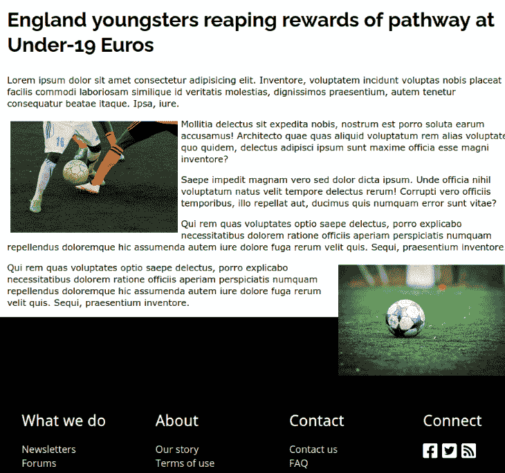

A second floated image overlaps with the footer.

如果我们想完全防止这种情况发生，我们可以使用`clear:both;`来代替。

要查看运行中的代码，请查看下面的 CodePen。您可以在`footer`上切换`no-floats`类来查看它的效果。

```
.no-floats {
    clear:both;
}

```

见笔 [`clear `例](https://codepen.io/robatronbobby/pen/BarjmPE)by rob 2([@ robatronbobby](https://codepen.io/robatronbobby))
on[code Pen](https://codepen.io)。

See the Pen [`clear` example](https://codepen.io/robatronbobby/pen/BarjmPE) by rob2 ([@robatronbobby](https://codepen.io/robatronbobby))
on [CodePen](https://codepen.io).

现在，让我们看一些额外的例子。

带有`clear`的 CSS `float`示例:引用

### 也许最常见的例子是引用。引用是指从文本中提取有趣的引用，并以大插图引用的形式出现。新闻出版物和精美的杂志倾向于这样做，以给出文章在不同部分讨论的内容的味道。

看笔 [拉引](https://codepen.io/robatronbobby/pen/vYRYZoK)by rob 2([@ robatronbobby](https://codepen.io/robatronbobby))
上 [CodePen](https://codepen.io) 。

See the Pen [Pull quote](https://codepen.io/robatronbobby/pen/vYRYZoK) by rob2 ([@robatronbobby](https://codepen.io/robatronbobby))
on [CodePen](https://codepen.io).

带有`clear`的 CSS `float`示例:首字下沉

### 在一些书籍和杂志的版式中，你可能会发现段落中第一个单词的首字母采用了一种独特的风格。它可能比周围的文本大，并且样式不同。有时，这个字母被称为首字下沉。

在 CSS 中，`[::first-letter](https://developer.mozilla.org/en-US/docs/Web/CSS/::first-letter)`伪元素可以用来样式化元素的第一个字母。如果我们创建了一个更大的首字母，我们可能想把它浮动到块的开头，让后续的文本行围绕它。

下面是一个例子，我们让第一个字母比段落的其余部分大得多，并把它浮动到块的开始。

参见 [CodePen](https://codepen.io) 上的笔 [首字母/首字下沉示例](https://codepen.io/robatronbobby/pen/zYWYpGQ)by rob 2([@ robatronbobby](https://codepen.io/robatronbobby))
。

See the Pen [Initial letter / Drop cap example](https://codepen.io/robatronbobby/pen/zYWYpGQ) by rob2 ([@robatronbobby](https://codepen.io/robatronbobby))
on [CodePen](https://codepen.io).

要了解这种风格如何提升版面，请看 Bartosz kwiecie 为这本[旅游杂志设计的首字下沉:](https://www.behance.net/gallery/2159303/Travel-Magazine)

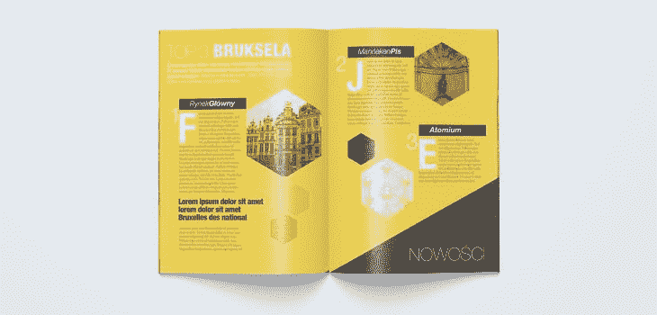

利用`shape-outside`发挥创造力

## 到目前为止，我们所有的例子都涉及到矩形的浮动元素。元素遵循[盒子模型](https://developer.mozilla.org/en-US/docs/Learn/CSS/Building_blocks/The_box_model)，并且具有矩形边界盒。然而，我们并不局限于单一的形状；使用`[shape-outside](https://developer.mozilla.org/en-US/docs/Web/CSS/shape-outside)`属性，我们可以创建各种能够影响文本流的酷形状！

我们可以提供一个图像作为`shape-outside`的值。浮动形状是基于指定图像的 alpha 通道计算的，它由`[shape-image-threshold](https://developer.mozilla.org/en-US/docs/Web/CSS/shape-image-threshold)`定义。默认值为 0.0(完全透明)。

因此，只有对支持透明性的图像格式(如 PNG、SVG 和 WebP)使用`shape-outside`才有意义。否则，我们仍然会得到一个矩形形状！

例如，假设我们有一个 SVG 图像，它有一个单独的`path`是一颗带有透明背景的红星。下面是对这个图像使用`shape-outside`的样子。

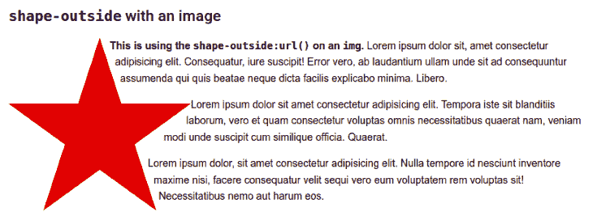

在这里，我使用了`float: left;`，因为不幸的是，Chrome (Linux)似乎对同时使用`float: inline-start;`和`shape-outside`有问题。

```
.star {
    width: 250px;
    float: left;
    shape-outside: url("https://upload.wikimedia.org/wikipedia/commons/3/34/Red_star.svg");
    shape-margin: 6px;
}

```

还有一个`[shape-margin](https://developer.mozilla.org/en-US/docs/Web/CSS/shape-margin)`属性，使我们能够调整形状周围的边距。

我们可以通过以下函数为`shape-outside`属性提供一个`[<basic-shape>](https://developer.mozilla.org/en-US/docs/Web/CSS/basic-shape)`作为值:`[inset()](https://developer.mozilla.org/en-US/docs/Web/CSS/basic-shape/inset)()`、`[circle()](https://developer.mozilla.org/en-US/docs/Web/CSS/basic-shape/circle)`、`[ellipse()](https://developer.mozilla.org/en-US/docs/Web/CSS/basic-shape/ellipse)`、`[polygon()](https://developer.mozilla.org/en-US/docs/Web/CSS/basic-shape/polygon)`或`[path()](https://developer.mozilla.org/en-US/docs/Web/CSS/path)`。这些在 [CSS 形状模块 1 级规范](https://www.w3.org/TR/css-shapes/)中定义。如果您曾经使用过`clip-path`属性，那么您也使用过这些函数。

假设我们想要创建一个灰色圆圈的`div`,并让文本围绕它流动，如下图所示。我们可以通过使用`float`和`shape-outside: circle()`来创建这个。

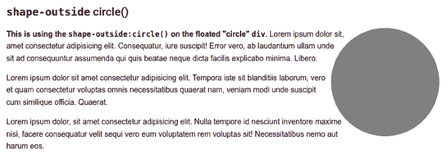

下面是创建带有流动文本的灰色圆圈的 CSS:

您可以省略`circle()`的值。在我们的例子中，`<radius>`和`<position>`参数的默认值给了我们想要的结果。默认的`<position>`是圆心。

```
.circle {
        border-radius: 50%;
        height: 200px;
        width: 200px;
        background-color: grey;
        float: right;
        shape-outside: circle();
}

```

这是一个以红星和灰色圆圈为特色的代码笔。

参见 [CodePen](https://codepen.io) 上的笔 [外形——外例](https://codepen.io/robatronbobby/pen/XWEWzGO)by rob 2([@ robatronbobby](https://codepen.io/robatronbobby))
。

See the Pen [shape-outside examples](https://codepen.io/robatronbobby/pen/XWEWzGO) by rob2 ([@robatronbobby](https://codepen.io/robatronbobby))
on [CodePen](https://codepen.io).

带有`shape-outside`的 CSS `float`示例:漏斗文本

### 使用`shape-outside`的另一个有趣的例子是在左边和右边都有一个浮动元素来过滤文本。

例如，您可以用两只手握住文本。我们可以将一只手的图像浮动到段落的每一边，并使用`shape-outside`和`polygon()`函数给段落一个三角形。

下面是附带的代码笔:

```


<p>
  Sometimes a web page’s text content appears to be
  funneling your attention towards a spot on the page
  to drive you to follow a particular link. Sometimes
  you don’t notice.
</p>

<style>
.left {
  shape-outside: polygon(0 0, 100% 100%, 0 100%);
  float: left;
  height: 6em;
}

.right {
  shape-outside: polygon(100% 0, 100% 100%, 0 100%);
  float: right;
  height: 6em;
  transform: rotateY(180deg);
}

p {
  text-align: center;
}
</style>

```

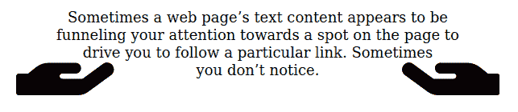

Using a floated element with `shape-outside` on both sides.

见 [CodePen](https://codepen.io) 上的笔 [文字漏斗带浮动和形状外](https://codepen.io/robatronbobby/pen/MWVKrjm)由 rob 2([@ robatronbobby](https://codepen.io/robatronbobby))
。

编辑 CSS 形状

如果你想知道如何编辑 CSS 形状，我推荐使用 Firefox DevTools。如果你点击`shape-outside`属性，你会看到它旁边有一个蓝色的“网格”符号，它会在页面上显示形状的轮廓(如下所示)。

## 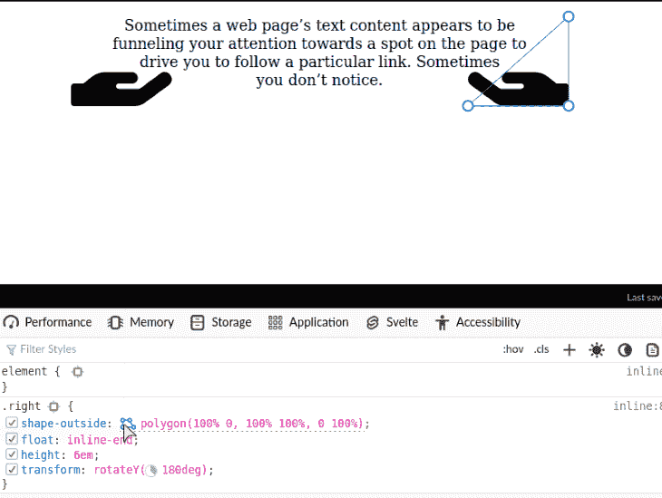

您可以四处移动控制点(路径上的圆圈)并编辑它们，就像在图形编辑器中编辑路径一样。据我所知，Chrome DevTools 没有提供同样的功能！

如果你想要更多的例子，克里斯多佛·范·桑特有一个`[shape-outside](https://codepen.io/collection/XGPKKp)` [代码笔集合](https://codepen.io/collection/XGPKKp)，里面充满了例子。

要了解如何在一个完整的版面中使用独特的形状，请查看这个杂志版面，同样来自[Bartosz kwiecie](https://www.behance.net/gallery/2159303/Travel-Magazine)。

截至 2022 年，[全球 95%的浏览器](http://caniuse.com/#feat=css-shapes)支持`shape-outside`属性。所以，不要害怕尝试一下！

包扎


[Travel Magazine design by Bartosz Kwiecień.](https://www.behance.net/gallery/2159303/Travel-Magazine)

在当今的前端开发领域似乎没有得到充分利用。也许，它是过去的受害者，当它经常被错误地用于页面布局时，事情就被混为一谈成了“不要使用浮动”。我希望我已经向您展示了`float`仍然是相关的，可以用来创建有趣的文本布局。我希望看到人们更频繁地使用`float`财产，为网络带来更多的创造力。

## 你的前端是否占用了用户的 CPU？

随着 web 前端变得越来越复杂，资源贪婪的特性对浏览器的要求越来越高。如果您对监控和跟踪生产环境中所有用户的客户端 CPU 使用情况、内存使用情况等感兴趣，

## .

LogRocket 就像是网络和移动应用的 DVR，记录你的网络应用或网站上发生的一切。您可以汇总和报告关键的前端性能指标，重放用户会话和应用程序状态，记录网络请求，并自动显示所有错误，而不是猜测问题发生的原因。

[try LogRocket](https://lp.logrocket.com/blg/css-signup)

现代化您调试 web 和移动应用的方式— [开始免费监控](https://lp.logrocket.com/blg/css-signup)。

[](https://lp.logrocket.com/blg/css-signup)[https://logrocket.com/signup/](https://lp.logrocket.com/blg/css-signup)

[LogRocket](https://lp.logrocket.com/blg/css-signup) is like a DVR for web and mobile apps, recording everything that happens in your web app or site. Instead of guessing why problems happen, you can aggregate and report on key frontend performance metrics, replay user sessions along with application state, log network requests, and automatically surface all errors.

Modernize how you debug web and mobile apps — [Start monitoring for free](https://lp.logrocket.com/blg/css-signup).