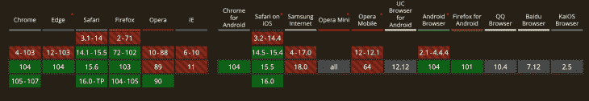

# 深入研究 CSS 个人转换属性

> 原文：<https://blog.logrocket.com/deep-dive-css-individual-transform-properties/>

如果没有转换属性的能力，你可能永远也不会知道 CSS。这种功能是 CSS 的核心，也是我们今天所知的用户界面(UI)的基石。然而，近年来，CSS 并没有回避对一些最基础的部分进行彻底改革。在用 [flexbox](https://css-tricks.com/snippets/css/a-guide-to-flexbox/) 和 [grid](https://css-tricks.com/snippets/css/complete-guide-grid/) 革新了布局，用[逻辑属性](https://www.danyuschick.com/articles/css-logical-properties-are-the-future-of-the-web-and-i18n/)重组了它的盒子模型之后，是时候介绍它的下一次进化了…

转变。

尽管许多微妙的用户界面交互看起来很柔和，很受欢迎，但是创建和编辑它们却是绝对不可能的。这是因为 CSS 有一个单一的`transform`属性来管理所有不同的值，比如`rotate`、`scale`和`translate`。

当转换单个值时，单个属性工作得很好。然而，当处理多个值时，它变成了一个繁重的认知负荷 CSS 试图通过引入单独的转换属性来解决这个认知负荷。

首先，让我们回顾一下当前的`transform`属性，然后发现如何通过使用新的单个转换属性来改进它的功能。让我们开始吧。

## `transform`地产的挑战

为了理解单个转换属性的好处，让我们首先来看看他们试图解决的两个关键挑战。刚开始时，这两者都不明显。

### 用进废退

下面的`transform`属性并不太复杂。它将缩放，平移，然后旋转元素。

```
.item {
  transform: scale(1.5) translate(0, 50%) rotate(90deg);
}

```

但是如果我们想改变`hover`上的缩放量，那么`transform`会发生什么呢？

每个`transform`函数必须在每个状态下定义，否则其值将丢失。为了在不丢失其`translate`和`rotate`值的情况下缩小`hover`上的项目，它们必须与更新的缩放值一起复制。

```
.item:hover {
  transform: scale(0.5) translate(0, 50%) rotate(90deg);
}

```

对于一个州来说，这可能不是太大的负担。但是随着变换的增长或者创建具有多个帧的动画时，这变得更加复杂。

然而，需要复制每一个`transform`函数带来了另一个挑战。

### 操作顺序

当使用一个以上的函数创建转换时，重要的是要注意浏览器将从左到右应用这些值。这意味着，尽管具有相同的值，但从视觉上看，下面的变换会有不同的结果。

```
.item:first-child {
  transform: scale(1.75) translate(0, 50%);
}

.item:last-child {
  transform: translate(0, 50%) scale(1.75);
}

```

第一个项目缩放后，将相对于其新大小进行平移。同时，第二个项目将在转换后缩放，导致元素的位置与第一个不完全相同。

见笔 [CSS 转换&排序的重要性](https://codepen.io/DanielYuschick/pen/YzaBMer)作者 Daniel Yuschick([@ DanielYuschick](https://codepen.io/DanielYuschick))
上 [CodePen](https://codepen.io) 。

随着转换变得越来越复杂，使用的`transform`函数越来越多，管理整个属性就变得越来越困难。以多帧动画为例:

请看 [CodePen](https://codepen.io) 上 Daniel Yuschick([@ DanielYuschick](https://codepen.io/DanielYuschick))
的笔 [CSS 变换动画](https://codepen.io/DanielYuschick/pen/BarMOMM)。

当创建具有多个`transform`值的动画时，在每一帧中以正确的顺序管理每个属性的认知负荷会变得相当沉重。

```
@keyframes animate {
  10%, 15% {
    transform: translateX(0);
  }
  16% {
    transform: translateX(0) scale(0.5);
  }
  18% {
    transform: translateX(0) scale(1.5);
  }
  20% {
    transform: translateX(0) scale(1);
  }
  50% {
    transform: translateX(50%) scale(1) rotate(180deg);
  }
  65% {
    transform: translateX(-50%) scale(1) rotate(180deg);
  }
}

```

CSS 个体转换属性的引入似乎消除了这些挑战和认知负荷。

## 什么是 CSS 单个变换属性？

CSS 引入了三个新的独立变换属性:`rotate`、`scale`和`translate`。

```
.item {
  rotate: 180deg;
  scale: 1.5;
  translate: 50% 0;
}

```

这些新属性像传统的`transform`函数一样工作，但是没有传统的挑战。

因为这些新的单独属性彼此独立，所以不需要跨状态复制值。并且不需要跨状态复制值，顺序变得更容易管理，除了各个转换属性也不依赖于它们的顺序。

传统的`transform`函数从左到右的顺序被应用，单个的变换属性以更有利的顺序被应用:1。翻译 2。旋转 3。规模。

随着使用`transform`属性的关键挑战被排除，前面的动画可以被重构为更易管理和易读的`@keyframes`块，如下所示:

请看 [CodePen](https://codepen.io) 上 Daniel Yuschick([@ DanielYuschick](https://codepen.io/DanielYuschick))
的笔 [CSS 个体变换属性动画](https://codepen.io/DanielYuschick/pen/XWEOxRa)。

```
@keyframes animate {
  10%, 15% {
    scale: 1;
    translate: 0;
  }
  16% {
    scale: 0.5;
  }
  18% {
    scale: 1.5;
  }
  20% {
    rotate: 0deg;
    scale: 1;
  }
  50% {
    rotate: 180deg;
    translate: 50% 0;
  }
  65% {
    rotate: 180deg;
    translate: -50% 0;
  }
}

```

## 个别转换属性考虑事项

单个转换属性在使用时需要一些其他的考虑，这些考虑可能与它们的遗留等效物不同。我们将在下面更深入地讨论它们。

* * *

### 更多来自 LogRocket 的精彩文章:

* * *

### 留下的一些财产

虽然 CSS 已经引入了三个单独的属性`rotate`、`scale`和`translate`，但是剩余的`transform`函数并没有被赋予相同的优先级。正因为如此，个人和`transform`的属性才能协同工作。

你可以访问 MDN 获得`transform`功能的[完整列表。](https://developer.mozilla.org/en-US/docs/Web/CSS/transform)

### `transform-origin`

当转换一个元素时，通常也使用`transform-origin`属性。虽然大多数浏览器默认对元素进行变换，比如从图像的中心点旋转图像，但是`transform-origin`属性允许对元素的变换点进行显式控制。

因为这两个属性有相似的名字，`transform`和`transform-origin`，心理模型很清楚这两个属性是相关的——一个已经与单个转换属性分离的心理模型。

然而，尽管属性名不再对齐，但是`rotate`、`scale`和`translate`属性都作为变换运行，仍然如预期的那样遵循任何`transform-origin`值。这意味着利用显式`transform-origin`点的现有转换可以被重构，以使用单独的转换属性，而没有任何冲突。

```
.item {
  scale: 1.5;
  transform-origin: top right;
}

```

### 将值设置为`0`

当将 CSS 中的几乎任何值设置为`0`时，通常可以不为该值提供任何单位。当值为`0`时，它是`0px`还是`0rem`并不重要。这同样适用于`transform`属性和旋转函数。

```
.item {
  transform: rotate(90deg);
}

.item:hover {
  transform: rotate(0);
}

```

但是，当使用单个的`rotate`属性时，必须定义一个 unit 或 CSS 关键字。

```
.item {
  rotate: 90deg;
}

.item:hover {
  // ❌ Will not rotate without a unit
  rotate: 0;

  // ✅ Will rotate with a unit specified
  rotate: 0deg;
}

```

### `will-change`属性

与`transform-origin`非常相似，单个转换属性也与`will-change`属性一起工作。尽管如此，使用 `will-change`时的[考虑事项仍然应该遵循，比如只有当动画或变换已经遭受性能问题时才应用属性。](https://dev.opera.com/articles/css-will-change-property/)

如果`transform`属性没有引起任何性能问题，切换到单独的转换属性不会改变这一点。

### 总性能

单个变换属性的使用与原始的`transform`属性一样有效。

## 支持和后退

CSS 单个变换属性的好处如果用不上就一文不值。幸运的是，现代对这些属性的支持已经很好了，至少在所有主流浏览器的最新版本中都有支持，在 v104、Safari 14.1 和 Firefox 103 中引入了 Chrome 和 Edge。



然而，只为主流浏览器的最新版本开发产品通常是一种幻想，而不是 web 开发的现实。但是由于各个变换属性可以直接映射到传统的`transform`值，因此可以使用可靠的回退来进行渐进增强。

```
.container {
  rotate: 80deg;
  scale: 1.5;
  translate: 50% 10%;

  @supports not (scale: 1) {
    // Use transform fallback if CSS individual transform properties are not supported
    transform: translate(50%, 10%) rotate(80deg) scale(1.5);
  }
}

```

通过使用带有关键字`not`的`@supports`查询，我们能够优先处理较新的属性，只在需要的环境中呈现回退。但是要小心，因为`transform`属性依赖于它的值的顺序，所以在编写回滚时必须记住这一点。

为了使编写回退的过程更容易，可以使用用于单个转换属性的 [SCSS 混合来自动化回退属性`transform`及其值的顺序。](https://codepen.io/DanielYuschick/pen/NWYozPK)

请看 [CodePen](https://codepen.io) 上 Daniel Yuschick([@ DanielYuschick](https://codepen.io/DanielYuschick))
的笔 [CSS 个体变换属性 SCSS Mixin](https://codepen.io/DanielYuschick/pen/NWYozPK) 。

结论

## 转换一直是 CSS 的一个基本特性。他们的互动定义了我们今天所知的网络。随着各个变换属性、`rotate`、`scale`和`translate`的引入，动画和变换的边界可以被进一步推进。

这些特性在其他什么地方可能是有益的？您是否也希望看到其他的`transform`函数，比如`skew`和特定于 axis 的函数，被移到它们自己的属性中？

至少，CSS 单个转换属性有两个主要好处:

对变换和动画的介绍现在可能对初学者更好

1.  清理现有变换和动画的能力
2.  仅仅因为这两个原因，单独的转换属性是 CSS 基础的一个受欢迎的转变。

资源

## 你的前端是否占用了用户的 CPU？

随着 web 前端变得越来越复杂，资源贪婪的特性对浏览器的要求越来越高。如果您对监控和跟踪生产环境中所有用户的客户端 CPU 使用情况、内存使用情况等感兴趣，

## .

LogRocket 就像是网络和移动应用的 DVR，记录你的网络应用或网站上发生的一切。您可以汇总和报告关键的前端性能指标，重放用户会话和应用程序状态，记录网络请求，并自动显示所有错误，而不是猜测问题发生的原因。

[try LogRocket](https://lp.logrocket.com/blg/css-signup)

现代化您调试 web 和移动应用的方式— [开始免费监控](https://lp.logrocket.com/blg/css-signup)。

[](https://lp.logrocket.com/blg/css-signup)[https://logrocket.com/signup/](https://lp.logrocket.com/blg/css-signup)

[LogRocket](https://lp.logrocket.com/blg/css-signup) is like a DVR for web and mobile apps, recording everything that happens in your web app or site. Instead of guessing why problems happen, you can aggregate and report on key frontend performance metrics, replay user sessions along with application state, log network requests, and automatically surface all errors.

Modernize how you debug web and mobile apps — [Start monitoring for free](https://lp.logrocket.com/blg/css-signup).