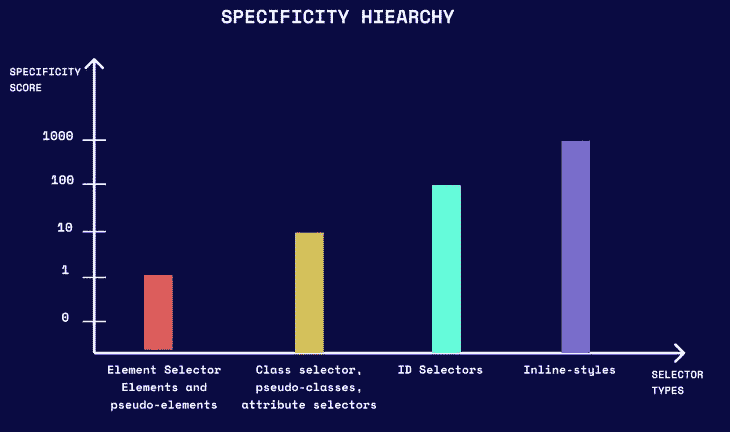
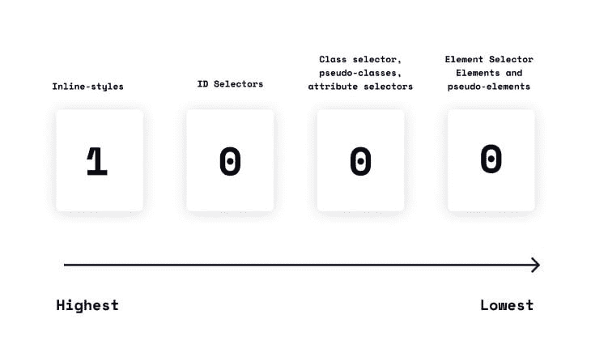
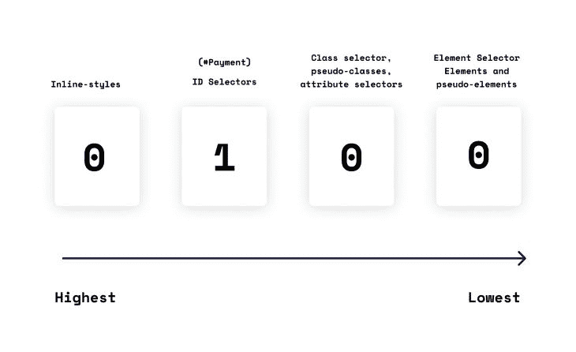
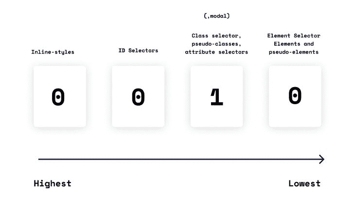
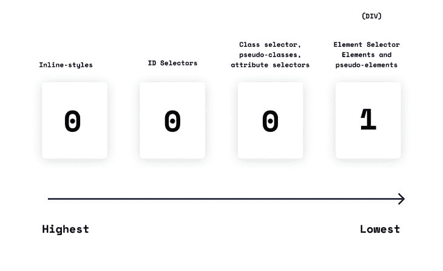

# 深入研究 CSS 特异性——log rocket 博客

> 原文：<https://blog.logrocket.com/deep-dive-css-specificity/>

每个 CSS 开发人员都应该熟悉三个关键的 CSS 概念:[级联](https://developer.mozilla.org/en-US/docs/Web/CSS/Cascade)、[继承](https://developer.mozilla.org/en-US/docs/Web/CSS/inheritance)和[特异性](https://developer.mozilla.org/en-US/docs/Web/CSS/Specificity)。特异性是一种 CSS 方法，用于在将具有不同样式规则的选择器应用于同一元素时解决冲突。特异性是 CSS 的一个基本组成部分，理解它是如何工作的会让你在调试时节省很多时间和麻烦。

在本文中，我们将讨论以下内容:

让我们开始吧！

## 什么是 CSS 特异性？

如果一个元素有两个或更多具有冲突样式规则的选择器，浏览器将查看特异性分数来确定应该应用哪个样式。与元素相关性更高的属性值将具有更高的特异性值。因此，浏览器将应用具有最高特异性分数的选择器的样式。特异性仅适用于多个声明针对同一个元素的情况。

特殊性的重要性怎么强调都不过分。作为开发人员，我们偶尔会犯错误，并且会不止一次地尝试将 HTML 元素作为目标。特异性决定了选择器的哪个样式规则将应用于元素。对特殊性有一个很好的理解意味着你将能够更快地发现和解决问题，并且花费更少的精力。

## 特异性层级是如何工作的？

特异性包括创建分数来对选择器进行排名或比较。得分最高的选择器会将其样式规则应用于该元素。当`!important`属性应用于选择器时，这个规则的一个例外就开始起作用了，我们将在本文后面讨论这个例外。

选择器的特异性分数由四部分特异性层次结构决定:

1.  内联样式选择器是使用`style`属性在 HTML 文档中定义的样式规则。这些选择器的特异性得分为 1000，因此优先于其他选择器类型
2.  ID 选择器与`#modal`一样，特异性分数为 100
3.  类、伪类和属性选择器的特异性得分为 10。`.modal`、`:active`和`[href]`分别是类和伪类以及属性选择器的例子
4.  元素和伪元素选择器的特异性得分为 1。`div`和`:after`分别是元素和伪元素选择器的例子

***注意:*** ，还有一个通用选择器(用`*`字符表示)，用于[将 CSS 样式应用到页面上的所有 HTML 元素](https://blog.logrocket.com/shine-effect-only-css/)。通用选择器的特异性为零；因此，只要有冲突的选择器，它的样式规则就会被覆盖

下面是 CSS 特异性层次的可视化表示:



现在，让我们回顾另一种视觉表征，以帮助我们完全掌握特异性的概念。

在本例中，我们将仔细看看以下选择器:

### 内嵌样式

当内联样式规则应用于一个元素时，该元素的内联样式特异性分数为 1，其他选择器的分数为 0，总 CSS 特异性分数为 1000。这意味着内联样式规则将优先于与 ID、类或元素选择器相关联的任何样式规则。`!important`属性可以覆盖内联样式规则，但是我们将在本文后面讨论这个问题。



### ID 选择器(`#payment`)

具有 ID 选择器的元素的 ID 特异性分数为 1，而其他选择器的 ID 特异性分数为 0，总的 CSS 特异性分数为 100。



### 类别选择器(`.modal`)

具有类选择器的元素的类特异性分数为 1，而其他选择器的类特异性分数为 0，因此 CSS 特异性总分数为 10。



### 元素选择器(`div`)

`div`元素的元素选择器特异性得分为 1，而其他选择器的得分为 0，总 CSS 特异性得分为 1。



## 特异性是如何计算的？

在这一点上，我们对特异性是如何工作的有了一个概念，并且理解了每个选择器是如何被给予一个个体特异性分数的。现在，让我们看看如何计算多个选择器的特异性分数。

下表中的“计算”栏显示了单个选择器特性的总和。“特异性值”列显示多个选择器的总计算特异性。

| 选择器 | 计算 | 特异性值 |
| --- | --- | --- |
| `div` | 一 | 一 |
| `.modal` | 10 | 10 |
| `#payment` | 100 | 100 |
| `<div style="background: #01``0101;>` | 1000 | 1000 |
| `#payment.desc` | 100+10 | 110 |
| `div.modal.test` | 1+10+10 | 21 |

这里有一个简单的例子:

```
<div class="modal">
  <h1>Sign Up</h1>
  <div class="desc">
      <p id="desc-text">Please proceed to create an account in order to get all of our latest features</p>
  </div>
</div>

```

让我们使用两个不同的选择器来设计`p`元素的样式，以便准确地演示特异性是如何工作的。

这是第一个选择器:

```
.modal .desc p{
  color:blue;
}

```

这是第二个选择器:

```
#desc-text{
  color:yellow;
}

```

您认为这两个选择器中的哪一个将应用于`p`元素？如果你选择了第二个选择器，你就对了！原因如下:

如下所示，与第一选择器`modal .desc p`相比，第二选择器`#desc-text`具有更高的特异性分数。因此，第二个选择器的样式规则将应用于`p`元素。在这个例子中，`p`元素应该是`yellow`。

| 选择器 | 计算 | 特异性值 |
| --- | --- | --- |
| `.modal .desc p` | 10 + 10 + 1 | 21 |
| `#desc-text` | 100 | 100 |

重要的是要理解，在这种情况下，第二个选择器获胜是因为它具有更高的分数，而不是因为它在级联中出现的顺序。

CSS 的一个常见误解是选择器是根据级联应用的。这并不完全正确。为了说明这一点，这里有一个实例，同样有两个选择器，只是这次`#desc-text`选择器放在级联中的`modal .desc p`选择器之前。

如您所见，尽管外观顺序发生了变化，但是`#desc-text`选择器的样式仍然应用于`p`元素，因为该选择器具有最高的特异性分数:

参见 [CodePen 上的](https://codepen.io)[@ D _ King Nelson](https://codepen.io/D_kingnelson)
King Nelson[的](https://codepen.io/D_kingnelson)笔[CSS 特异性示例。](https://codepen.io/D_kingnelson/pen/KKymemr)

还值得注意的是，CSS 级联规则仅在冲突的选择器具有相同的特异性分数时生效。在这种情况下，将应用级联中最后一个选择器的样式规则。

在下面的例子中，以元素为目标的两个选择器具有相同的特异性。因此，CSS 级联规则开始起作用，最后一个选择器的样式规则应用于元素:

参见 [CodePen 上的](https://codepen.io) [@D_kingnelson](https://codepen.io/D_kingnelson) )
笔[CSS 特异性例 2](https://codepen.io/D_kingnelson/pen/qBVmLWM) 。

## 多个类会打败一个 ID 选择器吗？

到目前为止，我们的计算简单地显示了如何给一个选择器一个特异性分数，以及如何用这个分数来加权一个选择器。

然而，有一些边缘情况需要考虑。一种这样的情况是，当存在多个类时，每个类都比单个 ID 选择器产生更高的特异性分数。不管有多少个类，或者每个类的特异性有多高，单个 ID 选择器仍然会赢。

## 什么是`!important`规则例外？

当样式声明中使用了一个`!important`规则时，它优先于任何其他声明，并且它的样式被应用于元素。然而，在每种情况下都依赖于`!important`规则是不好的做法，应该避免。`!important`规则使调试变得复杂，因为它[打破了样式表](https://blog.logrocket.com/control-css-cascade-with-cascade-layers/#unlayered-styles-specificity)中正常的层叠。

当两个带有`!important`规则的声明在同一个元素上发生冲突时，将应用具有更大特殊性的声明。

这里有一个例子:

```
<div class="empty">
  <p>An empty div</p>
</div>

```

```
.empty{
  background-color: #010101 !important;
}

div{
  background-color: #d40000 !important;
}

```

在这个例子中，类选择器将对元素应用样式规则，因为它比元素选择器具有更高的特异性分数。

如果带有`!important`规则的两个声明具有相同的特异性，那么级联中后面的声明将胜出。当特异性不再有足够的决定力量时，级联就开始起作用了。

## 什么是邻近无知？

邻近忽略仅仅意味着选择器与被引用的元素相比嵌套有多深并不重要，因为这对特异性没有影响。

这里有一个例子:

```

<section>
  <div>
    <p>Thank you for following up to this point, you're amazing!</p>
  </div>
</section>

```

```
div p {
  font-size:20px;
}

section p {
  font-size:30px;
}

```

在这个例子中，`p`元素与`div`元素非常接近并不重要。这对其特异性没有影响。两个选择器具有相同的特异性分数；因此，CSS 级联规则生效，并应用最后一个选择器。

## 继承样式与直接目标元素

CSS 元素可以有直接针对它们的样式规则，也可以从父元素继承样式规则。直接作为目标的元素的样式总是优先于继承的样式，不管继承规则的特殊性如何。

在下面的例子中，`#parent`选择器的特异性分数为 100。但是，它的样式规则不会应用于`p`元素，因为它是一个继承的样式。

```
<div id="parent">
    <p>Congratulations, you made it this far!</p>
</div>

```

```
#parent {
  color: blue;
}

p {
  color: yellow;
}

```

## 结论

在本文中，我们讨论了什么是 CSS 特异性以及它是如何工作的。我们回顾了如何计算特异性得分，并查看了单个和多个选择器的示例。我们还讨论了`!important`规则例外和邻近无知。

特异性是 CSS 的主要支柱之一，也是理解起来非常有用的概念。对特殊性的深入了解将有助于您快速指定哪个选择器的样式规则应该应用于特定的元素，还将有助于您更快地识别和解决开发错误。

## 你的前端是否占用了用户的 CPU？

随着 web 前端变得越来越复杂，资源贪婪的特性对浏览器的要求越来越高。如果您对监控和跟踪生产环境中所有用户的客户端 CPU 使用、内存使用等感兴趣，

[try LogRocket](https://lp.logrocket.com/blg/css-signup)

.

[](https://lp.logrocket.com/blg/css-signup)[https://logrocket.com/signup/](https://lp.logrocket.com/blg/css-signup)

LogRocket 就像是网络和移动应用的 DVR，记录你的网络应用或网站上发生的一切。您可以汇总和报告关键的前端性能指标，重放用户会话和应用程序状态，记录网络请求，并自动显示所有错误，而不是猜测问题发生的原因。

现代化您调试 web 和移动应用的方式— [开始免费监控](https://lp.logrocket.com/blg/css-signup)。