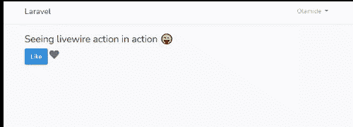
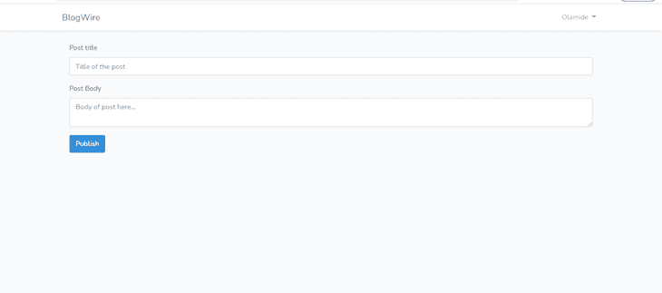

# 深入了解 Laravel Livewire 

> 原文：<https://blog.logrocket.com/deep-dive-into-laravel-livewire/>

Laravel Livewire 是一个用于构建动态界面的全栈 Laravel 框架。在不久前，要用 Laravel 构建一个应用程序，你要么必须:

1.  编写刀片模板并在服务器端呈现您的应用
2.  将后端编写为接受和响应 JSON 的 API，然后使用 Vue、React 或 Angular 等前端框架来使用 API 和实现 UI

但是现在，我们有了第三个选择:Livewire。我很想深入探讨上面选项 1 和 2 的利弊，但这已经在[这篇写得很好的文章](https://blog.logrocket.com/livewire-vs-vue/)中得到了公正的评价。

在本文中，我们将深入探讨 Livewire，看看它如何应用于现实应用中。

### 我们将建造什么

我们将建立一个简单的博客应用程序，具有以下功能:

1.  任何人都可以创建帐户并登录
2.  登录的用户可以创建和更新他们自己的帖子
3.  任何人都可以阅读帖子

## 先决条件和设置

本教程假设您对 Laravel 相当有经验(注意，本教程使用的是 Laravel 7.x)。不需要事先有使用 Livewire 的经验——我想这就是我们在这里的原因。

当然，首先，我们必须建立我们的开发环境。首先，创建一个新的 Laravel 应用程序:

```
composer create-project --prefer-dist laravel/laravel:^7.0 blog-wire

```

然后用 composer 安装 Livewire 软件包:

```
composer require livewire/livewire

```

创建一个新数据库，并将您的数据库凭证添加到`.env`文件中。这就是我们开始“直播连线”所需要的一切！

## Livewire 是如何工作的？

在我们开始之前，最好先了解一下 Livewire 是如何工作的。概括地说:

*   Livewire 将初始组件输出呈现到页面上——是的，就像典型的服务器呈现的刀片模板一样
*   当交互发生时，Livewire 用更新的数据向服务器发出 AJAX 请求
*   服务器重新呈现组件，并用更新的 HTML 进行响应
*   然后，Livewire 根据变化的内容智能地改变 DOM

如你所见，这就像把你的前端和后端放在一个地方，不需要重复逻辑。

## Livewire 中的关键概念

### 在页面上激活 Livewire

要让 Livewire 在页面上工作，您需要在每个需要的页面上包含 Livewire 样式和脚本。通常，这些会进入你的基本模板。你可以使用`@livewireStyles`和`@livewireScripts`来实现:

```
//app.blade.php
<!DOCTYPE html>
<html lang="en">
<head>
    <meta charset="UTF-8">
    <meta name="viewport" content="width=device-width, initial-scale=1.0">
    <meta http-equiv="X-UA-Compatible" content="ie=edge">
    <title>@yield('title')</title>
    @livewireStyles
</head>
<body>
    @yield('content')
    @livewireScripts
</body>
</html>

```

### Livewire 组件

Livewire 围绕其组件竭尽全力。Livewire 组件与典型的基于 Laravel 刀片类的组件非常相似。让我们快速看一下这两个。

#### 创建 Laravel 刀片组件

您可以通过运行以下命令来创建一个 Laravel 刀片组件:

```
php artisan make:component Alert

```

这将创建一个新的`Alert.php`类文件，并将其放在`App\Views\Components`文件夹中。然后，相应的视图模板被创建并放置在`resources/views/components`中。为了显示组件，您可以使用这个 Blade 语法:`<x-alert/>`。

您可以在[文档](https://laravel.com/docs/7.x/blade#components)中进一步了解 Laravel 刀片组件。

#### 创建 Livewire 组件

要创建 Livewire 组件，请运行以下命令:

```
php artisan make:livewire Alert

```

该命令还将创建两个新文件:`app\Http\Livewire\Alert.php`和一个视图模板`resources/views/livewire/alert.php`。

您可以使用`<livewire:alert />`或`@livewire('alert')`渲染 Livewire 组件。

如您所见，这些命令看起来非常相似。唯一的主要区别是，对于 Livewire 组件，在组件类和它的视图模板之间有一个实时同步(不需要刷新页面)。我们将很快看到这是如何工作的。

### Livewire 属性

组件模板视图可以使用组件类的公共属性。不止于此——属性的值与视图实时同步，因此当您在视图中更新属性的值时，它会在组件类中自动更新。

```
//App\Http\Livewire\Alert.php
<?php
class Alert extends Component{
  public $message = "Our alert message";
}

// livewire/alert.blade.php
<div>
  <input wire:model="message">
  <br/>
  {{ $message }}
</div>

```

要将组件属性绑定到 html input 元素，可以使用下面的 sytax:

```
wire:model="property name"

```

在输入框中输入，就会看到`$message`的值实时更新。这与 Vue.js、React、Angular 等框架中的数据绑定概念非常相似。点击了解更多关于 Livewire 属性[的信息。](https://laravel-livewire.com/docs/2.x/properties)

### Livewire 动作

正如您可以将视图模板中的数据绑定到组件的公共属性一样，您也可以将客户端事件映射到组件中的方法。例如，您可以响应 click 事件、keyup 和 keydown 事件等。使用组件类中定义的方法。

让我们看一个例子:

```
<?php

use Livewire\Component;
class PostAlert extends Component{
  public $liked = true;
  public function render(){
    return view('livewire.post-alert');
  }

  public function toggleLike(){
    $this->liked = !$this->liked;
  }
}

// livewire/post-alert.blade.php
<div>
    <h4>Seeing livewire action in action 😜</h4>
    <button class="btn btn-primary" wire:click="toggleLike()">
        Like
    </button>
    @if ($liked)
        <i class="fa fa-heart text-danger h4"></i>
    @else
        <i class="fa fa-heart text-secondary h4"></i>
    @endif
</div>

```

在上面的组件类中，我们创建了一个方法`toggleLike()`,该方法将`liked`属性的值切换到其相反的布尔值。在模板视图中，我们有一个按钮和一个心形图标，根据`liked`属性的值，该图标被染成红色或灰色。

我们使用了`wire:click=[action name]`语法将`toggleLike`方法绑定到点击事件。



Livewire action toggling a button.

许多 Livewire 的用例都围绕着属性和动作，因此，理解它们非常重要。这些概念可以适用于`create form`、`edit form`、`delete form`等事物。点击阅读更多关于 Livewire 行动[的信息。](https://laravel-livewire.com/docs/2.x/actions)

### 数据有效性

Livewire 使数据验证无缝化。要验证来自表单模板视图的数据，您需要编写一个包含验证规则的`$rules`属性，就像在 Laravel 中一样。此后，您调用方法中的`$this→validate()`进行验证。

让我们来看一个创建博客帖子的表单:

```
...
class CreatePost extends Component
{
    public $title, $body;
    public $success;
    protected $rules = [
        'title' => 'required|string|max:220',
        'body' => 'required'
    ];

    public function render()
    {
        return view('livewire.create-post')
            ->extends('layouts.app')
            ->section('content');
    }
    public function create(){
        $this->validate();
        Post::create([
            'title' => $this->title,
            'slug' => Str::slug($this->title),
            'body' => $this->body,
            'author_id' => auth()->id()
        ]);

        $this->success = true;
    }
}

// livewire/create-post
<div class="container">
    @if ($success)
        <div class="alert alert-success">
            Post has been created successfully
        </div>
    @endif
    <form wire:submit.prevent="create">
        <div class="form-group">
            <label for="Post title">Post title</label>
            <input wire:model="title" type="text" name="title" id="title" class="form-control" placeholder="Title of the post">
            @error('title') <span class="error">{{ $message }}</span> @enderror
        </div>
        <div class="form-group">
            <label for="Post body">Post Body</label>
            <textarea name="body" id="body" placeholder="Body of post here..." wire:model="body" class="form-control"></textarea>
            @error('body') <span class="error">{{ $message }}</span> @enderror
        </div>
        <div>
            <button class="btn btn-primary" type="submit">Publish</button>
        </div>
    </form>
</div>

```

在上面的表单代码中，当用户提交帖子时，如果帖子没有通过验证，就会显示验证错误，并且不会刷新页面。

## Laravel Livewire 入门

说得够多了，让我们开始行动吧。当我们构建我们的演示应用程序时，您可以在 [GitHub repo](https://github.com/sdkcodes/laravel-livewire-tutorial) 中跟随我们。

由于我们希望登录的用户能够管理他们自己的帖子，他们必须首先创建一个帐户。为此，我们将使用 Laravel 的内置[认证系统](https://laravel.com/docs/7.x/authentication)。

首先，安装 laravel/ui composer 包:

```
composer require laravel/ui

```

然后运行`php artisan ui vue --auth`来搭建整个认证系统，接着运行`php artisan migrate`来进行数据库迁移。

> **注意事项**。，我们过去用控制器做的大多数事情现在将使用 Livewire 组件来完成。

让我们继续创建我们的博客帖子应用程序所需的模型，`App\Post`:

```
<?php
namespace App;
use Illuminate\Database\Eloquent\Model;
use Illuminate\Database\Eloquent\SoftDeletes;
class Post extends Model
{
    use SoftDeletes;

    protected $guarded = [];
    public function author(){
        return $this->belongsTo(User::class, 'author_id', 'id');
    }
}

```

现在我们将创建我们的迁移文件，
`php artisan make:migration create_posts_table--table=posts:`

```
Schema::create('posts', function (Blueprint $table) {
            $table->id();
            $table->string('title');
            $table->string('slug')->unique();
            $table->longText('body');
            $table->integer('author_id');
            $table->timestamps();
            $table->softDeletes();
});

```

### 创建组件

我们将为我们想要的每个博客操作创建一个组件，即创建帖子、编辑帖子、列出帖子和查看帖子。让我们继续创建组件:

*   `php artisan make:livewire CreatePost`
*   `php artisan make:livewire EditPost`
*   `php artisan make:livewire ListPost`
*   `php artisan make:livewire HomePost`
*   `php artisan make:livewire ReadPost`

我们可以像这样直接从路线中呈现 Livewire 组件:

```
Route::get('/posts/create', [\App\Http\Livewire\CreatePost::class, '__invoke'])->middleware('auth');

```

如上所示，我们将路由到 Livewire 组件，而不是调用控制器动作。现在让我们在`web.php`中添加我们需要的所有路线:

```
Route::get('/', function () {
    return view('index');
});
Auth::routes();
Route::get('/post/{slug}', [\App\Http\Livewire\ReadPost::class, '__invoke']);
Route::get('/home', '[email protected]')->name('home');
Route::get('/posts/create', [\App\Http\Livewire\CreatePost::class, '__invoke'])->middleware('auth');
Route::get('/posts/{id}/edit', [\App\Http\Livewire\EditPost::class, '__invoke'])->middleware('auth');

```

呈现文章列表的组件将如下所示:

```
//ListPost.php
<?php
namespace App\Http\Livewire;
use Livewire\Component;
class ListPost extends Component
{
    public function render()
    {
        $posts = \App\Post::latest()->paginate(20);
        return view('livewire.list-post', ['posts' => $posts])
            ->extends('layouts.app')
            ->section('content');
    }
}

//livewire/list-post.blade.php
<div>
    <h4>My Posts <a href="{{ url('posts/create') }}" class="btn btn-primary"><i class="fa fa-plus"></i> Add new</a></h4>
    <ul class="list-group list-group-flush">
        @forelse ($posts as $post)
            <li class="list-group-item">

                <div class="float-right">
                    <a href='{{ url("posts/{$post->id}/edit") }}' class="btn btn-primary"><i class="fa fa-edit"></i> Edit</a>
                </div>
                <div>
                    <h5>{{ $post->title }}</h5>
                    <p>{!! substr(strip_tags($post->body), 0, 200) !!}</p>
                    <small class="text-muted">Published {{ $post->created_at }}</small>
                </div>

            </li>    
        @empty
            <li>You have not written any posts yet, write one now</li>
        @endforelse

    </ul>
</div>

```

然后，为了创建帖子，我们将使用以下代码:

```
//CreatePost.php
<?php
namespace App\Http\Livewire;
use App\Post;
use Livewire\Component;
use Illuminate\Support\Str;
class CreatePost extends Component
{
    public $title, $body;
    public $success;
    protected $rules = [
        'title' => 'required|string|max:220',
        'body' => 'required'
    ];

    public function render()
    {
        return view('livewire.create-post')
            ->extends('layouts.app')
            ->section('content');
    }
    public function create(){
        $this->validate();
        Post::create([
            'title' => $this->title,
            'slug' => Str::slug($this->title),
            'body' => $this->body,
            'author_id' => auth()->id()
        ]);

        $this->success = true;
    }
}

```

在上面的组件中，我们创建了公共变量来保存博客文章的标题和正文内容，还创建了一个`success`变量来指示文章创建是否成功。

在`render()`方法中，Livewire 允许我们分别通过`extends()`和`section()`方法指定用于呈现组件的布局文件和我们希望它显示的部分。

现在模板视图如下所示:

```
<div class="container">
    @if ($success)
        <div>
            <div class="alert alert-success">
                Post has been created successfully. <a href="{{ url('/home') }}">View all posts</a>
            </div>

        </div>
    @endif

    <form wire:submit.prevent="create">
        <div class="form-group">
            <label for="Post title"&gt;Post title</label>
            <input wire:model="title" type="text" name="title" id="title" class="form-control" placeholder="Title of the post">
            @error('title') <span class="error">{{ $message }}</span> @enderror
        </div>
        <div class="form-group">
            <label for="Post body">Post Body</label>
            <textarea name="body" id="body" placeholder="Body of post here..." wire:model="body" class="form-control"></textarea>
            @error('body') <span class="error">{{ $message }}</span> @enderror
        </div>
        <div>
            <button class="btn btn-primary" type="submit">Publish</button>
        </div>
    </form>
</div>

```

如果您将浏览器导航到`/posts/create`，您应该会看到显示的创建表单:



这是 Livewire 在现实世界中应用的一个相当基本的例子。

## 结论

Livewire 在后端和前端之间架起了一座桥梁。您可以获得实时交互性的好处，而不必自己编写大量的 JavaScript。如果你以前用过 Vue.js，你会很容易看到 Livewire 的好处。

Livewire 对于对客户端要求很高的应用来说并不是一个很好的选择。但是，如果你想要一个服务器渲染的应用程序，带有一点反应，Livewire 将会很好地为你服务。

还是那句话，我们在本教程中搭建的 app 可以在[G](https://github.com/sdkcodes/laravel-livewire-tutorial)[it](https://github.com/sdkcodes/laravel-livewire-tutorial)[H](https://github.com/sdkcodes/laravel-livewire-tutorial)[ub](https://github.com/sdkcodes/laravel-livewire-tutorial)上找到。

## 使用 [LogRocket](https://lp.logrocket.com/blg/signup) 消除传统错误报告的干扰

[](https://lp.logrocket.com/blg/signup)

[LogRocket](https://lp.logrocket.com/blg/signup) 是一个数字体验分析解决方案，它可以保护您免受数百个假阳性错误警报的影响，只针对几个真正重要的项目。LogRocket 会告诉您应用程序中实际影响用户的最具影响力的 bug 和 UX 问题。

然后，使用具有深层技术遥测的会话重放来确切地查看用户看到了什么以及是什么导致了问题，就像你在他们身后看一样。

LogRocket 自动聚合客户端错误、JS 异常、前端性能指标和用户交互。然后 LogRocket 使用机器学习来告诉你哪些问题正在影响大多数用户，并提供你需要修复它的上下文。

关注重要的 bug—[今天就试试 LogRocket】。](https://lp.logrocket.com/blg/signup-issue-free)