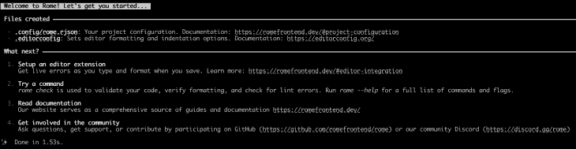
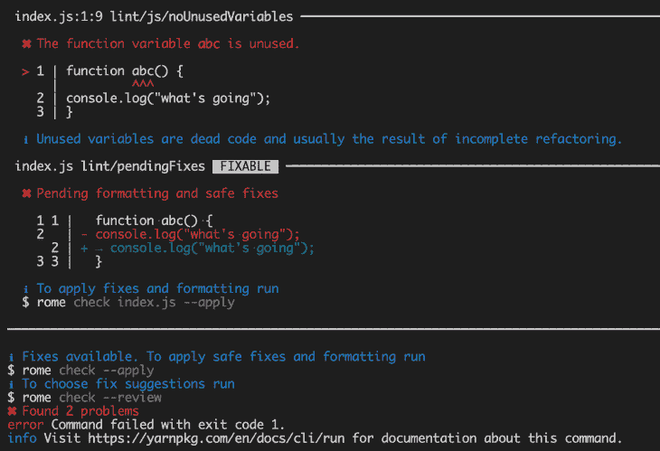
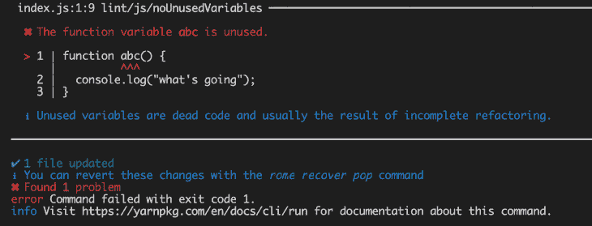
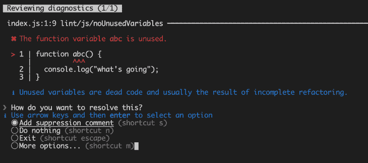
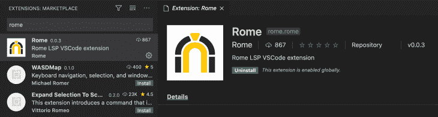
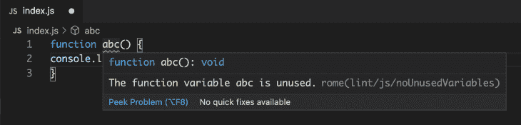
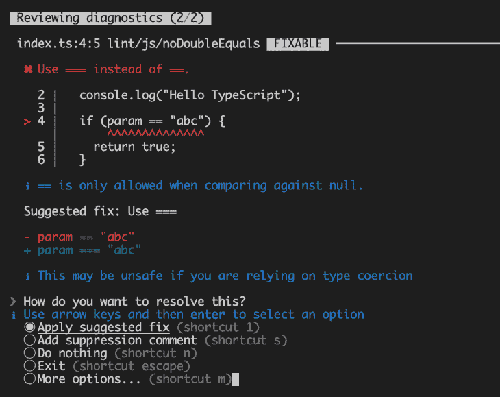
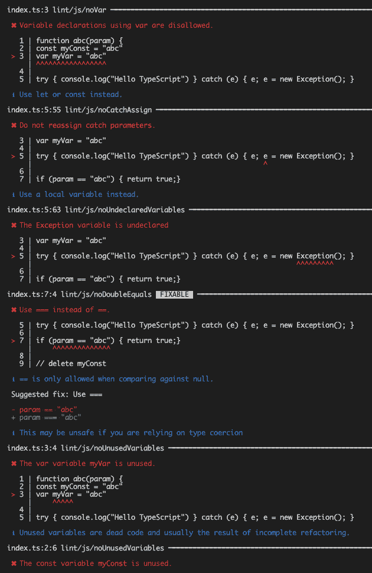
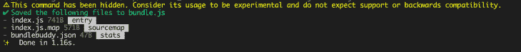

# 深入罗马:林挺，编译和捆绑

> 原文：<https://blog.logrocket.com/deep-dive-into-rome-linting-compiling-and-bundling/>

Rome 是一个 JavaScript 工具链，旨在统一前端开发。我们都知道管理许多不同的工具是多么困难和棘手，比如打包、缩小、美化、编译等等。

出于 Babel 和 Yarn 背后的相同想法，并遵循 Rust 等其他语言传播的相同中心化思想，Rome 诞生的目的是成为一体化工具。

您可以在这里找到支持语言的更新列表[。在撰写本文时，Rome 提供了对 JavaScript、TypeScript、JSON、HTML、Markdown 和 CSS 的支持。](https://romefrontend.dev/#language-support)


在本文中，我们将更深入地研究这个工具链，并通过一些很好的例子来看看它如何执行每个前端开发人员必须解决的最常见的任务。

## 设置

它的安装非常简单。你可以安装它从 NPM 或纱。对于这篇文章，我们选择纱作为默认:

```
yarn add rome
yarn rome init

```

但是，如果您想使用 NPM，只需运行以下命令:

```
npx rome init

```

这将创建一个新的 Rome 项目，并用一些文件对其进行初始化(稍后我们将详细介绍这些文件)。

这是前一个命令执行生成的输出:



## 代码格式

对于接下来的几个测试，确保创建了一个 *index.js* 文件，其中包含以下内容:

```
var first=["Log","Rocket"],second=["Log","Rocket","Plus"],both=first.concat(second);document.getElementById("demo").innerHTML=both;

```

缩进你的代码是非常必要的。大量的插件和大多数 ide 都提供了这种功能。罗马也是。

通过命令行，您可以通过点击以下命令来格式化给定的文件:

```
yarn rome format index.js

```

因为我们是通过 Yarn 创建项目的，所以必须在每个 Rome 命令的开头添加`yarn`命令。

这是一个简单的 JavaScript 代码片段。缩小的文件是测试格式命令的好方法，因为我们希望代码是“未缩小的”。命令结束后，您可能会看到以下输出:

```
var first = ["Log", "Rocket"],
        second = ["Log", "Rocket", "Plus"],
        both = first.concat(second);
document.getElementById("demo").innerHTML = both;

```

## 林挺

也许罗马最有趣和最常用的特征之一是它的林挺。通过非常直观和清晰的语法，它显示了 JavaScript 文件的错误列表，只需运行`rome lint`命令即可。

Rome 还保存了当前支持的 Lint 规则列表。如果验证规则对您不起作用，请确保参考此列表来检查该规则是否存在。

让我们来测试一下！以下面的代码为例:

```
function abc() {
console.log("what's going");
}

```

这里，我们有两个可见的问题，代码缩进和一个未使用的函数。让我们看看 Rome 如何通过运行以下命令来分析这个代码片段:

```
yarn rome lint

```

以下是输出:



每个问题都以项目符号列出，每个点前面都有一个红色的 *x* 符号。在我们的代码中，发现了我们提到的两个问题。

在绿色部分，您会发现建议的修复，比如我们的`console.log()`的适当代码格式。

为了解决这个问题，罗马给了我们一些很好的选择。我们将深入研究的第一个是`check apply`。

这个选项很棒，因为它允许罗马自动修复所有的问题，罗马知道，并有信心为我们修复。

因此，运行以下命令:

```
yarn rome check --apply

```

Rome 将对整个代码库执行一系列审查。是的，因为我们只有一个文件，所以没问题。然而，在较大的代码库中，您必须小心地只选择您想要检查的文件。

为此，只需将文件名放在`check`命令之后:

```
yarn rome check index.js --apply

```

命令完成后，您可以看到代码被自动格式化了。但是，控制台输出仍然存在一个问题。



因为 Rome 找不到一个安全和自动的方法来解决这个问题，它将在控制台记录这个错误。

不要担心，有另一个选项可以帮助解决这个问题。现在是**检查回顾**。

这也是最安全的选择，因为它允许我们选择如何修复以及修复哪些问题。因此，运行以下命令:

```
yarn rome check --review

```

一旦完成，罗马将提示一系列选项来解决它自己无法解决的问题。这样，您可以决定如何修复。



那是非常互动的。只需选择其中一个选项，然后按回车键。如果您想自己修复，Rome 将始终提供一个默认选项，即什么也不做。

保持第一个选项处于选中状态，然后按回车键。最后，您可能会看到您的代码发生了变化:

```
// rome-ignore lint/js/noUnusedVariables
function abc() {
    console.log("what's going");
}

```

Rome 已经自动格式化了代码，并且由于我们的选择，在函数前添加了一个注释，以便在以后的 lint 执行中忽略这个验证。

很好，不是吗？

### VS 代码扩展

或者，你可以安装 VS 代码[罗马扩展](https://marketplace.visualstudio.com/items?itemName=rome.rome)来获得你在保存文件时输入和格式化的实时错误。这是非常有用的，尤其是如果你正在寻求更多的生产力。

为此，去你的 VS 扩展市场搜索 *Rome* 。没有太多的选择，所以很容易找到。

点击*安装*按钮就可以了。



Rome 会自动在函数名上显示一条错误消息，提示最近创建的函数未被使用。



这就好多了，因为你可以在编程时看到所有的错误。这也是大多数开发人员在挑选棉绒时所寻找的。

一旦调用该函数，错误就会消失:

```
function abc() {
    console.log("what's going");
}

abc();

```

### 打字稿示例

它也适用于其他类型的文件，如 TypeScript。以下面的 TypeScript 为例:

```
function abc(param) {
console.log("Hello TypeScript")

if (param == "abc") { return true;}

setTimeout(()=>{console.log("timeout!")}, 100)

}

```

然后，点击`yarn rome check index.ts --review`命令，Rome 会显示如下提示。



这一次，我们提出了一个真正的解决方案(而不仅仅是添加一个抑制注释)。用绿色显示应用建议后的代码。

在蓝色部分，你可以找到关于为什么你输入的代码不正确的解释，以及一些重要的观察，比如修复是否安全(以及在什么条件下)。

另外，每次罗马找到解决问题的好方法，它都会在问题标题的顶部显示“可解决”这个词。

执行结束时，代码将如下所示:

```
// rome-ignore lint/js/noUnusedVariables
function abc(param) {
    console.log("Hello TypeScript");

    if (param === "abc") {
        return true;
    }

    setTimeout(
        () => {
            console.log("timeout!");
        },
        100,
    );
}

```

### 探索其他 lint 规则

让我们以前面的例子为例，再向前推进一点。请看下面的代码:

```
function abc(param) {
const myConst = "abc"
var myVar = "abc"

try { console.log("Hello TypeScript") } catch (e) { e; e = new Exception(); }

if (param == "abc") { return true;}

}

```

这里提出了几个有预谋的问题:

*   已知的、未使用的函数和参数
*   未使用常量和变量
*   在`catch`程序块内重新分配异常
*   使用未知/未导入的类(`Exception`)
*   用错误的运算符(`==`)比较两个字符串
*   代码格式不正确

哇，太多了。让我们通过运行`yarn rome check index.ts`命令来看看 Rome 告诉我们的代码。



我们已经忽略了之前看到的 lint 问题，但是这个列表比那个要大。嗯，这是一个很好的方式来证明罗马足够强大，值得在你最喜欢的 linters 中占有一席之地。

## 收集

罗马也编译你的代码。假设您有一些类型脚本代码，并希望将其编译成 JavaScript:

```
interface User {
    id: number;
    name: string;
}

class Account {
    id: number;
    name: string;

    constructor(id: number, name: string) {
        this.id = id;
        this.name = name;
    }
}

const user: User = new Account("LogRocket", 1);

console.log(user);

```

JavaScript 无法理解这些代码中的大部分，这意味着在使用之前需要对其进行转换。对于 Rome，只需运行以下命令:

```
yarn rome compile index.ts

```

这将是输出:

```
class Account {
        constructor(id, name) {
                this.id = id;
                this.name = name;
        }
}

const user = new Account("LogRocket", 1);

console.log(user);

```

### 罗马配置

您可能已经注意到，当您启动一个新的 Rome 项目时，一个名为 *rome.rjson* 的新文件会在 *config* 文件夹下自动生成。

这是当前的内容:

```
// For configuration documentation see http://romefrontend.dev/#project-configuration
name: "rome"
root: true

```

第一个属性是您的项目名，第二个属性告诉 Rome 它可以搜索当前项目中存在的[嵌套项目](https://romefrontend.dev/#nested-projects)，以便应用 Rome 规则。

这个文件是 Rome 存储工具链定制配置的地方。当你需要调整罗马做事的方式时，也可以来这里。

您可以直接编辑文件或通过命令行管理配置。例如，假设您想要更改项目的名称，并将其禁用为根项目。这是两种操作的等效命令:

```
yarn rome config set name "logrocket-rome"
yarn rome config disable root

```

这些更改也将被提交到 *rome.rjson* 文件中。

如果您想忽略 Lint 配置中的某些特定路径或文件扩展名，只需运行以下命令:

```
yarn rome config push lint.ignore "*.ts" "/build" "/output"

```

语法非常直观，所以现在您的 TypeScript 文件和`build`和`output`文件夹中的所有内容都将被 Rome linter 忽略。这是上述命令后的 *rome.rjson* 内容:

```
// For configuration documentation see http://romefrontend.dev/#project-configuration
name: "logrocket-rome"
lint: {
    ignore: [
        "*.ts"
        "/build"
        "/output"
    ]
}
root: false

```

## 集束

这是罗马提供的一项实验性功能。因为没有提供向后兼容性的意图，所以要小心使用它。

Rome 的目标是提供一种为应用程序包构建独立 JavaScript 包文件的方法，以取代目前的 Webpack。

我们以 *index.js* 为例。然后，运行以下命令:

```
yarn rome bundle index.js bundle.js

```

第一个参数与要捆绑的源文件有关，而第二个参数与目标文件名有关。提供尚不存在的文件的名称很重要。

下面，您可以检查该命令的输出:



注意，在 *bundle.js* 文件夹下生成了三个文件:

*   *index.js* —这是捆绑文件
*   *index . js . map*—[源地图](https://developer.mozilla.org/en-US/docs/Tools/Debugger/How_to/Use_a_source_map)文件
*   *bundlebuddy.json* —用于生成这个包的所有代码文件的映射(在 json 中)

生成的包文件内容如下所示:

```
(function(res) {
    if (typeof module !== "undefined") {
        module.exports = res;
    }
    return res;
})(
(function(global) {
  'use strict';
  // logrocket-rome/index.js
  var ___R$logrocket$rome$index_js = {};
var ___R$$priv$logrocket$rome$index_js$first = ["Log", "Rocket"],
        ___R$$priv$logrocket$rome$index_js$second = ["Log", "Rocket", "Plus"],
        ___R$$priv$logrocket$rome$index_js$both = ___R$$priv$logrocket$rome$index_js$first.concat(
            ___R$$priv$logrocket$rome$index_js$second,
        );
    document.getElementById("demo").innerHTML = ___R$$priv$logrocket$rome$index_js$both;

  return ___R$logrocket$rome$index_js;
})(typeof global !== 'undefined' ? global : typeof window !== 'undefined' ? window : this));
//# sourceMappingURL=index.js.map

```

## 结论

罗马才刚刚开始它的生活，然而，它有足够的希望赢得社区的关注和期望。

罗马也有一些不错的功能仍在测试阶段，如[测试](https://github.com/romefrontend/rome/tree/d51ad3f923d66058f83360bb7fe831fc0bad715e/packages/%40romejs/core/master/testing)。这将允许开发人员运行文件名在`.test.*`模式下的文件的测试。当你把所有这些放在一起，你会发现这样的环境会变得多么丰富。您可以在一个地方完成林挺、编译、格式化、捆绑和测试。

确保密切关注罗马的官方文件，看看接下来会发生什么。

你呢？你已经测试过罗马了吗？你有什么想法？

## 您是否添加了新的 JS 库来提高性能或构建新特性？如果他们反其道而行之呢？

毫无疑问，前端变得越来越复杂。当您向应用程序添加新的 JavaScript 库和其他依赖项时，您将需要更多的可见性，以确保您的用户不会遇到未知的问题。

LogRocket 是一个前端应用程序监控解决方案，可以让您回放 JavaScript 错误，就像它们发生在您自己的浏览器中一样，这样您就可以更有效地对错误做出反应。

[](https://lp.logrocket.com/blg/javascript-signup)[https://logrocket.com/signup/](https://lp.logrocket.com/blg/javascript-signup)

[LogRocket](https://lp.logrocket.com/blg/javascript-signup) 可以与任何应用程序完美配合，不管是什么框架，并且有插件可以记录来自 Redux、Vuex 和@ngrx/store 的额外上下文。您可以汇总并报告问题发生时应用程序的状态，而不是猜测问题发生的原因。LogRocket 还可以监控应用的性能，报告客户端 CPU 负载、客户端内存使用等指标。

自信地构建— [开始免费监控](https://lp.logrocket.com/blg/javascript-signup)。