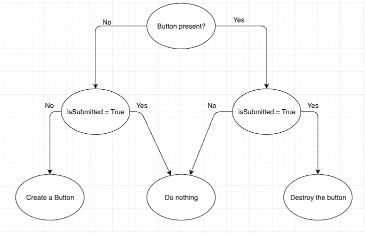
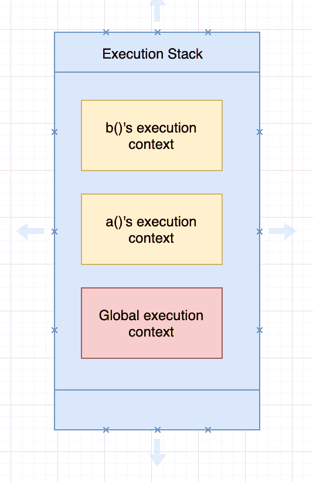
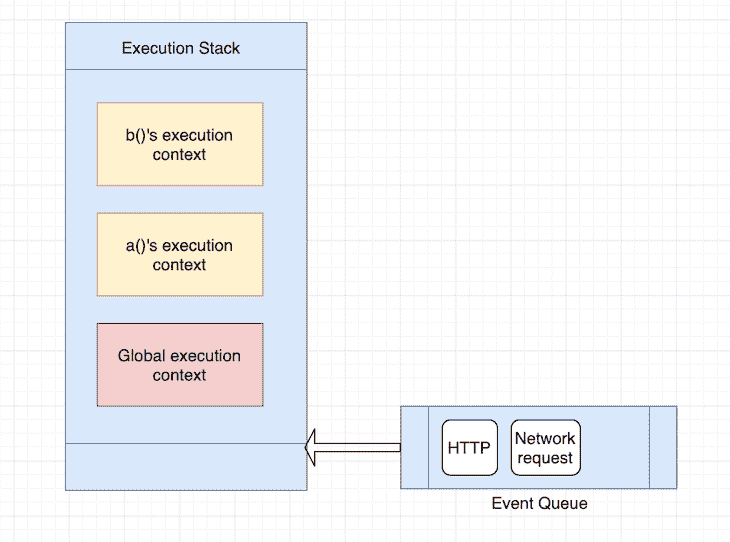
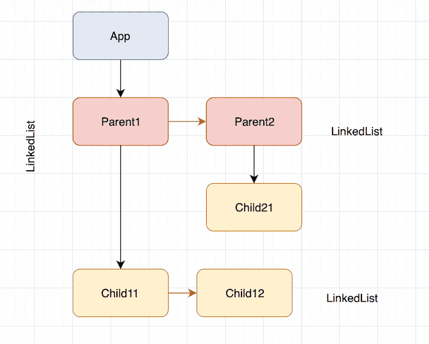
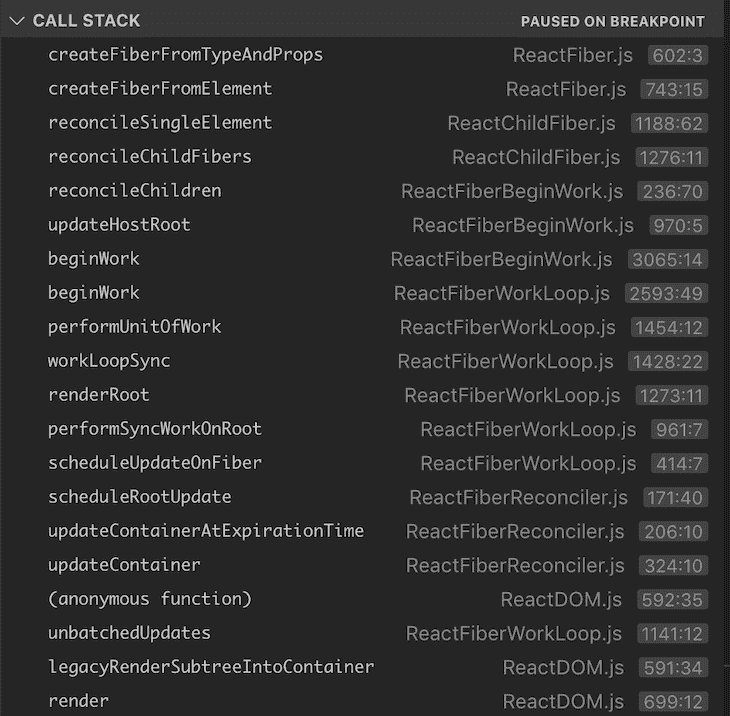
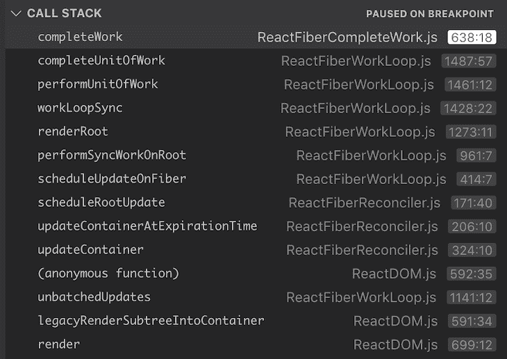
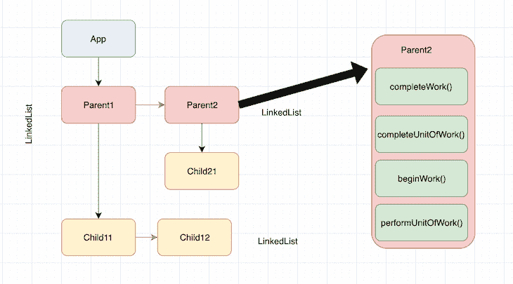
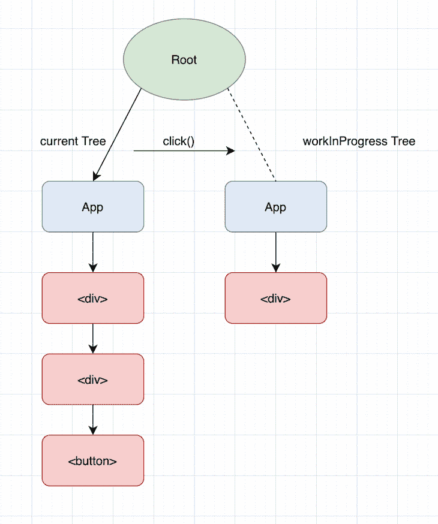

# React Fiber 的深度探讨

> 原文：<https://blog.logrocket.com/deep-dive-react-fiber/>

***编者按:*** *本帖更新于 2022 年 3 月 14 日，删除了任何过时的信息，并添加了[什么是 React 纤维？](#what-react-fiber)一节。*

想知道当你调用`ReactDOM.render(<App />, document.getElementById('root'))`时会发生什么吗？

我们知道 ReactDOM 在幕后构建 DOM 树，并在屏幕上呈现应用程序。但是 React 实际上是如何构建 DOM 树的呢？当应用程序的状态改变时，它如何更新树？

在这篇文章中，我们将了解什么是 React Fiber 以及 React v15.0.0 之前 React 是如何构建 DOM 树的，该模型的缺陷，以及从 React v16.0.0 到当前版本的新模型如何解决这些问题。

这篇文章将涵盖一系列概念，这些概念纯粹是内部实现的细节，对于使用 React 的实际前端开发并不是绝对必要的。也就是说，我们将涵盖:

## 什么是反应纤维？

反应纤维是一个内部引擎的变化，旨在使反应更快，更聪明。纤程协调器，成为 React 16 及以上版本的默认协调器，是 React 的协调算法的完全重写，以解决 React 中一些长期存在的问题。

因为纤程是异步的，所以 React 可以:

*   当有新的更新时，暂停、继续和重新开始组件的渲染工作
*   重用以前完成的工作，甚至在不需要时中止它
*   将工作分成块，并根据重要性对任务进行优先排序

这一改变允许 React 脱离同步堆栈协调器的限制。例如，以前你可以添加或删除项目，但它必须工作到堆栈为空，并且任务不能被中断。

这一更改还允许 React 微调渲染组件，确保最重要的更新尽快发生。

现在，为了真正理解纤程的威力，让我们来谈谈旧的协调器:堆栈协调器。

## React 的堆栈协调器

先说我们熟悉的`ReactDOM.render(<App />, document.getElementById('root'))`。

`ReactDOM`模块将`<App/ >`传递给协调器，但是这里有两个问题:

1.  `<App />`指的是什么？
2.  调解人是什么？

我们来解开这两个问题。

### 什么是`<App />`？

`<App />`是一个 React 元素和“描述树的元素”[据 React 博客](https://reactjs.org/blog/2015/12/18/react-components-elements-and-instances.html#elements-describe-the-tree)报道，“元素是描述组件实例或 DOM 节点及其所需属性的普通对象。”

换句话说，元素不是实际的 DOM 节点或组件实例；它们是一种描述反应它们是什么类型的元素，它们拥有什么属性，以及它们的子元素是谁的方式。

这就是 React 的真正强大之处:React 抽象出了如何构建、呈现和管理实际 DOM 树生命周期的复杂部分，有效地简化了开发人员的工作。

为了理解这到底意味着什么，让我们看看使用面向对象概念的传统方法。

### React 中的面向对象编程

在典型的面向对象编程世界中，开发人员必须实例化和管理每个 DOM 元素的生命周期。例如，如果您想创建一个简单的表单和一个提交按钮，状态管理仍然需要开发人员做一些工作。

让我们假设`Button`组件有一个`isSubmitted`状态变量。`Button`组件的生命周期类似于下面的流程图，其中每个状态都必须由应用程序管理:



随着状态变量数量的增加，流程图的大小和代码行数呈指数增长。

所以，React 有解决这个问题的元素；在 React 中，有两种元素:DOM 元素和 component 元素。

DOM 元素是一个字符串元素；比如说，`<button class="okButton"> OK </button>`。

组件元素是一个类或一个函数，例如`<Button className="okButton"> OK </Button>`，其中`<Button>`要么是一个类，要么是一个功能组件。这些是我们通常使用的典型 React 组件。

理解这两种类型都是简单对象是很重要的。它们仅仅是对必须在屏幕上呈现的内容的描述，并不会在您创建和实例化它们时引发呈现。

#### 什么是 React 和解？

这使得 React 更容易解析和遍历它们来构建 DOM 树。当遍历完成后，实际的渲染就会发生。

当 React 遇到一个类或一个函数组件时，它会询问该元素它基于其 props 呈现什么元素。

* * *

### 更多来自 LogRocket 的精彩文章:

* * *

例如，如果`<App>`组件渲染了以下内容，那么 React 将询问`<Form>`和`<Button>`组件它们基于相应的道具渲染了什么:

```
<Form>
  <Button>
    Submit
  </Button>
</Form>

```

因此，如果`Form`组件是如下所示的功能组件，React 将调用`render()`来了解它呈现了哪些元素，并看到它呈现了一个带有子元素的`<div>`

```
const Form = (props) => {
  return(
    <div className="form">
      {props.form}
    </div>
  )
}

```

React 将重复这个过程，直到它知道页面上每个组件的底层 DOM 标记元素。

递归遍历树以了解 React 应用程序组件树的底层 DOM 标记元素的确切过程称为协调。

在协调结束时，React 知道 DOM 树的结果，像`react-dom`或`react-native`这样的渲染器应用更新 DOM 节点所需的最小更改集。这意味着当您调用`ReactDOM.render()`或`setState()`时，React 执行协调。

在`setState`的例子中，它执行一次遍历，通过区分新树和渲染树来确定树中的变化。然后，它将这些更改应用到当前树，从而更新对应于`setState()`调用的状态。

既然我们理解了什么是和解，那么让我们来看看这个模型的缺陷。

### 什么是 React 堆栈协调器？

哦，顺便问一下，为什么这个被称为“堆栈”协调器？这个名字来源于“堆栈”数据结构，这是一种后进先出的机制。

堆栈和我们刚才看到的有什么关系？事实证明，因为我们有效地执行了递归，所以它和栈有关系。

## React 中的递归是什么？

为了理解为什么会这样，让我们举一个简单的例子，看看在[调用栈](https://developer.mozilla.org/en-US/docs/Glossary/Call_stack)中发生了什么:

```
function fib(n) {
  if (n < 2){
    return n
  }
  return fib(n - 1) + fib (n - 2)
}

fib(10)

```

我们可以看到，调用栈将对`fib()`的每个调用都推入栈中，直到弹出`fib(1)`，这是返回的第一个函数调用。

然后，它继续推动递归调用，并在到达 return 语句时再次弹出。这样，它有效地使用调用堆栈，直到`fib(3)`返回并成为堆栈中的最后一个弹出项。


我们刚才看到的调和算法是一个纯递归算法。更新会导致整个子树立即重新呈现。虽然这种方法效果很好，但也有一些限制。

正如安德鲁·克拉克指出的那样，在用户界面中，没有必要每次更新都立即生效；事实上，这样做可能会造成浪费，导致丢帧，降低用户体验。

此外，不同类型的更新具有不同的优先级-动画更新必须比来自数据存储的更新完成得更快。

### 丢帧问题

现在，当我们提到丢帧时，我们指的是什么？为什么这是递归方法的一个问题？为了理解这一点，让我们简单回顾一下什么是帧速率，以及从用户体验的角度来看它为什么重要。

#### 什么是帧率？

帧速率是连续图像出现在显示器上的频率。我们在电脑屏幕上看到的一切都是由图像或画面组成的，这些图像或画面在屏幕上以对眼睛来说是瞬时的速度播放。

为了理解这意味着什么，把计算机显示器想象成一本活页本，把活页本的页面想象成当你翻页时以一定速率播放的帧。

相比之下，计算机显示器只不过是一个自动翻页的书，当屏幕上的东西发生变化时，它会连续播放。

通常，对于人眼来说，为了使视频感觉平滑和即时，视频必须以大约每秒 30 帧(FPS)的速率播放；任何更高的都会带来更好的体验。

如今大多数设备以 60 FPS 刷新屏幕，1/60 = 16.67 毫秒，这意味着每 16 毫秒显示一个新帧。这个数字很重要，因为如果 React 渲染器花费超过 16 毫秒在屏幕上渲染某些内容，浏览器会丢弃该帧。

然而，在现实中，浏览器有内务处理要做，所以你所有的工作必须在 10 毫秒内完成。当你不能满足这个预算，帧速率下降，内容在屏幕上抖动。这通常被称为 jank，它会对用户体验产生负面影响。

当然，对于静态和文本内容来说，这不是一个大问题。但是在显示动画的情况下，这个数字是很关键的。

如果 React 协调算法在每次有更新时遍历整个`App`树，重新渲染它，并且遍历时间超过 16ms，它将会丢帧。

这是为什么许多人希望更新按优先级分类，而不是盲目地应用传递给协调器的每个更新的一个重要原因。此外，许多人希望能够在下一帧暂停和继续工作。这样，React 可以更好地控制 16ms 渲染预算。

这导致 React 团队重写了协调算法，称为纤程。那么，我们来看看光纤是如何解决这个问题的。

## 反应纤维是如何工作的？

现在我们知道了是什么推动了 Fiber 的发展，让我们总结一下实现它所需的特性。我再次引用安德鲁·克拉克的笔记:

*   给不同类型的工作分配优先权
*   暂停工作，稍后再继续
*   如果不再需要，则中止工作
*   重用以前完成的工作

实现这样的东西的挑战之一是 JavaScript 引擎是如何工作的，以及语言中线程的缺乏。为了理解这一点，让我们简单探讨一下 JavaScript 引擎是如何处理执行上下文的。

### JavaScript 执行堆栈

每当用 JavaScript 编写函数时，JavaScript 引擎都会创建一个函数执行上下文。

JavaScript 引擎每次启动时，都会创建一个保存全局对象的全局执行上下文；例如，浏览器中的`window`对象和 Node.js 中的`global`对象。JavaScript 使用堆栈数据结构(也称为执行堆栈)来处理这两种上下文。

因此，当您编写这样的代码时，JavaScript 引擎首先创建一个全局执行上下文，并将其推入执行堆栈:

```
function a() {
  console.log("i am a")
  b()
}

function b() {
  console.log("i am b")
}

a()

```

然后，它为`a()`函数创建一个函数执行上下文。由于`b()`是在`a()`内部被调用的，所以它为`b()`创建了另一个函数执行上下文，并将其推入堆栈。

当`b()`函数返回时，引擎销毁`b()`的上下文。当我们退出`a()`函数时，`a()`上下文被销毁。执行过程中的堆栈如下所示:



但是，当浏览器发出类似于 [HTTP 请求](https://blog.logrocket.com/how-to-make-http-requests-like-a-pro-with-axios/)的异步事件时，会发生什么呢？JavaScript 引擎是存储执行堆栈并处理异步事件，还是等到事件完成？

JavaScript 引擎在这里做了一些不同的事情:在执行堆栈的顶部，JavaScript 引擎有一个队列数据结构，也称为事件队列。事件队列处理异步调用，如进入浏览器的 HTTP 或网络事件。



JavaScript 引擎通过等待执行堆栈清空来处理队列中的项目。因此，每次执行堆栈清空时，JavaScript 引擎都会检查事件队列，从队列中弹出项目，并处理事件。

值得注意的是，JavaScript 引擎仅在执行堆栈为空或者执行堆栈中的唯一项目是全局执行上下文时才检查事件队列。

虽然我们称它们为异步事件，但这里有一个微妙的区别:事件在到达队列时是异步的，但在实际处理时并不是真正的异步。

回到我们的堆栈协调器，当 React 遍历树时，它在执行堆栈中这样做。因此，当更新到达时，它们到达事件队列(某种程度上)。并且，只有当执行堆栈清空时，才处理更新。

这正是 Fiber 通过用智能功能(例如暂停、恢复和中止)重新实现堆栈来解决的问题。

再次引用 Andrew Clark，“纤程是堆栈的重新实现，专门用于 React 组件。您可以将单个纤程视为一个虚拟堆栈帧。

“重新实现堆栈的优点是，您可以将堆栈帧保存在内存中，并随时随地执行它们。这对于完成我们的计划目标至关重要。

除了调度之外，手动处理堆栈帧释放了并发性和错误边界等功能的潜力。我们将在以后的章节中讨论这些主题。”

简单地说，纤程用自己的虚拟栈来表示一个工作单元。在前面的协调算法实现中，React 创建了一个不可变的对象树(React 元素),并递归地遍历该树。

在当前的实现中，React 创建了一个可以变异的纤程节点树。纤程节点有效地保存了组件的状态、属性和它所呈现的底层 DOM 元素。

而且，由于纤程节点可以变异，React 不需要重新创建每个节点进行更新；当有更新时，它可以简单地克隆和更新节点。

在纤程树的情况下，React 不执行递归遍历。相反，它创建一个单链表，并执行一个父级优先、深度优先的遍历。

### 纤程节点的单链表

纤程节点表示堆栈帧和 React 组件的实例。纤维节点包括以下部件:

*   类型
*   钥匙
*   儿童
*   兄弟
*   返回
*   交替的
*   输出

#### 类型

`<div>`和`<span>`，例如，宿主组件(字符串)、复合组件的类或函数。

#### 钥匙

该键与我们传递给 React 元素的键相同。

#### 儿童

表示当我们在组件上调用`render()`时返回的元素:

```
const Name = (props) => {
  return(
    <div className="name">
      {props.name}
    </div>
  )
}

```

`<Name>`的子元素是`<div>`,因为它返回了一个`<div>`元素。

#### 兄弟

表示`render`返回元素列表的情况:

```
const Name = (props) => {
  return([<Customdiv1 />, <Customdiv2 />])
}

```

在上面的例子中，`<Customdiv1>`和`<Customdiv2>`是`<Name>`的子节点，而【】是父节点。这两个子节点构成了一个单链表。

#### 返回

Return 是返回到堆栈帧，这是返回到父纤程节点的逻辑返回，因此代表父纤程节点。

##### `pendingProps`和`memoizedProps`

记忆化意味着存储函数执行结果的值，以便以后使用，从而避免重新计算。`pendingProps`代表传递给组件的道具，`memoizedProps`在执行栈的末尾初始化，存储本节点的道具。

当输入的`pendingProps`等于`memoizedProps`时，表示光纤之前的输出可以重用，防止不必要的工作。

##### `pendingWorkPriority`

`pendingWorkPriority`是指示由纤程表示的工作的优先级的数字。 [`ReactPriorityLevel`](https://github.com/facebook/react/blob/master/src/renderers/shared/fiber/ReactPriorityLevel.js) [模块](https://github.com/facebook/react/blob/master/src/renderers/shared/fiber/ReactPriorityLevel.js)列出了不同的优先级以及它们所代表的含义。除了零的`NoWork`，较大的数字表示较低的优先级。

例如，您可以使用下面的函数来检查纤程的优先级是否至少与给定的级别一样高。调度程序使用优先级字段来搜索要执行的下一个工作单元:

```
function matchesPriority(fiber, priority) {
  return fiber.pendingWorkPriority !== 0 &&
         fiber.pendingWorkPriority <= priority
}

```

#### 交替的

在任何时候，一个组件实例最多有两个对应的纤程:当前纤程和进行中的纤程。当前纤程的替代是进行中的纤程，进行中的纤程的替代是当前纤程。

当前纤程表示已经呈现的内容，正在进行的纤程在概念上是尚未返回的堆栈帧。

#### 输出

输出是 React 应用程序的叶节点。它们特定于渲染环境(例如，在浏览器应用程序中，它们是`div`和`span`)。在 JSX，它们用小写的标签名来表示。

从概念上讲，纤程的输出是函数的返回值。每个光纤最终都有一个输出，但该输出仅在叶节点由主机组件创建。然后输出沿树向上传输。

输出最终被提供给渲染器，以便它可以刷新对渲染环境的更改。例如，让我们看看纤程树如何查找具有以下代码的应用程序:

```
const Parent1 = (props) => {
  return([<Child11 />, <Child12 />])
}

const Parent2 = (props) => {
  return(<Child21 />)
}

class App extends Component {
  constructor(props) {
    super(props)
  }
  render() {
    <div>
      <Parent1 />
      <Parent2 />
    </div>
  }
}

ReactDOM.render(<App />, document.getElementById('root'))

```

我们可以看到，纤程树由相互链接的子节点的单链表(兄弟关系)和父子关系的链表组成。可以使用[深度优先搜索](https://en.wikipedia.org/wiki/Depth-first_search)来遍历该树。



### 渲染阶段

为了理解 React 如何构建这个树并在其上执行协调算法，让我们看一看 React 源代码中的一个单元测试，它带有一个附加的调试器来跟踪这个过程；你可以克隆 React 源代码并导航到[这个目录](https://github.com/facebook/react/tree/769b1f270e1251d9dbdce0fcbd9e92e502d059b8/packages/react-dom/src/__tests__)。

首先，添加一个 Jest 测试并附加一个调试器。这是一个用文本呈现按钮的简单测试。当您单击按钮时，应用程序会销毁按钮，并使用不同的文本呈现一个`<div>`，因此文本在这里是一个状态变量:

```
'use strict';

let React;
let ReactDOM;

describe('ReactUnderstanding', () => {
  beforeEach(() => {
    React = require('react');
    ReactDOM = require('react-dom');
  });

  it('works', () => {
    let instance;

    class App extends React.Component {
      constructor(props) {
        super(props)
        this.state = {
          text: "hello"
        }
      }

      handleClick = () => {
        this.props.logger('before-setState', this.state.text);
        this.setState({ text: "hi" })
        this.props.logger('after-setState', this.state.text);
      }

      render() {
        instance = this;
        this.props.logger('render', this.state.text);
        if(this.state.text === "hello") {
        return (
          <div>
            <div>
              <button onClick={this.handleClick.bind(this)}>
                {this.state.text}
              </button>
            </div>
          </div>
        )} else {
          return (
            <div>
              hello
            </div>
          )
        }
      }
    }
    const container = document.createElement('div');
    const logger = jest.fn();
    ReactDOM.render(<App logger={logger}/>, container);
    console.log("clicking");
    instance.handleClick();
    console.log("clicked");

    expect(container.innerHTML).toBe(
      '<div>hello</div>'
    )

    expect(logger.mock.calls).toEqual(
      [["render", "hello"],
      ["before-setState", "hello"],
      ["render", "hi"],
      ["after-setState", "hi"]]
    );
  })

});

```

在初始渲染中，React 创建初始渲染的当前树。

`createFiberFromTypesAndProps()`是使用来自特定 React 元素的数据创建每个 React 纤维的函数。当我们运行测试时，在这个函数上放置一个断点，并查看调用堆栈:



正如我们所看到的，调用栈追踪回一个`render()`调用，最终到达`createFiberFromTypeAndProps()`。这里还有其他一些有趣的函数:`workLoopSync()`、`performUnitOfWork()`和`beginWork()`。

#### `workLoopSync()`

`workLoopSync()`是 React 开始构建树的时间，从`<App>`节点开始，递归移动到`<div>`、`<div>`和`<button>`，它们是`<App>`的子节点。`workInProgress`保存了对下一个有工作要做的纤程节点的引用。

#### `performUnitOfWork()`

`performUnitOfWork()`取一个纤程节点作为输入参数，获取该节点的替换，调用`beginWork()`。这相当于在执行堆栈中开始执行函数执行上下文。

#### `beginWork()`

当 React 构建树时，`beginWork()`简单地引导到`createFiberFromTypeAndProps()`并创建纤程节点。React 递归地执行工作，最终`performUnitOfWork()`返回一个空值，表明它已经到达了树的末尾。

#### 使用`instance.handleClick()`

现在，当我们执行`instance.handleClick()`，点击按钮并触发状态更新时会发生什么？在这种情况下，React 遍历纤程树，克隆每个节点，并检查它是否需要在每个节点上执行任何工作。

当我们查看这个场景的调用堆栈时，它看起来像这样:



虽然我们在第一个调用栈中没有看到`completeUnitOfWork()`和`completeWork()`，但是在这里可以看到。就像`performUnitOfWork()`和`beginWork()`一样，这两个函数执行当前执行的完成部分，也就是返回堆栈。

正如我们所看到的，这四个函数一起执行工作单元，并控制当前正在进行的工作，这正是 stack reconciler 所缺少的。

下图显示了每个纤维节点由完成该工作单元所需的四个阶段组成。



这里需要注意的是，每个节点直到其子节点和兄弟节点返回`completeWork()`时才会移动到`completeUnitOfWork()`。

例如，`<App/>`以`performUnitOfWork()`和`beginWork()`开始，然后转移到`Parent1`的`performUnitOfWork()`和`beginWork()`，以此类推。一旦`<App/>`的所有子进程完成工作，它返回并完成`<App>`上的工作。

这是 React 完成其渲染阶段的时间。基于`click()`更新新构建的树被称为`workInProgress`树。这基本上就是等待渲染的草图树了。

### 提交阶段

一旦渲染阶段完成，React 就进入提交阶段，在这里它基本上交换当前树和`workInProgress`树的根指针，从而有效地交换当前树和它基于`click()`更新构建的草稿树。



不仅如此，在将指针从 root 交换到`workInProgress`树之后，React 还重用了旧的当前值。这种优化过程的净效果是从应用程序的前一个状态到下一个状态和下一个状态的平滑过渡，等等。

那么 16ms 的帧时间呢？React 有效地为每个正在执行的工作单元运行一个内部计时器，并在执行工作时不断地监控这个时间限制。

当时间用完时，React 暂停当前的工作单元，将控制权交还给主线程，并让浏览器呈现此时完成的任何内容。

然后，在下一帧，React 从它停止的地方继续构建树。然后，当它有足够的时间时，它提交`workInProgress`树并完成渲染。

## **结论**

我希望你喜欢阅读这篇文章。如果您有任何意见或问题，请随时留下。

## [LogRocket](https://lp.logrocket.com/blg/react-signup-general) :全面了解您的生产 React 应用

调试 React 应用程序可能很困难，尤其是当用户遇到难以重现的问题时。如果您对监视和跟踪 Redux 状态、自动显示 JavaScript 错误以及跟踪缓慢的网络请求和组件加载时间感兴趣，

[try LogRocket](https://lp.logrocket.com/blg/react-signup-general)

.

[ ](https://lp.logrocket.com/blg/react-signup-general) [](https://lp.logrocket.com/blg/react-signup-general) 

LogRocket 结合了会话回放、产品分析和错误跟踪，使软件团队能够创建理想的 web 和移动产品体验。这对你来说意味着什么？

LogRocket 不是猜测错误发生的原因，也不是要求用户提供截图和日志转储，而是让您回放问题，就像它们发生在您自己的浏览器中一样，以快速了解哪里出错了。

不再有嘈杂的警报。智能错误跟踪允许您对问题进行分类，然后从中学习。获得有影响的用户问题的通知，而不是误报。警报越少，有用的信号越多。

LogRocket Redux 中间件包为您的用户会话增加了一层额外的可见性。LogRocket 记录 Redux 存储中的所有操作和状态。

现代化您调试 React 应用的方式— [开始免费监控](https://lp.logrocket.com/blg/react-signup-general)。