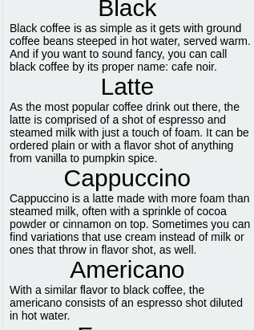
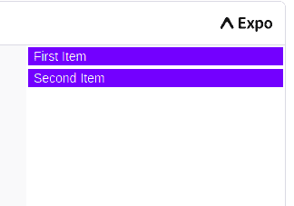
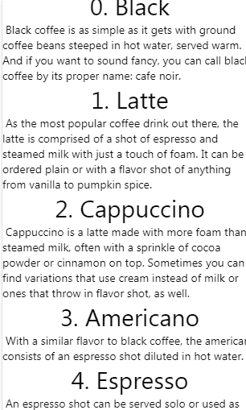
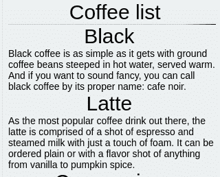
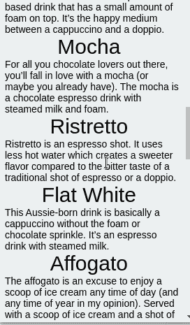
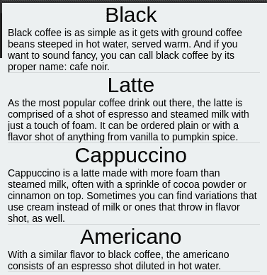
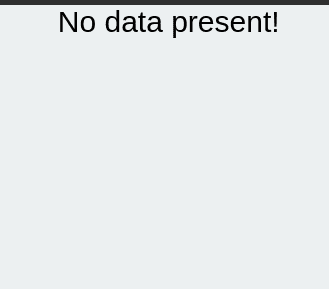
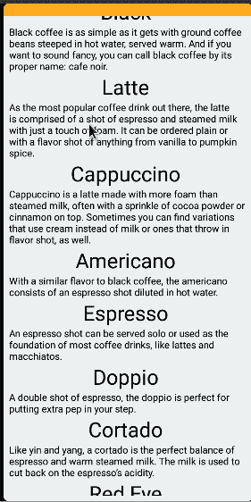
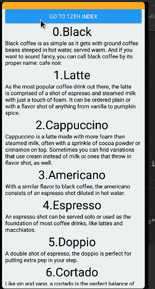
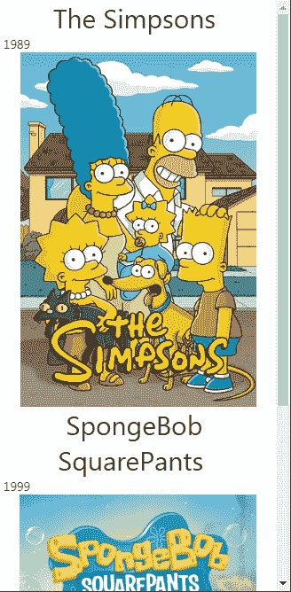

# React Native FlatList 的深度探讨

> 原文：<https://blog.logrocket.com/deep-dive-react-native-flatlist/>

考虑这样一种情况，您想要显示来自 API 的项目列表。例如，Coffee API 的响应如下所示:


向客户端显示的一种可能方式是对这个数组使用`map`方法，如下所示:

```
const data = getDataFromAPI(); 
return (
  <View style={styles.container}>
    {data && (
      <View>
        <Text> Your data has loaded! Here is the result:</Text>
        {data.map((item) => (
          <Text key={item.id}> {item.name}</Text>
        ))}
      </View>
    )}
  </View>
);

```

这里，我们使用条件呈现来检查数据是否已经加载。如果为真，我们将通知用户并在屏幕上显示列表。

这将是输出:


代码应该有效。那么为什么我们的列表不可见呢？

这就是`[FlatList](https://reactnative.dev/docs/flatlist)`缓解这个问题的地方。这是一个 React 原生组件，允许您使用最少的代码轻松呈现列表。

以下是我们将要介绍的内容:

## `FlatList`语法

`FlatList`使用以下语法:

```
import { FlatList } from "react-native";
<FlatList
  data={
    //the array to render
  }
  keyExtractor={
    // Extract keys for each item in the array
  }
  renderItem={
    //each item from the array will be rendered here
  }
/>;

```

*   在`data`属性中，您将输入您想要显示的数组。这可以是来自 API 的 JSON 数据
*   `keyExtractor`道具将为数组
    *中的每一项检索一个唯一的键，如果你的数组包含一个`key`或`id`字段，你不需要包含这个道具。默认情况下，`FlatList`会寻找`key`或`id`属性。*
**   将告诉 React Native 如何呈现列表中的项目*

 *## 示例用法

现在我们已经讨论了语法，让我们用它来呈现我们的列表:

```
//the data array contains our array of items. 
const data = [{id:1, title:"Black", description:""},... ]; 
const Item = ({ title, description }) => (
  <View>
    <Text style={styles.title}>{title} </Text>
    <Text>{description} </Text>
  </View>
);

const renderItem = ({ item }) => (
  <Item title={item.title} description={item.description} />
);
return (
  <View style={styles.container}>
    {data && (
      <FlatList
        data={data}
        renderItem={renderItem}
        keyExtractor={(item) => item.id}
      />
    )}
  </View>
);

```

让我们一点一点地解构这段代码:

*   `Item`组件将接受两个道具:`title`和`description`。该组件会将它们显示在用户界面上
*   `renderItem`函数将为数组中的每一项呈现`Item`组件。因此，这将显示每个对象的`title`和`description`字段
*   此外，`keyExtractor`属性告诉 React Native 应该使用`id`字段作为键
*   最后，我们使用条件呈现来呈现带有`FlatList` React 本地元素的数据



在上面的代码示例中，注意我们使用了一个名为`keyExtractor`的 FlatList 属性。该属性对于在指定索引处提取给定项目的标识符非常有用。

默认情况下，`keyExtractor`使用`item.key`或`item.id`键作为数组中的标识符。

这里有几个例子:

```
const shoppingList = [
  { id: 1, item: "Eggs" },
  { id: 2, item: "Milk" },
  { id: 3, item: "Bread" },
];
//here, the identifier for 'shoppingList' is 'id'. By default, keyExtractor uses 'key' or 'id' properties, therefore including the keyExtractor prop is not necessary
return <FlatList data={shoppingList} />;

const namesList = [
  { cardNumber: "1A1", name: "Hussain" },
  { cardNumber: "1A2", name: "Sabrina" },
];
//here, we need to include the keyExtractor prop. Otherwise, our code will throw an error.
return <FlatList data={namesList} keyExtractor={(item) => item.cardNumber} />;

```

### `data`道具

FlatList 的`data`属性是一个必需的属性，它接受我们想要在屏幕上显示的一组项目。

下面是一个简短的代码示例，详细展示了它的用法:

```
const namesList = [{cardNumber: "1A1", name:"Jules"}, {cardNumber: "1A2", name: "Rue"},{cardNumber:"1A3", name:"Fezco"}];
//our data can be a simple array:
return (<FlatList data={namesList} keyExtractor={(item)=> item.cardNumber}/>)
//Alternatively, we can fetch data from an API and render it like so:

const [applesList, setAppleList] = useState(null)
setAppleList(fetchFromAPI()); //fetch data from an API and store it into the 'applesList' Hook
return (<FlatList data={applesList} keyExtractor={(item)=> item.key}/>)

```

### `renderItem`道具

`renderItem`是一个回调函数，负责设计我们的列表视图。这允许我们使用 CSS 代码来增强我们的平面列表的外观。

这里有一个`renderItem`的例子:

```
const data = [
  { id: 1, title: "First item" },
  { id: 2, title: "Second item" },
];
const renderItem = ({ item }) => {
  //the app will represent each list item via a Text component
  return <Text style={styles.item}> {item.title}</Text>;
};

<FlatList
  data={data} //pass in our data array
  renderItem={renderItem} //tell React to use our renderItem function that we defined earlier
/>;
//use CSS to decorate our list
const styles = StyleSheet.create({
  item: {
    backgroundColor: "blue",
    color: "white",
    padding: 2,
    margin: 2,
  },
});

```



## 显示来自 API 的数据

在现实世界中，React 本地开发人员可能不得不处理将 API 数据呈现到列表中的问题。

在下面的代码中，我们从[Coffee API](https://sampleapis.com/api-list/coffee)获取数据，并将其插入到我们的 FlatList 组件中:

```
export default function App() {
  const [data, setData] = useState(null);

  const getData = async () => {
    const resp = await fetch("https://api.sampleapis.com/coffee/hot");
    const data = await resp.json();
    setData(data);
  };
  //on first mount, fetch data.
  useEffect(() => {
    getData();
  }, []);

  const Item = ({ title, description, index }) => (
    <View>
      <Text style={styles.title}>
        {index}. {title}
      </Text>
      <Text> {description} </Text>
    </View>
  );

  const renderItem = ({ item, index }) => (
    <Item description={item.description} title={item.title} index={index} />
  );

  return (
    <View style={styles.container}>
      {data && (
        <FlatList
          data={data}
          renderItem={renderItem}
        />
      )}
    </View>
  );
}

```

从这段代码中可以得出一些推论:

*   当第一次呈现`App`组件时，React 调用`getData`方法。这将向 API 发出一个`GET`请求
*   在`renderItem`函数中，我们也使用了`index`参数。这是对应于数组中当前项的索引
*   注意，我们没有使用`keyExtractor`道具。这是因为一个`id`字段已经存在，所以`FlatList`将使用它作为键



## `FlatList`定制

### 标题组件

FlatList 也支持标题组件。如果您希望在联系人清单的顶部显示搜索栏，这将非常方便。

道具可以帮你做到这一点:

```
import { Divider } from "react-native-elements";

const header = () => {
  return (
    <View>
      <Text style={styles.title}> Coffee list</Text>
      <Divider orientation="vertical" />
    </View>
  );
};

return (
  <View style={styles.container}>
    {data && (
      <FlatList
        ListHeaderComponent={header}
        data={data}
        renderItem={renderItem}
      />
    )}
  </View>
);

```

在上面的代码块中，我们首先创建了一个`header`函数，然后将它传递给我们的`ListHeaderComponent` prop。这将在`FlatList`组件的顶部输出一个简单的`Text`和`Divider`组件。



### 页脚组件

考虑这样一种情况，用户已经向下滚动了一整圈，并且想要返回向上滚动。在这里，显示一个可以让客户端自动返回的按钮是明智的。在这种情况下，您可以为列表追加一个页脚组件。这将表明列表已经结束。

你可以通过`ListFooterComponent`道具这样做:

```
//This will be our footer component
const endComponent = () => {
  return (
    <View>
      <Divider orientation="vertical" />
      <Text style={styles.text}> List ended</Text>
    </View>
  );
};

return (
  <View style={styles.container}>
    {data && (
      <FlatList
        ListFooterComponent={endComponent}
        data={data}
        renderItem={renderItem}
      />
    )}
  </View>
);

```



### 分离器

分隔符组件帮助用户区分列表中的每个元素。这有助于更好的用户体验和界面。

要做到这一点，像这样使用`ItemSeparatorComponent`道具:

```
const separator = () => {
  return <Divider orientation="vertical" />;
};

return (
  <View style={styles.container}>
    {data && (
      <FlatList
        ItemSeparatorComponent={separator}
        data={data}
        renderItem={renderItem}
      />
    )}
  </View>
);

```



### 处理空列表

假设你在 React Native 里建了一个笔记 app。如果用户没有记录，显示“没有找到笔记”消息是合适的。

为此，`ListEmptyComponent`道具很有用:

```
const data = []; //empty array
const handleEmpty = () => {
  return <Text style={styles.title}> No data present!</Text>;
};
return (
  <View style={styles.container}>
    {!data && <Text> Loading</Text>}
    {data && (
      <FlatList
        ListEmptyComponent={handleEmpty}
        data={data}
        renderItem={renderItem}
      />
    )}
  </View>
);

```



## `FlatList`导航方式

`FlatList`还包括一些滚动相关操作的实用功能。

### 滚动到结尾

假设您有一个包含数百个条目的列表。在这里，最好显示一个按钮，让用户一直往下走。这将带来更好的用户体验，因为用户不必手动滚动到底部，从而节省时间。

要实现这一点，您可以像这样使用`scrollToEnd`方法:

```
const list = useRef(null);

const press = () => {
  list.current.scrollToEnd({ animated: true });
};
const header = () => {
  return <Button onPress={() => press()} title="Go to end" />;
};

return (
  <View style={styles.container}>
    {!data && <Text> Loading</Text>}
    {data && (
      <FlatList
        ref={list}
        ListHeaderComponent={header}
        data={data}
        renderItem={renderItem}
      />
    )}
  </View>
);

```

在这段代码中，我们创建了一个`useRef`钩子，它将允许我们访问`FlatList`的实用函数。当用户点击`Button`元素时，应用程序将执行`scrollToEnd`方法。



### 导航到特定的索引项

我们甚至可以通过像这样调用`scrollToIndex`方法来滚动到特定的项目:

```
const list = useRef(null);

const press = () => {
  //scroll to the 12th item in the index.
  list.current.scrollToIndex({ animated: true, index: 12 });
};

const header = () => {
  return <Button onPress={() => press()} title="Go to 12th index" />;
};

return (
  <View style={styles.container}>
    {!data && <Text> Loading</Text>}
    {data && (
      <FlatList
        ref={list}
        ListHeaderComponent={header}
        data={data}
        renderItem={renderItem}
      />
    )}
  </View>
);

```

在这个代码片段中，我们告诉 React，如果用户单击按钮，那么它应该将用户重定向到数组中的第十二个项目。



## 最佳实践

### 避免匿名函数

尽量避免在你的`FlatList`中使用匿名函数。React 本地团队建议这样做，以便函数不会在每次显示列表时重新创建自己。这可以节省内存和 CPU 资源:

```
//correct way: no anonymous functions
const renderItem = ({ item, index }) => (
  <Text>
    {index}. {item.title}
  </Text>
);
{
  data && (
    <FlatList
      data={data}
      keyExtractor={(item) => item.id}
      renderItem={renderItem}
    />
  );
}
//the wrong way. Steer clear from this:
{
  data && (
    <FlatList
      data={data}
      keyExtractor={(item) => item.id}
      renderItem={({ item, index }) => (
        <Text>
          {index}.{item.title}
        </Text>
      )}
    />
  );
}

```

### 较轻的部件

组件越重，占用的内存就越多。在列表项上显示尽可能少的信息。作为奖励，这使你的用户界面看起来更干净。

即使您确实有需要显示大量文本的项目，您也可以使用 [React 导航](https://blog.logrocket.com/navigating-react-native-apps-using-react-navigation/)。如果用户点击任何一个项目，React 会将他们引导到一个单独的页面，显示其余的详细信息。这里有一个例子:


## 常见问题和疑问

### 图像不会渲染

要解决这个问题，请检查您是从本地存储还是从网络(一个 API)加载图像。React Native 的`Image`模块对于每个用例都有稍微不同的语法。

下面的代码示例呈现文件系统中的图像:

```
const apiData = [
  {
    id: 1,
    title: "The Simpsons",
    year: 1989,
    image: require("./simpson.jpg"), 
  },
  {
    id: 2,
    title: "SpongeBob SquarePants ",
    year: 1999,
    image: require("./spongebob.jpg"),
  },
];

const renderItem = ({ item, index }) => (
  <View>
    <Text style={styles.title}>{item.title} </Text>
    <Text> {item.year}</Text>
    <Image
      style={{ height: 300, width: 300}}
      source={item.image}
      resizeMode="contain"
    />
  </View>
);
return (
  <View style={styles.container}>
    <FlatList
      data={apiData}
      keyExtractor={(item) => item.id.toString()}
      renderItem={renderItem}
    />
  </View>
);

```

注意，我们使用的是`require`方法。这告诉 React Native 从本地文件系统获取图像。



要显示来自网络的图像，使用`prop`的`uri`属性，如下所示:

```
const apiData = [
  {
    id: 1,
    title: "The Simpsons",
    year: 1989,
    //url for image
    image:
      "https://m.media-amazon.com/images/M/MV5BYjFkMTlkYWU[email protected]@._V1_SY1000_CR0,0,666,1000_AL_.jpg",
  },
  {
    id: 2,
    title: "SpongeBob SquarePants ",
    year: 1999,
    image:
      "https://nick.mtvnimages.com/uri/mgid:arc:content:nick.com:9cd2df6e-63c7-43da-8bde-8d77af9169c7?quality=0.7",
  },
];
const renderItem = ({ item, index }) => (
  <View>
    <Text style={styles.title}>{item.title} </Text>
    <Text> {item.year}</Text>
    <Image
      style={{ height: 300, width: 300 }}
      source={{ uri: item.image }} //using uri property
      resizeMode="contain"
    />
  </View>
);
return (
  <View style={styles.container}>
      <FlatList
        data={apiData}
        keyExtractor={(item) => item.id.toString()}
        renderItem={renderItem}
      />
  </View>
);

```

### 颠倒列表

要颠倒物品顺序，只需使用`inverted`道具:

```
return (
  <View style={styles.container}>
    <FlatList
      data={apiData}
      keyExtractor={(item) => item.id}
      renderItem={renderItem}
      inverted //reverses the list
    />
  </View>
);

```

### 当变量改变时，列表应该重新呈现

要解决这个问题，请使用`extraData`道具。这将告诉`FlatList`每当选择的变量更新时进行渲染:

```
var changedData = 0;
//other logic-related code..
 return (
    <View style={styles.container}>
        <FlatList
          data={apiData}
          extraData={changedData}
          keyExtractor={(item) => item.id}
          renderItem={renderItem}
        />
    </View>
  );

```

这将告诉 React Native 监听`changedData`变量的变化。当检测到变化时，React 将重新呈现列表。

### 渲染大量项目时的性能问题

您可以使用`maxToRenderPerBatch`道具。这指定了每批渲染的项目数，这是每次滚动显示的下一组项目:

```
return (
  <FlatList 
    data={data}
    extraData={changedData}
    keyExtractor={(item) => item.id}
    renderItem={renderItem}
    maxToRenderPerBatch={5} //render only 5 items per scroll.
)

```

### 为什么不用一个`ScrollView`来代替？

`ScrollView`组件一次性呈现所有项目。这对于小列表来说可能没问题，但是对于包含数百个条目的列表来说就不合适了。

比如拿一个记笔记的 app 来说。如果您的应用程序渲染组件并一次查看所有组件，这将导致内存使用量增加。

模块以不同的方式处理事情。它将只在项目即将出现时呈现它们，并在它们不在视图中时删除它们。这导致了较低的内存使用率。

简而言之，`FlatList`使用延迟加载，这对于优化来说更好。

## 结论

在本文中，我们介绍了 React Native 的`FlatList`用法、有用的功能和定制选项。如果你想在你的 [React 本地应用](https://blog.logrocket.com/top-react-native-boilerplates-for-2021/)中呈现列表，这是一个至关重要的组件。这是一个绝对轻而易举地使用，是坚如磐石。

感谢您的阅读！快乐编码。

## [LogRocket](https://lp.logrocket.com/blg/react-native-signup) :即时重现 React 原生应用中的问题。

[](https://lp.logrocket.com/blg/react-native-signup)

[LogRocket](https://lp.logrocket.com/blg/react-native-signup) 是一款 React 原生监控解决方案，可帮助您即时重现问题、确定 bug 的优先级并了解 React 原生应用的性能。

LogRocket 还可以向你展示用户是如何与你的应用程序互动的，从而帮助你提高转化率和产品使用率。LogRocket 的产品分析功能揭示了用户不完成特定流程或不采用新功能的原因。

开始主动监控您的 React 原生应用— [免费试用 LogRocket】。](https://lp.logrocket.com/blg/react-native-signup)*