# 反应材料:权威指南

> 原文：<https://blog.logrocket.com/definitive-guide-react-material/>

***编者按:**本帖更新于 2021 年 11 月 1 日，以反映相关信息和更新的代码块。*

[材料设计](https://material.io/)是谷歌在 2014 年首次推出的一种设计语言。它是一种视觉语言，利用基于网格的布局、响应动画和过渡、填充和深度效果，如照明和阴影。

## 什么是材料设计？

材料设计的目标可以归结为三点:创造、统一和定制。

材料设计旨在提供一种视觉语言，综合优秀设计的经典原则。Unify 旨在开发一个单一的底层系统，统一跨平台、设备和输入法的用户体验，对于定制，它为创新和品牌表达提供了一种可视化语言和灵活的基础。

在本文中，我们将探索如何创建具有材质设计主题的 React 应用程序。各种库对此有所帮助，但是对于本文，我们将使用 [material-ui](https://github.com/mui-org/material-ui) 库。

## 材料设计入门

[MUI](https://mui.com/) (之前叫 Material UI)是一组 React 组件，实现了 Google 的材质设计。这些组件独立工作，这意味着它们是自支持的，并将只注入它们需要显示的样式。

要开始使用 MUI，您只需运行以下终端命令:

```
npm install @mui/material @emotion/react @emotion/styled
# to install icon pack:
npm install @mui/icons-material

```

接下来，让我们看看 MUI 的一些基本原理，因为它与材料设计有关，并看看它是如何为本文的其余部分设置的。

## MUI 中的排版

说到材质设计，字体选择默认为 [Roboto](https://fonts.google.com/specimen/Roboto) 。然而，MUI 并不附带 Roboto 故障。可以使用以下两种方法之一将字体导入 React 项目。

### 从 CDN 安装

```
<link
  rel="stylesheet"       href="https://fonts.googleapis.com/css?family=Roboto:300,400,500,700&display=swap"
/>

```

### 使用 npm 安装

您可以通过在终端中键入以下命令，将其作为 npm [包](https://www.npmjs.com/package/@fontsource/roboto)安装:

```
npm install @fontsource/roboto

```

然后，您可以将其导入到您的项目中，如下所示:

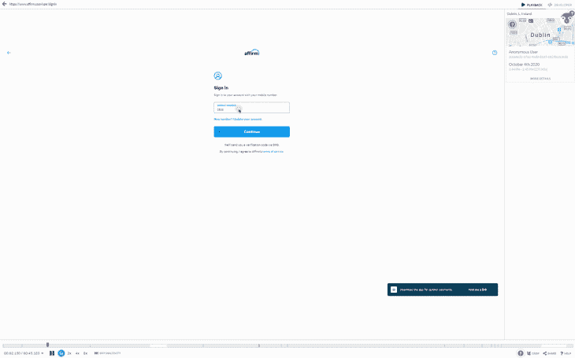

```
import '@fontsource/roboto/300.css';
import '@fontsource/roboto/400.css';
import '@fontsource/roboto/500.css';
import '@fontsource/roboto/700.css';

```

`MUI`还提供了一个名为`[Typography](https://mui.com/components/typography/)`的组件。`Typography`组件允许你在应用程序中显示文本。这里有一个例子:

```
import Typography from "@mui/material/Typography";
//now import CSS files:
import "@fontsource/roboto/300.css";
import "@fontsource/roboto/400.css";
import "@fontsource/roboto/500.css";
import "@fontsource/roboto/700.css";

export default function App() {
  return (
    <div className="App">
    {/* create h1(title) */}
    <Typography variant="h1">Use your phone for longer </Typography>
    {/* create overline */}
    <Typography variant="overline">Or buy a new one</Typography>
    </div>
  );
}

```

`variant`道具有助于应用主题印刷样式，而`color`是组件的颜色。它支持适合组件的主题颜色。

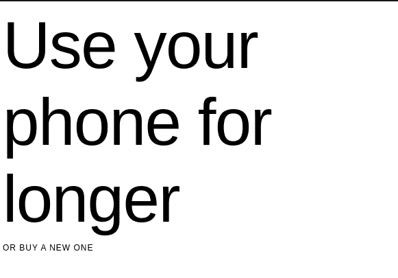

## CSS 基线

如果你一直在写前端代码，你应该已经知道`[normalize.css](https://github.com/necolas/normalize.css)`。如果不是，它就是 HTML 元素和属性样式规范化的集合。MUI 提供了自己版本的`normalize.css`、`[CssBaseline](https://mui.com/components/css-baseline/)`，这个组件提供了一个优雅的、一致的、简单的基线来构建。

`CSSBaseline`执行以下操作:

*   所有浏览器中的边距都被删除
*   将应用默认的材料设计背景色
*   启用字体抗锯齿可以更好地显示 Roboto 字体
*   在`<html>`上没有声明基本字体大小，但假定为 16px(浏览器默认)

```
import CssBaseline from "@mui/material/CssBaseline";
return (
    <div>
      <CssBaseline /> {/* apply normalize.css */}
      {/* Application code.. */}
    </div>
  );

```

## 材料设计中的网格布局

Material Design 的响应式用户界面基于 12 列网格布局。这个网格在布局之间创造了视觉上的一致性。

网格系统具有以下特点:

*   它使用 Flexbox
    *   有两种类型的布局:容器和项目
    *   项目宽度以百分比设置，因此它们总是相对于它们的父元素而变化和调整大小
    *   项目具有填充以在各个项目之间创建间距。
    *   有五个网格断点:xs、sm、md、lg 和 xl
    *   这里有一个使用 MUI 的`Grid`组件的例子:

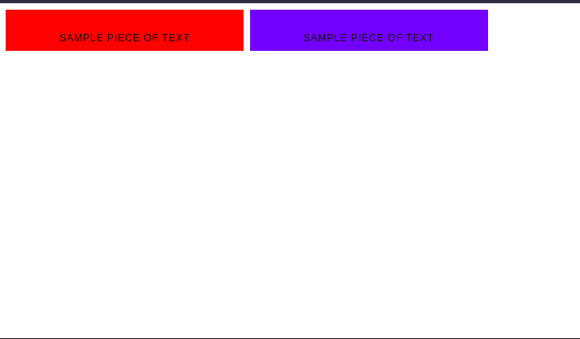

```
import Grid from "@mui/material/Grid";
//first, create a custom component. It will return a div element with a chosen color.
function ColoredComponent({ color }) {
  return (
    <div
    style={{
        backgroundColor: color,
        width: "100%",
        paddingTop: "20px",
        textAlign: "center",
    }}
    >
    <Typography variant="overline"> Sample piece of text</Typography>
    </div>
  );
}
export default function App() {
  return (
    <div className="App">
    {/* Each item will have 1 unit of spacing. The container prop will assign this component as a container*/}
    <Grid container spacing={1}>
        {/* on small screens(phones), this item takes up 5 units. On medium-sized screens(tablets), take up 8 units. If an item is too large, it will go to the next line. */}
        <Grid item xs={5} md={8}>
        <ColoredComponent color="red" />
        </Grid>
        <Grid item xs={5} md={6}>
        <ColoredComponent color="blue" />
        </Grid>
    </Grid>
    </div>
  );

```

React MUI 中的图标

## 图标是材料设计的重要组成部分。它们用在按钮中来传达动作和信息。图标用于象征命令、文件、设备或目录。

它们也用于表示垃圾、打印和保存等动作，常见于应用程序栏、工具栏、按钮和列表中。

MUI 中的图标可以使用两种方法来呈现:`Icon`用于呈现字体图标，而`SvgIcon`用于呈现 SVG 路径。

`SvgIcon`组件将一个 SVG `path`元素作为其子元素，并将其转换为显示路径的 React 组件，允许对图标进行样式化并响应鼠标事件。这可以从下面的例子中看出:

Material UI 也有一个包，附带了要在 React 应用程序中使用的预设图标。这里是你可以在项目中使用的图标列表。

这段代码将从材质图标包中呈现一个填充图标和一个轮廓图标:

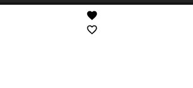

```
import FavoriteIcon from "@mui/icons-material/Favorite";
import FavoriteBorderOutlinedIcon from "@mui/icons-material/FavoriteBorderOutlined";
return (
  <div>
    <FavoriteIcon style={{ width: "100%", height: "20px" }} />
    <FavoriteBorderOutlinedIcon style={{ width: "100%", height: "20px" }} />
  </div>
);

```

MUI 中的按钮

## 按钮允许用户通过一次点击来采取行动和做出选择。它们有助于传达用户可以采取的行动。

因为`Material UI`组件是独立的，所以您需要导入`Button`组件。

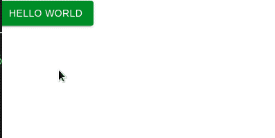

```
import Button from '@mui/material/Button';

<Button color="success" variant="contained">
        Hello World
</Button>

```

组件可以采用许多道具，如颜色、变体、大小等。你可以点击查看完整名单[。](https://mui.com/api/button/)

`mui`中的按钮和材料设计可采用以下任何形式:

扁平按钮

### 平面按钮是只有文本的按钮。它们没有背景颜色和边框。它们可以用在对话框、工具栏或内嵌中。单击时，它们不会抬起，但会填充颜色。

轮廓按钮

### 轮廓按钮是中等强调的纯文本按钮。它们的行为类似于平面按钮，但有一个轮廓，通常用于重要的操作，但不是应用程序中的主要操作。

它们的外观通常以悬停时的边框和背景色为特征。

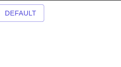

```
<Button variant="outlined">Default</Button>

```

材料-用户界面组件

## MUI 有几个 UI 组件，可以帮助我们在 React 应用程序中构建材质设计的主题。让我们来看看一些组件。

MUI 中的应用程序栏

### [应用栏](https://mui.com/components/app-bar/#main-content)，在 Android 中原名为动作栏，作为头部导航菜单。这是一个用于品牌、导航、搜索和操作的工具栏。要呈现一个简单的应用程序栏，请编写以下代码:

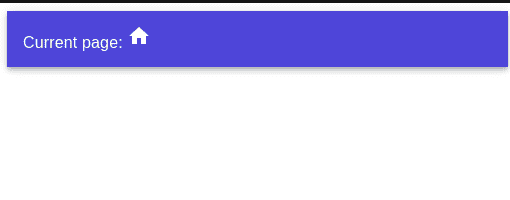

```
import AppBar from "@mui/material/AppBar";
import Toolbar from "@mui/material/Toolbar";
import Typography from "@mui/material/Typography";
import HomeIcon from "@mui/icons-material/Home";

<div>
  <AppBar position="static">
    <Toolbar> {/* Display a Toolbar at the top */}
    <Typography>
        Current page: <HomeIcon /> 
    </Typography>
    </Toolbar>
  </AppBar>
</div>;

```

航行

### [底部导航菜单](https://mui.com/components/bottom-navigation/)位于底部，只需轻轻一点，即可轻松在顶层视图之间切换。

导航菜单的特征是有三到五个动作，每个动作都包含一个图标和一个标签。虽然需要注意的是，只有包含三个动作的导航栏应该同时包含图标和标签。


```
import { useState } from "react";
import BottomNavigation from "@mui/material/BottomNavigation";
import BottomNavigationAction from "@mui/material/BottomNavigationAction";
import RestoreIcon from "@mui/icons-material/Restore";
import FavoriteIcon from "@mui/icons-material/Favorite";
import LocationOnIcon from "@mui/icons-material/LocationOn";

const [value, setValue] = useState(0);

return (
  <div>
{ /* create the bar */ }
    <BottomNavigation
    showLabels
    value={value}
    onChange={(event, newValue) => {
        setValue(newValue); //or change current view
    }}
    >
    <BottomNavigationAction label="Recents" icon={<RestoreIcon />} /> { /*Create an action button with an icon  */}
    <BottomNavigationAction label="Favorites" icon={<FavoriteIcon />} />
    <BottomNavigationAction label="Nearby" icon={<LocationOnIcon />} />
    </BottomNavigation>
    <p> Value:{value}</p> {/* displays the current user selection index */ } 
  </div>
);

```

制表符

### [选项卡](https://mui.com/components/tabs/#main-content)便于浏览和在不同视图间切换。选项卡组件可以是一个简单的没有附加内容的选项卡，如下面的第一个示例所示，也可以是一个带有多个选项卡的可滚动选项卡。

标签也可以只包含图标作为标题/标签。

要创建一个简单的选项卡视图，首先创建一个名为`TabPanel`、`like so:`的定制组件

接下来，通过编写以下代码呈现您的选项卡:

```
import Typography from "@mui/material/Typography";
function TabPanel(props) {
  const { children, value, index } = props;
  //if 'value'(current user selection) and 'index'(the corresponding index of the tab) is equal, then display the component
  return (
    <div>
    {value === index && (
        <div>
        <Typography>{children}</Typography>
        </div>
    )}
    </div>
  );
}

```

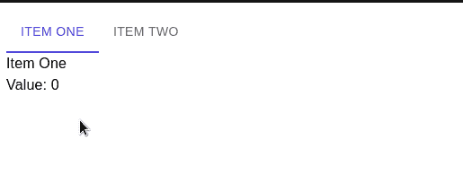

```
import Tabs from "@mui/material/Tabs";
import Tab from "@mui/material/Tab";
import { useState } from "react";
export default function App() {
  const [value, setValue] = useState(0);
  const handleChange = (event, newValue) => {
    setValue(newValue);
  };

  return (
    <div>
    <div>
        <Tabs
        value={value}
        onChange={handleChange} //the handleChange method will run when the user clicks on a tab
        >
        <Tab label="Item One" /> {/* Create our tabs */}
        <Tab label="Item Two" />
        </Tabs>
    </div>
    <TabPanel value={value} index={0}>
        Item One
    </TabPanel>
    <TabPanel value={value} index={1}>
        Item Two
    </TabPanel>
    <Typography>Value: {value} </Typography>
    </div>
  );
}

```

列表

### [列表](https://mui.com/components/lists/)将多个行项目垂直显示为一个连续的元素。

列表由一列连续的行组成，每行包含一个图块。主要操作填充该区域，补充操作由图标和文本表示。这段代码呈现了一个简单的列表:

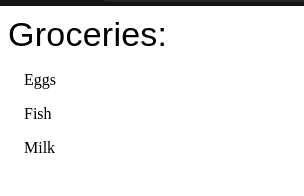

```
import List from "@mui/material/List";
import ListItem from "@mui/material/ListItem";
import Typography from "@mui/material/Typography";

return (
  <div>
    <Typography variant="h4"> Groceries:</Typography>
    <List>
    <ListItem> Eggs</ListItem>
    <ListItem> Fish</ListItem>
    <ListItem> Milk</ListItem>
    </List>
  </div>
);
``

```

**卡片**

### 一张[卡片](https://mui.com/components/cards/)是一张材料，作为更详细信息的入口点。

卡片是显示由不同元素组成的内容的一种便捷方式。它们用于显示易于浏览的信息，通常带有行动号召(CTA)。

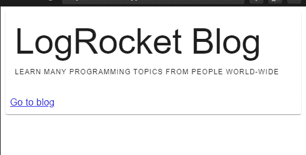

```
import Typography from "@mui/material/Typography";
import CardContent from "@mui/material/CardContent";
import CardActions from "@mui/material/CardActions";
import Card from "@mui/material/Card";

return (
  <div>
    <Card>
      {/* define the main content of the card */}
      <CardContent>
        <Typography variant="h2"> LogRocket Blog</Typography>
        <Typography variant="overline">
          Learn many programming topics from people world-wide
        </Typography>
      </CardContent>
      {/* interact with the card here */}
      <CardActions>
        <Typography>
          <a href="https://blog.logrocket.com/"> Go to blog</a>
        </Typography>
      </CardActions>
    </Card>
  </div>
);

```

**模态**

### 模态组件为创建对话框、弹出框、灯箱等提供了坚实的基础。

每当单击模式按钮时，它都会执行以下操作:

当一次一个不够时，管理对话框堆叠

*   在模态下方创建用于禁用交互的背景
*   它恰当地管理焦点；移动到模式内容，并保持在那里，直到模式关闭
*   它禁止在打开时滚动页面内容
*   自动添加适当的 ARIA 角色
*   让我们使用 MUI 的模态组件。为此，首先创建一个自定义对话框:

接下来，编写这段代码来使用模态组件:

```
import Typography from "@mui/material/Typography";
//Build our custom dialog box:
function CustomDialog() {
  return (
    <div>
    <Typography
        variant="h2"
        style={{ backgroundColor: "blue", padding: "20px" }}
    >
        This is text is in a dialog box
    </Typography>
    </div>
  );
}

```

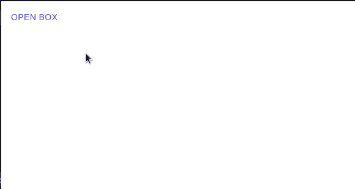

```
import Modal from "@mui/material/Modal";
import Button from "@mui/material/Button";
import { useState } from "react";

export default function App() {
  const [open, setOpen] = useState(false); //will control whether the dialog box is open.
  return (
    <div>
    {/* Set the 'open' Hook to true*/}
    <Button onClick={() => setOpen(true)}> Open box</Button>
     {/* The 'open' prop tells whether the dialog box should be rendered*/}
    {/*The onClose handler will run when the user clicks away from the dialog  box*/}
    <Modal open={open} onClose={() => setOpen(false)}>
        {/* if 'open' is true, then render the CustomDialog component */}
        <CustomDialog />
    </Modal>
    </div>
  );
}

```

**图像列表**

### [图片列表](https://mui.com/components/image-list/#heading-api)是上面看到的标准列表视图的替代。图像列表由以垂直和水平布局排列的重复模式的单元格组成，它通常以图像为特征。为了创建一个图像列表，我们使用了一个`ImageList`组件。

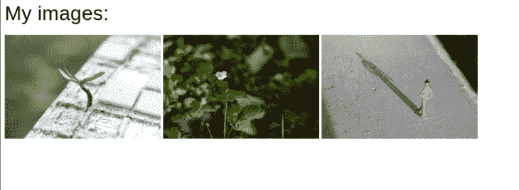

```
import Typography from "@mui/material/Typography";
import ImageList from "@mui/material/ImageList";
import ImageListItem from "@mui/material/ImageListItem";
//first, define our data source.
const images = [
  {
    src: "https://images.pexels.com/photos/1438404/pexels-photo-1438404.jpeg?cs=srgb&dl=pexels-engin-akyurt-1438404.jpg&fm=jpg",
    alt: "landscape",
  },
  {
    src: "https://images.pexels.com/photos/7931183/pexels-photo-7931183.jpeg?auto=compress&cs=tinysrgb&dpr=1&w=500",
    alt: "second image",
  },
  {
    src: "https://images.pexels.com/photos/1000498/pexels-photo-1000498.jpeg?auto=compress&cs=tinysrgb&dpr=1&w=500",
    alt: "third image",
  },
];
return (
  <div>
    <Typography variant="h4"> My images:</Typography>
    {/* Now render our images list. It will have 3 columns */}
    <ImageList sx={{ width: 800, height: 450 }} cols={3} rowHeight={164}>
    {/* Navigate through the images array. Each item corresponds to an ImageListItem component */}
    {images.map((item) => (
        <ImageListItem>
        
        </ImageListItem>
    ))}
    </ImageList>
  </div>
);

```

**反应材料中的表格**

### [数据表](https://material.io/design/components/data-tables.html)显示多组原始数据。它们通常出现在桌面企业产品中。数据表在顶部包含一个列名的标题行，后面是数据行。

为了便于访问，第一列被设置为一个`<th>`元素，其`scope`为`"row"`。这使屏幕阅读器能够通过单元格的行名和列名来识别单元格的值。

在下面的例子中可以看到表格的简单用法。

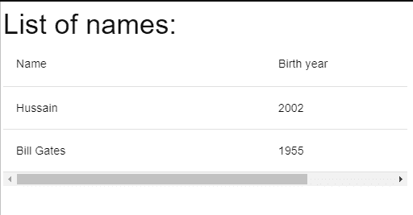

```
import Typography from "@mui/material/Typography";
import Table from "@mui/material/Table";
import TableBody from "@mui/material/TableBody";
import TableCell from "@mui/material/TableCell";
import TableHead from "@mui/material/TableHead";
import TableRow from "@mui/material/TableRow";
import TableContainer from "@mui/material/TableContainer";

return (
  <div>
    <Typography variant="h4"> List of names:</Typography>
    {/* First, create a container. */}
    <TableContainer>
      <Table>
        {/* Now a Table head. (thead) */}
        <TableHead>
          {/*create row */}
          <TableRow>
            {/* create cells */}
            <TableCell>Name</TableCell>
            <TableCell>Birth year</TableCell>
          </TableRow>
        </TableHead>
        {/* next, create body (tbody) */}
        <TableBody>
          <TableRow>
            <TableCell>Hussain </TableCell>
            <TableCell> 2002</TableCell>
          </TableRow>
          <TableRow>
            <TableCell> Bill Gates </TableCell>
            <TableCell>1955 </TableCell>
          </TableRow>
        </TableBody>
      </Table>
    </TableContainer>
  </div>
);

```

**结论**

### 那么，你应该在你的 React 项目中使用材质设计吗？

通常，这个问题的答案取决于你项目的用例以及你想要达到的目标。材料设计可以为你的应用程序提供更好的用户界面的指导方针，也可以启发你的设计者根据这些指导方针来思考信息的层次结构。

与此同时，如果你试图进行品牌重新设计，材料设计可能不是你要找的。你想让你的品牌看起来像互联网上成百上千的其他网站吗？

你也可以探索其他的材质设计库，比如 [react-md](https://react-md.mlaursen.com/) 或者 [materialize](http://materializecss.com/) (一个 CSS 框架)。

[LogRocket](https://lp.logrocket.com/blg/react-signup-general) :全面了解您的生产 React 应用

## 调试 React 应用程序可能很困难，尤其是当用户遇到难以重现的问题时。如果您对监视和跟踪 Redux 状态、自动显示 JavaScript 错误以及跟踪缓慢的网络请求和组件加载时间感兴趣，

.

[try LogRocket](https://lp.logrocket.com/blg/react-signup-general)

LogRocket 结合了会话回放、产品分析和错误跟踪，使软件团队能够创建理想的 web 和移动产品体验。这对你来说意味着什么？

[ ](https://lp.logrocket.com/blg/react-signup-general) [](https://lp.logrocket.com/blg/react-signup-general) 

LogRocket 不是猜测错误发生的原因，也不是要求用户提供截图和日志转储，而是让您回放问题，就像它们发生在您自己的浏览器中一样，以快速了解哪里出错了。

不再有嘈杂的警报。智能错误跟踪允许您对问题进行分类，然后从中学习。获得有影响的用户问题的通知，而不是误报。警报越少，有用的信号越多。

LogRocket Redux 中间件包为您的用户会话增加了一层额外的可见性。LogRocket 记录 Redux 存储中的所有操作和状态。

现代化您调试 React 应用的方式— [开始免费监控](https://lp.logrocket.com/blg/react-signup-general)。

Modernize how you debug your React apps — [start monitoring for free](https://lp.logrocket.com/blg/react-signup-general).