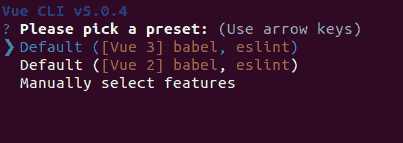

# Vue 3 组件的权威指南

> 原文：<https://blog.logrocket.com/definitive-guide-vue-3-components/>

Vue web 应用程序中的组件非常重要，因为它们可以用非常简单的方式来制作非常复杂的应用程序。在本文中，我们将介绍 Vue 3 组件的基础知识以及如何使用它们。

*向前跳转:*

## Vue 3 中有哪些组件？

组件是构建功能性 web 应用程序的可重用 UI 代码片段。它们既可以用作复杂应用程序的构建块，也可以用作可重用的部分，以防止重复重写类似的代码。

Vue 应用程序通常由一个根组件和任意数量的其他组件组成。所有组件实际上都是组件对象，包含状态变量、组件逻辑和指定组件呈现的模板。

## 在 Vue 3 中创建组件

在我们开始创建组件之前，我们必须首先设置我们的项目。我们可以创建两种类型的 Vue 3 项目:

*   CDN，它与 HTML 页面集成在一起
*   CLI，它是使用 Node.js 开发和构建的

### CDN

CDN 项目是最简单的 Vue 3 项目。

为了建立一个空的 CDN 项目，我们首先将 CDN 导入到我们的 HTML 页面中:

```
<script src="https://cdnjs.cloudflare.com/ajax/libs/vue/3.2.37/vue.global.min.js"></script>

```

接下来，我们创建一个`div`元素来呈现 Vue 应用程序:

```
<div id="app"></div>

```

然后，我们在`body`标签的底部创建一个空的`script`标签:

```
<script>

</script>

```

最后，我们在新的`script`标签中创建和挂载一个空应用程序:

```
Vue.createApp({}).mount("#app");

```

完成上述步骤后，HTML 代码应该如下所示:

```
<script src="https://unpkg.com/[email protected]"></script>

<div id="app"></div>

<script>
  Vue.createApp({}).mount("#app");
</script>

```

### 命令行界面项目

设置 CLI 项目比创建 CDN 项目更复杂。首先安装以下组件:

接下来，使用以下任意命令安装 [Vue CLI](https://cli.vuejs.org) :

```
# for npm
npm install -g @vue/cli

# for yarn 1.x
yarn global add @vue/cli

```

现在，创建一个项目`vue-tutorial`，像这样:

```
vue create vue-tutorial

```

然后，选择`Vue 3`:



***注意，**如果你使用的是 [Yarn v2 或更高版本](https://yarnpkg.com/getting-started/migration#step-by-step)，你必须使用`*yarn dlx @vue/cli create vue-tutorial*`来创建项目；Yarn v2+不支持全局安装*

Vue CLI 创建项目后，其树结构应该如下所示:

```
.
├── babel.config.js
├── jsconfig.json
├── package.json
├── package-lock.json
├── public
│   ├── favicon.ico
│   └── index.html
├── README.md
├── src
│   ├── App.vueThe v
│   ├── assets
│   │   └── logo.png
│   ├── components
│   │   └── HelloWorld.vue
│   └── main.js
└── vue.config.js

```

一个 Vue 3 项目的根是`src/main.js`:

```
import { createApp } from 'vue'
import App from './App.vue'

createApp(App).mount('#app')

```

在上面的代码中，`vue`中的`createApp`函数创建了一个应用程序实例，并将其挂载到一个 ID 为`app`的 HTML 元素中。`createApp`接受一个组件作为参数，在本例中来自`./App.vue`文件。

### 视图 3 `createApp`

Vue 3 提供了一个用于创建应用实例的`createApp`函数。该函数将组件作为参数，使其成为实例的根。

应用程序实例提供了一个`mount`方法，该方法将实例装载到一个 HTML 元素中。

```
import { createApp } from "vue";
import App from "./App.vue";

createApp(App).mount('#app');  // the element has an id "app"

```

`createApp`功能只存在于 Vue 3 中。Vue 2 提供了一个`Vue`构造函数来创建应用程序实例。

```
import Vue from 'vue'
import App from './App.vue' 

new Vue({
  render: h => h(App),
}).$mount('#app')

```

`Vue`构造函数接受一个应该包含一个`render`方法的对象来呈现根组件。构造的实例有一个`$mount`方法，允许我们将实例挂载到 HTML 元素。`$mount`方法也使用 CSS 选择器来引用元素。

Vue 允许我们在 v2 和 v3 中创建[指令](https://012.vuejs.org/guide/custom-directive.html)。指令使我们能够向 Vue 应用程序实例添加功能。为了在 Vue 2 中创建指令，我们需要使用`Vue`对象。

所有应用程序实例都可以使用使用`Vue`对象创建的任何指令。当我们的 web 应用程序使用多个 Vue 应用程序实例，但我们希望将某些功能限制到特定实例时，这就成了一个问题。

```
// The only way to create a directive in Vue 2
Vue.directive('directive', {
    // ...
});

// Both of the application instances can access the directive
const appOne = new Vue(App1).mount('#app1');
const appTwo = new Vue(App2).mount('#app2');

```

Vue 3 `createApp`函数通过提供用于定制实例的[实例 API 来解决这个问题。API 方法之一`directive`为实例创建定制指令:](https://v3-migration.vuejs.org/breaking-changes/global-api.html#a-new-global-api-createapp)

```
// Both of the application instances can access the directive
const appOne = Vue.createApp(App1);
appOne.directive('directive', {
    // only availalble "appOne" instance */
});
appOne.mount('#app1');

const appTwo = Vue.createApp(App2);
appTwo.directive('directive', {
    // only availalble to "appTwo"
});
appTwo.mount('#app2');

```

## 创建根组件

所有 Vue web 应用程序都从根组件开始。`createApp`函数将这个组件绑定到一个 HTML 元素。

为了创建一个根组件，我们从一个空对象开始，按照惯例将其命名为`RootComponent`。为了将对象注册为根，我们将它传递给`Vue.createApp()`函数:

```
<script>
    const RootComponent = {};
    const app = Vue.createApp(RootComponent);
    app.mount("#app");
</script>

```

在 Vue CLI 中，根组件就像任何其他组件一样，位于`src/App.vue`。

## 创建简单的组件

为了在 Vue 中创建一个组件，我们从一个空的对象开始，就像根组件一样。但是，我们没有将它传递给`Vue.createApp()`函数，而是将它注册到我们想要使用它的组件中。

为了在根组件中注册一个新组件，我们在对象中创建一个`components`属性。下面是在根中注册一个`CustomButton`组件的例子:

```
<script>
    const CustomButton = {};
    const RootComponent = {
        components: {
            CustomButton,
        },
    };
    const app = Vue.createApp(RootComponent);
    app.mount("#app");
</script>

```

组件需要一个呈现给视图的模板。模板通常在带有`vue-template`的`type`的`script`标签中，以防止浏览器将其作为 JavaScript 代码执行。

模板应该有一个 ID，它允许组件对象引用它的脚本。这里有一个简单的`CustomButton`组件模板脚本。在这个例子中，模板脚本 ID 是`"``custom-button``"`:

```
<script type="vue-template" id="custom-button">
    <button>Click Me!</button>
</script>

```

为了将模板绑定到组件，我们向组件对象添加了一个`template`属性，并将引用传递给脚本:

```
<script>
    const CustomButton = {
        template: "#custom-button"
    };
...
</script>

```

现在，我们可以在根组件中使用`CustomButton`组件:

```
<div id="app">
    <CustomButton />
</div>

```

在 CLI 版本中，组件具有不同的结构。每个组件都在一个`.vue`文件中。所有组件必须包括一个`template`标签和一个`script`。还可以添加一个`style`标签来设置模板的样式。

下面是一个使用 Vue CLI 创建的简单 Vue 组件的示例:

```
><template>
  Hello, World!
</template>

<script>
  export default {}
</script>

```

`export default`之后的对象就像 CDN 版本中的组件对象一样。由 CLI 和 CDN 创建的简单组件之间的唯一区别如下:

*   对于 CDN 版本，不需要为对象指定模板脚本
*   使用 CDN 版本，我们可以将组件分离到不同的文件中

要在另一个组件中使用一个组件，请按照下列步骤操作:

1.  1.  将`.vue`文件导入组件脚本标签
    2.  将默认导出添加到`component`属性

```
import HelloWorld from './components/HelloWorld.vue'export default {
components: {
HelloWorld
}
}
```

## 向 Vue 3 组件添加状态

要向 Vue 组件添加状态变量，在组件对象中创建一个`data`方法。`data`方法应该返回一个包含状态变量的对象。

在下面的例子中，`CustomButton`组件包含一个`buttonText`状态，它有一个字符串值:`"``Click me!``"`:

```
<script>
    const CustomButton = {
        template: "#custom-button",
        data: function () {
            return {
                'buttonText': "Click me!"
            }
        }
    }
    // some lines are hidden
</script>

```

我们在模板脚本的`button`标签中使用状态变量，用双花括号`{{ }}`将它括起来，就像这样:

```
<script type="vue-template" id="custom-button">
    <button>{{ buttonText }}</button>
</script>

```

## 处理 Vue 3 组件道具

Vue 中的 Props 是传递给组件的属性，就像 HTML 元素一样。它们提高了组件的灵活性和可重用性，这使得在略有不同的场景中使用相同的代码成为可能，从而使 UI 更加高效。

我们向组件传递属性的方式与向 HTML 元素传递属性的方式相同:

```
<component prop="value"></component>

```

然后，我们可以通过添加包含按钮文本的`text`属性来更新`custom-button`组件:

```
<div id="app">
    {{ greeting }}, {{ name }}
    <CustomButton text="Click me!"></CustomButton>
</div>

```

为了让`text`道具工作，我们将它注册到`CustomButton`组件:

```
<script>
    const CustomButton = {
        template: "#custom-button",
        data: function () {
            return {
                'buttonText': "Click me!"
            }
        },
>       props: ['text']
    }

    // some lines are hidden
</script>

```

然后，我们用模板中的`{{ text }}`替换`{{ buttonText }}`:

```
<script type="vue-template" id="custom-button">
    <button>{{ text }}</button>
</script>

```

接下来，我们移除`buttonText`状态变量，因为不再需要它了:

```
<script>
    const CustomButton = {
        template: "#custom-button",
        props: ['text'],
    }

    // some lines are hidden
</script>

```

## 处理多个组件道具

在一个 Vue 组件中可以使用多个道具。一个组件拥有的道具越多，它就变得越灵活和可用。要向组件添加更多属性，请将属性的名称追加到组件的属性数组中:

```
<script>
    const CustomButton = {
        template: "#custom-button",
>       props: ['text', 'label'],
    }

    // some lines are hidden
</script>

```

但是，在给 Vue 组件添加更多道具时要小心。过多的道具会使 Vue 组件变得不必要的复杂和难以维护。

现在，`CustomButton`组件有两个道具:`text`和`label`。

添加了`label`道具后，我们修改了模板以使用这个道具:

```
<script type="vue-template" id="custom-button">
    {{ label }}: <button>{{ text }}</button>
</script>

```

使用多个 props 和使用 Vue CLI 创建的组件的工作方式相同。

## 嵌套组件

Vue 3 允许我们在其他组件中嵌套组件。这种嵌套导致了[组合](https://blog.logrocket.com/build-better-higher-order-components-with-vue-3/)，其中一个大的或复杂的组件由更小的组件组成。组合有助于提高用户界面的效率和维护性。

这里有一个简单的嵌套组件的例子。`StartStopButton`包含两个`CustomButton`组件:

```
<script type='vue-template' id="start-stop-button">

```

现在，我们可以将`StartStopButton`组件添加到根组件中:

{{问候语}}，{{姓名}}

使用`defineComponent`和打字稿

```
<script>
    // ...
    const RootComponent = {
        data: function () {
            return {
                greeting: "Hello",
                name: "John",
            }
        },
        components: {
            StartStopButton
        },
    };

    // ...
</script>

```

## Vue 2 和 Vue 3 都允许我们[使用 TypeScript](https://blog.logrocket.com/vue-typescript-tutorial-examples/) 构建 Vue 应用程序。TypeScript 语言是 JavaScript 的强大超集，提供可选的静态类型并支持更多的 ide。

与 Vue 3 相比，Vue 2 中的 TypeScript 支持真的很差[。要用 TypeScript 在 Vue 2 中创建组件，我们需要使用标准语法或类组件。每种方法都有利弊；让我们来看看。](https://blog.logrocket.com/new-features-in-vue-3-and-how-to-use-them-2/#bettertypescriptsupport)

在本例中，我们使用标准语法在 Vue 2 中用 TypeScript 创建了一个组件:

在上面的代码中，我们可以看到用标准语法创建的组件类似于一个组件对象，但是缺少对类似于 [Vuex](https://vuex.vuejs.org/) 的特性的支持。

```
<template>
  <div>
    {{ name }}: {{ msg }}
  </div>
</template>

<script lang="ts">
  import Vue from "vue";
  export default Vue.extend({
    name: "HelloVue",
    props: {
      msg: String
    },
    data () {
      return {
        name: "LogRocket"
      }
    }
  })
</script>

```

在这个例子中，我们使用一个类组件在 Vue 2 中用 TypeScript 创建一个组件:

在上面的代码中，我们可以看到用类组件创建的组件与组件对象有很大的不同，尽管它支持额外的特性。

```
<template>
  <div>
    {{ name}}: {{ msg }}
  </div>
</template>

<script lang="ts">
  import { Component, Prop, Vue } from "vue-property-decorator";
  @Component
  export default class HelloVue extends Vue {
    @Prop() public msg!: string;
    public name: string = "LogRocket";
  }
</script>

```

Vue 3 通过提供一个`defineComponent`函数解决了这些缺点。这个函数允许我们创建一个类似于组件对象的 TypeScript 组件，并且还支持额外的特性。

结论

```
<template>
  <div>
    {{ name }}: {{ msg }}
  </div>
</template>

<script lang="ts">
  import { defineComponent } from "vue";
  export default defineComponent({
    props: {
      msg: {
        type: String,
        required: true
      }
    },
    data() {
      return {
        name: "LogRocket",
      }
    }
  });
</script>  

```

## 我希望这篇文章能帮助你理解在 Vue 3 中创建组件并使用它们构建复杂应用程序的过程。但是，如果你仍然不明白其中的任何部分，或者不能理解，请在评论中告诉我。

感谢您的阅读，祝您愉快！

像用户一样体验您的 Vue 应用

## 调试 Vue.js 应用程序可能会很困难，尤其是当用户会话期间有几十个(如果不是几百个)突变时。如果您对监视和跟踪生产中所有用户的 Vue 突变感兴趣，

.

[try LogRocket](https://lp.logrocket.com/blg/vue-signup)

LogRocket 就像是网络和移动应用程序的 DVR，记录你的 Vue 应用程序中发生的一切，包括网络请求、JavaScript 错误、性能问题等等。您可以汇总并报告问题发生时应用程序的状态，而不是猜测问题发生的原因。

[](https://lp.logrocket.com/blg/vue-signup)[https://logrocket.com/signup/](https://lp.logrocket.com/blg/vue-signup)

LogRocket Vuex 插件将 Vuex 突变记录到 LogRocket 控制台，为您提供导致错误的环境，以及出现问题时应用程序的状态。

现代化您调试 Vue 应用的方式- [开始免费监控](https://lp.logrocket.com/blg/vue-signup)。

Modernize how you debug your Vue apps - [Start monitoring for free](https://lp.logrocket.com/blg/vue-signup).