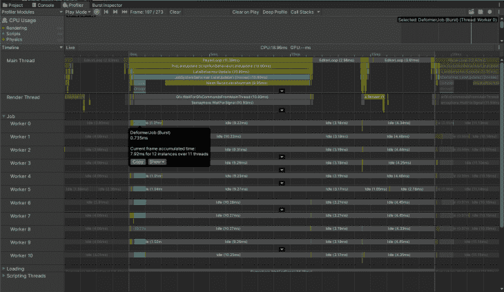
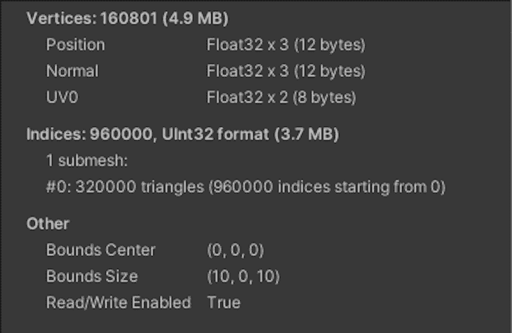
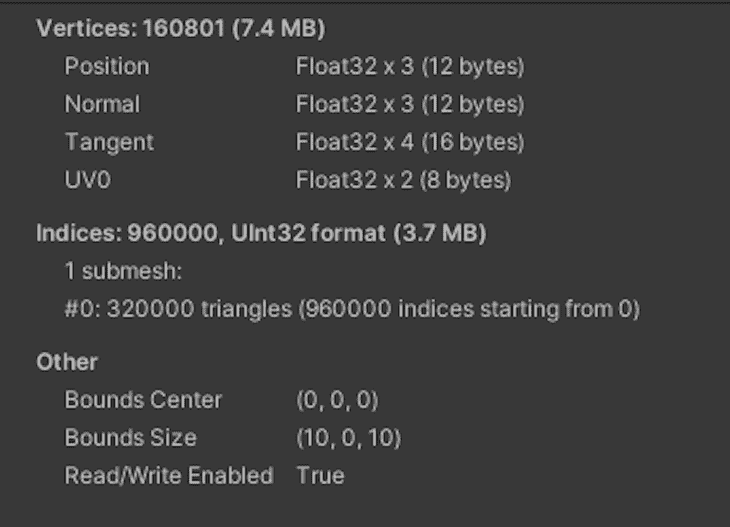
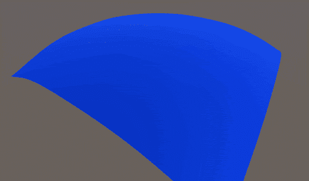
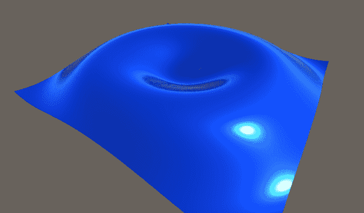
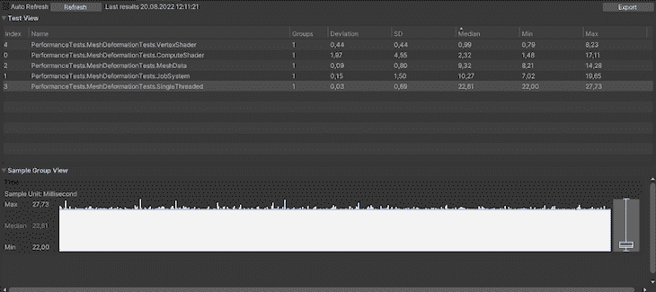

# 在 Unity 中变形网格

> 原文：<https://blog.logrocket.com/deforming-mesh-unity/>

在这篇文章中，你将学习如何使用各种技术在 Unity 中变形一个网格，这样当你在游戏中需要一个特定的或相似的特征时，你就可以为你的项目选择一个最合适的。我们将实现一个效果，使用一个基本的函数来移动顶点，类似于水面上的波纹。

*向前跳转:*

## 为什么使用网格变形？

游戏中有很多需要网格变形的特性，包括风中摇曳的草，角色互动，水中的波浪，甚至是[地形特性](https://blog.logrocket.com/easy-environment-design-unity-terrain-features/)比如角色脚下的积雪。我还可以继续，但是很明显，在各种各样的游戏和类型中使用网格变形是很重要的。

## 如何在 Unity 中变形网格

首先，我们需要一个带有`Deformer`组件和`MeshFilter`的游戏对象。

基础变形器`MonoBehaviour`应该包含属性并缓存网格对象:

```
[RequireComponent(typeof(MeshFilter))]
public abstract class BaseDeformer : MonoBehaviour
{
   [SerializeField] protected float _speed = 2.0f;
   [SerializeField] protected float _amplitude = 0.25f;
   protected Mesh Mesh;

   protected virtual void Awake()
   {
       Mesh = GetComponent<MeshFilter>().mesh;
   }
}

```

为了方便地修改和计算位移函数，我们创建了一个计算位移的实用程序类。这里介绍的所有方法都将使用 utility 类，它允许我们在同一位置同时为所有方法更改位移函数:

```
public static class DeformerUtilities
{
   [BurstCompile]
   public static float CalculateDisplacement(Vector3 position, float time, float speed, float amplitude)
   {
       var distance = 6f - Vector3.Distance(position, Vector3.zero);
       return Mathf.Sin(time * speed + distance) * amplitude;
   }
}

```

在这篇博文中，我们将使用以下技术来变形一个网格:

### 单线程实现的网格变形

这是 Unity 中变形网格的最简单方法。对于没有任何其他基于性能的工作的小游戏来说，这可能是一个完美的解决方案。

我们需要在每个`Update()`上迭代`Mesh.vertices`，并根据位移函数修改它们:

```
public class SingleThreadedDeformer : BaseDeformer
{
   private Vector3[] _vertices;

   protected override void Awake()
   {
       base.Awake();
       // Mesh.vertices return a copy of an array, therefore we cache it to avoid excessive memory allocations
       _vertices = Mesh.vertices;
   }

   private void Update()
   {
       Deform();
   }

   private void Deform()
   {
       for (var i = 0; i < _vertices.Length; i++)
       {
           var position = _vertices[i];
           position.y = DeformerUtilities.CalculateDisplacement(position, Time.time, _speed, _amplitude);
           _vertices[i] = position;
       }

       // MarkDynamic optimizes mesh for frequent updates according to docs
       Mesh.MarkDynamic();
       // Update the mesh visually just by setting the new vertices array
       Mesh.SetVertices(_vertices);
       // Must be called so the updated mesh is correctly affected by the light
       Mesh.RecalculateNormals();
   }
}

```

### 用 C#在 Unity 中实现作业系统

在前面的方法中，我们在每一帧中迭代顶点数组。那么，我们如何优化它呢？你的第一个想法应该是同时做这项工作。Unity 允许我们在工作线程上拆分计算，因此我们可以并行迭代数组。

您可能会争辩说，调度任何工作并将结果收集到主线程上会有成本。当然，我只能同意你的观点。因此，您必须在目标平台上分析您的确切情况，以便做出任何假设。进行轮廓分析后，可以确定是使用作业系统还是其他方法来变形网格。

要使用 [C#作业系统](https://blog.logrocket.com/performance-unity-async-await-tasks-coroutines-c-job-system-burst-compiler/)，我们需要将位移计算移到一个作业中:

```
[BurstCompile]
public struct DeformerJob : IJobParallelFor
{
   private NativeArray<Vector3> _vertices;
   [ReadOnly] private readonly float _speed;
   [ReadOnly] private readonly float _amplitude;
   [ReadOnly] private readonly float _time;

   public DeformerJob(float speed, float amplitude, float time, NativeArray<Vector3> vertices)
   {
       _vertices = vertices;
       _speed = speed;
       _amplitude = amplitude;
       _time = time;
   }

   public void Execute(int index)
   {
       var position = _vertices[index];
       position.y = DeformerUtilities.CalculateDisplacement(position, _time, _speed, _amplitude);
       _vertices[index] = position;
   }
}

```

然后，我们不是在`Update()`中变形网格，而是调度新作业，并尝试在`LateUpdate()`中完成它:

```
public class JobSystemDeformer : BaseDeformer
{
   private NativeArray<Vector3> _vertices;
   private bool _scheduled;
   private DeformerJob _job;
   private JobHandle _handle;

   protected override void Awake()
   {
       base.Awake();
       // Similarly to the previous approach we cache the mesh vertices array
       // But now NativeArray<Vector3> instead of Vector3[] because the latter cannot be used in jobs
       _vertices = new NativeArray<Vector3>(Mesh.vertices, Allocator.Persistent);
   }

   private void Update()
   {
       TryScheduleJob();
   }

   private void LateUpdate()
   {
       CompleteJob();
   }

   private void OnDestroy()
   {
     // Make sure to dispose all unmanaged resources when object is destroyed
       _vertices.Dispose();
   }

   private void TryScheduleJob()
   {
       if (_scheduled)
       {
           return;
       }

       _scheduled = true;
       _job = new DeformerJob(_speed, _amplitude, Time.time, _vertices);
       _handle = _job.Schedule(_vertices.Length, 64);
   }

   private void CompleteJob()
   {
       if (!_scheduled)
       {
           return;
       }

       _handle.Complete();
       Mesh.MarkDynamic();
       // SetVertices also accepts NativeArray<Vector3> so we can use in here too
       Mesh.SetVertices(_vertices);
       Mesh.RecalculateNormals();
       _scheduled = false;
   }
}

```

您可以在[分析器](https://docs.unity3d.com/Manual/Profiler.html)中轻松检查工作线程是否繁忙:



### 使用 MeshData 实现的网格变形

[MeshData](https://docs.unity3d.com/2020.1/Documentation/ScriptReference/Mesh.MeshData.html) 是添加到 Unity v2020.1 中的一个相对较新的 API。它提供了一种在作业中使用网格的方法，这允许我们摆脱数据缓冲`NativeArray<Vector3> _vertices`。

这个缓冲区是必需的，因为`mesh.vertices`返回一个实际数组的副本，所以缓存这个数据并重用集合是合理的。

相反，MeshData 返回指向实际网格数据的指针。从这里，我们可以每帧更新网格，并在调度新作业之前获得指向下一帧新数据的指针，而不会有与分配和复制大型阵列相关的性能损失。

因此，前面的代码转换为:

```
[BurstCompile]
public struct DeformMeshDataJob : IJobParallelFor
{
   public Mesh.MeshData OutputMesh;
   [ReadOnly] private NativeArray<VertexData> _vertexData;
   [ReadOnly] private readonly float _speed;
   [ReadOnly] private readonly float _amplitude;
   [ReadOnly] private readonly float _time;

   public DeformMeshDataJob(
       NativeArray<VertexData> vertexData,
       Mesh.MeshData outputMesh,
       float speed,
       float amplitude,
       float time)
   {
       _vertexData = vertexData;
       OutputMesh = outputMesh;
       _speed = speed;
       _amplitude = amplitude;
       _time = time;
   }

   public void Execute(int index)
   {
       var outputVertexData = OutputMesh.GetVertexData<VertexData>();
       var vertexData = _vertexData[index];
       var position = vertexData.Position;
       position.y = DeformerUtilities.CalculateDisplacement(position, _time, _speed, _amplitude);
       outputVertexData[index] = new VertexData
       {
           Position = position,
           Normal = vertexData.Normal,
           Uv = vertexData.Uv
       };
   }
}

```

下面是我们如何获得调度作业所需的所有数据:

```
private void ScheduleJob()
{
...
   // Will be writing into this mesh data
   _meshDataArrayOutput = Mesh.AllocateWritableMeshData(1);
   var outputMesh = _meshDataArrayOutput[0];
   // From this one
   _meshDataArray = Mesh.AcquireReadOnlyMeshData(Mesh);
   var meshData = _meshDataArray[0];
   // Set output mesh params
   outputMesh.SetIndexBufferParams(meshData.GetSubMesh(0).indexCount, meshData.indexFormat);
   outputMesh.SetVertexBufferParams(meshData.vertexCount, _layout);
   // Get the pointer to the input vertex data array
   _vertexData = meshData.GetVertexData<VertexData>();
   _job = new DeformMeshDataJob(
       _vertexData,
       outputMesh,
       _speed,
       _amplitude,
       Time.time
   );

   _jobHandle = _job.Schedule(meshData.vertexCount, _innerloopBatchCount);
}

```

你可能已经注意到我们得到了`meshData.GetVertexData<VertexData>()`，而不仅仅是顶点数组:

```
[StructLayout(LayoutKind.Sequential)]
public struct VertexData
{
   public Vector3 Position;
   public Vector3 Normal;
   public Vector2 Uv;
}

```

这使我们可以在作业中设置输出网格数据中的所有顶点数据。与先前的技术相反，在先前的技术中，我们直接修改网格并且顶点数据已经存在，输出网格数据在创建时不包含作业内的顶点数据。当使用这个结构时，确保它包含你的网格拥有的所有数据；否则，调用`GetVertexData<T>()`可能会失败或产生不想要的结果。

例如，这个将会工作，因为它匹配所有的顶点参数:



但是，这个例子会因为一个切线而失败:



如果你需要切线，那么你必须用额外的字段扩展`VertexData`。这同样适用于您可能添加到网格的任何属性。

完成作业后，我们以下列方式应用数据:

```
private void UpdateMesh(Mesh.MeshData meshData)
   {
     // Get a reference to the index data and fill it from the input mesh data
       var outputIndexData = meshData.GetIndexData<ushort>();
       _meshDataArray[0].GetIndexData<ushort>().CopyTo(outputIndexData);
       // According to docs calling Mesh.AcquireReadOnlyMeshData
 // does not cause any memory allocations or data copies by default, as long as you dispose of the MeshDataArray before modifying the Mesh
       _meshDataArray.Dispose();
       meshData.subMeshCount = 1;
       meshData.SetSubMesh(0,
           _subMeshDescriptor,
           MeshUpdateFlags.DontRecalculateBounds |
           MeshUpdateFlags.DontValidateIndices |
           MeshUpdateFlags.DontResetBoneBounds |
           MeshUpdateFlags.DontNotifyMeshUsers);
       Mesh.MarkDynamic();
       Mesh.ApplyAndDisposeWritableMeshData(
           _meshDataArrayOutput,
           Mesh,
           MeshUpdateFlags.DontRecalculateBounds |
           MeshUpdateFlags.DontValidateIndices |
           MeshUpdateFlags.DontResetBoneBounds |
           MeshUpdateFlags.DontNotifyMeshUsers);
       Mesh.RecalculateNormals();
   }

```

以下是完整的脚本:

```
public class MeshDataDeformer : BaseDeformer
{
   private Vector3 _positionToDeform;
   private Mesh.MeshDataArray _meshDataArray;
   private Mesh.MeshDataArray _meshDataArrayOutput;
   private VertexAttributeDescriptor[] _layout;
   private SubMeshDescriptor _subMeshDescriptor;
   private DeformMeshDataJob _job;
   private JobHandle _jobHandle;
   private bool _scheduled;

   protected override void Awake()
   {
       base.Awake();
       CreateMeshData();
   }

   private void CreateMeshData()
   {
       _meshDataArray = Mesh.AcquireReadOnlyMeshData(Mesh);
       _layout = new[]
       {
           new VertexAttributeDescriptor(VertexAttribute.Position,
               _meshDataArray[0].GetVertexAttributeFormat(VertexAttribute.Position), 3),
           new VertexAttributeDescriptor(VertexAttribute.Normal,
               _meshDataArray[0].GetVertexAttributeFormat(VertexAttribute.Normal), 3),
           new VertexAttributeDescriptor(VertexAttribute.TexCoord0,
               _meshDataArray[0].GetVertexAttributeFormat(VertexAttribute.TexCoord0), 2),
       };
       _subMeshDescriptor =
           new SubMeshDescriptor(0, _meshDataArray[0].GetSubMesh(0).indexCount, MeshTopology.Triangles)
           {
               firstVertex = 0, vertexCount = _meshDataArray[0].vertexCount
           };
   }

   private void Update()
   {
       ScheduleJob();
   }

   private void LateUpdate()
   {
       CompleteJob();
   }

   private void ScheduleJob()
   {
       if (_scheduled)
       {
           return;
       }

       _scheduled = true;
       _meshDataArrayOutput = Mesh.AllocateWritableMeshData(1);
       var outputMesh = _meshDataArrayOutput[0];
       _meshDataArray = Mesh.AcquireReadOnlyMeshData(Mesh);
       var meshData = _meshDataArray[0];
       outputMesh.SetIndexBufferParams(meshData.GetSubMesh(0).indexCount, meshData.indexFormat);
       outputMesh.SetVertexBufferParams(meshData.vertexCount, _layout);
       _job = new DeformMeshDataJob(
           meshData.GetVertexData<VertexData>(),
           outputMesh,
           _speed,
           _amplitude,
           Time.time
       );

       _jobHandle = _job.Schedule(meshData.vertexCount, 64);
   }

   private void CompleteJob()
   {
       if (!_scheduled)
       {
           return;
       }

       _jobHandle.Complete();
       UpdateMesh(_job.OutputMesh);
       _scheduled = false;
   }

   private void UpdateMesh(Mesh.MeshData meshData)
   {
       var outputIndexData = meshData.GetIndexData<ushort>();
       _meshDataArray[0].GetIndexData<ushort>().CopyTo(outputIndexData);
       _meshDataArray.Dispose();
       meshData.subMeshCount = 1;
       meshData.SetSubMesh(0,
           _subMeshDescriptor,
           MeshUpdateFlags.DontRecalculateBounds |
           MeshUpdateFlags.DontValidateIndices |
           MeshUpdateFlags.DontResetBoneBounds |
           MeshUpdateFlags.DontNotifyMeshUsers);
       Mesh.MarkDynamic();
       Mesh.ApplyAndDisposeWritableMeshData(
           _meshDataArrayOutput,
           Mesh,
           MeshUpdateFlags.DontRecalculateBounds |
           MeshUpdateFlags.DontValidateIndices |
           MeshUpdateFlags.DontResetBoneBounds |
           MeshUpdateFlags.DontNotifyMeshUsers);
       Mesh.RecalculateNormals();
   }
}

```

### 使用计算着色器实现变形网格

像前面的例子一样在工作线程上分割工作是一个好主意，但是我们可以通过将工作卸载到 GPU 来分割工作，这是为了执行并行工作而设计的。

在这里，工作流类似于作业系统方法-我们需要调度一项工作，但我们将使用计算着色器并将数据发送到 GPU，而不是使用作业。

首先，创建一个使用`RWStructuredBuffer<VertexData>`而不是`NativeArray`作为数据缓冲区的着色器。除了这一点和语法，代码是相似的:

```
#pragma kernel CSMain

struct VertexData
{
   float3 position;
   float3 normal;
   float2 uv;
};

RWStructuredBuffer<VertexData> _VertexBuffer;
float _Time;
float _Speed;
float _Amplitude;

[numthreads(32,1,1)]
void CSMain(uint3 id : SV_DispatchThreadID)
{
   float3 position = _VertexBuffer[id.x].position;
   const float distance = 6.0 - length(position - float3(0, 0, 0));
   position.y = sin(_Time * _Speed + distance) * _Amplitude;
   _VertexBuffer[id.x].position.y = position.y;
}

```

注意`VertexData`，它定义在着色器的顶部。我们也需要它在 C#端的表示:

```
[StructLayout(LayoutKind.Sequential)]
public struct VertexData
{
   public Vector3 Position;
   public Vector3 Normal;
   public Vector2 Uv;
}

```

在这里，我们在`Update()`中创建请求`_request = AsyncGPUReadback.Request(_computeBuffer);`，并在`LateUpdate()`中收集准备好的结果:

```
public class ComputeShaderDeformer : BaseDeformer
{
   [SerializeField] private ComputeShader _computeShader;
   private bool _isDispatched;
   private int _kernel;
   private int _dispatchCount;
   private ComputeBuffer _computeBuffer;
   private AsyncGPUReadbackRequest _request;

   private NativeArray<VertexData> _vertexData;

   // Cache property id to prevent Unity hashing it every frame under the hood
   private readonly int _timePropertyId = Shader.PropertyToID("_Time");

   protected override void Awake()
   {
       if (!SystemInfo.supportsAsyncGPUReadback)
       {
           gameObject.SetActive(false);
           return;
       }

       base.Awake();
       CreateVertexData();
       SetMeshVertexBufferParams();
       _computeBuffer = CreateComputeBuffer();
       SetComputeShaderValues();
   }

   private void CreateVertexData()
   {
     // Can use here MeshData to fill the data buffer really fast and without generating garbage
       _vertexData = Mesh.AcquireReadOnlyMeshData(Mesh)[0].GetVertexData<VertexData>();
   }

   private void SetMeshVertexBufferParams()
   {
       var layout = new[]
       {
           new VertexAttributeDescriptor(VertexAttribute.Position,
               Mesh.GetVertexAttributeFormat(VertexAttribute.Position), 3),
           new VertexAttributeDescriptor(VertexAttribute.Normal,
               Mesh.GetVertexAttributeFormat(VertexAttribute.Normal), 3),
           new VertexAttributeDescriptor(VertexAttribute.TexCoord0,
               Mesh.GetVertexAttributeFormat(VertexAttribute.TexCoord0), 2),
       };
       Mesh.SetVertexBufferParams(Mesh.vertexCount, layout);
   }

   private void SetComputeShaderValues()
   {
       // No need to cache these properties to ids, as they are used only once and we can avoid odd memory usage
       _kernel = _computeShader.FindKernel("CSMain");
       _computeShader.GetKernelThreadGroupSizes(_kernel, out var threadX, out _, out _);
       _dispatchCount = Mathf.CeilToInt(Mesh.vertexCount / threadX + 1);
       _computeShader.SetBuffer(_kernel, "_VertexBuffer", _computeBuffer);
       _computeShader.SetFloat("_Speed", _speed);
       _computeShader.SetFloat("_Amplitude", _amplitude);
   }

   private ComputeBuffer CreateComputeBuffer()
   {
       // 32 is the size of one element in the buffer. Has to match size of buffer type in the shader
       // Vector3 + Vector3 + Vector2 = 8 floats = 8 * 4 bytes
       var computeBuffer = new ComputeBuffer(Mesh.vertexCount, 32);
       computeBuffer.SetData(_vertexData);
       return computeBuffer;
   }

   private void Update()
   {
       Request();
   }

   private void LateUpdate()
   {
       TryGetResult();
   }

   private void Request()
   {
       if (_isDispatched)
       {
           return;
       }

       _isDispatched = true;
       _computeShader.SetFloat(_timePropertyId, Time.time);
       _computeShader.Dispatch(_kernel, _dispatchCount, 1, 1);
       _request = AsyncGPUReadback.Request(_computeBuffer);
   }

   private void TryGetResult()
   {
       if (!_isDispatched || !_request.done)
       {
           return;
       }

       _isDispatched = false;
       if (_request.hasError)
       {
           return;
       }

       _vertexData = _request.GetData<VertexData>();
       Mesh.MarkDynamic();
       Mesh.SetVertexBufferData(_vertexData, 0, 0, _vertexData.Length);
       Mesh.RecalculateNormals();
   }

   private void OnDestroy()
   {
       _computeBuffer?.Release();
       _vertexData.Dispose();
   }
}

```

### 在 Unity 中使用顶点着色器实现

所有以前的技术都使用不同的方法来修改主线程或工作线程以及 GPU 上的数据。最终，数据被传递回主线程来更新`MeshFilter`。

有时，你需要更新`MeshCollider`，这样[物理和刚体](https://blog.logrocket.com/2d-3d-raycasting-unity/)将与你修改后的网格一起工作。但是如果不需要修改对撞机呢？

想象一下，你只需要一个使用网格变形的视觉效果，比如树叶在风中摇曳。如果每一帧中的每一片叶子都要参与物理计算，你就不能添加很多树。

幸运的是，我们可以修改和渲染网格，而无需将数据传回 CPU。为此，我们将向顶点着色器添加一个置换函数。这是一个性能的游戏改变者，因为传递大量数据通常会成为游戏中的瓶颈。

当然，一个包含网格数据的缓冲区不会产生显著的差异。然而，当你的游戏扩展时，你应该总是进行剖析，以确保它不会最终将大量不同功能的不同数据传递给 GPU，并最终成为瓶颈。

要在着色器中产生类似的效果，请在菜单中创建表面着色器。

接下来，我们将把我们的属性添加到`Properties`块:

```
[PowerSlider(5.0)] _Speed ("Speed", Range (0.01, 100)) = 2
[PowerSlider(5.0)] _Amplitude ("Amplitude", Range (0.01, 5)) = 0.25

```

默认情况下，表面着色器中没有顶点着色器功能。我们需要将`vertex:vert`添加到表面定义中:

```
#pragma surface surf Standard fullforwardshadows vertex:vert addshadow

```

此外，表面着色器需要`addshadow`来为新顶点位置而不是原始顶点位置生成阴影过程。

现在，我们可以定义`vert`函数:

```
SubShader
{
...
       float _Speed;
       float _Amplitude;

       void vert(inout appdata_full data)
       {
           float4 position = data.vertex;
           const float distance = 6.0 - length(data.vertex - float4(0, 0, 0, 0));
           position.y += sin(_Time * _Speed + distance) * _Amplitude;
           data.vertex = position;
       }
...
}

```



That’s it! However, you might notice that because we don’t use `MonoBehaviour`, there’s nowhere to call `RecalculateNormals()`, and the deformation looks dull. Even if we had a separate component, calling `RecalculateNormals()` wouldn’t help because deformation only occurs on the GPU — meaning that no vertices data is passed back to the CPU. So, we’ll need to do it.

为此，我们可以使用法线、切线和双切线向量。这些向量彼此正交。因为法线和切线都在数据里，所以我们把第三个算成`bitangent = cross(normal, tangent)`。

假设它们是正交的，并且`normal`垂直于表面，我们可以通过将`tangent`和`bitangent`添加到当前位置来找到两个相邻的点。

```
float3 posPlusTangent = data.vertex + data.tangent * _TangentMultiplier;
float3 posPlusBitangent = data.vertex + bitangent * _TangentMultiplier;

```

不要忘记使用一个小的乘数，使点靠近当前顶点。接下来，使用相同的位移函数修改这些向量:

```
float getOffset( float3 position)
{
   const float distance = 6.0 - length(position - float4(0, 0, 0, 0));
   return sin(_Time * _Speed + distance) * _Amplitude;
}

void vert(inout appdata_full data)
{
   data.vertex.y = getOffset(data.vertex);
...
   posPlusTangent.y = getOffset(posPlusTangent);
   posPlusBitangent.y = getOffset(posPlusBitangent);
...
   float3 modifiedTangent = posPlusTangent - data.vertex;
   float3 modifiedBitangent = posPlusBitangent - data.vertex;
   float3 modifiedNormal = cross(modifiedTangent, modifiedBitangent);
   data.normal = normalize(modifiedNormal);
}

```

现在，我们从修改的位置中减去当前顶点，得到一个新的切线和双切线。

最后，我们可以使用叉积来找到修改后的法线。

```
float3 modifiedTangent = posPlusTangent - data.vertex;
float3 modifiedBitangent = posPlusBitangent - data.vertex;
float3 modifiedNormal = cross(modifiedTangent, modifiedBitangent);
data.normal = normalize(modifiedNormal);

```

这种方法是一种近似，但它给出了足够可信的结果，可用于许多情况。



最后，这是整个着色器:

```
Shader "Custom/DeformerSurfaceShader"
{
   Properties
   {
       _Color ("Color", Color) = (1,1,1,1)
       _MainTex ("Albedo (RGB)", 2D) = "white" {}
       _Glossiness ("Smoothness", Range(0,1)) = 0.5
       _Metallic ("Metallic", Range(0,1)) = 0.0
       [PowerSlider(5.0)] _Speed ("Speed", Range (0.01, 100)) = 2
       [PowerSlider(5.0)] _Amplitude ("Amplitude", Range (0.01, 5)) = 0.25
       [PowerSlider(5.0)] _TangentMultiplier ("TangentMultiplier", Range (0.001, 2)) = 0.01
   }
   SubShader
   {
       Tags
       {
           "RenderType"="Opaque"
       }
       LOD 200

       CGPROGRAM
       #pragma surface surf Standard fullforwardshadows vertex:vert addshadow

       #pragma target 3.0

       sampler2D _MainTex;

       struct Input
       {
           float2 uv_MainTex;
       };

       half _Glossiness;
       half _Metallic;
       fixed4 _Color;
       float _Speed;
       float _Amplitude;
       float _TangentMultiplier;

       float getOffset( float3 position)
       {
           const float distance = 6.0 - length(position - float4(0, 0, 0, 0));
           return sin(_Time * _Speed + distance) * _Amplitude;
       }

       void vert(inout appdata_full data)
       {
           data.vertex.y = getOffset(data.vertex);

           float3 posPlusTangent = data.vertex + data.tangent * _TangentMultiplier;
           posPlusTangent.y = getOffset(posPlusTangent);
           float3 bitangent = cross(data.normal, data.tangent);

           float3 posPlusBitangent = data.vertex + bitangent * _TangentMultiplier;
           posPlusBitangent.y = getOffset(posPlusBitangent);

           float3 modifiedTangent = posPlusTangent - data.vertex;
           float3 modifiedBitangent = posPlusBitangent - data.vertex;
           float3 modifiedNormal = cross(modifiedTangent, modifiedBitangent);
           data.normal = normalize(modifiedNormal);
       }

       void surf(Input IN, inout SurfaceOutputStandard o)
       {
           fixed4 c = tex2D(_MainTex, IN.uv_MainTex) * _Color;
           o.Albedo = c.rgb;
           o.Metallic = _Metallic;
           o.Smoothness = _Glossiness;
           o.Alpha = c.a;
       }
       ENDCG
   }
   FallBack "Diffuse"
}

```

## Unity 中网格变形技术的性能比较

为了比较所有的方法，我们将使用 Unity 的性能测试包。

让我们看一个允许我们运行 500 帧样本应用程序的基本测试。从那里，我们将收集帧时间，以查看我们讨论的每种技术的中值帧时间。我们也可以使用一个简单的`WaitForSeconds(x)`枚举器，但是这将在每种技术的运行中产生不同数量的样本，因为帧时间不同:

```
[UnityTest, Performance]
public IEnumerator DeformableMeshPlane_MeshData_PerformanceTest()
{
   yield return StartTest("Sample");
}

private static IEnumerator StartTest(string sceneName)
{
   yield return LoadScene(sceneName);
   yield return RunTest();
}

private static IEnumerator LoadScene(string sceneName)
{
   yield return SceneManager.LoadSceneAsync(sceneName);
   yield return null;
}

private static IEnumerator RunTest()
{
   var frameCount = 0;
   using (Measure.Frames().Scope())
   {
       while (frameCount < 500)
       {
           frameCount++;
           yield return null;
       }
   }
}

```

例如，我在以下配置上运行了测试套件:

```
Intel Core i7-8750H CPU 2.20GHz (Coffee Lake), 1 CPU, 12 logical and 6 physical cores
NVIDIA GeForce GTX 1070

```

`test`下的网格有 160801 个顶点和 320000 个三角形。



## 结论

很明显，顶点着色器是这里的赢家。然而，它不能涵盖其他技术可以涵盖的所有用例，包括用修改后的数据更新网格碰撞器。

排在第二位的是计算着色器，因为它将修改后的网格数据传递给 CPU，从而允许它在更广泛的情况下使用。可惜的是，在 OpenGL ES v3.1 之前的手机上不支持的[。](https://docs.unity3d.com/Manual/class-ComputeShader.html)

我们看到的性能最差的方法是单线程方法。虽然这是最简单的方法，但如果你有较小的网格或正在制作原型，它仍然可以适应你的框架预算。

如果您的目标是低端移动设备，MeshData 似乎是一种平衡的方法。您应该在运行时检查当前的[平台是否支持计算着色器](https://docs.unity3d.com/ScriptReference/SystemInfo-supportsComputeShaders.html)，然后选择网格数据或计算着色器变形器。

最后，在决定游戏的性能关键部分之前，您必须始终分析您的代码，因此在选择这些技术时，请在目标平台上测试您的用例。在 GitHub 上查看整个资源库。

## 使用 [LogRocket](https://lp.logrocket.com/blg/signup) 消除传统错误报告的干扰

[](https://lp.logrocket.com/blg/signup)

[LogRocket](https://lp.logrocket.com/blg/signup) 是一个数字体验分析解决方案，它可以保护您免受数百个假阳性错误警报的影响，只针对几个真正重要的项目。LogRocket 会告诉您应用程序中实际影响用户的最具影响力的 bug 和 UX 问题。

然后，使用具有深层技术遥测的会话重放来确切地查看用户看到了什么以及是什么导致了问题，就像你在他们身后看一样。

LogRocket 自动聚合客户端错误、JS 异常、前端性能指标和用户交互。然后 LogRocket 使用机器学习来告诉你哪些问题正在影响大多数用户，并提供你需要修复它的上下文。

关注重要的 bug—[今天就试试 LogRocket】。](https://lp.logrocket.com/blg/signup-issue-free)