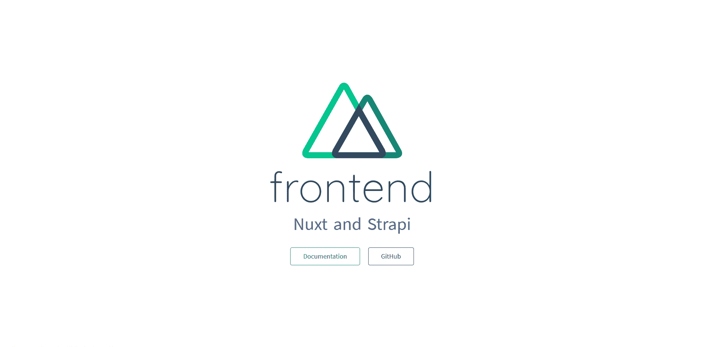
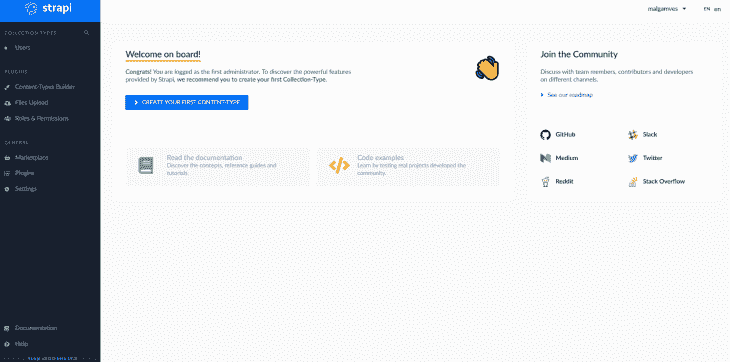
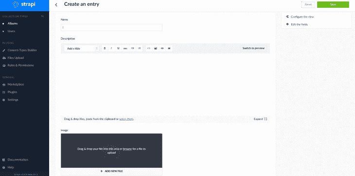
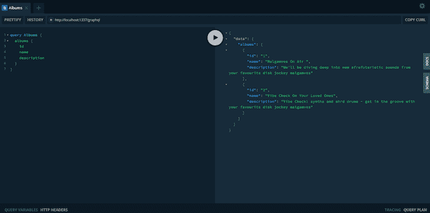
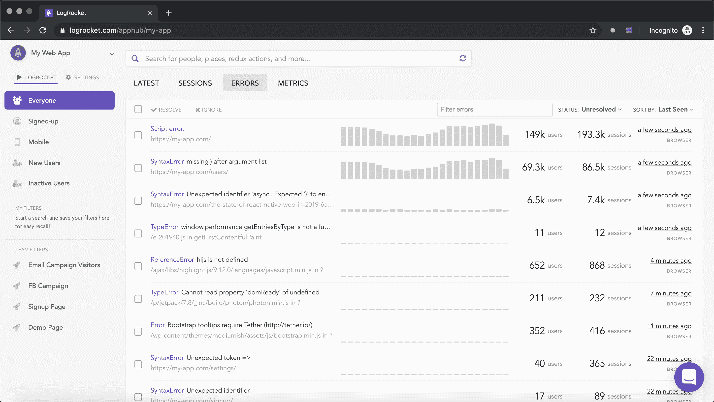

# 使用 Strapi 和 Nuxt 交付内容

> 原文：<https://blog.logrocket.com/delivering-content-with-strapi-and-nuxt/>

无头 CMS 目前风靡一时。它使您能够将后端与前端分离，并具有从单一来源交付内容的额外优势。

人们喜欢灵活前端的想法，偏离了 Joomla 和 Drupal 的标准组合。

在本文中，我们将设置[Strapi](https://strapi.io/)——一个灵活的、开源的、无头的 CMS，您可以将其部署在您自己的服务器上，以及 Nuxt.js，一个强大的基于 Vue.js 的开源 web 应用程序框架，用于构建通用的 web 应用程序。

我们将使用这两个为我的广播节目 [Malgamves On Air](https://www.mixcloud.com/malgamves/) 建立一个登陆页面。

要开始，我们必须安装一个 Vue CLI。

运行`yarn global add @vue/cli`来安装它。

我们首先创建一个名为`nuxt-x-strapi`的新文件夹。

运行`cd nuxt-x-strapi`来改变目录，这样我们可以在其中设置我们的前端和后端。

## 我们的前端

我们使用 Nuxt 作为我们的前端。

运行`yarn create nuxt-app frontend`，创建一个名为`frontend`的新文件夹。

> 名词（noun 的缩写）b:当被问及想用哪个 UI 框架时，选择 **Tailwind UI** 。

进入该文件夹并运行`yarn dev`来启动应用程序。

你会发现它运行在 [http://localhost:3000](http://localhost:3000) 。你会看到通常的 Nuxt 启动页面:



既然我们的前端已经运行，我们需要用 Strapi 作为我们的后端来设置我们的项目。

## 我们的后端

Strapi 是可扩展的，允许我们管理我们所使用的数据库。

我们将使用快速启动标志`--quickstart`，它为我们设置了一个 SQLite 数据库。

回到`nuxt-x-strapi/`并运行下面的命令:`yarn create strapi-app backend --quickstart`。

此时，将创建一个名为 **backend** 的新文件夹。


我们将被重定向到我们的浏览器，在那里我们必须设置我们的 Strapi 管理员凭证。

如果您没有被重定向，也不用担心——您可以在浏览器中打开[http://localhost:1337/admin/auth/register/](http://localhost:1337/admin/auth/register/)。

> 名词（noun 的缩写）b:如果你停止了 Strapi 服务，你可以通过运行`nuxt-x-strapi/backend`中的`yarn develop`再次启动它。

输入您的详细信息后，您将被引导至一个控制面板。在这里，我们将作为管理员开始定义我们的内容类型。



您会注意到我们已经有了一个`User`内容类型:这是默认情况下发生的。

我们需要定义一个内容类型来补充我们正在尝试构建的内容:广播节目集的显示。

当询问名称时，点击**创建第一个内容类型**并键入**专辑**。然后单击保存。

几乎立即，您将被要求添加字段到您的内容类型。依次创建以下字段:

*   对于专辑名称，选择**键入文本**并将其命名为**名称**
*   对于专辑描述，选择**类型** **富文本**并将其命名为**描述**
*   对于相册图像，选择**类型** **媒体**并将其命名为**图像**

之后，保存**字段类型**并保存**相册**内容类型。

然后，您的 Strapi 服务器将重新启动，您应该会在仪表板的左侧菜单中看到作为内容类型的**相册**。

我们已经定义了内容类型，但是还没有任何要显示的内容。

点击左侧菜单中的**相册**，然后右上角的**添加相册**添加一些内容。



为您的相册命名、描述并上传图片。单击 save，您的数据库中就会有一些内容。

在使用这些数据或查询任何端点之前，我们必须设置一些访问控制规则。

您会注意到，转到[http://localhost:1337/albums](http://localhost:1337/albums)会给出一个错误。

### 允许访问

就像我们刚刚看到的，我们还不能接受数据，因为我们还没有设置允许我们这样做的权限。

默认情况下，新 API 在 Strapi 中是安全的，需要指定不同的规则。

我们需要转到左边菜单中**插件**下的**角色和权限**(也可以转到[http://localhost:1337/admin/Plugins/users-Permissions/Roles](http://localhost:1337/admin/plugins/users-permissions/roles))。

点击`authenticated`角色，选中`find`和`findone`复选框，然后保存。

为`public`角色做同样的事情，并保存它。

现在，当你进入[http://localhost:1337/albums](http://localhost:1337/albums)时，你应该能够看到 API 调用的结果。

### 添加图形支持

目前，我们的 API 使用 REST。

但是，Strapi 支持 GraphQL，并且可以通过安装插件来启用。

我们将使用 GraphQL 交付来自 Strapi 的内容，并将其显示在我们的 Nuxt 应用程序中。

关闭你的 Strapi 服务。然后在`project/backend`中，运行`yarn strapi install graphql`。

或者，您可以从 Strapi admin 中的 marketplace 在 Strapi 中安装 GraphQL。

安装完成后，转到[http://localhost:1337/graph QL](http://localhost:1337/graphql)，您将看到您的 GraphQL Playground，您可以在这里测试查询。

它看起来有点像这样:



好吧！我们现在在哪里？

我们已经让我们的 GraphQL Strapi 后端工作，并且我们的数据库中已经有了内容。我们现在需要做的就是将后端连接到前端。

由于我们使用的是 GraphQL，我们需要在我们的 Nuxt 应用程序中安装 [Apollo](https://www.apollographql.com/) 。

在`/nuxt-x-strapi/frontend/`运行`yarn add @nuxtjs/apollo graphql`

安装完 Apollo 后，我们需要将下面的代码添加到我们的`nuxt.config.js`文件中。

现在我们需要创建一个文件来存储我们的 GraphQL 查询。

```
...
modules: [  
  '@nuxtjs/apollo',
],
apollo: {  
  clientConfigs: {
    default: {
      httpEndpoint: 'http://localhost:1337/graphql'
    }
  }
},
...
```

转到`frontend/apollo/queries/album/`，创建文件，并将其命名为`albums.gql`。然后我们将把这个查询粘贴进去。

所有这些都是从我们的后端获取 id、名称、描述和图像 url，这样我们就可以在前端使用它们。

```
query Albums {  
  albums {
    id
    name
    description
    image {
      url
    }
  }
}
```

在`pages/index.vue`中，我们将以下内容粘贴到我们的`<script>`标签中。

在文件的顶部，我们导入我们的查询。

```
​​import albumsQuery from "~/apollo/queries/album/albums";
​​export default {
​​  data() {
​​    return {
​​      albums: [],
​​      query: ""
​​    };
​​  },
​​  apollo: {
​​    albums: {
​​      prefetch: true,
​​      query: albumsQuery
​​    }
​​  },
​​  computed: {
​​    filteredList() {
​​      return this.albums.filter(album => {
​​        return album.name.toLowerCase().includes(this.query.toLowerCase());
​​      });
​​    }
​​  }
​​};
```

我们为 Apollo 准备了一个部分，在这里我们定义了刚刚导入的查询，还有一个部分，我们从查询中过滤结果。

在`pages/index.vue`中，我们将以下内容粘贴到我们的`<template>`标签中:

这里我们使用`v-for`来动态显示 CMS 中的项目。

```
<div>
    <div class="title">
      <h1>Welcome to My Radio Show</h1>
    </div>
    <div class="container">
      <div  v-for="album in filteredList" v-bind:key="album" class="max-w-sm rounded overflow-hidden shadow-lg p-1">
        
        <div class="px-6 py-4">
          <div class="font-bold text-xl mb-2">{{ album.name }}</div>
          <p
            class="text-gray-700 text-base"
          >{{ album.description }}</p>
        </div>
      </div>
    </div>
  </div>
```

我们插入`album.name`和`album.description`，以及我们放在 **src** 指令中的图像。当我们运行应用程序的前端时，我们看到的是:


结论

## 在本教程中，我们运行了一个 Nuxt 应用程序，设置了 Strapi 后端，向 CMS 添加了数据，并启用了 GraphQL API。

现在，我们已经将 Strapi CMS 中的数据显示在 Nuxt 应用程序中。

可以在 [GitHub](https://github.com/malgamves/nuxt-x-strapi) 上查看项目回购。

希望这对你有用。如果你有任何问题，请在推特上打电话给我。

您是否添加了新的 JS 库来提高性能或构建新特性？如果他们反其道而行之呢？

## 毫无疑问，前端变得越来越复杂。当您向应用程序添加新的 JavaScript 库和其他依赖项时，您将需要更多的可见性，以确保您的用户不会遇到未知的问题。

LogRocket 是一个前端应用程序监控解决方案，可以让您回放 JavaScript 错误，就像它们发生在您自己的浏览器中一样，这样您就可以更有效地对错误做出反应。

[LogRocket](https://lp.logrocket.com/blg/javascript-signup) 可以与任何应用程序完美配合，不管是什么框架，并且有插件可以记录来自 Redux、Vuex 和@ngrx/store 的额外上下文。您可以汇总并报告问题发生时应用程序的状态，而不是猜测问题发生的原因。LogRocket 还可以监控应用的性能，报告客户端 CPU 负载、客户端内存使用等指标。

[](https://lp.logrocket.com/blg/javascript-signup)[https://logrocket.com/signup/](https://lp.logrocket.com/blg/javascript-signup)

自信地构建— [开始免费监控](https://lp.logrocket.com/blg/javascript-signup)。

Build confidently — [Start monitoring for free](https://lp.logrocket.com/blg/javascript-signup).