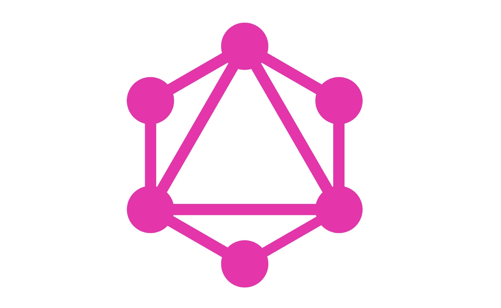
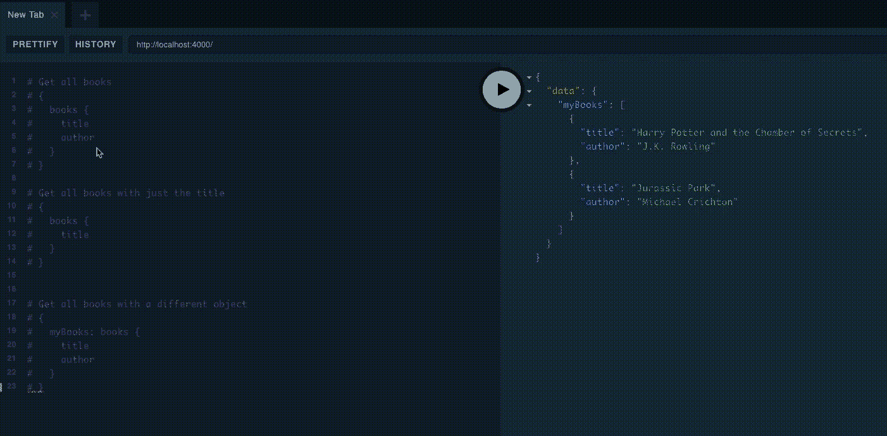
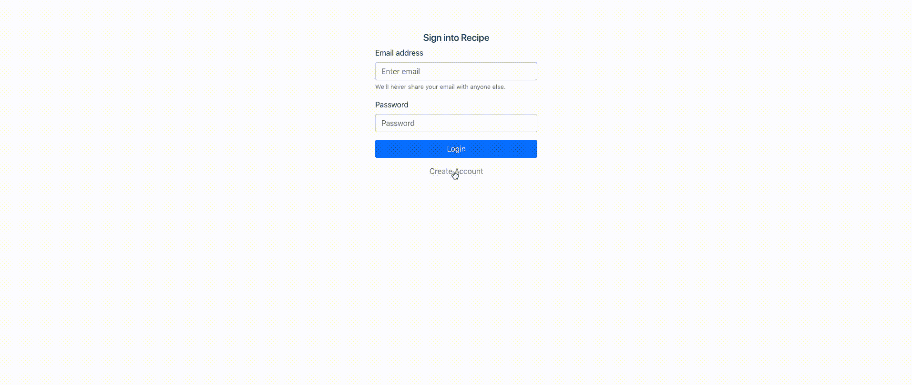
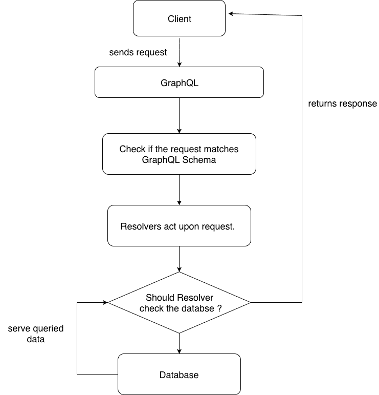

# 在 bits 中演示如何将 GraphQL 与 Node 和 Vue 结合使用

> 原文：<https://blog.logrocket.com/demonstration-on-how-to-use-graphql-with-node-and-vue-in-bits-8981f0d65f94/>



当我在网上冲浪时，我看到了这条微博。前端开发人员似乎厌倦了时不时地请求 API。😄

第一次和 GraphQL 互动，就爱上了它。为什么？GraphQL 为您提供了轻松构建 API 的空间，让您不必重复做同样的事情。怎么会？让我们找出答案。

我假设您对以下内容有基本的了解:

*   JavaScript(JavaScript)
*   Node.js(节点. js)
*   view . js-检视. js

我们来看看`GraphQL`和`REST`的对比。

为了全面了解本文，我希望你克隆这个项目的[库](https://github.com/meshboy/recipe)，它包含了`server`端和`client`端。

在本文中，我们将关注以下几点

*   为什么是 GraphQL
*   GraphQL 的关键组件
*   证明
*   文件上传
*   带 Vue 的 GraphQL

[](https://logrocket.com/signup/)

#### GraphQL 是什么？

GraphQL 是一种查询语言，它有助于将 API 的`door`的密钥交给访问者(`client`)，当然是在你允许的情况下。嗯，如果管理不当，你的访客可能会把事情搞砸。

无论如何，您的应用程序都必须与其他应用程序进行交互。这只能通过公开部分或全部 API 来实现。实现这一点的方法之一是使用 REST 构建您的应用程序。到本文结束时，我们都会明白为什么应该在下一个应用程序中使用 GraphQL。

> GraphQL 是一种 API 查询语言，也是一种用现有数据完成这些查询的运行时语言。GraphQL 为 API 中的数据提供了完整且易于理解的描述，使客户能够准确地要求他们需要的东西，使 API 更容易随时间发展，并支持强大的开发工具。

*REST Vs GraphQL*

*   GraphQL 只有一个`route`而 REST 有多个路由。随着客户端需求的增加，REST 端点也在不断增加。
*   除了 REST 有多个端点之外，它还附带了`HTTP`动词(POST、PUT、GET 等),但是 GraphQL 也涵盖了我们，因为它不需要这些东西。
*   每个 API 都应该有文档，但是 GraphQL 给了我们一个现成的 API 文档。
*   你可以在 GraphQL 中轻松地`resolve`尽可能远的数据，但在 REST 的情况下就不行了。它肯定会有一个新的终点。
*   GraphQL 不会让你担心如何`version`你的 API，因为单个路由不会改变，但是你需要关心的是当更新不断到来时，你应该如何在使用 REST 的同时版本化你的 API。

说教到此为止！

让我们来看一个典型的 GraphQL 文档。随意复制并粘贴[片段](https://www.apollographql.com/docs/apollo-server/getting-started.html)，在您的机器上感受一下。



在这个项目的过程中，我们将使用`Apollo`来探索 GraphQL。Apollo 同时支持 NodeJs 和 VueJs。😃

让我们来看看我们项目的演示是什么样子的，这应该会给你一个未来的想法。也可以设置一下。



Recipe demo

#### GraphQL 的关键组件

#### 我们将重点关注四个主要部分:

类型

*   问题
*   变化
*   下决心者
*   **类型:**在数据库层面上，我们为每个模型都准备了一个`schema`。在这个项目中，我们只有两个模型(配方和用户)。

1.  *数据库级模式*

```
const recipeSchema = new mongoose.Schema({
    name: {
        type: String,
    },
    description: {
        type: String,
    },
    difficultyLevel: {
        type: Number,
    },
    fileUrl: {
        type: String
    },
    steps: [{
        type: String
    }],
    averageTimeForCompletion: {
        type: Number,
    },
userId: {
        type: mongoose.Schema.Types.ObjectId,
        ref: 'User'
    }
}, { timestamps: true });
export const Recipe = mongoose.model('Recipe', recipeSchema);
```

我们还有一个 API 级别的模式，它将符合上面的数据库模式。这个模式也像数据库模式上的验证器一样。具有 GraphQL 无法识别的类型的查询将被退回。

*API 级模式*

```
type Recipe {
  id: ID!
  name: String!
  description: String!
  difficultyLevel: Int!
  image: String!
  steps: [String]!
  averageTimeForCompletion: Int!
  user: User!
}
```

在编写模式时，GraphQL 支持不同的对象`Types`:`Int`，`Float`，`String`，`Boolean`，`ID`，就像 MongoDB 中的 _id 一样。它还支持 List，以防你的数据库模式有一个对象列表和更多的列表。

符号确保对象不返回空值。当你再次确定时，总是使用它，一个值将被返回。如果它似乎被使用，并且值为 null，那么将抛出一个`error`。在上面的代码片段中，我们不希望类型为`ID`的`id`为空。

我们也可以拥有自己的`custom`类型，就像我们拥有`File`类型一样。

**2。查询:**在 REST 中，获取数据的标准方式是使用`GET.`同样的概念也适用于 GraphQL 查询。我们在需要获取数据的地方使用查询。查询在 GraphQL 中只能定义一次。

```
type File {
    id: ID!
    url: String!
}
```

为了更好地理解，每个 GraphQL 组件在项目中都有自己的文件。在 recipe 项目中，关键字`Query`被多次使用。

让我们看看如何编写一个`query`来获取会话中用户的属性。

更多来自 LogRocket 的精彩文章:

* * *

### *查询用户*

* * *

```
type User {
    id: ID!
    email: String!
    name: String!
    token: String
    createdAt: String!
    updatedAt: String!
}
type Query {
    getMe: User!
}
```

既然我们已经在用户资源中声明了`query`，我们还必须在配方资源中声明查询。你应该知道它会抛出一个错误。好吧，我们都准备好了。对于多次使用的关键字查询，需要使用关键字`extend`进行扩展。

为了获取用户食谱，我们需要一个与该食谱相关联的用户 ID。GraphQL 查询也可以接受参数。

*配方*

```
extend type Query {
    Recipe(id: ID!): Recipe!
    Recipes: [Recipe]!
}
```

上面有两个不同的查询。第一个函数使用类型为`ID`的参数`id`获得一个食谱，该参数不能为空，而后者返回系统中的所有食谱。

**3。突变:**一个 API 不仅仅是获取，在某些时候，数据必须被存储、更新或删除以保持我们平台的活力。要执行此操作(`POST`、`PUT`、`DELETE`等)，最好在`mutation`下声明。

*创建一个用户(突变)*

```
type Mutation {
    createUser(email: String!, name: String!, password: String)
}
```

变异本可以写得更好，但我更喜欢使用变量声明风格。是的，你也可以为你的突变声明一个变量。

如果您需要客户机在发送响应之前提供输入，变量将会派上用场。

*用户登录和注册*

```
type Mutation {
  createUser(input: NewUser!): User!
  loginUser(input: LoginUser!): User!
}
```

变量可以有任何形式。只要通过创建或声明您的变量类型来通知 GraphQL，就不会有警报。😉

在上面的变异中，我们有接受类型为`NewUser`的`input`的`loginUser`和`createUser`，后者必须返回类型`User`和类型`LoginUser`，后者也返回类型`User`。我们已经在上面看到了用户的样子。

`input`是变量的一种形式，为声明类型的参数提供服务。

> 登录和注册类型

```
input LoginUser {
  email: String!
  password: String!
}
input NewUser {
  email: String!
  name: String!
  password: String!
}
```

*配方模式*

```
type Recipe {
  id: ID!
  name: String!
  description: String!
  difficultyLevel: Int!
  image: String
  steps: [String]!
  averageTimeForCompletion: Int!
  user: User!
}
input NewRecipe {
  name: String!
  description: String!
  difficultyLevel: Int!
  image: Upload
  steps: [String]! 
  averageTimeForCompletion: Int!
}
input UpdateRecipe {
  id: ID!
  name: String
  description: String
  difficultyLevel: Int!
  image: String
  steps: [String]
  averageTimeForCompletion: Int!
}
input DeleteRecipe {
    id: ID!
}
# query is use when you want to get anything from 
#the server just like (GET) using REST
extend type Query {
    Recipe(id: ID!): Recipe!
    Recipes: [Recipe]!
}
# performing actions (that requires DELETE, PUT, POST) 
#just as in REST requires a mutation 
extend type Mutation {
    deleteRecipe(input: DeleteRecipe!): Recipe!
    updateRecipe(input: UpdateRecipe!): Recipe!
    newRecipe(input: NewRecipe!): Recipe!
}
```

在上面的代码片段中，用户可以根据我们在`Mutation`中的声明决定删除配方、更新配方和创建新配方。

有没有注意到一个没有声明但是使用了`Upload`的类型？但是 GraphQL 似乎对此并不介意。我们将在文件部分讨论这个问题。

**4。** **解析器:**既然我们已经声明了类型、突变和查询。这与客户对我们数据库的要求有什么联系？

让我们来看看这个流程…

所以在 GraphQL 中，我们有标量类型(`Strings`、`Integers`、`Booleans`、`Float`、`Enums`)。如果我们足够幸运地将我们的数据库对象与我们拥有的类型相匹配，GraphQL 将为我们解决这个问题。



An overview of how GraphQL handles data

让我们来处理我们在突变中声明的动作。记住我们在突变中声明的论点是`input`。无论我们期望从客户端得到什么，都可以在变量`input`中找到。

*登录用户*

```
import { User } from './user.model'; 
import { Recipe } from '../recipe/recipe.model'; 
import { signIn, verify } from '../../modules/auth';''
const loginUser = async(root, { input }) => {
    const { email, password } = input;
    const user = await User.findOne({ email }).exec();
    const errorMsg = 'Wrong credentials. Please try again';
    if(!user) {
        throw new Error (errorMsg);
    }
    if(user.comparePassword(password)) {
        user.token = signIn({ id: user._id, email: user.email });
        return user;
    }
    else{
        throw new Error (errorMsg);
    }
};
```

让我们花点时间来看看`Queries`和`Mutations`的论点。以`loginUser`为例。

每个解析器中都有四个主要的自变量(`rootValue`、`arguments`、`context` 和`info`)。

`rootValue`:主要用于处理嵌套解析器(主分支的子分支)。

*   *用户类型*

```
type User {
    id: ID!
    email: String!
    name: String!
    token: String
    recipes: [Recipe]!
    createdAt: String!
    updatedAt: String!
}
```

看上面的类型，在我们的数据库模型中有一个我们没有声明的对象。这意味着 GraphQL 期望我们解决(处理它并赋值)。

`recipes`将被视为嵌套解析器。树枝上方的`rootValue`是`User`。这样做的好处是`fetching recipes`由用户创建。

*嵌套解析器*

```
 User: {
        recipes(user) {
           return Recipe.find({ userId: user.id }).exec()
        }
    }
```

`arguments`:保存从客户端传来的参数。在我们定义的突变中，我们期望客户端传入一个`input`

*   `context`:它保存了所有需要在解析器之间共享的数据。在这个项目中，我们将经过验证的用户传递给上下文
*   这是我们可能永远不会使用的唯一论据。这是原始的 GraphQL 查询
*   对于`loginUser`，用户传递从参数对象中析构的电子邮件和密码，然后返回一个用户，就像我们在变异中声明的那样(user！)如果凭证是正确的，否则我们抛出一个错误。

我们在突变类型(`server/api/resources/user/*user.graphql file*`)中的声明也必须与传递给解析器的声明相同。

*用户解析器*

```
export const userResolvers = {
    Query: {
        getMe
    },
    Mutation: {
        createUser, //createUser: createUser
        loginUser //loginUser: loginUser
    },
    User: {
        recipes(user) {
           return Recipe.find({ userId: user.id }).exec()
        }
    }
}
```

证明

#### 有几种方法可以验证我们的 GraphQL 应用程序，特别是当我们想要公开查询或变异操作时(`loginUser`和`createUser`)。

我们可以通过对公共路由使用 REST 和单独保护单一 GraphQL 路由来保护它。就个人而言，我总是选择这个选项，因为它为您的应用程序提供了灵活性。

在这个项目中，我们在一个`resolver level`上认证了 GraphQL。当用户成功登录时，使用`jwebtokens`生成的令牌被返回给客户端，并被传递给头部。

中间件

```
import { verify } from './api/modules/auth';
const setMiddleware = (app) => {
    app.use(async (req, res, next) => {
        try{
            const token = req.headers.authorization || '';
            const user = await verify(token);
            req.user = user;
        }
        catch(e) {
            console.log(e)
            req.user = null;
        }
        next();
    });
};
export default setMiddleware;
```

#### 中间件交叉检查每个请求中的报头，获取令牌，验证并在成功的情况下给出适当的有效载荷(用户)。中间件然后被传递到 Apollo 服务器。

既然我们使用 express，`apollo-server-express`是我们最好的工具。

*认证*

```
setMiddleware(app);
const path = '/recipe'
graphQLRouter.applyMiddleware({ app, path}); const secret = process.env.TOKEN_SECRET;
const expiresIn = process.env.EXPIRES_IN || '1 day';
export const signIn = payload => jsonwebtoken.sign(payload, secret, { expiresIn });
export const verify = token => {
    return new Promise((resolve, reject) => {
        jsonwebtoken.verify(token, secret, {}, (err, payload) => {
            if(err){
                return reject(err);
            }
            return resolve(payload);
        })
    })
}
export const throwErrorIfUserNotAuthenticated = user => 
        {if(!user) throw new Error('hey!. You are not authenticated')}
```

这是关键，每个球员都走到了一起。GraphQL 标签(`gql`)使得编写和组合模式更加容易。

对于每个解析器，我们检查用户是否为空，一旦为空，客户端就被退回。系统告诉客户端对请求进行身份验证。

```
import { ApolloServer, gql } from 'apollo-server-express';
import merge from 'lodash.merge'
import { userType, userResolvers } from './resources/user';
import { recipeType, recipeResolvers } from './resources/recipe';
import { fileType } from './resources/file';
const typeDefs = gql`${userType}${recipeType}${fileType}`;
export const graphQLRouter = new ApolloServer(
    {
        typeDefs,
        resolvers: merge({}, userResolvers, recipeResolvers),
        context: ({req, res})=> ({ user: req.user })
    }
);
```

检查用户是否有权访问此解析程序

```
const getRecipe = (root, { id }, { user }) => {
    throwErrorIfUserNotAuthenticated(user); 
    return Recipe.findById(id).exec();
}; 
```

文件上传

#### 除了发送简单的数据，我们还会以某种方式上传文件。Apollo server 2.0 ~通过开箱即用处理文件，让生活变得更加轻松。`Upload`graph QL 识别标量。它帮助处理一个可变文件对象。它被添加到`NewRecipe`输入中，以处理请求附带的文件。

创建新配方

```
 const createRecipe = async (root, { input }, { user }) => {
  throwErrorIfUserNotAuthenticated(user);
  //    bring out the image from input for file processing
  const { image, ...recipeObject } = await input;
  let url = "";
  if (image) {
    const result = await uploadFile(image);
    url = result.url;
  }
  const recipe = await Recipe.findOne({ name: input.name.toLowerCase() });
  if (recipe) {
    throw new Error("Recipe already exists!");
  }
  Object.assign(recipeObject, { image: url, userId: user.id });
  return Recipe.create(recipeObject);
};
```

文件流正在被处理，完成后，URL 将与 rest 输入对象一起保存。

让我们看看医生。如果您的端口号是 3000 并且您的 MongoDB 在本地运行，那么可以在[http://localhost:3000/recipe](http://localhost:3000/recipe)上访问它。一旦你能与文档很好地互动，客户端就变得非常容易。

```
import cloudinary from "cloudinary";
import streamToBuffer from "stream-to-buffer";
cloudinary.config({
  cloud_name: process.env.CLOUDINARY_CLOUD_NAME,
  api_key: process.env.CLOUDINARY_API_KEY,
  api_secret: process.env.CLOUDINARY_API_SECRET
});
export const uploadFile = async file => {
  const { mimetype, stream } = await file;
  // process image
  return new Promise((resolve, reject) => {
    if (!Object.is(mimetype, "image/jpeg")) {
      throw new Error("File type not supported");
    }
    streamToBuffer(stream, (err, buffer) => {
      cloudinary.v2.uploader
        .upload_stream({ resource_type: "raw" }, (err, result) => {
          if (err) {
            throw new Error("File not uploaded!");
          }
          return resolve({ url: result.url });
        })
        .end(buffer);
    });
  });
};
```

交给客户

#### 如果你熟悉从 Vue 向服务器发送数据，使用`vue-apollo`没有太大区别。你所需要做的就是写出你的问题。Vue-apollo 为您处理其余的事情。

那么，让我们设置我们的 Vue-apollo:

`setContext` from `apollo-link-context`让我们能够在请求传递到服务器之前拦截它。记住，我们需要将一个令牌传递给头部，以便访问经过身份验证的资源。

```
import Vue from 'vue';
import VueApollo from "vue-apollo";
import apolloUploadClient from "apollo-upload-client"
import { InMemoryCache } from "apollo-cache-inmemory";
import { ApolloClient } from "apollo-client";
import { setContext } from "apollo-link-context";
Vue.use(VueApollo);
const baseUrl = "http://localhost:3000/recipe";
const uploadClientLink = apolloUploadClient.createUploadLink({
  uri: baseUrl
});
const interceptor = setContext((request, previousContext) => {
  const token = localStorage.getItem("token");
  if(token) {
    return {
        headers: {
          authorization: token
        }
      };
  }
});
const apolloClient = new ApolloClient({
  link: interceptor.concat(uploadClientLink),
  cache: new InMemoryCache(),
  connectToDevTools: true
});
const instance = new VueApollo({
  defaultClient: apolloClient
});
export default instance;
view raw
```

每个响应都被缓存。`cache: new InMemoryCache()`，从上面显示的演示中，当一个新的食谱被创建时，我们期望它和其他食谱一起反映在`All recipes` 页面中。但是响应已经被缓存了。它返回从内存中获取的响应。这有利有弊。

`this.$apollo`允许我们访问 Vue apollo，只要它已经添加(`Vue.use(VueApollo)`)到 Vue。

让我们创建查询:

这里的查询结构是我们在服务器端所期望的，查询的响应是基于选择的。

```
import gql from "graphql-tag";
// user object pointing to loginUser to make the return response pretty
export const LOGIN_QUERY = gql`
  mutation LoginUser($input: LoginUser!) {
    user: loginUser(input: $input) {
      token
    }
  }
`;
export const REGISTERATION_QUERY = gql`
  mutation RegisterUser($input: NewUser!) {
    user: createUser(input: $input) {
      token
    }
  }
`;
export const ALL_RECIPES_QUERY = gql`
  query {
    recipeList: Recipes {
      id
      name
      image
    }
  }
`;
export const GET_USER_QUERY = gql`
  query {
    user: getMe {
      name
      email
      recipes {
        id
        name
        image
      }
    }
  }
`;
export const CREATE_RECIPE_QUERY = gql`
  mutation createRecipe($input: NewRecipe!) {
    newRecipe(input: $input) {
      id
    }
  }
`;
```

`GET_USER_QUERY`获取会话中用户的姓名、电子邮件、食谱(id、姓名和图像)。

将`apollo`添加到组件中，以获取与对象相关的特定查询。`getMe`查询被绑定到用户对象。

```
apollo: {
    user: query.GET_USER_QUERY
  }
```

在 my-recipe 页面上，我们不希望响应来自缓存内存。

`refetch`使用相应的(用户)查询从服务器获取最新数据。这应该谨慎使用。

```
this.$apollo.queries.user.refetch();
```

从`apollo`可以访问一些有趣的选项，比如加载状态、错误、暂停查询流等等。

我们如何处理突变？

让我们看看如何创建食谱:

因为我们对单个文件感兴趣，所以 file 对象被绑定到 image ( `part of the object going to the server`)。

`$this.apollo.mutate`接受突变及其变量。因为服务器正在请求输入。一个`input`对象被传递给变量。

```
onFileChange(e) {
      const files = e.target.files || e.dataTransfer.files;
      this.image = files[0];
    }
```

*创建配方*

```
 async createRecipe() {
      const recipeObject = {
        name: this.recipeName,
        description: this.description,
        difficultyLevel: this.difficultyLevel
          ? parseInt(this.difficultyLevel)
          : 0,
        image: this.image,
        steps: this.stepsList,
        averageTimeForCompletion: this.averageTime
          ? parseInt(this.averageTime)
          : 0
      };
      await this.$apollo
        .mutate({
          mutation: query.CREATE_RECIPE_QUERY,
          variables: { input: recipeObject }
        })
        .then(({ data }) => {
            this.$router.push({ name: "my-recipes" });
        })
        .catch(err => {
          console.log(err);
          this.error =
            parseGraphqlError(err) || "Something went wrong. Try again...";
        });
    }
```

结论

#### 就像我前面说的，相比我们习惯的(REST)，GraphQL 更容易设置、更新和重构。

如果您的模式设计得不好，您的客户端可以对您的模式进行递归调用。避免会给出相同结果的查询。关于 GraphQL with Apollo 的更多信息，请点击[这里](https://www.apollographql.com/docs/)。如果你想了解更多关于 Vue Apollo 的信息，请点击这里的。

像用户一样体验您的 Vue 应用

## 调试 Vue.js 应用程序可能会很困难，尤其是当用户会话期间有几十个(如果不是几百个)突变时。如果您对监视和跟踪生产中所有用户的 Vue 突变感兴趣，

.

[try LogRocket](https://lp.logrocket.com/blg/vue-signup)

LogRocket 就像是网络和移动应用程序的 DVR，记录你的 Vue 应用程序中发生的一切，包括网络请求、JavaScript 错误、性能问题等等。您可以汇总并报告问题发生时应用程序的状态，而不是猜测问题发生的原因。

[](https://lp.logrocket.com/blg/vue-signup)[https://logrocket.com/signup/](https://lp.logrocket.com/blg/vue-signup)

LogRocket Vuex 插件将 Vuex 突变记录到 LogRocket 控制台，为您提供导致错误的环境，以及出现问题时应用程序的状态。

现代化您调试 Vue 应用的方式- [开始免费监控](https://lp.logrocket.com/blg/vue-signup)。

Modernize how you debug your Vue apps - [Start monitoring for free](https://lp.logrocket.com/blg/vue-signup).