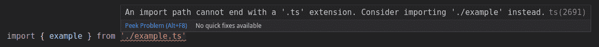
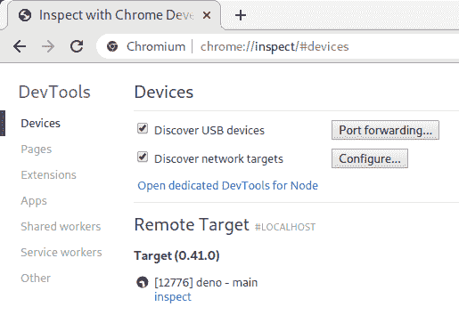

# Deno 1.0:你需要知道的

> 原文：<https://blog.logrocket.com/deno-1-0-what-you-need-to-know/>

将近两年后，等待即将结束。API 已经冻结，正式定于 5 月 13 日发布的 Deno 1.0 倒计时已经开始。

由于其著名的创作者和前瞻性的视野，Deno 肯定会成为近年来最令人兴奋和最有争议的 JavaScript 相关版本。

Deno 是一个通用的 JavaScript/TypeScript 编程环境。它汇集了许多最好的开源技术，并在一个小的可执行文件中提供了一个全面的解决方案。

Deno 由 Ryan Dahl 创建，他以 Node.js 的幕后策划者而闻名，Deno 利用了自 Node.js 于 2009 年发布以来一直可用的 JavaScript 特性。它还解决了 Ryan 在他的“[关于 Node.js](https://www.youtube.com/watch?v=M3BM9TB-8yA) 我后悔的 10 件事”讲座中谈到的设计缺陷。有些人称之为 Node.js 的续集，尽管作者本人并没有这样说。

与用 C++编写的 Node.js 不同，Deno 是用 Rust 编写的。它建立在 [Tokio](https://tokio.rs/) 平台之上，像 Node.js 一样，使用 V8 引擎执行 JavaScript。一个突出的特点是内置了 TypeScript。虽然它仍然需要编译成 JavaScript 才能运行，但它是在内部完成的，因此 TypeScript 对用户的行为就好像它是本机支持的一样。

## 入门指南

要下载 Deno，请遵循[主页](https://deno.land/)上的说明。要更新到未来版本，请使用`deno upgrade`。

要获得任何 Deno 子命令的帮助，请使用以下命令之一。

*   `deno [subcommand] -h`进行总结
*   `deno [subcommand] --help`了解全部详情

在本指南中，我们将涵盖 Deno 1.0 必须提供的所有杀手级特性，并提供如何使用最新语法的示例。我将尽可能使用 TypeScript，但是 JavaScript 的等价物应该是显而易见的。

我相信当我们结束的时候你会爱上 Deno 的。这本指南应该给你入门所需的一切。

## 安全性

Deno 在默认情况下是安全的。相比之下，Node.js 可以完全访问您的文件系统和网络。

要运行没有权限的程序，请使用:

```
deno run file-needing-to-run-a-subprocess.ts

```

如果代码需要权限设置，您会收到警告。

```
error: Uncaught PermissionDenied: access to run a subprocess, run again with the --allow-run flag

```

Deno 使用命令行选项显式地允许访问系统的不同部分。最常用的包括:

*   环境访问
*   网络存取
*   文件系统读/写访问
*   运行子流程

要查看带有示例的完整权限列表，请键入`deno run -h`。

对`read`、`write`和`net`使用许可白名单是一个最佳实践。这些允许你更具体的知道 Deno 可以访问什么。例如，要允许 Deno 读取`/etc`目录中的只读文件，请使用:

```
deno --allow-read=/etc

```

### 使用权限的快捷方式

您可能很快就会厌倦每次运行应用程序时都显式启用权限。要解决这个问题，您可以采用以下任何一种方法。

#### 1.允许所有权限

您可以使用`--allow-all`或其快捷方式`-A`启用所有权限。不建议这样做，因为它会消除拥有特定权限的安全优势。

#### 2.制作 bash 脚本

使用运行程序所需的最小权限创建一个 bash 脚本。

```
#!/bin/bash

// Allow running subprocesses and file system write access
deno run --allow-run --allow-write mod.ts

```

这里的缺点是，对于运行、测试和捆绑之类的事情，您可能需要一些这样的工具。

#### 3.使用任务执行程序

您可以使用 GNU 工具`make`用一组 Deno 命令创建一个文件，并完成权限。你也可以使用 Deno 特有的版本， [Drake](https://deno.land/x/drake/) 。

#### 4.安装可执行的 Deno 程序

使用`deno install`到[安装一个 Deno 程序](https://deno.land/manual/tools/script_installer#script-installer)，完成它需要执行的所有权限。安装后，您可以从`$PATH`的任何地方访问该程序。

## 标准图书馆

[Deno 标准库](https://deno.land/std/)是由 Deno 项目维护的常用模块的集合，保证与 Deno 一起工作。它涵盖了用户执行常见任务时最常需要的代码，并大致基于 Go 编程语言提供的标准库。

JavaScript 一直受到缺乏标准库的困扰。用户被迫一次又一次地重新发明轮子，开发人员必须经常在 npm 中搜索第三方模块，以解决平台的制造者应该提供的常见问题。

由 React 这样的库解决复杂问题的第三方包是一件好事，但是对于简单的东西，如 [UUID](https://en.wikipedia.org/wiki/Universally_unique_identifier) 代，使用官方标准库要好得多。这些小的库可以作为更大的库的构建模块，使得开发更快，更少焦虑。有多少次一个曾经流行的库被放弃了，让用户自己去维护它或者找一个新的？事实上，10%到 20%的常用 OSS 软件包[没有被积极维护](https://blog.tidelift.com/up-to-20-percent-of-your-application-dependencies-may-be-unmaintained)。

### 可用模块及其 npm 等价物

| Deno 模块 | 描述 | npm 当量 |
| --- | --- | --- |
| [颜色](https://deno.land/std/fmt/colors.ts) | 为终端添加颜色 | 粉笔、颜料和颜色 |
| [datetime](https://deno.land/std/datetime/README.md) | 帮助使用 JavaScript `Date`对象 |  |
| [编码](https://deno.land/std/encoding/README.md) | 增加了对外部数据结构的支持，如 base32、binary、csv、toml 和 yaml |  |
| [标志](https://deno.land/std/flags/README.md) | 帮助使用命令行参数 | 迷你小姐 |
| [fs](https://deno.land/std/fs/README.md) | 帮助操作文件系统 |  |
| [http](https://deno.land/std/http/README.md) | 允许通过 HTTP 提供本地文件 | http-服务器 |
| [日志](https://deno.land/std/log/README.md) | 用于创建日志 | 温斯顿 |
| [测试](https://deno.land/std/testing/README.md) | 对于单元测试断言和基准测试 | 恰依茶 |
| [uuid](https://deno.land/std/uuid/README.md) | UUID 一代 | uuid |
| [ws](https://deno.land/std/ws/README.md) | 帮助创建 WebSocket 客户端/服务器 | 《华盛顿明星报》 |

## Typescript 内置于 Deno 中


TypeScript is JavaScript but with added explicit types. Any valid JavaScript is also valid TypeScript, so converting your code to TypeScript is painless. Just change the extension to `.ts` and start adding the types.

要在 Deno 中使用 TypeScript，您不需要做任何事情。没有 Deno，TypeScript 必须编译成 JavaScript 才能运行。Deno 在内部为您完成了这项工作，使得 TypeScript 更容易被采用。

### 使用您自己的`tsconfig.json`

对于那些熟悉 TypeScript 的人来说，您将习惯于使用一个`tsconfig.json`文件来提供编译器选项。当您使用 Deno 时，这是可选的，因为它已经有了自己的默认配置。如果用自己的`tsconfig.json`和 Deno 冲突，会报警。

该功能需要`-c`选项和您的`tsconfig.json`。

```
deno run -c tsconfig.json [file-to-run.ts]

```

如果你像大多数开发人员一样，你会欣喜若狂地得知 Deno 默认使用`strict`模式。除非某个恶棍覆盖了它，否则 Deno 会正当地提醒用户尽可能多的草率编码实践。

## Deno 尽可能使用网络标准


It takes a long time to create a web standard, and once it’s set in stone, it’s unwise to ignore it. While frameworks come and go, web standards will remain. Time spent invested in learning a standardized API is never wasted because nobody dares break the web; it could well be in use for decades, maybe even the rest of your career.

web API 提供了一个获取资源的接口。浏览器中提供了一个 JavaScript `fetch()`方法。如果你想在 Node.js 中使用这个标准，你需要到达第三方库[节点获取](https://github.com/node-fetch/node-fetch)。在 Deno 中，它是内置的，就像浏览器版本一样，开箱即用。

Deno 1.0 提供了以下 web 兼容的 API。

*   `addEventListener`
*   `atob`
*   `btoa`
*   `clearInterval`
*   `clearTimeout`
*   `dispatchEvent`
*   `fetch`
*   `queueMicrotask`
*   `removeEventListener`
*   `setInterval`
*   `setTimeout`
*   `AbortSignal`
*   `Blob`
*   `File`
*   `FormData`
*   `Headers`
*   `ReadableStream`
*   `Request`
*   `Response`
*   `URL`
*   `URLSearchParams`
*   `console`
*   `isConsoleInstance`
*   `location`
*   `onload`
*   `onunload`
*   `self`
*   `window`
*   `AbortController`
*   `CustomEvent`
*   `DOMException`
*   `ErrorEvent`
*   `Event`
*   `EventTarget`
*   `MessageEvent`
*   `TextDecoder`
*   `TextEncoder`
*   `Worker`
*   `ImportMeta`
*   `Location`

这些都可以在程序的顶级作用域中找到。这意味着如果你避免在`Deno()`名称空间上使用任何方法，你的代码应该同时兼容 Deno 和浏览器。虽然并非所有这些 Deno APIs 都 100%符合它们的等效 web 规范，但这对前端开发人员来说仍然是一个巨大的好处。

## ECMAScript 模块

Node.js 中 Deno 的主要突破性变化之一是 Deno 使用官方的 ECMAScript 模块标准，而不是遗留的 CommonJS。Node.js 直到 2019 年底才在 13.2.0 版本中启用 ECMAScript 模块，但即使在那时，支持也是半生不熟的，它仍然包括有争议的`.mjs`文件扩展名。

Deno 通过为其模块系统使用现代网络标准，打破了过去的束缚。使用 URL 或文件路径引用该模块，并且该模块包含一个强制文件扩展名。例如:

```
import * as log from "https://deno.land/std/log/mod.ts";
import { outputToConsole } from "./view.ts";

```

### 使用文件扩展名的问题是

Deno 期望模块有文件扩展名，但 TypeScript 没有。



在任何地方使用文件扩展名都是合乎逻辑的，似乎是显而易见的方法。不幸的是，实际上事情要比这复杂得多。现在，您可以使用 [Visual Studio 代码扩展](https://github.com/denoland/vscode_deno)来解决仅 Deno 项目的这个问题。

对于 TypeScript 的创建者来说，这个问题似乎是有争议的。在我们最终摆脱共性之前，我看不到一个快速简单的解决方案。

让我们花点时间向睿智而古老的编程之神祈祷。让他们推翻这些传统格式，惩罚那些坚持这些格式、损害我们所有人的人。

## 包装管理


There has been a radical rethink regarding the way package management works in Deno. Rather than relying on a central repository, it is decentralized. Anyone can host a package just like anyone can host any type of file on the web.

使用像 npm 这样的集中式存储库有优点也有缺点，Deno 的这一方面肯定是最有争议的。

### Deno 的新包管理是如何工作的

它如此彻底地简化，可能会让你震惊。

```
import { assertEquals } from "https://deno.land/std/testing/asserts.ts";

```

我们来分解一下变化。

*   不再有集中的包管理器。您可以直接从 web 导入 ECMAScript 模块
*   不再有“神奇”的 Node.js 模块解析。现在，语法是显式的，这使得事情更容易推理
*   没有更多的`node_modules`目录。相反，依赖项被下载并隐藏在你的硬盘上，看不见。如果您想刷新缓存并再次下载它们，只需在您的命令中添加`--reload`

如果你想下载依赖项和项目代码，而不是使用全局缓存，使用`$DENO_DIR` env 变量。

### 查找兼容的第三方库

有一个[用户区](https://deno.land/x/)用于 Deno 兼容的第三方模块，但在编写时导航非常基础。例如，没有按流行度或下载次数进行搜索的功能。我预测用户区域将会扩大，或者为贡献的模块创建其他替代站点。

尽管没有对 Node.js 向后兼容性的官方支持，但仍然有许多可用的库和应用程序可以很好地与 Deno 一起工作。有些是开箱即用的，而有些则需要一点努力才能工作。

### 安装第三方模块

Deno 还很新，周围的生态系统还在形成中。在写这篇文章的时候，我推荐 [Pika](https://www.pika.dev/cdn) 作为开始寻找兼容模块的第一个地方，在标准库和用户库之后。NPM 上的任何可用包也应该在 Pika CDN 上，并且已经自动转换为与`import`一起工作。

Pika 背后的开发人员与 Deno 合作，通过名为 [X-TypeScript-Types](https://dev.to/pika/introducing-pika-cdn-deno-p8b) 的 ECMAScript 模块提供类型脚本类型。你可以通过简单地使用他们的 CDN 平台来利用这一点。

### 超越`Package.Json`

JavaScript 生态系统的大部分仍然围绕着使用`package.json`。它已经扩大到包括许多职责，例如:

*   保存关于项目的元数据
*   使用版本控制列出项目依赖关系
*   将依赖关系分类为`dependencies`或`devDependencies`
*   定义程序的入口点
*   存储与项目相关的 shell 脚本
*   定义一个类型类别，最近引入来改进 ECMAScript 模块支持

```
{
  "name": "Project Name", // metadata
  "version": "1.0.0", // metadata
  "description": "My application", // metadata
  "type": "module", // module functionality
  "main": "src/mod.ts", // module functionality
  "scripts": {
    "build": "npm run _copy-build-files && rollup -c",
    "build-watch": "npm run _copy-build-files && rollup -cw"
  }, // scripting functionality
  "license": "gpl-3.0", // metadata
  "devDependencies": {
    "@rollup/plugin-typescript": "^3.1.1",
    "rollup": "^1.32.1",
    "typescript": "^3.8.3"
  }, // versioning and categorizing functionality
  "dependencies": {
    "tplant": "^2.3.3"
  } // versioning and categorizing functionality
}

```

随着时间的推移，所有这些实践走到了一起，现在代表了 JavaScript 生态系统工作的标准方式。很容易忘记这不是一个官方标准；它只是在这些功能成为必需品时才被想象出来的。现在 JavaScript 已经赶上来了，是时候进行一次重大的反思了。

Deno 还不能取代`package.json`的所有功能，但目前有一些解决方案。

### 使用`deps.ts`和 URL 进行版本控制

包版本控制有一个 Deno 约定，那就是使用一个叫做`deps.ts`的特殊文件。在内部，依赖项被重新导出。这允许应用程序中的不同模块都引用同一个源。

不是告诉 npm 下载哪个版本的模块，而是在`deps.ts`中的 URL 中引用。

```
export { assert } from "https://deno.land/[email protected]/testing/asserts.ts";
export { green, bold } from "https://deno.land/[email protected]/fmt/colors.ts";

```

如果您想更新任何模块，您可以更改`deps.ts`中的 URL。比如把`@v0.39.0`换成`@v0.41.0`，新版本就到处用了。如果您将`[https://deno.land/[email protected]/fmt/colors.ts](https://deno.land/std@v0.39.0/fmt/colors.ts)`直接导入到每个模块中，您将不得不费力地浏览整个应用程序并更改每个引用。

假设您之前下载的模块不会在之后被篡改，这将是一个安全风险。这就是为什么还有一个创建[锁文件](https://deno.land/std/manual.md#lock-file)的选项。这将确保新下载的模块与您最初下载的模块相同。

JSDoc 发布于 21 年前的 1999 年。这是目前最常用和受支持的 JavaScript 和 TypeScript 文档化方法。虽然不是官方的 web 标准，但它是您的`package.json`中所有元数据的完美替代品。

```
/**
 * @file Manages the configuration settings for the widget
 * @author Lucio Fulci
 * @copyright 2020 Intervision
 * @license gpl-3.0
 * @version 1.0
 *

```

Deno 支持 JSDoc 开箱即用，并将其用于其内置的文档系统。虽然它目前不使用上面的元数据，但是命令`deno doc`读取函数的描述及其参数的描述。

```
/**
 * Returns a value of (true?) if the rule is to be included
 *
 * @param key Current key name of rule being checked
 * @param val Current value of rule being checked
 **/

```

你可以使用`deno doc <filename>`来查看你程序的文档。

```
deno doc mod.ts

function rulesToRemove(key: string, val: any[]): boolean
  Returns a value of if the rule is to be included

```

当您的程序在线托管时，使用[在线文档查看器](https://doc.deno.land/)查看更多细节。


这是对前端开发人员影响最大的领域。JavaScript 工具的现状是混乱不堪。当您添加 TypeScript 工具时，复杂性会进一步增加。

JavaScript 最好的一点是它不需要编译，所以可以直接在浏览器中运行。这使得立即获得关于你的编码的反馈变得非常容易。进入门槛很低；编写软件只需要一个文本编辑器和一个浏览器。

不幸的是，这种简单性和可访问性被过度工具化的狂热所破坏。它将 JavaScript 开发变成了一场复杂的噩梦。我甚至看到了一整门专门介绍 Webpack 配置的课程。这种无聊的事情需要结束了——人生苦短。

工具的混乱已经发展到许多开发人员不顾一切地回去实际编写代码，而不是摆弄配置文件，为他们应该采用多个竞争标准中的哪一个而苦恼。一个解决这个问题的新兴项目是脸书的罗马。在撰写本文时，这还处于起步阶段。虽然它可能证明是有益的，但 Deno 有可能成为一个更实际的解决方案。

Deno 本身就是一个完整的生态系统，包括运行时和它自己的模块/包管理系统。这给了它更大的空间来内置所有自己的工具。让我们看看 1.0 中有哪些工具，以及如何使用它来减少对第三方库的依赖并简化开发。

现在还不可能替换 Deno 中的整个前端构建管道，但是用不了多久，你就可以做到了。

### 测试

使用`Deno.test()`函数将测试运行器内置到 Deno 的内核中。标准库中提供了[断言库](https://deno.land/std/testing/)。所有你喜欢的，比如`assertEquals()`和`assertStrictEq()`，都包括在内，还有一些不太常见的断言，比如`assertThrowsAsync()`。

在撰写本文时，还没有测试覆盖特性，需要使用第三方工具如 [Denon](https://deno.land/x/denon/) 来设置观察模式。

要查看所有测试运行器选项，请使用`deno test --help`。虽然它们非常有限，但有许多功能你可能对像 Mocha 这样的程序很熟悉。例如，`--failfast`将在遇到第一个错误时停止，而`--filter`可以用来过滤要运行的测试。

#### 使用测试转轮

最基本的语法是`deno test`。这将运行工作目录中所有以`_test`或`.test`结尾，扩展名为`.js`、`.ts`、`.jsx`或`.tsx`(如`example_test.ts`)的文件

```
import { assertEquals } from "https://deno.land/std/testing/asserts.ts";

Deno.test({
  name: "testing example",
  fn(): void {
    assertEquals("world", "world");
    assertEquals({ hello: "world" }, { hello: "world" });
  },
});

```

如果您的代码使用 DOM，您将需要为自己的`tsconfig.json`提供`lib: ["dom", "esnext"]`。我们将在下面详细讨论。

## 测试只是开始。试试 [LogRocket](https://logrocket.com/signup/) ，这是一款针对生产应用的主动监控解决方案

[](https://logrocket.com/signup/)

LogRocket 是一个前端应用程序监控解决方案，可以让您回放问题，就像问题发生在您自己的浏览器中一样。LogRocket 不需要猜测错误发生的原因，也不需要向用户询问截图和日志转储，而是让您重放会话以快速了解哪里出错了。它可以与任何应用程序完美配合，不管是什么框架，并且有插件可以记录来自 Redux、Vuex 和@ngrx/store 的额外上下文。

除了记录 Redux 操作和状态，LogRocket 还记录控制台日志、JavaScript 错误、堆栈跟踪、带有头+正文的网络请求/响应、浏览器元数据和自定义日志。它还使用 DOM 来记录页面上的 HTML 和 CSS，甚至为最复杂的单页面应用程序重新创建像素级完美视频。

[免费试用](https://logrocket.com/signup/)。

### 格式化

格式化是由 [dprint](https://github.com/dsherret/dprint) 提供的，它是 beauty 的一个非常快的替代品，可以复制所有已建立的 beauty 2.0 规则。

要格式化一个或多个文件，可以使用`deno fmt <files>`或 [Visual Studio 代码](https://marketplace.visualstudio.com/items?itemName=axetroy.vscode-deno)扩展(稍后会详细介绍)。

### 编译和捆绑

Deno 可以使用`deno bundle`从命令行创建一个简单的包，但它也公开了一个[内部编译器 API](https://deno.land/std/manual.md#compiler-api) ，因此用户可以创建自己的输出，这是可以为前端使用定制的东西。这个 API 目前被标记为不稳定，所以您需要使用`--unstable`标志。

虽然 Deno 有一些 web 兼容的 API，但它们并不完整。如果您想编译任何引用 DOM 的前端 TypeScript，您需要在编译或捆绑时告诉 Deno 这些类型。可以使用编译器 API 选项`lib`。

```
index.html
<!DOCTYPE html>
<html lang="en">
  <head>
    <meta charset="UTF-8" />
    <meta name="viewport" content="width=device-width, initial-scale=1.0" />
    <title>Document</title>
  </head>
  <body>
    <h1 id="greeter">Replace me</h1>
  </body>
</html>
test-dom.ts
let greeter: HTMLElement | null = document.getElementById("greeter")!; // Please forgive the Non-Null Assertion Operator

greeter.innerText = "Hello world!";
compile.ts
const [errors, emitted] = await Deno.compile("test-dom.ts", undefined, {
  lib: ["dom", "esnext"], // include "deno.ns" for deno namespace
  outDir: "dist",
});

if (errors) {
  console.log("There was an error:");
  console.error(errors);
} else {
  console.log(emitted); // normally we would write the file
}

```

下面是终端中生成的发射贴图输出。

```
{
 dist/test-dom.js.map: "{"version":3,"file":"test-dom.js","sourceRoot":"","sources":["file:///home/david/Downloads/deno-arti...",
 dist/test-dom.js: ""use strict";nlet greeter = document.getElementById("greeter");ngreeter.innerText = "Hello world!";n..."
}

```

在上面的例子中，我们编译了引用 DOM 的`test-dom.ts`文件。使用`Deno.compile()`中的`lib`选项会覆盖 Deno 使用的任何`lib`默认选项，因此您需要添加回`esnext`，并且可选地添加`deno.ns`来使用 Deno 名称空间。

这还只是一个实验，但是我希望`bundle`命令能够进化到处理像树摇晃这样的事情，并且表现得更像`Rollup.js`。

### 排除故障

Deno 有内置调试，但在编写本文时，Visual Studio 代码扩展不支持它。要进行调试，请手动使用以下代码。

*   `deno run -A --inspect-brk fileToDebug.ts`(注意:对您的模块使用最小权限)
*   在铬合金或铬合金中打开`chrome://inspect`。你会看到一个类似于下面的屏幕
    
*   单击“检查”连接并开始调试您的代码

### 文件观看

Deno 通过`Deno.watchFs()` API 使用 Rust [notify](https://github.com/notify-rs/notify) 库内置了文件监控。Deno 喜欢用它的 API 在幕后提供繁重的工作，让用户以他们喜欢的方式实现他们的代码。您需要创建自己的实现或使用第三方模块，而不是提供一个`--watch`标志。

制作你自己的文件监视器的唯一重要的方面是去抖动。API 可以快速连续地触发多个事件，您可能不希望多次运行您的操作。用户 Caesar2011 使用`Date.now()`解决了 [23 行打字稿](https://github.com/Caesar2011/rhinoder/blob/master/mod.ts)中的问题。

还有一个更高级的 Deno 文件观看解决方案叫做 [Denon](https://deno.land/x/denon/) 。相当于`nodemon`。如果您想观察您的工作区的变化并重新运行您的测试，这很简单:

```
denon test

```

## Visual Studio 代码插件

目前最好的扩展是 axetroy 的，可以从 [Visual Studio 市场](https://marketplace.visualstudio.com/items?itemName=axetroy.vscode-deno)获得。安装后，在您的项目文件夹中创建一个文件`.vscode/settings.json`,并基于每个项目启用扩展。

```
// .vscode/settings.json
{
  "deno.enable": true,
}

```

现在，您将可以获得完整的智能感知支持以及编码所需的一切。

## 结论

JavaScript 生态系统的快速变化被证明是一件喜忧参半的事情。从积极的一面来看，从未有过如此高质量的工具可用。消极的一面是，对于不断涌现的新框架和库，人们普遍感到愤世嫉俗和厌倦。

Deno 成功地消除了 JavaScript 开发中的许多缺点。下面只是几个。

*   通过使用网络标准，Deno 的 API 经得起未来的考验。这给了开发人员信心，他们不会浪费时间去学习那些很快就会过时的东西
*   除了 JavaScript 之外还有 TypeScript 消除了编译的负担，并允许更紧密的集成
*   内置工具意味着没有必要浪费时间去寻找现成的东西
*   分散的包管理将用户从 npm 中解放出来，与使用陈旧的 CommonJS 相比，ECMAScript 模块带来了新鲜空气

虽然 Deno 可能还不能完全取代 Node.js，但它已经是一个非常棒的日常编程环境。