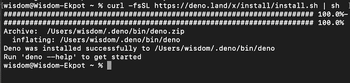

# Deno 的标准库:4 个核心模块

> 原文：<https://blog.logrocket.com/denos-standard-library-4-core-modules/>

Deno 提供了许多很酷的特性，其中包括一组标准模块，旨在使开发人员的生活更加轻松。这些模块主要受 Go 和 Python 等现有语言的启发，是 Deno 认可的，没有任何外部依赖性。

## Deno 的标准库里面有什么？

[Deno 的标准库](https://deno.land/manual/standard_library)的意图是提供一个全面的高质量代码集合，所有 Deno 项目都可以无缝使用。

在本教程中，我们将探索四个核心标准库，它们可以帮助您将 Deno 应用提升到一个新的水平:

1.  [`http`](#http) ，用于设置 HTTP 服务器
2.  [`hash`](#hash) ，一个用于 Deno 的加密库
3.  [`fs`](#fs) ，德诺的文件管理系统
4.  [`uuid`](#uuid) ，用于生成唯一标识

## 安装 Deno

在开始之前，让我们快速浏览一下如何在您的本地机器上安装 Deno。

### Windows 操作系统

要在我们的 windows 计算机上安装 Deno，请打开终端并运行以下命令:

```
iwr https://deno.land/x/install/install.ps1 -useb | iex

```

如果您的计算机上安装了 Chocolatey，您还可以运行:

```
choco install deno

```

### 苹果个人计算机

您可以通过运行以下命令，使用 Homebrew 在 Mac 计算机上安装 Deno:

```
brew install deno

```

您也可以使用`curl`安装 Deno:

```
curl -fsSL https://deno.land/x/install/install.sh | sh

```

如果 Deno 安装正确，运行上述命令将生成以下输出。



安装后，运行以下命令以确认 Deno 是否正确安装在您的本地计算机上。

```
deno run https://deno.land/std/examples/welcome.ts

```

这个非常简单的 Deno 命令将在终端上打印出`Welcome to Deno 🦕`。

现在我们已经安装了 Deno，让我们放大 Deno 标准库中最流行和最有用的四个模块。

## 1.`http`

这个库提供了一种设置服务器的简单方法。

首先，将`server`实例引入应用程序。然后，使用服务器实例连接到一个`PORT`。

```
import { serve } from "https://deno.land/std/http/server.ts";
const s = serve({ port: 8000 });
for await (const req of s) {
  req.respond({ body: "Hi,I'm Wisdom Ekpot" });
}
```

要启动服务器，请运行:

```
deno run --allow-net http.ts
```

由于 Deno 的安全性，您需要通过`--allow-net`标志。

在 Deno 中还有其他[方法连接到服务器，比如使用 Abc，这使您能够使用 app 方法的单个实例创建链路由。](https://medium.com/@tomanagle/5-ways-to-build-a-http-server-with-deno-3169389118aa)

要使用 Abc 创建服务器，请将其添加到您的`http.ts`文件中:

```
import { Application } from "https://deno.land/x/[email protected]/mod.ts";
const app = new Application();
const PORT = 8000;
let homepage = () => {
  return "This is the home page";
};
let contactPage = () => {
  return "You can contact Wisdom Ekpot with this contact Page";
};
app
  .get("/", homepage)
  .get("/contact", contactPage)
  .start({ port: PORT });
console.log(`🔤 Abc server running at http://localhost:${PORT}`);

```

现在，您可以为您的应用程序创建不同的路线。

在撰写本文时，`[https://deno.land/x/[email protected]/mod.ts](https://deno.land/x/abc@v1.1.0/mod.ts)`是 Abc 的最新版本。请务必查看[官方文件](https://deno.land/x/abc@v1.2.0/README.md)获取最新版本。

## 2.`hash`

就像 [Node.js](https://blog.logrocket.com/building-a-password-hasher-in-node-js/) 一样，Deno 自带哈希库。当您想要实现诸如密码或消息散列之类的事情时,`hash`模块就派上了用场。

要使用这个模块，您需要导入`createHash`的实例，然后创建一个变量来存储这个实例。此实例采用一种算法类型:

```
import { createHash } from "https://deno.land/std/hash/mod.ts";
const hash = createHash("md5");
hash.update("All You need to know about deno");
const final = hash.digest();
console.log(final);

```

要运行该应用程序，请运行`deno run <name of file>`。这段代码将以一种 [ArrayBuffer](https://developer.mozilla.org/en-US/docs/Web/JavaScript/Reference/Global_Objects/ArrayBuffer) 格式*记录散列数据。*

您可以将`createHash`实例中的散列算法作为参数传递。

## 3.`fs`

Deno 自带文件系统管理器。使用`fs`模块，你可以写、读、复制和执行任何你想要的文件操作。

### 读取文件内容

您可以使用`Deno.open()`方法在 Deno 中读取文件的内容。这个方法接受一个参数，它是您想要读取的文件的名称(路径)。

创建一个`file.txt`文件并在那里存储一些虚拟内容。我们将从该文件中读取内容:

```
const file = await Deno.open("file.txt");
const decoder = new TextDecoder("utf-8");
const text = decoder.decode(await Deno.readAll(file));
console.log(text);

```

`Deno.open()`方法返回一个承诺。这段代码创建了一个解码器实例，它将数据解码成人类可读的格式，`readAll`方法返回存储在`file.txt`文件中的文本。

要启动该应用程序，请运行:

```
deno run --allow-read
```

没有传递`--allow-read`标志，Deno 不会让你读取文件。

### 写入文件

您可以使用`Deno.writeTextFile()`方法将文本写入文件。这个方法接受两个参数:要写入的文件的路径和要写入的内容。

```
const file_path = "file.txt";
const data = "This is the new content in my filex";
await Deno.writeTextFile(file_path, data);
// Read the file data 
console.log(await Deno.readTextFile(file_path));

```

如果变量中存储的`define`路径不存在，Deno 将自动创建一个文件。

要运行这个程序，您需要传递两个标志——`--allow-write`和`--allow-read`——因为您正在写入和读取文件，以查看内容是否实际发生了更改。您可以在`writeTextFile`方法中添加另一个参数，将数据追加到文件中:

```
await Deno.writeTextFile(file_path, data, {"append": true});

```

您还可以做其他事情，例如将文件数据从一个文件复制到另一个文件。您需要从`fs`模块导入复制实例:

```
import { copy } from "https://deno.land/std/fs/mod.ts";
copy("file.txt", "new.txt"); // void

```

要运行代码，首先运行`deno run --allow-write --allow-read --unstable fs.ts`来创建一个`new.txt`文件并存储内容。要将文件复制到现有文件中，您需要传递一个参数`{ overwrite: true }`来覆盖该文件的现有内容。

```
import { copy } from "https://deno.land/std/fs/mod.ts";
copy("file.txt", "test.txt", {
  overwrite: true,
});

```

## 4.`UUID`

Deno 也有自己的通用唯一标识符。您可以使用这个库来生成和验证惟一的 id。

* * *

### 更多来自 LogRocket 的精彩文章:

* * *

```
import { v4 } from "https://deno.land/std/uuid/mod.ts";
const generatedID = v4.generate();
const isValid = v4.validate(generatedID);
console.log(isValid);
```

这个方法将在控制台上记录`true`,因为它是一个有效的 UUID。如果您硬编码它，它将在控制台上返回`false`。

## 结论

Deno 附带了许多很酷的标准库和第三方模块，增强了开发人员的体验。您可以使用这些模块在 Deno 应用程序中编写复杂的逻辑，比如散列密码和在数据库中生成 id。

你最希望在你的下一个项目中使用哪些 Deno 标准库模块？

## 使用 [LogRocket](https://lp.logrocket.com/blg/signup) 消除传统错误报告的干扰

[](https://lp.logrocket.com/blg/signup)

[LogRocket](https://lp.logrocket.com/blg/signup) 是一个数字体验分析解决方案，它可以保护您免受数百个假阳性错误警报的影响，只针对几个真正重要的项目。LogRocket 会告诉您应用程序中实际影响用户的最具影响力的 bug 和 UX 问题。

然后，使用具有深层技术遥测的会话重放来确切地查看用户看到了什么以及是什么导致了问题，就像你在他们身后看一样。

LogRocket 自动聚合客户端错误、JS 异常、前端性能指标和用户交互。然后 LogRocket 使用机器学习来告诉你哪些问题正在影响大多数用户，并提供你需要修复它的上下文。

关注重要的 bug—[今天就试试 LogRocket】。](https://lp.logrocket.com/blg/signup-issue-free)