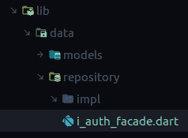

# 使用 GetIt 和 injectible-log rocket Blog 在 Flutter 中进行依赖注入

> 原文：<https://blog.logrocket.com/dependency-injection-flutter-using-getit-injectable/>

## 为什么要使用依赖注入？

今天构建现代应用程序不仅仅是简单地知道要写什么或者你有哪些工具，也不仅仅是理解你想要构建什么。你必须考虑维护问题，比如你的代码可读性如何，修复一个 bug 或者增加一个新特性需要多少努力，或者从项目库更新的突破性改变中更新项目。考虑到这些问题，这并不像简单地写下来并完成它那么简单。还有更多。

例如，当编写一个 [Flutter](https://blog.logrocket.com/whats-new-in-flutter-2-5/) 应用程序时，你经常需要一个依赖于另一个类的函数或方法的类。解决这个问题的方法是简单地在那个类中创建一个新的实例，然后就可以开始了。

当您需要对依赖于多个其他类的特定类或函数运行测试时，问题就出现了。依赖注入试图解决这个问题。

依赖注入只是使一个类独立于它自己的依赖的一种方式。它允许您以更易维护的方式分离应用程序的不同部分，因为每个类都可以调用它需要的任何依赖项。这创建了一个松散耦合的应用程序，有助于运行和编写测试，并使错误修复和功能改进更容易和更快。

### 依赖注入的优点

*   维护。维护您的代码将变得更简单，因为您的类将是松散耦合的，这意味着它们相互之间的依赖性更小。代码重用减少了样板代码的数量
*   改进的单元测试。当编写测试时，您可能需要为您的应用程序正在使用的接口传递存储库实现，这意味着您必须经历传递存储库要求的每个点的配置和端点的整个过程。依赖注入解决了这个问题，它不仅为您注入配置，还允许根据您所处的环境更改配置。

```
void loginBloc() {
  // Allows us to access authFacade implementation for login bloc by passing the interface they share
  final authFacade = locator<IAuthFacade>();
  group("LoginBlog test", () {
    blocTest<LoginFormBloc, LoginFormState>('emits LoginFormInitial',
      build: () => LoginFormBloc(authFacade),
      expect: () => LoginFormInitial());
  });
}

```

*   协作。团队现在能够更好地处理一个类中的特性，因为这些类共享一个公共接口。因此，工作完成得更快

### 依赖注入的缺点

尽管依赖注射能带来很多额外福利，但其中某些部分可能不会让所有人都笑:

*   很多代码。当涉及到添加配置时，Injectable 为我们生成了大量代码，但是当你看到只为认证而编写的代码时，它是非常多的
*   复杂。理解这些类如何相互协作变得有点困难，尤其是对新开发人员来说
*   努力。大量的代码需要编写，一点点的复杂性增加了完成一项任务的工作量

在本文中，我将构建一个示例应用程序，并解释如何使用 [GetIt](https://pub.dev/packages/get_it) 和[injectible](https://pub.dev/packages/injectable)在您自己的 Flutter 项目中实现依赖注入。以下是我们将要介绍的内容:

## 为什么使用 GetIt 和 Injectable？

GetIt 是一个服务定位器，允许您创建接口及其实现，并在您的应用程序中的任何位置全局访问这些实现。Injectable 生成代码，否则我们会使用注释来编写代码。这让我们更担心逻辑，而不是如何访问它。

## 构建一个示例 Flutter 应用程序

为了更好地理解如何在 Flutter 应用程序中使用依赖注入，我们将使用 Firebase 和 Bloc 制作一个简单的笔记应用程序。我们将学习如何进行网络调用，以及如何将重复的功能分成可以在任何地方访问的服务。

在这个项目中，我不会向您展示如何安装 Firebase 或连接它，因为这超出了本主题的范围。要学习如何安装带有 Flutter 的 [Firebase，你可以在这里](https://blog.logrocket.com/add-firebase-to-your-flutter-app-with-flutterfire-plugins/)访问文档[。](https://firebase.flutter.dev/docs/overview)

## 入门指南

我们将使用 Android Studio(或者命令行，如果您喜欢的话)创建一个新项目。

对于 Android Studio，您可以使用它提供的 GUI 来创建一个新项目，或者使用以下命令:

```
flutter create name_of_your_app

```

命令完成后，使用您首选的 IDE(Visual Studio 代码或 Android Studio)打开它。

将以下依赖项添加到您的`pubspec.yaml`文件中:

```
dependencies:
  flutter:
  sdk: flutter
  // Our service locator
  get_it: ^7.2.0
  // For state management
  bloc: ^8.0.1
  // Allows value based equality for our classes e.g Eat() == Eat() is true
  equatable: ^2.0.3
  // Generates code for us by providing annotations we can use
  injectable: ^1.5.0
  // Allows converting json to dart class and back 
  json_annotation: ^4.4.0
  // Allows easier routing
  auto_route: ^3.2.0
  // Required to work with firebase. 
  firebase_core: ^1.11.0

dev_dependencies:
  flutter_test:
    sdk: flutter
  # add the generator to your dev_dependencies
  injectable_generator:
  # add build runner if not already added
  build_runner:

```

将作为我们的服务定位器。Injectable 将和`injectable_generator`一起使用，为我们生成代码。我们将通过在我们想要的类上使用注释来给它特定的指令，它将处理其余的事情。

最后，`build_runner`允许我们使用命令行生成文件。从命令行运行`flutter pub get`来获取所有依赖项。

该过程需要一个全局文件来提供您将使用的资源。在您的`lib`文件夹中创建一个文件，将其命名为`injection.dart`，并添加以下代码:

```
import 'package:get_it/get_it.dart';
import 'package:injectable/injectable.dart';

final getIt = GetIt.instance;

@InjectableInit()
void configureDependencies() => $initGetIt(getIt);

```

这将为`get_it`处理一个新文件的生成。要生成该文件，请运行以下命令:

```
flutter pub run build_runner build --delete-conflicting-outputs

```

这段代码生成一个名为`injection.config.dart`的新文件，它将包含所有用例的所有依赖关系。

然后我们可以将`configureDependencies()`添加到主函数中。这允许首先运行服务，以防在应用程序运行之前需要解决任何生成的令牌或异步函数:

```
void main() {
  configureDependencies();
  runApp(MyApp());
} 

```

我们的应用程序现在已经设置好了，我们可以继续学习更多有趣的功能。

## 构建示例应用程序的关键特性

在我们开始允许用户登录和注册之前，我们需要创建某些关键功能。我们将从 Firebase、我们的接口、实现和状态管理开始，然后以我们的 UI 结束。这个流程要好得多，因为它将解释如何在现实世界的项目中构建一个类似的应用程序。

首先，要在 Flutter 应用程序中使用 Firebase，您需要首先调用一个异步函数，如下所示:

```
await Firebase.initializeApp()

```

该功能可以本地进行必要的调用，并使用添加到 Android 和 iOS 文件夹中的配置文件将应用程序连接到云服务。在小部件重新构建之前，需要在 main 函数中调用这个函数。我们可以使用 GetIt 这样做，因为有一个`configureDependencies()`函数可以用来进行异步调用。

接下来，我们将创建一个新的服务文件夹，并在其中创建一个应用程序模块，我们可以在其中注册所有服务(在本例中，我们的 Firebase 服务)。我们将添加服务并创建一个等待初始化完成的静态函数。完成后，我们将返回类实例:

```
class FirebaseService {
  static Future<FirebaseService> init() async {
    await Firebase.initializeApp();
    return FirebaseService();
  }
}

```

然后，在我们的应用程序模块中，我们将使用`preResolve`注释添加它，这意味着我们将需要应用程序在继续其余操作之前初始化该函数:

```
@module
abstract class AppModule {
  @preResolve
  Future<FirebaseService> get fireService => FirebaseService.init();
}

```

模块注释用于将类标记为模块。运行 generator 命令后，我们在`injectable.config.dart`中获得了以下生成的代码:

```
Future<_i1.GetIt> $initGetIt(_i1.GetIt get,
    {String? environment, _i2.EnvironmentFilter? environmentFilter}) async {
  final gh = _i2.GetItHelper(get, environment, environmentFilter);
  final appModule = _$AppModule();
  await gh.factoryAsync<_i3.FirebaseService>(() => appModule.fireService,
      preResolve: true);
  return get;
}

```

因为它返回一个 future，所以我们需要给`configureDependencies`加一个`async` / `await`，否则代码永远不会通过这个阶段。

在`injection.dart`类中，我们将进行以下更改:

```
final locator = GetIt.instance;

@InjectableInit()
Future<void> configureDependencies() async => await $initGetIt(locator);

```

现在让我们添加一个返回类型`Future`，然后添加`async`/`await``initGetIt`函数。之后，我们将在`main.dart`文件中进行另一次更新，并调用 await 函数，如下所示:

```
void main() async {
  WidgetsFlutterBinding.ensureInitialized();
  await configureDependencies();
  runApp(Dependo());
}

```

当我们运行应用程序时，一切都正常运行。


## 证明

为了允许使用电子邮件和密码进行认证，我们需要添加 [Firebase 认证](https://blog.logrocket.com/implementing-firebase-authentication-in-a-flutter-app/)。将以下包添加到`pubspec.yaml`:

```
firebase_auth: ^3.3.5

```

现在运行`flutter pub get`并重启以确保一切正常。一旦它看起来不错，我们将需要添加一个身份验证接口。使用接口很重要，因为它允许您模拟测试，而不影响您的主实现，主实现可以访问您的 API。

为了在 Flutter 中创建一个接口，我们使用了关键字 abstract。但是首先，在`lib`文件夹下添加一个`data`文件夹，然后添加另一个名为`repository`的文件夹。然后，添加一个`i_auth_facade.dart`文件。
你的结构应该如下图所示:



将以下函数添加到最后一个文件中:

```
abstract class IAuthFacade {
  Future<void> signIn({required String email, required String password,});
  Future<void> register({required String username, required String email, required String password});
  Future<User?> getUser();
  Future<void> logOut();
}

```

在`impl`文件夹下创建一个名为`auth_facade.dart`的新文件。这将有助于增加上述功能的实现。

我们将实现`IAuthFacade`类，并通过使用 Injectable 作为接口来注释该类，从而将它提供给我们的服务定位器 GetIt。这意味着我们可以在任何地方使用该接口，Injectable 将使用这里创建的实现(当我们到达登录和注册块时，我将进一步解释):

```
@Injectable(as: IAuthFacade)
class AuthFacade implements IAuthFacade {
  @override
  Future<User?> getUser() {
    // TODO: implement getUser
    throw UnimplementedError();
  }

  @override
  Future<void> register({required String username, required String email, required String password}) {
    // TODO: implement register
    throw UnimplementedError();
  }

  @override
  Future<void> signIn({required String email, required String password}) {
    // TODO: implement signIn
    throw UnimplementedError();
  }
}

```

在我们向类添加功能之前，我们需要创建我们的`User`类，如下所示:

```
@JsonSerializable()
class User extends Equatable {
  String id;
  final String email;
  final String username;

  User({required this.id, required this.email, required this.username});

  @override
  List<Object?> get props => [this.id, this.email, this.username];

  factory User.fromJson(Map<String, dynamic> json) => _$UserFromJson(json);

  Map<String, dynamic> toJson() => _$UserToJson(this);
}

```

函数`fromDocument`将允许我们将存储在 Firebase 的云 Firestore 中的用户文档转换为我们的`User`类。

要使用云 Firestore，请将以下内容添加到您的`pubspec.yaml`文件中:

```
cloud_firestore: ^3.1.6

```

从终端运行`flutter pub get`，并使用我们的`app.module`使其可访问:

```
@module
abstract class AppModule {
  // ....
  @injectable
  FirebaseFirestore get store => FirebaseFirestore.instance;

  @injectable
  FirebaseAuth get auth => FirebaseAuth.instance;
}

```

现在我们可以为我们的`Facade`提供如下服务:

```
@Injectable(as: IAuthFacade)
class AuthFacade implements IAuthFacade {
  final FirebaseAuth _firebaseAuth;
  final FirebaseFirestore _firebaseFirestore;

  AuthFacade(this._firebaseAuth, this._firebaseFirestore);

  // ...Implementation..
  }

```

GetIt 将检查我们的`AuthFacade`需要的类型并提供它们。这很好，因为我们不必实例化来自`Facade`类的服务。

生成的代码将如下所示:

```
Future<_i1.GetIt> $initGetIt(_i1.GetIt get,
    {String? environment, _i2.EnvironmentFilter? environmentFilter}) async {
  final gh = _i2.GetItHelper(get, environment, environmentFilter);
  final appModule = _$AppModule();
  // The services are provided here
  gh.factory<_i3.FirebaseAuth>(() => appModule.auth);
  gh.factory<_i4.FirebaseFirestore>(() => appModule.store);

  await gh.factoryAsync<_i5.FirebaseService>(() => appModule.fireService,
      preResolve: true);

  // GetIt supplies the instances here
  gh.factory<_i6.IAuthFacade>(() =>
      _i7.AuthFacade(get<_i3.FirebaseAuth>(), get<_i4.FirebaseFirestore>()));
  return get;
}

```

重新运行应用程序以确保一切正常。

我们现在可以提供`IAuthFacade`的实现了:

```
@Injectable(as: IAuthFacade)
class AuthFacade implements IAuthFacade {
  final FirebaseAuth _firebaseAuth;
  final FirebaseFirestore _firebaseFirestore;

  AuthFacade(this._firebaseAuth, this._firebaseFirestore);

  @override
  Future<u.User?> getUser() async {
    try {
      final uid = _firebaseAuth.currentUser!.uid;
      final currentUser = await _firebaseFirestore.doc("users/$uid").snapshots().first;
      return currentUser.toUser();
    } on FirebaseAuthException catch(e) {
      print("We failed ${e.message}");
    }
  }

  @override
  Future<void> register({required String username, required String email, required String password}) {
      return _firebaseAuth.createUserWithEmailAndPassword(email: email, password: password)
          .then((value) async {
            return _firebaseFirestore.doc("users/${value.user!.uid}")
        .set({"email": email, "username": username});
      });
  }

  @override
  Future<void> signIn({required String email, required String password}) {
    return _firebaseAuth.signInWithEmailAndPassword(email: email, password: password);
  }

  @override
  Future<void> logOut() => _firebaseAuth.signOut();
}

// Simple extension to convert firestore document snapshots to our class
extension DocumentSnapX on DocumentSnapshot<Map<String, dynamic>> {
  u.User toUser() {
    return u.User.fromJson(this.data()!)
        ..id = this.id;
  }
}

```

我们需要 Firestore 在`IAuthFacade`中允许我们从云 Firestore 访问登录的用户。我们无法通过 Firebase 身份验证访问当前的用户 ID，因此要添加类似于`username`的属性，您需要使用`signIn`，然后使用登录的用户 ID 在 Cloud Firestore 中创建新文档。

以这种方式设置所有内容，使得使用 bloc 中的存储库更加容易。例如:

```
@injectable
class LoginFormBloc extends Bloc<LoginFormEvent, LoginFormState> {
  final IAuthFacade authFacade;

  LoginFormBloc(this.authFacade) : super(LoginFormInitial()) {
      // Update login state according to events
      on<LoginButtonPressed>((event, emit) async {
      final currentState = state as LoginFormState;
        final data = authFacade.signIn(currentState.email, currentState.password);
      })
    }
  }

```

## 结论

谈到依赖注入，GetIt 和 Injectable 是完美的组合。当谈到可读和易于维护的代码时，您需要知道正确的工具。为了感受我们构建的应用程序，您可以使用这个[链接](https://github.com/BrianMwas/dependo.git)在 GitHub 中找到资源库。

## 使用 [LogRocket](https://lp.logrocket.com/blg/signup) 消除传统错误报告的干扰

[](https://lp.logrocket.com/blg/signup)

[LogRocket](https://lp.logrocket.com/blg/signup) 是一个数字体验分析解决方案，它可以保护您免受数百个假阳性错误警报的影响，只针对几个真正重要的项目。LogRocket 会告诉您应用程序中实际影响用户的最具影响力的 bug 和 UX 问题。

然后，使用具有深层技术遥测的会话重放来确切地查看用户看到了什么以及是什么导致了问题，就像你在他们身后看一样。

LogRocket 自动聚合客户端错误、JS 异常、前端性能指标和用户交互。然后 LogRocket 使用机器学习来告诉你哪些问题正在影响大多数用户，并提供你需要修复它的上下文。

关注重要的 bug—[今天就试试 LogRocket】。](https://lp.logrocket.com/blg/signup-issue-free)