# 将 Angular 9+应用程序部署到 Firebase 主机

> 原文：<https://blog.logrocket.com/deploy-angular-9-apps-to-firebase-hosting/>

Firebase 是一个应用程序开发平台。它提供托管、数据库、文件存储、分析和认证等服务。Firebase Hosting 是该平台的主要产品之一，在内容交付网络上托管用户的网络资产。借助 Firebase Hosting，您可以部署各种项目，从移动应用程序页面、单页应用程序、静态站点、渐进式 web 应用程序到微服务和 API。

一旦 Angular 应用程序编译完成，只需几个步骤就可以将其部署到 Firebase 上。一个网站需要部署一个[谷歌云平台](https://support.google.com/firebase/answer/6399760)项目。这些项目使用 Firebase 服务，被称为 Firebase 项目。这些项目是在 Firebase 控制台上创建的，但可以在 GCP 和谷歌 API 控制台上访问。在部署时，会自动为站点分配两个空闲子域，分别位于`firebaseapp.com`和`web.app`域中。但是，如果您愿意，可以为部署的站点自定义一个唯一的域。此外，还为每个站点提供了免费的 SSL 证书。

使用 Firebase Hosting，您可以在一个项目中部署多个站点。当您希望站点共享 Firebase 资源和服务(如认证、存储、API、数据库等)时，这尤其有用。例如，一个面向客户的站点可以与一个项目下的管理站点共享同一个数据库。使用这种方法，站点可以共享资源，同时在不同的域上运行具有不同部署配置的不同应用程序。但是，对于不同的工作流环境，如生产、试运行、开发等，不建议使用这种设置。因为它可能会篡改生产资源，如数据库。

Firebase 云功能允许用户在 Firebase 上部署 [Angular Universal apps](https://angular.io/guide/universal) 。Cloud Functions 是一个运行后端代码的无服务器框架。它们由 HTTP 请求和其他 Firebase 特性等事件触发。您不必设置、管理和扩展服务器。当将 Angular Universal apps 部署到 Firebase 时，云功能将执行服务器端渲染，而不需要额外的开发或配置。

在本文中，我们将介绍如何使用单个项目将 Angular 应用程序部署到 Firebase。接下来，我们将介绍如何将多个 Angular 应用程序部署到一个项目中。此外，我们将了解如何使用云功能部署 Angular Universal 应用程序。最后，我们将概述如何回滚它们。

## 先决条件

你需要一个 Firebase 帐户来部署任何应用程序。Firebase 要求您在登录时使用 Google 帐户。如果您还没有帐户，您可以[在这里](https://firebase.google.com/_d/signin)创建一个。Firebase 为[提供了一个免费的 Spark 计划](https://firebase.google.com/pricing)，你可以利用它来部署应用程序。在这个计划下，你可以托管高达 10GB 的文件，每月免费调用 125，000 次云函数。

您还需要安装[角度控制器](https://cli.angular.io/)。我们将要探索的部署方法依赖于 [@angular/fire](https://github.com/angular/angularfire) 库。我们将结合 Angular CLI 使用它进行构建、本地预览和部署。如果您没有 Angular CLI，可以通过运行以下命令进行安装:

```
npm install -g @angular/cli
```

最后，您需要安装 [Firebase CLI](https://github.com/firebase/firebase-tools) 工具。我们将使用它来验证和访问您的 Firebase 帐户，并创建项目和部署目标。要安装它，请运行:

```
npm install -g firebase-tools
```

## 使用 Firebase CLI 登录并创建一个项目

要进行部署，您首先需要将 CLI 工具登录到您的 Firebase 帐户。运行:

```
firebase login
```

`firebase login`命令可能会要求收集 CLI 使用和错误报告信息。请随便回答。该命令会将你重定向到一个浏览器，在那里你会被要求选择一个谷歌帐户登录。接下来，将提示您授权 Firebase CLI 访问您的 Google 帐户，并执行一些与您的 Firebase 帐户相关的任务。如果您允许，您应该会看到“Firebase CLI 登录成功”对话框，如下面的屏幕截图所示。

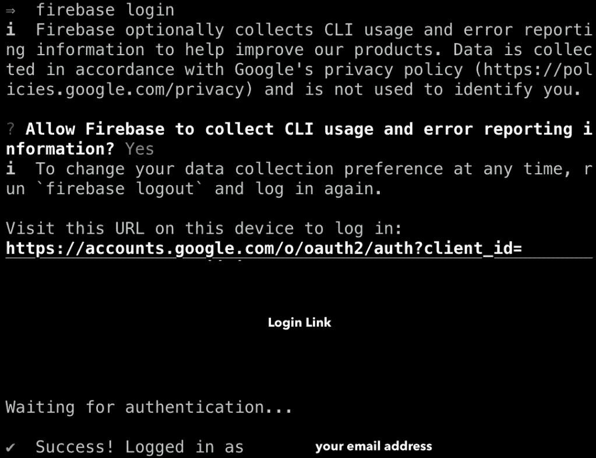

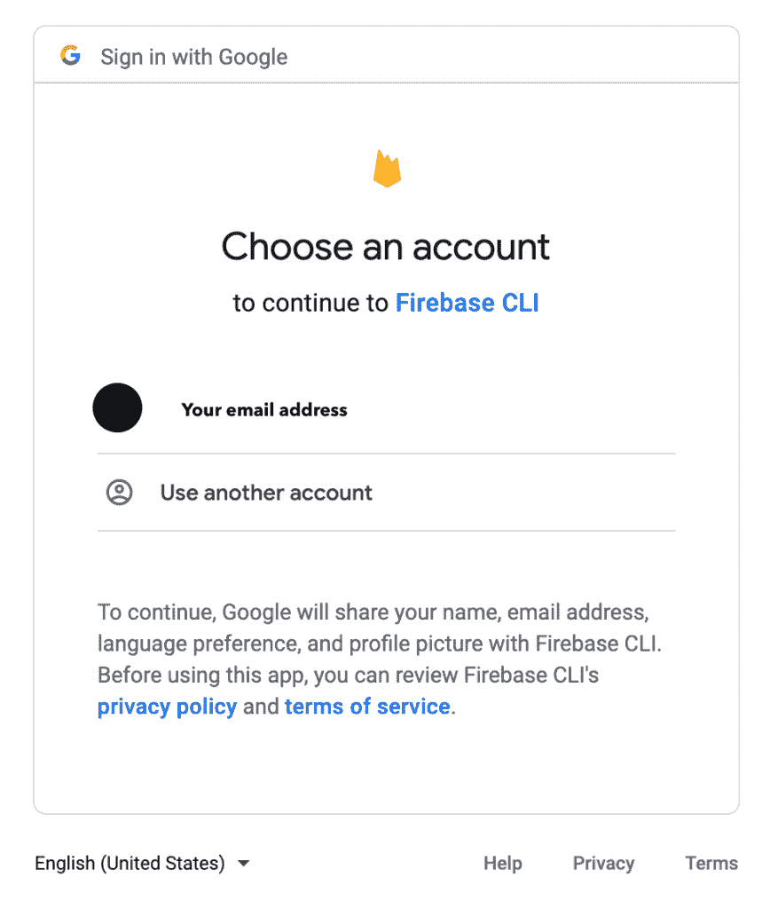

Prompt to pick a Google Account when logging in

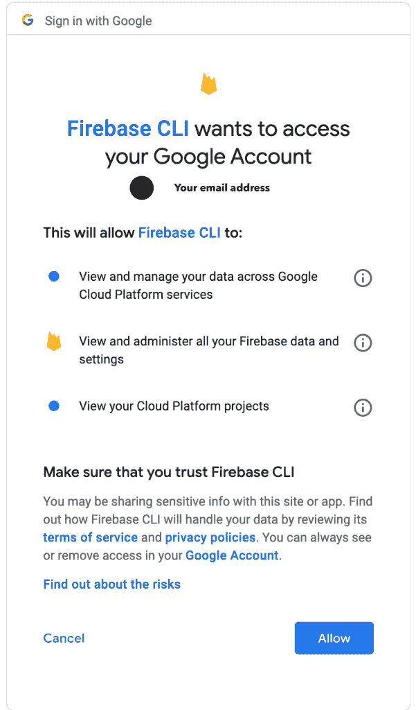

Prompt to give Firebase CLI authorization to use your Google Account

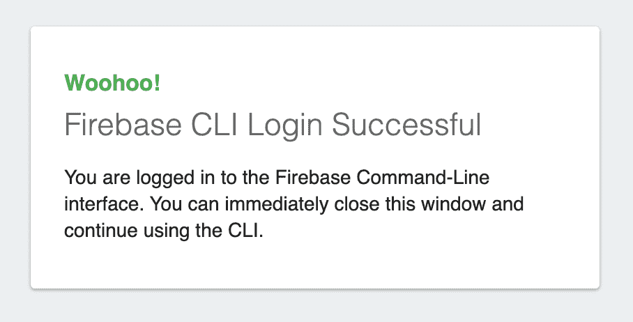

Success dialog is shown when you’ve successfully completed the login

接下来，您需要创建一个 Firebase 项目来部署 Angular 应用程序。您可以通过运行以下命令来实现:

```
firebase projects:create -n <YOUR_PROJECT_DISPLAY_NAME>
```

传递带有项目显示名称的`-n`标志。系统将提示您输入唯一的项目 ID。在 Firebase 上创建的所有项目中，这个 ID 应该是唯一的。如果它不是唯一的，项目创建将会失败。如果成功，你会得到一个“你的项目准备好了！”像这样:

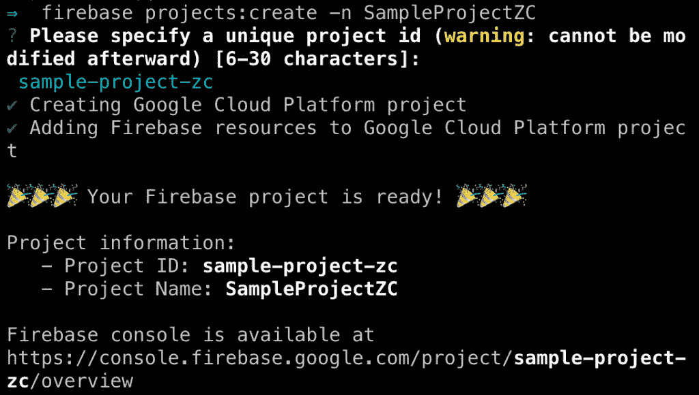

Firebase command to create a project

您可以通过运行此命令来检查您的项目是否已成功创建。它将列出您有权访问的所有 Firebase 项目:

```
firebase projects:list
```

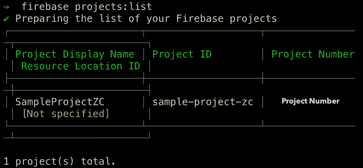

Firebase command to list all projects user has access to

默认情况下，使用`firebase projects:create`命令创建的项目不链接云日志记录。你可以在[Firebase 控制台](https://console.firebase.google.com/)的项目设置>集成下将这类项目链接到云日志。

## 将单个 Angular 应用程序部署到项目中

首先，如果你还没有安装的话，把 [Angular Firebase 库](https://github.com/angular/angularfire)添加到你的应用程序中。在应用程序的根目录中，运行:

```
ng add @angular/fire
```

一旦安装了必要的依赖项，就会提示您选择一个与 Angular 应用程序相关联的 Firebase 项目。选择上面创建的项目。

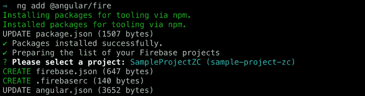

Add @angular/fire library and pick a default Firebase project.

完成这个步骤会创建两个文件，一个`.firebaserc`和一个`firebase.json`。所有的托管和项目配置都存储在`firebase.json`文件中。`.firebaserc`文件指定了默认项目。这个文件被`firebase use`命令用来在项目间快速切换。此外，更新了`angular.json`文件的 architect 工具配置部分。它将包含一个将`@angular/fire:deploy`指定为构建者的`deploy`目标。最后，更新`package.json`和`package-lock.json`以反映最新添加的依赖项。

为了预览编译后的应用程序部署后的样子，用`--prod`和`--watch`标志构建它。`--prod`标志指定构建配置应该用于生产目标。`--watch`标志表示当您对应用程序的文件进行更改时，该应用程序需要重建:

```
ng build --prod --watch
```

要使用该应用程序，请运行以下命令，然后前往`[http://localhost:5000](http://localhost:5000)`查看:

```
firebase serve
```

要部署应用程序，请运行:

```
ng deploy
```

该命令将应用程序构建到`dist/`，然后部署结果输出文件。该应用程序被部署到`.web.app`和`.firebaseapp.com`子域。

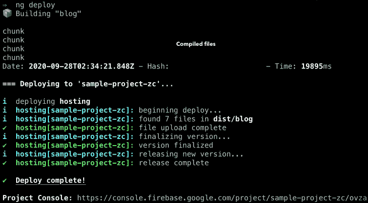

## 将多个应用部署到单个项目

要将多个应用程序部署到一个项目中，您需要创建一个对应于每个应用程序的 Firebase 站点。前往 [Firebase 控制台](https://console.firebase.google.com/)上项目概述的托管设置。比方说，我们正试图在一个项目上部署一个作品集和一个博客。我们将创建两个站点。一个带有子域`blog-zc.web.app`，另一个带有`portfolio-zc.web.app`。


“Add another site” button

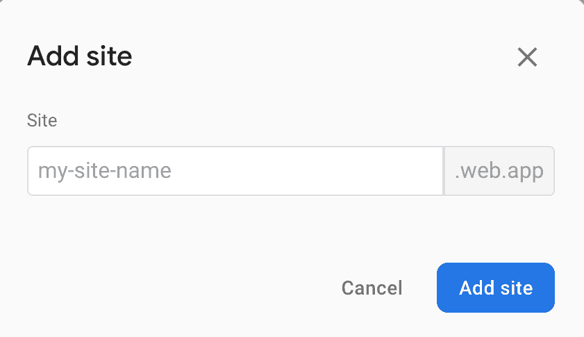

“Add site” dialog

*   接下来，将上述的`@angular/fire`库添加到您的每个项目中，如果他们还没有使用它的话
*   按照下一节所述，在本地预览每个应用程序
*   为了确保每个应用程序部署到各自的子域，我们需要为每个应用程序设置部署目标。部署目标是一个简称标识符，代表项目中的 Firebase 资源。当一种 Firebase 资源的多个实例具有不同的配置时，部署目标特别有用。它由用户设置

在这种情况下，我们将为上面创建的两个不同的 Firebase 托管站点设置部署目标。我们将运行`firebase target:apply <resource_type> <target_name> <resource_name>`其中:

*   `resource_type`可以是主机、存储桶、数据库、
*   `target_name`是您分配给部署目标的名称，并且
*   `resource_name`是在 Firebase 控制台上分配给资源的名称(在本例中，是托管站点子域)

在各自的应用程序根目录中，运行:

```
# Run this in the portfolio app root directory
firebase target:apply hosting portfolio portfolio-zc
# Run this in the blog app root directory
firebase target:apply hosting blog blog-zc
```

运行这个将修改`.firebaserc`中的主机条目，以包含新的主机站点。

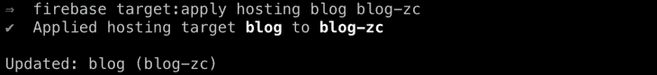

剩下要做的就是部署每个应用程序。在应用程序根目录中，运行:

```
ng deploy
```

## 部署 Angular 通用应用

[Angular Universal](https://angular.io/guide/universal) 在服务器上渲染 Angular 应用。它从应用程序生成静态页面，当请求时，这些页面在客户端上引导。为了以这种方式渲染 Angular 应用程序，我们将使用 Firebase 云函数和 Angular Universal 的 Angular Express 引擎模块。

首先，我们将从安装 Angular Express 引擎开始，如果您还没有安装的话:

```
ng add @nguniversal/express-engine
```

运行上述命令将安装必要的依赖项，创建将在云功能上运行的 express web 服务器、服务器端应用程序模块和服务器应用程序的引导程序，以及修改其他应用程序配置。如需深入了解添加该原理图后您的应用将会发生哪些变化，请访问此[链接](https://angular.io/guide/universal#universal-tutorial)。

接下来，如果还不是应用依赖的一部分，添加 Angular Firebase 库:

```
ng add @angular/fire
```

在安装过程中，它会检查您的应用程序是否正在使用 Angular Universal 作为其设置的一部分。如果它检测到你的应用程序使用它，它会询问是否应该将其部署为 Firebase 功能。在此提示中输入 yes:

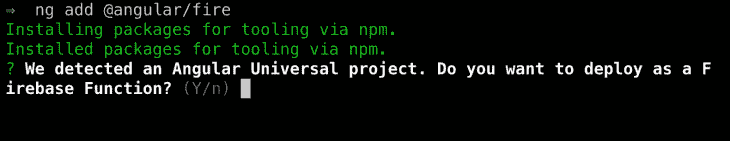

接下来，系统会提示您选择一个与您的应用程序相关联的 Firebase 项目。继续从您的帐户可访问的项目列表中选择一个项目:

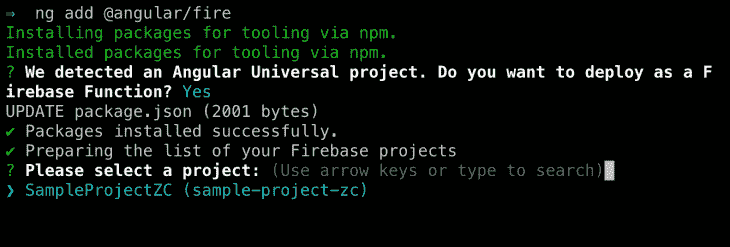

该命令将根据您指定的配置创建`firebase.json`和`.firebaserc`文件。它还将使用 Firebase 部署构建器更新`angular.json`文件，并将`ssr`部署选项设置为 true。

在部署应用程序之前，有几种方法可以预览它。您可以使用:

```
npm run dev:ssr
```

该方法使用`ssr-dev-server`构建器。使用此方法预览时，您可以在浏览器上的`[http://localhost:4200](http://localhost:4200)`处访问应用程序。

您也可以选择在部署之前预览它。第二种方法使用 Firebase 函数模拟器来运行 express 服务器，然后该服务器将呈现您的应用程序。但是，预览完应用程序后，您必须取消部署。该命令将询问您是否希望完成部署。对这个提示回答 ***否*** ，直到您准备好将您的应用程序部署到生产环境中。您可以在`[http://localhost:5000](http://localhost:5000)`查看您的应用预览。

```
ng deploy --preview
```

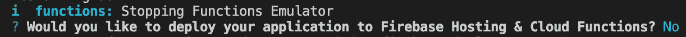

Say No to deployment after a preview

一旦您确定您的应用程序按预期运行，请部署它:

```
ng deploy
```

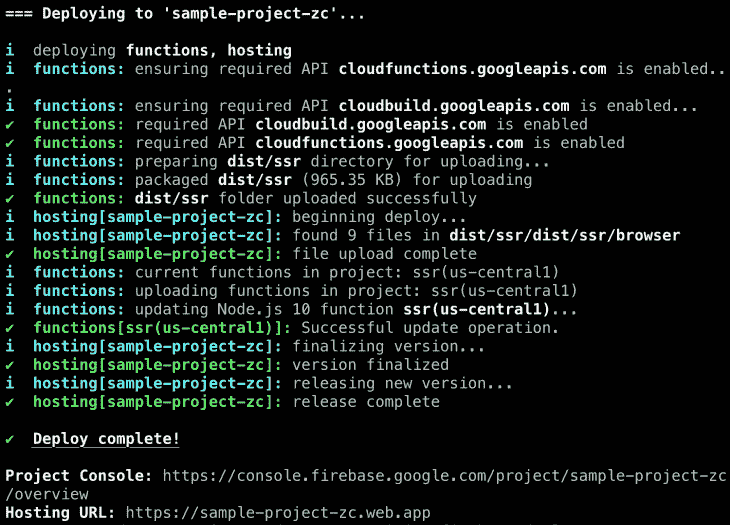

重要的是，如果你运行的 Node.js 版本高于 8，你必须将计费计划从免费的 Spark 计划切换到按需付费的 Blaze 计划。这是因为免费的 Spark 计划仅限于云函数的 Node.js 8 运行时，但 Blaze 计划支持 Node.js 10 或更高版本的运行时。然而，Blaze 计划有一个免费的云功能层，达到一定的限制。您可以点击[此链接](https://firebase.google.com/pricing)了解每个定价方案提供的更多信息。

## 卷回

如果你的托管站点的当前版本有问题，你可以在 Firebase 控制台上把你的应用回滚到以前的工作版本。使用 Firebase CLI 工具无法回滚到以前的版本。要回滚到过去的版本，请在 Firebase 控制台上直接进入项目的托管页面。选择您想要修改的站点，在它的发布历史表中，选择您想要回滚到的版本，打开它的下拉菜单，然后选择回滚。

## 结论

Firebase 托管支持部署已编译的 Angular 应用程序。有了 Angular Fire library，Firebase 上的许多项目设置和站点部署都实现了自动化。使用 Angular CLI 和 Angular Fire 库，您可以简化复杂的项目部署，例如单个项目中的多个站点和服务器端呈现的应用程序。要了解更多关于 Firebase 托管的信息，请访问[此链接](https://firebase.google.com/docs/hosting)。

## 像用户一样体验 Angular 应用程序

调试 Angular 应用程序可能很困难，尤其是当用户遇到难以重现的问题时。如果您对监视和跟踪生产中所有用户的角度状态和动作感兴趣，

[try LogRocket](https://lp.logrocket.com/blg/angular-signup)

.

[](https://lp.logrocket.com/blg/angular-signup)[https://logrocket.com/signup/](https://lp.logrocket.com/blg/angular-signup)

LogRocket 就像是网络和移动应用程序的 DVR，记录你网站上发生的一切，包括网络请求、JavaScript 错误等等。您可以汇总并报告问题发生时应用程序的状态，而不是猜测问题发生的原因。

LogRocket NgRx 插件将角度状态和动作记录到 LogRocket 控制台，为您提供导致错误的环境，以及出现问题时应用程序的状态。

现代化调试 Angular 应用的方式- [开始免费监控](https://lp.logrocket.com/blg/angular-signup)。