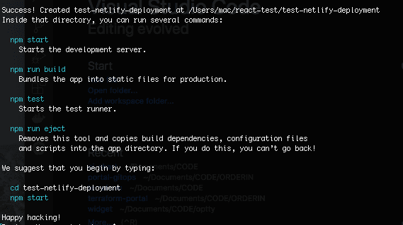
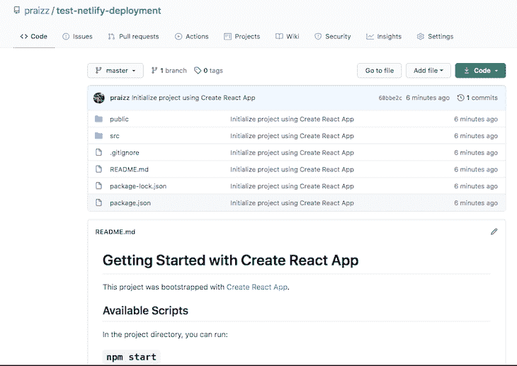
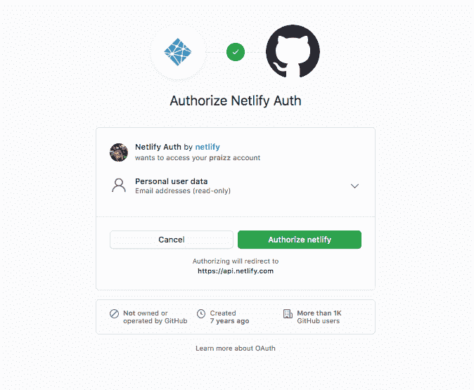
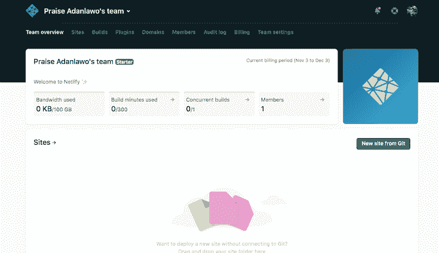
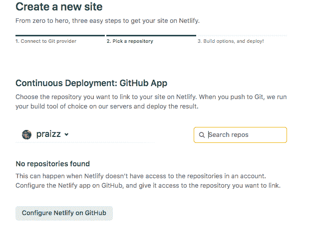
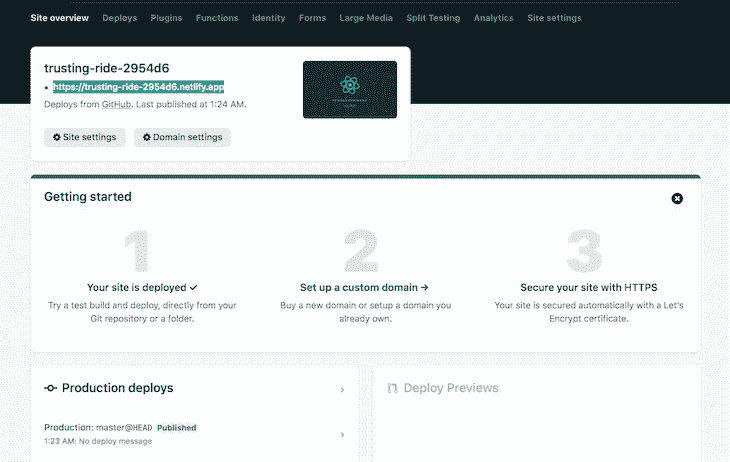
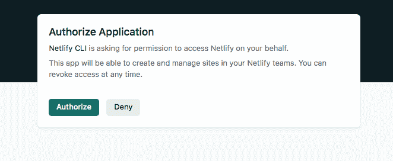
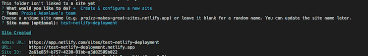
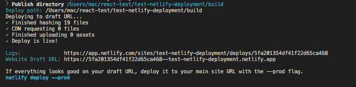
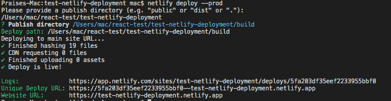

# 将 React 应用部署到网络:3 种方法

> 原文：<https://blog.logrocket.com/deploy-react-apps-netlify-3-ways/>

***编者按**:这篇文章最后一次更新是在 2022 年 10 月 14 日，包括了额外的设置命令。*

Netlify 引以为豪的是，它是建立令人惊叹的网站的最快方法，它可以大大提高你的工作效率。Netlify 已经很容易地深入到许多开发者的心中；有些人甚至认为这是他们在软件开发和部署方面遇到的最好的事情。Netlify 有一个流行的标语，可以作为本教程的锚，“只需 git push 即可在全球范围内部署”。

在本教程中，我们将深入研究使用 Netlify 部署 React 应用程序，探索三种不同的方法。要学习本教程，您需要具备以下工作知识:

*   构建 React 应用程序
*   版本控制:GitHub、Gitlab、Bitbucket 等。
*   网络生活

## 目录

## 网络功能

除了它的大部分特性是完全免费的这一事实之外， [Netlify 还通过提供以下功能简化了部署](https://blog.logrocket.com/netlify-vs-cloudflare-pages/):

*   易于使用的用户界面
*   几秒钟内快速部署
*   滚动更新，意味着没有停机时间，即使在更新您的网站
*   回滚到站点以前的工作版本
*   来自版本控制的持续集成和持续部署
*   用于整理用户数据的即时表单
*   无服务器操作的功能

## 为部署准备 React 应用程序

将应用程序部署到 Netlify 有三种常见的方法。在我们深入研究每种方法的细节之前，让我们先介绍一些适用于所有不同部署方法的通用步骤。

### 创建 React 应用程序

React 是一个开源的前端 JavaScript 库，用于构建用户界面和 UI 组件。为了[开始创建一个 React 应用，我们将使用 Create React 应用库](https://blog.logrocket.com/how-to-send-emails-react-app-netlify-functions/)来创建一个名为`test-netlify-deployment`的应用。

在终端中，运行以下命令:

```
npx create-react-app test-netlify-deployment
cd test-netlify-deployment

```



Commands to launch a Netlify test

上面的命令安装了创建一个简单的 React 应用程序所需的所有包以及一些静态文件，为我们提供了一个工作的基础。对于本教程，我们将按原样部署示例应用程序，但是请随意对您的示例应用程序进行任意多的更改。

### 创建一个构建目录

接下来，我们将通过运行以下命令，在生产就绪的`build`文件夹中创建应用程序的构建版本:

```
npm run build

```

上面的命令生成一个`build`文件夹，代表整个应用程序的缩小版，包含部署应用程序所需的一切。现在，我们的 React 应用程序已经准备好部署，我们可以将应用程序推送到我们选择的版本控制中。这种情况下，我会选择 GitHub。

### 使用 GitHub 进行版本控制

虽然有许多版本控制系统可用，但是为了本教程，我将[集中于 GitHub 版本控制系统](https://docs.github.com/en/get-started/quickstart/create-a-repo)。

创建一个任意名称的 GitHub 存储库。然后，我们将把 React 应用程序推送到 GitHub repo，如下图所示；请随意[查看我的回购样本](https://github.com/praizz/test-netlify-deployment):



GitHub repo for our Netlify test

现在我们已经完成了示例应用程序的设置，我们可以深入研究将应用程序部署到 Netlify 的不同方法。

## 使用 Netlify UI 部署 React 应用程序

对于那些宁愿手动部署和配置应用程序也不愿使用命令行终端的开发人员来说，Netlify UI 是最佳选择。

### 将 Netlify 帐户与 GitHub 帐户连接

如果您还没有 Netlify 帐户，您可以[创建一个免费的帐户](https://app.netlify.com/signup)。我们将使用已经创建的 GitHub 帐户登录 Netlify，并按照提示授权 Netlify Auth:



Authorizing Netlify Auth with GitHub

授权 Netlify Auth 后，我们被重定向到 GitHub teams 页面。我们需要从 Git 创建一个新站点，如下所示:



New site created on GitHub

### 授权 Netlify 访问存储库

在`Create a new site`页面上，我们会被提示授权 Netlify 访问 GitHub 库。我们可以选择授予 Netlify 访问整个 GitHub 帐户的权限，或者我们可以通过点击页面底部的**在 GitHub** 上配置 Netlify 按钮来授予 Netlify 访问特定存储库的权限:



Page giving us the option to configure Netlify on GitHub

### 构建选项和部署

在选择了 React 应用程序所在的存储库并从上面的步骤中选择了部署分支之后，我们指定部署站点所需的基本构建设置。对于使用 Create React App 创建的应用程序，这些字段应该预先填充。

这些设置包括一个基本目录，Netlify 将假定该文件夹是运行构建命令的主文件夹。默认情况下，它将假定您的 Git repo 的根目录，但是您可以指定一个子目录，这在多个项目位于同一个 repo 中时非常有用。

build 命令将触发项目的生成。如果您没有使用 Create React App 来生成您的 React App，请检查`package.json`以查看是否有构建脚本；通常会是`npm run build`。build 命令的输出应该在发布目录中。对于 Create React App，应该是`build`。

一旦你指定了构建设置，点击`Deploy Site`按钮，瞧！我们将看到站点部署正在进行中。成功部署后，我们可以用它返回的测试域预览我们的站点:



Our successfully deployed Netlify app

### 正在配置站点域

一旦我们预览了 React 应用程序部署，并对它的外观感到满意，我们就可以配置一个合适的域来服务我们的应用程序。在`Deploys`选项卡中，我们可以看到我们站点部署的详细信息，在这里我们注册了想要用于 React 应用程序的子域。

如果我们想使用一个预先注册的域名，Netlify 会要求我们验证这个域名是我们的。我们将从上图中点击**设置一个自定义域**，提示我们在 Netlify 配置之前验证我们的自定义域:


Page giving us the option to create a custom domain

一旦我们的域被成功验证，我们就可以在已配置的域上访问我们的应用程序。

## 网络拖放

Netlify 拖放功能与上面描述的 Netlify UI 方法非常相似。但是，拖放功能的独特之处在于它利用了在线应用程序功能，并且特别适合快速部署。

### 登录您的 Netlify 帐户

要将您的 GitHub 帐户连接到您的 Netlify 帐户，您可以[按照上面](#connect-netlify-github-account)的相同步骤操作。然而，您会看到在这个实例中，我们看到的是一个空白页，如下所示。我们称之为在线应用功能。我们不会像在第一个方法中那样从 Git 创建一个新站点:


The online app feature in Netlify

### 拖放

因为我们的 React 应用程序有一个最新的`build`文件夹，我们只需将`build`文件夹拖到上面的空白处，这就是我们所知的在线应用程序。Netlify 为我们处理部署。

### 正在配置站点域

要[配置站点域](#configuring-site-domain)，请遵循与上述 Netlify UI 方法中配置站点域相同的方法。

## 使用 Netlify CLI 部署 React

Netlify CLI 方法适用于那些更喜欢从命令行终端运行部署而不是使用 UI 或拖放功能的开发人员。

### 安装 Netlify CLI

安装 Netlify CLI 既快速又简单；只需运行下面的命令:

```
npm install netlify-cli -g

```

### 授权 CLI

安装 CLI 后，我们导航到我们的工作目录并运行以下命令，以针对 Netlify 帐户授权我们的 Netlify CLI:

```
cd test-netlify-deployment 
netlify deploy

```

确保浏览器窗口中的弹出窗口没有被阻止进行重定向。运行 Netlify deploy 命令会将我们重定向到请求 Netlify CLI 授权的浏览器窗口:



Page prompting us to authorize our application using the Netlify CLI

### 部署应用程序

既然 CLI 有足够的权限访问 Netlify 帐户，我们就可以继续部署应用程序了。

有几个命令行提示，我们想一起浏览一下。您可以使用设备上的箭头键浏览提示。

### 提示一:`This folder isn't linked to a site yet`

授权应用程序后，第一个提示询问我们是要将此应用程序部署到现有站点还是新站点。在这种情况下，我们将部署到一个新站点，因此我们选择**创建&配置一个新站点**。

### 提示二:`Choose a site name`

在第二个提示中，您可以决定配置站点详细信息或将其留空，以便 Netlify 为您提供一个随机名称。无论您选择哪个选项，您都可以在以后更新它:



Our second CLI prompt

从上面的图片中，我们可以看到 Netlify 是如何轻松地从网站名称生成自定义的域名 URL 的。然而，即使我们有一个 URL，我们还没有完成部署。

### 提示三:`Deploy path`

因为我们正在 React 应用程序的工作目录中运行`netlify deploy`命令，所以我们的部署路径是我们的`build`文件夹。因此，我们需要指定到我们的`build`目录的路径来响应提示。只有`build`文件夹包含部署应用程序所需的生产就绪文件:



Production-ready files

现在，我们有了一个可以测试的 URL。

如果 URL 重定向到一个抛出`Page not found`错误的网页，则问题与不正确的`build`文件有关。再次运行`netlify deploy`命令，并相应更新`build`文件。如果你的草稿 URL 看起来一切正常，用`--prod`标志把它部署到你的主站点 URL。

### 将应用程序部署到生产环境

在使用网站草稿 URL 进行测试之后，我们可以通过运行上面输出中的命令来启用我们的应用程序:

```
netlify deploy --prod

```

同样，我们需要指定部署路径，这是我们的构建目录的路径。成功部署后，我们将获得一个更新的网站 URL:



Code showing that deployment to Netlify was successful

需要注意的两件重要事情是`Unique deploy URL`和`Live URL`，如上所示。
`Unique deploy URL`表示特定于每个部署的 URL。`Live URL`是生产网站的网址。

现在，我们可以从`Live URL`访问我们的 React 应用程序。

## 结论

使用 Netlify 部署 React 应用程序和其他应用程序是一个无缝的过程，这主要归功于该平台易于使用的特性。

一旦您选择了首选的部署方法并满足要求，即安装 CLI，您通常可以在 60 秒内将应用部署到 Netlify。

我希望您喜欢和我一起创建和部署 React 应用程序。如果你遇到任何问题或错误，请在评论区告诉我。编码快乐！

## [LogRocket](https://lp.logrocket.com/blg/react-signup-general) :全面了解您的生产 React 应用

调试 React 应用程序可能很困难，尤其是当用户遇到难以重现的问题时。如果您对监视和跟踪 Redux 状态、自动显示 JavaScript 错误以及跟踪缓慢的网络请求和组件加载时间感兴趣，

[try LogRocket](https://lp.logrocket.com/blg/react-signup-general)

.

[ ](https://lp.logrocket.com/blg/react-signup-general) [](https://lp.logrocket.com/blg/react-signup-general) 

LogRocket 结合了会话回放、产品分析和错误跟踪，使软件团队能够创建理想的 web 和移动产品体验。这对你来说意味着什么？

LogRocket 不是猜测错误发生的原因，也不是要求用户提供截图和日志转储，而是让您回放问题，就像它们发生在您自己的浏览器中一样，以快速了解哪里出错了。

不再有嘈杂的警报。智能错误跟踪允许您对问题进行分类，然后从中学习。获得有影响的用户问题的通知，而不是误报。警报越少，有用的信号越多。

LogRocket Redux 中间件包为您的用户会话增加了一层额外的可见性。LogRocket 记录 Redux 存储中的所有操作和状态。

现代化您调试 React 应用的方式— [开始免费监控](https://lp.logrocket.com/blg/react-signup-general)。