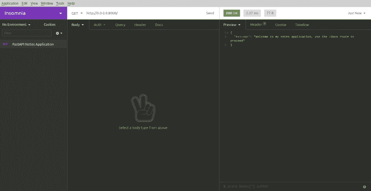
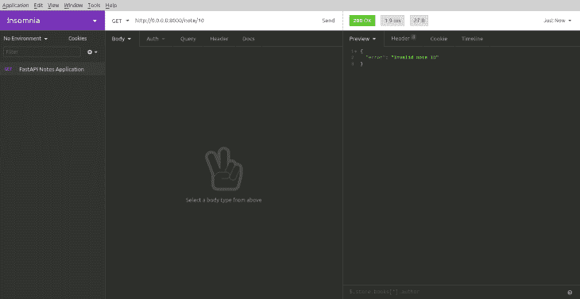
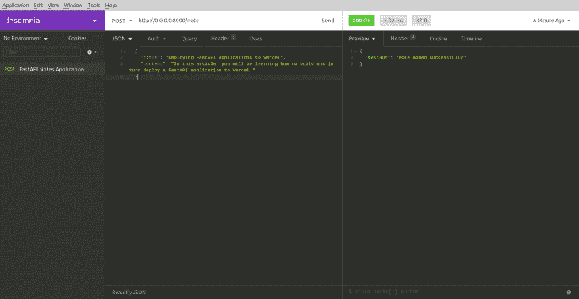
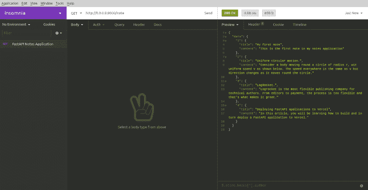
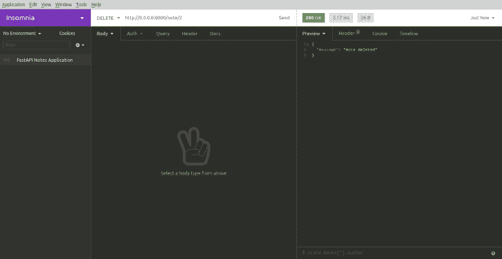
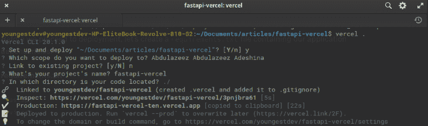
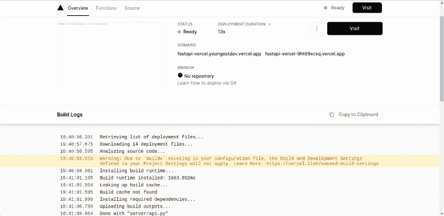

# 将 FastAPI 应用程序部署到 Vercel 

> 原文：<https://blog.logrocket.com/deploying-fastapi-applications-to-vercel/>

## 介绍

将应用部署到 web 或云托管平台通常是开发周期的最后一步，最终允许用户访问我们的应用。虽然有许多工具可以实现这一点，但在本文中，我们将学习如何将 FastAPI 应用程序部署到 Vercel。

FastAPI 是一个现代快速的 Python web 框架，用于构建后端 API 应用程序。FastAPI 支持由 Swagger 提供的 API 文档、安全模块和类型检查，以确保代码的正确性。

### 先决条件

### 我们将建造什么

为了演示如何将 FastAPI 应用程序部署到 Vercel，我们将构建一个简单的 notes 应用程序。

从现在开始，我假设您已经安装了 Python 和 Virtualenv。通过运行以下命令进行检查:

```
$ python3 --version

```

然后运行:

```
$ virtualenv --version

```

## 设置

在我们深入探讨之前，让我们规划一下项目结构和应用程序所需的依赖项的安装。首先创建项目文件夹:

```
$ mkdir fastapi-notes-app && cd fastapi-notes-app
$ mkdir server
$ touch {main,server/api,server/routes,server/__init__}.py

```

接下来，在基本目录中创建一个虚拟环境，并安装所需的依赖项:

```
$ virtualenv -p python3.8 venv

```

接下来，我们将激活虚拟环境，这是应用程序的一个独立部分，我们将在其中安装应用程序的依赖项。为此，请运行以下命令:

```
$ source venv/bin/activate

```

虚拟环境就绪后，安装 FastAPI 和 Uvicorn:

```
(venv)$ pip3 install fastapi uvicorn

```

Uvicorn 是一个 ASGI(异步服务器网关接口)服务器，它使我们能够运行我们的应用程序。

现在，让我们创建一个基本路由来验证 FastAPI 和 Uvicorn 的安装是否成功。

```
server/api.py

```

首先导入 FastAPI 并将类方法初始化到一个变量中，`app`:

```
from fastapi import FastAPI

app = FastAPI()

```

接下来，定义路线:

```
@app.get("/", tags=["Root"])
async def read_root():
  return { 
    "message": "Welcome to my notes application, use the /docs route to proceed"
   }

```

要运行应用程序，您必须在`main.py`文件中定义一个入口点。在入口点，我们将使用 Uvicorn 来运行服务器，如前所述:

```
//main.py
import uvicorn

if __name__ == "__main__":
  uvicorn.run("server.api:app", host="0.0.0.0", port=8000, reload=True)

```

在`main`块中，我们从 Uvicorn 调用`run`方法，并接受以下参数:

*   FastAPI 实例的位置
*   主机地址
*   港口
*   布尔重载值

运行`main.py`文件:

```
(venv)$ python3 main.py

```

上面的命令应该会在我们的命令行中返回如下所示的输出:

```
INFO:     Uvicorn running on http://0.0.0.0:8000 (Press CTRL+C to quit)
INFO:     Started reloader process [20586] using statreload
INFO:     Started server process [20588]
INFO:     Waiting for application startup.
INFO:     Application startup complete.

```

可以在`[http://0.0.0.0:8000](http://0.0.0.0:8000)`的浏览器上查看应用程序。我们将使用 Postman/失眠症来测试我们的应用程序端点。

> 请随意在`[http://0.0.0.0:8000/docs](http://0.0.0.0:8000/docs)`上用 FastAPI 的交互文档替换这些文档。

接下来，在 Postman(或者失眠)上向`[http://0.0.0.0:8000](http://0.0.0.0:8000)`发送 GET 请求:



## 定义模型架构

让我们为我们的应用程序定义模型模式。这将表示数据是如何存储在我们的应用程序中的。在`app`文件夹中，新建一个文件`model.py`:

```
from typing import Optional
from pydantic import BaseModel

class NoteSchema(BaseModel):
  title: Optional[str]
  content: Optional[str]

  class Config:
    schema_extra = {
        "example": {
            "title": "LogRocket.",
            "content": "Logrocket is the most flexible publishing company for technical authors. From editors to payment, the process is too flexible and that's what makes it great."
        }
    }

```

在上面的代码块中，我们定义了一个名为`NoteSchema`的 [Pydantic](https://pydantic-docs.helpmanual.io/) 模式，它表示 notes 数据将如何存储在应用程序的临时数据库中。子类 config 包含一个示例请求体，它将指导用户从交互文档发送请求。

让我们在下一节的`routes.py`文件中定义 CRUD 操作的路径。

## 定义我们的路线

有了模式之后，让我们创建一个应用内数据库来存储和检索我们的 notes，并导入 notes 模式。

### `routes.py`

首先导入 FastAPI 的`APIRouter`类和`NoteSchema`:

```
from fastapi import APIRouter, Body
from fastapi.encoders import jsonable_encoder
from server.model import NoteSchema

router = APIRouter()

```

就在`router`变量下面，创建一个临时数据库，`notes`:

```
notes = {
    "1": {
        "title": "My first note",
        "content": "This is the first note in my notes application"
    },
    "2": {
        "title": "Uniform circular motion.",
        "content": "Consider a body moving round a circle of radius r, wit uniform speed v as shown below. The speed everywhere is the same as v but direction changes as it moves round the circle."
    }
}

```

接下来，定义 GET 请求的路由:

```
@router.get("/")
async def get_notes() -> dict:
    return {
        "data": notes
    }

@router.get("/{id}")
async def get_note(id: str) -> dict:
    if int(id) > len(notes):
        return {
            "error": "Invalid note ID"
        }

    for note in notes.keys():
        if note == id:
            return {
                "data": notes[note]
            }

```

在上面的代码块中，我们定义了两条路线:

1.  到`/note`的路线，返回所有可用的笔记
2.  到`/note/{id}`的路径，返回一个 ID 与传递的 ID 相匹配的便笺

在继续测试路由之前，将 notes 路由器包含在`api.py`中的全局路由处理器中，如下所示:

```
from server.routes import router as NoteRouter

...

app.include_router(NoteRouter, prefix="/note")

```

`FastAPI().include_router()`方法用于在全局路由处理程序中包含其他文件中声明的路由。这种方法在将路由分成单独的文件和目录的应用程序中非常方便。

## 测试我们的路线

有了 notes 路径之后，让我们测试这些路径:

1.  得到`/note` :
    
2.  GET `/note/{id}`:在我们的临时数据库中，我们添加了两个 id 为 1 和 2 的注释。传递一个不在`notes`数据库中的 ID 将会返回一个错误响应。我们将尝试有效和无效的 id，顺序是:
    

现在对于数据库中没有的 ID:



接下来，定义发布路线以添加新注释:

```
@router.post("/note")
async def add_note(note: NoteSchema = Body(...)) -> dict:
    note.id = str(len(notes) + 1)
    notes[note.id] = note.dict()

    return {
        "message": "Note added successfully"
    }

```

在`add_note`函数中，我们将注释设置为我们的模型`NoteSchema`类型，并使用`Body(…)`使其成为必需参数。`Body()`语句中的省略号表示这个请求体必须根据模式规范来填充。

为了测试 POST 路由，需要在 Postman/失眠症中将请求类型从 GET 改为 POST，并将 URL 地址改为`[http://0.0.0.0:8000/note](http://0.0.0.0:8000/note)`。接下来，将请求主体设置为 JSON，并传入下面的 JSON 代码:

```
{
    "title": "Deploying FastAPI applications to Vercel",
    "content": "In this article, you will be learning how to build and in turn deploy a FastAPI application to Vercel."
}

```

现在，发送请求:



注释已成功添加。在`/note`端点上运行 GET 请求来验证添加:



接下来，定义`update`和`delete`路线:

```
@router.put("/{id}")
def update_note(id: str, note: NoteSchema):
    stored_note = notes[id]
    if stored_note:
        stored_note_model = NoteSchema(**stored_note)
        update_data = note.dict(exclude_unset=True)
        updated_note = stored_note_model.copy(update=update_data)
        notes[id] = jsonable_encoder(updated_note)
        return {
            "message": "Note updated successfully"
        }
    return {
        "error": "No such with ID passed exists."
    }

@router.delete("/{id}")
def delete_note(id: str) -> dict:
    if int(id) > len(notes):
        return {
            "error": "Invalid note ID"
        }

    for note in notes.keys():
        if note == id:
            del notes[note]
            return {
                "message": "Note deleted"
            }

    return {
        "error": "Note with {} doesn't exist".format(id)
    }

```

在`update`路线中，我们正在执行[部分更新](https://fastapi.tiangolo.com/tutorial/body-updates/#partial-updates-with-patch)。如果注释存在，我们只更新注释；否则，我们返回一个错误消息。我们也将相同的逻辑应用于`delete`路线。在删除之前，我们首先检查注释是否存在；否则，我们返回一个错误消息。让我们继续测试路线。

这里是`update`路线:


现在让我们删除第二个笔记来测试`delete`路线:



路线准备就绪并经过测试后，我们可以继续部署到 Vercel。

## 将我们的 FastAPI 应用部署到 Vercel

在本节中，我们将部署到 Vercel。如果您没有安装 Vercel 命令行工具，您可以通过运行以下命令来获得它:

```
yarn global add vercel

```

接下来，登录:

```
vercel login

```

要部署到 Vercel，需要一个`vercel.json`配置文件。在父目录中创建一个`vercel.json`文件，并添加以下 JSON 代码:

```
{
  "builds": [
    {"src": "/server/api.py", "use": "@now/python"}
  ],
  "routes": [
    {"src": "/(.*)", "dest": "server/api.py"}
  ]
}

```

在上面的代码块中，builds 键保存一个包含另一个对象的数组。在这个对象中，我们指出了应用程序入口点的路径。我们还说明了在`routes`对象中构建我们的应用程序时要使用的包。我们将所有路由指向`server/api.py`文件。

在我们继续部署之前，让我们创建一个包含应用程序依赖关系的`requirements.txt`文件:

```
//requirements.txt
fastapi
uvicorn

```

配置和需求文件就绪后，让我们初始化 Vercel。在父目录中运行以下命令:

```
vercel .

```

按照控制台中的提示操作，我们应该会看到一个类似的屏幕:



我们只用了四个简单的步骤就成功地将我们的应用程序部署到了 Vercel。我们可以通过单击控制台或我们的 Vercel 仪表板中的链接来预览部署的应用程序:



本文中部署的应用程序可以在这里查看[。](https://fastapi-vercel-9ht69xcxq.vercel.app/)

## 结论

在本文中，我们学习了如何构建和部署一个 [FastAPI 应用程序](https://blog.logrocket.com/building-a-graphql-server-with-fastapi/)。你可以从官方[文档](https://fastapi.tiangolo.com/)中阅读更多关于 FastAPI 的内容，你也可以在 [GitHub](https://github.com/Youngestdev/fastapi-notes-app) 上找到本文使用的代码。

## 使用 [LogRocket](https://lp.logrocket.com/blg/signup) 消除传统错误报告的干扰

[](https://lp.logrocket.com/blg/signup)

[LogRocket](https://lp.logrocket.com/blg/signup) 是一个数字体验分析解决方案，它可以保护您免受数百个假阳性错误警报的影响，只针对几个真正重要的项目。LogRocket 会告诉您应用程序中实际影响用户的最具影响力的 bug 和 UX 问题。

然后，使用具有深层技术遥测的会话重放来确切地查看用户看到了什么以及是什么导致了问题，就像你在他们身后看一样。

LogRocket 自动聚合客户端错误、JS 异常、前端性能指标和用户交互。然后 LogRocket 使用机器学习来告诉你哪些问题正在影响大多数用户，并提供你需要修复它的上下文。

关注重要的 bug—[今天就试试 LogRocket】。](https://lp.logrocket.com/blg/signup-issue-free)