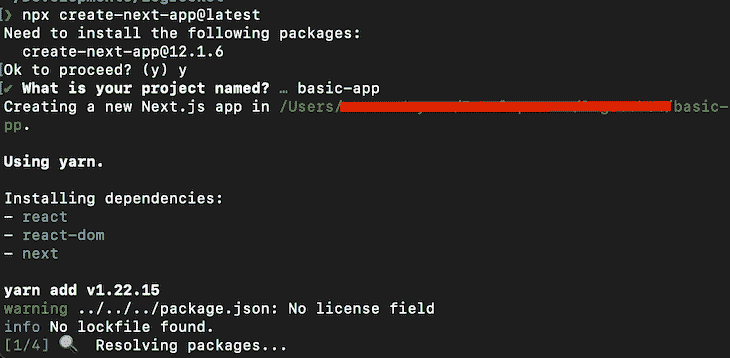
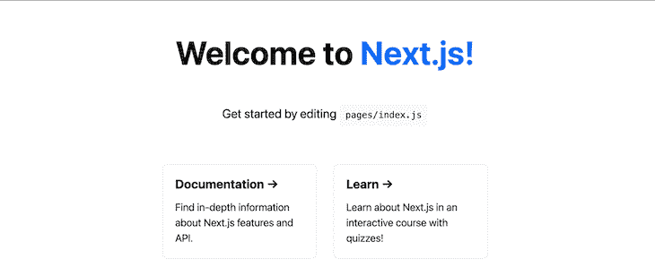

# 使用 Flask 部署 Next.js

> 原文：<https://blog.logrocket.com/deploying-next-js-flask/>

Flask 和 Next.js 是两个独特的开源 web 框架，分别构建在 Python 和 JavaScript 编程语言之上。

没有 Next.js 也可以构建 Flask 应用，没有 Flask 也可以构建 Next.js app。但是，您可能会发现自己已经用 Flask 构建了一个应用程序，然后决定使用 Next.js 进行服务器端呈现。

那么，此时你会怎么做呢？

你可以尝试的一件事是逐步采用 Next.js 或 Flask。在本文中，我将向您展示如何使用 Next.js 增量采用设计使 Next.js 与 Flask API 无缝协作，以及如何在 Ubuntu 服务器上使用 Nginx 部署它。

在这篇文章中:

## 在 Next.js 和 Flask 中构建一个 app

### 要求 *s*

让我们首先构建一个示例 Next.js 应用程序。遵循官方的 [Next.js 文档](https://nextjs.org/docs/getting-started)，运行以下命令在您的计算机上安装 next . js:`npx [[email protected]](/cdn-cgi/l/email-protection)`。按照说明设置基本应用程序。



这个装置将给我们一个“你好，世界！”app，准备部署。如果一切顺利，您可以在终端上运行`yarn run dev`,并在浏览器上访问`localhost:3000`,以确认它工作正常。您应该会看到类似这样的内容:



目前就这些了。接下来，让我们构建一个基本的 Flask API。我假设你已经安装了 Python，但是如果你没有，你可以按照你的操作系统的官方文档中的说明来安装它。

首先，让我们创建并激活一个虚拟环境来包含 Python 应用程序。

```
python3 -m venv env & source ./env/bin/activate

```

接下来，[通过在您的终端中运行以下命令来安装 Flask](https://flask.palletsprojects.com/en/2.1.x/installation/) 。我们将使用 Flask-RESTful 创建一个 restful API:

```
pip install Flask flask-restful

```

然后，创建一个名为`hello.py`的文件，并向其中添加以下代码:

```
from flask import Flask
from flask_restful import reqparse, Api, Resource
app = Flask(__name__)
api = Api(app)

parser = reqparse.RequestParser()
parser.add_argument('task')
class Message(Resource):
    def get(self):
        return {"message": 'Hello World'}
api.add_resource(Message, '/api/hello')

if __name__ == '__main__':
    app.run(debug=True)

```

现在，我们已经设置好了 Flask 和 Next.js 应用程序。让我们继续让他们一起工作。

## 使用重写将 Flask API 集成到 Next.js 中

> [Next.js 重写](https://nextjs.org/docs/api-reference/next.config.js/rewrites)允许您将传入的请求路径映射到不同的目标路径。

进入我们刚刚创建的 Next.js 应用程序的目录，打开`next.config.js`文件，用下面的代码替换内容:

```
module.exports = () => {
  const rewrites = () => {
    return [
      {
        source: "/hello/:path*",
        destination: "http://localhost:5000/hello/:path*",
      },
    ];
  };
  return {
    rewrites,
  };
};

```

通过这种集成，我们可以直接从 Next.js 访问我们的所有 API 路由，就好像 API 与 Next.js 客户机在同一个域和端口中一样。这意味着我们将只需要调用`[http://localhost:3000/api/](http://localhost:3000/api/)`，并且我们将能够间接地到达端口`5000`的 API。

让我们看一个例子。

打开`/pages/index.js`文件，用“Hello，World！”替换它的组件以下组件:

```
import styles from '../styles/Home.module.css'
import { useEffect, useState } from 'react'

export default function Home() {
    const [message, setMessage] = useState("");
    const [loading, setLoading] = useState(true);

    useEffect(() => {
        fetch('/hello/')
            .then(res => res.json())
            .then(data => {
                setMessage(data.message);
                setLoading(false);
            })
    }, [])

    return (
        <div className={styles.container}>
            <p> {!loading ? message : "Loading.."}</p>
        </div>
    )
}
```

上面的代码是一个简单的 Next.js 组件，它使用 Fetch 与 Flask API 对话。如您所见，我们不需要在 API 调用中输入确切的 URL。Next.js 是根据我们最初设置的理解的。

当然，你也可以选择直接调用 Flask API。

## 设置 Nginx

既然我们已经有了一个工作的集成，让我们继续在 Nginx 中部署。[在您的服务器上安装 Nginx](https://docs.nginx.com/nginx/admin-guide/installing-nginx/installing-nginx-open-source/) (在我们的例子中，是 Ubuntu 服务器)，为您的 Nginx 配置创建一个配置文件，我们称之为`nextflask`，并将以下代码添加到该文件中:

```
/** 
/etc/nginx/sites-available/nextflask
**/
server {
    server_name        yourdomainname.com www.yourdomainname.com;
    listen 80;

  location /hello/ {
    proxy_pass http://127.0.0.1:5000/hello/;
    proxy_http_version 1.1;
    proxy_set_header Connection "upgrade";
    proxy_set_header Host $host;
    proxy_set_header Upgrade $http_upgrade;
    proxy_set_header X-Real-IP $remote_addr;
    proxy_set_header X-Forwarded-For $proxy_add_x_forwarded_for;
  }
  location / {
    proxy_pass http://0.0.0.0:3000;
    proxy_http_version 1.1;
    proxy_set_header Connection "upgrade";
    proxy_set_header Host $host;
    proxy_set_header Upgrade $http_upgrade;
    proxy_set_header X-Real-IP $remote_addr;
    proxy_set_header X-Forwarded-For $proxy_add_x_forwarded_for;
  }
}

```

上面的 Nginx 配置将在根域`yourdomainname.com`上为你的 Next.js 应用服务，在`yourdomainname.com/api/hello`上为你的 API 服务。

添加此配置后，通过运行以下命令启动 Nginx:

```
sudo systemctl start nginx.service

```

这就是为我们的 Flask API 和 Next.js 服务器设置 Nginx 的全部内容。将 Flask 和 Next.js 代码推送到服务器，安装依赖项，并分别运行它们。哦，等等，我们需要给它们起名字。

你可以用 [Supervisor](https://www.techcoil.com/blog/how-to-host-your-python-3-flask-mvp-with-supervisor-on-ubuntu-server-16-04/) 或 [Gunicorn](https://docs.gunicorn.org/en/stable/deploy.html) 来守护 Flask 应用，这是两个部署 Python 应用的流行工具。

我们将使用 Gunicorn 的 Flask 和 PM2 的 Next.js

## 将 Flask API 和 Next.js API 作为服务运行

让我们从用 Gunicorn 运行 Flask API 开始。确保您的服务器上安装了 Python，然后创建一个虚拟环境来安装 Gunicorn。

创建虚拟环境:

```
python3 -m venv env

```

然后，安装 Gunicorn 和烧瓶:

```
pip install gunicorn flask

```

### 设置 Gunicorn 以服务于 Flask 应用程序

首先，在根目录下创建一个`wsgi.py`文件。这将作为应用程序的入口点。将以下代码添加到文件中:

```
// wsgi.py
from hello import app

if __name__ == "__main__":
    app.run()

```

接下来，为 Gunicorn 创建配置文件`sudo vim /etc/systemd/system/hello.service`,并向其中添加以下配置:

```
[Unit]
Description=Gunicorn instance to serve hello
After=network.target

[Service]
User=eze
Group=www-data
WorkingDirectory=/path/to/your/app/directory
ExecStart=/path/to/gunicorn/bin/gunicorn --workers 3 --bind unix:hello.sock -m 007 wsgi:app

[Install]
WantedBy=multi-user.target

```

请注意参考路径。最后，通过在终端中运行以下命令来启动并启用 Gunicorn:

```
sudo systemctl start hello & sudo systemctl enable hello

```

要检查操作是否成功，请通过运行以下命令来查看状态:

```
sudo systemctl status

```

如果一切顺利，我们的 Flask 应用程序应该在端口`500`和根域`yourdomainname.com`上启动并运行。

## 和 PM2 一起运行 Next.js 应用程序

[PM2](https://pm2.keymetrics.io/) 是 Node.js 应用程序的流程管理工具。要使用它，请使用以下命令全局安装 PM2:

```
pm2 install -g pm2

```

接下来，在包含 Next.js 代码的目录中运行这个命令:

```
pm2 start "npm run start" --name nextapp

```

您的 Next.js 应用程序将在端口`3000`和根域`yourdomainname.com`上开始工作。

恭喜你！您已经使用 Flask API 成功部署了 Next.js 前端。乍一看，这似乎很复杂，但是您不必在将来的部署中重复这个过程，因为这为您的应用程序正常工作设置了基本环境。您可能只需要推送您的代码并重启您的服务器，这可以由您的 [CI/CD 管道](https://blog.logrocket.com/ci-cd-pipelines-react-github-actions-heroku/)来管理。

## 结论

新技术总是来来去去，现在可能是您选择使用 Flask 部署 Next.js 来改进应用程序的一般工程的时候了。我希望这篇文章对你有所帮助。

就我个人而言，我有一个旧的 Flask API，但我想继续用 Next.js 进行开发，同时保留一些 Python 后端实现。我发现在不中断或破坏现有 API 的情况下进行切换非常容易。

查看这个[示例 Next.js 项目](https://github.com/ezesundayeze/basic-nextjs-app)，您可以克隆它来复制本文中的过程。干杯！

## [LogRocket](https://lp.logrocket.com/blg/nextjs-signup) :全面了解生产 Next.js 应用

调试下一个应用程序可能会很困难，尤其是当用户遇到难以重现的问题时。如果您对监视和跟踪状态、自动显示 JavaScript 错误、跟踪缓慢的网络请求和组件加载时间感兴趣，

[try LogRocket](https://lp.logrocket.com/blg/nextjs-signup)

.

[](https://lp.logrocket.com/blg/nextjs-signup)[](https://lp.logrocket.com/blg/nextjs-signup)

LogRocket 就像是网络和移动应用的 DVR，记录下你的 Next.js 应用上发生的一切。您可以汇总并报告问题发生时应用程序的状态，而不是猜测问题发生的原因。LogRocket 还可以监控应用程序的性能，报告客户端 CPU 负载、客户端内存使用等指标。

LogRocket Redux 中间件包为您的用户会话增加了一层额外的可见性。LogRocket 记录 Redux 存储中的所有操作和状态。

让您调试 Next.js 应用的方式现代化— [开始免费监控](https://lp.logrocket.com/blg/nextjs-signup)。