# 使用 Begin 免费部署全栈 Node.js + React 应用程序

> 原文：<https://blog.logrocket.com/deploying-node-js-react-app-for-free-begin/>

分离后端和前端已经成为开发全栈应用程序的标准。但在单一提供商上托管全栈应用的选择并不多。

在这篇文章中，我们将一步一步地了解如何使用 Node.js 部署全栈 JavaScript 应用程序，并对 Begin with Begin 数据做出反应。让我们开始吧！

## 托管 JavaScript 应用程序的免费选项

真正的全栈应用不仅要覆盖后端和前端，还要包含数据存储层。没有多少选项可以为这三个部分提供托管解决方案。

如果你想不花一毛钱就能快速尝试你的想法，那么只有少数几种选择。Vercel 和 [Qovery](https://qovery.com) 是两个同时处理后端和前端的例子。

如果你认为自己是一名前端开发人员，只懂一种语言——JavaScript——建立一个数据库并理解所有后端和数据层方面可能会变得非常快。这是 Begin.com 大放异彩的领域。我们来看看为什么。

## 开始功能

作为一名前端开发人员，你希望编写前端部分，但是如果需要，你可能会涉足后端，如果你觉得这是一个熟悉的领域。

Begin 在流行的 AWS 服务之上提供了无与伦比的、超可用的抽象概念，包括 T2 的 AWS Lambda 和 T4 的 DynamoDB T5。你可以在 30 秒内从代码转到一个可用的 URL 而且是免费的。

所有这些使得 Begin 非常前端友好。正如他们在主页上所说，“Begin 让无服务器变得异常简单。”他们还补充道，“没有服务器。没有配置。不流汗。”让我们验证一下这些说法。

## 建筑师(建筑规范)是如何开始的

Begin 可能在 AWS Lambda 之上为我们提供了高度可用的抽象，但它对如何使用它有自己的看法。

贝京就像是 SaaS 版的建筑师 T1。它是一个无服务器框架，帮助您构建大规模可伸缩的无服务器应用程序。它是开源的，它的[特性](https://arc.codes/docs/en/guides/get-started/why-architect)包括本地工作的能力。

架构师有一个已定义的[项目布局](https://arc.codes/docs/en/guides/get-started/project-layout)和关于如何在 Lambda 函数之间[共享代码](https://arc.codes/docs/en/guides/developer-experience/sharing-code)的规定。有了这些观点，架构师确实使部署、记录和监控变得轻而易举。

下一步，我们将看到如何构建一个简单的新闻应用程序，从 CNN、ABC News 和《卫报》等来源获取最新的美国新闻。

## 先决条件

在我们深入研究代码之前，下面是一些您应该知道的事情:

1.  您熟悉 JavaScript、Node.js 和 React
2.  您知道 AWS Lambda 和无服务器功能是如何更广泛地工作的
3.  您在本地机器上运行 Node.js，并且能够运行基本的 npm 命令
4.  您熟悉 Git 和 GitHub

接下来，我们将看看如何构建新闻应用程序。

## 示例应用程序:最新美国新闻

到目前为止，您已经知道我们的目标是构建一个小的新闻应用程序，它将显示来自多个来源的最新美国新闻。它看起来像下面的例子:

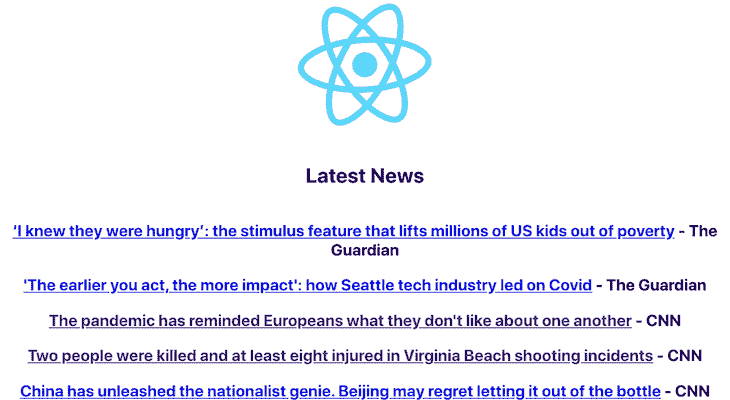

这个示例应用程序将有两个主要部分:用 Node.js 编写的后端和用 React 编写的前端。这个新闻应用程序的数据将存储在 [Begin Data](https://docs.begin.com/en/data/begin-data) 中，这是 DynamoDB 上一个非常有用的抽象。现在是时候用一些代码来弄脏我们的手了。

## 开始使用 Begin

要开始使用 Begin，请进入主页，点击**注册 GitHub** 按钮，并使用您的 GitHub 帐户进行授权。Begin 有一个慷慨的免费计划，可以容纳五个免费的应用程序，所以请注册它们。

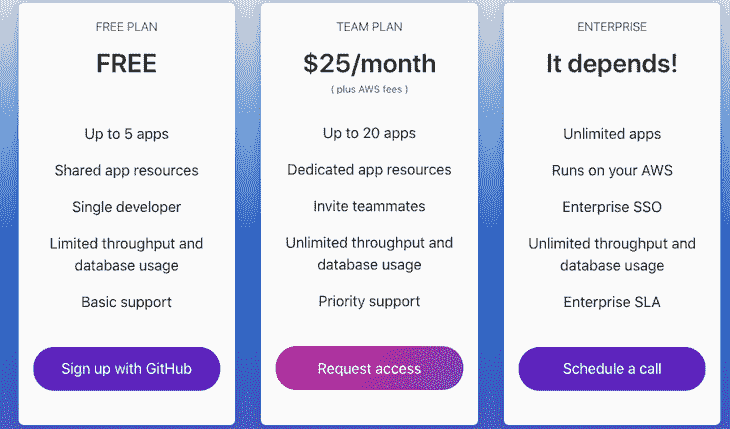

### 从 Begin 示例创建一个 Node + React 应用程序

我们将使用 Node.js 和 React 的 Begin 示例。我们稍后将修改它，使之成为我们的美国新闻应用程序。

转到开始[节点+反应示例](https://github.com/begin-examples/node-create-react-app)应用，点击**部署开始**按钮，如下所示:

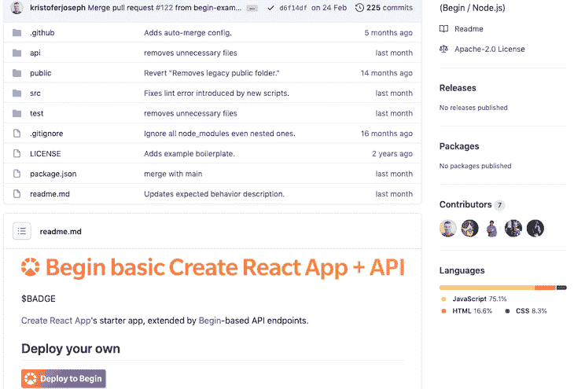

由于我们已经登录，它会将我们带到以下屏幕:


您需要允许 Begin 访问您的 GitHub。当你点击**创建应用**按钮时，它将在你的 GitHub 账户上创建 Begin 应用作为新的存储库。就我而言，它在我的账户上创建了[这个开源的 GitHub 回购](https://github.com/geshan/us-news)。

它将启动 CI/CD 流程，并在唯一的 Begin URL 上部署应用程序，如下所示:

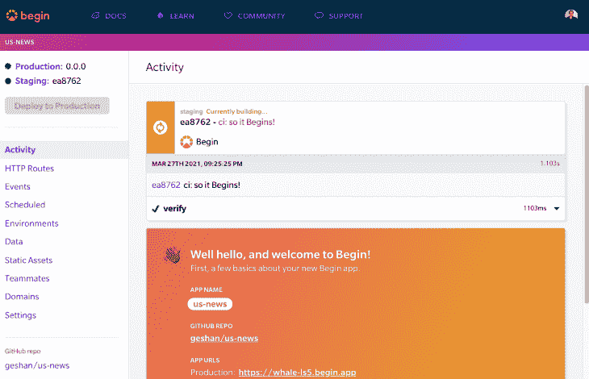

您需要等待 2-3 分钟来完成构建和部署过程，然后您可以访问新 Begin 应用程序的试运行环境。它有一个非常简单 API，可以响应调用来显示其内容。

一段时间后，构建和部署过程完成:

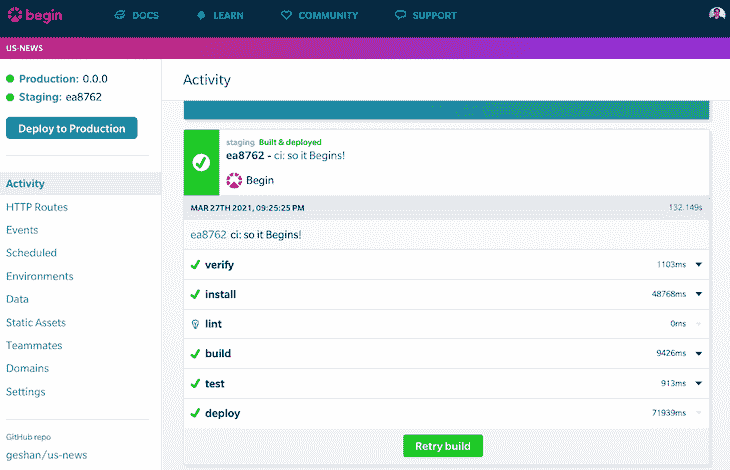

如果我们点击我们的暂存 URL，在我的例子中是`[https://whale-ls5-staging.begin.app/](https://whale-ls5-staging.begin.app/)`，我们将看到一个基本的 React 应用程序:

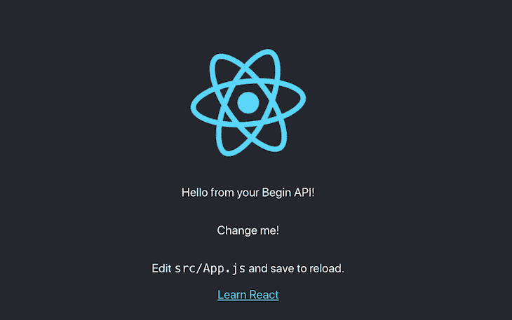

万岁！我们的基本 React 应用和一个超级简单的 Node.js 后端已经在 Begin.com 上运行了。

只有当我们在 GitHub 上推出新标签时，它才会部署到生产环境中。Begin 要求我们使用 [SemVer](https://semver.org/) 来发布带有 Git [标签](https://git-scm.com/book/en/v2/Git-Basics-Tagging)的版本。

现在，我们将继续实际构建 React 将使用的新闻 API。

## 用新闻 API 替换虚拟 API

我们目前在`/api`为我们的示例应用程序提供了一个虚拟 API。它只是用一条消息`Hello from your Begin API!`来响应。我们将删除这个 API，并添加两个新的`GET`API。

第一个可在`/api/news`访问，以获取保存在 Begin Data 中的最新新闻。第二个可以在`/api/fetch-news`到达，从源的 RSS 提要中获取新闻，并将其保存在 Begin 数据表中。让我们来看看实现这一切的代码。

首先，在机器上的某个地方克隆存储库，这样您就可以编辑它，然后运行`npm install`来获得所有的依赖项。为了构建这两个新的 API，我们将首先从`package.json`文件的`arc`部分中移除`http`部分，使其看起来如下:

```
"arc": {
    "app": "react-hello",
    "static": {
      "folder": "build",
      "spa": true
    }
},

```

下一步，我们将删除根目录下的`api`文件夹:

```
rm -rf api

```

如果你想用 GUI 删除它，我让你自己决定。

### 添加`app.arc`文件

随后，我们将添加一个`app.arc`文件，它定义了我们将用来存储新闻的 routes 和 Begin 数据表。`app.arc`文件如下所示:

```
@app
react-hello

@static
folder build

# json api
@http
get /api/news
get /api/fetch-news

@tables
data
  scopeID *String
  dataID **String
  ttl TTL

```

这里需要注意几件重要的事情:

1.  我们正在定义两个`GET` API 端点，`/api/news`和`/api/fetch-news`，它们将显示新闻，并从我们定义的来源获取新闻，并将其保存在 Begin 数据上
2.  我们定义了一个指令`[@tables](https://arc.codes/docs/en/reference/app.arc/tables)`，告诉 Begin 我们想要添加一个名为`news`的带有生存时间(TTL)字段的表。稍后我们将了解 TTL 字段的用途。

### 添加 API 路由和相关文件

为了让 API routes 正常工作，我们需要`rss-parser`模块，因为我们要从源的 RSS 提要中获取新闻。安装时使用:

```
npm i --save rss-parser

```

然后我们将在`http`文件夹中添加两个文件来服务两个 API 端点，如下所示:

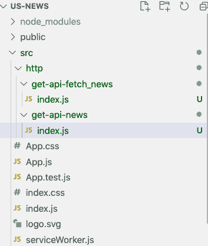

第一个文件是`get-api-fetch_news`文件夹中的`index.js`。这是大多数有趣的事情发生的地方:

```
const data = require('@begin/data');
const Parser = require('rss-parser');
const parser = new Parser();
const table = 'news';

function formatFeedStories(stories, source) {
  const MAX_STORIES = 10;
  let formattedStories = [];
  let count = 0;
  for (story of stories) {
    formattedStories.push({ 
      headline: story.title.trim(), 
      url: story.link,
      published_date: story.pubDate,
      source });
    if (count === MAX_STORIES - 1) {
      break;
    }
    count++;
  }

  console.log(`Formatted ${formattedStories.length} storied from ${source}`, formattedStories);
  return formattedStories;
}

async function getStories(feedUrl, source) {
  try {
    const feed = await parser.parseURL(feedUrl);
    return formatFeedStories(feed.items, source);
  } catch (err) {
    const errMessage = `Error while parsing feed from news stories for ${source}`;
    console.log(errMessage, err);

    return [];
  }
}

async function saveNewsFromSources() {
  const newsSources = [
    {
      feedUrl: 'http://rss.cnn.com/rss/edition.rss',
      source: 'CNN'
    },
    {
      feedUrl: 'https://abcnews.go.com/abcnews/topstories',
      source: 'ABC News'
    },
    {
      feedUrl: 'https://www.theguardian.com/us-news/rss',
      source: 'The Guardian'
    }
  ]
  let totalStoriesSaved = 0;

  for (newsSource of newsSources) {
    const stories = await getStories(newsSource.feedUrl, newsSource.source);
    const savedCount = await saveNews(stories);
    console.log(`Saved ${savedCount} stories from ${newsSource.source}`);
    totalStoriesSaved += savedCount;
  }

  return totalStoriesSaved;
}

async function saveNews(stories) {
  const storiesToInsert = [];
  const ttl = (Date.now() / 1000) + (60 * 60 * 6); // 6 hours from now in seconds

  for(story of stories) {
    const key = story.url.slice(-50);
    const newsExists = await data.get({table, key});
    if (!newsExists) {
      storiesToInsert.push({table, key, ttl, ...story});
    }
  }

  if (storiesToInsert.length) {
    await data.set(storiesToInsert);
  }

  return storiesToInsert.length;
}

exports.handler = async function http(req) {
  try {
    const noOfStoriesSaved = await saveNewsFromSources();
    return {
      statusCode: 200,
      headers: {
        'content-type': 'application/json; charset=utf8'
      },
      body: JSON.stringify({message: `${noOfStoriesSaved} News stories fetched and saved!`})
    }
  } catch(e) {
    console.log(`e: ${e.message}`, e);
    return {
      statusCode: 500,
      headers: {
        'content-type': 'application/json; charset=utf8',
      },
      body: JSON.stringify({'message': `some error occured while fetching news, ${e.message}`})
    }
  }
}

```

应用程序最重要的部分就在这个 100 行的文件中。让我们浏览一下要点。

新闻源的 RSS 提要 URL 在`saveNewsFromSources`中定义。在我们的例子中，我们从 CNN、ABC 新闻和卫报中提取信息。对于这些新闻源中的每一个，它在`getStories`函数中获得 10 个最新的故事。

之后，它将故事保存在`saveNews`函数中。这将保存`news`表中的故事，其生存时间(TTL)只有 6 小时，如果它还不存在的话。因此，这些故事在数据库中最多保留 6 个小时，在 TTL 过期后，它们会被自动删除。

这里需要注意的另一点是，我们从 URL 的最后 50 个字符生成一个惟一的键(注意，Begin 数据中的[键](https://docs.begin.com/en/data/begin-data#tables--keys)最多需要 50 个字符)。我们使用这个相同的键来检查新闻是否已经存在；如果存在，我们就不要再保存了。

我们记录一些事情，比如故事和新闻故事的数量，以供我们自己参考。如果出现任何错误，我们也会记录下来。

因此，我们将在`http/get-news-api`文件夹中添加另一个`index.js`文件，以从数据存储中获取新闻，并将其作为 JSON 提供。

```
const data = require('@begin/data');

function pick(obj, attributes = []) {
  return Object.entries(obj)
    .filter(([key]) => attributes.includes(key))
    .reduce((obj, [key, val]) => Object.assign(obj, { [key]: val }), {});
}

exports.handler = async function http (req) {
  const newsStories = await data.get({table:'news', limit: 20});
  let storiesToShow = [];

  for (newsStory of newsStories) {
    const pickedStory = pick(newsStory, ['headline', 'url', 'published_date', 'source']);
    if (pickedStory.headline) {
      storiesToShow.push(pickedStory);
    }
  }

  const sortedStories = storiesToShow.sort((a, b) => new Date(b.published_date) - new Date(a.published_date));
  return {
    headers: {
      'content-type': 'application/json; charset=utf8',
      'cache-control': 'no-cache, no-store, must-revalidate, max-age=0, s-maxage=0'
    },
    statusCode: 200,
    body: JSON.stringify(sortedStories)
  }
}

```

这个 30 行的小文件非常简单。它查询 Begin 数据以获得 20 个新闻故事。它只从响应中选取四个字段`headline`、`url`、`published_date`和`source`。它根据日期进行快速排序，将最新的新闻放在最前面，然后将排序后的商店作为 JSON 发送出去。相当简单！

在下一节中，我们将看到 React 代码和 CSS 是如何改变的，以显示我们从 Begin 数据表中提取的最新的 20 个新闻故事。

## 从 React 调用新闻 API

示例应用程序已经调用了`/api`端点来呈现虚拟文本，但是我们删除了旧的 API 并添加了新的新闻 API。因此，我们需要更改代码来调用我们的 API，并在 React 应用程序上显示最新消息。我们将对`src`中的`App.js`进行如下更改:

```
import React, { useState, useEffect } from 'react';
import logo from './logo.svg';
import './App.css';

const App = () => {
  const [stories, setStories] = useState([]);
  const [message, setMessage] = useState('loading...');
  useEffect(() => {
    async function fetchNewsStories () {
      try {
        await (await fetch('/api/fetch-news')).json();
        const data = await (await fetch('/api/news')).json();
        setStories(data)
        const message = data.length ? '' : 'No stories found';
        setMessage(message);
      } catch (err) {
        console.log(`err: ${err.message}`, err);
        setMessage('could not fetch stories');
      }
    }
    fetchNewsStories()
  }, []);

  return (
    <div className="App">
      <header className="App-header">
        
        <h2>Latest News</h2>
        {message}
        <div className="stories">
          {Array.isArray(stories) && stories.map(story => <h3><a href={story.url} target="_blank" rel="noreferrer">{story.headline}</a> - {story.source}</h3>)}
        </div>
      </header>
    </div>
  );
}

export default App;

```

让我们快速概括一下 React 应用程序正在做什么。我们在`useEffect`中的`fetchNewsStories`函数中做了两件事。第一种是调用 API 获取新闻并将其写入数据存储。

接下来，我们调用 get news API 并将其设置为`stories`。fetch news 调用是等幂的，因为它将添加不在具有唯一键的数据库中的新闻。

`stories`数组变量随后用一个`Map`循环，我们将标题和来源显示为`H3`，并带有一个新闻故事的链接。我们在故事加载时显示加载消息，如果有错误，我们向用户显示一条`could not fetch stories`消息。

此外，我们还将删除`App.css`第 12 行的`background-color: #282c34;`和第 18 行的`color: white`，使新闻更具可读性。

我们可以使用`npm start`在本地快速测试我们的应用程序，看到如下内容:


恭喜你！你最新的新闻应用正在运行。如果您想在您的本地尝试一下 API 是什么样子，您可以点击`[http://localhost:3333/api/news](http://localhost:3333/api/news)`来查看 get news API 的 JSON 响应。如果是空的，首先在`[http://localhost:3333/api/fetch-news](http://localhost:3333/api/fetch-news)`点击 fetch news API，从所有三个来源获取最新的新闻。

我们需要修复用`[tape](https://github.com/substack/tape)`编写的测试，以便部署中的测试步骤通过。为此，在`/test`文件夹中，我们将修改`api-test.js`文件的第 17–26 行，如下所示:

```
test('get /api/news', async t => {
  t.plan(1)
  try {
    let result = await tiny.get({url: `${base}/api/news`})
    t.ok(result, 'Got API response', result.body);
  } catch (err) {
    t.fail(err)
  }

})

```

我们在测试中更改了 API 路径，并简单地断言我们从 API 获得了响应。这不是一个很好的测试，但是它让我们达到了部署 API 的目标。

现在我们将开始部署它。为了部署变更，我们将提交并将其推送到 GitHub。主要代码变更可作为[拉取请求](https://github.com/geshan/us-news/pull/1/files)供您参考；测试代码更改在不同的拉请求中。

## 在 Begin 上部署新闻应用

我们将打开新闻应用程序的拉取请求。合并“拉”请求后，它将在登台环境中自动部署这些更改，如下所示:

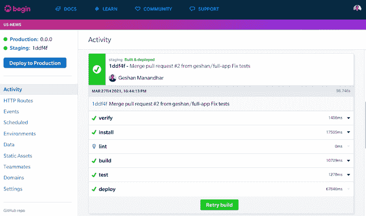

之后，如果我们检查暂存的网址，我们可以看到该应用程序的工作方式类似于我们的本地。我们可以通过点击上面页面左上角的 **staging** 链接来访问 Staging。

如果我们检查**数据**页面，我们可以看到我们的新闻故事数据也写在开始数据上:

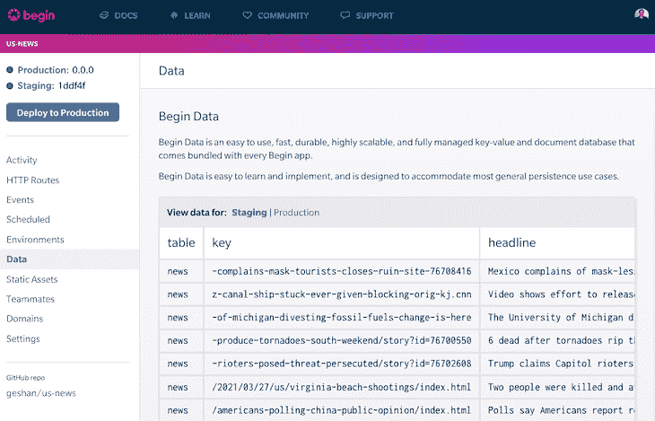

最后，我们将部署一个生产版本。点击 **Deploy to Production** 按钮，选择一个版本——我会选择`0.0.1`，发布通知为`0.0.1 first release`——然后点击**发货！**按钮:

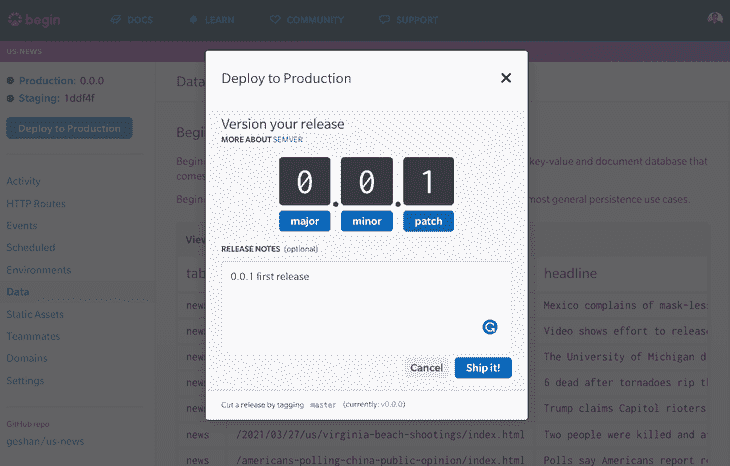

与试运行类似，它需要时间来构建，并通过为我们调配资源来进行部署:

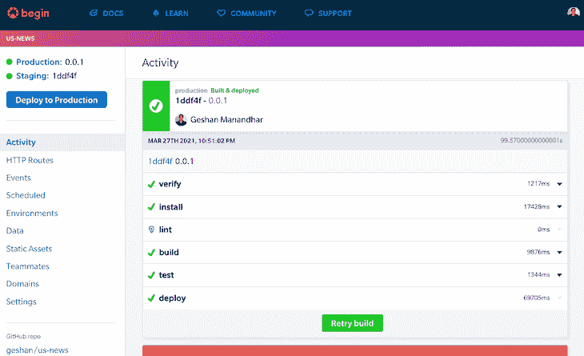

所有这些更新都可以通过**活动**链接获得。之后，我们可以检查应用程序在生产中的外观:

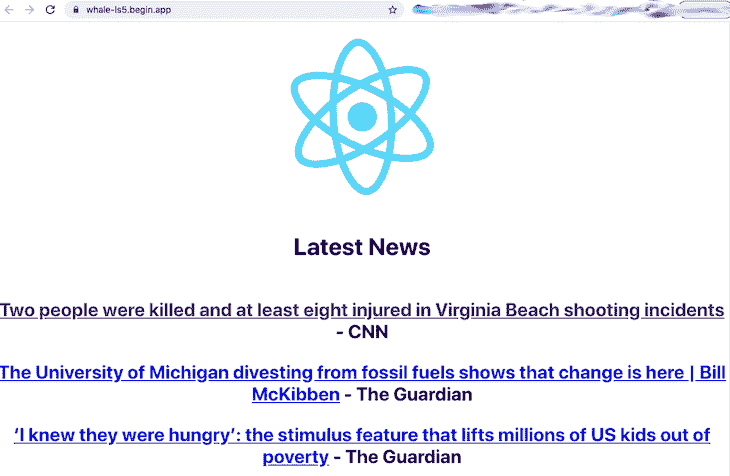

你可以查看我的 app 的[量产](https://whale-ls5.begin.app/)版本，看看效果如何。

## 后续步骤

Begin 还提供其他功能，比如预定功能。我们可以使用一个预定的函数来代替每 6 小时运行一次并填满我们的新闻表格的`fetch news` API。这也是我使用 6h TTL 的原因之一。

您还可以查看[事件函数](https://docs.begin.com/en/event-functions/provisioning)，它可以为任何需要队列的功能替换队列。该示例描述了一个帐户验证电子邮件，这是使用队列的一个很好的选择，但它通过基于事件的方法得到了很好的解决。

您可能还想探索更多 Begin——例如，映射[自定义域](https://docs.begin.com/en/getting-started/domains/)是另一个很棒的特性。总而言之，Begin 在 AWS 服务的基础上提供了可靠的抽象，而不会把你束缚住。

## 结论

我们也看到了如何使用 Begin Data 在 Begin 上部署全栈 JavaScript 应用程序来存储我们的数据。我们可以利用 Begin 在同一个服务上托管一个完整的应用程序及其数据，而不是使用两三个数据、后端和前端服务。我希望你探索更多的 Begin 特性，比如预定函数和自定义域，以便轻松地部署你的想法，并使它工作起来更轻松。

## 使用 LogRocket 消除传统反应错误报告的噪音

[LogRocket](https://lp.logrocket.com/blg/react-signup-issue-free)

是一款 React analytics 解决方案，可保护您免受数百个误报错误警报的影响，只针对少数真正重要的项目。LogRocket 告诉您 React 应用程序中实际影响用户的最具影响力的 bug 和 UX 问题。

[ ](https://lp.logrocket.com/blg/react-signup-general) [  ](https://lp.logrocket.com/blg/react-signup-general) [LogRocket](https://lp.logrocket.com/blg/react-signup-issue-free)

自动聚合客户端错误、反应错误边界、还原状态、缓慢的组件加载时间、JS 异常、前端性能指标和用户交互。然后，LogRocket 使用机器学习来通知您影响大多数用户的最具影响力的问题，并提供您修复它所需的上下文。

关注重要的 React bug—[今天就试试 LogRocket】。](https://lp.logrocket.com/blg/react-signup-issue-free)