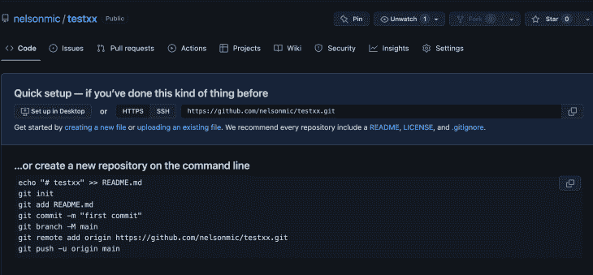
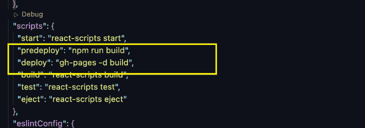
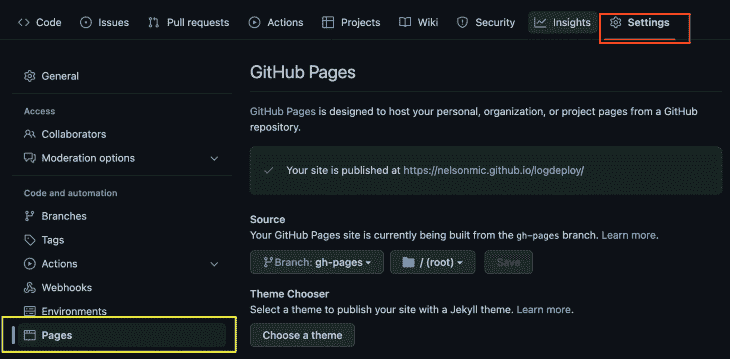
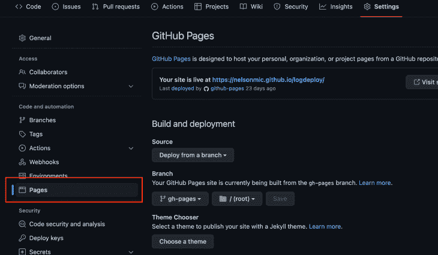
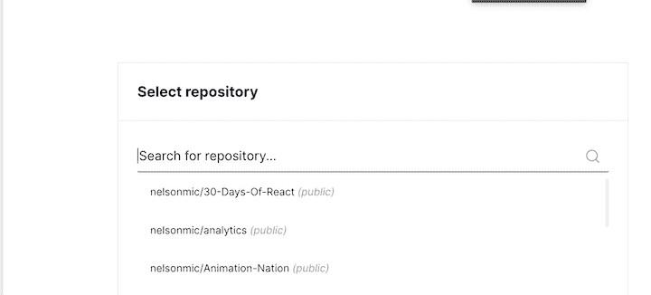
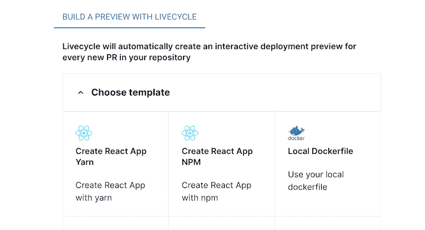
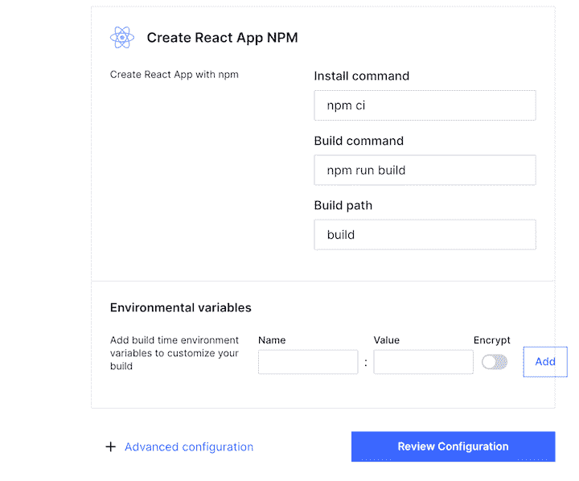

# 将 React 应用部署到 GitHub 页面

> 原文：<https://blog.logrocket.com/deploying-react-apps-github-pages/>

部署带有 GitHub 页面的静态网站的简单性可以很容易地转移到 React 应用程序中。只需几个步骤，就可以很容易地在 GitHub 页面上免费托管 React 应用程序，或者构建它以部署在您自己的自定义域或子域上。

在本文中，我们将探讨如何在 GitHub 页面上部署 React 应用程序。我们还将演示如何在 GitHub 页面上为我们的静态网站创建一个自定义域。

我们开始吧！

*向前跳转:*

## 先决条件

## 什么是 GitHub Pages？

GitHub Pages 是 GitHub 提供的一项服务，允许您将 HTML、JavaScript 和 CSS 文件添加到存储库中，并创建托管的静态网站。

网站可以托管在 GitHub 的`github.io`域(如`[https://username.github.io/repositoryname](https://username.github.io/repositoryname)`)或您自己的自定义域中。React 应用程序可以以类似的方式托管在 GitHub 页面上。

## 如何将 React 应用程序部署到 GitHub 页面

要将 React 应用程序部署到 GitHub 页面，请遵循以下步骤:

1.  设置 React 应用程序
2.  为您的项目创建一个 GitHub 资源库
3.  将 React 应用程序推送到 GitHub 存储库

### 设置 React 应用程序

让我们从[创建一个新的 React 应用程序](https://blog.logrocket.com/create-react-app-a-quick-setup-guide-b812f0aad03c/)开始。对于本教程，我们将使用`create-react-app`,但是你可以按照你喜欢的方式设置项目。

打开电脑上的终端，导航到您的首选目录。对于本教程，我们将在桌面目录中设置项目，如下所示:

```
cd desktop 

```

使用`create-react-app`创建一个 React 应用程序:

```
npx create-react-app "your-project-name"

```

只需几分钟，`create-react-app`将完成新 React 应用程序的设置！

现在，让我们导航到新创建的 React 应用程序项目目录，如下所示:

```
cd "your-project-name"

```

本教程仅限于演示如何将 React 应用程序部署到 GitHub 页面，因此我们将保持当前设置不变，不做任何其他更改。

### 创建 GitHub 存储库

下一步是创建一个 GitHub 存储库来存储我们项目的文件和修订。

在你的 GitHub 账户中，点击右上角的 **+** 图标，按照提示设置一个新的存储库。


成功创建存储库后，您应该会看到如下所示的页面:



厉害！让我们进行下一步。

### 将 React 应用程序推送到 GitHub 存储库

既然 GitHub 远程存储库已经设置好了，下一步就是在项目中初始化 Git，这样我们就可以跟踪变更，并使本地开发环境与远程存储库保持同步。

#### 跟踪和同步更改

使用以下命令初始化 Git:

```
git init

```

#### 将代码推送到 GitHub repo

现在，我们将提交代码并将其推送到 GitHub 上的分支。为此，只需复制并粘贴创建新存储库时收到的代码(参见上面的 repo 截图)。

```
git commit -m "first commit"
git branch -M main
git remote add origin https://github.com/nelsonmic/testxx.git
git push -u origin main

```

#### 添加 GitHub 页面依赖包

接下来，我们将在项目中安装`gh-pages`包。这个包允许我们将构建文件发布到 GitHub 上的一个`gh-pages`分支中，在那里它们可以被托管。

通过 npm 将`gh-pages`安装为开发依赖项:

```
npm install gh-pages --save-dev

```

#### 添加部署脚本

现在，让我们配置`package.json`文件，这样我们就可以将 GitHub 存储库指向 React 应用程序的部署位置。

我们还需要向`package.json`文件添加`predeploy`和`deploy`脚本。`predeploy`脚本用于捆绑 React 应用程序；`deploy`脚本部署捆绑的文件。

在`package.json`文件中，按照下面的结构添加一个`homepage`属性: `[http://](http://){github-username}.github.io/{repo-name}`

现在，让我们添加脚本。

在`package.json`文件中，向下滚动到`scripts`属性并添加以下命令:

```
"predeploy" : "npm run build",
"deploy" : "gh-pages -d build",

```

这里有一个视觉参考:



就是这样！我们已经完成了对`package.json`文件的配置。

#### 提交更改并将代码更新推送到 GitHub repo

现在，让我们提交我们的更改并将代码推送到我们的远程存储库，就像这样:

```
git add .
git commit -m "setup gh-pages"
git push

```

我们可以通过简单地运行:`npm run deploy`来部署 React 应用程序。这将创建一个 React 应用程序的捆绑版本，并将其推送到 GitHub 上的远程存储库中的一个`gh-pages`分支。

要查看我们部署的 React 应用程序，导航到**设置**选项卡，并点击**页面**菜单。您应该会看到一个到已部署的 React 应用程序的链接。



## 添加自定义域

我们可以免费将我们的 React 应用程序部署到 GitHub 的域中，但 Github Pages 也支持自定义子域 Apex 域。以下示例展示了每种类型的子域:

| **支持的自定义域** | **例子** |
| `www`子域 | `[http://www.logdeploy.com](http://www.logdeploy.com)` |
| 自定义子域 | `app.logdeploy.com` |
| 顶点域 | `logdeploy.com` |

现在，如果我们导航到[https://nelsonmic.github.io/logdeploy/](https://nelsonmic.github.io/logdeploy/)，就会看到我们最近发布的网站。但是，我们也可以使用自定义子域或顶点域代替。

下面是设置它们的步骤:

### 部署到 GitHub 自定义子域

1.  从您选择的域名服务提供商处购买域名(例如， [Namecheap](https://www.namecheap.com/) 或 [GoDaddy](https://www.godaddy.com/)
2.  将自定义域连接到 GitHub 页面。为此，点击**设置**选项卡上的**页面**菜单。接下来，向下滚动到**自定义域名**字段，输入新购买的域名。这将在您的库
    的根目录下自动创建一个带有`CNAME`文件的提交
3.  确保您的域服务提供商上的`CNAME`记录指向已部署网站的 GitHub URL(在本例中，是 nelsonmic.github.io/logdeploy/)。为此，导航到域名服务提供商的 **DNS 管理**页面，添加一个指向`username.github.io`的`CNAME`记录，其中`username`是您的 GitHub 用户名

### 部署到 GitHub Apex 域

要部署到 Apex 域，请遵循部署到自定义子域的前两个步骤，但用下面的步骤代替第三个步骤:

1.  导航到域服务提供商的 **DNS 管理**页面，添加一条`ALIAS`记录或`ANAME`记录，将您的 Apex 域指向您的 GitHub 页面 IP 地址，如图所示:

*   185.199.108.153
*   185.199.109.153
*   185.199.110.153
*   185.199.111.153

## 如何部署路由到 GitHub 页面的 React 应用程序

如果你之前已经部署了一个 React 应用程序，它使用 React 路由器路由到[N](https://www.netlify.com)T2，你会意识到你需要为你的 URL 配置重定向。如果没有重定向，当用户试图导航到应用程序的不同部分时，将会出现 404 错误。

Netlify 使得为你的 URL 配置重定向和重写规则变得简单。你需要做的就是在应用的公共文件夹中创建一个名为`_redirects`(没有任何扩展名)的文件。

然后，只需在文件中添加以下重写规则:

```
/*    /index.html  200

```

无论浏览器请求什么 URL，这个重写规则都将传递`index.html`文件，而不是返回 404。

如果我们想在部署到 GitHub 页面时处理页面路由，我们需要做一些类似的事情。让我们为之前部署的项目配置路由。

首先，我们需要安装一个路由器。首先在项目目录中安装 React 路由器，如下所示:

```
npm install react-router-dom

```

现在，遵循以下四个步骤。

步骤 1:将一个`HashRouter`连接到应用程序以启用客户端路由:

```
import React from 'react';
import ReactDOM from 'react-dom/client';
import './index.css';
import App from './App';
import reportWebVitals from './reportWebVitals';
import { HashRouter as Router } from "react-router-dom";

const root = ReactDOM.createRoot(document.getElementById('root'));
root.render(
    <Router>
      <App />
    </Router>
);
// If you want to start measuring performance in your app, pass a function
// to log results (for example, reportWebVitals(console.log))
// or send to an analytics endpoint. Learn more: https://bit.ly/CRA-vitals
reportWebVitals();

```

我们的`index.js`文件应该类似于上面的代码块。由于 GitHub Pages 不支持浏览器历史，我们使用了一个`HashRouter`。我们现有的路径不能帮助 GitHub Pages 确定将用户导向何处(因为它是一个前端路径)。
为了解决这个问题，我们必须用一个`HashRouter`替换我们应用的浏览器路由器。此路由器使用 URL 的哈希部分来保持 UI 与 URL 同步。

步骤 2:创建路线:


创建一个`routes`文件夹和需要的路线。这些路线可以在`app.js`文件中配置。但是首先，让我们创建一个在所有页面上都可见的`Navbar`组件。

第 3 步:创建一个`Navbar`组件:

```
>import { Link } from "react-router-dom"
const Navbar =()=>{
      return (
            <div>
                  <Link to="/">Home</Link>
                  <Link to="/about">About</Link>
                  <Link to="/careers">Careers</Link>
            </div>
      )
}
export default Navbar;

```

现在我们可以将`Navbar`组件添加到`app.js`文件中已配置的路由旁边。

第四步:在`app.js`文件中设置路线:

```
import './App.css';
import { Routes, Route} from "react-router-dom";
import About from "./routes/About";
import Careers from "./routes/Careers";
import Home from "./routes/Home";
import Navbar from './Navbar';
function App() {
  return (
    <>
      <Navbar />
      <Routes>
        <Route path="/" element={<Home />} />
        <Route path="/about" element={<About />} />
        <Route path="/careers" element={<Careers />} />
      </Routes>
    </>
  );
}
export default App;

```

现在我们已经完成了设置，让我们像这样推送代码:

```
>git add .
git commit -m "setup gh-pages"
git push

```

接下来，我们只需简单地进行部署，我们的应用程序就能正确路由:

```
>npm run deploy

```

一旦这些步骤完成，我们部署的应用程序将正确地将用户路由到他们想要的应用程序的任何部分。

## 设置预览环境

当我们配置 Netlify 部署时，在它被合并到主分支之前，我们会得到一个预览链接来查看我们的部署。让我们为 GitHub 页面创建同样的页面。

为此，我们将使用一个简单的工具，名为[李](https://livecycle.io/)、【vecycle】T3，这样可以省去我们使用 GitHub Actions 的麻烦。每次我们在存储库中发出“拉”请求时，Livecycle 都会帮助我们创建一个预览环境。

要创建预览环境，请按照下列步骤操作:

1.  设置 Livecycle 帐户；我建议注册你的 GitHub 账户
2.  配置一个新项目，并将其连接到 GitHub
3.  一旦您连接到 GitHub 并授予 Livecycle 所需的所有访问权限，您就可以在
    上选择您想要设置预览的存储库

根据项目的技术体系选择模板。对于我们的例子，我们将选择**创建反应应用** **NPM** ，因为我们的项目是使用 create-react-app 构建的:



1.  检查配置并部署。对于我们的例子，我们不需要添加任何配置:
    

一旦部署成功，任何时候我们制作 PR 或提交 PR，我们都会得到一个预览链接。

## 结论

GitHub Pages 易于上手且免费使用，对于所有技能水平的开发人员来说，这是一个非常有吸引力的选择。

在本文中，我们演示了如何使用 GitHub 页面将 React 应用程序转换为静态网站。我们展示了如何将 React 应用程序部署到 GitHub 的域，以及自定义子域。如果你正在寻找一种简单的方式与世界分享你的代码，GitHub Pages 是一个很好的选择。

## 使用 LogRocket 消除传统反应错误报告的噪音

[LogRocket](https://lp.logrocket.com/blg/react-signup-issue-free)

是一款 React analytics 解决方案，可保护您免受数百个误报错误警报的影响，只针对少数真正重要的项目。LogRocket 告诉您 React 应用程序中实际影响用户的最具影响力的 bug 和 UX 问题。

[ ](https://lp.logrocket.com/blg/react-signup-general) [  ](https://lp.logrocket.com/blg/react-signup-general) [LogRocket](https://lp.logrocket.com/blg/react-signup-issue-free)

自动聚合客户端错误、反应错误边界、还原状态、缓慢的组件加载时间、JS 异常、前端性能指标和用户交互。然后，LogRocket 使用机器学习来通知您影响大多数用户的最具影响力的问题，并提供您修复它所需的上下文。

关注重要的 React bug—[今天就试试 LogRocket】。](https://lp.logrocket.com/blg/react-signup-issue-free)