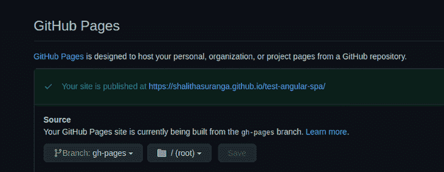
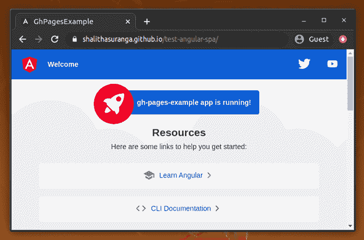
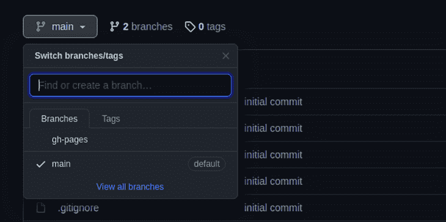

# 将单页 Angular 应用程序部署到 GitHub 页面- LogRocket 博客

> 原文：<https://blog.logrocket.com/deploying-single-page-angular-apps-to-github-pages/>

有两种主要的 web 应用程序开发方法:多页面和单页面。多页面方法通常使用紧密耦合的后端技术，如 PHP 或。净 MVC。

典型的单页面 web 应用程序有一个松散耦合的后端。换句话说，单页 web 应用程序将客户端和服务器端代码分开。

现在，单页面开发方法很流行，因为它带来了更高的可维护性、令人印象深刻的用户体验和良好的缓存支持。像 Angular、React、Svelte 和 Vue.js 这样的前端框架可以用于单页面 web 应用程序开发。

然而，我们需要一个静态文件服务器来在互联网上发布特定单页应用程序的客户端代码。你可以在云服务上创建自己的静态文件服务器，也可以使用 GitHub Pages 这样的静态文件托管服务，这是一项免费服务，有很多好处。

在本教程中，我将向您展示如何将 Angular 应用程序部署到 GitHub 页面中。

## GitHub 页面的优势

GitHub Pages 是一项免费服务，允许开发者将其代码库部署为静态网站。换句话说，当您使用 GitHub 页面时，您可以通过 GitHub 存储库将您的 HTML、JavaScript 和类似 CSS 的 web 内容公开为网站，并且您还可以访问 GitHub 的所有其他好处和服务。例如，您可以集成 [GitHub Actions 服务](https://blog.logrocket.com/github-actions-how-to-autodeploy-your-app/)来为您的单页面应用程序运行一些角度单元测试。

此外，GitHub Pages 为你提供了一个免费的`github.io`子域。如果你已经有了域名，你也可以很容易地使用它。

## 用 Angular 创建单页应用程序

如果你[已经有一个你想在本教程中使用的角度应用](https://blog.logrocket.com/tag/angular/)，你可以[跳到下一节](#deploying-your-angular-app-into-github-pages)。

Angular 提供了一个 CLI，我们可以用它来创建和管理 Angular 应用程序。Angular CLI 还会为给定的原理图自动生成初始代码。输入以下命令安装 CLI。

```
$ npm install -g @angular/cli

```

然后，输入以下命令来搭建一个新的应用程序。

```
$ ng new yourappname

```

一旦创建了初始文件，您就可以启动本地开发服务器来查看您新创建的应用程序。

```
$ cd yourappname
$ ng serve --open

```

之后，根据需要创建组件来实现您的 web 应用程序。因为 Angular 支持热模块重载，所以您甚至可以在没有完全重载应用程序的情况下测试应用程序逻辑。

## 将 Angular 应用程序部署到 GitHub 页面中

首先，您需要为您的静态网站创建一个 GitHub 存储库。如果您还没有将代码存储在 GitHub 中，请创建一个新的存储库。如果你需要让你的网站工作在你的`github.io`子域的根，把你的库命名为`<username>.github.io`。否则，你的网站将被发布到`<username>.github.io/<repositoryname>`。您也可以使用自定义域作为 GitHub 存储库的名称。

默认情况下，Angular CLI 会为您初始化一个 Git 存储库。因此，您需要添加一个新的远程引用，指向您的新 GitHub 存储库，以推送您的代码和静态文件。

输入以下代码来设置新的远程引用。

```
$ git remote add origin https://github.com/<username>/<repositoryname>.git

```

由于 Angular CLI 本身不支持 GitHub Pages 部署，您需要通过输入以下命令来添加 Angular GitHub Pages 外部库:

```
$ ng add angular-cli-ghpages

```

上述命令将通过添加 GitHub Pages 部署支持来扩展 CLI。

现在，CLI 已经准备好将您的应用程序部署到 GitHub 页面中。您可以使用`deploy`命令来部署您当前的 Angular 应用程序，如下所示。

```
$ ng deploy --base-href=/<repositoryname>/

```

上面的命令将构建您的应用程序，并将最终的静态文件推送到`gh-pages`分支。在第一次成功部署之后，GitHub 将自动为新的存储库启用 GitHub Pages 特性。更多信息可以在 GitHub 页面部分下的**设置**选项卡中找到，如下所示。



您的网站应该可以通过`[https://<username&gt](https://<username&gt);.github.io/<repositoryname>`访问。您可以看到我创建的示例应用程序正在运行:



## 何时传递基本 URL

`deploy`命令中的`--base-href`选项将用`href`属性设置 HTML `<base>`标签。如果您将您的应用程序发布到您的`github.io`子域或自定义域的根，您不需要传递这个值，因为默认情况下，web 浏览器将尝试从根目录加载资源。但是，如果您需要将一个 Angular 应用程序发布到一个非根位置，就像下面的例子一样，您应该明确地提到基本 URL。否则，浏览器将无法正确加载应用程序的资源。

*   对于`yourcustomdomain.com/angularapp`，基本 URL 应该是`/angularapp/`
*   对于`yourusername.github.io/myapp`，基本 URL 应该是`/myapp/`

如上所述，如果您将应用程序部署到自定义域的子目录中，您必须使用子目录作为基本 URL。

## 构建您的开发工作流程

Web 应用程序通常需要频繁的更新、改进和扩展，这需要经常更改应用程序的源代码。一旦我们完成了更新，我们必须将我们的更改部署到 GitHub 页面中。我们可以使用`main`分支来维护您的应用程序的源代码。像往常一样，`gh-pages`分支对于最终的静态文件是反向的。



正如每个开发团队所做的那样，我们可以为我们的开发需求建立不同的分支。

## 局限性和结论

作为一项免费服务，GitHub Pages 有一些小的限制。静态内容大小限制为 1GB，因此您将无法上传巨大的媒体文件。GitHub Pages 也有每月 100GB 的带宽限制。

GitHub Pages [并不推荐](https://docs.github.com/en/pages/getting-started-with-github-pages/about-github-pages#prohibited-uses)其托管电子商务网站的服务，但该工具对于寻求发布开源网络应用程序的开发者来说仍然很棒，例如面向开发者的服务、文档、游戏、登录页面、博客和其他类型的内容。如果你正在寻找一个稍微强大一点的解决方案堆栈， [LAMG](https://github.com/codezri/lamgstack) 可以免费帮助你将一个完整的单页面应用程序部署到 GitHub 页面中。

## 像用户一样体验 Angular 应用程序

调试 Angular 应用程序可能很困难，尤其是当用户遇到难以重现的问题时。如果您对监视和跟踪生产中所有用户的角度状态和动作感兴趣，

[try LogRocket](https://lp.logrocket.com/blg/angular-signup)

.

[](https://lp.logrocket.com/blg/angular-signup)[https://logrocket.com/signup/](https://lp.logrocket.com/blg/angular-signup)

LogRocket 就像是网络和移动应用程序的 DVR，记录你网站上发生的一切，包括网络请求、JavaScript 错误等等。您可以汇总并报告问题发生时应用程序的状态，而不是猜测问题发生的原因。

LogRocket NgRx 插件将角度状态和动作记录到 LogRocket 控制台，为您提供导致错误的环境，以及出现问题时应用程序的状态。

现代化调试 Angular 应用的方式- [开始免费监控](https://lp.logrocket.com/blg/angular-signup)。